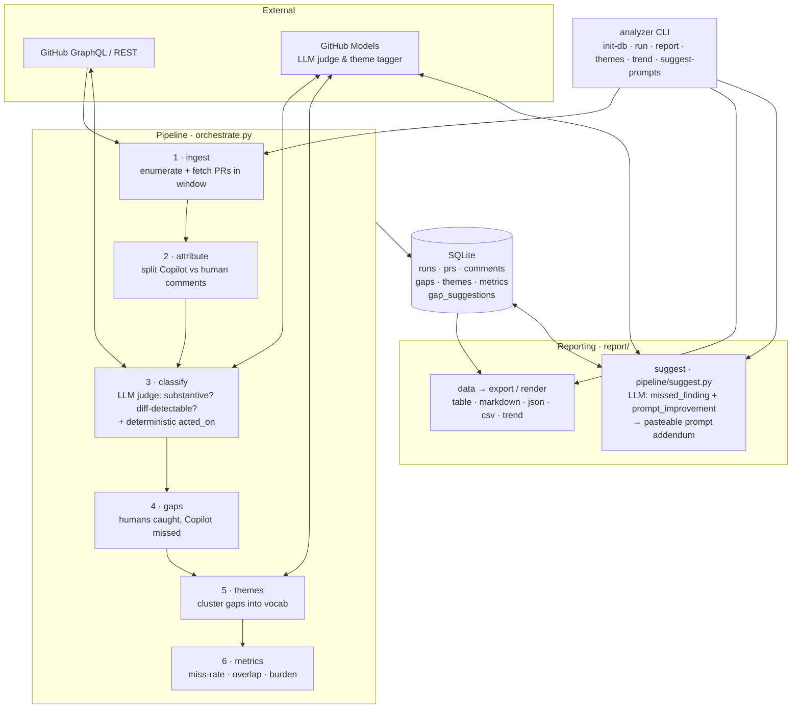

# Copilot Code-Review Effectiveness Analyzer

Periodically mines recently closed/merged PRs, separates Copilot-reviewer comments
from human comments, uses an LLM judge to find substantive, diff-detectable issues
humans caught but Copilot missed, clusters them into themes, and tracks
miss-rate / precision metrics over time.

See [`DESIGN.md`](DESIGN.md) for architecture and [`IMPLEMENTATION_PLAN.md`](IMPLEMENTATION_PLAN.md)
for the phased build plan.

## Architecture



| Stage | Module | Responsibility |
| --- | --- | --- |
| Ingest | `pipeline/ingest.py` + `github/` | Enumerate PRs in a time window and fetch normalized PR data (resilient to per-PR fetch failures). |
| Attribute | `pipeline/attribute.py` | Classify each comment as Copilot / human / other bot; detect overlap. |
| Judge | `pipeline/classify.py` + `llm/` | LLM judges whether each human comment is substantive & diff-detectable; deterministic `acted_on` linkage. |
| Gaps | `pipeline/gaps.py` | A *gap* = substantive, diff-detectable issue a human raised that Copilot missed. |
| Themes | `pipeline/themes.py` + `llm/` | LLM clusters gaps into a controlled vocabulary for trending. |
| Metrics | `pipeline/metrics.py` | Per-run miss-rate, overlap rate, acted-on rate, human burden. |
| Suggest | `pipeline/suggest.py` + `llm/suggest.py` | On-demand: turn each gap into a PR-specific `missed_finding` + generalizable `prompt_improvement`, synthesized into a pasteable prompt addendum. |
| Report | `report/` | Read-only views: table / markdown / json / csv + multi-run trend; surfaces suggestions. |

All state lives in a single SQLite file (`analyzer.db`) — the seam between the write
pipeline and read-only reporting; every model call funnels through `llm/client.py` and
every GitHub call through `github/client.py`.

## Getting started

```bash
# 1. Install (one-time) and authenticate
pip install -e .
export GITHUB_TOKEN=$(gh auth token)

# 2. Analyze the last 7 days of merged PRs (real LLM judge + theme tagging)
analyzer run --repo Azure/azure-sdk-for-python --since 7d --use-llm

# 3. Read the report
analyzer report
```

That's it. Common follow-ups:

```bash
# Bigger / different window, capped sample
analyzer run --repo Azure/azure-sdk-for-python --since 14d --max-prs 40 --use-llm

# Report in other formats (table is the default)
analyzer report --format markdown      # paste into an issue
analyzer report --format json          # machine-readable

# What did humans catch that Copilot missed? (recurring themes)
analyzer themes --min-count 2

# Turn those misses into prompt fixes you can paste into your Copilot review prompt
analyzer suggest-prompts

# Track a metric across past runs
analyzer trend --metric miss_rate

# Peek at PRs without writing anything (no LLM, no DB changes)
analyzer run --repo Azure/azure-sdk-for-python --since 7d --dry-run
```

All commands default to `--db analyzer.db` and `--run latest`; pass `--db <path>` to use
a separate database. Run `analyzer <command> --help` for every option.

## Install

```bash
pip install -e ".[dev]"
```

## Usage

```bash
analyzer init-db --db analyzer.db
analyzer run --repo owner/name --since 7d [--state merged] [--max-prs 50] [--dry-run] [--use-llm]
analyzer report [--run latest] [--format table|markdown|json]
analyzer themes [--run latest] [--min-count 2]
analyzer suggest-prompts [--run latest]
analyzer trend --metric miss_rate
```

`--use-llm` enables the real LLM judge and theme tagging via [GitHub Models]; without
it a stub judge marks every human comment substantive (useful for plumbing/tests).

### Turning misses into prompt improvements (`suggest-prompts`)

`analyzer suggest-prompts` asks the LLM to inspect every *gap* (a substantive,
diff-detectable issue a human caught that the Copilot reviewer missed) and, for each,
store two things in the `gap_suggestions` table:

- **`missed_finding`** — a PR-specific description of exactly what Copilot should have
  flagged at that line.
- **`prompt_improvement`** — a generalizable review rule that would catch this class of
  issue in the future.

It then prints a paste-ready **"Suggested review-prompt additions"** block (rules grouped
by theme, deduplicated, and annotated with the PRs that motivated them) that you can drop
straight into your Copilot review prompt. The same per-gap findings and addendum are also
surfaced by `analyzer report` (table / markdown / json), so any report view shows what was
missed and how to fix the prompt.

## Metrics & classification

This section defines every term that shows up in a report so the numbers are unambiguous.

### How comments are classified

Each PR review comment is processed in two stages:

1. **Attribution (deterministic, no LLM).** Every comment's author is labelled
   `author_kind`:
   - **`copilot`** — login matches one of the configured `copilot_logins` (matched
     case-insensitively after stripping a trailing `[bot]`).
   - **`other_bot`** — any other login ending in `[bot]`, or a missing/empty author.
   - **`human`** — everything else.

2. **LLM judge (only with `--use-llm`).** Every *human* comment is judged **from the
   visible diff hunk alone** and gets:
   - **`is_substantive`** — `true` if it identifies a real code-quality issue (bug,
     security, performance, design/API, or missing test). Style nitpicks, typos, praise,
     questions, and social chatter are **not** substantive.
   - **`diff_detectable`** — `true` if a competent automated reviewer could plausibly
     raise the issue from the diff alone, without external context. The judge is
     deliberately conservative: anything relying on outside knowledge is `false`.
   - **`category`** — exactly one of `bug`, `security`, `perf`, `design`, `test-gap`,
     `docs`, `nit`, `style`, `question`, `social`. The first five are the "substantive"
     categories.
   - **`confidence`** — the judge's self-rated certainty, `0.0`–`1.0`.
   - **`rationale`** — a one-sentence justification.

   Without `--use-llm`, a stub judge marks every human comment substantive — useful for
   plumbing, but not meaningful for the metrics below.

### Confidence buckets

Comments are partitioned by `confidence` against the configured `confidence_threshold`:

- **judged** — confidence present and `>= threshold` (the only comments that count toward
  metrics and gaps).
- **unjudged** — confidence is NULL (the model could not classify it).
- **low-confidence** — confidence present but `< threshold`.

If the unjudged fraction exceeds `max_unjudged_ratio`, the whole run is marked failed so a
half-judged run can't skew the headline numbers.

### Overlap and gaps

- **`copilot_overlap`** — set on a human comment when its file + line range intersects a
  Copilot comment's range (same `path`, same coordinate space, within `line_fuzz` lines).
  NULL when the human comment has no comparable line range.
- **gap** — a *judged, confident, substantive, diff-detectable* human comment that was
  **not** overlapped by any Copilot comment. In short: something a human caught at a line
  Copilot reviewed (or could have) but Copilot missed. This is the central unit the tool
  tracks.
- **`acted_on`** — best-effort precision proxy for Copilot comments: `true` if a commit
  *after* the comment touched the file it pointed at, `false` if not, NULL when path data
  is unavailable (or the PR is too large to fetch cheaply).

### Per-run counters

- **`substantive_human_count`** — judged, confident human comments with `is_substantive = 1`.
- **`copilot_comment_count`** — all Copilot comments in the run.
- **`gap_count`** — number of gaps (definition above).
- **`judged_human_count` / `unjudged_human_count` / `low_confidence_human_count`** — the
  confidence-bucket sizes for human comments.

### Headline metrics

Any metric whose denominator is `0` is reported as NULL rather than `0`.

| Metric | Definition |
| --- | --- |
| **`miss_rate`** | `gaps / substantive-and-diff-detectable judged human comments` — of the issues Copilot *could* have caught, the fraction it missed. **Lower is better.** |
| **`copilot_overlap_rate`** | `overlapped substantive human / substantive human` — fraction of substantive human findings Copilot also commented on. **Higher is better.** |
| **`human_burden_per_pr`** | `substantive human comments / PR count` — average substantive human review effort per PR. |
| **`copilot_acted_on_rate`** | `acted-on Copilot comments / Copilot comments with known path data` — precision proxy; NULL until `acted_on` data exists. |

Use `analyzer trend --metric miss_rate` (or any metric name above) to watch these move
across runs.

## Configuration

Copy `config.yaml` and adjust `repos`, `copilot_logins`, `model`, sampling, and the
theme `vocab`. Secrets come only from the environment (`GH_TOKEN` / `GITHUB_TOKEN`).

## Scheduled analysis (`.github/workflows/analyze.yml`)

A weekly workflow (plus `workflow_dispatch`) runs `analyzer run --use-llm`, renders a
markdown report, and opens/updates a single labelled summary issue (idempotent — it
edits the existing open issue rather than spamming new ones). Proposed prompt changes
are surfaced in the issue for **human approval only**; nothing edits the prompts
automatically.

**DB persistence strategy:** the SQLite DB is committed to a dedicated orphan branch
`analyzer-data` so weekly trends accumulate durably across runs, *and* uploaded as a
per-run artifact for audit. (A cache was rejected because eviction would silently break
long-term trend continuity.)

**Tokens:** `GITHUB_TOKEN` covers repo reads, issue writes, and the data-branch push.
Set the optional `ANALYZER_PAT` secret for cross-repo reads or higher GitHub Models
limits — it is preferred when present. Tokens are never echoed (no `set -x`).

[GitHub Models]: https://models.inference.ai.azure.com
