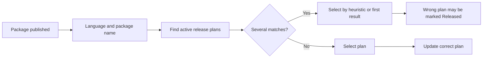
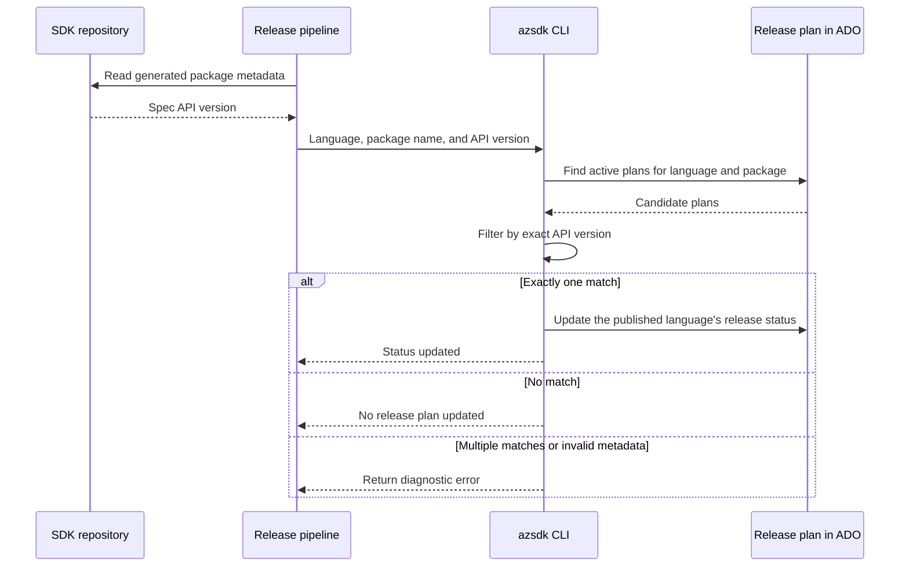
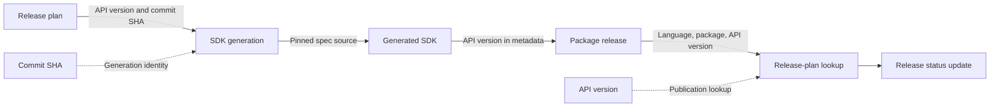

# Release-plan status lookup after package publication

Related issues: [#16844](https://github.com/Azure/azure-sdk-tools/issues/16844) and [#16868](https://github.com/Azure/azure-sdk-tools/issues/16868)

## Decision requested

Approve using **SDK language + package name + spec API version** to identify the release plan whose package status should be updated after publication.

The status command updates ADO only when those values resolve to exactly one active release plan. It does not select a plan by fallback heuristic when metadata is missing or the result is ambiguous.

## Problem

The release pipeline currently identifies a release plan mainly by SDK language and package name. When several active plans reference the same package, the CLI can select the wrong one. An unrelated release can then appear on the dashboard as the result of a newer plan or incorrectly complete that plan.

## Lookup contract

The lookup requires three inputs:

| Required input | Source | Purpose |
| --- | --- | --- |
| SDK language | Release pipeline | Selects the language-specific SDK entry |
| Package name | Release pipeline | Identifies the published SDK package |
| Spec API version | Generated SDK metadata defined by [#16868](https://github.com/Azure/azure-sdk-tools/issues/16868) | Distinguishes plans targeting different APIs |

The following existing values remain optional result metadata. They are recorded when available but are not lookup keys and do not block an otherwise valid status update.

| Optional metadata | Source | Purpose |
| --- | --- | --- |
| Package version | Published artifact | Records the exact SDK version released |
| Pipeline URL | Release pipeline | Links to the release run for traceability |

The spec API version is not the semantic SDK package version. For example, API version `2026-07-01` and package version `7.1.0` represent different values.

## Proposed flow

Existing package-version and pipeline-URL recording and the existing release-plan completion check remain unchanged.

## Matching rules

1. Extract the API version from the exact SDK package being published using the language-specific metadata rules from #16868. Do not infer it from the package version or substitute a default or latest API version.
2. Require one unambiguous API version. Missing, malformed, or unresolved multiple values prevent the release-plan update.
3. Find in-progress, not-yet-released entries matching the normalized SDK language, exact package name, and exact saved spec API version.
4. If a release-plan ID is supplied, require it to identify the same unique match. The ID is a consistency check and does not override conflicting lookup values.
5. Update only when exactly one plan matches. Never select a plan using SDK release type, merged PR status, newest-plan ordering, or first-result fallback.
6. When no unique match exists, make no ADO changes and return the lookup values, candidate plan IDs, and reason.

## Outcomes

| Lookup result | Release-plan action |
| --- | --- |
| Exactly one match | Update the published language's release status in that plan |
| No match | Make no ADO changes and report that no plan was updated |
| Multiple matches | Make no ADO changes and report the ambiguity and candidate plan IDs |
| Missing, malformed, or ambiguous API-version metadata | Make no ADO changes and report the metadata problem |
| Supplied release-plan ID conflicts with the lookup | Make no ADO changes and report the conflict |

A no-match result can be normal for an independent SDK-only bug-fix release that has no release plan. In that case, the command reports that no plan was updated; it does not reinterpret a successful package publication as a publication failure.

## Workflow boundaries

The commit-SHA work in [#16848](https://github.com/Azure/azure-sdk-tools/issues/16848) prevents API drift during SDK generation. This proposal addresses a different boundary: after package publication, the SDK-side pipeline uses language, package name, and API version because it does not carry the spec commit SHA.

## Limitation and future correlation

The three lookup values identify the likely plan but do not prove that the release originated from it. An unrelated bug-fix release can use the same language, package, and API version as an active plan.

A stronger future solution is to propagate a validated release-plan ID from generation through the SDK PR, build, and publication. Carrying that ID through the workflow would distinguish a planned release from an unrelated release with otherwise identical lookup values. The immediate #16844 solution remains language + package name + API version.

## Acceptance criteria

- A release updates the plan matching its language, package name, and API version when exactly one match exists.
- Parallel plans for the same package but different API versions update independently.
- Zero matches produce no ADO writes and do not turn an independent successful package publication into a publication failure.
- Multiple plans with the same lookup values produce no ADO writes.
- Missing, malformed, or unresolved multiple API versions produce no ADO writes.
- A conflicting explicit release-plan ID produces no ADO writes.
- Missing optional package version or pipeline URL does not block a uniquely matched status update.
