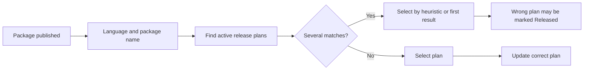
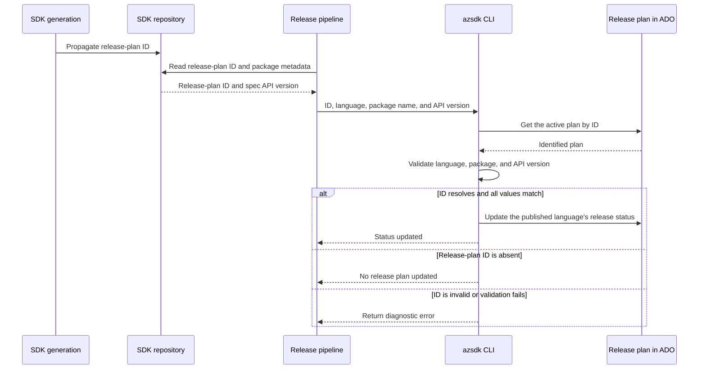
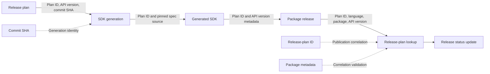

# Release-plan status lookup after package publication

Related issues: [#16844](https://github.com/Azure/azure-sdk-tools/issues/16844) and [#16868](https://github.com/Azure/azure-sdk-tools/issues/16868)

## Decision requested

Approve propagating the **release-plan ID** from SDK generation through package publication, then validating it against **SDK language + package name + spec API version** before updating release status.

The status command updates ADO only when the ID resolves to exactly one active release plan and all three validation values match. It does not search for a substitute plan when the ID or metadata is missing or inconsistent.

## Problem

The release pipeline currently identifies a release plan mainly by SDK language and package name. When several active plans reference the same package, the CLI can select the wrong one. An unrelated release can then appear on the dashboard as the result of a newer plan or incorrectly complete that plan.

## Lookup contract

Updating a release plan requires four inputs:

| Required input | Source | Purpose |
| --- | --- | --- |
| Release-plan ID | SDK generation, propagated through the SDK PR, build, and release pipeline | Directly correlates the package release with the plan that initiated it |
| SDK language | Release pipeline | Selects the language-specific SDK entry |
| Package name | Release pipeline | Identifies the published SDK package |
| Spec API version | Generated SDK metadata defined by [#16868](https://github.com/Azure/azure-sdk-tools/issues/16868) | Validates that the released package targets the plan's API |

The following existing values remain optional result metadata. They are recorded when available but are not lookup keys and do not block an otherwise valid status update.

| Optional metadata | Source | Purpose |
| --- | --- | --- |
| Package version | Published artifact | Records the exact SDK version released |
| Pipeline URL | Release pipeline | Links to the release run for traceability |

The spec API version is not the semantic SDK package version. For example, API version `2026-07-01` and package version `7.1.0` represent different values.

## Proposed flow

Existing package-version and pipeline-URL recording and the existing release-plan completion check remain unchanged.

## Matching rules

1. Propagate the release-plan ID associated with SDK generation through the SDK PR, build, and release pipeline. Do not derive or guess an ID during publication.
2. Extract the API version from the exact SDK package being published using the language-specific metadata rules from #16868. Do not infer it from the package version or substitute a default or latest API version.
3. Require the ID to resolve to exactly one active, in-progress plan whose language-specific release status is not already `Released`.
4. Validate that the identified plan contains the normalized SDK language, exact package name, and exact saved spec API version supplied by the release pipeline.
5. Update only when the ID resolves uniquely and every validation value matches. The ID does not override conflicting package metadata.
6. Never search for a substitute plan using SDK release type, merged PR status, newest-plan ordering, or first-result fallback.
7. When the ID is absent, unresolved, duplicated, or inconsistent with the validation values, make no ADO changes and return the ID, validation values, candidate work item IDs when applicable, and reason.

## Outcomes

| Correlation result | Release-plan action |
| --- | --- |
| ID resolves to one active plan and all values match | Update the published language's release status in that plan |
| No release-plan ID | Make no ADO changes and report that no plan was updated |
| ID does not resolve to exactly one active plan | Make no ADO changes and report the unresolved or duplicate ID |
| Missing, malformed, or ambiguous API-version metadata | Make no ADO changes and report the metadata problem |
| Language, package name, or API version conflicts with the identified plan | Make no ADO changes and report the conflict |

A missing ID can be normal for an independent SDK-only bug-fix release that has no release plan. In that case, the command reports that no plan was updated; it does not reinterpret a successful package publication as a publication failure.

## Workflow boundaries

The commit-SHA work in [#16848](https://github.com/Azure/azure-sdk-tools/issues/16848) prevents API drift during SDK generation. This proposal addresses a different boundary: the release-plan ID preserves correlation through package publication, while language, package name, and API version verify that the correlated result still matches the plan.

## Why the ID and validation values are both required

Language, package name, and API version identify a likely plan but do not prove that the release originated from it. An unrelated bug-fix release can use the same values as an active plan. The propagated release-plan ID provides that direct correlation.

The ID alone is also insufficient because it can be stale, malformed, or attached to the wrong artifact. Validating language, package name, and API version prevents an incorrect ID from updating an unrelated plan.

## Acceptance criteria

- A planned release carries its release-plan ID from SDK generation through the release pipeline.
- A release updates the plan only when the ID resolves to exactly one active plan and its language, package name, and API version all match.
- Parallel plans for the same package but different API versions update independently.
- A release without a release-plan ID produces no ADO writes and does not turn an independent successful package publication into a publication failure.
- An unresolved or duplicate release-plan ID produces no ADO writes.
- Missing, malformed, or unresolved multiple API versions produce no ADO writes.
- A language, package-name, or API-version mismatch produces no ADO writes.
- Missing optional package version or pipeline URL does not block a uniquely matched status update.
