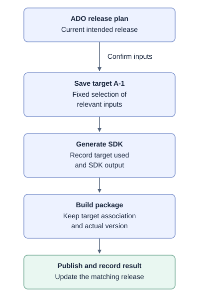
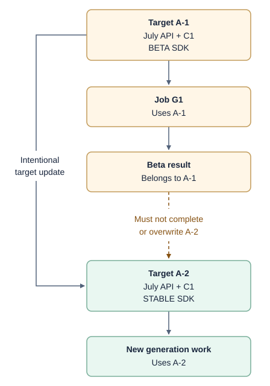

# Release target: keep the original release instructions with the work

---

## 1. What is a release target?

**A release target is a saved copy of the instructions for a particular SDK release.**

A release plan describes what the team currently wants to release. A target records exactly what a particular generation/build was asked to produce, even if the plan changes later.

For example, target **A-1** could contain:

| Information | Example |
| --- | --- |
| Release plan | Plan A |
| Spec repository and project | Azure Policy TypeSpec project |
| API version | July GA API |
| Exact spec source | Commit C1 |
| SDK release type | Beta |
| Expected packages | Selected language/package identities |

**A-1 is an illustrative name for that saved selection, not a required new global identifier.**

The target does not contain the entire work item. Owner emails, release dates and display names stay in planning records. Build IDs, SDK commits and published package versions are added as results when they become known.

---

## 2. What would change?

Today, different stages can read the plan at different times or choose defaults independently. That can cause an old job's result to be interpreted using new instructions.

The proposed rule is:

**Save the agreed instructions when work starts.** Keep each output associated with those instructions. Do not silently reinterpret earlier work using the plan's latest values.

This is the proposed flow, not an assertion that the target association already survives every repository and pipeline boundary.

There are two distinct actions:

- **Regenerate:** use the same saved instructions again.
- **Update the target:** intentionally change the instructions and save a new selection. Existing jobs still belong to their original selection.

---

## 3. Where would it live, and what would it attach to?

**It attaches to release work and its outputs—not permanently to every TypeSpec project.**

An initial implementation could use the existing pipeline infrastructure:

| Location | What it holds |
| --- | --- |
| **ADO release-plan work item** | The editable plan and current selected inputs; remains our plan database |
| **Generation build record / retained pipeline artifact** | The fixed copy of inputs used for that work, plus its run identity |
| **SDK output and package build metadata** | A reference back to that exact saved selection, with actual SDK source/package details |
| **Release result** | The package that was actually published and the saved selection it belongs to |

For a small first step, the saved build inputs can serve as the snapshot. If a portable representation is needed between pipelines, store it as a **pipeline-owned artifact**, rather than a new file beside every TypeSpec project.

The reference must resolve to the original selection—not “fetch the latest Plan A.” Its retention must cover the work that depends on it.

**This does not assume the connection already exists everywhere.** Passing and validating it across SDK PR, build and release boundaries is part of the proposed work. The exact metadata carrier at those boundaries needs agreement with the pipeline/language owners.

---

## 4. Why isn't commit SHA alone enough?

*Hypothetical example: the service API is already GA, but its SDK is moving from beta to stable.*

| Time | Action |
| --- | --- |
| 10:00 | Plan A selects the July API at C1 and requests a **beta SDK**. Save target A-1. |
| 10:05 | Generation job G1 starts using A-1. |
| 10:10 | The team changes the SDK target to **stable**. API version and spec commit stay the same. Save target A-2. |
| 10:20 | G1 finishes producing **beta** SDK changes. |

A check of commit and API version alone passes: both are still C1 and July. But G1 is not the result for the current stable request.

With the original instructions saved and checked, the system can say:

This is a valid result for **A-1**, but it is not the stable result requested by **A-2**.

**The target does not replace commit SHA. It groups SHA with the other choices that define the request.** Existing saved pipeline parameters can satisfy this need if they contain the relevant inputs and consumers validate them correctly.

---

## 5. Does every stage need to understand all the fields?

**No. Use the fields needed at that stage; preserve the association with the complete target.**

- Generation uses the spec SHA, project, API version and SDK settings.
- Build uses the SDK source commit and records the actual package/version.
- Publishing uses the validated package artifact and destination. It does not need to reconstruct the spec SHA.
- Recording completion checks which saved release target that output belongs to.

For example, the publishing step can upload a Python package without interpreting TypeSpec. It only needs to retain the package's verified connection to the earlier work.

The shared contract is both **data and behavior**: what must be present, what remains unchanged, how results are linked, and what to do when data is missing or mismatched. Merely copying fields without checking them is not enough.

---

## 6. Benefits and costs

### Benefits

- Newer plans or changed settings do not silently redefine work already running.
- Old results can be recognized instead of incorrectly marking newer work complete.
- We can trace what was requested, what was built and what was published.
- Each stage can keep its own tools and required inputs; no universal pipeline is needed.

### Costs and limits

- Pipelines must preserve and validate the association, especially across repository boundaries.
- Saved records need an agreed format, owner, retention and access rules.
- Metadata alone does not prevent a stale Git push; shared writes also need appropriate coordination or isolation.
- This does not replace API approvals, publication checks or language-specific behavior.

---

## 7. The decision to discuss

**Would it be useful to make the original release instructions a first-class, saved input to the workflow, rather than relying only on the plan's current values at each stage?**

If yes, we can start by proving the idea on one generation-to-SDK-PR path using saved build inputs, then decide how to preserve the association through packaging and publication. That pilot does not require a new database or metadata files throughout the spec repository.

**In one sentence: the plan can change, but the meaning of work already started must not change with it.**
