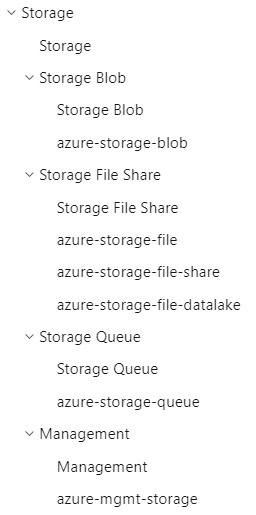

# Reference ToC Syncing in Docs.MS

This script enables the easy constriction of a base `reference.yml` based on what documentation was _actually generated_ from CI.

This is intended to be run _after_ a docs.MS CI run. For more details on the how/why of these CI runs, [refer the engineering system wiki.](https://dev.azure.com/azure-sdk/internal/_wiki/wikis/internal.wiki/128/Releasing-Documentation-to-docs.ms.com)

**Features**

- [x] Constrict reference.yml to only ToC entries that contain namespaces which actually exist from specified CI run
- [x] Ensures that preview ToCs contain readmes
- [x] Update `readme` references to the preview version if PRESENT
    - `cosmos-readme.md` > `cosmos-readme-pre.md` 
    - `storage-blob-readme.md` > `storage-blob-readme.md` (if `-pre` version doesn't exist)

### Call Example

This is intended to be run against an [intermediate doc repo.](https://github.com/MicrosoftDocs/azure-docs-sdk-node)

```
  python .\eng\python\docs-automation\sync_tocs.py 
    -r "C:/repo/azure-docs-sdk-python/docs-ref-mapping/reference.yml" #the base reference.yml that we will use as our base
    -t "C:/repo/azure-docs-sdk-python/docs-ref-mapping/reference-preview.yml" #where the constricted ToC will write to
    -n "C:/repo/azure-docs-sdk-python/preview/docs-ref-autogen/toc.yml" #the autogenerated yml containing namespaces
    -d "C:/repo/azure-docs-sdk-python/" #the documentation repository, used when resolving readme paths
    -s "-pre" #attempt to find readmes with this suffix, versus what is found in reference.yml
```

## Storage Example

Let's use a dummy example for Python Storage Libraries. 

- In our example's universe, only `azure-storage-queue` is in preview. 
- The rest all have latest GA packages OR ARE NOT ONBOARDED to the `preview` CI runs.

Our example `reference.yml` that organizes how our documentation will be rendered on the ToC.

```
- name: Reference
  uid: azure.python.sdk.landingPage.reference
  landingPageType: Root
  expanded: true
  items:
  - name: Storage
    uid: azure.python.sdk.landingPage.services.Storage
    items:
    - name: Storage Blob
      uid: azure.python.sdk.landingPage.services.storageblob.detail
      children:
      - 'azure-storage-blob*'
    - name: Storage File Share
      uid: azure.python.sdk.landingPage.services.storagefileshare.detail
      children:
      - 'azure-storage-file*'
    - name: Storage Queue
      uid: azure.python.sdk.landingPage.services.storagequeue.detail
      children:
      - 'azure-storage-queue*'
    - name: Storage Common
      landingPageType: Service
      uid: azure.python.sdk.landingPage.services.storagecommon.detail
      children:
      - 'azure-storage-common*'
    - name: Management
      uid: azure.python.sdk.landingPage.services.storage.Management
      landingPageType: Service
      children:
      - 'azure-mgmt-storage*'

```
Renders to:



### Storage Example Post-Run

Given the context of _only azure-storage-queue_ being onboarded to preview, we expect to filter out all ToC nodes that _don't_ end in a leaf with matching namespace.

We have already specified that `azure-storage-queue` is the only onboarded preview package, therefore the constricted ToC should result in:


```
- name: Reference
  uid: azure.python.sdk.landingPage.reference
  landingPageType: Root
  expanded: true
  items:
  - name: Storage
    uid: azure.python.sdk.landingPage.services.Storage
    items:
    - name: Storage Queue
      uid: azure.python.sdk.landingPage.services.storagequeue.detail
      children:
      - 'azure-storage-queue*'
```

The reasoning behind this automatic constriction is that if an entry is _left behind_ in the `reference.yml` for preview when there is no associated package to render below it, the ToC entries are rendered with no children.

