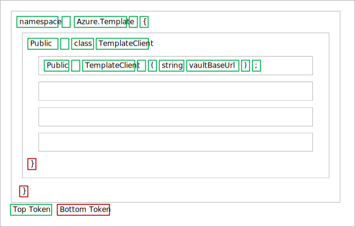
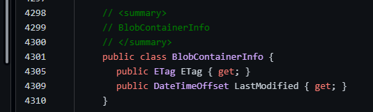
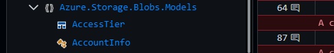
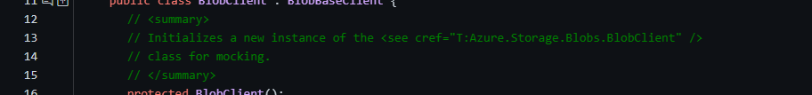
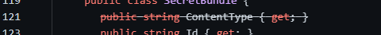
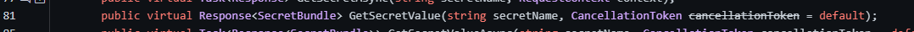
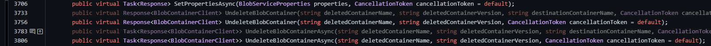
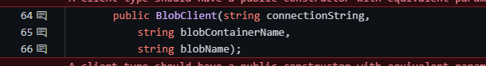
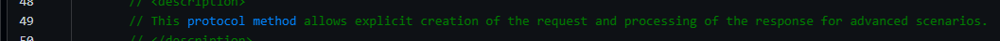

# Tree token parser

This page describes how to contribute to [APIView](../../../src//dotnet/APIView/APIViewWeb/APIViewWeb.csproj) language level parsers.
Specifically how to create or update a language parser to produce a hierarchy of the API using a tree data tokens, instead of a flat token list.

## Tree style token parser benefits

- Ability to granularly identify a specific class and it’s methods or a specific API alone within a large review without rendering entire tokens.
- Faster diffing using tree shaker instead of current text based comparison.
- Provide diffing with context of where the line that changed belong to in the tree, instead of showing the 5 lines before and after the change.
- Provide cross language view for a granular section within an API review.
- Support for collapsible views at each class and namespace level to make it easier to review the change. User will be able to expand/collapse an entire class or a namespace and it’s children.
- Support dynamic representation of APIs for e.g. some users prefer to see all method arguments in same line and some users prefer to see them in multiple lines.
- Less data to be stored in token file which are located in azure storage blob.

## Key concepts

Previously APIview tokens were created as a flat list assigned to the `CodeFileToken[] Tokens`  property of the [CodeFile](../../../src/dotnet/APIView/APIView/Model/CodeFile.cs). Then the page navigation is created and assigned to `NavigationItem[] Navigation`. For tree style tokens these two properties are no longer required, instead a `List<APITreeNode> APIForest` property will be used to capture the generated tree of tokens.



- Each module of the API (namespace, class, methods) should be its own node. Members of a module (methods in a class), (classes in a namespace) should be added as child nodes of its parent module.
- Each tree node has top tokens which should be used to capture the main tokens on the node, these can span multiple lines.
- Module name, decorators, and parameters should be modeled as `TopTokens`.
- If the language requires it use the bottom tokens to capture tokens that closes out the node, this is usually just the closing bracket and/or empty lines.

### Object Definitions

- Here are the models needed

  ```
  object APITreeNode
    string Name (Required)
    string Id (Required)
    string Kind (Required)
    Set<string> Tags
    Dictionary<string, string> Properties
    List<StructuredToken> TopTokens
    List<StructuredToken> BottomTokens
    List<APITreeNode> Children

  object StructuredToken
    string Value
    string Id
    StructuredTokenKind Kind (Required)
    Set<string> Tags
    Dictionary<string, string> Properties 
    Set<string> RenderClasses 

  enum StructuredTokenKind
    Content
    LineBreak
    NonBreakingSpace
    TabSpace
    ParameterSeparator
  ```

### [APITreeNode](../../../src/dotnet/APIView/APIView/Model/TokenTreeModel.cs)
- Ensure each node has an Id and Kind. The combination of `Id`, `Kind`, and `SubKind` should make the node unique across all nodes in the tree. For example a class and a method can potentially have the same Id, but the kind should differentiate them from each other.
- Sort each node at each level of the tree by your desired property, this is to ensure that difference in node order does not result in diff.

### [StructuredToken](../../../src/dotnet/APIView/APIView/Model/StructuredTokenModel.cs)

- Assign the final parsed value to a `List<APITreeNode> APIForest` property of the `CodeFile`

## Serialization

Serialize the generated code file to JSON with Gzip compression. The output file should have `.json.tgz` extension. Try to make the json as small as possible by ignoring null values and empty collections.
Don't worry about indentation that will be handled by the tree structure. In the case you want to have indentation between the tokens then use `TabSpace` token kind.

## Examples

### APITreeNode and StructuredToken

Example showing a full node with all its children and tokens.




<details>
<summary>click to expand json</summary>

  ```json
  {
    "Id": "Azure.Storage.Blobs.Models.BlobContainerInfo",
    "Kind": "Type",
    "Name": "BlobContainerInfo",
    "BottomTokens": [
        {
            "Kind": 0,
            "Value": "}",
            "RenderClasses": [
                "punc"
            ]
        },
        {
            "Kind": 1,
            "Value": ""
        },
        {
            "Kind": 0,
            "Value": ""
        }
    ],
    "Children": [
        {
            "Id": "Azure.Storage.Blobs.Models.BlobContainerInfo.ETag",
            "Kind": "Member",
            "Name": "Azure.Storage.Blobs.Models.BlobContainerInfo.ETag",
            "Properties": {
                "SubKind": "Property"
            },
            "Tags": [
                "HideFromNav"
            ],
            "TopTokens": [
                {
                    "Kind": 0,
                    "Value": "// \u003Csummary\u003E",
                    "Properties": {
                        "GroupId": "doc"
                    },
                    "RenderClasses": [
                        "comment"
                    ]
                },
                {
                    "Kind": 1,
                    "Value": ""
                },
                {
                    "Kind": 0,
                    "Value": "// The ETag contains a value that you can use to perform operations conditionally. If the request version is 2011-08-18 or newer, the ETag value will be in quotes.",
                    "Properties": {
                        "GroupId": "doc"
                    },
                    "RenderClasses": [
                        "comment"
                    ]
                },
                {
                    "Kind": 1,
                    "Value": ""
                },
                {
                    "Kind": 0,
                    "Value": "// \u003C/summary\u003E",
                    "Properties": {
                        "GroupId": "doc"
                    },
                    "RenderClasses": [
                        "comment"
                    ]
                },
                {
                    "Kind": 1,
                    "Value": ""
                },
                {
                    "Id": "Azure.Storage.Blobs.Models.BlobContainerInfo.ETag",
                    "Kind": 0,
                    "Value": ""
                },
                {
                    "Kind": 0,
                    "Value": "public",
                    "RenderClasses": [
                        "keyword"
                    ]
                },
                {
                    "Kind": 2,
                    "Value": ""
                },
                {
                    "Kind": 0,
                    "Value": "ETag",
                    "RenderClasses": [
                        "tname"
                    ]
                },
                {
                    "Kind": 2,
                    "Value": ""
                },
                {
                    "Kind": 0,
                    "Value": "ETag",
                    "RenderClasses": [
                        "mname"
                    ]
                },
                {
                    "Kind": 2,
                    "Value": ""
                },
                {
                    "Kind": 0,
                    "Value": "{",
                    "RenderClasses": [
                        "punc"
                    ]
                },
                {
                    "Kind": 2,
                    "Value": ""
                },
                {
                    "Kind": 0,
                    "Value": "get",
                    "RenderClasses": [
                        "keyword"
                    ]
                },
                {
                    "Kind": 0,
                    "Value": ";",
                    "RenderClasses": [
                        "punc"
                    ]
                },
                {
                    "Kind": 2,
                    "Value": ""
                },
                {
                    "Kind": 0,
                    "Value": "}",
                    "RenderClasses": [
                        "punc"
                    ]
                },
                {
                    "Kind": 1,
                    "Value": ""
                }
            ]
        },
        {
            "Id": "Azure.Storage.Blobs.Models.BlobContainerInfo.LastModified",
            "Kind": "Member",
            "Name": "Azure.Storage.Blobs.Models.BlobContainerInfo.LastModified",
            "Properties": {
                "SubKind": "Property"
            },
            "Tags": [
                "HideFromNav"
            ],
            "TopTokens": [
                {
                    "Kind": 0,
                    "Value": "// \u003Csummary\u003E",
                    "Properties": {
                        "GroupId": "doc"
                    },
                    "RenderClasses": [
                        "comment"
                    ]
                },
                {
                    "Kind": 1,
                    "Value": ""
                },
                {
                    "Kind": 0,
                    "Value": "// Returns the date and time the container was last modified. Any operation that modifies the blob, including an update of the blob\u0027s metadata or properties, changes the last-modified time of the blob.",
                    "Properties": {
                        "GroupId": "doc"
                    },
                    "RenderClasses": [
                        "comment"
                    ]
                },
                {
                    "Kind": 1,
                    "Value": ""
                },
                {
                    "Kind": 0,
                    "Value": "// \u003C/summary\u003E",
                    "Properties": {
                        "GroupId": "doc"
                    },
                    "RenderClasses": [
                        "comment"
                    ]
                },
                {
                    "Kind": 1,
                    "Value": ""
                },
                {
                    "Id": "Azure.Storage.Blobs.Models.BlobContainerInfo.LastModified",
                    "Kind": 0,
                    "Value": ""
                },
                {
                    "Kind": 0,
                    "Value": "public",
                    "RenderClasses": [
                        "keyword"
                    ]
                },
                {
                    "Kind": 2,
                    "Value": ""
                },
                {
                    "Kind": 0,
                    "Value": "DateTimeOffset",
                    "RenderClasses": [
                        "tname"
                    ]
                },
                {
                    "Kind": 2,
                    "Value": ""
                },
                {
                    "Kind": 0,
                    "Value": "LastModified",
                    "RenderClasses": [
                        "mname"
                    ]
                },
                {
                    "Kind": 2,
                    "Value": ""
                },
                {
                    "Kind": 0,
                    "Value": "{",
                    "RenderClasses": [
                        "punc"
                    ]
                },
                {
                    "Kind": 2,
                    "Value": ""
                },
                {
                    "Kind": 0,
                    "Value": "get",
                    "RenderClasses": [
                        "keyword"
                    ]
                },
                {
                    "Kind": 0,
                    "Value": ";",
                    "RenderClasses": [
                        "punc"
                    ]
                },
                {
                    "Kind": 2,
                    "Value": ""
                },
                {
                    "Kind": 0,
                    "Value": "}",
                    "RenderClasses": [
                        "punc"
                    ]
                },
                {
                    "Kind": 1,
                    "Value": ""
                }
            ]
        }
    ],
    "Properties": {
        "SubKind": "class"
    },
    "TopTokens": [
        {
            "Kind": 0,
            "Value": "// \u003Csummary\u003E",
            "Properties": {
                "GroupId": "doc"
            },
            "RenderClasses": [
                "comment"
            ]
        },
        {
            "Kind": 1,
            "Value": ""
        },
        {
            "Kind": 0,
            "Value": "// BlobContainerInfo",
            "Properties": {
                "GroupId": "doc"
            },
            "RenderClasses": [
                "comment"
            ]
        },
        {
            "Kind": 1,
            "Value": ""
        },
        {
            "Kind": 0,
            "Value": "// \u003C/summary\u003E",
            "Properties": {
                "GroupId": "doc"
            },
            "RenderClasses": [
                "comment"
            ]
        },
        {
            "Kind": 1,
            "Value": ""
        },
        {
            "Kind": 0,
            "Value": "public",
            "RenderClasses": [
                "keyword"
            ]
        },
        {
            "Kind": 2,
            "Value": ""
        },
        {
            "Kind": 0,
            "Value": "class",
            "RenderClasses": [
                "keyword"
            ]
        },
        {
            "Kind": 2,
            "Value": ""
        },
        {
            "Id": "Azure.Storage.Blobs.Models.BlobContainerInfo",
            "Kind": 0,
            "Value": ""
        },
        {
            "Id": "Azure.Storage.Blobs.Models.BlobContainerInfo",
            "Kind": 0,
            "Value": "BlobContainerInfo",
            "RenderClasses": [
                "tname"
            ]
        },
        {
            "Kind": 2,
            "Value": ""
        },
        {
            "Kind": 0,
            "Value": "{",
            "RenderClasses": [
                "punc"
            ]
        }
    ]
}                        
  ```
</details>

### Navigation


Ensure you set appropriate `Name` for the token node. And also set a value for the `Kind`. You can use one of the following values `assembly`, `class`, `delegate`, `enum`, `interface`, `method` , `namespace`, `package`, `struct`, `type` to get the default navigation icon. You can also use values more appropriate for your language then reach out to APIView to provide support for those. Use tag `HideFromNav` to exclude a node from showing up in the page navigation.
<details>
<summary>click to expand json</summary>

  ```json
    {
      "Id": "Azure.Storage.Blobs.Models",
      "Kind": "Namespace",
      "Name": "Azure.Storage.Blobs.Models",
      "Children": [
          {
              "Id": "Azure.Storage.Blobs.Models.AccessTier",
              "Kind": "Type",
              "Name": "AccessTier",
              "TopTokens": [],
              "BottomTokens": [],
              "Children": [
                  {
                      "Id": "Azure.Storage.Blobs.Models.AccessTier.AccessTier(System.String)",
                      "Kind": "Member",
                      "Name": "Azure.Storage.Blobs.Models.AccessTier.AccessTier(string)",
                      "TopTokens": [],
                      "BottomTokens": [],
                      "Properties": {
                          "SubKind": "Method"
                      },
                      "Tags": [
                          "HideFromNav"
                      ]
                  }
              ],
              "Properties": {
                  "SubKind": "struct"
              }
          },
          {
              "Id": "Azure.Storage.Blobs.Models.AccountInfo",
              "Kind": "Type",
              "Name": "AccountInfo"
          }
      ]
    }
  ```
</details>

### Documentation


You can group a sequence of similar type tokens using GroupId. Set `GroupId` property to `doc` to mark a sequence of comment tokens as documentation.
<details>
<summary>click to expand json</summary>

  ```json                            
    {
        "Id": "Azure.Storage.Blobs.BlobClient.BlobClient()",
        "Kind": "Member",
        "Name": "Azure.Storage.Blobs.BlobClient.BlobClient()",
        "Properties": {
            "SubKind": "Method"
        },
        "Tags": [
            "HideFromNav"
        ],
        "TopTokens": [
            {
                "Kind": 0,
                "Value": "// \u003Csummary\u003E",
                "Properties": {
                    "GroupId": "doc"
                },
                "RenderClasses": [
                    "comment"
                ]
            },
            {
                "Kind": 1,
                "Value": ""
            },
            {
                "Kind": 0,
                "Value": "// Initializes a new instance of the \u003Csee cref=\u0022T:Azure.Storage.Blobs.BlobClient\u0022 /\u003E",
                "Properties": {
                    "GroupId": "doc"
                },
                "RenderClasses": [
                    "comment"
                ]
            },
            {
                "Kind": 1,
                "Value": ""
            },
            {
                "Kind": 0,
                "Value": "// class for mocking.",
                "Properties": {
                    "GroupId": "doc"
                },
                "RenderClasses": [
                    "comment"
                ]
            },
            {
                "Kind": 1,
                "Value": ""
            },
            {
                "Kind": 0,
                "Value": "// \u003C/summary\u003E",
                "Properties": {
                    "GroupId": "doc"
                },
                "RenderClasses": [
                    "comment"
                ]
            }
        ]
    }
  ```
</details>

### Deprecated Node


Add `Deprecated` tag to a node to mark all the token of the node as deprecated.
<details>
<summary>click to expand json</summary>

  ```json
  {
    "Name": "Azure.Template.Models.SecretBundle.ContentType",
    "Id": "Azure.Template.Models.SecretBundle.ContentType",
    "Kind": "Member",
    "Tags": [
        "HideFromNav",
        "Deprecated"
    ],
    "Properties": {
        "SubKind": "Property"
    },
    "TopTokens": [
        {
            "Properties": {
                "GroupId": "doc"
            },
            "RenderClasses": [
                "comment"
            ],
            "Value": "// \u003Csummary\u003E The content type of the secret. \u003C/summary\u003E",
            "Kind": 0
        },
        {
            "Value": "",
            "Kind": 1
        },
        {
            "Value": "",
            "Id": "Azure.Template.Models.SecretBundle.ContentType",
            "Kind": 0
        },
        {
            "RenderClasses": [
                "keyword"
            ],
            "Value": "public",
            "Kind": 0
        },
        {
            "Value": "",
            "Kind": 2
        },
        {
            "RenderClasses": [
                "keyword"
            ],
            "Value": "string",
            "Kind": 0
        },
        {
            "Value": "",
            "Kind": 2
        },
        {
            "RenderClasses": [
                "mname"
            ],
            "Value": "ContentType",
            "Kind": 0
        },
        {
            "Value": "",
            "Kind": 2
        },
        {
            "RenderClasses": [
                "punc"
            ],
            "Value": "{",
            "Kind": 0
        },
        {
            "Value": "",
            "Kind": 2
        },
        {
            "RenderClasses": [
                "keyword"
            ],
            "Value": "get",
            "Kind": 0
        },
        {
            "RenderClasses": [
                "punc"
            ],
            "Value": ";",
            "Kind": 0
        },
        {
            "Value": "",
            "Kind": 2
        },
        {
            "RenderClasses": [
                "punc"
            ],
            "Value": "}",
            "Kind": 0
        },
        {
            "Value": "",
            "Kind": 1
        }
    ]
},
  ```
</details>

### Deprecated Token


Add `Deprecated` tag to a token to mark the token as deprecated.
<details>
<summary>click to expand json</summary>

  ```json
  {
    "Tags": [
        "Deprecated"
    ],
    "RenderClasses": [
        "text"
    ],
    "Value": "cancellationToken",
    "Kind": 0
  }
  ```
</details>

### Hidden API


Add `Hidden` tag to a node to mark the node as hidden. Hidden nodes show up with low contrast in APIView. Hidden node visibility can also be toggled on or off in page settings.
<details>
<summary>click to expand json</summary>

  ```json
 {
    "Id": "Azure.Storage.Blobs.BlobServiceClient.UndeleteBlobContainer(System.String, System.String, System.String, System.Threading.CancellationToken)",
    "Kind": "Member",
    "Name": "Azure.Storage.Blobs.BlobServiceClient.UndeleteBlobContainer(string, string, string, System.Threading.CancellationToken)",
    "Properties": {
        "SubKind": "Method"
    },
    "Tags": [
        "HideFromNav",
        "Hidden"
    ],
    "TopTokens": [
        {
            "Id": "Azure.Storage.Blobs.BlobServiceClient.UndeleteBlobContainer(System.String, System.String, System.String, System.Threading.CancellationToken)",
            "Kind": 0,
            "Value": ""
        },
        {
            "Kind": 0,
            "Value": "public",
            "RenderClasses": [
                "keyword"
            ]
        },
        {
            "Kind": 2,
            "Value": ""
        },
        {
            "Kind": 0,
            "Value": "virtual",
            "RenderClasses": [
                "keyword"
            ]
        },
        {
            "Kind": 2,
            "Value": ""
        },
        {
            "Kind": 0,
            "Value": "Response",
            "RenderClasses": [
                "tname"
            ]
        },
        {
            "Kind": 0,
            "Value": "\u003C",
            "RenderClasses": [
                "punc"
            ]
        },
        {
            "Kind": 0,
            "Value": "BlobContainerClient",
            "Properties": {
                "NavigateToId": "Azure.Storage.Blobs.BlobContainerClient"
            },
            "RenderClasses": [
                "tname"
            ]
        },
        {
            "Kind": 0,
            "Value": "\u003E",
            "RenderClasses": [
                "punc"
            ]
        },
        {
            "Kind": 2,
            "Value": ""
        },
        {
            "Kind": 0,
            "Value": "UndeleteBlobContainer",
            "RenderClasses": [
                "mname"
            ]
        },
        {
            "Kind": 0,
            "Value": "(",
            "RenderClasses": [
                "punc"
            ]
        },
        {
            "Kind": 0,
            "Value": "string",
            "RenderClasses": [
                "keyword"
            ]
        },
        {
            "Kind": 2,
            "Value": ""
        },
        {
            "Kind": 0,
            "Value": "deletedContainerName",
            "RenderClasses": [
                "text"
            ]
        },
        {
            "Kind": 0,
            "Value": ",",
            "RenderClasses": [
                "punc"
            ]
        },
        {
            "Kind": 4,
            "Value": ""
        },
        {
            "Kind": 0,
            "Value": "string",
            "RenderClasses": [
                "keyword"
            ]
        },
        {
            "Kind": 2,
            "Value": ""
        },
        {
            "Kind": 0,
            "Value": "deletedContainerVersion",
            "RenderClasses": [
                "text"
            ]
        },
        {
            "Kind": 0,
            "Value": ",",
            "RenderClasses": [
                "punc"
            ]
        },
        {
            "Kind": 4,
            "Value": ""
        },
        {
            "Kind": 0,
            "Value": "string",
            "RenderClasses": [
                "keyword"
            ]
        },
        {
            "Kind": 2,
            "Value": ""
        },
        {
            "Kind": 0,
            "Value": "destinationContainerName",
            "RenderClasses": [
                "text"
            ]
        },
        {
            "Kind": 0,
            "Value": ",",
            "RenderClasses": [
                "punc"
            ]
        },
        {
            "Kind": 4,
            "Value": ""
        },
        {
            "Kind": 0,
            "Value": "CancellationToken",
            "RenderClasses": [
                "tname"
            ]
        },
        {
            "Kind": 2,
            "Value": ""
        },
        {
            "Kind": 0,
            "Value": "cancellationToken",
            "RenderClasses": [
                "text"
            ]
        },
        {
            "Kind": 2,
            "Value": ""
        },
        {
            "Kind": 0,
            "Value": "=",
            "RenderClasses": [
                "punc"
            ]
        },
        {
            "Kind": 2,
            "Value": ""
        },
        {
            "Kind": 0,
            "Value": "default",
            "RenderClasses": [
                "keyword"
            ]
        },
        {
            "Kind": 0,
            "Value": ")",
            "RenderClasses": [
                "punc"
            ]
        },
        {
            "Kind": 0,
            "Value": ";",
            "RenderClasses": [
                "punc"
            ]
        },
        {
            "Kind": 1,
            "Value": ""
        }
    ]
}
  ```
</details>


### Parameter Separator
Use token with kind Kind `ParameterSeparator` between method parameters to allow APIView to either render the methods parameters on the same line or on separate lines based on language or user preference.





<details>
<summary>click to expand json</summary>

  ```json
    [
        {
            "Kind": 0,
            "Value": "string",
            "RenderClasses": [
                "keyword"
            ]
        },
        {
            "Kind": 2,
            "Value": ""
        },
        {
            "Kind": 0,
            "Value": "connectionString",
            "RenderClasses": [
                "text"
            ]
        },
        {
            "Kind": 0,
            "Value": ",",
            "RenderClasses": [
                "punc"
            ]
        },
        {
            "Kind": 4,
            "Value": ""
        },
        {
            "Kind": 0,
            "Value": "string",
            "RenderClasses": [
                "keyword"
            ]
        },
        {
            "Kind": 2,
            "Value": ""
        },
        {
            "Kind": 0,
            "Value": "blobContainerName",
            "RenderClasses": [
                "text"
            ]
        },
        {
            "Kind": 0,
            "Value": ",",
            "RenderClasses": [
                "punc"
            ]
        },
        {
            "Kind": 4,
            "Value": ""
        },
        {
            "Kind": 0,
            "Value": "string",
            "RenderClasses": [
                "keyword"
            ]
        },
        {
            "Kind": 2,
            "Value": ""
        },
        {
            "Kind": 0,
            "Value": "blobName",
            "RenderClasses": [
                "text"
            ]
        },
        {
            "Kind": 0,
            "Value": ")",
            "RenderClasses": [
                "punc"
            ]
        },
        {
            "Kind": 0,
            "Value": ";",
            "RenderClasses": [
                "punc"
            ]
        },
        {
            "Kind": 1,
            "Value": ""
        }
    ]                          
  ```
</details>

### Navigation Token

Make a token a navigation token by adding key `NavigateToId` to the token property with a value corresponding the the Id of the APINode to navigate to on click.
<details>
<summary>click to expand json</summary>

  ```json
    {
        "Kind": 0,
        "Value": "BlobClientOptions",
        "Properties": {
            "NavigateToId": "Azure.Storage.Blobs.BlobClientOptions"
        },
        "RenderClasses": [
            "tname"
        ]
    }                         
  ```
</details>

### URL Token


Make a token a Url by adding key `NavigateToUrl` to the token property and setting the value to the target Url.
<details>
<summary>click to expand json</summary>

  ```json
    [
        {
            "Properties": {
                "GroupId": "doc"
            },
            "RenderClasses": [
                "comment"
            ],
            "Value": "// This",
            "Kind": 0
        },
        {
            "Value": "",
            "Kind": 2
        },
        {
            "Properties": {
                "GroupId": "doc",
                "NavigateToUrl": "https://github.com/Azure/azure-sdk-for-net/blob/main/sdk/core/Azure.Core/samples/ProtocolMethods.md"
            },
            "RenderClasses": [
                "comment"
            ],
            "Value": "protocol method",
            "Kind": 0
        },
        {
            "Value": "",
            "Kind": 2
        },
        {
            "Properties": {
                "GroupId": "doc"
            },
            "RenderClasses": [
                "comment"
            ],
            "Value": "allows explicit creation of the request and processing of the response for advanced scenarios.",
            "Kind": 0
        }
    ]                          
  ```
</details>

## Get help

Please reach out at [APIView Teams Channel](https://teams.microsoft.com/l/channel/19%3A3adeba4aa1164f1c889e148b1b3e3ddd%40thread.skype/APIView?groupId=3e17dcb0-4257-4a30-b843-77f47f1d4121&tenantId=72f988bf-86f1-41af-91ab-2d7cd011db47) if you need more information.
