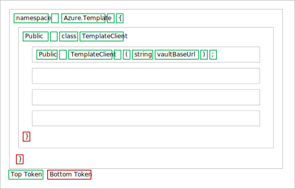

# Contributing

## Overview
This page describes how to contribute to [APIView](../../../src//dotnet/APIView/APIViewWeb/APIViewWeb.csproj) language level parsers.
Specifically, how to create or update a language parser to produce tree style tokens for APIView.

Previously APIview tokens were created as a flat list assigned to the `CodeFileToken[] Tokens`  property of the [CodeFile](../../../src/dotnet/APIView/APIView/Model/CodeFile.cs). Then the page navigation is created and assigned to `NavigationItem[] Navigation`. For tree style tokens these two properties are no longer required, instead a `List<APITreeNode> APIForest` property will be used to capture the generated tree of tokens.

The main idea is to capture the hierarchy of the API using a tree data structure, then maintain a flat list of tokens for each node of the tree.



Each module of the API (namespace, class, methods) should be its own node. Members of a module (methods, in a class), (classes in a namespace) should be added as child nodes of its parent module. 
Each tree node has top tokens which should be used to capture the main tokens on the node, these can span multiple lines. Module name, decorators, and parameters should be modeled as topTokens. If the language requires it, use the bottom tokens to capture tokens that closes out the node, this is usually just the closing bracket and/or empty lines.

## Object Definitions

- Here are the models needed
  ```
  object APITreeNode
    string Name
    string Id
    string Kind
    Set<string> Tags
    Dictionary<string, string> Properties
    List<StructuredToken> TopTokens
    List<StructuredToken> BottomTokens
    List<APITreeNode> Children

  object StructuredToken
    string Value
    string Id
    StructuredTokenKind Kind
    Set<string> Tags
    Dictionary<string, string> Properties 
    Set<string> RenderClasses 

  enum StructuredTokenKind
    Content
    LineBreak
    NoneBreakingSpace
    TabSpace
    ParameterSeparator
    Url
  ```

### APITreeNode
- `Name`: *(Required)* The name of the tree node which will be used as label for the API Navigation. Generally use the name of the module (class, method).
- `Id`: *(Required)*  Id of the node, which should be unique at the node level. i.e. unique among its siblings. Use whatever your existing parser is assigning to DefinitionId for the main Token of the node. Each node must have an Id.
- `Kind` *(Required)*  : What kind of node is it. Please ensure you set a Kind for each node. Using any of the following `assembly`, `class`, `delegate`, `enum`, `interface`, `method` , `namespace`, `package`, `struct`, `type` will get you the corresponding default icons for the page navigation but feel free to use something language specific then reach out to APIView to support any new name used.
- `Tags` : Use this for opt in or opt out boolean properties. The currently supported tags are
  - `Deprecated` Mark a node as deprecated
  - `Hidden` Mark a node as Hidden
  - `HideFromNav` Indicate that anode should be hidden from the page navigation.
  - `SkipDiff` Indicate that a node should not be used in computation of diff.
  - `CrossLangDefId` The cross language definitionId for the node.
- `Properties` : Use this for other properties of the node. The currently supported keys are
  - `SubKind` Similar to kind, use this to make the node more specific. e.g.   `Kind = 'Type'`, and `SubKind = 'class'` or something specific to you language. We also use this to make the navigation icon it will override kind.
  - `IconName` Use this only if you are looking to add a custom icon different from language wide defaults. New additions will need to be supported APIView side.
- `TopTokens` : The main data of the node. This is all the tokens that actually define the node. e.g. For a class this would include the access modifier, the class name, any attributes or decorators e.t.c. For a method this would include the return type, method name, parameters e.t.c. See StructuredToken description below for more info.
- `BottomToken` : Data that closes out the node. Depending on the language this would include the closing curly brace and/or empty lines. You can simulate an empty line by adding an empty token (content token with no value) and a line Break token.
- `Children` : The nodes immediate children. For a namespace this would be classes, for a class this would be the class constructors and methods.

Sort each node at each level of the tree by your desired property, this is to ensure that difference in node order does not result in diff.

Ensure each node has an Id and Kind. The combination of `Id`, `Kind` and `SubKind` should make the node unique across all nodes in the tree. This is very important. For example a class and a method can potentially have the same Id, but the kind should differentiate them from each other.

Don’t worry about indentation that will be handled by the tree structure, unless you want to have indentation between the tokens then use `TabSpace` token kind.

### StructuredToken
- `Value` : The token value which will be displayed. Spacing tokens don't need to have value.
- `Id` : This is essentially whatever existing parser was assigning to the token DefinitionId. You don’t have to assign a tokenId to every token. APIView comments are tied to this ID so for backward compatibility it essential to use the same Id that existing parser is using for DefinitionId.
- `Kind` *(Required)* : An enum
  - `Content` Specifies that the token is content
  - `LineBreak` Space token indicating switch to new line.
  - `NonBreakingSpace` Regular single space
  - `TabSpace` 4 NonBreakingSpaces
  - `ParameterSeparator` Use this between method parameters. Depending on user setting this would result in a single space or new line
  - `Url` A url token should have `LinkText` property i.e `token.Properties["LinkText"]` and the url/link should be the token value.
  All tokens should be content except for spacing tokens and url. ParameterSeparator should be used between method or function parameters. 
- `Tags` : Use this for opt in or opt out boolean properties.The currently supported tags are 
  - `SkippDiff`  Indicate that a token should not be used in computation of diff.
  - `Deprecated` Mark a token as deprecated
- `Properties` : Properties of the token.
  - `GroupId` : `doc` to group consecutive comment tokens as documentation.
  - `NavigateToId` Id for navigating to where the node where the token is defined. Should match the definitionId of the referenced node.
- `RenderClasses` : Add css classes for how the tokens will be rendred. Classes currently being used are `text` `keyword` `punc` `tname` `mname` `literal` `sliteral` `comment` Feel free to add your own custom class. Whatever custom classes you use please provide us the appriopriate css for the class so we can update APIView.

Assign the final parsed value to a `List<APITreeNode> APIForest` property of the `CodeFile`

## Serialization

Serialize the generated code file to JSON them compress the file using Gzip compression. Try to make the json as small as possible by ignoring null values and empty collections.

## How to handle commons Scenarios
- TEXT, KEYWORD, COMMENT : Add `text`, `keyword`, `comment` to RenderClasses of the token
- NEW_LINE : Create a token with `Kind = LineBreak`
- WHITE_SPACE :  Create token with `Kind = NonBreakingSpace`
- PUNCTUATION : Create a token with `Kind = Content` and the `Value = the punctuation`
- DOCUMENTATION : Add `GroupId = doc` in the properties of the token. This identifies a range of consecutive tokens as belonging to a group.
- SKIP_DIFF :  Add `SkipDiff` to the Tag to indicate that node or token should not be included in diff computation
- LINE_ID_MARKER : You can add a empty token. `Kind = Content` and `Value = ""` then give it an `Id`.
- EXTERNAL_LINK : Create a single token set `Kind = Url`, `Value = link` then add the link text as a properties `LinkText`;
- Common Tags: `Deprecated`, `Hidden`, `HideFromNav`, `SkipDiff`
- Cross Language Id: Use `CrossLangId` as key with value in the node properties.

Please reach out at [APIView Teams Channel](https://teams.microsoft.com/l/channel/19%3A3adeba4aa1164f1c889e148b1b3e3ddd%40thread.skype/APIView?groupId=3e17dcb0-4257-4a30-b843-77f47f1d4121&tenantId=72f988bf-86f1-41af-91ab-2d7cd011db47) if you need more information.

