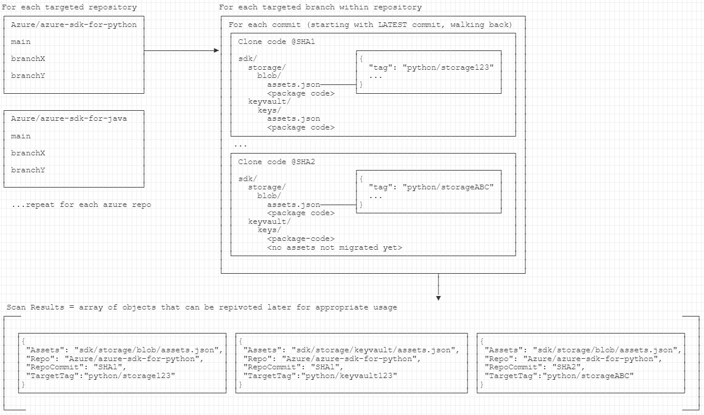

# Assets Maintenance Tooling

The tool contained within this directory is intended two fulfill three main tasks.

1. Scan the commits of a set of targeted repos and branches to create a representation of all assets.jsons, their targeted tags, and their origin SHAs.
   * This is just a map of the complete footprint of `test-proxy` assets that are referenced in azure-sdk repositories.
2. Use the map of data created in step 1 to individually backup tags from the assets repository to a target that we can retrieve later.
3. Use the map of data created in step 1 to clean up _unnecessary_ tags in the assets repository.

## Usage

### Installation

`<todo>`

### Scanning

`<todo>`

## What does the process look like?

