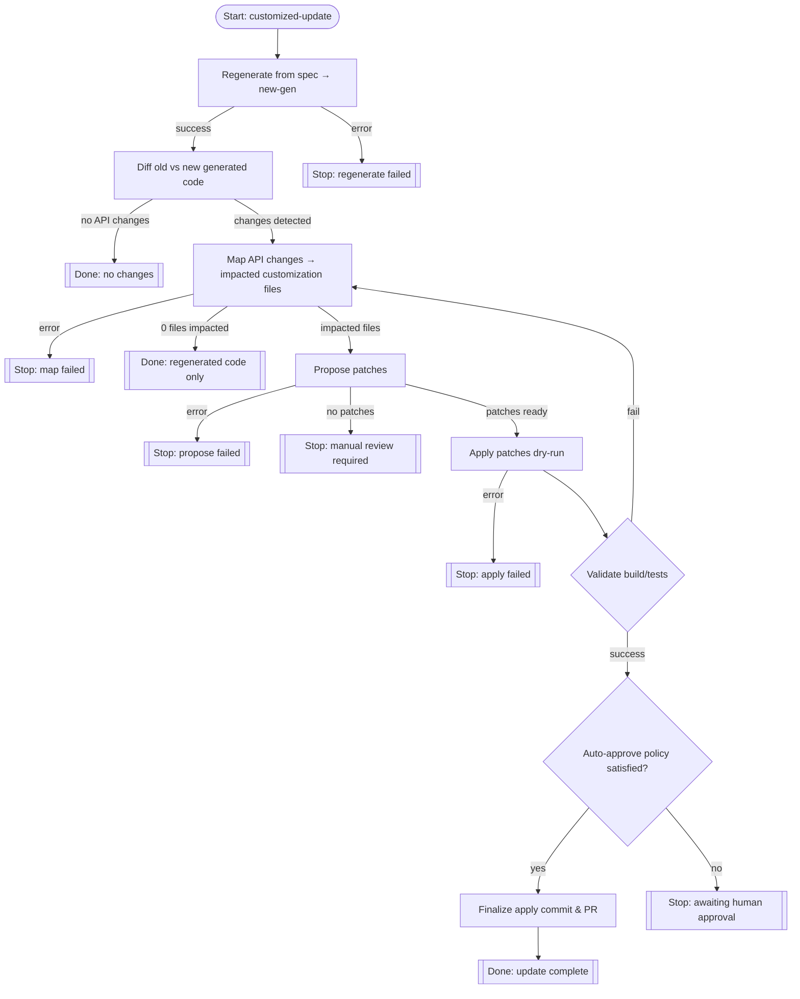

# TspClientUpdate Tool

Automates updating customized client code after a TypeSpec regeneration. One command runs the full pipeline: regenerate → diff → map → propose → apply → validate (with up to a few auto‑fix attempts).

## Overview



---

## Usage (CLI)

```powershell
dotnet run --project Azure.Sdk.Tools.Cli/Azure.Sdk.Tools.Cli.csproj -- tsp customized-update path/to/spec.tsp --package-path ./sdk/yourpkg --new-gen ./tmpgen
```

### Notes

* `--new-gen` is optional (defaults to `./tmpgen`).
* If there are no API changes it still runs validation and returns a terminal response.

### Options

* `spec-path` (argument) – path to the `.tsp` spec (required)
* `--package-path` – root of the existing customized client package (defaults to CWD)
* `--new-gen` – directory where regenerated TypeSpec output is (or will be) placed (default `./tmpgen`)

---

## Programmatic / MCP

MCP tool name: `azsdk_tsp_update`

Call `UnifiedUpdateAsync(specPath, IUpdateLanguageService, ct)` to run the same full pipeline programmatically. Provide an `IUpdateLanguageService` implementation for the target language.

---

## Pipeline

1. Regenerate (placeholder hook — language service can populate symbol models)
2. Diff old vs new generated output (collect API changes)
3. Map API changes to impacted customization files
4. Propose patch set
5. Apply patches (in-memory / file updates)
6. Validate (loop: validate → if fail, request fixes → apply → re‑validate, max attempts)
7. Return terminal status (Validated or ValidationFailed with manual intervention flag)

---

## Adding a new language (quick checklist)

Implement `IUpdateLanguageService`:

* `DiffAsync` – produce API change list
* `AnalyzeCustomizationImpactAsync` – map changes to customization files
* `ProposePatchesAsync` – build patch proposals
* `ValidateAsync` – compile / test / lint
* `ProposeFixesAsync` – return additional patches when validation fails

Testing note: unit tests can inject a `Func<string, IUpdateLanguageService>` that returns a mocked service for a package path; integration tests should run the full pipeline against small sample repos.

---

## Response snapshot

`UpdateSessionState` (subset) returned inside `TspClientUpdateResponse`:

* `SessionId`, `SpecPath`
* `ApiChanges` (count & list)
* `ImpactedCustomizations`
* `ProposedPatches`
* `LastStage`, `Status`
* `ValidationSuccess`, `ValidationErrors`, `ValidationAttemptCount`
* `RequiresManualIntervention`

---

## Troubleshooting

* Ensure the `--new-gen` path is writable and exists.
* Validation failing repeatedly: check `ValidationErrors`; if no auto‑fix patches were proposed, manual edits are needed.
* Patches empty but API changes present: language service may not yet implement proposal logic for that change type.

---

## Tests

See `Azure.Sdk.Tools.Cli.Tests/Tools/CustomizedCodeUpdateTool/TspClientUpdateToolAutoTests.cs` for examples of mocked language services covering: no changes, changes, and validation auto‑fix.
