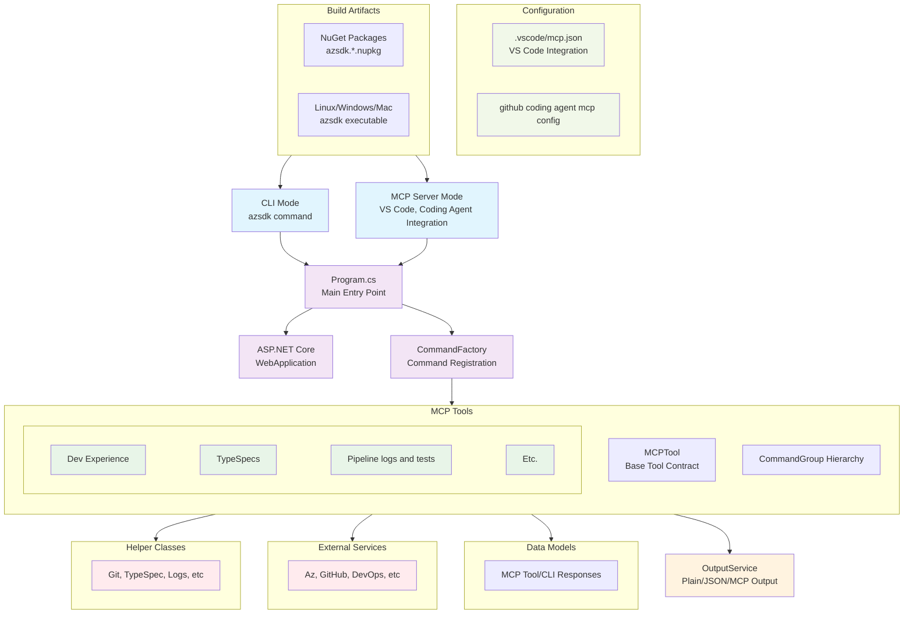

# Azure SDK CLI and MCP server

This project is the primary integration point for all `azure-sdk` provided [MCP](https://modelcontextprotocol.io/introduction) tools as well as a convenient CLI app for azure sdk developers. It is built and published out of the `azure-sdk-tools` repo but consumed primarily through the `.vscode/mcp.json` file within each `Azure-sdk-for-<lang>` language repository. Server installation is carried out by the eng/common scripts present at `eng/common/mcp/azure-sdk-mcp.ps1`.

## Table of Contents

* [Azure SDK CLI and MCP server](#azure-sdk-cli-and-mcp-server)
   * [Table of Contents](#table-of-contents)
   * [Getting Started](#getting-started)
      * [Install standalone](#install-standalone)
      * [Prerequisites](#prerequisites)
      * [Setup](#setup)
      * [Build](#build)
      * [Run](#run)
      * [Test](#test)
      * [Test with GitHub Coding Agent](#test-with-github-coding-agent)
      * [Release](#release)
   * [Project Structure and Information](#project-structure-and-information)
      * [Directory Structure](#directory-structure)
      * [Architecture Diagram](#architecture-diagram)
      * [Pipelines](#pipelines)
   * [Design Guidelines](#design-guidelines)
   * [Adding a New Tool](#adding-a-new-tool)
   * [Data Collection](#data-collection)
      * [Telemetry Configuration](#telemetry-configuration)

## Getting Started

### Install standalone

**To use the CLI immediately** (not intended for development), run the installation script:

```pwsh
<repo root>/eng/common/mcp/azure-sdk-mcp.ps1
```

To add the CLI tool to your shell path, run this instead:

```pwsh
<repo root>/eng/common/mcp/azure-sdk-mcp.ps1 -UpdatePathInProfile
```

The tool can now be run by typing `azsdk` into the shell.

**To use the MCP server immediately**

See the [mcp quick start docs](./Azure.Sdk.Tools.Cli/README.md#quick-start).

### Prerequisites

- [.NET 8.0 SDK or later](https://dotnet.microsoft.com/download)

### Setup

1. Clone the repository:
    ```sh
    git clone https://github.com/Azure/azure-sdk-tools.git
    cd azure-sdk-tools/tools/azsdk-cli
    ```

2. Restore dependencies:
    ```sh
    dotnet restore
    ```

### Build

To build the project:

```sh
dotnet build
```

### Run

To quickly run local changes in CLI mode:

```sh
dotnet run --project Azure.Sdk.Tools.Cli -- --help
```

See the [development docs](./Azure.Sdk.Tools.Cli/README.md) for more detailed instructions on how to run this tool as an MCP server or CLI app.

### Test

To run the tests:

```sh
dotnet test
```

### Test Mode

This tool can be run in test mode when the `AZSDKTOOLS_AGENT_TESTING` environment variable is set to `true`.
When testing is enabled, release plans will be automatically generated in the test environment.

### Test with GitHub Coding Agent

This tool can be used as an MCP server in a github action invoked by the [GitHub Coding Agent](https://docs.github.com/en/copilot/how-tos/use-copilot-agents/coding-agent). The azure-sdk language repositories and azure-rest-api-specs repository already have this MCP server configured for the coding agent.

Pull requests managed by copilot will run github actions and workflow configs with the commit state snapshotted by the PR branch.
If you need to make updates to the config, either push them to main and file a new issue for copilot or push your changes to copilot's PR branch then mention @copilot in a comment with a new request.

1. A copilot setup steps workflow needs to be added:
      ```yaml
      name: Copilot Setup Steps

      on: workflow_dispatch

      jobs:
        copilot-setup-steps:
          runs-on: ubuntu-latest

          permissions:
            contents: read

          steps:
            - name: Checkout code
              uses: actions/checkout@v4

            - name: Install azsdk mcp server
              shell: pwsh
              run: |
                ./eng/common/mcp/azure-sdk-mcp.ps1 -InstallDirectory $HOME/bin
      ```

1. To test changes in the source repository without requiring a release, change the install step to build from source:
      ```yaml
      - name: Build azsdk cli
        run: |
          set -ex
          dotnet publish -f net8.0 -c Release -r linux-x64 -p:PublishSingleFile=true --self-contained --output ./artifacts/linux-x64 ./tools/azsdk-cli/Azure.Sdk.Tools.Cli/Azure.Sdk.Tools.Cli.csproj
          cp ./artifacts/linux-x64/azsdk /home/runner/bin/azsdk
          /home/runner/bin/azsdk --help
      ```

1. The coding agent MCP configuration needs to be updated
      - Navigate to https://github.com/YOUR_ORGANIZATION/YOUR_REPOSITORY/settings/copilot/coding_agent
      - OR go the repository homepage, click `Settings`, under `Code and automation` expand `Copilot`, select `Coding agent`
      - Paste the below configuration into the text box under `MCP Configuration`, then click `Save MCP Configuration`
      - Update the tools list to include any MCP tools for testing, or change the value to `"tools": ["*"]` to include all

          ```yaml
          {
            "mcpServers": {
              "azure-sdk-mcp": {
                "type": "local",
                "command": "/home/runner/bin/azsdk",
                "tools": [
                  "AnalyzePipeline",
                  "GetFailedTestCaseData",
                  "CheckPackageReleaseReadiness"
                ],
                "args": [
                  "start"
                ]
              }
            }
          }
          ```

1. Test changes by assigning issues to @copilot
      - Copilot will create a pull request linked to the issue where you can view its session
      - Navigate to the Actions tab and find the `Copilot` workflow
      - Locate the run from the copilot session and click into the task logs
      - Expand the `Install azsdk mcp server` task to verify installation success:
        ```
        Run ./eng/common/mcp/azure-sdk-mcp.ps1 -InstallDirectory $HOME/bin
        Attempting to find latest version for package 'azsdk'
        Installing 'azsdk' '1.0.0-dev.20250724.2' to '/tmp/azsdk-install-17651c80-ecb9-4031-aca5-b4f7db466c0d' from https://github.com/Azure/azure-sdk-tools/releases/download/azsdk_1.0.0-dev.20250724.2/Azure.Sdk.Tools.Cli-standalone-linux-x64.tar.gz
        Package azsdk is installed at /home/runner/bin/azsdk
        ```
      - Expand the `Start MCP Servers` task to verify MCP server start
        ```
        Starting MCP client for azure-sdk-mcp with command: /home/runner/bin/azsdk and args: start
        Creating MCP client for azure-sdk-mcp...
        Connecting MCP client for azure-sdk-mcp...
        info: ModelContextProtocol.Protocol.Transport.StdioServerTransport[857250842]
              Server (stream) (azsdk) transport reading messages.
        info: ModelContextProtocol.Server.McpServer[570385771]
              Server (azsdk 1.0.0.0) method 'initialize' request handler called.
        info: ModelContextProtocol.Server.McpServer[1867955179]
              Server (azsdk 1.0.0.0), Client (github-*** 1.0.0) method 'initialize' request handler completed.
        info: Microsoft.Hosting.Lifetime[14]
              Now listening on: http://127.0.0.1:40641
        info: Microsoft.Hosting.Lifetime[0]
              Application started. Press Ctrl+C to shut down.
        info: Microsoft.Hosting.Lifetime[0]
              Hosting environment: Production
        info: Microsoft.Hosting.Lifetime[0]
              Content root path: /home/runner/work/_temp
        MCP client for azure-sdk-mcp connected, took 555ms
        Started MCP client for azure-sdk-mcp
        ```
        - If all the above steps look good, then copilot will be able to call the MCP tools listed in the config!

### Release

This tool is published to [github releases](https://github.com/Azure/azure-sdk-tools/releases?q=&expanded=true)

The [release pipeline](https://dev.azure.com/azure-sdk/internal/_build?definitionId=7684) can be run off main to sign and publish a new release. The release stage requires manual approval from an azure sdk team member.

Release any required tool changes before updating Copilot Instructions to ensure the expected behavior.

## Project Structure and Information

This project is both a [System.CommandLine](https://learn.microsoft.com/en-us/dotnet/standard/commandline/) app and an MCP server using the [MCP C# SDK](https://github.com/modelcontextprotocol/csharp-sdk).

### Directory Structure

- *Azure.Sdk.Tools.Cli* - Core project for cli/mcp logic
    - *Commands* - Shared classes for CLI commands
    - *Configuration* - Constants and other classes
    - *Helpers* - Helper logic for parsing data
    - *Models* - Shared models, response classes and schemas
    - *Services* - Helper classes for working with upstream services, e.g. azure, devops, github
    - *Tools* - CLI commands and MCP tool implementations
- *Azure.Sdk.Tools.Cli.Tests* - Test project
- *Azure.Sdk.Tools.Cli.Contract* - Common classes/interfaces
- *Azure.Sdk.Tools.Cli.Analyzer* - Compilation addons to enforce conventions
    - Enforce all tools handled by try/catch
    - Enforce tool inclusion in service registration for dependency injector
- *Azure.Sdk.Tools.Cli.Evaluations* - Evaluations Porject

### Architecture Diagram



### Pipelines

Public CI - https://dev.azure.com/azure-sdk/public/_build?definitionId=7677

Release - https://dev.azure.com/azure-sdk/internal/_build?definitionId=7684

## Design Guidelines

- Think of the server primarily as a first class CLI app
    - Add attributes to enable MCP hooks, but MCP server functionality is a pluggable feature, not foundational to the architecture
    - Rapid ad-hoc testing is easier via CLI than MCP, and any tools we build can be consumed by other software/scripts outside of MCP
    - For example, the engsys/azsdk cli app is built around System.CommandLine along with some dependency injection and ASP.net glue + attributes to get it working with the MCP C# sdk
- Tools SHOULD be implemented as both MCP tools and CLI commands wherever possible.
  - We expect partners to primarily consume our tools via Copilot and other AI agent tools. First-class MCP support is necessary for this.
  - CLI support is helpful to enable development and testing scenarios, and to allow customers to use our tools in places where an AI agent is not available
  - For functionality that differs in implementation between CLI and MCP, create abstractions where possible.
- Return structured data from all tools/commands. Define response classes that can `ToString()` or `ToJson()` for different output modes (and handle failure flows)
- Use structured logging with appropriate levels: `LogInformation` for business events, `LogDebug` for diagnostics.
- Tools SHOULD NOT log to standard output directly using `Console` APIs. Instead, use available abstractions such as response classes and the logger. This helps ensure that the output is directed to the right place regardless of whether the tool is being run as an MCP tool or through the CLI directly.
- Where possible, avoid dependencies/pre-requisites requiring manual setup, prefer being able to set them up within the app (e.g. az login, gh login, etc.)
- Reusable instructions should be placed under [azsdk instructions](https://github.com/Azure/azure-sdk-tools/tree/main/eng/common/instructions/azsdk-tools) where they will be synced to all azure sdk repositories.

## Adding a New Tool

Tool classes are the core of the azure sdk app and implement CLI commands or MCP server tools.

New tools can be created with copilot chat/agent:

```
Help me create a new tool using #new-tool.md as a reference
```

Or manually, see [docs/new-tool.md](./docs/new-tool.md) for more details.

## Data Collection

The software may collect information about you and your use of the software and send it to Microsoft. Microsoft may use this information to provide services and improve our products and services. You may turn off the telemetry as described in the repository. There are also some features in the software that may enable you and Microsoft to collect data from users of your applications. If you use these features, you must comply with applicable law, including providing appropriate notices to users of your applications together with a copy of Microsoft's [privacy statement](https://www.microsoft.com/privacy/privacystatement) and [data privacy statement](https://www.microsoft.com/en-us/privacy/data-privacy-notice). You can learn more about data collection and use in the help documentation and our privacy statement. Your use of the software operates as your consent to these practices.
