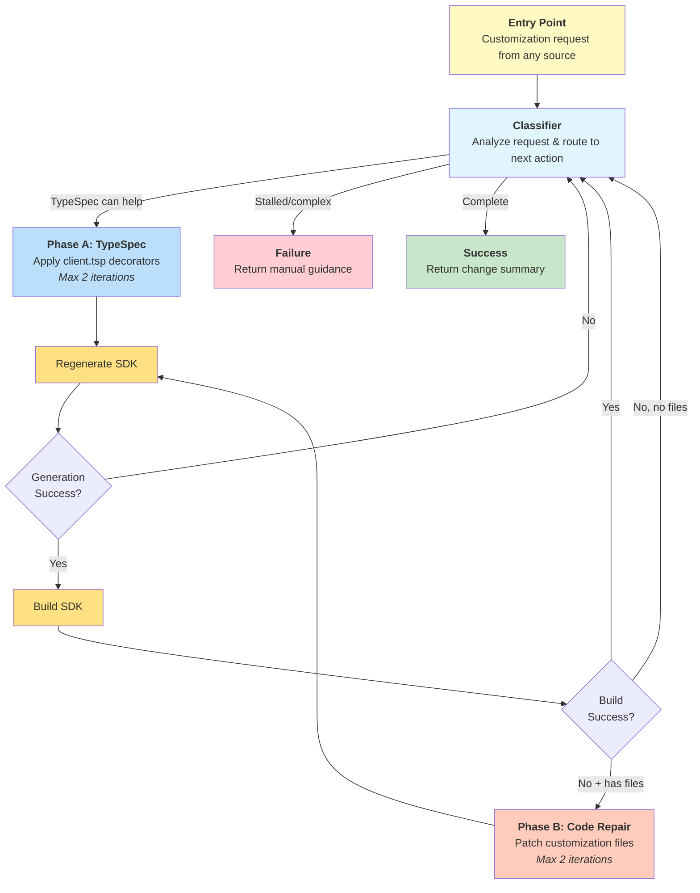

# Spec: Customizing Clients

## Table of Contents

- [Definitions](#definitions)
- [Background / Problem Statement](#background--problem-statement)
- [Goals and Exceptions/Limitations](#goals-and-exceptionslimitations)
- [Design Proposal](#design-proposal)
- [Usage Scenarios for Testing](#usage-scenarios-for-testing)
- [Pipeline/CI Considerations](#pipelineci-considerations)
- [Success Criteria](#success-criteria)
- [Open Questions](#open-questions)
- [Alternatives Considered](#alternatives-considered)

---

## Definitions

_Terms used throughout this spec with precise meanings:_

- **TypeSpec**: The specification language used to define Azure service APIs. SDK code is generated from TypeSpec specifications located in the azure-rest-api-specs repository.

- **<a id="typespec-customizations"></a>TypeSpec Customizations**: SDK-specific customizations made in the `client.tsp` file to control SDK generation. These include decorators, naming adjustments, and grouping modifications. This term does not refer to modifications of the service API TypeSpec files.

- **<a id="code-customizations"></a>Code Customizations**: Language-specific modifications applied to generated SDK code as a **post-emitter generation step**. These customizations are automatically reapplied during SDK regeneration through language-specific mechanisms (e.g., Java customization classes, Python `_patch.py` files, .NET partial classes). Examples include adding convenience methods, custom error handling, language-specific optimizations, imports, visibility modifiers, reserved keyword renames, and annotations. Also known as "handwritten code" or "customization layer."

- **API View**: A web-based tool for reviewing SDK APIs. It allows language architects and SDK team members to provide feedback on just the SDK APIs without needing to understand the underlying implementation.

- **<a id="customization-workflow"></a>Customization Workflow**: The end-to-end AI-assisted interactive process triggered by various entry points (build failures, API view feedback, PR comments, user prompts, etc.) that applies fixes and customizations to ensure SDK functionality. Tool applies changes (uncommitted), returns summary, and users decide whether to commit.

- **<a id="approval-checkpoint"></a>Approval Checkpoint**: A mandatory user confirmation step before committing changes. The tool returns a structured response containing a summary of changes made (TypeSpec decorators applied, code patches applied, files modified). The calling agent (GitHub Copilot) presents this summary to the user through the chat interface and handles the approval/rejection workflow. The tool itself does not implement approval UI - it delegates this responsibility to the agent orchestration layer.

- **<a id="entry-points"></a>Entry Points**: Various triggers that initiate the customization workflow including build failures, API view comments, PR feedback, user prompts, and linting/typing checks.

---

## Background / Problem Statement

Service teams spend significant manual effort maintaining SDK customizations when TypeSpec specifications change, leading to compilation failures and time-consuming fixes. TypeSpec describes service APIs, but we generate SDKs for 7+ languages with different idioms, requiring two types of customizations:

**[TypeSpec Customizations](#typespec-customizations)** (`client.tsp` decorators) control SDK generation but face challenges: service teams lack SDK expertise, AI agents make scoping mistakes across languages, and no shared process exists for identifying when decorators are needed.

**[Code Customizations](#code-customizations)** (language-specific preservation mechanisms) break when TypeSpec changes, requiring manual updates to `_patch.py` files, customization classes, and partial classes across different languages.

### Key Problems

**Customization Entry Points:**
- API View feedback and PR comments
- Build failures (compilation, analyzers, linting)
- Breaking changes analysis
- Manual user prompts

**Language-Specific Workflows:**
- **.NET**: Analyzers identify issues (e.g., naming violations) → manual `client.tsp` fixes after build failures
- **Go**: Breaking changes detection maps changelog patterns to `client.tsp` customizations
- **Python**: Breaking changes checks exist but no automation for applying `client.tsp` fixes
- **Java**: Uses `partial-update` config and customization classes ([23+ services](https://github.com/search?q=repo%3AAzure%2Fazure-rest-api-specs%20partial-update%3A%20true&type=code) use partial-update, [12+ services](https://github.com/search?q=repo%3AAzure%2Fazure-rest-api-specs+customization-class%3A&type=code) use customization classes)

**AI Agent Challenges:**
Despite [existing documentation](https://azure.github.io/typespec-azure/docs/howtos/generate-client-libraries/09renaming/), AI agents struggle with multi-language scoping and consistent decorator application.

**Root Gaps:**
- **No AI agent expertise**: Agents make `client.tsp` mistakes despite documentation, lack guidance on when to suggest decorators
- **No shared process**: Each language team has separate workflows for identifying/applying customizations
- **Manual maintenance burden**: TypeSpec changes break code customizations, requiring manual updates to `_patch.py`, customization classes, partial classes
- **No conflict detection**: No automated way to detect when customizations break after TypeSpec regeneration

### Impact

Service teams should focus on service APIs, not SDK customization mechanics. Automating common scenarios in the inner loop and simplifying outer loop feedback will reduce months-long cycles. Shared AI agent knowledge through azsdk-cli prevents each SDK team from teaching agents independently.

---

## Goals and Exceptions/Limitations

### Goals

- [ ] Improve the service team experience for authoring `client.tsp` customizations
- [ ] Simplify the process of _how_ to apply `client.tsp` customizations for language teams
- [ ] Automate the detection and resolution of build failures through intelligent application of both TypeSpec and code customizations
- [ ] Provide a unified approach for handling both TypeSpec and SDK code customizations through a single workflow
- [ ] Enable AI agents to become experts in both TypeSpec decorators and language-specific code customization patterns

### Limitations

**Code Customization Scope:**

The tool focuses initially on **deterministic, mechanical transformations** where fixes are unambiguous:

- ✅ **In Scope**: Duplicate field detection and removal, variable reference updates after renames, simple build fixes (imports, visibility modifiers, reserved keyword renames, type mismatches)
- ⚠️ **Stretch Goal**: Complex convenience methods, behavioral changes affecting SDK semantics, intricate AST manipulation patterns
- ❌ **Out of Scope**: Architectural decisions about SDK surface design, complex language-specific idioms requiring deep domain expertise

**Rationale:** The two-phase workflow prioritizes spec-first solutions (TypeSpec decorators handle ~80% of feature requests) with error-driven code repairs as a safety net (~10% mechanical fixes when builds fail). The remaining ~10% niche cases receive manual guidance. This v1 approach prioritizes measurable outcomes (build passes = success) with concrete error messages as natural boundaries, establishing proven safety for potential v2 expansion to pattern-based feature integration.

---

## Design Proposal

### Overview

The design addresses identified gaps through three components:

1. **TypeSpec Client Customizations Reference Document**: Shareable knowledge base teaching AI agents how to apply `Azure.ClientGenerator.Core` decorators effectively
2. **Enhanced CustomizedCodeUpdateTool**: Implements two-phase workflow (TypeSpec decorators → error-driven code repairs) with spec-first approach prioritizing `client.tsp` solutions
3. **Cross-Repository Support**: Tool modifies files in both azure-rest-api-specs and azure-sdk-for-* repos, leaving changes uncommitted for user review

### Detailed Design

#### 1. TypeSpec client customizations reference document

A TypeSpec client customizations reference document will serve as the foundation for teaching AI agents about the customizations available via the `Azure.ClientGenerator.Core` library. It includes concise documentation and examples for the decorators available in the library, as well as cover some common scenarios.

This is a living document - it can be updated over time as new decorators are added to the library or new common scenarios are identified. This is _not_ intended to contain guidance for every scenario each language SDK may encounter. For example, Go breaking changes detection looks for specific patterns in the changelog to identify client.tsp customizations. These patterns would not be covered in this document.

This lives in `eng/common/knowledge/customizing-client-tsp.md` so that all language SDK repos can reference it when needed.

#### Usage

This document will be referenced by [eng/common/instructions/azsdk-tools/typespec-docs.instructions.md](eng/common/instructions/azsdk-tools/typespec-docs.instructions.md). These instructions are already included in the azure-rest-api-specs repo when the user asks TypeSpec-related questions.

Additionally, it can be referenced by custom prompts or agents when knowledge of how to apply client.tsp customizations is needed.

#### 2. Package Customize Code Tool

The existing [CustomizedCodeUpdateTool](https://github.com/Azure/azure-sdk-tools/blob/main/tools/azsdk-cli/Azure.Sdk.Tools.Cli/Tools/TypeSpec/CustomizedCodeUpdateTool.cs) currently handles updating customized SDK code after TypeSpec regeneration. This tool will be enhanced to also handle `client.tsp` customizations, creating a unified workflow where users don't need to know whether TypeSpec decorators or code patches are needed—the tool determines the appropriate fix automatically.

**Rationale for single tool**: Users shouldn't need to choose between separate TypeSpec and code customization tools. A unified tool analyzes the issue, applies TypeSpec decorators when possible (Phase A), and falls back to code repairs only when builds fail (Phase B).

Name (MCP): `azsdk_package_customize_code`

#### Enhanced Tool Design

The existing CustomizedCodeUpdateTool will be enhanced to implement a two-phase customization workflow that accepts requests from multiple [entry points](#entry-points) and automatically routes to the appropriate fix strategy.

**Two-Phase Workflow:**

1. **Context Classifier**
   Analyzes requests and routes to: Phase A (TypeSpec can help), Success (done), or Failure (too complex/stalled). Phase B is not a classifier decision—it activates automatically on Phase A build failures when customization files exist.

1. **Phase A – [TypeSpec Customizations](#typespec-customizations):**
   Apply `client.tsp` decorators, regenerate SDK, validate build, return to classifier

1. **Phase B – [Code Customizations](#code-customizations):**

   - **Activation**: Phase A build fails AND customization files exist (Java: `/customization/` or `*Customization.java`, Python: `*_patch.py`, .NET: partial classes)

   - **Design Rationale**: Phase B operates under three principles:
     1. **Spec-First Always**: Only activates after Phase A build failures when customization files exist
     2. **Narrow Scope**: Mechanical transformations only; uncertain/complex cases get manual guidance. v2 may add pattern-based features while keeping error-driven activation
     3. **Safety Net**: Handles ~10% (build errors TypeSpec cannot solve); Phase A solves ~80%, remaining ~10% get manual guidance

   - **Scope** (<20 lines, <5 files, deterministic only):
     - ✅ **In**: Remove duplicates, update references, add imports, rename keywords, update type annotations
     - ❌ **Out**: Convenience methods, architecture changes, visibility (use `@access`), error handling, complex logic

   - **Workflow**: Analyze errors → Assess feasibility → Apply patches (if deterministic) OR return manual guidance → Validate → Iterate (max 2 attempts)

1. **Summary Response:**
   - Present summary of changes made to local repository files (TypeSpec and SDK code)
   - User reviews uncommitted changes and decides to commit or discard
   - Maximum 2 attempts per phase (4 total iterations)
   - Provide next step instructions for users

#### New inputs

- `--package-path`/`packagePath`: The path to the package (SDK) directory to check. Lives in one of the `azure-sdk-for-*` repos.
- `--customization-request`/`customizationRequest`: A text blob containing the customization request. This supports multiple [entry points](#entry-points):
  - **Build failures**: Compilation errors, linting violations, typing check failures
  - **User prompts**: Natural language requests like "rename the FooClient to BarClient for .NET"
  - **API review feedback**: Feedback from API View or PR comments
  - **Breaking changes**: Output from breaking changes analysis tools
- [optional] `--typespec-project-path`/`typespecProjectPath`: The path to the TypeSpec project directory containing `tspconfig.yaml`. Used when operating from the azure-rest-api-specs repository to specify which TypeSpec project to work with.

#### Workflow



**Benefits:**

- **Single Tool Experience**: Users don't need to know whether TypeSpec or code fixes are needed
- **Spec-First Approach**: Always attempts TypeSpec solutions before falling back to code patches
- **Error-Driven Repair**: Phase B activates automatically when builds fail and customization files exist

#### Classifier

The classifier analyzes context and routes to Phase A (TypeSpec can help), Success (done), or Failure (stalled/complex). Phase B activates automatically when Phase A fails and customization files exist.

**Routing Logic:**
- **Phase A**: TypeSpec decorators can address the issue
- **Success**: Task completed successfully
- **Failure (Manual Guidance)**: One of the following conditions:
  - Stalled: Same error appears twice consecutively in the same phase
  - Complex: Issue exceeds scope boundaries or context limits
  - **No Customization Files**: Phase A build fails but no customization files exist (Java: no `/customization/` or `*Customization.java`, Python: no `*_patch.py`, .NET: no partial classes). Tool suggests creating appropriate customization file for the language.

**Implementation**: Uses client customizations reference doc to determine if TypeSpec can address issues.

#### Context Tracking

The workflow loops through multiple iterations as it applies fixes. The classifier tracks what changes were tried and what issues remain to route correctly (Phase A, Success, or Failure).

**Example scenario:**

1. User requests: _"Rename getItems to listItems for Python"_
2. Phase A applies `@@clientName` decorator successfully
3. SDK regenerates successfully
4. Build fails: `_patch.py` references the old `getItems` method name
5. Loop back to classifier... with what context?

**Approach: Context Concatenation**

Append results from each phase and validation step to the original request, giving the classifier full history of changes and new issues.

**Context format example:**

```
Iteration 1: "Rename getItems to listItems for Python"

Iteration 2: "Rename getItems to listItems for Python
--- TypeSpec Changes Applied ---
Added @@clientName(getItems, "listItems", "python") to client.tsp
SDK regenerated successfully.
--- Build Result ---
Build failed: _patch.py:42 - NameError: 'getItems' is not defined"

Iteration 3: "Rename getItems to listItems for Python
--- TypeSpec Changes Applied ---
Added @@clientName(getItems, "listItems", "python") to client.tsp
SDK regenerated successfully.
--- Build Result ---
Build failed: _patch.py:42 - NameError: 'getItems' is not defined
--- Code Changes Applied ---
Updated _patch.py to reference 'listItems' instead of 'getItems'
--- Build Result ---
Build succeeded."
```

#### 3. Cross-Repository Change Management

The tool modifies files across two repositories but **does not commit changes** - it applies edits to the working directory and leaves them uncommitted for user review.

**Repository Requirements**:
- Both azure-rest-api-specs and azure-sdk-for-* repos must be cloned locally
- Tool derives TypeSpec project path from `tsp-location.yaml` in SDK package directory
- All file modifications remain uncommitted in local working directories

**Modified Files by Phase**:
- **Phase A**: Updates `client.tsp` in azure-rest-api-specs repo, regenerates SDK code in azure-sdk-for-* repo
- **Phase B**: Updates customization files (e.g., `*Customization.java`, `*_patch.py`, partial classes) in azure-sdk-for-* repo


**User Workflow After Tool Completion**:
1. **Review Changes**: Inspect uncommitted changes across both repositories using git status/diff
2. **Commit or Discard**: Commit changes to appropriate branches when satisfied, or discard if not
3. **Submit PR**: Follow standard PR process for both repositories

**Out of Scope**: Automatic commits, branch management, or CI/pipeline integration. The tool is designed for interactive local development only.

### MCP Usage Examples

**Example 1: User-provided customization request**

```json
{
  "tool": "azsdk_package_customize_code",
  "arguments": {
    "packagePath": "/path/to/sdk",
    "customizationRequest": "Rename FooClient to BarClient for .NET"
  }
}
```

**Example 2: Working from azure-rest-api-specs repo**

```json
{
  "tool": "azsdk_package_customize_code",
  "arguments": {
    "packagePath": "/path/to/sdk",
    "typespecProjectPath": "/path/to/specs/Foo/",
    "customizationRequest": "Breaking changes detected: FooOptions.timeout property type changed from int to Duration"
  }
}
```

**Example 3: Build failure handling**

```json
{
  "tool": "azsdk_package_customize_code",
  "arguments": {
    "packagePath": "/path/to/sdk",
    "customizationRequest": "Build failed with: error CS0246: The type or namespace name 'FooModel' could not be found"
  }
}
```

### Pipeline/CI Considerations

**Primary Usage Mode: Agent-Interactive**

The `azsdk_package_customize_code` tool is **primarily designed for agent-mode/interactive workflows** where users review uncommitted changes, provide iterative feedback, and make architectural decisions about SDK customizations.

**CI/Pipeline Usage: Out of Scope**

The tool is **not recommended for CI/pipeline usage** because:

1. **Human review required**: Customizations involve architectural decisions requiring domain expertise and approval
2. **Non-deterministic AI behavior**: AI-generated patches may vary across runs, making CI results unpredictable
3. **Iterative resolution**: Build failures may require multiple feedback cycles and human interpretation

**Recommended CI/Pipeline Workflow**

Instead of running `azsdk_package_customize_code` in CI, follow this pattern:

1. **Local Development**: Developers apply customizations interactively using agent mode
2. **Commit Changes**: Approved TypeSpec (`client.tsp`) and SDK code customizations are committed to source control
3. **CI Validation**: CI runs generation + build + test on the committed customizations using standard workflow tools:
   - `azsdk_package_generate_code` to regenerate SDK from committed TypeSpec
   - `azsdk_package_build_code` to validate builds
   - `azsdk_package_run_tests` to execute test suites

---

## Usage Scenarios for Testing

This section provides concrete test scenarios to validate the two-phase customization workflow. Each scenario demonstrates realistic conditions where both TypeSpec and code customizations may be required.

### Scenario 1: Customization Conflict After Non-Breaking TypeSpec Addition

**Description:** Service team adds optional property `operationId` to TypeSpec, but Java customization already injects this field manually, causing duplicate field compilation error.

**Entry Point:** Build failure

**Problem:** TypeSpec now generates `operationId`, conflicting with existing `addField("operationId")` in `DocumentIntelligenceCustomizations.java`.

**Error:**

```
[ERROR] Failed to execute goal org.apache.maven.plugins:maven-compiler-plugin:3.13.0:compile
/azure-ai-documentintelligence/src/main/java/com/azure/ai/documentintelligence/models/AnalyzeOperationDetails.java:[178,20] variable operationId is already defined in class AnalyzeOperationDetails
```

**Workflow Execution:**

| Phase                           | Action                                                                                                   | Result                                                 |
| ------------------------------- | -------------------------------------------------------------------------------------------------------- | ------------------------------------------------------ |
| **Phase A: TypeSpec**           | Analyze build failure<br/>Determine no TypeSpec changes needed<br/>(property already exists in spec)     | No TypeSpec modifications<br/>Forward issue to Phase B |
| **Phase B: Code Customization** | Detect duplicate field injection<br/>Remove `addField("operationId")` from customization<br/>Rebuild SDK | Build succeeds<br/>Customization simplified            |

**Acceptance Criteria:**
- Build completes with no errors (warnings are acceptable)
- Duplicate field `addField("operationId")` is removed from customization class
- Generated code contains the `operationId` property from TypeSpec
- SDK functionality is preserved (property accessible and works as expected)

**Key Learning:** Non-breaking TypeSpec additions can break existing customizations that manually inject the same fields.

---

### Scenario 2: API Review Feedback Requiring Multi-Language Customizations

**Description:** API review requests renaming model `AIProjectConnectionEntraIDCredential` to use "Id" (not "ID") in .NET, requiring scoped TypeSpec changes.

**Entry Point:** API review feedback

**Problem:** Model name doesn't follow .NET casing conventions ("Id" vs "ID").

**Workflow Execution:**

| Phase                 | Action                                                                                                                        | Result                                                              |
| --------------------- | ----------------------------------------------------------------------------------------------------------------------------- | ------------------------------------------------------------------- |
| **Phase A: TypeSpec** | Analyze feedback requirements<br/>Apply `@clientName` with proper scoping for .NET<br/>Regenerate .NET SDK<br/>Validate build | SDK regenerates successfully<br/>Build passes<br/>No Phase B needed |

**Acceptance Criteria:**
- `@@clientName` decorator applied with correct scope (e.g., `"csharp"`)
- Model renamed only in .NET SDK (other languages unchanged)
- SDK regenerates successfully
- Build completes with no errors

**Key Learning:** API review naming feedback typically resolved with scoped `@clientName` decorators. Tool validates all affected language builds.

**Note:** Sample updates are out of scope for the customization workflow—sample errors are ignored during validation as they may require manual updates. Generated samples are automatically updated during regeneration; handwritten samples may require manual updates or use of `azsdk_package_samples_generate`. In this example, samples that reference `AIProjectConnectionEntraIDCredential` may require manual updates or regeneration using `azsdk_package_samples_generate`. Sample updates are out of scope for the customization workflow—samples are not validated during SDK builds.

---

### Scenario 3: TypeSpec Rename Causing Customization Drift

**Description:** Service team renames property `displayName` → `name` in TypeSpec. Java customization still references old name `getField("displayName")`, causing "cannot find symbol" error.

**Entry Point:** Build failure after regeneration

**Problem:** Customization references non-existent field after TypeSpec rename.

**Error:**

```
cannot find symbol: method getField(String)
Note: Field 'displayName' no longer exists in generated model
```

**Workflow Execution:**

| Phase                           | Action                                                                                                                       | Result                                                                                                                              |
| ------------------------------- | ---------------------------------------------------------------------------------------------------------------------------- | ----------------------------------------------------------------------------------------------------------------------------------- |
| **Phase A: TypeSpec**           | Regenerate SDK with updated TypeSpec<br/>Rename is intentional and correct<br/>No TypeSpec changes needed from SDK developer | SDK regenerated successfully<br/>Generated model now has `name` instead of `displayName`<br/>Build fails due to customization drift |
| **Phase B: Code Customization** | Detect reference to non-existent field `displayName`<br/>Update customization to reference `name`<br/>Rebuild SDK            | Build succeeds<br/>Customization aligned with new property name                                                                     |

**Acceptance Criteria:**
- TypeSpec regeneration completes successfully
- All references to old property name `displayName` updated to `name` in customization files (validated in all locations)
- Build completes with no errors
- SDK functionality is preserved (property accessible with new name)

**Key Learning:** Non-breaking TypeSpec renames break customizations referencing old names. Both phases needed to align spec and customization code.

---

### Scenario 4: Hide Operation from Python SDK

**Description:** Hide internal polling operation `getCreateProjectStatus` from Python SDK using language-scoped `@access` decorator.

**Entry Point:** User prompt ("Remove get_create_project_status from Python SDK")

**Workflow Execution:**

| Phase                 | Action                                                                                                          | Result                                                                                                   |
| --------------------- | --------------------------------------------------------------------------------------------------------------- | -------------------------------------------------------------------------------------------------------- |
| **Phase A: TypeSpec** | Apply `@access` decorator to mark operation as internal for Python<br/>Regenerate Python SDK<br/>Validate build | SDK regenerates successfully<br/>Operation hidden from public API<br/>Build passes<br/>No Phase B needed |

**Acceptance Criteria:**
- `@@access` decorator applied with correct scope (e.g., `"python"`)
- Operation `getCreateProjectStatus` hidden from public API in Python SDK only
- SDK regenerates successfully
- Build completes with no errors

**Key Learning:** `@access` decorator provides language-scoped visibility control without code customizations.

---

### Scenario 5: .NET Build Errors from Analyzer

**Description:** .NET analyzer errors (AZC0030, AZC0012) for naming violations: model ends with "Parameters", type name "Tasks" too generic.

**Entry Point:** Build failure (.NET analyzer)

**Errors:**

- `AZC0030`: Model name ends with 'Parameters'
- `AZC0012`: Type name 'Tasks' too generic

**Workflow Execution:**

| Phase                 | Action                                                                                                                                            | Result                                                                                             |
| --------------------- | ------------------------------------------------------------------------------------------------------------------------------------------------- | -------------------------------------------------------------------------------------------------- |
| **Phase A: TypeSpec** | Parse analyzer error messages<br/>Apply `@clientName` decorators for .NET<br/>Rename problematic types<br/>Regenerate .NET SDK<br/>Validate build | SDK regenerates with new names<br/>Analyzer errors resolved<br/>Build passes<br/>No Phase B needed |

**Acceptance Criteria:**
- `@@clientName` decorators applied for all analyzer violations (AZC0030, AZC0012, etc.)
- All .NET analyzer errors resolved
- Build completes with no errors
- Renamed types follow .NET naming conventions

**Key Learning:** .NET analyzer errors resolved with scoped `@clientName` decorators, no code customizations required.

---

### Scenario 6: Create Python Subclient Architecture

**Description:** Restructure Python SDK with main client (`DocumentProcessingClient`) for service operations and subclient (`ProjectClient`) for project-scoped operations.

**Entry Point:** User prompt ("Use 2 clients for Python SDK: one main client and one sub-client that specifies the project id")

**Workflow Execution:**

| Phase                 | Action                                                                                                                                                                                                                                              | Result                                                                              |
| --------------------- | --------------------------------------------------------------------------------------------------------------------------------------------------------------------------------------------------------------------------------------------------- | ----------------------------------------------------------------------------------- |
| **Phase A: TypeSpec** | Create `client.tsp` with custom client definitions<br/>Define main client for project operations<br/>Define subclient for document operations<br/>Use `@client` and `@clientInitialization` decorators<br/>Regenerate Python SDK<br/>Validate build | SDK regenerates with two-client architecture<br/>Build passes<br/>No Phase B needed |

**Acceptance Criteria:**
- `@client` decorator creates correct two-client structure (main client + subclient)
- `@clientInitialization` decorator applied if needed for project ID parameter
- SDK regenerates successfully with new architecture
- Build completes with no errors
- Client architecture matches requirements (operations correctly distributed)

**Key Learning:** Complex client architecture achieved with TypeSpec decorators alone, no code customizations required.

---

### Scenario 7: Feature Request Requiring Code Customization (No TypeSpec Solution)

**Description:** User requests adding operation ID extraction from polling headers for Java LRO operations, but TypeSpec has no decorator to customize polling behavior or extract data from response headers.

**Entry Point:** User prompt ("Add operationId property to AnalyzeOperationDetails by parsing it from the Operation-Location header during polling")

**Problem:** LRO polling needs to extract operation ID from `Operation-Location` header and inject it into `AnalyzeOperationDetails` response object. TypeSpec cannot customize polling strategies or header parsing logic. No customization files exist yet.

**Workflow Execution:**

| Phase                 | Action                                                                                                                        | Result                                                              |
| --------------------- | ----------------------------------------------------------------------------------------------------------------------------- | ------------------------------------------------------------------- |
| **Phase A: TypeSpec** | Analyze request<br/>Determine no TypeSpec decorator supports polling customization or header extraction<br/>No TypeSpec changes applicable | SDK unchanged<br/>No customization files found |
| **Manual Guidance** | Detect no `/customization/` directory or `*Customization.java` files exist<br/>Return guidance to create customization infrastructure | Tool suggests creating customization class with LRO polling examples |

**Acceptance Criteria:**
- Tool determines TypeSpec cannot solve the request (no applicable decorators for polling/headers)
- Tool identifies no customization files exist for Java
- Tool returns manual guidance including:
  - Instruction to create customization infrastructure (e.g., `DocumentIntelligenceCustomizations.java`)
  - Code pattern/example for customizing polling strategies with header extraction
  - Reference to Java customization documentation and LRO customization examples

**Key Learning:** When feature requests involve runtime behavior like polling strategies or header extraction that TypeSpec cannot address, tool provides guidance to create the appropriate customization files with concrete examples.

---

### Testing Checklist

Use these scenarios to validate the customization workflow implementation:

- [ ] **Scenario 1**: Duplicate field injection detection and removal (Phase B focus)
- [ ] **Scenario 2**: API review feedback with single or multi-language scoping (Phase A focus)
- [ ] **Scenario 3**: TypeSpec property rename causing customization drift (Both phases)
- [ ] **Scenario 4**: Hide operation from Python SDK (Phase A focus)
- [ ] **Scenario 5**: .NET build errors from analyzer (Phase A focus)
- [ ] **Scenario 6**: Create Python subclient architecture (Phase A focus)
- [ ] **Scenario 7**: Build failure with no customization files (Manual guidance)
- [ ] **Summary response**: Tool returns change summary with all modifications
- [ ] **Change summary**: Tool returns structured response with all changes (TypeSpec decorators, code patches, files modified)
- [ ] **Max retry limit**: Tool stops after 2 attempts per phase (Phase A: 2, Phase B: 2, total: 4 iterations)
- [ ] **Stall detection**: Tool detects when same error appears twice consecutively
- [ ] **Context limit**: Tool monitors context size and fails gracefully when exceeding character limits
- [ ] **Build validation**: All scenarios complete with no build errors (warnings acceptable)

---

## Success Criteria

- [ ] **Automated Detection**: Correctly identify build failure types across all supported languages
- [ ] **Phase A Success (80% Coverage)**: Successfully apply [TypeSpec Customizations](#typespec-customizations) for 80%+ of feature requests and specification issues
  - Measured by: SDK regenerates successfully + build passes + no Phase B needed
  - Examples: Model renaming, operation hiding, client restructuring, visibility changes
- [ ] **Phase B Success (10% Coverage)**: Successfully apply [Code Customizations](#code-customizations) for 50-70%+ of mechanical repairs when Phase A builds fail
  - Success measured by: build passes after Phase B, changes are within scope boundaries (<20 lines, <5 files)
  - Phase B is error-driven safety net for TypeSpec-induced customization conflicts
  - Examples: Duplicate field removal, reference updates, import fixes
- [ ] **Manual Guidance (10% Coverage)**: Remaining niche cases receive structured guidance for manual implementation
  - Includes suggesting creation of customization files when Phase A fails and no files exist
  - Examples: Complex architectural changes, niche language-specific patterns, stalled iterations
- [ ] **Efficiency**: Reduce manual effort in SDK regeneration workflows by 60%+
- [ ] **Interactive Workflow**: Tool applies changes (uncommitted) and returns summary for user review
- [ ] **Cross-Language**: Support .NET, Java, JavaScript, Python, and Go

## Open Questions

### v1 Implementation

- **Error Message Parsing**: Best approach for extracting file paths and line numbers from different language build systems (.NET, Java Maven, Python mypy, etc.)?
- **Python "Build" Definition**: What constitutes a "build failure" for Python (mypy/flake8 failures, import errors, or both)?
- **Java AST Complexity**: Should v1 focus on in-place editing only, deferring AST manipulation to v2?
- **Context Growth**: At what point should we implement context summarization to avoid LLM processing limits?

## Alternatives Considered

### Alternative 1: Emit-Validate-Propose Loop

**Description:**
[Original design proposal](https://gist.github.com/chrisradek/9ab52a0a13faac6b794d32be87c26785)
A CLI command/MCP tool that takes a typespec project path and a package path (emitted SDK path) as input. This then runs a loop of: Emit SDK -> Validate SDK -> Propose customizations to `client.tsp` -> repeat.

**Pros:**

- Codifies the loop .NET already has into a reusable tool that enforces a sequence of steps
- Can be used by multiple languages - each language provides their implementation of the validate/propose steps

**Cons:**

- Too specific to .NET's workflow of emit, build, fix. Go better served with emit, validateAndFix.
- Not clear when AI should call the MCP tool, as each language may have a different process (e.g. .NET build vs Go changelog analysis)

**Why not chosen:**

The original design only attempted to address 1 of the 3 areas: providing the infra in azsdk-cli to steer customizations. It relied on each language to provide their own mechanism for both identifying and applying `client.tsp` customizations. It was also completely separate from the existing `CustomizedCodeUpdateTool` MCP tool, meaning it had to perform many of the same steps (e.g. generate/build SDK) while not being clear when it should be invoked.

---
