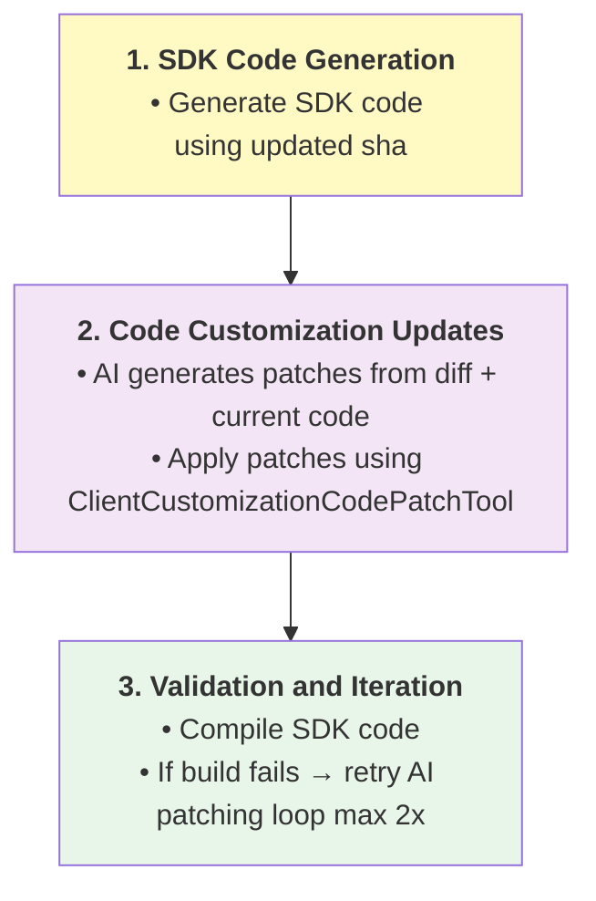
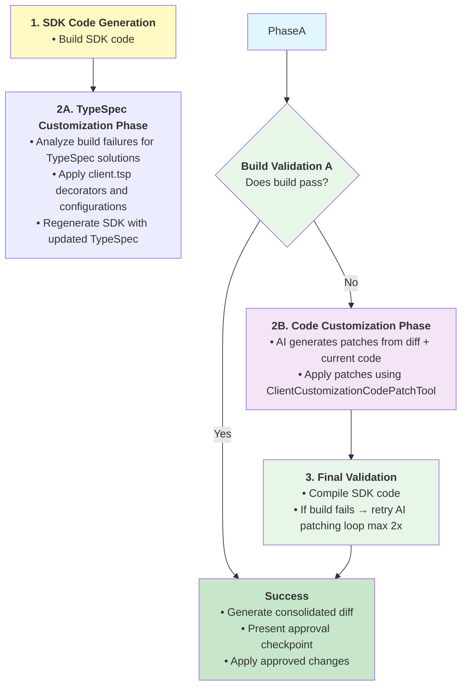

# Spec: Customizing Client TypeSpec

## Table of Contents

- [Definitions](#definitions)
- [Background / Problem Statement](#background--problem-statement)
- [Goals and Exceptions/Limitations](#goals-and-exceptionslimitations)
- [Design Proposal](#design-proposal)
- [Context Differences](#context-differences)
- [Success Criteria](#success-criteria)
- [Open Questions](#open-questions)
- [Alternatives Considered](#alternatives-considered)

---

## Definitions

_Terms used throughout this spec with precise meanings:_

- **TypeSpec**: The specification language used to define Azure service APIs. SDK code is generated from TypeSpec specifications located in the azure-rest-api-specs repository.

- **<a id="typespec-customizations"></a>TypeSpec Customizations**: SDK-specific customizations made in the `client.tsp` file to control SDK generation. These include decorators, naming adjustments, and grouping modifications. This term does not refer to modifications of the service API TypeSpec files.

- **<a id="code-customizations"></a>Code Customizations**: Hand-written modifications made directly to generated SDK code after generation. These customizations exist within the SDK language repositories and must be preserved across regeneration. Examples include adding convenience methods, custom error handling, language-specific optimizations, imports, visibility modifiers, reserved keyword renames, and annotations. Also known as "handwritten code" or "customization layer."

- **API View**: A web-based tool for reviewing SDK APIs. It allows language architects and SDK team members to provide feedback on just the SDK APIs without needing to understand the underlying implementation.

- **<a id="build-failure-handling"></a>Build Failure Handling**: The automated process of detecting, analyzing, and resolving SDK build failures through intelligent application of fixes.

- **<a id="customization-workflow"></a>Customization Workflow**: The end-to-end process triggered by various entry points (build failures, API view feedback, PR comments, etc.) that applies fixes and customizations to ensure SDK functionality.

- **<a id="consolidation-diff"></a>Consolidated Diff**: A unified summary of all changes made across both TypeSpec specifications and SDK code during the customization workflow.

- **<a id="approval-checkpoint"></a>Approval Checkpoint**: A mandatory user confirmation step before applying changes, implemented differently in CLI (interactive prompt) vs. MCP (agent UI) contexts.

- **<a id="agentic-context"></a>Agentic Context**: Execution environment within VS Code with GitHub Copilot agent integration, providing enhanced file access and user experience.

- **<a id="cli-context"></a>CLI Context**: Direct command-line execution environment with explicit commands and parameters.

- **<a id="entry-points"></a>Entry Points**: Various triggers that initiate the customization workflow including build failures, API view comments, PR feedback, user prompts, and linting/typing checks.

---

## Background / Problem Statement

Service teams spend significant manual effort updating customized code when regenerating SDKs from updated TypeSpec specifications, leading to compilation failures and time-consuming manual fixes that can take months of back-and-forth communication. TypeSpec specs are written to describe service APIs, however our team supports generating SDKs in no less than 7 languages, each differing in their idioms. There are two primary types of customizations that users can apply, each with distinct challenges:

**TypeSpec Customizations** involve modifications to `client.tsp` files using decorators from [Azure.ClientGenerator.Core](https://azure.github.io/typespec-azure/docs/libraries/typespec-client-generator-core/reference/) to control SDK generation. Problems with TypeSpec customizations include: service teams cannot be expected to understand SDK API patterns and best practices on their own, AI agents make mistakes when applying customizations even with existing documentation, particularly when `scope` is required or customizations span multiple languages, and there's no shared process across language teams for identifying when TypeSpec customizations are needed.

**Code Customizations** involve hand-written modifications made directly to generated SDK code after generation, which must be preserved across regeneration cycles. Problems with code customizations include: different languages support various preservation mechanisms that need individual maintenance, manual effort required to update customized code when TypeSpec specifications change, and compilation failures when customizations don't match new generated code.

### Current State

Currently, feedback and triggers for applying both TypeSpec and SDK code customizations can come from various sources:

1. **From reviews**: API View feedback, PR comments requesting naming changes or SDK restructuring
2. **From automated processes**:
   - **Build failures**: Compilation errors, syntax issues, import problems
   - **Code analyzers**: .NET API compat tool, linting violations (mypy, flake8)
   - **Typing checks**: Python mypy validation, other language-specific type checking
3. **From manually triggered processes**: Breaking changes analysis, changelog review, manual user prompts through conversational interfaces

#### TypeSpec Customization Workflows by Language

**.NET**:
The .NET SDK has code analyzers and an [API compat](https://learn.microsoft.com/en-us/dotnet/fundamentals/apicompat/overview) tool that run during their SDK build (`dotnet build`) that identifies problematic code (e.g. class names that don't follow .NET naming conventions) and suggests fixes.
Many of these fixes are handled by adding customizations to `client.tsp` for .NET, such as renaming models with `@clientName`. Currently these fixes are manually applied after SDK builds fail.
_.NET has a clear flow for identifying and applying `client.tsp` customizations via: Emit SDK -> Build SDK -> Apply fixes -> Repeat._

**Go**:
The Go SDK has a [breaking changes](https://github.com/Azure/azure-sdk-for-go/blob/instruction/.github/prompts/go-sdk-breaking-changes-review.prompts.md) prompt that analyzes the generated SDK's changelog for specific patterns and maps those to `client.tsp` customizations where possible.
_We don't currently have a clear step in our process for identifying breaking changes, but the flow for Go is: Emit SDK -> Analyze changelog & apply fixes -> Repeat._

**Python**:
The Python SDK has [breaking changes](https://github.com/Azure/azure-sdk-for-python/tree/main/scripts/breaking_changes_checker) checks that may be resolvable via `client.tsp` customizations, but there is no automated process for identifying or applying these client.tsp customizations today.

**Java**:
Java SDKs use TypeSpec configuration to control code customization behavior:

- **Partial Update Configuration (`partial-update: true`)**: Configured in TypeSpec to enable developers to edit generated code directly, with the emitter preserving manual changes during regeneration. Used by [23+ services](https://github.com/search?q=repo%3AAzure%2Fazure-rest-api-specs%20partial-update%3A%20true&type=code). This TypeSpec setting enables the emitter to preserve customizations during code generation.

#### SDK Code Customization Workflows by Language

**Java**:
SDKs handle code customizations through:

- **Customization Classes (`customization-class`)**: Separate Java classes that modify generated code using AST manipulation. Used by [12+ services](https://github.com/search?q=repo%3AAzure%2Fazure-rest-api-specs+customization-class%3A&type=code). Handles complex transformations like method visibility changes and reserved keyword conflicts.

**Python**:
Python SDKs handle code customizations through:

- **`_patch.py` Files**: The primary mechanism for Python SDK customizations, where developers create `_patch.py` files that modify generated code through function replacement. This allows for adding convenience methods, modifying class behavior, and implementing Python-specific patterns while preserving changes during regeneration.

#### Cross-Language Challenges

**All Languages**:
All language SDKs have their APIs reviewed in API View. Common feedback includes renaming models per language, or changing operations that appear in a client. We have documentation for customizing SDKs such as [renaming types](https://azure.github.io/typespec-azure/docs/howtos/generate-client-libraries/09renaming/), but recent (10/14/2025) testing shows that even with the current documentation, AI agents have difficulty applying these customizations correctly in a consistent manner: particularly when `scope` is required or customizations are spread over multiple languages/sessions. For example, when creating custom clients using `@client` with different naming for different languages, many times the agent would properly create the custom client for the first language prompted, but then incorrectly use a `@clientName` for the next language prompted.

#### Gaps

The current state exposes gaps in both TypeSpec customization and code customization workflows:

**TypeSpec Customization Gaps:**

- **AI agents are not experts on client customizations.** They make mistakes when applying customizations to `client.tsp`, even with access to the existing documentation.
- **AI agents don't know when to suggest client customizations.** There is no mechanism in azsdk-cli today to steer AI agents to focus on applying `client.tsp` customizations.
- **Nothing shared across languages.** Each language team has their own process for identifying and applying `client.tsp` customizations.
- **Difficult to apply changes from outside the inner loop.** We lack a process for updating `client.tsp` from outside the azure-rest-api-specs repo.

**Code Customization Workflow Gaps:**

- **Manual maintenance burden.** Service teams must manually update partial-update files, `_patch.py` files, and customization classes when TypeSpec specifications change, often leading to compilation failures.
- **Outdated customization logic.** Customization classes and AST manipulation logic become outdated when generated code structure changes, requiring manual updates.
- **No automated conflict detection.** There's no automated way to detect when code customizations conflict with new generated code patterns.
- **Cross-language inconsistency.** Each language has different approaches for applying and maintaining code customizations, with no shared tooling or processes.
- **Preservation complexity.** Different preservation mechanisms (partial-update, `_patch.py`, customization classes, partial classes) require language-specific knowledge and maintenance.

### Why This Matters

We should minimize the amount of time service teams spend on customizing their TypeSpec for each SDK language. Let them focus on what they are experts on - the service API - rather than figuring out how to apply SDK-specific feedback to their TypeSpec.

We can reduce the time spent in the outer loop by detecting and handling common client customization scenarios automatically while devs are still in the inner loop. When service teams still have feedback to address from the outer loop, we should make it both easy to apply and to verify those changes are correct.

SDK teams also shouldn't each be responsible for teaching AI agents how to apply `client.tsp` customizations. This should be a shared responsibility that the azsdk-cli can help facilitate.

---

## Goals and Exceptions/Limitations

### Goals

What are we trying to achieve with this design?

- [ ] Improve the service team experience for authoring `client.tsp` customizations
- [ ] Simplify the process of _how_ to apply `client.tsp` customizations for language teams
- [ ] Automate the detection and resolution of build failures through intelligent application of both TypeSpec and code customizations
- [ ] Provide a unified approach for handling both TypeSpec and SDK code customizations through a single workflow
- [ ] Enable AI agents to become experts in both TypeSpec decorators and language-specific code customization patterns

---


## Design Proposal

### Overview

### Overview

The design will address the identified gaps by implementing a unified two-phase build failure handling and customization workflow that:

1. **Creates AI agent expertise** through a shareable TypeSpec client customizations reference document that teaches agents how to apply `Azure.ClientGenerator.Core` decorators effectively.
2. **Enhances the existing CustomizedCodeUpdateTool** to implement intelligent Phase A (TypeSpec customizations) and Phase B (code customizations) remediation, providing a spec-first approach to build failure resolution.
3. **Enables cross-repository workflow** through git patch support, allowing `client.tsp` customizations to be applied from SDK repositories back to azure-rest-api-specs.

### Detailed Design

#### 1. TypeSpec client customizations reference document

A TypeSpec client customizations reference document will serve as the foundation for teaching AI agents about the customizations available via the `Azure.ClientGenerator.Core` library. It includes concise documentation and examples for the decorators available in the library, as well as cover some common scenarios.

This is a living document - it can be updated over time as new decorators are added to the library or new common scenarios are identified. This is _not_ intended to contain guidance for every scenario each language SDK may encounter. For example, Go breaking changes detection looks for specific patterns in the changelog to identify client.tsp customizations. These patterns would not be covered in this document.

This will live in `eng/common/knowledge/customizing-client-tsp.md` so that all language SDK repos can reference it when needed.

The proposed document can be found here: [TypeSpec Client Customizations Reference](https://gist.github.com/chrisradek/f3f3f6992e36be1bab10ed3072976a26)

#### Usage

This document will be referenced by [eng/common/instructions/azsdk-tools/typespec-docs.instructions.md](eng/common/instructions/azsdk-tools/typespec-docs.instructions.md). These instructions are already included in the azure-rest-api-specs repo when the user asks TypeSpec-related questions.

Additionally, it can be referenced by custom prompts, chatmodes, or agents when knowledge of how to apply client.tsp customizations is needed. For example, it can be referenced by the [api-review-feedback chatmode](https://github.com/Azure/azure-rest-api-specs/blob/main/.github/chatmodes/api-review-feedback.chatmode.md) to provide the details on how to apply client customizations, while the chatmode provides additional validation steps or constraints.

#### 2. Customized Code Update Tool

There is an existing [CustomizedCodeUpdateTool](https://github.com/Azure/azure-sdk-tools/blob/main/tools/azsdk-cli/Azure.Sdk.Tools.Cli/Tools/TypeSpec/CustomizedCodeUpdateTool.cs) that supports updating customized SDK code after generating an SDK from TypeSpec. Splitting `client.tsp` customization into its own tool (see alternative 1) will put the burden on our users to know whether TypeSpec or SDK code customizations are required to address feedback or breakages. Applying and verifying `client.tsp` customizations should be merged with this existing tool.

Name (CLI): `azsdk tsp customized-update`
Name (MCP): `azsdk_customized_code_update`

#### Current Inputs

- `--package-path`/`packagePath`: The path to the package (SDK) directory to check. Lives in one of the `azure-sdk-for-*` repos.
- `--update-commit-sha`/`commitSha`: The SHA of the commit in `azure-rest-api-specs` to use when regenerating the SDK.

#### Current behavior

The tool currently works primarily in an `azure-sdk-for-*` repo.



### Proposed Changes

The existing CustomizedCodeUpdateTool will be enhanced to implement a two-phase customization workflow:

**Enhanced Tool Behavior:**

The tool accepts customization requests from multiple [entry points](#entry-points) through the `customizationRequest` parameter. This unified text input allows the tool to handle:

- Build failures (compilation errors, linting, typing checks)
- User prompts (natural language requests from agents or CLI)
- API review feedback (comments from API View or PRs)
- Breaking changes analysis output

**Two-Phase Workflow:**

1. **Phase A – [TypeSpec Customizations](#typespec-customizations):**
   - Analyze the customization request to determine if TypeSpec decorators can address the issues
   - Apply `client.tsp` adjustments (decorators, naming, grouping, scope configurations)
   - Re-run TypeSpec compilation and regenerate SDK code
   - Validate build and proceed to Phase B only if issues remain
   - **Note**: The TypeSpec microagent may identify parts of the request that cannot be handled via `client.tsp` changes and forward those to Phase B

2. **Phase B – [Code Customizations](#code-customizations):**
   - If Phase A doesn't resolve all issues, apply language-specific code patches
   - Use existing ClientCustomizationCodePatchTool for SDK code modifications
   - Apply safe patches: imports, visibility modifiers, reserved keyword renames, annotations
   - Validate final build and generate consolidated diff

3. **Summary & Approval:**
   - Generate [consolidated diff](#consolidation-diff) of all changes (spec + SDK code)
   - Enforce approval before commit (CLI: interactive prompt, MCP: agent UI)
   - Maximum of 2 fix cycles to prevent infinite loops
   - Provide next step instructions for users

#### New inputs

- `--package-path`/`packagePath`: The path to the package (SDK) directory to check. Lives in one of the `azure-sdk-for-*` repos.
- `--customization-request`/`customizationRequest`: A text blob containing the customization request. This supports multiple [entry points](#entry-points):
  - **Build failures**: Compilation errors, linting violations, typing check failures
  - **User prompts**: Natural language requests like "rename the FooClient to BarClient for .NET"
  - **API review feedback**: Feedback from API View or PR comments
  - **Breaking changes**: Output from breaking changes analysis tools
- [optional] `--typespec-project-path`/`typespecProjectPath`: The path to the TypeSpec project directory containing `client.tsp`. Used when operating from the azure-rest-api-specs repository to specify which TypeSpec project to work with.

**Workflow:**



**Benefits:**

- **Single Tool Experience**: Users don't need to know whether TypeSpec or code fixes are needed
- **Spec-First Approach**: Always attempts TypeSpec solutions before falling back to code patches  
- **Backward Compatibility**: Existing tool behavior preserved when TypeSpec fixes are disabled
- **Unified Approval**: Single consolidated diff covers both TypeSpec and code changes
- **Intelligent Routing**: Tool determines the appropriate fix phase based on failure analysis

#### 3. Git Patch Support

There are at least 2 scenarios where we want to commit `client.tsp` changes back to the azure-rest-api-specs repo:

- When locally building and testing changes to `client.tsp` before submitting a PR.
- When CI can detect and suggest `client.tsp` changes automatically.

This spec only attempts to address the first scenario where a service team is working locally. Applying changes automatically in CI is out of scope for this spec but can be considered in the future.

**Operating from azure-rest-api-specs repo**

When a user is operating from within the azure-rest-api-specs repo, `client.tsp` updates can be staged and committed as normal git changes. No special work is needed.

**Operating from azure-sdk-for-\* repo with azure-rest-api-specs clone**

When operating from within an SDK repo with a local clone of the azure-rest-api-specs repo, we can directly apply the changes to the local clone. No special work is needed.

**Operating from azure-sdk-for-\* repo without azure-rest-api-specs clone**

When users are operating from within an SDK repo without a local clone of the azure-rest-api-specs repo, create a git patch file that contains the changes to `client.tsp`, along with next steps for how to apply this patch file to the azure-rest-api-specs repo.

### CLI Usage Examples

**Example 1: User-provided customization request**

```bash
# Apply specific customization from user prompt
azsdk package customized-code-update \
  --project-path /path/to/sdk \
  --customization-request "Rename FooClient to BarClient for .NET"
```

**Example 2: API review feedback**

```bash
# Apply feedback from API View
azsdk package customized-code-update \
  --project-path /path/to/sdk \
  --customization-request "API review feedback: Model names should be PascalCase. Change 'fooModel' to 'FooModel'"
```

**Example 3: Build failure handling**

```bash
# Apply fixes for build errors
azsdk package customized-code-update \
  --project-path /path/to/sdk \
  --customization-request "Build failed with: error CS0246: The type or namespace name 'FooModel' could not be found"
```

**Behavior:**

- Phase A: Apply [TypeSpec Customizations](#typespec-customizations) → regenerate → validate build
- Phase B: Apply [Code Customizations](#code-customizations) → validate build
- Output: Summary of changes and [approval prompt](#approval-checkpoint)

### MCP Usage Examples

**Example 1: User-provided customization request**

```json
{
  "tool": "azsdk_customized_code_update",
  "arguments": {
    "packagePath": "/path/to/sdk",
    "customizationRequest": "Rename FooClient to BarClient for .NET"
  }
}
```

**Example 2: Working from azure-rest-api-specs repo**

```json
{
  "tool": "azsdk_customized_code_update",
  "arguments": {
    "packagePath": "/path/to/sdk",
    "typespecProjectPath": "/path/to/specs/Foo/",
    "customizationRequest": "Breaking changes detected: FooOptions.timeout property type changed from int to Duration"
  }
}
```

**Example 3: Build failure handling**

```json
{
  "tool": "azsdk_customized_code_update",
  "arguments": {
    "packagePath": "/path/to/sdk",
    "customizationRequest": "Build failed with: error CS0246: The type or namespace name 'FooModel' could not be found"
  }
}
```

### Agent Conversation Examples

**Example 1: Build Failure Entry Point**
```text
User: My SDK build failed, can you fix it?
Agent: Running build now...
Agent: Build failed with errors: naming collision in client.tsp and missing import in FooClient.java.
Agent: Applying TypeSpec fixes first (added @friendlyName to client.tsp), regenerating SDK...
Agent: Build still failing, applying SDK code fix (added missing import in FooClient.java).
Agent: Build succeeded! Here's the summary:
- client.tsp: Added @friendlyName("FooServiceClient")
- FooClient.java: Added import com.azure.core.util.Context
Approve these changes?
User: Approve.
Agent: Changes applied. SDK build passing.
```

**Example 2: User Prompt Entry Point**
```text
User: I need to rename the FooClient to BarClient for .NET only
Agent: I'll apply that customization to client.tsp...
Agent: Added @clientName("BarClient", "csharp") to FooClient in client.tsp
Agent: Regenerating SDK and validating build...
Agent: Build succeeded! Changes summary:
- client.tsp: Added @clientName("BarClient", "csharp") decorator
Approve these changes?
User: Approve.
Agent: Changes applied.
```

**Example 3: API Review Feedback Entry Point**
```text
User: API review feedback says: "Model names should follow PascalCase convention. Change 'fooModel' to 'FooModel' for Python"
Agent: Analyzing feedback and determining if TypeSpec changes can address this...
Agent: This requires a @clientName decorator in client.tsp for Python scope.
Agent: Applied @clientName("FooModel", "python") to fooModel, regenerating SDK...
Agent: Build succeeded! Changes summary:
- client.tsp: Added @clientName("FooModel", "python") to fooModel
Approve these changes?
User: Approve.
Agent: Changes applied. You can now submit this for API review.
```

---

## Context Differences

### Assumptions: Agentic vs CLI Contexts

Assumptions for running the customization tooling in [agentic](#agentic-context) (VS Code, Copilot agent) versus [CLI contexts](#cli-context):

#### Agentic Context (VS Code + GitHub Copilot)

- Enhanced user experience and file access capabilities
- Natural language interface for requesting fixes
- Full repository context and intelligent code understanding
- Approval via UI through agent interaction

#### CLI Context

- Suitable for CI/CD integration and automated workflows
- Direct command execution with specific parameters
- Patch files and interactive terminal prompts for approval
- CLI context capabilities may be expanded in future phases
- Core logic for fixes is consistent across both contexts
- User experience is tailored to each execution environment

---

## Success Criteria

- [ ] **Automated Detection**: Correctly identify build failure types across all supported languages
- [ ] **Phase A Success**: Successfully apply [TypeSpec Customizations](#typespec-customizations) for common specification issues  
- [ ] **Phase B Success**: Successfully apply [Code Customizations](#code-customizations) for common code issues
- [ ] **Approval Workflow**: Enforce [approval checkpoints](#approval-checkpoint) in both contexts
- [ ] **Cross-Language**: Support .NET, Java, JavaScript, Python, and Go

## Open Questions

### Future Feature-Level Customizations

- **Scope Definition**: How do we define boundaries for feature-level vs. fix-level customizations?
- **Approval Strategy**: Should feature-level changes require additional approval layers?

### Cross-Language Standardization

- **Fix Patterns**: How do we maintain consistency while respecting language-specific idioms?
- **Error Detection**: Should error categorization be language-agnostic or language-specific?

### Performance and Scale

- **Concurrent Builds**: How do we handle multiple simultaneous customization workflows?
- **Resource Management**: What are the performance implications of two-phase fixes?

## Alternatives Considered

### Alternative 1: Emit-Validate-Propose Loop

**Description:**
[Original design proposal](https://gist.github.com/chrisradek/9ab52a0a13faac6b794d32be87c26785)
A CLI command/MCP tool that takes a typespec project path and a package path (emitted SDK path) as input. This then runs a loop of: Emit SDK -> Validate SDK -> Propose customizations to `client.tsp` -> repeat.

**Pros:**

- Codifies the loop .NET already has into a reusable tool that enforces a sequence of steps
- Can be used by multiple languages - each language provides their implementation of the validate/propose steps

**Cons:**

- Too specific to .NET's workflow of emit, build, fix. Go better served with emit, validateAndFix.
- Not clear when AI should call the MCP tool, as each language may have a different process (e.g. .NET build vs Go changelog analysis)

**Why not chosen:**

The original design only attempted to address 1 of the 3 areas: providing the infra in azsdk-cli to steer customizations. It relied on each language to provide their own mechanism for both identifying and applying `client.tsp` customizations. It was also completely separate from the existing `CustomizedCodeUpdateTool` MCP tool, meaning it had to perform many of the same steps (e.g. generate/build SDK) while not being clear when it should be invoked.
