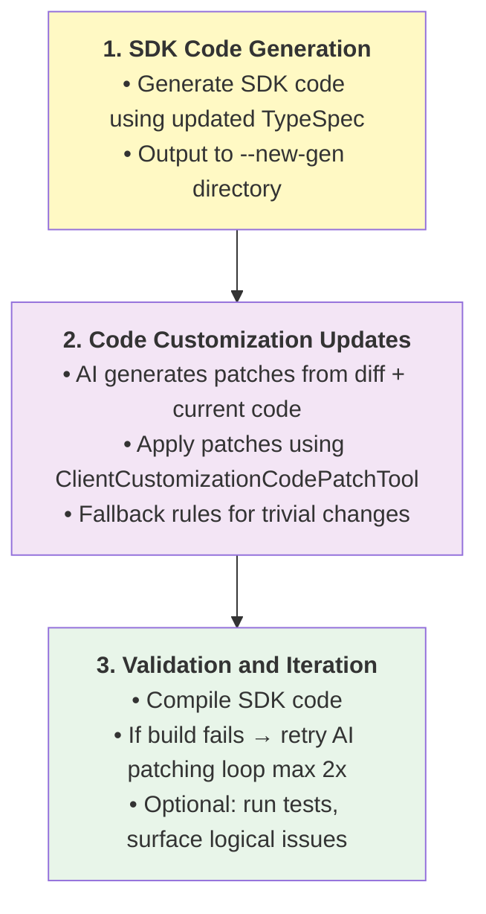

# Spec: Customizing Client TypeSpec

## Table of Contents

- [Definitions](#definitions)
- [Background / Problem Statement](#background--problem-statement)
- [Goals and Exceptions/Limitations](#goals-and-exceptionslimitations)
- [Design Proposal](#design-proposal)
- [Alternatives Considered](#alternatives-considered)

---

## Definitions

_Terms used throughout this spec with precise meanings:_

- **TypeSpec**: The specification language used to define Azure service APIs. SDK code is generated from TypeSpec specifications located in the azure-rest-api-specs repository.

- **TypeSpec Customizations**: SDK-specific customizations made in the `client.tsp` file to control SDK generation. This term does not refer to modifications of the service API TypeSpec files.

- **Code Customizations**: Hand-written modifications made directly to generated SDK code after generation. These customizations exist within the SDK language repositories and must be preserved across regeneration. Examples include adding convenience methods, custom error handling, or language-specific optimizations. Also known as "handwritten code" or "customization layer."

- **API View**: A web-based tool for reviewing SDK APIs. It allows language architects and SDK team members to provide feedback on just the SDK APIs without needing to understand the underlying implementation.

---

## Background / Problem Statement

TypeSpec specs are written to describe service APIs. However, our team supports generating SDKs in no less than 7 languages, each differing in their idioms. The `client.tsp` file acts as a TypeSpec entry point for SDK emitters, applying language-specific customizations to the service spec that are then used by each respective SDK emitter.

Service teams cannot be expected to understand SDK API patterns and best practices on their own. Applying changes also requires understanding how to use [Azure.ClientGenerator.Core](https://azure.github.io/typespec-azure/docs/libraries/typespec-client-generator-core/reference/).

### Current State

Currently, feedback for adding client customizations to `client.tsp` can come in a few forms:

1. From reviews, e.g. API View feedback
2. From automated processes, e.g. code analyzers
3. From manually triggered processes, e.g. breaking changes analysis

**.NET**:
The .NET SDK has code analyzers and an [API compat](https://learn.microsoft.com/en-us/dotnet/fundamentals/apicompat/overview) tool that run during their SDK build (`dotnet build`) that identifies problematic code (e.g. class names that don't follow .NET naming conventions) and suggests fixes.
Many of these fixes are handled by adding customizations to `client.tsp` for .NET, such as renaming models with `@clientName`. Currently these fixes are manually applied after SDK builds fail.
_.NET has a clear flow for identifying and applying `client.tsp` customizations via: Emit SDK -> Build SDK -> Apply fixes -> Repeat._

**Go**:
The Go SDK has a [breaking changes](https://github.com/Azure/azure-sdk-for-go/blob/instruction/.github/prompts/go-sdk-breaking-changes-review.prompts.md) prompt that analyzes the generated SDK's changelog for specific patterns and maps those to `client.tsp` customizations where possible.
_We don't currently have a clear step in our process for identifying breaking changes, but the flow for Go is: Emit SDK -> Analyze changelog & apply fixes -> Repeat._

**Python**:
The Python SDK has [breaking changes](https://github.com/Azure/azure-sdk-for-python/tree/main/scripts/breaking_changes_checker) checks that may be resolvable via `client.tsp` customizations, but there is no automated process for identifying or applying these client.tsp customizations today.

**All Languages**:
All language SDKs have their APIs reviewed in API View. Common feedback includes renaming models per language, or changing operations that appear in a client. We have documentation for customizing SDKs such as [renaming types](https://azure.github.io/typespec-azure/docs/howtos/generate-client-libraries/09renaming/), but recent (10/14/2025) testing shows that even with the current documentation, AI agents have difficulty applying these customizations correctly in a consistent manner: particularly when `scope` is required or customizations are spread over multiple languages/sessions. For example, when creating custom clients using `@client` with different naming for different languages, many times the agent would properly create the custom client for the first language prompted, but then incorrectly use a `@clientName` for the next language prompted.

#### Gaps

The current state exposes some gaps we have today:

- **AI agents are not experts on client customizations.** They make mistakes when applying customizations to `client.tsp`, even with access to the existing documentation.
- **AI agents don't know when to suggest client customizations.** There is no mechanism in azsdk-cli today to steer AI agents to focus on applying `client.tsp` customizations.
- **Nothing shared across languages.** Each language team has their own process for identifying and applying `client.tsp` customizations.
- **Difficult to apply changes from outside the inner loop.** We lack a process for updating `client.tsp` from outside the azure-rest-api-specs repo.

### Why This Matters

We should minimize the amount of time service teams spend on customizing their TypeSpec for each SDK language. Let them focus on what they are experts on - the service API - rather than figuring out how to apply SDK-specific feedback to their TypeSpec.

We can reduce the time spent in the outer loop by detecting and handling common client customization scenarios automatically while devs are still in the inner loop. When service teams still have feedback to address from the outer loop, we should make it both easy to apply and to verify those changes are correct.

SDK teams also shouldn't each be responsible for teaching AI agents how to apply `client.tsp` customizations. This should be a shared responsibility that the azsdk-cli can help facilitate.

---

## Goals and Exceptions/Limitations

### Goals

What are we trying to achieve with this design?

- [ ] Improve the service team experience for authoring `client.tsp` customizations
- [ ] Simplify the process of _how_ to apply `client.tsp` customizations for language teams

## Design Proposal

### Overview

The design will address the identified gaps by focusing on three main areas:

1. Create a shareable context that teaches AI agents about client customizations and how to apply them.
2. Providing the infra in azsdk-cli to to utilize this expertise and steer customizations.
3. Support git patch creation so that client.tsp customizations can be easily applied to the azure-rest-api-specs repo.

### Detailed Design

#### 1. TypeSpec client customizations reference document

A TypeSpec client customizations reference document will serve as the foundation for teaching AI agents about the customizations available via the `Azure.ClientGenerator.Core` library. It includes concise documentation and examples for the decorators available in the library, as well as cover some common scenarios.

This is a living document - it can be updated over time as new decorators are added to the library or new common scenarios are identified. This is _not_ intended to contain guidance for every scenario each language SDK may encounter. For example, Go breaking changes detection looks for specific patterns in the changelog to identify client.tsp customizations. These patterns would not be covered in this document.

This will live in `eng/common/knowledge/customizing-client-tsp.md` so that all language SDK repos can reference it when needed.

The proposed document can be found here: [TypeSpec Client Customizations Reference](https://gist.github.com/chrisradek/f3f3f6992e36be1bab10ed3072976a26)

**Usage**

This document will be referenced by [eng/common/instructions/azsdk-tools/typespec-docs.instructions.md](eng/common/instructions/azsdk-tools/typespec-docs.instructions.md). These instructions are already included in the azure-rest-api-specs repo when the user asks TypeSpec-related questions.

Additionally, it can be referenced by custom prompts, chatmodes, or agents when knowledge of how to apply client.tsp customizations is needed. For example, it can be referenced by the [api-review-feedback chatmode](https://github.com/Azure/azure-rest-api-specs/blob/main/.github/chatmodes/api-review-feedback.chatmode.md) to provide the details on how to apply client customizations, while the chatmode provides additional validation steps or constraints.

#### 2. Tsp Client Update Tool

There is an existing [TspClientUpdateTool](tools/azsdk-cli/Azure.Sdk.Tools.Cli/Tools/TypeSpec/TspClientUpdateTool.cs) that supports updating customized SDK code after generating an SDK from TypeSpec. Splitting `client.tsp` customization into its own tool (see alternative 1) will put the burden on our users to know whether TypeSpec or SDK code customizations are required to address feedback or breakages. Applying and verifying `client.tsp` customizations should be merged with this existing tool.

Name (CLI): `azsdk tsp customized-update`
Name (MCP): `azsdk_tsp_update`

**Current inputs**

- `--package-path`/`packagePath`: The path to the package (SDK) directory to check. Lives in one of the `azure-sdk-for-*` repos.
- `--update-commit-sha`/`commitSha`: The SHA of the commit in `azure-rest-api-specs` to use when regenerating the SDK.
- `--new-gen`(CLI only): Directory for regenerated TypeSpec output (SDK). Optional, defaults to `./tmpgen` within the package path.

**Current behavior**

The tool currently works primarily in an `azure-sdk-for-*` repo.

**Proposed Changes**
TBD

#### 3. Git Patch Support

There are at least 2 scenarios where we want to commit `client.tsp` changes back to the azure-rest-api-specs repo:

- When locally building and testing changes to `client.tsp` before submitting a PR.
- When CI can detect and suggest `client.tsp` changes automatically.

This spec only attempts to address the first scenario where a service team is working locally. Applying changes automatically in CI is out of scope for this spec but can be considered in the future.

**Operating from azure-rest-api-specs repo**

When a user is operating from within the azure-rest-api-specs repo, `client.tsp` updates can be staged and committed as normal git changes. No special work is needed.

**Operating from azure-sdk-for-\* repo with azure-rest-api-specs clone**

When operating from within an SDK repo with a local clone of the azure-rest-api-specs repo, we can directly apply the changes to the local clone. No special work is needed.

**Operating from azure-sdk-for-\* repo without azure-rest-api-specs clone**

When users are operating from within an SDK repo without a local clone of the azure-rest-api-specs repo, create a git patch file that contains the changes to `client.tsp`, along with next steps for how to apply this patch file to the azure-rest-api-specs repo.

## Alternatives Considered

### Alternative 1: Emit-Validate-Propose Loop

**Description:**
[Original design proposal](https://gist.github.com/chrisradek/9ab52a0a13faac6b794d32be87c26785)
A CLI command/MCP tool that takes a typespec project path and a package path (emitted SDK path) as input. This then runs a loop of: Emit SDK -> Validate SDK -> Propose customizations to `client.tsp` -> repeat.

**Pros:**

- Codifies the loop .NET already has into a reusable tool that enforces a sequence of steps
- Can be used by multiple languages - each language provides their implementation of the validate/propose steps

**Cons:**

- Too specific to .NET's workflow of emit, build, fix. Go better served with emit, validateAndFix.
- Not clear when AI should call the MCP tool, as each language may have a different process (e.g. .NET build vs Go changelog analysis)

**Why not chosen:**

The original design only attempted to address 1 of the 3 areas: providing the infra in azsdk-cli to steer customizations. It relied on each language to provide their own mechanism for both identifying and applying `client.tsp` customizations. It was also completely separate from the existing `TspUpdateClient` MCP tool, meaning it had to perform many of the same steps (e.g. generate/build SDK) while not being clear when it should be invoked.
