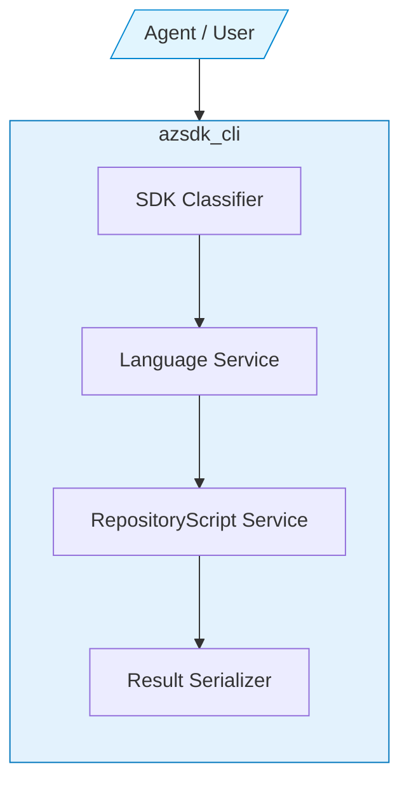
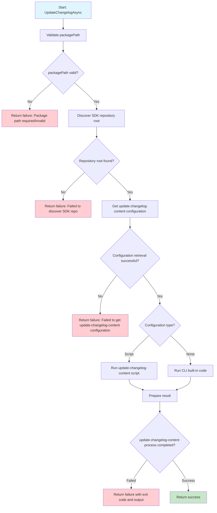

# Spec: 6 Package - package-update

## Table of Contents

- [Definitions](#definitions)
- [Background / Problem Statement](#background--problem-statement)
- [Goals and Exceptions/Limitations](#goals-and-exceptionslimitations)
- [Design Proposal](#design-proposal)
- [Open Questions](#open-questions)
- [Success Criteria](#success-criteria)
- [Agent Prompts](#agent-prompts)
- [CLI Commands](#cli-commands)
- [Implementation Plan](#implementation-plan)
- [Testing Strategy](#testing-strategy)
- [Documentation Updates](#documentation-updates)
- [Metrics/Telemetry](#metricstelemetry)

---

## Definitions

- **Stage 6**: The standardized SDK preparation stage after code/tests/samples validation and before creating the release preparation PR.
- **Metadata and Documentation Update**: Consolidated set of actions to ensure non-source assets (README, changelog, CI config, version numbers, additional descriptors) are accurate and consistent.
- **Tool**: A discrete CLI and MCP agent-exposed command implementing one cohesive post-generation preparation task.

---

## Background / Problem Statement

### Current State

After code generation, build, tests, and sample validation, engineers must perform repetitive cross-language housekeeping: updating changelogs, synchronizing README and language-specific files, adjusting package versions, exporting API surfaces (.NET), and inserting or validating CI configuration. Today these tasks are:

- Partially automated in ad-hoc scripts per language / repo.
- Inconsistent between management-plane and data-plane SDKs (especially version bump timing and changelog handling).
- Error-prone when performed manually (missed version increments, stale README examples, inconsistent metadata presented across different files, like `pom.xml`, `_metadata.json`).
- A barrier for integrating an AI agent workflow because required parameters and step order are not encapsulated as composable tools.

### Why This Matters

Without a unified tool layer:

- Contributors spend time re-learning differing per-language conventions.
- CI or release pipelines fail late due to missing metadata or mismatched versions.
- Agents cannot reliably assist because state transitions ("now bump version", "now update changelog") aren't formalized.
- Management-plane vs data-plane discrepancies introduce confusion (e.g., when to bump versions or generate changelog entries).

Formalizing Stage 6 as cohesive tools improves reliability, supports automation-first workflows, and prepares for future LLM-assisted tasks.

---

## Goals and Exceptions/Limitations

### Goals

- [ ] Provide three composable, idempotent tools exposed via CLI and MCP agent: Changelog Update, Version Update, Metadata Update.
- [ ] Normalize execution order and expected outputs across all supported languages.
- [ ] Encode management-plane vs data-plane behavioral differences explicitly (especially version & changelog logic).
- [ ] Emit structured JSON results (status + message + next steps hints) enabling orchestration by AI agents and pipelines.
- [ ] Support configuration-driven per-language scripting (path or inline) without recompiling the tool.

### Exceptions

| Exception | Description | Impact | Workaround |
|---|---|---|---|
| Data‑Plane Deferred Version Bump | Data‑plane packages typically defer version adjustment and release‑date updates until the release‑preparedness phase. | The `update-version` tool may be a no‑op for data‑plane flows during Stage 6. | Keep version changes manually for milestone 1. |
| Changelog Auto‑Generation (Data‑Plane) | Automatic changelog generation is not performed for data‑plane packages; manual editing is expected. | The `update-changelog-content` tool should not auto‑generate entries for data‑plane packages and should instead surface guidance. | Return a `noop` result with `next_steps` prompting manual edits. Consider future LLM integration to automate this post milestone 1. |

### Language-Specific Limitations

No language-specific limitations are known at this time. If any language requires an exception, it will be documented here.

---

## Design Proposal

### Overview

Implement three individual CLI + MCP tools. Each tool:

1. Resolves package path & language.
2. Loads configuration for the language repository.
3. If a script is configured, executes the script.
4. Otherwise falls back the CLI's built-in implementation for that language.
5. Aggregates structured result JSON with a `result`, human-readable `message`, and optional `next_steps` hint guiding subsequent tool invocation.

#### Configuration for the language respository

Each language repository includes a `swagger_to_sdk_config.json` under its `eng` folder. Per-language script entrypoints are declared in the `packageOptions` section using repository-root–relative paths. The CLI will resolve those paths against the discovered repo root, convert them to absolute paths before invoking, and validate file existence before execution.

Example configuration,

```json
{
  "$schema": "https://raw.githubusercontent.com/Azure/azure-sdk-tools/main/tools/spec-gen-sdk/src/types/SwaggerToSdkConfigSchema.json",
  "packageOptions": {
    "updateChangelogContentScript": {
      "path": "./eng/scripts/Automation-Sdk-UpdateChangelogContent.ps1"
    },
    "updateVersionScript": {
      "path": "./eng/scripts/Automation-Sdk-UpdateVersion.ps1"
    },
    "updateMetadataScript": {
      "path": "./eng/scripts/Automation-Sdk-UpdateMetadata.ps1"
    }
  }
}
```

### Detailed Design

The three tools are intentionally small, composable units. Each emits a machine-readable JSON payload to enable deterministic chaining by an agent or CI workflow. All tools share common behaviors:

| Area | Expected Behavior |
|--------|-------------------|
| Invocation Mode | CLI and MCP (agent) alias; same semantics |
| Input Path Validation | Must exist and contain a recognizable SDK language structure; errors early if not |
| Language Logic Routing | Use the `repository script service` to load the language repo configuration. If a script is configured, invoke it; otherwise fall back to the CLI's built-in implementation |
| Timeout (default) | 5 minutes per tool invocation |
| Output Schema | JSON with fields: result, message (see schema below) |
| Idempotency | Multiple successive runs produce identical filesystem state except for timestamps/logs |
| Next Steps Hint | Plain language phrase embedded in `message` (e.g., `next_steps: update version`) |
| Missing Required Tools | If a required external tool is not present (for example: `dotnet`, `gofmt`, `pwsh`), prompt the user to run the `verify-setup` tool which validates and documents missing prerequisites. |

#### 1. Changelog Update Tool

Name (CLI): `azsdk package update-changelog-content`

Name (MCP): `azsdk_package_update_changelog_content`

Purpose: Ensure changelog is auto-generated and has an entry for the upcoming release (management-plane) or provide guidance (data-plane) where manual editing is expected. This tool only modifies changelog content and does not change release date or version numbers.

Inputs:

- `--package-path <abs path>` (required)

Execution Steps (Mgmt-Plane):

1. Generate changelog content.
2. Normalize section ordering / formatting.

Execution Steps (Data-Plane):

1. Return `noop` result advising manual edit and future version bump timing.

Outputs:

```json
{"result":"succeeded", "message":"Changelog entry added for 2025-10-16", "next_steps": "update version"}
```

```json
{"result":"noop", "message":"Data-plane changelog untouched", "next_steps": "Manually edit the changelog, and update version"}
```

Failure Modes:

- Missing `CHANGELOG.md` → create template (mgmt-plane) or noop (data-plane).
Note: we should consider adding recovery support for the generation scenario after milestone 1.
- Script failure → `failed` with error output.

#### 2. Version Update Tool

Name (CLI): `azsdk package update-version`

Name (MCP): `azsdk_package_update_version`

Purpose: Increment and propagate package version across all authoritative version surfaces (e.g., `pom.xml`, `_version.py`, `*.csproj`, `package.json`, `go.mod`, `CHANGELOG.md`).

Inputs:

- `--package-path <abs path>` (required)
- `--release-type <stable|beta>` (optional)
- `--version` (optional)
- `--release-date` (optional)

Execution Steps:

- for mgmt-plane SDKs:

 1. Compute a version based on the given information.
 2. Apply updates across language-specific files.
 3. Validate consistency (all files now share identical new version).

- for data-plane SDKs:

 1. return `noop`.
 2. use current version from the metadata file or from user input (support may be post-milestone-1).

> **Note:** In milestone 1, Java management-plane packages will follow the same version update strategy as data-plane packages. Adjustments for Java-specific workflows may be introduced in later versions.

Outputs:

```json
{"result":"succeeded", "version": "1.2.0", "message":"Version updated to 1.2.0 and release date set to 2025-10-17", "next_steps": "run validation checks"}
```

```json
{"result":"noop", "version": "", "message":"no version bump performed.", "next_steps": "Manually update the version and release date in the changelog and metadata as needed when preparing a release. Run validation checks."}
```

Failure Modes:

- Version parse error (non-semver) → fail with offending token.
- Partial update (one file locked) → `partial` list and errors.

Idempotency: Re-running after success yields `succeeded` with `no changes` message when already at target version.

#### 3. Metadata Update Tool

Name (CLI): `azsdk package update-metadata`

Name (MCP): `azsdk_package_update_metadata`

Purpose: Update additional language-specific metadata and documentation.

Target files per language:

- .NET: API view artifacts under `{package-path}/api/`.
- Java: `pom.xml` files in both the `azure-sdk-for-java` repo root and the `service` folder.
- Python: `_metadata.json` and `pyproject.toml`.
- JavaScript: N/A (no targets).
- Go: N/A (no targets).

Inputs:

- `--package-path <abs path>` (required)

Execution Steps:

1. Apply updates to authoritative metadata files (`_metadata.json`, `pom.xml`, `package.json`, `go.mod`). Only overwrite a file when the new content differs from the existing content. If an expected file is missing, create a minimal safe skeleton when possible and warn otherwise.

2. Return a structured summary in the tool JSON result including `changed_files` (array of relative paths) and `changed_files_count` (integer). When no files were modified return `changed_files: []` and `changed_files_count: 0` and set `message` to indicate "no changes" (`changed_files` may be supported post-milestone-1).

Outputs:

```json
{"result":"succeeded", "changed_files":["..\\pom.xml","C:\\dev\\repos\\azure-sdk-for-java\\pom.xml"], "changed_files_count": 2, "message":"All relevant pom.xml files have been updated."}
```

```json
{"result":"failed","message":"API export failed: missing dotnet tool", "next_steps": "call verify-setup tool"}
```

Failure Modes:

- Missing expected file (e.g., `_metadata.json`) → report error.

### User Experience

Typical CLI workflow:

```bash
azsdk package update-changelog-content --package-path /abs/sdk/path
azsdk package update-metadata --package-path /abs/sdk/path
azsdk package update-version --package-path /abs/sdk/path --version 1.0.0 --release-date 2025-10-17
```

### Architecture Diagram



---

### Workflow Diagram

#### Update-Changelog-Content (mgmt-plane)



> **Note:** Other tools (version update, metadata update) follow a similar flowchart pattern.

---

## Open Questions

---

## Success Criteria

This tool set is complete when:

- [ ] All three tools emit structured JSON with consistent schema.
- [ ] Management-plane package run updates version + changelog automatically.
      Exception: Java returns `no-op` for `update-version` tool.
- [ ] Data-plane run returns advisory for changelog and version.
- [ ] Metadata files are updated accordingly.

    | Language | Exception |
    |---|---|
    |Java|No additional files need updating|
    |JavaScript|No additional files need updating|
    |Go|No additional files need updating|

- [ ] Cross-language scripts execute without manual intervention.
- [ ] Errors surface actionable mitigation text.

---

## Agent Prompts

### Scenario 1: Update Management-Plane Package (existing SDK) for Release

**Prompt:**

```text
Update the package at /home/dev/sdk/healthdataaiservices/Azure.ResourceManager.HealthDataAIServices for a stable release.
```

**Expected Agent Activity:**

1. Run changelog update.
2. Run metadata update (pom.xml, _metadata.json, API export, etc.) and summarize JSON results.
3. Run version update with inferred `--release-type stable`.

### Scenario 2: Update Version for Stable Release (Data-Plane)

**Prompt:**

```text
Update the version and release date for package at /repo/sdk/healthdataaiservices/Azure.Health.Deidentification.
```

**Expected Agent Activity:**

1. Confirm with user on the version to use.
2. Run version update with the confirmed version.
3. Report the result.

---

## CLI Commands

### package update changelog

**Command:**

```bash
azsdk package update-changelog-content --package-path <absolute_folder_path_to_package>
```

**Options:**

- `--package-path <path>`: Package root (required).

**Expected Output (mgmt):**

```text
"succeeded, Changelog entry added for 2025-10-16, next_steps: update version."
```

**Expected Output (data-plane no-op):**

```text
"noop; Data-plane changelog untouched; next_steps: manually edit the changelog, and update version."
```

### package update version

**Command:**

```bash
azsdk package update-version --package-path <absolute_folder_path_to_package> --release-type <stable|beta>
```

**Options:**

- `--package-path <path>`: Package root (required).
- `--release-type <stable|beta>`: Determines increment strategy (optional).
- `--version`: Version to set for the package (optional)
- `--release-date`: The date (YYYY-MM-DD) to write into the changelog (optional)

**Expected Output:**

```text
"succeeded, version: 1.2.0, message: Version updated to 1.2.0 and release date set to 2025-10-17, next_steps: run validation checks."
```

**Failed Output:**

```text
"failed, ERROR: the input version is invalid. next_steps: refer to aka-link to provide a valid version."
```

### package update metadata

**Command:**

```bash
azsdk package update-metadata --package-path <absolute_folder_path_to_package>
```

**Options:**

- `--package-path <path>`: Package root (required).

**Expected Output:**

```text
"succeeded, changed_files:["..\\pom.xml","C:\\dev\\repos\\azure-sdk-for-java\\pom.xml"], changed_files_count: 2, All relevant pom.xml files have been updated."
```

**Failure Example:**

```text
"failed, Missing pom.xml, next_steps: refer to aka-link."
```

---

## Implementation Plan

### Phase 1: Core Tooling (Milestone 1)

- Milestone: Implement CLI + MCP entrypoints for three tools including update-changelog-content, update-version, and update-metadata; integrate repository script service; mgmt-plane happy path.
- Timeline: 1 sprint.
- Dependencies: language-specific logic implementation.

### Phase 2: Data-Plane Enhancements and the remained tools

- Milestone: Advisory logic for version deferral; improved changelog no-op messaging; implement update-ci tool and the aggregated tool; add copilot instructions to streamline the end-to-end workflow.
- Timeline: 1 sprint.
- Dependencies: Phase 1 release.

### Phase 3: Telemetry & Extensibility

- Milestone: Optional telemetry events (success/failure, duration); pre-hooks for LLM changelog generation.
- Timeline: 1–2 sprints.
- Dependencies: Planned post-milestone-1.

---

## Testing Strategy

### Unit Tests

- Config resolution precedence.
- JSON result schema validation (success, failed).
- Mgmt-plane vs data-plane branching logic for version/changelog.

### Integration Tests

- Execute each tool against a fixture per language with mock scripts.
- Simulate script failures (non-zero exit) and validate error messaging.
- Confirm idempotency: running twice yields same artifact state.

### Manual Testing

- Real repository dry run for each language.
- Observing run result formatting and readability.
- End-to-end workflow.

### Cross-Language Validation

- Matrix test ensuring each language path executes all expected sub-tasks.

---

## Metrics/Telemetry

### Metrics to Track

| Metric Name | Description | Purpose |
|-------------|-------------|---------|
| tool_run_count | Count of executions per tool per language | Adoption tracking |
| tool_failure_rate | Failures / total runs | Reliability signal and priority remediation |
| avg_duration_ms | Mean execution time per tool | Performance tuning |
| version_mismatch_detected | Count of times version update found inconsistent files | Detect systemic config issues |

### Privacy Considerations

- Do not log file contents; only aggregate metrics.
- Strip absolute paths before telemetry (hash or redact) if enabled.

---

## Documentation Updates

- [ ] Update `aka.ms/azsdk/agent` with new commands and new scenarios.
- [ ] Add agent usage examples to `docs/specs/` index or workflow guide.
- [ ] Provide troubleshooting guide (common failures & mitigations).

---
