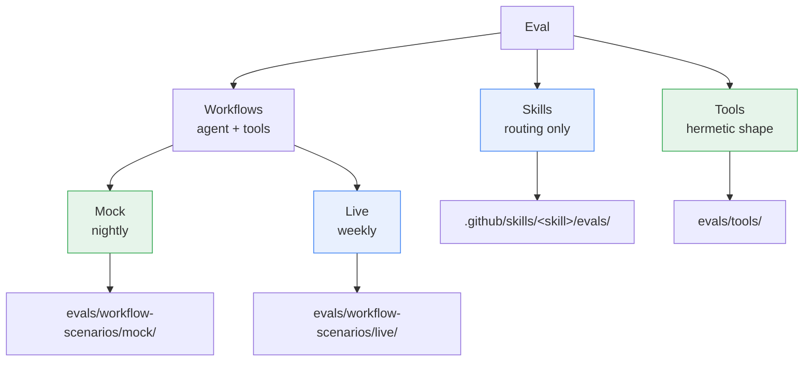
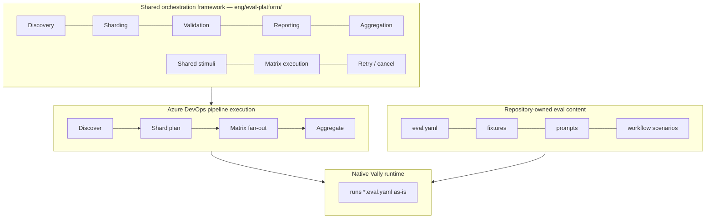
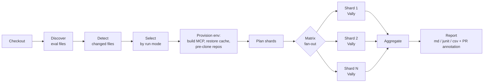
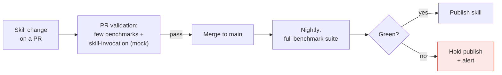
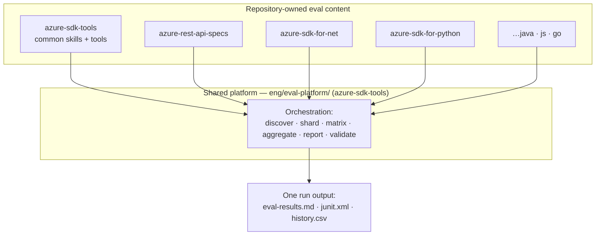

# Spec: 8 Operations — Agent Evaluation Strategy

## Table of Contents

- [Definitions](#definitions)
- [Background / Problem Statement](#background--problem-statement)
- [Goals and Exceptions/Limitations](#goals-and-exceptionslimitations)
- [Design Proposal](#design-proposal)
- [Agent Prompts](#agent-prompts)
- [Success Criteria](#success-criteria)
- [Open Questions](#open-questions)
- [Implementation Plan](#implementation-plan)

---

## Definitions

- **Agent**: a live LLM conversation driving Azure SDK MCP tools through skills.
- **Skill**: a markdown contract under `.github/skills/<name>/` telling the
  agent *when* to engage and *which* tools/workflow to use.
- **MCP tool**: a discrete capability exposed by the Azure SDK MCP server.
- **Workflow scenario**: a user prompt that crosses multiple tools / skills
  end-to-end (e.g. *create release plan → generate SDK → link the SDK PR*).
- **Stimulus**: one prompt + its expected behavior — the unit of an eval.
- **Graders per stimulus**: at minimum `skill-invocation` (right skill
  picked), `tool-calls` (right tools / order / args), and `prompt` (right
  final answer). Graders are composable, not a fixed set of three — a
  stimulus that edits files adds `file-matches`, and a stimulus can weight
  graders and set a pass threshold. The `azure-typespec-author` suite does
  both (tool-calls + skill-invocation + several file-matches + a weighted
  LLM-judge). The three named here are the baseline, not a ceiling.
- **Mock MCP**: an in-memory fake of the Azure SDK MCP server — no network,
  no side effects. **Live MCP**: the real server hitting real DevOps / GitHub.


---

## Background / Problem Statement

We're shipping agent-driven replacements for manual SDK workflows — starting
with the release planner. When someone
asks *"does the agent actually do what we said it does?"*, today the only
honest answer is "I tried a few prompts on my laptop." That is not good
enough to hand to partner teams or to keep regressions out as more workflows
land.

We need a small, shared set of prompts we promise to support, run regularly,
with a clear pass/fail per prompt — so we can point at the report instead
of re-demoing.

---

## Goals and Exceptions/Limitations

**Primary objective.** Build a scalable evaluation orchestration platform
for GitHub skills and scenario-based evals using the native Vally eval
format. Contributors author native `*.eval.yaml`; a centralized framework
owns execution mechanics. The design optimizes for fast rollout, low
operational complexity, contributor simplicity, centralized orchestration,
and distributed-execution scalability — *not* for a new eval abstraction.

### Goals

- [ ] **A reusable CI orchestration platform, not a one-repo runner** built once and reused by *every* pipeline that runs
      evals. The scaling story is not limited to this repo:
      any repo points its pipeline at the shared layer and gets the same
      distributed execution and reporting.
- [ ] **One file per workflow, graders per prompt** — skill picked, tools
      called, final answer, plus structural checks (`file-matches`) where a
      scenario edits files.
- [ ] **Simple enough to reuse across repos** — the same runner, grader
      catalog, and orchestration cover common skills/tools *and* repo-specific
      skills and scenarios in the language SDK repos, not just
      `azure-sdk-tools`. A language repo plugs in its own eval content; the
      framework does not change.
- [ ] **Mock MCP by default, live MCP only on opt-in** — no accidental writes
      to DevOps / GitHub; release / publish tools stay mock-only.
- [ ] **Mock covers every tool the scenarios call**, with realistic responses.
- [ ] **Anyone can clone and run** — env vars, no hard-coded paths; live
      scenarios declare what repos they need.
- [ ] **The run produces a status table** of pass/fail per prompt plus a
      trajectory per prompt — readable by non-engineers.
- [ ] **Reports come out in the formats people actually use** — markdown
      for humans, JUnit for CI, CSV for spreadsheets and dashboards.
- [ ] **Multi-step chains work** (e.g. *validate TypeSpec → create release
      plan → generate SDK → link the SDK PR*).

### Exceptions and Limitations

- **Some prompts can only be checked against live MCP** — the mock can't
  prove a release plan was really created. Those run opt-in only.
- **The agent is not deterministic.** Same prompt, different wording or
  turn count each run. We grade shape, not exact strings, and accept some
  flake.

---


## Design Proposal

### The three eval kinds

At a glance, the eval taxonomy and where each kind lives:



We organize evals around what's actually being tested. No tier numbers —
use the names. The first three columns are the same axis (what does this
prove); the last two say where each lives and what backend it needs.

| Kind | What it proves | Agent | MCP | Lives in |
|---|---|---|---|---|
| **Skills** | A user prompt routes to the right skill (and, for capability evals, that the skill then calls the right tools). | live | none for pure routing; **mock** when the eval asserts tool calls | `.github/skills/<skill>/evals/` |
| **Workflows — Mock** | Agent picks the right skills, calls the right tools in the right order with the right args, returns the right answer. | live | **mock** | `evals/workflow-scenarios/mock/` |
| **Workflows — Live** | Same as above, but against the real backend — catches drift the mock can't see (TypeSpec ordering, real codegen output, real DevOps state). | live | **live** | `evals/workflow-scenarios/live/` |


Plus a hermetic tool-shape layer that isn't agent-driven:

| Kind | What it proves | Lives in |
|---|---|---|
| **Tools** |Each MCP tool is wired up, returns the expected response shape, and is reliably picked from a range of paraphrased user prompts (one tool per stimulus, no multi-step planning). | `evals/tools/` |

#### Required graders by kind

Mock and live workflow scenarios share the same scenario format but
differ in which graders are *required* vs *optional*:

| Kind | `tool-calls` | `skill-invocation` | response grader (`prompt` / LLM-judge) |
|---|---|---|---|
| **Workflows — Mock** | required | optional | not applicable — mock responses are stubbed, so a response grader has nothing meaningful to assert |
| **Workflows — Live** | required | required | required — only live runs produce a real assistant answer worth grading |

Rationale: the mock backend deterministically replays canned data. Live runs are the only place a free-form response can drift, so
that's where the response grader earns its cost.


### Folder layout

```
evals/
├── tools/                  one prompt → one tool
├── workflow-scenarios/
│   ├── mock/               workflow scenarios run against the mock MCP
│   └── live/               workflow scenarios run against the live MCP
└── setup/                  shared fixture scripts (repo clone, etc.)
```

A scenario lives under `mock/` or `live/` based on which backend the
graders are written against, not based on the prompt. A prompt can
have a `mock/` and a `live/` variant (release-planner does).


| Run mode | MCP | Repos? | When | Coverage |
|---|---|---|---|---|
| Workflows — Mock | mock (stub, no LLM) | azure-sdk-tools only | nightly + on demand | every scenario |
| Workflows — Live | live (real backends) | azure-sdk-tools + shallow/sparse clones of the spec & language SDK repos each scenario declares | weekly | scenarios tagged `live-safe` (curated subset) |

When live and mock results disagree, the mock is wrong — the divergence
points straight at the missing or stale handler. Every scenario that
runs on mock therefore drives the mock to grow handlers for the tools
it exercises.

### Where each eval lives

| What it tests | Lives in |
|---|---|
| **One skill** (does this skill route, call its tools, return a sensible answer) | `.github/skills/<skill>/evals/` |
| **Cross-skill / cross-tool** (multi-step chains, e2e flows, mock-server integration, anything that doesn't belong to one skill) | `tools/azsdk-cli/Azure.Sdk.Tools.Vally/evals/` |

Skill evals stay next to `SKILL.md` — that's the convention skill
authors expect, and it keeps everything about a skill in one folder.
Existing skill eval files do not move.

#### Skill eval suite — current state and direction

The skill suite predates this project. Today roughly a dozen skills
have eval files; some are missing thresholds and pass without asserting
anything, and most capability stimuli are graded only by a single
substring check — they pass whether the agent called the right tool,
the wrong tool, or just echoed the prompt.

*Direction.* Raise the bar on what counts as a per-skill eval: adopt
the four-layer pattern — skill-invocation + tool-calls + structural
output match + optional LLM-judge — as the required shape for every
capability stimulus. The `tool-calls` grader is mandatory, not optional:
a capability stimulus must assert the agent picked the *right set of
tools* (and, where order matters, the right order), so a stimulus can no
longer pass by routing to the skill and then calling the wrong tool or
no tool. A `skill-eval-authoring` skill packages the pattern, grader
catalog, and anti-patterns so other Azure SDK teams adopt without
re-learning the gotchas.

### Decision tree — where does my new eval go?

```
Do you only care that the agent picks the right skill
(you don't care which tools it then calls)?
└── yes → .github/skills/<skill-name>/evals/   (not this project)

Do you want to check that one MCP tool returns the right shape
for a given input — no agent in the loop?
└── yes → evals/tools/

Is it a multi-step / multi-tool agent flow?
└── yes → Workflow scenario
        ├── Default → evals/workflow-scenarios/mock/
        │   Runs against the mock MCP. Use this unless the mock can't
        │   faithfully cover the behavior.
        └── Also need live coverage → add an evals/workflow-scenarios/live/
            variant. Reserve for cases where the real backend's behavior
            matters (TypeSpec ordering, real codegen output, real DevOps
            state).
```

### Eval file format — examples

Both kinds are native Vally `*.eval.yaml`. Below are minimal, real-shaped
samples plus how to configure and run them.

**Skill eval** (`.github/skills/<skill>/evals/<name>.eval.yaml`) — proves
a prompt routes to the skill *and* calls the right tools. A
file-producing skill (e.g. `azure-typespec-author`) adds `file-matches`
and weights the graders:

```yaml
name: azure-typespec-author-eval
type: capability
environment: azsdk-mcp           # live agent, real MCP for this suite
config:
  runs: 1
  timeout: "660s"
  model: claude-opus-4.6
  executor: copilot-sdk
stimuli:
  - name: add-preview-only-property
    prompt: Introduce the spread-model properties in API version 2025-05-04-preview only.
    environment:
      files:                     # fixtures copied into the agent's workdir
        - src: ../fixtures/001/main.tsp
          dest: main.tsp
    graders:
      - type: skill-invocation
        config: { required: [azure-typespec-author] }
      - type: tool-calls         # mandatory: right tools got called
        config:
          required:
            - azure-sdk-mcp-azsdk_typespec_generate_authoring_plan
            - azure-sdk-mcp-azsdk_run_typespec_validation
      - type: file-matches       # structural: edit landed where expected
        config: { path: main.tsp, pattern: 2025-05-04-preview }
      - type: prompt             # LLM-judge: no unrelated edits
        config:
          prompt: Verify changes are scoped to this task only.
          model: claude-opus-4.6
          scoring: scale_1_5
          threshold: 1.0
    constraints: { max_turns: 5, max_tokens: 50000 }
scoring:
  weights: { file-matches: 3, tool-calls: 1, skill-invocation: 1, prompt: 1 }
  threshold: 1.0
```

**Workflow eval** (`evals/workflow-scenarios/mock/<workflow>.eval.yaml`) —
a multi-tool chain; environment-agnostic, so the same file runs on mock
or live (the backend is chosen at run time):

```yaml
name: release-planner
type: capability
config: { runs: 3, timeout: "300s", model: gpt-5.4, executor: copilot-sdk }
stimuli:
  - name: create-and-generate
    prompt: Create a beta release plan for this TypeSpec spec and generate the SDK.
    graders:
      - type: skill-invocation
        config: { required: [azsdk-common-prepare-release-plan] }
      - type: tool-calls
        config:
          required:
            - azsdk_get_release_plan
            - azsdk_create_release_plan
            - azsdk_run_generate_sdk
          forbidden: [azsdk_verify_setup]
    constraints: { max_turns: 30, max_tokens: 200000 }
```

### CI

Agent runs talk to an LLM — they cost money and they flake in ways that
have nothing to do with the code under review. So the suite does not run
as one job on every push. Instead it runs as **several pipelines, each on
its own cadence**, all driven by the *same* shared orchestration layer —
they differ only in which evals they select and which backend they use.

| Pipeline | Trigger | Selects | Backend | Why separate |
|---|---|---|---|---|
| **PR gate** | PR touching agent / skills / MCP tools | `changed-only` + a curated essential subset | mock (+ a few real-MCP benchmarks) | Fast, cheap, must not flake — blocks merge. |
| **Nightly** | schedule | `nightly-full` — every scenario + the hermetic tool layer | mock | Full coverage without paying live cost. |
| **Weekly live** | schedule | scenarios tagged `live-safe` | live (safe-mode on writes) | Catches real-backend drift the mock can't see. |
| **On demand** | manual / dispatch | any selection | author's choice | Debugging, one-off reruns, new-workflow bring-up. |

Cadence is a knob, not a fixed contract — a pipeline is *"selection +
backend + schedule."* Adding a new cadence (e.g. an on-`main`-push smoke
run) is a new schedule pointing at the same templates, not new
infrastructure.

#### Architecture — three layers

The platform is deliberately layered so the expensive, fiddly mechanics
live in one shared place and the repos stay simple:



- **Shared framework** owns execution mechanics — discovery,
  change-detection, sharding, matrix fan-out, validation, aggregation,
  reporting, and (optionally) shared stimuli/fixtures. It lives in
  `eng/eval-platform/` and is reused by every pipeline and every repo
  (see [Cross-repo rollout](#cross-repo-rollout-and-the-shared-platform)).
- **ADO pipeline execution** is the thin glue: discover → shard-plan →
  matrix → aggregate.
- **Native Vally runtime** runs the eval files *as-is* — the framework is
  an orchestration/scaling layer, **not** an eval abstraction; it does not
  wrap evals in a new schema.
- **Repositories own evaluation intent** — eval files, fixtures, prompts,
  scenarios. Authors add a stimulus; the layer picks it up. They never
  touch the orchestration layer.

**What this layer must prove (and where the difficulty is).** This is the
hard part of the project; designing for the complicated cross-repo case up
front is cheaper than retrofitting it:

| Goal the layer must hit | Where the difficulty is |
|---|---|
| **Discovery** — find every eval across repos without a manifest per repo | Conventions drift between repos; a missed file is silent lost coverage. |
| **Change detection** — map a PR diff to just the affected evals | A skill or tool can fan out to many scenarios; under-mapping skips regressions, over-mapping reruns the world. |
| **Sharding** — split the suite so wall-clock time stays low | Even file-count sharding is naive — one slow agent eval can dominate a shard; runtime-aware balancing is harder and is deliberately deferred. |
| **Environment setup** — every shard needs the MCP server built and, for live, the right repos on disk | This is the issue we already hit: tools operate on real repos, so a shard fails for the wrong reason if a repo is missing or stale. Caching and pre-clone are first-class, not an afterthought (see [Environment setup and caching](#environment-setup-and-caching)). |
| **Distributed execution** — fan out shards as ADO matrix jobs | Per-shard env setup and Copilot-SDK session limits cap useful parallelism; too many shards costs more than it saves. |
| **Aggregation & reporting** — merge shard outputs into one verdict | Partial-shard failures and infra `status=error` rows must not be miscounted as graded failures. |

Deliberately **out of scope for early rollout**: runtime-aware
balancing, runtime prediction, multi-engine support, and any custom
schema layer. These are enhancements, not blockers.

#### How the suite executes — orchestration

End to end, every pipeline above runs the same flow; only the *selection*
step and the *backend* differ:



#### Discovery and change detection

Discovery scans the repo for eval files (`evals/**/*.eval.yaml` and
`.github/skills/**/evals/*.eval.yaml`) and records each one's kind,
area, fixtures, and the tools/skills it exercises.

Change detection maps a PR's changed files to the evals they affect —
changed skill markdown → that skill's evals; changed MCP tool or mock
handler → the scenarios that call it. This drives `changed-only` runs
so a PR pays for the evals it actually touches, not the whole suite.

Run modes the layer supports:

| Mode | Runs |
|---|---|
| `changed-only` | Only evals impacted by the diff (PR gate default) |
| `skills-only` | Skill-routing evals |
| `scenarios-only` | Workflow scenarios |
| `smoke` | A minimal curated subset |
| `nightly-full` | Everything |

#### Sharding and matrix fan-out

A full suite run sequentially is too slow for anyone to wait on. The
layer splits the selected evals into **shards** — independent subsets
that run in parallel as Azure DevOps matrix jobs — and merges their
results at the end. The win is wall-clock time:

```
no sharding:   140 evals × ~20 s            ≈ 2800 s  (~46 min)
7 shards:      20 evals × ~20 s per shard   ≈  400 s  (~7 min)
```

Each shard is a slice of the eval-file list; the layer emits a shard
manifest and a matrix entry per shard. Shards run independently, so a
failure isolates to one shard and reruns are cheap.

```json
// shard manifest (one per matrix job)
{ "shardId": 3, "evalFiles": [
  ".github/skills/release/evals/create.eval.yaml",
  "evals/workflow-scenarios/mock/release-planner.eval.yaml"
] }
```

```yaml
# matrix fan-out — generated dynamically from the shard plan
strategy:
  matrix:
    shard1: { shardId: 1 }
    shard2: { shardId: 2 }
    # …one entry per shard
```

*Initial strategy: even file-count sharding* — e.g. 120 files / 6
shards = 20 files each. Simple and predictable. Runtime-aware sharding
(weight by historical wall time, token usage, or workflow depth) is a
later enhancement and must not block rollout.

Picking the shard count is a trade-off: more shards cut wall-clock time
but consume more agents and add per-shard setup overhead; taken to the
extreme of one eval per shard, scheduling and environment setup waste
more than they save. Start moderate, tune from real timings.

#### Environment setup and caching

This is the part we already got burned on, so it's called out explicitly:
**before any eval runs, the shard's environment has to be real.** Two
things have to be in place, and both are cached so we don't pay full cost
on every run.

**1. The MCP server, pre-built.** Vally launches `dotnet <dll>`, not
`dotnet run`, to avoid an MSBuild boot race under parallel workers. The
pipeline builds `Azure.Sdk.Tools.Cli` and `Azure.Sdk.Tools.Mock` once,
to a stable output path (`-o artifacts/mcp/...`, no TFM in the path), and
every shard reuses that build artifact.

**2. The repos a scenario needs, pre-cloned.** A real workflow crosses
repos — the release planner reads a TypeSpec project from
`azure-rest-api-specs`, generates into a language SDK repo, and links a PR
back. The tools expect those files on disk; a missing repo makes the agent
fail for the wrong reason and we learn nothing.

- Each live scenario **declares** the repos (and optionally a pinned
  commit) it needs.
- One setup step reads all selected live scenarios, takes the **union**,
  and ensures each repo is present before fan-out — a shallow + blobless +
  cone-sparse clone (only the spec paths the scenarios touch) into a
  repo-relative cache dir, never a hard-coded user path.
- **Locally and in CI it's the same script.** Locally it clones into a
  cache folder and reuses it on later runs. In CI the cache is a
  build-cache artifact **keyed on the set of repos the scenarios declare**,
  invalidated only when that set changes.
- **Pinning:** a scenario can pin a commit for reproducibility; otherwise
  setup takes the default branch and records the commit it used in the run
  output.

The nightly **mock** job needs only step 1 — mock evals touch no external
repos. The weekly **live** job needs both.

#### Validation gates (before we spend agent time)

Cheap structural checks run before any agent executes, so a typo fails in
seconds instead of after a 17-minute run:

- **Structural** — YAML validity, duplicate stimulus IDs, malformed config.
- **Coverage** — skills with no eval, tools no green scenario exercises,
  orphaned scenarios (reported, not necessarily blocking).
- **Reference** — fixtures, skills, and prompts a stimulus names actually
  exist.

#### PR gate for essential workflows (open)

A case for *narrow* PR gating: a small curated set of mock scenarios
covering the workflows we have already promised to partner teams
(release-planner today; more as they ship) could run on PRs that touch
the agent, skills, or MCP tools — so we catch a regression in the
workflows users actually rely on before merge, instead of the morning
after.

The gate need not be mock-only. For a workflow like TypeSpec authoring,
the essential PR check is a mix: a few **typical benchmark cases run
against the real MCP server** (the only way to catch real codegen /
validation drift) plus **skill-invocation checks against the mock MCP
server** (fast, deterministic routing coverage). The curated set per
workflow decides which of its cases are real-MCP benchmarks and which
are mock skill-invocation checks.

Unresolved trade-offs: which scenarios count as "essential"; how to
keep the gate from flaking on LLM non-determinism (retries? loose
thresholds? quorum across N runs?); whether the cost of the gated
subset is acceptable for every PR; and which paths actually trigger it
(agent-only? skills? MCP server? all of the above?).

See [Open Questions](#open-questions).

#### Skill publish gated by eval

Skills are published from `main`; the eval suite is what makes that
safe. The lifecycle:



This keeps the per-PR cost low (a curated subset, mostly mock) while the
full benchmark set still gates the actual publish, so a skill never ships
on the strength of a partial PR run.

#### Aggregation and reporting

After the matrix completes, the layer merges every shard's
`results.jsonl` into the single run output described under
[Results](#results) — one `eval-results.md`, one `junit.xml`, one
`history.csv` row — annotates the PR, and emits a coverage summary, e.g.:

```
Repository: azure-rest-api-specs
  Skills:    Passed 420  Failed 2
  Scenarios: Passed  74  Failed 3
  Coverage warnings:
    - tool create-release-plan has no green scenario
```

Partial-shard failures and infra `status=error` rows are reported as
infrastructure errors, **not** counted as graded failures, so a flaky
agent session can't masquerade as a real regression.


### Mock MCP server status

#### How it works

`Azure.Sdk.Tools.Mock` reflects over the real CLI's tool list at boot and
registers a mock proxy for **every** tool the real `Azure.Sdk.Tools.Cli`
advertises, preserving each tool's name, description, and input schema.
At call time the proxy looks up a handler by tool name:

- **Custom handler exists** → scripted, type-correct response.
- **No custom handler** → fallback `{ Message = "Success" }`.


### Results

The goal: anyone — partner team, manager, the engineer who broke
something — should be able to open a run and understand what passed,
what failed, and why, without help.

Each run writes three files into the output directory:

| File | What it is | Who reads it |
|---|---|---|
| `eval-results.md` | Human status table: one row per prompt, pass/fail per grader. | Reviewers, partner teams, anyone scanning a run. |
| `results.jsonl` | The full agent trajectory — every tool call, args, return values, timings. One JSON object per line. | Engineers debugging a failure with tooling. |
| `junit.xml` | Standard test-results format the CI test-results widget already understands. | CI dashboards. |

The JSONL is rich but hard to read raw. We add two post-processors
on top of it:

- **Trajectory HTML** — one self-contained web page per prompt, opens
  straight from `file://`. Shows the same trajectory as `results.jsonl`
  but readable by someone who has never seen JSONL.
- **CSV history** — one row per prompt, appended across runs. Lets us
  ask *"how often did release-planner pass in the last 30 nightlies?"*
  and feed a dashboard later.

In CI: trajectories + JSONL are uploaded as build artifacts you can
download from the run page; the CSV gets appended to a long-lived
history branch.

### Performance and cost controls

Why this section exists: agent evals are *slow* and *expensive*. Every
run talks to a real LLM — every tool call is a round trip, every turn
is tokens billed against our subscription. Without limits, a single
badly-written scenario can sit in a loop for an hour and burn through
the budget while still reporting *"passed"*.

Concrete example: one real release-planner end-to-end run took **17
minutes wall time, 1.78M tokens, 41 turns**.

The framework therefore enforces three things:

**1. Per-scenario budgets.** Every scenario file declares an upper
bound on:

- **Turns** — how many times the agent loops.
- **Wall time** — how long the whole run can take.
- **Billable tokens** — input + output tokens we actually pay for.
- **Tool calls** — catches an agent stuck calling the same tool forever.

The runner warns at 50% of any limit, fails the scenario at 100%, and
kills the whole run at 200% so a runaway can't bleed indefinitely.

**2. Tiered defaults.** Mock runs nightly against an in-memory fake —
cheap and fast, so the limits are tight. Live runs weekly against real
backends — slower by nature, so the limits are looser.

| Tier | Turns | Wall (s) | Billable tokens |
|---|---|---|---|
| Nightly mock | 30 | 300 | 200k |
| Weekly live | 60 | 600 | 500k |

A scenario that needs more must opt in with a justification comment in
the scenario file. If reviewers reject the opt-in, the scenario has to
be rewritten to fit, or moved to mock — budgets don't widen.

**3. Background guardrails** — things the scenario author never has
to think about, baked into the framework:

- Polling tools (`*_get_*_status`) return a terminal state on the first poll under safe mode — no agent stuck waiting for *"in progress"* to flip.
- LLM-judge graders default to a cheaper model than the agent itself.
- CI cancels superseded runs when a branch gets a new push.


### Cross-repo rollout and the shared platform

This eval strategy starts in `azure-sdk-tools` but the orchestration
layer is meant to be reused, not forked. The split is the same
everywhere: **a repository owns its evaluation content** (eval files,
fixtures, prompts, scenario definitions) and **the shared framework
owns execution mechanics** (discovery, sharding, matrix orchestration,
validation, aggregation, reporting). Only the eval content differs per
repo; the runner does not.

The shared framework lives in `azure-sdk-tools/eng/eval-platform/`:

```
eng/eval-platform/
├── pipelines/        ADO templates: discovery → shard → matrix → aggregate
├── scripts/          discovery, change-detection, shard planning
├── validators/       structural / coverage / reference checks
└── reporting/        shard-result merge + summary generation
```



**Rollout.**

- **Phase 1 — prove it here and in `azure-rest-api-specs`.** Validate
  the orchestration architecture, the sharding approach, distributed
  execution, the contributor workflow, and the reporting pipeline on
  native Vally evals. Deliberately *out of scope* early: runtime-aware
  balancing, runtime prediction, multi-engine support, and any custom
  schema layer.
- **Phase 2 — language SDK repos.** Reuse the same framework across
  `azure-sdk-for-net`, `-python`, `-java`, `-js`, and `-go`. Each repo
  brings its own eval content; the orchestration layer is unchanged.

**Validation the shared layer runs on every repo's content**, beyond
pass/fail:

- *Structural* — YAML validity, duplicate stimulus IDs, malformed config.
- *Coverage* — skills with no eval, tools no scenario exercises, orphaned scenarios.
- *Reference* — fixtures, skills, and prompts a stimulus names actually exist.

**Reusable stimuli and fixtures.** To avoid prompt duplication and
fixture drift across repos, the framework can host shared prompts,
contexts, fixtures, and mock responses under
`eng/eval-platform/shared-stimuli/`. A repo references a shared
stimulus instead of copying it. This is optional and additive — a repo
can keep everything local.


---

## Agent Prompts

The list of prompts the agent is promised to support. Each lives as a
stimulus in `evals/workflow-scenarios/mock/<workflow>.eval.yaml` (plus a
`live/` counterpart where applicable). Adding a new prompt is one new
entry in the matching file.

### Release-planner workflow

Derived from the release-planner replacement test plan
([#15835](https://github.com/Azure/azure-sdk-tools/issues/15835)). All
five route to the `azsdk-common-prepare-release-plan` skill.

| Prompt | What the agent must do | Required tool calls |
|---|---|---|
| Create a public-preview release plan for a TypeSpec spec, target month June 2026 | Pick the prepare-release-plan skill; check for an existing plan; create one. | `azsdk_get_release_plan`, `azsdk_create_release_plan` |
| Create a release plan **and** generate SDK for a TypeSpec spec, release type beta | End-to-end chain: create, then generate, then back-fill SDK details. | `azsdk_get_release_plan`, `azsdk_create_release_plan`, `azsdk_run_generate_sdk`, `azsdk_update_sdk_details_in_release_plan` |
| Generate SDK for all languages for an existing release plan id | Look up the plan, run generation against the languages it lists. | `azsdk_get_release_plan`, `azsdk_run_generate_sdk` |
| Link a different spec PR (`https://github.com/Azure/azure-rest-api-specs/pull/...`) to an existing release plan | Look up the plan, swap the spec-PR field. | `azsdk_get_release_plan`, `azsdk_update_api_spec_pull_request_in_release_plan` |
| Update SDK details (package names) on an existing release plan from `tspconfig.yaml` | Look up the plan, update the SDK details from emitter config. | `azsdk_get_release_plan`, `azsdk_update_sdk_details_in_release_plan` |

All five forbid `azsdk_verify_setup` (the setup gate runs once at the
top of the workflow, not per prompt) and forbid the irrelevant
`azsdk_create_release_plan` in the four "existing plan" prompts so we
catch the agent creating a duplicate.

### Other workflows

| Workflow | File | Coverage |
|---|---|---|
| Check spec is in public repo then validate TypeSpec | `check-public-repo-then-validate.eval.yaml` | TypeSpec authoring routing + validation tool call. |
| TypeSpec generation — step 2 of the authoring flow | `typespec-generation-step02.eval.yaml` | TypeSpec authoring skill + generate tool. |
| Rename a client property in a generated SDK | `rename-client-property.eval.yaml` | Customization skill + customize-code tool. |

The live counterpart of release-planner lives at
`evals/workflow-scenarios/live/release-planner.eval.yaml` and adds a
prompt-grader that checks the real DevOps response.

---

## Success Criteria

- A single command runs the full mock suite locally and produces
  `eval-results.md`, `results.jsonl`, JUnit XML, the per-prompt
  trajectory HTML, and a `history.csv` row.
- Every release-planner prompt above is green in the mock suite.
- Every MCP tool a green scenario calls has a custom mock handler
  returning a chainable, type-correct response.
- A new contributor can clone the repo, set the documented env vars,
  and reproduce the same `eval-results.md` verdict table on their
  machine.
- A partner team reporting *"I tried this prompt and the agent didn't
  do anything"* can be answered by pasting their prompt as a new
  stimulus and re-running the workflow file — no runner or CI changes.
- The status table is what we hand to reviewers (Renhe, Laurent,
  partner teams) to answer *"what does the agent currently support?"*

---

## Open Questions

### CI cadence and PR gating

**Cadence.** Current proposal: nightly mock + weekly live + on-demand.
Open: is nightly the right frequency for mock, or do we want it on
every push to `main`? Is weekly enough for live, given live is the
only thing that catches real-backend drift?

**PR gate for essential workflows.** Should a curated subset of mock
scenarios block merge on PRs that touch the agent, skills, or MCP
tools? Specifically to answer:

- *Which workflows are "essential"* — just release-planner today, or
  a broader set? Who decides when a new workflow joins or leaves the
  gated set?
- *Which paths trigger the gate* — agent code, skill markdown, MCP
  tool code, mock handlers, all of the above? Anything else?
- *How do we tame flake* — retries on failure, quorum across N runs,
  loose thresholds, or just accept some red and require a human
  override? Hard requirement: a green PR must mean *the gated
  scenarios passed*, not *we got lucky this run*.
- *What's the cost ceiling* — the gated subset runs on every PR push
  to a touched path; what's the per-PR token / wall-time budget we're
  willing to spend before we move it back off the PR?

We need owners' input on all four before turning the gate on.

### Orchestration and cross-repo rollout

**Shard count.** Even file-count sharding is the starting point. Open:
what initial shard count balances wall-clock time against agent
consumption and per-shard setup overhead for our actual suite size?
When do we graduate to runtime-aware sharding, and what signal drives
it (historical wall time, tokens, workflow depth)?

**Shared-platform ownership.** The orchestration layer in
`eng/eval-platform/` is shared across repos. Open: who owns it, who
reviews changes to the matrix/sharding templates, and how do consuming
repos pin or roll forward a version?

**Phase-2 onboarding.** What's the minimum a language SDK repo must
provide to plug into the shared framework — just `evals/**` plus a
discovery entry point, or more? Do shared stimuli/fixtures live in
`azure-sdk-tools` or get mirrored per repo?
