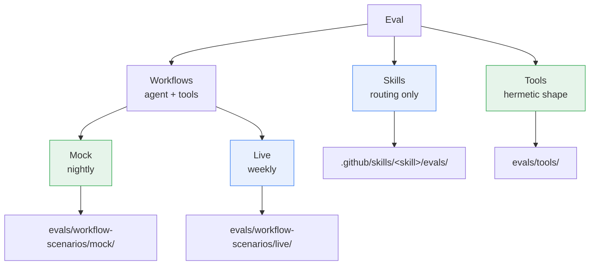
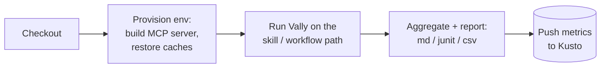
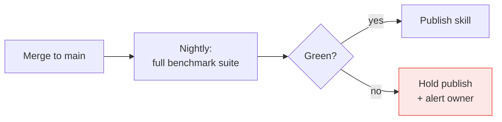
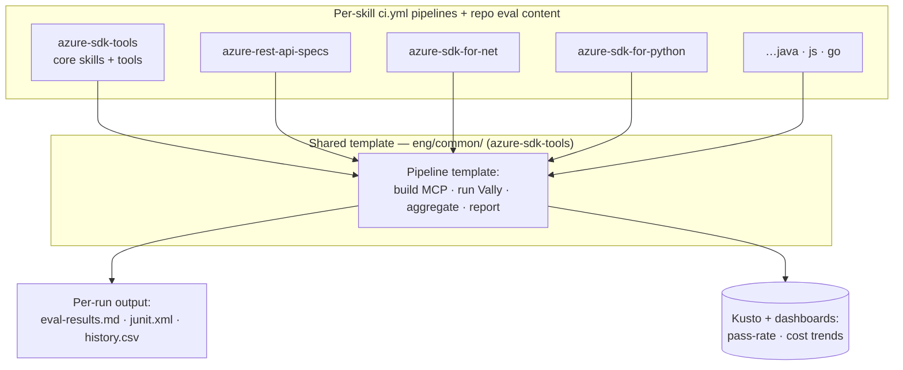

# Spec: 8 Operations — Agent Evaluation Strategy

## Table of Contents

- [Definitions](#definitions)
- [Background](#background)
- [Goals and Exceptions/Limitations](#goals-and-exceptionslimitations)
- [Design Proposal](#design-proposal)
- [Agent Prompts](#agent-prompts)
- [Success Criteria](#success-criteria)
- [Open Questions](#open-questions)
- [Implementation Plan](#implementation-plan)

---

## Definitions

- **Agent**: a live LLM conversation driving Azure SDK MCP tools through skills.
- **Skill**: a markdown contract under `.github/skills/<name>/` telling the
  agent *when* to engage and *which* tools/workflow to use.
- **MCP tool**: a discrete capability exposed by the Azure SDK MCP server.
- **Workflow scenario**: a user prompt that crosses multiple tools / skills
  end-to-end (e.g. *create release plan → generate SDK → link the SDK PR*).
- **Stimulus**: one prompt + its expected behavior — the unit of an eval.
- **Graders per stimulus**: at minimum `skill-invocation` (right skill
  picked), `tool-calls` (right tools / order / args), and `prompt` (right
  final answer). Graders are composable, not a fixed set of three — a
  stimulus that edits files adds `file-matches`, and a stimulus can weight
  graders and set a pass threshold.
- **Mock MCP**: an in-memory fake of the Azure SDK MCP server — no network,
  no side effects. **Live MCP**: the real server hitting real DevOps / GitHub.


---

## Background

We're shipping agent-driven replacements for manual SDK workflows — starting
with the release planner. When someone
asks *"does the agent actually do what we said it does?"*, today the only
honest answer is "I tried a few prompts on my laptop." That is not good
enough to hand to partner teams or to keep regressions out as more workflows
land.

We need a small, shared set of prompts we promise to support, run regularly,
with a clear pass/fail per prompt — so we can point at the report instead
of re-demoing.

---

## Goals and Exceptions/Limitations

**Primary objective.** Build a scalable evaluation orchestration platform
for skills and scenario-based evals using the Vally eval
toolset. Contributors author native `*.eval.yaml` to evaluate our AI systems; a centralized framework
owns execution mechanics. The design optimizes for fast rollout, low
operational complexity, contributor simplicity, centralized orchestration,
and distributed-execution scalability.

### Goals

- [ ] **A reusable CI orchestration platform, not a one-repo runner** built once and reused by *every* pipeline that runs
      evals. The scaling story is not limited to this repo:
      any repo points its pipeline at the shared layer and gets the same
      distributed execution and reporting.
- [ ] **One file per workflow, graders per prompt** — skill picked, tools
      called, final answer, plus structural checks (`file-matches`) where a
      scenario edits files.
- [ ] **Multi-step chains work** (e.g. *validate TypeSpec → create release
      plan → generate SDK → link the SDK PR*).
- [ ] **Simple enough to reuse across repos** — the same runner, grader
      catalog, and orchestration cover common skills/tools *and* repo-specific
      skills and scenarios in the language SDK repos, not just
      `azure-sdk-tools`. A language repo plugs in its own eval content; the
      framework does not change.
- [ ] **Mock covers every tool the scenarios call**, with realistic responses.
- [ ] **Anyone can clone and run** — env vars, no hard-coded paths; live
      scenarios declare what repos they need.
- [ ] **Contributors don't hand-write eval files** — a partner or service
      team should be able to name their skill and the scenarios they care
      about and have the framework (an agent / Copilot) generate the eval
      template for them.
- [ ] **The run produces a status table** of pass/fail per prompt plus a
      trajectory per prompt — readable by non-engineers.
- [ ] **Reports come out in the formats people actually use** — markdown
      for humans, JUnit for CI, CSV for spreadsheets and dashboards.

### Exceptions and Limitations

- **Some prompts can only be checked against live MCP** — the mock can't
  prove a release plan was really created. Those run opt-in only.
- **The agent is not deterministic.** Same prompt, different wording or
  turn count each run. We grade shape, not exact strings, and accept some
  flake.

---


## Design Proposal

### The three eval kinds

At a glance, the eval taxonomy and where each kind lives:



We organize evals around what's actually being tested. No tier numbers —
use the names. The first three columns are the same axis (what does this
prove); the last two say where each lives and what backend it needs.

| Kind | What it proves | Agent | MCP | Lives in |
|---|---|---|---|---|
| **Skills** | A user prompt routes to the right skill (and, for capability evals, that the skill then calls the right tools). | live | none for pure routing; **mock** when the eval asserts tool calls | `.github/skills/<skill>/evals/` |
| **Workflows — Mock** | Agent picks the right skills, calls the right tools in the right order with the right args, returns the right answer. | live | **mock** | `evals/workflow-scenarios/mock/` |
| **Workflows — Live** | Same as above, but against the real backend — catches drift the mock can't see (TypeSpec ordering, real codegen output, real DevOps state). | live | **live** | `evals/workflow-scenarios/live/` |


Plus a hermetic tool-shape layer that isn't agent-driven:

| Kind | What it proves | Lives in |
|---|---|---|
| **Tools** |Each MCP tool is wired up, returns the expected response shape, and is reliably picked from a range of paraphrased user prompts (one tool per stimulus, no multi-step planning). | `evals/tools/` |

#### Required graders by kind

Mock and live workflow scenarios share the same scenario format but
differ in which graders are *required* vs *optional*:

| Kind | `tool-calls` | `skill-invocation` | response grader (`prompt` / LLM-judge) |
|---|---|---|---|
| **Workflows — Mock** | required | optional | not applicable — mock responses are stubbed, so a response grader has nothing meaningful to assert |
| **Workflows — Live** | required | required | required — only live runs produce a real assistant answer worth grading |

Rationale: the mock backend deterministically replays canned data. Live runs are the only place a free-form response can drift, so
that's where the response grader earns its cost.


### Folder layout

```
evals/
├── tools/                  one prompt → one tool
├── workflow-scenarios/
│   ├── mock/               workflow scenarios run against the mock MCP
│   └── live/               workflow scenarios run against the live MCP
└── setup/                  shared fixture scripts (repo clone, etc.)
```

A scenario lives under `mock/` or `live/` based on which backend the
graders are written against, not based on the prompt. A prompt can
have a `mock/` and a `live/` variant (release-planner does).


| Run mode | MCP | Repos? | When | Coverage |
|---|---|---|---|---|
| Workflows — Mock | mock (stub, no LLM) | azure-sdk-tools only | nightly + on demand | every scenario |
| Workflows — Live | live (real backends) | azure-sdk-tools + shallow/sparse clones of the spec & language SDK repos each scenario declares | weekly | scenarios tagged `live-safe` (curated subset) |

When live and mock results disagree, the mock is wrong — the divergence
points straight at the missing or stale handler. Every scenario that
runs on mock therefore drives the mock to grow handlers for the tools
it exercises.

### Where each eval lives

| What it tests | Lives in |
|---|---|
| **One skill** (does this skill route, call its tools, return a sensible answer) | `.github/skills/<skill>/evals/` |
| **Cross-skill / cross-tool** (multi-step chains, e2e flows, mock-server integration, anything that doesn't belong to one skill) | `tools/azsdk-cli/Azure.Sdk.Tools.Vally/evals/` |

Skill evals stay next to `SKILL.md` — that's the convention skill
authors expect, and it keeps everything about a skill in one folder.
Existing skill eval files do not move.

#### Skill eval suite — current state and direction

The skill suite predates this project. Today roughly a dozen skills
have eval files; some are missing thresholds and pass without asserting
anything, and most capability stimuli are graded only by a single
substring check — they pass whether the agent called the right tool,
the wrong tool, or just echoed the prompt.

*Direction.* Raise the bar on what counts as a per-skill eval: adopt
the four-layer pattern — skill-invocation + tool-calls + structural
output match + optional LLM-judge — as the required shape for every
capability stimulus. The `tool-calls` grader is mandatory, not optional:
a capability stimulus must assert the agent picked the *right set of
tools* (and, where order matters, the right order), so a stimulus can no
longer pass by routing to the skill and then calling the wrong tool or
no tool. A `skill-eval-authoring` skill packages the pattern, grader
catalog, and anti-patterns so other Azure SDK teams adopt without
re-learning the gotchas.

### Decision tree — where does my new eval go?

```
Do you only care that the agent picks the right skill
(you don't care which tools it then calls)?
└── yes → .github/skills/<skill-name>/evals/   (not this project)

Do you want to check that one MCP tool returns the right shape
for a given input — no agent in the loop?
└── yes → evals/tools/

Is it a multi-step / multi-tool agent flow?
└── yes → Workflow scenario
        ├── Default → evals/workflow-scenarios/mock/
        │   Runs against the mock MCP. Use this unless the mock can't
        │   faithfully cover the behavior.
        └── Also need live coverage → add an evals/workflow-scenarios/live/
            variant. Reserve for cases where the real backend's behavior
            matters (TypeSpec ordering, real codegen output, real DevOps
            state).
```

### Eval file format — examples

Both kinds are native Vally `*.eval.yaml`. Below are minimal, real-shaped
samples plus how to configure and run them.

**Skill eval** (`.github/skills/<skill>/evals/<name>.eval.yaml`) — proves
a prompt routes to the skill *and* calls the right tools. A
file-producing skill (e.g. `azure-typespec-author`) adds `file-matches`
and weights the graders:

```yaml
name: azure-typespec-author-eval
type: capability
environment: azsdk-mcp           # live agent, real MCP for this suite
config:
  runs: 1
  timeout: "660s"
  model: claude-opus-4.6
  executor: copilot-sdk
stimuli:
  - name: add-preview-only-property
    prompt: Introduce the spread-model properties in API version 2025-05-04-preview only.
    environment:
      files:                     # fixtures copied into the agent's workdir
        - src: ../fixtures/001/main.tsp
          dest: main.tsp
    graders:
      - type: skill-invocation
        config: { required: [azure-typespec-author] }
      - type: tool-calls         # mandatory: right tools got called
        config:
          required:
            - azure-sdk-mcp-azsdk_typespec_generate_authoring_plan
            - azure-sdk-mcp-azsdk_run_typespec_validation
      - type: file-matches       # structural: edit landed where expected
        config: { path: main.tsp, pattern: 2025-05-04-preview }
      - type: prompt             # LLM-judge: no unrelated edits
        config:
          prompt: Verify changes are scoped to this task only.
          model: claude-opus-4.6
          scoring: scale_1_5
          threshold: 1.0
    constraints: { max_turns: 5, max_tokens: 50000 }
scoring:
  weights: { file-matches: 3, tool-calls: 1, skill-invocation: 1, prompt: 1 }
  threshold: 1.0
```

**Workflow eval** (`evals/workflow-scenarios/mock/<workflow>.eval.yaml`) —
a multi-tool chain; environment-agnostic, so the same file runs on mock
or live (the backend is chosen at run time):

```yaml
name: release-planner
type: capability
config: { runs: 3, timeout: "300s", model: gpt-5.4, executor: copilot-sdk }
stimuli:
  - name: create-and-generate
    prompt: Create a beta release plan for this TypeSpec spec and generate the SDK.
    graders:
      - type: skill-invocation
        config: { required: [azsdk-common-prepare-release-plan] }
      - type: tool-calls
        config:
          required:
            - azsdk_get_release_plan
            - azsdk_create_release_plan
            - azsdk_run_generate_sdk
          forbidden: [azsdk_verify_setup]
    constraints: { max_turns: 30, max_tokens: 200000 }
```

#### Authoring evals — generated, not hand-written

Most contributors — ARM, service partner teams — own a skill but have
never seen the eval format. We do not want them learning YAML grader
config to add coverage. The target workflow:

1. A contributor names their **skill** and the **scenarios** they want
   covered (in plain language).
2. An agent / Copilot generates the matching `*.eval.yaml` — the right
   graders, the right tool-call assertions, a fixtures stub — from the
   skill's `SKILL.md` and the named scenarios.
3. The contributor reviews and tweaks the generated file; the framework
   validates it (structural + reference checks) before it lands.

This keeps the authoring barrier low while the generated files stay
native Vally — the orchestration layer sees no difference between a
generated eval and a hand-written one.

### CI

**The problem.** Agent evals are slow (each agent run takes tens of
seconds to minutes), they cost money, and they flake for reasons that
have nothing to do with the code under review. We will have hundreds of
them, across many skills owned by many teams. Two facts shape the whole
CI design:

- **Non-determinism.** The same prompt can pass one run and fail the
  next. "Did it pass?" becomes "what % of the time does it pass?" — so a
  single red/green light over everyone's skills is meaningless.
- **Ownership.** Service partner teams already contribute skills. If many
  skills share one pipeline, one team's flaky or abandoned skill turns the
  whole pipeline red and nobody can tell whose failure it is — the classic
  noisy-neighbor problem. `main` never goes green and the signal dies. The
  fix is isolating each skill so a red pipeline maps to exactly one owner.

**The model: one pipeline per skill, all sharing one template.**

```
Each skill:       a ci.yml that calls the shared template with the skill's path
run-eval.yaml:    the one shared template — build MCP, run Vally, aggregate, report
DevOps:           one pipeline per ci.yml
```

- **Granularity = the skill.** Each skill ships a tiny `ci.yml` next to it
  that does nothing but call the shared `run-eval.yaml` template and pass
  the path to the skill. DevOps registers **one pipeline per `ci.yml`** —
  exactly how SDK `ci.yml` pipelines already work today.
- **One template for the whole operation.** `run-eval.yaml` (in
  `eng/common/`) owns all the logic — build the MCP server, run native
  Vally on the given skill path, aggregate, report. The per-skill `ci.yml`
  carries no logic, only the path parameter.
- **Why per-skill, not per-repo or per-team:**
  - **Per-repo** has the exact noisy-neighbor problem Ben raised — every
    skill in the repo shares one red/green light, so one flaky or
    abandoned skill blocks the signal for all the others.
  - **Per-team/org** avoids that but forces a grouping decision (which
    code-owner boundary?) and still lands at ~50–100 pipelines.
  - **Per-skill** needs *no* grouping decision (the skill *is* the unit),
    gives perfect isolation (a red pipeline = exactly one skill = one
    owner via that skill's `ci.yml` ownership), and routes failure
    notifications automatically.

**On pipeline count and reporting.** Per-skill means many pipelines
(potentially hundreds). That only hurts *if the DevOps pipeline list is
your report* — and it shouldn't be. Pipeline status is for **attribution
and enforcement** ("whose skill is red, can I act on it?"), where finer
granularity is strictly better. Human-readable **reporting** ("how is
release-planner trending over 30 days?") lives in **Kusto + dashboards**
(see [Results](#results)): every pipeline pushes its results there, and
the dashboard rolls them up by skill / team / repo. Decoupled this way,
the pipeline count is irrelevant to reporting.

#### What phase 1 does and doesn't do

The theme is fast rollout, so phase 1 is intentionally small:

| Decision | Phase 1 | Why |
|---|---|---|
| **Dynamic discovery + sharding** | **No** — each `ci.yml` points at a known skill path | One pipeline per skill needs no cross-repo discovery yet |
| **PR gating** | **No** | Check Enforcer was removed (new pipelines can't gate PRs), and Vally needs a Copilot token that can't run on public PR pipelines |
| **Cadence** | Internal pipeline, **nightly** (or CI on skill change) | Collect data first; decide gating later |
| **Live runs** | **On demand only** | Same posture as live tests — expensive, non-deterministic |
| **Backend** | **Mock** workflow scenarios + skill evals | Live deferred to phase 2 |

PR gating is revisited only once org-wide Copilot billing removes the
token requirement. Until then, CI is an **internal pipeline that produces
a report**, not a merge gate.

#### Pipelines and triggers

Azure Pipelines decides *when* to run from path-based triggers in each
`ci.yml`, so:

- A **skill** pipeline triggers on changes under that skill's path.
- A **cross-skill workflow** pipeline lists **every skill path it
  touches** as a trigger (a workflow invoking four skills lists all four).
- **Everything also runs nightly regardless** — a change to the MCP
  server (not to any skill) wouldn't fire a skill-path trigger, so the
  nightly full run is the backstop.

| Pipeline kind | Triggers on | Runs | Backend |
|---|---|---|---|
| Per-skill | that skill's path | that skill's evals | mock |
| Workflow scenario | all skill paths the workflow touches | that cross-skill scenario | mock |
| Nightly (all) | schedule | everything | mock |
| Live | manual / on demand | live-safe scenarios | live |

#### Authoring stays self-service — generated pipelines, not hand-written YAML

Partner teams should write **only skills**, never pipeline YAML. Two
pieces of automation keep it that way:

- **Pipeline generation.** When a skill is checked in, the existing
  pipeline-generator tooling creates its `ci.yml` (and registers the
  DevOps pipeline) automatically — same shared `run-eval.yaml`, different
  path parameter — mirroring how an SDK `ci.yml` auto-creates a pipeline
  today.
- **Eval validator.** A check flags a new skill that has no eval (like a
  test-coverage gate) and can trigger pipeline generation for it.

Open dependency: routing a failing pipeline to the right owner relies on
the skill's `ci.yml` ownership in CODEOWNERS — a **code-owners
configuration for skills** that doesn't fully exist yet.

#### How a pipeline runs

Each pipeline runs the same skeleton, supplied by the shared template;
only the path parameter and the backend differ:



No cross-repo discovery and no shard planning in phase 1 — each pipeline
already knows which skill or workflow it runs from its parameters.

#### Discovery and change detection (future)

Once a single pipeline owns *many* skills, it becomes worth discovering
eval files automatically (`evals/**/*.eval.yaml`,
`.github/skills/**/evals/*.eval.yaml`) and mapping a PR diff to only the
affected evals, so a change pays for just what it touches. Phase 1 skips
this — each pipeline targets a known path. Captured here as the
direction, not a phase-1 deliverable.

#### Sharding (deferred)

Sharding is **not** in phase 1. It becomes relevant only when one
pipeline owns many skills and a sequential run gets too slow — e.g. 140
evals × ~20 s ≈ 46 min versus ~7 min across 7 parallel shards. When we
get there, the shared template splits the selected evals into independent
shards (Azure DevOps matrix jobs) and merges results, starting with even
file-count sharding and a modest concurrency cap (~10) to avoid
exhausting the agent pool and the Copilot-SDK session limit.
Runtime-aware sharding is a later enhancement still.

#### Environment setup and caching

This is the part we already got burned on, so it's called out explicitly:
**before any eval runs, the pipeline's environment has to be real.** Two
things have to be in place, and both are cached so we don't pay full cost
on every run.

**1. The MCP server, pre-built.** Vally launches `dotnet <dll>`, not
`dotnet run`, to avoid an MSBuild boot race under parallel workers. The
pipeline builds `Azure.Sdk.Tools.Cli` and `Azure.Sdk.Tools.Mock` once,
to a stable output path (`-o artifacts/mcp/...`, no TFM in the path), and
every run reuses that build artifact.

**2. The repos a scenario needs, pre-cloned.** A real workflow crosses
repos — the release planner reads a TypeSpec project from
`azure-rest-api-specs`, generates into a language SDK repo, and links a PR
back. The tools expect those files on disk; a missing repo makes the agent
fail for the wrong reason and we learn nothing.

- Each live scenario **declares** the repos it needs in its eval YAML —
  a `metadata.repos` block (repo name and optionally a pinned commit) —
  so the requirement travels with the scenario, not with a per-machine
  setup script. The eval points `environment.git.source` at the
  repo-relative cache path the runner provisions.
- One setup step reads all selected live scenarios, takes the **union**
  of their declared repos, and ensures each is present before the run — a
  shallow + blobless + cone-sparse clone (only the spec paths the
  scenarios touch) into a repo-relative cache dir, never a hard-coded
  user path.
- **Locally and in CI it's the same provisioning step.** Locally it
  clones into a cache folder and reuses it on later runs; in CI the same
  repos are checked out into the same path (the cache is a build-cache
  artifact **keyed on the set of repos the scenarios declare**,
  invalidated only when that set changes). The eval YAML never changes
  between the two — only the backend that satisfies the declaration does.
- **One shared, cross-platform clone helper.** The sparse-clone logic is
  a single helper shared with the existing TypeSpec-authoring benchmark
  (which sparse-clones the same `azure-rest-api-specs`), written in
  Node.js so it runs identically on Windows and the Linux CI agents (per
  the JS-over-PowerShell guidance in #15694). Scenarios differ only in
  *which* sparse paths they keep, not in the cloning machinery.
- **Pinning:** a scenario can pin a commit for reproducibility; otherwise
  setup takes the default branch and records the commit it used in the run
  output.

The **mock** job needs only step 1 — mock evals touch no external repos.
The **live** job needs both.

#### External tool dependencies (the limit of mocking)

The mock only covers tools exposed through the Azure SDK CLI MCP server
(and, in future, the Azure MCP server). A skill that shells out to
**other** tools — Azure CLI, GitHub CLI, `uv`, `python` — has nothing to
mock against:

- A team that wants those calls mocked is responsible for exposing them
  through a **custom MCP server**; the framework then mocks that server
  the same way it mocks ours.
- A skill whose external dependencies can't be mocked is flagged
  **live-only** — it runs in the on-demand live pipeline, not the mock
  nightly.
- **Protocol-agnostic by design.** Vally talks to a backend through a
  setup step, so a skill can be driven over MCP today and swapped to a
  raw CLI tomorrow without rewriting the eval. The approach is not
  hard-coupled to MCP.
- *Future direction (not phase 1):* a test-proxy / busybox-style
  "mega-mocker" that intercepts arbitrary external calls would widen what
  can be mocked — noted as a direction, not a commitment.

#### Validation gates (before we spend agent time)

Cheap structural checks run before any agent executes, so a typo fails in
seconds instead of after a 17-minute run:

- **Structural** — YAML validity, duplicate stimulus IDs, malformed config.
- **Coverage** — skills with no eval, tools no green scenario exercises,
  orphaned scenarios (reported, not necessarily blocking).
- **Reference** — fixtures, skills, and prompts a stimulus names actually
  exist.

**New-skill-without-eval check (later phase).** A dedicated validator —
run as a PR pipeline or GitHub Action, the same way test-coverage gating
works — fails the PR when a new skill is added without a matching eval.
It is deliberately a later phase: we want the generation workflow and the
core orchestration proven first, so the gate doesn't block contributors
before the easy path to *add* an eval exists.

#### PR gating (future, currently blocked)

PR gating is out of scope for phase 1 for two concrete reasons: Check
Enforcer (which let non-default pipelines gate PRs) was removed, and
Vally needs a Copilot token that can't run on public PR pipelines. Until
those change, CI is internal-nightly only.

If gating returns, the natural shape for a workflow like TypeSpec
authoring is a mix — a few typical benchmark cases against the **real**
MCP server (the only way to catch codegen / validation drift) plus
skill-invocation checks against the **mock** MCP server (fast,
deterministic routing coverage).

Open trade-offs if we revisit gating: which scenarios count as
"essential"; how to tame LLM non-determinism (retries? quorum across N
runs? loose thresholds?); and per-PR cost. See
[Open Questions](#open-questions).

#### Skill publish gated by eval

Skills are published from `main`; the eval suite is what makes that
safe. Because phase 1 has no PR gating, the **nightly** run is the gate —
a skill only publishes once its full benchmark suite is green:



A skill never ships on a single run — the nightly suite gates the actual
publish. (If PR gating is added later, a curated mostly-mock subset could
run per-PR as an early signal, but the nightly remains the publish gate.)

#### Aggregation and reporting

Each pipeline merges its run output into the single set of files
described under [Results](#results) — one `eval-results.md`, one
`junit.xml`, one `history.csv` row — and emits a coverage summary, e.g.:

```
Pipeline: core-skills
  Skills:    Passed 420  Failed 2
  Scenarios: Passed  74  Failed 3
  Coverage warnings:
    - tool create-release-plan has no green scenario
```

Infra `status=error` rows are reported as infrastructure errors, **not**
counted as graded failures, so a flaky agent session can't masquerade as
a real regression. (When sharding lands, the same merge runs across
shards.)


### Mock MCP server status

#### How it works

`Azure.Sdk.Tools.Mock` reflects over the real CLI's tool list at boot and
registers a mock proxy for **every** tool the real `Azure.Sdk.Tools.Cli`
advertises, preserving each tool's name, description, and input schema.
At call time the proxy looks up a handler by tool name:

- **Custom handler exists** → scripted, type-correct response.
- **No custom handler** → fallback `{ Message = "Success" }`.


### Results

The goal: anyone — partner team, manager, the engineer who broke
something — should be able to open a run and understand what passed,
what failed, and why, without help.

Each run writes three files into the output directory:

| File | What it is | Who reads it |
|---|---|---|
| `eval-results.md` | Human status table: one row per prompt, pass/fail per grader. | Reviewers, partner teams, anyone scanning a run. |
| `results.jsonl` | The full agent trajectory — every tool call, args, return values, timings. One JSON object per line. | Engineers debugging a failure with tooling. |
| `junit.xml` | Standard test-results format the CI test-results widget already understands. | CI dashboards. |

The JSONL is rich but hard to read raw. We add two post-processors
on top of it:

- **Trajectory HTML** — one self-contained web page per prompt, opens
  straight from `file://`. Shows the same trajectory as `results.jsonl`
  but readable by someone who has never seen JSONL.
- **CSV history** — one row per prompt, appended across runs. Lets us
  ask *"how often did release-planner pass in the last 30 nightlies?"*
  and feed a dashboard later.

In CI: trajectories + JSONL are uploaded as build artifacts you can
download from the run page; the CSV gets appended to a long-lived
history branch.

**Reporting rollout.** Because agent evals are non-deterministic, the
single most useful signal is **pass rate over time**, not one run's
red/green — "release-planner passed 70% of the last 30 nightlies" tells
you far more than a single result. So reporting pushes results to **Kusto**
and drives shared **dashboards**:

- **Pass-rate trends** per skill / scenario over time, to catch slow
  degradation a single run hides.
- **Per-test cost and token metrics**, so we can see which tests are
  expensive and spot waste (a scenario burning tokens for little signal).

Pipeline artifacts (the files above) remain the per-run detail; Kusto +
dashboards are the cross-run view.

### Performance and cost controls

Why this section exists: agent evals are *slow* and talk to a real LLM,
so a badly-written scenario can sit in a loop burning tokens for an hour
while still reporting *"passed"*. The goal here is **visibility, not
hard enforcement** — total cost is not the concern (well under $100k/yr
is acceptable next to the ~$400k already spent on live testing). What we
want is the *data* to spot waste: which tests cost what, and which ones
burn tokens for little signal. Limits exist mainly as guardrails against
runaways, not as a budget ceiling.

Concrete example: one real release-planner end-to-end run took **17
minutes wall time, 1.78M tokens, 41 turns**.

The framework applies three things:

**1. Per-scenario budgets.** Every scenario file declares an upper
bound on:

- **Turns** — how many times the agent loops.
- **Wall time** — how long the whole run can take.
- **Billable tokens** — input + output tokens we actually pay for.
- **Tool calls** — catches an agent stuck calling the same tool forever.

The runner warns at 50% of any limit, fails the scenario at 100%, and
kills the whole run at 200% so a runaway can't bleed indefinitely.

**2. Tiered defaults.** Mock runs nightly against an in-memory fake —
cheap and fast, so the limits are tight. Live runs on demand against real
backends — slower by nature, so the limits are looser.

| Tier | Turns | Wall (s) | Billable tokens |
|---|---|---|---|
| Mock (nightly) | 30 | 300 | 200k |
| Live (on demand) | 60 | 600 | 500k |

A scenario that needs more must opt in with a justification comment in
the scenario file. If reviewers reject the opt-in, the scenario has to
be rewritten to fit, or moved to mock — budgets don't widen.

**3. Background guardrails** — things the scenario author never has
to think about, baked into the framework:

- Polling tools (`*_get_*_status`) return a terminal state on the first poll under safe mode — no agent stuck waiting for *"in progress"* to flip.
- LLM-judge graders default to a cheaper model than the agent itself.
- CI cancels superseded runs when a branch gets a new push.


### Cross-repo rollout and the shared platform

This eval strategy starts in `azure-sdk-tools` but the runner mechanics
are meant to be reused, not forked. The split is the same everywhere: **a
repository owns its evaluation content** (eval files, fixtures, prompts,
scenario definitions) and **a shared `run-eval.yaml` template owns
execution mechanics** (build the MCP server, run native Vally, aggregate,
report). Each skill's `ci.yml` is a thin skeleton that calls the template
with its skill path; only the eval content differs per repo and per
skill. (Discovery and sharding are future additions to that template, not
part of the phase-1 split — see [Sharding](#sharding-deferred).)

The shared template lives under `azure-sdk-tools/eng/common/` — the
folder that is **mirrored into every Azure SDK repo**. Putting it here is
what makes "build once, reuse everywhere" literal: a language repo gets
the `run-eval.yaml` template and scripts by sync, and each skill just
adds a `ci.yml` that calls it plus its own eval content. It slots into
the existing `eng/common` layout rather than a new top-level folder:

```
eng/common/
├── pipelines/        run-eval.yaml: build MCP → run Vally → aggregate → report
└── scripts/          env setup, result merge, validators (discovery + sharding added later)
```

Folders for shared stimuli/fixtures, reporting sinks, and the like are
added only when a phase needs them — the Phase 1 footprint is
deliberately minimal.



**Rollout — incremental, smallest first.** The plan is deliberately
incremental: **build something small in the tools repo first, extend it
to specs, then extend it to the language repos.** Each step reuses the
same shared template and only adds the next repo's eval content.

- **Phase 1 — `azure-sdk-tools`, bare minimum.** Build the run path
  end-to-end *here*, where the framework, the MCP server, and the skills
  already live — the smallest possible footprint to prove the shape. The
  shared template and scripts land in `eng/common`, covering the
  **create-release-plan + generate-SDK** workflow as a proof of concept
  — **mock workflow scenario + skill eval only**. Validate the template,
  the contributor workflow, environment setup, and reporting (including
  the Kusto push + a basic dashboard) on native Vally evals. Deliberately
  *out of scope* early: dynamic discovery, sharding, distributed
  execution, PR gating, runtime-aware balancing, multi-engine support,
  any custom schema layer, and the auto-pipeline-generator / validator.
- **Phase 2 — extend to `azure-rest-api-specs`.** The first cross-repo
  hop. Because the template syncs through `eng/common`, the specs repo
  adds only its own `ci.yml` + eval content; the runner is unchanged.
  This is where the create-release-plan → generate-SDK workflow runs
  against real spec layouts.
- **Phase 3 — extend to the language SDK repos.** Generalize across
  `azure-sdk-for-net`, `-python`, `-java`, `-js`, and `-go`. Add live
  runs, auto-generated `ci.yml` pipelines + the new-skill-without-eval
  validator, and sharding within multi-skill pipelines. Each repo / team
  brings its own eval content and per-skill `ci.yml` pipelines; the
  shared template is unchanged. Shanghai team adds their tests here;
  CLI / knowledge-based tests migrate in too.

**Validation the shared layer runs on every repo's content**, beyond
pass/fail:

- *Structural* — YAML validity, duplicate stimulus IDs, malformed config.
- *Coverage* — skills with no eval, tools no scenario exercises, orphaned scenarios.
- *Reference* — fixtures, skills, and prompts a stimulus names actually exist.

**Reusable stimuli and fixtures.** To avoid prompt duplication and
fixture drift across repos, the framework can host shared prompts,
contexts, fixtures, and mock responses under `eng/common/` alongside the
orchestration scripts. A repo references a shared stimulus instead of
copying it. This is optional and additive — a repo can keep everything
local.


---

## Agent Prompts

The list of prompts the agent is promised to support. Each lives as a
stimulus in `evals/workflow-scenarios/mock/<workflow>.eval.yaml` (plus a
`live/` counterpart where applicable). Adding a new prompt is one new
entry in the matching file.

### Release-planner workflow

Derived from the release-planner replacement test plan
([#15835](https://github.com/Azure/azure-sdk-tools/issues/15835)). All
five route to the `azsdk-common-prepare-release-plan` skill.

| Prompt | What the agent must do | Required tool calls |
|---|---|---|
| Create a public-preview release plan for a TypeSpec spec, target month June 2026 | Pick the prepare-release-plan skill; check for an existing plan; create one. | `azsdk_get_release_plan`, `azsdk_create_release_plan` |
| Create a release plan **and** generate SDK for a TypeSpec spec, release type beta | End-to-end chain: create, then generate, then back-fill SDK details. | `azsdk_get_release_plan`, `azsdk_create_release_plan`, `azsdk_run_generate_sdk`, `azsdk_update_sdk_details_in_release_plan` |
| Generate SDK for all languages for an existing release plan id | Look up the plan, run generation against the languages it lists. | `azsdk_get_release_plan`, `azsdk_run_generate_sdk` |
| Link a different spec PR (`https://github.com/Azure/azure-rest-api-specs/pull/...`) to an existing release plan | Look up the plan, swap the spec-PR field. | `azsdk_get_release_plan`, `azsdk_update_api_spec_pull_request_in_release_plan` |
| Update SDK details (package names) on an existing release plan from `tspconfig.yaml` | Look up the plan, update the SDK details from emitter config. | `azsdk_get_release_plan`, `azsdk_update_sdk_details_in_release_plan` |

All five forbid `azsdk_verify_setup` (the setup gate runs once at the
top of the workflow, not per prompt) and forbid the irrelevant
`azsdk_create_release_plan` in the four "existing plan" prompts so we
catch the agent creating a duplicate.

### Other workflows

| Workflow | File | Coverage |
|---|---|---|
| Check spec is in public repo then validate TypeSpec | `check-public-repo-then-validate.eval.yaml` | TypeSpec authoring routing + validation tool call. |
| TypeSpec generation — step 2 of the authoring flow | `typespec-generation-step02.eval.yaml` | TypeSpec authoring skill + generate tool. |
| Rename a client property in a generated SDK | `rename-client-property.eval.yaml` | Customization skill + customize-code tool. |

The live counterpart of release-planner lives at
`evals/workflow-scenarios/live/release-planner.eval.yaml` and adds a
prompt-grader that checks the real DevOps response.

---

## Success Criteria

- A single command runs the full mock suite locally and produces
  `eval-results.md`, `results.jsonl`, JUnit XML, the per-prompt
  trajectory HTML, and a `history.csv` row.
- Every release-planner prompt above is green in the mock suite.
- Every MCP tool a green scenario calls has a custom mock handler
  returning a chainable, type-correct response.
- A new contributor can clone the repo, set the documented env vars,
  and reproduce the same `eval-results.md` verdict table on their
  machine.
- A partner team reporting *"I tried this prompt and the agent didn't
  do anything"* can be answered by pasting their prompt as a new
  stimulus and re-running the workflow file — no runner or CI changes.
- The status table is what we hand to reviewers (Renhe, Laurent,
  partner teams) to answer *"what does the agent currently support?"*

---

## Open Questions

### Pipeline granularity and routing

- **Granularity (decided).** One pipeline per skill — each skill ships a
  `ci.yml` that calls the shared `run-eval.yaml`. Per-repo was rejected
  (noisy neighbor) and per-team/org was rejected (forces a grouping
  decision and still lands at ~50–100 pipelines). Open follow-on: how do
  we keep hundreds of pipelines manageable operationally (naming,
  folders, bulk disable)?
- **Reporting at scale.** Many pipelines is fine *because* reporting is
  in Kusto + dashboards, not the DevOps pipeline list. Open: what's the
  minimum dashboard for phase 1, and what slices (per skill / team / repo)
  do consumers actually want?
- **Code-owners for skills.** Routing a red pipeline to the right owner
  relies on the skill's `ci.yml` CODEOWNERS entry — a code-owners story
  for skills that **doesn't fully exist yet**. Who defines it and where
  does it live?
- **Auto-generation.** When a skill is checked in, the pipeline-generator
  should stamp out its `ci.yml` and register the DevOps pipeline. Open:
  do we generate discrete `ci.yml` files per skill, or keep one root YAML
  parameterized per skill path?

### CI cadence and PR gating

- **Cadence.** Phase 1 is internal nightly mock + on-demand live. Open:
  is nightly right, or do we want CI on every skill change too? Live is
  the only thing that catches real-backend drift — how often is enough?
- **PR gating (blocked).** Out of scope until two blockers clear: Check
  Enforcer was removed, and Vally's Copilot token can't run on public PR
  pipelines (waiting on org-wide Copilot billing). If those clear: which
  scenarios are "essential", how do we tame LLM flake (retries / quorum /
  loose thresholds), and what's the per-PR cost ceiling?

### Mocking external dependencies

- **Unmockable skills.** The mock only covers the Azure SDK CLI MCP
  server (and later Azure MCP). Skills calling Azure CLI / GitHub CLI /
  `uv` / `python` can't be mocked unless the owning team exposes them via
  a custom MCP server; otherwise the skill is flagged live-only. Open:
  how aggressively do we push teams toward custom MCP servers vs. a
  future test-proxy/busybox-style mega-mocker?
- **Mock fidelity.** Mocks currently return the same response regardless
  of input parameters — fine for routing/shape coverage now, extensible
  later. When does parameter-aware mocking become necessary?

### Sharding and shared template

- **When to shard.** Sharding is deferred until a single pipeline runs
  enough skills that a sequential run is too slow. Open: what suite size
  / wall-clock threshold triggers introducing it, and what initial shard
  count + concurrency cap?
- **Template ownership.** The shared template in `eng/common/` is used by
  every repo. Open: who owns it, who reviews changes, and how do
  consuming repos pin or roll forward a version?

---

## Implementation Plan

The approach is **incremental: build something small in the tools repo
first, extend it to specs, then extend it to the language repos.** Prove
the shape on the smallest footprint before generalizing.

The deliverables below are ordered by dependency — each is sized to
become a single work item. Phase 1 builds **bottom-up**: the shared
template and its building blocks come first, then a single skill wires
itself to that template as the end-to-end proof.

### Phase 1 — one internal pipeline in `azure-sdk-tools`

Goal: the **create-release-plan + generate-SDK** workflow runs green,
nightly, against the mock backend, with results in artifacts and Kusto —
proving the per-skill `ci.yml` → shared template model end to end.

Deliverables, in build order:

1. **MCP-server build + cache step.** A reusable step that builds
   `Azure.Sdk.Tools.Cli` and `Azure.Sdk.Tools.Mock` once to a stable,
   TFM-free output path (`-o artifacts/mcp/...`) and caches it. Same
   script locally and in CI. *(Prereq for everything that runs Vally.)*
2. **Vally run step.** A step that launches the pre-built MCP server
   (`dotnet <dll>`, not `dotnet run`), runs native Vally against a given
   skill / scenario path, and writes the raw run output. Takes the path
   as a parameter.
3. **Aggregation + reporting step.** Merge run output into
   `eval-results.md`, `results.jsonl`, `junit.xml`, and a `history.csv`
   row; publish them as build artifacts.
4. **The shared `run-eval.yaml` template** (in `eng/common/pipelines/`).
   Composes steps 1–3, parameterized by skill / scenario path and
   backend (mock). **This is the common template every pipeline reuses —
   it must exist before any `ci.yml` can call it.**
5. **Kusto push + basic dashboard.** Emit per-run pass/fail and
   cost/token metrics to Kusto; stand up a minimal dashboard showing
   pass-rate-over-time and per-test cost. *(Depends on step 3's output
   shape.)*
6. **First skill `ci.yml`.** A thin `ci.yml` for the release-plan skill
   that calls `run-eval.yaml` with the skill path; register one DevOps
   pipeline from it, scheduled nightly.
7. **The eval content** for the POC — the **mock workflow scenario** for
   create-release-plan → generate-SDK plus the **skill eval** — authored
   as native Vally `*.eval.yaml`. *(Can be written in parallel with
   steps 1–6.)*

Scope guardrails for Phase 1: internal, **nightly** (or CI on skill
change); **no** PR gating, dynamic discovery, sharding, or live runs.

Explicitly deferred (Phase 2+): live runs, auto-pipeline-generation,
the new-skill-without-eval validator, dynamic discovery, sharding, and
eval-generation tooling.

### Process

- Consolidate this design with the review feedback into one document
  (done here).
- Review the CI parts with Ben before circulating more broadly
  (e.g. to Laurent).
- Hold recirculation until that review is complete.

### Phase 2 — extend to `azure-rest-api-specs`

The first cross-repo hop. The template syncs through `eng/common`, so
the specs repo adds only its own `ci.yml` + eval content; the runner is
unchanged. New deliverables:

1. **Cross-repo environment setup** — the pre-clone / cache step for the
   spec (and SDK) repos a scenario declares, so a real spec layout is on
   disk before the run.
2. **Specs-repo skill `ci.yml` + eval content** wired to the same shared
   template.
3. **Live-run support** (on demand) for scenarios the mock can't prove.

### Phase 3 — extend to the language SDK repos

Generalize across `azure-sdk-for-net`, `-python`, `-java`, `-js`, and
`-go`. Each team brings its own eval content and per-skill `ci.yml`
pipelines over the same shared template. New deliverables:

1. **Code-owners configuration for skills** — the routing story that
   sends a red pipeline to the owning team.
2. **Auto-pipeline-generation** — the pipeline-generator stamps out a
   skill's `ci.yml` and registers its DevOps pipeline on check-in.
3. **New-skill-without-eval validator** — flags a skill added with no
   eval and triggers generation.
4. **Sharding within multi-skill pipelines** — once a pipeline owns
   enough skills that a sequential run is too slow.
5. **Migration** — Shanghai team adds their tests; CLI / knowledge-based
   tests migrate in.
