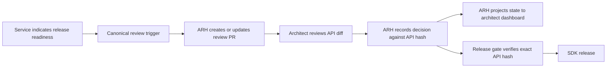
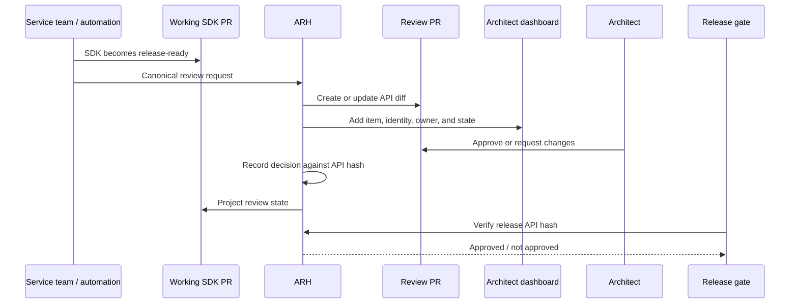

# ARH Replacement: Decisions and Open Design Areas

> **Status:** Working draft for design alignment. This document identifies the
> decisions required before API Review Hub (ARH) can replace the Azure SDK review
> issue workflow and APIView-based approval model. It intentionally does not
> re-document every current process mechanic.

---

## Goal

Replace the existing Azure SDK Architecture Board workflow - SDK review issues,
approval labels, and APIView coordination - with one ARH-centric approval experience
that:

- provides a single source of truth for SDK API approvals;
- gives architects a unified work queue across repositories;
- removes duplicate review tracking;
- supports generated and manually authored SDKs;
- preserves cross-language service context; and
- satisfies release-gating and audit requirements.

The emerging end state is:



The trigger, retirement of SDK review issues, service-level grouping, and release
integration are not yet settled. Those decisions are the focus of this document.

---

## Definitions

- **Working PR:** The pull request in an `azure-sdk-for-<language>` repository
  containing the SDK intended to merge and release.
- **Review PR:** An ARH-managed pull request containing the reviewable API diff. It
  is a review artifact and is not merged.
- **API hash:** The identifier for the exact API surface reviewed. Approval of one
  hash does not approve a changed surface.
- **Projection:** GitHub labels or project fields derived from ARH state for
  visibility and routing. A projection is not an approval record.
- **SDK review issue:** The current coordinating issue in `Azure/azure-sdk` used for
  intake, artifact validation, language grouping, assignment, and approval tracking.
- **Canonical service identity:** A stable identifier used to correlate language
  reviews for one service or release. It is not merely a display name in a PR title.

---

## Decisions at a glance

| # | Design area | Emerging direction | Decision still required |
|---|-------------|--------------------|-------------------------|
| 1 | Source of truth | ARH record bound to API hash | Identify and migrate every consumer of approval labels |
| 2 | SDK review issues | Retire after capability parity | Confirm whether any intake or coordination purpose remains |
| 3 | Architect dashboard | Azure organization project backed by ARH | Define fields, filtering, grouping, and ownership |
| 4 | Review trigger | Trigger at release readiness | Select one canonical trigger and explicit fallback |
| 5 | SDK coverage | One contract independent of SDK origin | Define artifact production for non-TypeSpec paths |
| 6 | Review artifact | ARH review PR from working branch | Confirm APIView retirement and update behavior |
| 7 | Approval semantics | Explicit ARH states projected to GitHub | Finalize labels and GitHub review interpretation |
| 8 | Release integration | Gate on exact approved API hash | Define when approval is required and which system enforces it |
| 9 | Governance boundary | ARH owns SDK Architecture Board review only | Confirm package-name ownership and interfaces to other boards |

---

## 1. Source of truth

### Decision needed

What is the authoritative approval record?

### Current state

- SDK review issues track per-language approval with labels such as
  `<lang>-api-approved`.
- APIView contains the reviewed API artifact and discussion separately.
- Release and coordination workflows consume labels or workflow state.
- A label does not prove which API surface was reviewed.

### Proposed direction

ARH becomes authoritative. It records the architect, decision, language, timestamp,
working PR association, and API hash. GitHub labels and project fields become
projections of that record.

```text
ARH approval record (authoritative)
        |
        +--> working PR label (projection)
        +--> review PR label (projection)
        +--> project field (projection)
        +--> release-gate response
```

### Required decisions

- [ ] Inventory every release, dashboard, bot, and workflow consumer of current
  approval labels.
- [ ] Decide the transition contract for consumers that cannot query ARH initially.
- [ ] Define stale-approval invalidation when the working API hash changes.
- [ ] Define ARH availability and failure behavior for a blocking release gate.
- [ ] Confirm the audit-retention requirements for approval records.

---

## 2. Fate of Azure SDK review issues

### Decision needed

Can the `Azure/azure-sdk` SDK review issue workflow be completely retired?

### Capabilities that must be replaced

| Current issue capability | Candidate replacement |
|--------------------------|-----------------------|
| Intake | Canonical ARH trigger |
| Artifact validation | ARH validates working PR and API artifact |
| Cross-language grouping | Canonical service identity on the dashboard |
| Review readiness | ARH review state |
| Architect assignment | ARH routing configuration |
| Approval tracking | API-hash decision in ARH |
| Completion | ARH closes or archives review artifacts according to policy |
| Scheduling / Bookings | Release-readiness integration or explicit fallback |
| Audit history | ARH record plus review PR conversation |

### Proposed direction

Retire the issue workflow once ARH and the dashboard have demonstrated capability
parity. During migration, the issue may remain a compatibility view, but it must not
be an independent approval source or release gate.

### Required decisions

- [ ] Does any stakeholder still need an issue as an intake or communication
  artifact?
- [ ] Can ARH preserve the service-level context currently supplied by one
  multi-language issue?
- [ ] What is the parity period and what measurable result ends it?
- [ ] What happens to Bookings and already scheduled reviews?
- [ ] Are historical issues retained as read-only records?

This is the central replacement decision: if the issue retains approval or grouping
responsibility, the target experience is still a parallel process.

---

## 3. Architect dashboard experience

### Decision needed

What becomes the architect's primary work queue?

### Proposed direction

The Azure SDK Architecture Board project becomes the review queue, ownership view,
and status view across ARH review PRs. It is a view over ARH state, not a second
workflow engine.

The dashboard must answer:

- What needs my review?
- Which language, package, service, and release is it for?
- Is it awaiting review, awaiting service-team changes, or approved?
- Where are the review PR and working PR?
- Which other language reviews belong to the same service release?

### Required filtering and grouping

| Need | Proposed data |
|------|---------------|
| Filter by architect | ARH-configured reviewer or assignee |
| Filter by language | Language field |
| Filter by approval state | ARH-synchronized review-state field or label |
| View by service | Canonical service identity |
| Group related languages | Service identity plus release/correlation ID |
| Navigate to implementation | Working PR association |
| Preserve release context | Release plan association, when present |

### Service grouping decision

ARH creates one review item per language, while the current issue groups all
languages. A PR title convention or service-name label is useful for display but is
not a durable grouping key.

Preferred contract:

```text
canonical-service-id + release-plan-id
    -> language
        -> package/namespace
            -> review PR
```

For paths without a release plan, ARH needs a review correlation ID.

### Required decisions

- [ ] What system owns the canonical service identity: release planner, Service
  Tree, package metadata, or ARH?
- [ ] Which Azure-owned repository hosts production ARH review PRs so the
  organization project can index them?
- [ ] Are project fields synchronized by ARH, or are labels the only routing input?
- [ ] How are existing open review PRs backfilled?
- [ ] Does the project show only SDK Architecture Board work or link to the other
  architect boards as separate views?

The project `Done` status must not be interpreted as API approval. Approval remains
an ARH decision against an API hash.

---

## 4. Review trigger model

### Decision needed

What single event causes ARH to create or update a review?

### Options discussed

| Option | Advantages | Risks |
|--------|------------|-------|
| Working PR label | Simple, explicit, works across SDK origins | Manual and inconsistently applied |
| Release planner action | Carries release and service context | Depends on release-plan coverage and adds a tool step |
| `azsdk` command | Explicit and usable from local or agent workflows | Discoverability and training burden |
| Automated release workflow | Lowest service-team effort; aligns with release readiness | May start too late and may miss nonstandard workflows |

### Proposed direction

Use an automated release-readiness signal as the canonical trigger, provided it
occurs before merge and supports all normal release paths. Keep one explicit fallback
for exceptional or no-release-plan workflows.

### Required decisions

- [ ] What exact pre-merge event represents release readiness?
- [ ] Is the fallback a working PR label, release planner action, or `azsdk`
  command?
- [ ] Who is authorized to request, cancel, or restart a review?
- [ ] Does a new commit update the existing review or create a new review?
- [ ] How are abandoned and superseded requests detected?

One canonical trigger does not mean one transport. Automation and an explicit
fallback may call the same idempotent ARH request contract.

---

## 5. Generated and non-generated SDK coverage

### Decision needed

How does ARH cover every SDK path without becoming TypeSpec- or release-agent-only?

### Required scenarios

- Management-plane SDK PR generated automatically after spec merge.
- Data-plane SDK generated on demand.
- SDK PR generated locally.
- Hand-authored or non-TypeSpec SDK.
- Customization-only or dependency release with no spec change.
- Storage-style or other team-owned handoff workflow.

### Proposed direction

The ARH request contract starts from a working SDK PR and API artifact, not from a
TypeSpec project:

```text
repository + working PR + language + package/namespace
    + canonical service identity + API artifact/hash
    + optional release plan
```

Generation-specific systems are adapters that supply this contract. They do not
define separate review processes.

### Required decisions

- [ ] How is a deterministic API artifact produced for each non-TypeSpec path?
- [ ] Can ARH generate the artifact from the working branch on demand?
- [ ] What metadata is mandatory when no release plan exists?
- [ ] Who owns failures where an SDK cannot produce a reviewable artifact?

---

## 6. Review artifact model

### Decision needed

What artifact do architects review, and how is it kept aligned with the working PR?

### Current state

APIView presents generated API surface revisions in a separate web experience.
Architects often review autorevisions after merge rather than a working PR.

### Proposed direction

ARH creates or updates a synthetic review PR containing an `API.md` diff generated
from the working branch. Architects review only that PR for SDK API approval. The
review PR is never merged.

### Required decisions

- [ ] Does APIView fully disappear after migration, or does any scenario still
  require it?
- [ ] Does each working PR map to one durable review PR that updates as the API
  changes?
- [ ] What identifies the baseline used for the API diff?
- [ ] What closes the review PR: approval, working PR merge, release, supersession,
  or abandonment?
- [ ] How are review comments preserved when the diff changes?

The preferred working-branch model avoids repeated disconnected review generations
and keeps feedback associated with the implementation intended to ship.

---

## 7. Approval semantics

### Decision needed

Which states exist, who can cause them, and how are they represented?

### Proposed states

| ARH state | Proposed projection label | Meaning |
|-----------|---------------------------|---------|
| Review needed | `api-review-needed` | Active API hash awaits architect review |
| Changes requested | `api-changes-requested` | Authorized architect requested changes |
| Approved | `api-approved` | Active API hash is approved |

Requirements:

- only one projected state is present at a time;
- ARH manages labels on both review and working PRs;
- labels are informational and are never the release source of truth;
- a new API hash invalidates `api-approved`;
- native GitHub approval counts only when performed by an authorized architect; and
- implementation approval from another maintainer does not imply API approval.

### Required decisions

- [ ] Are these the final cross-repository label names?
- [ ] Do existing language repositories, especially JavaScript, use conflicting
  labels or semantics?
- [ ] Does `changes requested` come directly from native GitHub review state, an ARH
  action, or both?
- [ ] How are architect groups, substitutes, and unauthorized decisions configured
  and audited?
- [ ] Must labels exist on both review and working PRs, or is one location enough
  after dashboard synchronization?

---

## 8. Release-readiness integration

### Decision needed

When is SDK Architecture Board approval required, and which system enforces it?

### Proposed direction

Review is requested when a release is being prepared, and the release gate asks ARH
whether the exact API hash being published has an applicable approval.

This separates three events:

1. a working SDK PR becomes release-ready;
2. an architect approves an API hash; and
3. a release pipeline verifies that approval before publication.

### Required decisions

- [ ] Is approval required before working PR merge, before release execution, or
  both?
- [ ] Which release types require architecture review: first preview, preview
  update, first GA, GA update, and patch?
- [ ] What system computes the release API hash?
- [ ] Does the release pipeline temporarily dual-read APIView and ARH?
- [ ] What ends the dual-read migration period?
- [ ] What is the fail-closed behavior when ARH is unavailable?

---

## 9. Relationship with the three-board model

Laurent's process model identifies three independent governance concerns:

1. Breaking Change Board
2. Stewardship Board
3. SDK Architecture Board

This replacement effort concerns only the SDK Architecture Board workflow.

### Proposed boundary

| ARH owns | ARH does not own |
|----------|------------------|
| SDK public API review | Stewardship review of data-plane specifications |
| SDK API review artifact | Breaking-change approval |
| SDK architect assignment and decision | ARM or spec-level governance |
| API-hash approval record | General SDK implementation approval |
| SDK Architecture Board work queue | Release approval unrelated to API review |

### Boundary requiring clarification

Package name review is architect work but occurs on spec PRs and is currently a
separate gate. The design must explicitly choose whether:

- ARH owns package-name approval;
- the dashboard links to it as a separate work type; or
- it remains entirely outside ARH and the SDK Architecture Board replacement.

The initial recommendation is to keep the approval mechanism separate while allowing
the broader architect project to expose a distinct package-name view.

---

## End-state workflow requiring alignment



The target workflow is aligned in principle. The following are the primary design
review topics:

1. canonical trigger and fallback;
2. complete retirement criteria for SDK review issues;
3. canonical service identity and cross-language grouping;
4. non-TypeSpec artifact generation;
5. final approval-state and label contract;
6. release types and enforcement point; and
7. boundary of package-name work within the architect experience.

---

## Implementation sequence

### Phase 1: Resolve contracts

- Inventory current approval-label consumers.
- Select the trigger and fallback.
- Define canonical service identity.
- Finalize approval states and label names.
- Define release requirements by release type.
- Confirm package-name ownership boundary.

### Phase 2: Dashboard and association proof of concept

- Host review PRs in an Azure-owned repository.
- Persist links among review PR, working PR, language, package, service identity,
  and release plan.
- Populate the Azure SDK Architecture Board project.
- Validate filtering, assignment, state, and cross-language grouping.
- Backfill existing open ARH reviews.

### Phase 3: Approval and release integration

- Enforce architect authorization.
- Record and invalidate decisions by API hash.
- Synchronize projections to GitHub and the project.
- Integrate the exact-hash release check.
- Exercise TypeSpec, non-TypeSpec, local, and hand-authored paths.

### Phase 4: Retire parallel workflow

- Run a time-boxed comparison against current SDK review issues.
- Measure missing reviews, routing errors, stale state, and label drift.
- Stop creating new issues after parity criteria pass.
- Preserve historical issues without retaining approval authority.
- Remove APIView and label consumers only after their replacement is verified.

---

## Success criteria

- [ ] ARH is the only authoritative SDK Architecture Board approval store.
- [ ] Every release path can submit a working PR and deterministic API artifact.
- [ ] Every active review appears in the architect dashboard with owner, language,
  service, package, working PR, review PR, and state.
- [ ] Related language reviews group without title parsing.
- [ ] Approval is accepted only from authorized architects and binds to the exact API
  hash.
- [ ] Changing the API invalidates stale approval automatically.
- [ ] The release gate verifies ARH approval for the exact hash being published.
- [ ] The SDK review issue workflow can be disabled without losing intake,
  validation, grouping, assignment, approval, or audit behavior.
- [ ] APIView can be removed without leaving an unsupported review path.
- [ ] Stewardship and breaking-change governance remain independent.

---

## Validation and metrics

Validate the design across management plane, data plane, TypeSpec, no-spec-change,
locally generated, and hand-authored SDK scenarios.

| Metric | Purpose |
|--------|---------|
| Review request to first architect action | Review latency |
| Changes requested to updated API hash | Service-team response time |
| Stale approvals invalidated | Hash-binding effectiveness |
| Dashboard items missing associations | Integration correctness |
| Reviews without canonical service identity | Grouping coverage |
| Manual label corrections | Projection drift |
| Abandoned review PRs | Trigger-timing quality |
| New SDK review issues after cutover | Retirement completeness |
| Release-gate label reads after cutover | Source-of-truth migration completeness |

Do not collect API contents, credentials, or customer data. API hashes, repository
and PR identifiers, workflow state, and timings are sufficient.

---

## References

- [TypeSpec-to-SDK Release Workflow](typespec-to-sdk-release-workflow.spec.md)
- [Architect review component map](https://gist.github.com/samvaity/870950dec333779cc9fe28d87c3ad703)
- [Azure SDK Architecture Board project](https://github.com/orgs/Azure/projects/1018)
- [Data-plane label consolidation](https://github.com/Azure/azure-rest-api-specs/issues/45437)
- [`azsdk` ARH behavior when no API hash is provided](https://github.com/Azure/azure-sdk-tools/pull/16773)
