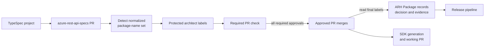
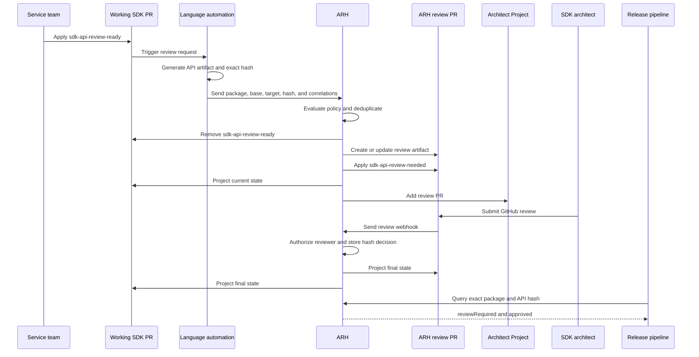
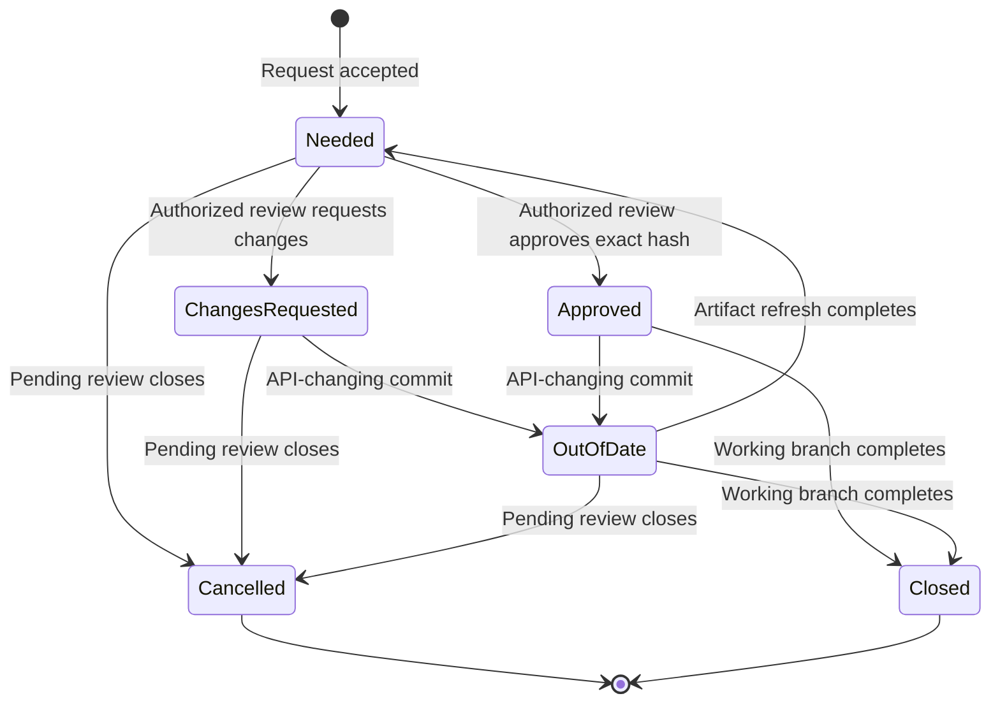
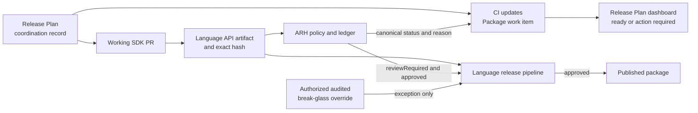
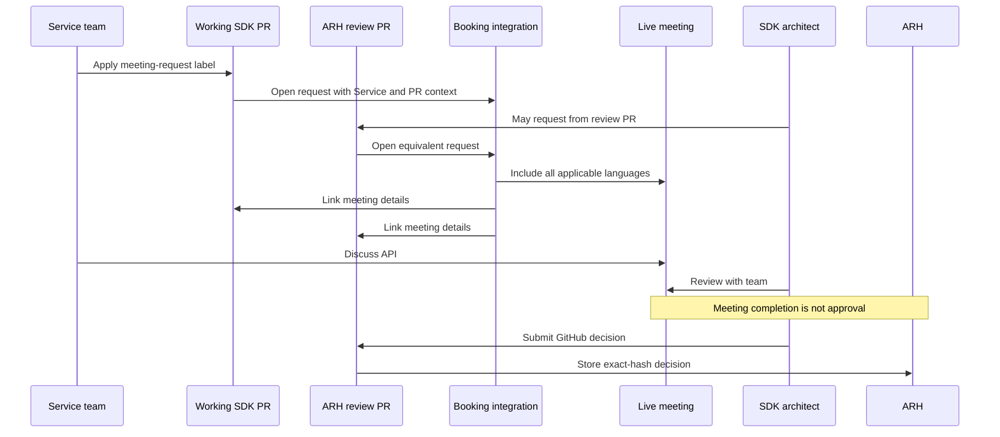

# Spec: Operations - Architect Review Workflow

> **Status:** Proposed architecture is settled for review. Remaining work is
> implementation, rollout configuration, or a lower-priority proof of concept.

## Review summary

Use API Review Hub (ARH) as the durable record for SDK API and package-name
approvals.

- Architects make decisions on GitHub pull requests.
- ARH stores the decisions and centrally evaluates review policy.
- The Architect Project is the actionable review queue.
- The Release Plan dashboard is informational guidance for service teams.
- Language release pipelines query ARH and enforce approval.
- SDK review issues and APIView retire through an explicit per-language cutover.

| Concept | Decision |
|---------|----------|
| SDK API approval | An authorized GitHub review on an ARH review PR approves an exact API hash for the applicable release policy. |
| Package-name approval | Protected labels on an `azure-rest-api-specs` PR remain the human approval mechanism; ARH records the merged result. |
| Review policy | ARH alone answers whether review is required and whether the package is approved. |
| Review initiation | `sdk-api-review-ready` on the working SDK PR is the normal trigger; agent and CLI paths support exceptions. |
| Release coordination | A Release Plan groups one coordinated release occurrence but is not an approval authority. |
| Release enforcement | Each language release pipeline queries live ARH status for the exact artifact hash. |
| Spec-less packages | Validate a metadata-registration contract, Release Plan entry, and dashboard treatment together as a P2 proof of concept. |
| Live meetings | Request a service-level meeting from the working or review PR; booking-product selection is an implementation choice. |

## Scope and principles

This proposal replaces the SDK Architecture Board's APIView and SDK review issue
flow. It does not replace:

- ARM or data-plane specification review;
- Breaking Change Board or Stewardship Board review;
- normal SDK code review; or
- the existing protected package-name approval action.

The design follows these principles:

1. **One policy evaluator:** ARH owns plane, language, release-type, inheritance,
   and package-specific review policy.
2. **GitHub remains the human approval surface:** Architects review SDK API
   artifacts and package names on the relevant PR.
3. **ARH is the ledger:** Labels, Project fields, work items, and dashboards are
   projections of ARH state or links to GitHub evidence.
4. **Release pipelines enforce approval:** Informational surfaces never authorize
   release.
5. **Approval follows durable identity:** SDK API approval follows an exact API
   hash. Package-name approval follows a normalized package-name set.
6. **Coordination is separate from approval:** A Release Plan correlates one
   release occurrence but does not define approval identity.
7. **ARH is source-agnostic:** The same SDK API review works for generated and
   manually written SDKs.

## System responsibilities

| Role or system | Responsibility |
|----------------|----------------|
| ARH | Create and update review PRs, authorize reviewers, store SDK API and package-name decisions, evaluate policy, and return canonical approval status. |
| Package-name workflow | Detect package-name changes, enforce protected approvals, and expose final merged evidence to ARH. |
| Language repository | Generate the SDK API artifact and exact hash, resolve baselines, and connect the working-PR trigger to ARH. |
| Architect Project | Present ARH review PRs as the actionable architect queue. |
| Release Plan workflow | Coordinate packages, languages, PRs, exclusions, approval summaries, and release progress. |
| Release Plan dashboard | Display work-item state and next-step guidance without initiating or approving work. |
| Language release pipeline | Query live ARH status for the exact artifact, block when approval is missing, and record publication. |
| Architecture governance | Configure reviewer authorization, initial beta policy, package exceptions, and language-exclusion governance. |
| Booking integration | Connect working and review PRs to the selected meeting-booking product. |
| ARH integration owner | Verify ARH readiness, status contracts, and release-gate behavior before each language cutoff. |
| APIView cutover owner | Coordinate per-language cutoffs and confirm that no release depends on APIView before final retirement. |

## 1. Spec-backed package-name approval

The existing [package-name review
process](https://github.com/Azure/azure-rest-api-specs/blob/main/.github/workflows/src/package-name-approval/PACKAGE-NAME-REVIEW-PROCESS.md)
continues to run on the spec PR.



### Approval and recording

1. The workflow reads new or changed package names from TypeSpec emitter
   configuration.
2. Architects apply the protected labels for the applicable languages.
3. A required check blocks the spec PR until all required approvals exist.
4. After merge, ARH reads the final labels and records per-language decisions.
5. ARH links the merged PR as immutable evidence.

ARH does not add a second package-name approval UI. Waiting for merge prevents
temporary label changes from becoming durable decisions.

Data-plane reviews use the applicable per-language protected labels.
Management-plane reviews may use `package-name-approved-all`; ARH expands that
aggregate label into the corresponding per-language ledger decisions.

### Reusable approval identity

A package-name approval set contains:

- a stable ARH Service or SDK-family identity;
- plane and package classification;
- the complete applicable language set;
- each language's exact registry coordinate; and
- a hash and revision of the normalized set.

Exact registry coordinates include NuGet package ID, Maven
`groupId:artifactId`, npm package name, and PyPI package name. Package version and
Release Plan ID are not part of package-name approval identity.

An ARH Package is identified by language and exact package name and may have a
Service or SDK-family parent. Creating a Package for SDK API review does not
implicitly approve its name.

### Reuse and reset

[Azure/azure-rest-api-specs#45677](https://github.com/Azure/azure-rest-api-specs/pull/45677)
defines the cross-language reapproval behavior.

| Change | Result |
|--------|--------|
| Normalized set is unchanged | Existing approval remains valid. |
| Existing configured coordinate changes | All applicable Tier 1 approvals reset for the complete visible set. |
| First coordinate is added for a previously unconfigured language | Only that language becomes pending. |
| Plane, classification, applicability, or grouping changes | A new revision is created and required decisions are recomputed. |
| No approval is known | Treat the package as new and pending. |

Earlier decisions remain immutable history but do not satisfy a changed set. The
current spec PR shows unchanged configured rows as `Pending (unchanged)` and
unconfigured rows as `Not yet configured`.

For a spec-backed service client, a Tier 1 language without emitter configuration
still reviews the visible cross-language naming direction. A Release Plan language
exclusion does not substitute for package-name approval.

### Review questions

**Q: Where does package-name approval happen?**

**A:** On the `azure-rest-api-specs` PR through the existing protected labels and
required check. ARH stores the result after merge.

**Q: Does SDK API approval also approve the package name?**

**A:** No. These are separate decisions with separate evidence.

**Q: What happens when one existing language coordinate changes?**

**A:** All applicable Tier 1 architects reconfirm the complete cross-language set.
Adding a first coordinate for a previously unconfigured language makes only that
language pending.

## 2. SDK API review

### End-to-end flow



### Initiation contract

The normal trigger is `sdk-api-review-ready` on the working SDK PR. It means the
SDK API is ready for architect review, not that the release is ready.

The agent or `azsdk api-review create` uses the same ARH operation for custom
baselines, optional beta reviews, and exceptional branches.

The request includes:

- language and exact package name;
- target branch and repository;
- a concrete base tag or ref when applicable;
- exact API artifact hash;
- optional working PR URL; and
- optional Release Plan ID.

The caller resolves a symbolic baseline such as "latest GA" to a concrete released
tag or ref. ARH records the concrete base on the review occurrence.

The release status operation never creates a review as a side effect. If review
was skipped before merge, the release pipeline blocks and directs the team to the
label, agent, or CLI.

### Review identity and lifecycle

One open review occurrence is identified by package, language, concrete base ref,
and target ref.

- Repeating the same open request returns the existing review.
- A target update refreshes the review only when the API artifact or diff changes.
- Non-API source changes do not invalidate approval.
- A closed occurrence is immutable and a later request creates a new occurrence.
- Working PR URL and Release Plan ID are correlation metadata, not identity.
- Review branches are synthetic and never merge SDK code.

Approval records include the exact API hash, release-policy context, authorized
reviewer, decision, time, and review PR. A beta approval does not silently satisfy
a required GA decision, even when the artifact hash is unchanged.

When the working branch merges or closes, ARH closes the completed review and
deletes its synthetic branches. Manually closing a pending review cancels the
occurrence and never counts as approval.

### Review labels

ARH owns exactly one SDK API state label on the working and review PRs.

| Label | Meaning |
|-------|---------|
| `sdk-api-review-ready` | Transient working-PR trigger; ARH removes it after accepting the request. |
| `sdk-api-review-needed` | Waiting for an authorized architect decision. |
| `sdk-api-review-changes-requested` | Waiting for service-team changes. |
| `sdk-api-review-approved` | Current exact API hash is approved for the applicable policy. |
| `sdk-api-review-out-of-date` | The API changed and review artifacts are refreshing. |

The created review must have `sdk-api-review-needed`; absence of a label is not a
state. The ARH-specific name avoids collision with the existing
`architecture-review-needed` Archie workflow and Python's `api-approved` label.



An API-changing commit removes `sdk-api-review-approved` immediately. After
refresh, the new hash cannot reuse the old approval and requires a new decision
when policy requires review or a review has been initiated. Manually applied state
labels are removed and replaced with guidance to the correct review operation.

### Reviewer authorization

ARH authorizes the GitHub reviewer before storing a decision. Configuration is
explicit by plane and language.

- SDK API authorization starts from
  `Azure/azure-sdk/.github/api-review-approvers.yml`.
- Package-name authorization remains in
  `Azure/azure-rest-api-specs/.github/protected-labels.yml`.
- Broader GitHub team membership does not imply authorization for every SDK
  language.

GitHub `APPROVED` and `CHANGES_REQUESTED` reviews are the architect actions. A
normal code-review approval on the working PR is not an SDK API approval.

### Release policy

ARH evaluates policy from package, language, plane, release type, version context,
and exact API hash.

| Release | Human review behavior | Default baseline |
|---------|-----------------------|------------------|
| First public beta | Configurable by plane and language during rollout | Full initial API |
| Later beta before GA | On demand by default; optionally `every-preview` | Latest published beta or explicit base |
| First GA after beta | Required | Latest approved beta, or full API if none exists |
| Later GA minor or major | Gate always; new review only when valid exact-hash approval cannot be reused | Latest published GA below target |
| Patch | Gate always; no new review when public API hash is unchanged | GA version being patched |
| Beta after GA | On demand by default | Latest published GA or explicit base |

Additional rules:

- Beta-to-GA requires review.
- Later beta defaults to `on-demand`.
- Architecture governance may configure `every-preview` or package exceptions.
- An explicit label, agent, or CLI request always permits optional review.
- A changed public API in a patch is a versioning exception and blocks.
- Missing, stale, unknown, or rejected hash status cannot pass the release gate.

Selecting initial first-public-beta values is rollout configuration, not an
architecture decision.

### Long-running review

Reviews are on demand by default. A long-running review is an architect-created
exception for selected services:

- it targets `main`;
- it uses a concrete released version as its base;
- it accumulates API changes and comments across beta releases;
- beta-to-beta comments may roll forward but must be resolved or moved to normal
  tracking before GA; and
- it remains open until explicitly closed.

If a service-team request matches an existing long-running review, ARH links the
working PR and Release Plan instead of creating a blank duplicate. The current
version-display defect in this flow must be fixed before broad use.

### Review questions

**Q: Who decides whether review is required?**

**A:** ARH. Pipelines and Release Plan tooling submit context and consume the
canonical result.

**Q: How is stale approval prevented?**

**A:** The release pipeline submits the exact API hash. A changed API produces a
new hash that cannot reuse the old approval. A new decision is required when ARH
policy requires review or a review has been initiated.

**Q: Can handwritten SDKs use this workflow?**

**A:** Yes. ARH needs package, language, branches, artifact, and hash. It does not
require TypeSpec.

## 3. Spec-less package P2 proof of concept

Spec-less package support is one lower-priority POC comprising:

1. a metadata-registration contract;
2. protected package-name approval;
3. package classification and language applicability;
4. Release Plan creation or reconciliation;
5. dashboard treatment; and
6. ARH package-name recording and release status.

The POC should demonstrate the complete contract to the
`azure-rest-api-specs` and Release Plan owners. Repository-owner acceptance is
required before product implementation. TypeSpec emitter metadata remains the
traditional path.

```mermaid
flowchart LR
    MANIFEST["Native package manifest"]
    REG["Proposed metadata-registration PR"]
    CLASS["Classification and<br/>applicable languages"]
    APPROVE["Existing protected<br/>package-name workflow"]
    MERGE["Approved registration merges"]
    ARH["ARH Package records"]
    PLAN["Spec-less Release Plan"]
    WPR["Working SDK PR"]
    REVIEW["ARH SDK API review"]
    SYNC["Package work-item sync"]
    DASH["Informational dashboard"]
    GATE["Release pipeline"]

    MANIFEST --> REG --> CLASS --> APPROVE --> MERGE
    MERGE --> ARH
    MERGE --> PLAN
    PLAN --> WPR --> REVIEW --> ARH
    ARH --> SYNC --> DASH
    ARH --> GATE
```



### Metadata-registration contract

The registration declares:

- readable review-group name;
- ARH Service or SDK-family identity;
- package classification and plane;
- complete intended language set;
- exact native registry coordinate for each applicable language; and
- native-manifest evidence.

| Classification | Applicability | Required package-name reviewers |
|----------------|---------------|---------------------------------|
| `service-client` | Cross-language Azure service SDK | Every applicable Tier 1 language |
| `language-extension` | Extension or utility for one language | Owning language |
| `multi-language-companion` | Companion package for a declared subset | Complete declared subset |

A language extension does not invent cross-language counterparts. A multi-language
companion cannot silently omit a language from its declared subset. Approved
metadata persists until classification, plane, grouping, intended languages, or
package coordinates change.

Example language extension:

```text
Review group: ASP.NET Core Key Vault Configuration Extension
ARH grouping: SDK family
Classification: language-extension
Packages:
  dotnet -> Azure.Extensions.AspNetCore.Configuration.Secrets
```

ARH remains spec-agnostic. Classification validation belongs to registration and
Release Plan workflows, not SDK API review.

### Release Plan and dashboard behavior

The POC creates a Release Plan without a fake TypeSpec path or API Spec work item.
Registration merge may create or reconcile the plan. A manual POC may instead
create the plan from package and release context and attach the SDK PRs.

For spec-less packages, the dashboard:

- omits the API Spec stage;
- does not treat a missing TypeSpec path as an error;
- shows the Service or SDK-family name;
- shows only applicable languages;
- displays classification only when it explains applicability; and
- presents a simple `ready` or `action required` result.

Detailed reasons and evidence remain available from the agent or status command.

### Review questions

**Q: Is this a second package-name approval process?**

**A:** No. The POC routes metadata-registration PRs through the same protected
workflow and records the merged result in ARH.

**Q: Do all spec-less packages require cross-language consensus?**

**A:** No. Applicability follows classification.

**Q: Is repository acceptance implied by this spec?**

**A:** No. The POC demonstrates the proposal before the repository and Release Plan
owners accept its implementation impact.

## 4. Release coordination and enforcement

### Release Plan identity and language state

A Release Plan represents one coordinated public SDK release occurrence. Its work
item ID identifies that occurrence. Product Service Tree ID or ARH Service
identifies the stable service across occurrences. A package without a service uses
an SDK-family ID.

API version, package versions, TypeSpec path, lifecycle type, and SDK PRs are
attributes, not Release Plan identity.

Each applicable language has one state:

- `required`;
- `exclusion requested`;
- `exclusion approved`; or
- `not applicable` by classification.

`MissingEmitterConfig` is a condition on a required language, not an exclusion.
Language exclusions are recorded with the governance role, reason, decision time,
affected language, and Release Plan occurrence.

The Release Plan coordinates cross-language completeness. An individual language
pipeline enforces approval for the package it publishes and does not wait for
other languages to publish.

### Status flow



CI queries ARH and writes the canonical status to the Azure DevOps Package work
item. The Release Plan dashboard reads the work item. It does not call ARH
directly or reproduce policy.

The dashboard may show package, language, PR links, readiness summary, language
applicability or exclusion, release status, and next action. It does not apply
labels, create reviews, approve decisions, or satisfy a release gate.

### Release pipeline contract

[Azure/azure-sdk-tools#16660](https://github.com/Azure/azure-sdk-tools/pull/16660)
provides the shared release-check primitives.

Each language pipeline:

1. generates the release candidate artifact and exact API hash;
2. calls `azsdk package get-approval-status`;
3. submits language, package name, package version, and API hash;
4. consumes ARH's `reviewRequired`, `approved`, reason, evidence, and inheritance
   result;
5. fails when approval is missing, stale, rejected, or unavailable;
6. permits only the authorized and audited `Skip.CheckPackageApproval` emergency
   override; and
7. calls `azsdk package mark-released` after publication.

Pipelines do not encode separate data-plane, management-plane, language, beta, GA,
patch, or package-specific policies.

During migration, every package or repository has one explicit approval provider.
APIView fallback is allowed only when ownership says the package has not moved to
ARH. An ARH rejection, stale artifact, or query error never falls through to
APIView. After APIView retirement, ARH fails closed unless the audited override is
used.

### Review questions

**Q: Can the dashboard report ready without authorizing release?**

**A:** Yes. It displays synchronized guidance. The pipeline queries live ARH
status and enforces the result.

**Q: What happens when a Package work item disagrees with ARH?**

**A:** ARH remains authoritative. CI reconciles the work item.

**Q: May a pipeline infer that review is unnecessary from plane or release type?**

**A:** No. It submits context to ARH and consumes the canonical policy result.

## 5. Architect experience

### Project queue and grouping

The [ARH Project](https://github.com/orgs/Azure/projects/1018/views/4) is the
cross-repository architect queue. ARH automatically adds each created review PR.

| Surface | Audience | Purpose |
|---------|----------|---------|
| ARH Project | SDK architects | Find, filter, and open actionable review PRs. |
| Release Plan dashboard | Service teams and release coordinators | View release progress and next-step guidance. |

Neither surface is an approval record.

The review PR title contains the unique Service or SDK-family name and package:

```text
[API Review] Azure Machine Learning | azure-ai-ml 1.35.0 (base 1.34.1)
```

Title text and state labels provide basic cross-language filtering without one
protected label per Service. Optional managed fields may include Service, Package,
Language, Target, Baseline, and Release Plan. Architects do not need to open Azure
DevOps work items to review an API.

### Live meeting request



The interaction contract is settled:

- the service team can request from the working PR;
- an architect can request from the review PR;
- one service-level meeting includes all applicable language reviews;
- the booking system owns scheduling and Teams details;
- meeting details link back to both PR contexts;
- no SDK review issue is created; and
- the final decision is always recorded on the review PR.

Selecting the durable booking product and integration owner is implementation work
required before SDK review issue cutover.

## 6. Migration and cutover

### APIView

Migration uses explicit approval ownership by package or repository.

Before language cutover:

- APIView remains the release approval provider.
- ARH may run in shadow mode for comparison.
- ARH rejection or failure does not trigger broad APIView fallback.

The ARH integration owner verifies service readiness and status behavior for each
scope. The APIView cutover owner controls the language or package ownership change
and final retirement.

At cutover:

- the ownership map changes to ARH;
- the language pipeline submits the exact API hash;
- ARH becomes the only normal approval provider; and
- APIView is no longer consulted for that scope.

APIView retires after all required languages and package classes move, pipeline
gates are verified, package-name evidence is backfilled, and no release depends on
APIView.

### SDK review issues

| Legacy issue purpose | Replacement |
|----------------------|-------------|
| Start review | `sdk-api-review-ready`, agent, or CLI |
| Collect review links | ARH correlations on working and review PRs |
| Group languages | ARH Service or SDK family |
| Assign architects | ARH authorization configuration |
| Display status | ARH labels and Architect Project |
| Preserve discussion | ARH review PR |
| Request meeting | Working or review PR booking integration |
| Enforce approval | Language release pipeline querying ARH |

A language stops creating SDK review issues only when:

1. ARH creates and refreshes its review artifact.
2. Reviewer authorization and labels are configured.
3. Its release pipeline enforces ARH status.
4. Package-name status is available from ARH.
5. Review PRs enter the Architect Project automatically.
6. The booking integration accepts working and review PR context.

Reviews already scheduled before cutoff finish in the old process. Historical
issues remain read-only. New reviews use ARH after cutoff.

## Implementation follow-up

These items do not reopen the architecture.

### P0: Approval authority and safe cutover

- Implement ARH's canonical review-policy and combined approval contract.
- Require exact API hash for release-gate success.
- Implement working-PR initiation, review deduplication, artifact refresh, labels,
  reviewer authorization, and lifecycle.
- Record spec-backed package-name decisions after spec PR merge.
- Backfill package-name evidence from APIView.
- Deploy shared ARH release checks with explicit provider ownership.
- Select and integrate the booking product required for issue cutover.
- Execute the per-language APIView and SDK review issue checklist.

### P1: Complete architect and service-team experience

- Add review PRs to the Architect Project automatically.
- Synchronize ARH status to Package work items.
- Show concise readiness and next-action guidance in the Release Plan dashboard.
- Support spec-change and no-spec-change Release Plan entries.
- Implement language applicability and exclusion states.
- Support exceptional long-running reviews and fix version display.
- Reconcile stale labels, Project fields, and Package work-item status.

### P2: Spec-less package proof of concept

- Demonstrate the metadata-registration schema and native coordinates.
- Exercise classification and language applicability.
- Route approval through the protected package-name workflow.
- Record merged evidence in ARH.
- Create or reconcile a Release Plan without TypeSpec or an API Spec work item.
- Demonstrate Package work-item and dashboard behavior.
- Present the full contract to repository and Release Plan owners.
- Begin product implementation only after acceptance.

## Validation and success criteria

The implementation must validate:

- policy behavior for first beta configuration, later beta, beta-to-GA, GA,
  patch, post-GA beta, and package exceptions;
- exact-hash matching, mismatch, and stale states;
- reviewer authorization and every label transition;
- review deduplication, cancellation, recreation, and long-running matching;
- package-name initial approval, reuse, resets, new-language behavior, and
  immutable history;
- working-PR, review-PR, Project, and Package work-item reconciliation;
- release-gate approved, rejected, unavailable, and override paths; and
- per-language APIView shadow comparison before cutover.

The target is complete when:

- ARH returns canonical `reviewRequired` and `approved` results;
- no caller duplicates ARH policy;
- every required decision has exact identity and immutable evidence;
- every supported language pipeline enforces live ARH status;
- architects have one actionable Project queue;
- service teams have concise Release Plan guidance;
- meeting requests no longer require SDK review issues; and
- APIView and new SDK review issue creation can retire without losing approval,
  history, grouping, or meeting coverage.

## Key references

- [ARH Project view](https://github.com/orgs/Azure/projects/1018/views/4)
- [Package-name review process](https://github.com/Azure/azure-rest-api-specs/blob/main/.github/workflows/src/package-name-approval/PACKAGE-NAME-REVIEW-PROCESS.md)
- [Protected package-name labels](https://github.com/Azure/azure-rest-api-specs/blob/main/.github/protected-labels.yml)
- [Package-name reset behavior](https://github.com/Azure/azure-rest-api-specs/pull/45677)
- [Shared package approval commands](https://github.com/Azure/azure-sdk-tools/pull/16660)
- [Example ARH review PR](https://github.com/Azure/azure-sdk-for-python/pull/48821)
