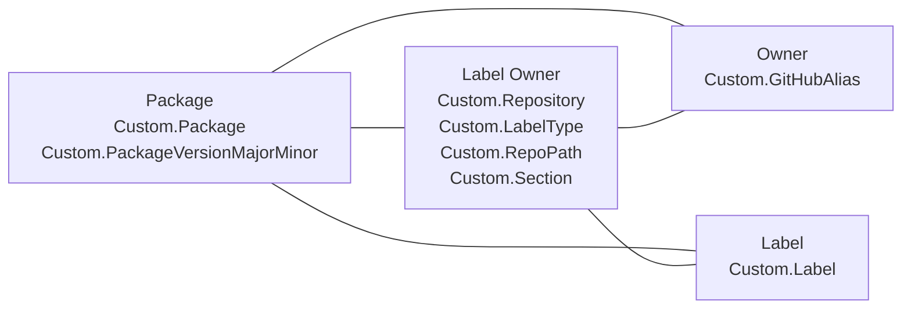
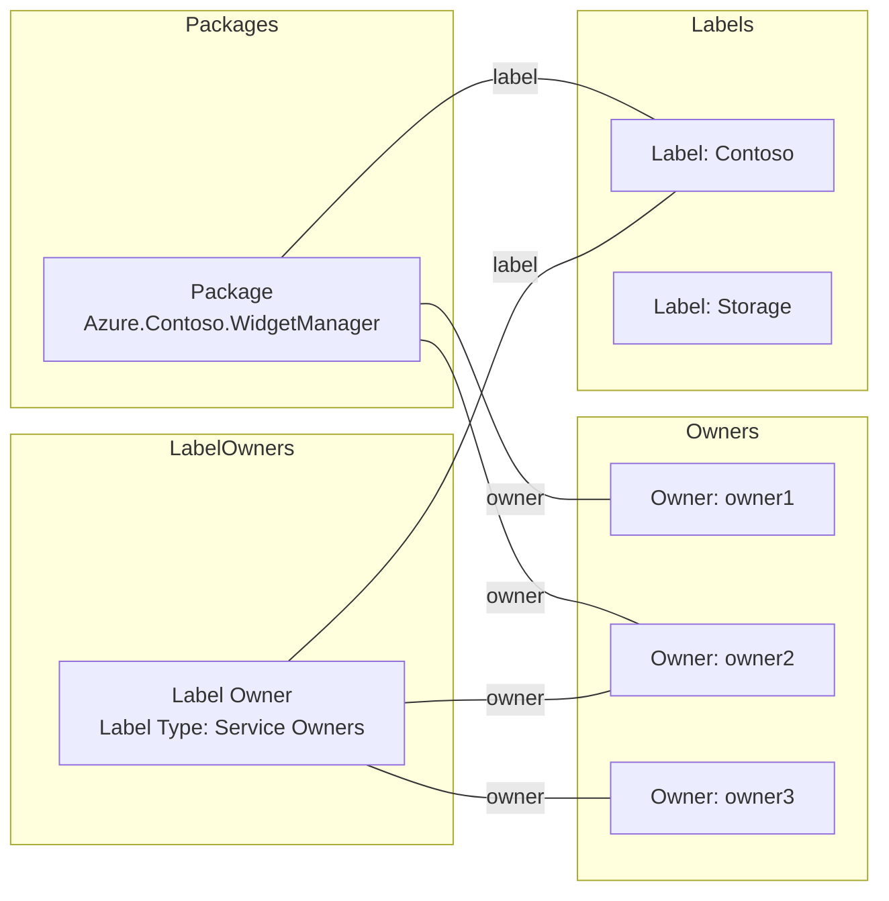

# Spec: 8-Operations - Codeowners Management and GitHub Label Sync

## Table of Contents

- [Overview](#overview)
- [Definitions](#definitions)
- [Background / Problem Statement](#background--problem-statement)
- [Goals and Exceptions/Limitations](#goals-and-exceptionslimitations)
- [Design Proposal](#design-proposal)
- [Open Questions](#open-questions)
- [Success Criteria](#success-criteria)
- [Agent Prompts](#agent-prompts)
- [CLI Commands](#cli-commands)
- [Implementation Plan](#implementation-plan)
- [Testing Strategy](#testing-strategy)
- [Metrics/Telemetry](#metricstelemetry)
- [Documentation Updates](#documentation-updates)

---

## Overview

This spec defines CODEOWNERS-related tooling behavior in `azsdk-cli`.

Scope in this spec:

- `config codeowners` command group and MCP tools implemented in `CodeownersTool`
- `config github-label` command group and MCP tools implemented in `GitHubLabelsTool`
- Helper and service dependencies used by those tools
- Azure DevOps work item data model required by this design

---

## Definitions

- **CODEOWNERS entry**: A parsed ownership record (path expression, owners, labels, and metadata) represented by `CodeownersEntry`.
- **Pathless entry**: A CODEOWNERS entry with empty path expression, used for service-level ownership metadata grouping. Pathless entries do not have any effect on GitHub's interpretation of a CODEOWNERS file.
- **Service-level path entry**: A CODEOWNERS entry created from `Label Owner` records that have `Custom.RepoPath`.
- **Owner work item**: Azure DevOps work item of type `Owner`, keyed by `Custom.GitHubAlias`.
- **Label work item**: Azure DevOps work item of type `Label`, keyed by `Custom.Label`.
- **Label Owner work item**: Azure DevOps work item of type `Label Owner`, carrying repository/path/role metadata and related owner/label links.
- **Repository filter**: Optional repo input that narrows package and label-owner results in view and modify operations.

---

## Background / Problem Statement

CODEOWNERS files describe ownership and responsibilities for code in Azure SDK repositories. Those files represent owners across team and organization boundaries which may become invalid over time. To prevent confusion and keep an accurate record of ownership, package and service ownership data should be tracked in a durable system, and ownership updates should be easier and part of the release process.

### Current State

Main user personas:

- SDK contributor: owns code in SDK repositories and is responsible for maintenance.
- SDK triage: routes issues to appropriate owners; accurate owners reduce routing delays.

Current workflow: ownership information is manually maintained, and triage automation routes issues using deterministic rules.

Specific friction points this spec resolves:

- Simplify ownership updates from the perspective of SDK contributors.
- Reduce triage friction by keeping ownership data up to date in the right locations, including CODEOWNERS for PR review.

### Why This Matters

Ensure accurate information goes into CODEOWNERS and triage automation has reliable ownership data for issue routing.

---

## Goals and Exceptions/Limitations

### Goals

- [ ] Import existing data into Azure DevOps work items and use that as the source of truth.
- [ ] Enable service teams to use `azsdk` tools to update ownership information.
- [ ] Require a minimum set of valid codeowners.
- [ ] Automate CODEOWNERS validation.
- [ ] Automate email notifications for invalid owners.
- [ ] Prevent PRs from being merged or packages from being released when CODEOWNERS are invalid.
- [ ] Migrate the triage system to use the new ownership source of truth.

### Exceptions and Limitations

- The codeowners management flow does not model or require explicit `Service`/`Product` links for label-owner operations.
- `RemoveOwnersFromLabelsAndPath` expects exactly one matching `Label Owner` record for `(repo, path, section, ownerType, label set)` and uses `Single(...)`; duplicate candidates can throw.
- Team owner validation supports only aliases in `Azure/<team>` format and requires the team to descend from `azure-sdk-write`.
- `check-package` validates rendered CODEOWNERS content from a cache file rather than querying live Azure DevOps work items.
- `check-package` expects `CodeownersEntry` values produced by `CodeownersParser`; unresolved team aliases left behind when parser team expansion fails do not count toward owner minimums.
- The repo-derived validation cache currently reflects the exported `Client Libraries` section uploaded by pipeline, so packages outside the exported sections are out of scope for that cache.
- `GitHubLableWorkItem` type name contains a legacy spelling (`Lable`) in code and responses.

---

## Design Proposal

### Design Overview

Two command groups are documented:

- `config codeowners`: view, generate, export-section, check-package, add/remove package owners, add/remove package labels, add/remove label owners on optional path scope.
- `config github-label`: check/create service labels in GitHub CSV and sync service labels to Azure DevOps `Label` work items.

### Command and Tool Surface

`CodeownersTool` commands:

- `generate` (no MCP)
- `view`
- `add-package-owner`
- `add-package-label`
- `add-label-owner`
- `remove-package-owner`
- `remove-package-label`
- `remove-label-owner`
- `export-section` (no MCP)
- `check-package`

`CodeownersTool` MCP tools:

- `azsdk_engsys_codeowner_view`
- `azsdk_engsys_codeowner_add_package_owner`
- `azsdk_engsys_codeowner_add_package_label`
- `azsdk_engsys_codeowner_add_label_owner`
- `azsdk_engsys_codeowner_remove_package_owner`
- `azsdk_engsys_codeowner_remove_package_label`
- `azsdk_engsys_codeowner_remove_label_owner`
- `azsdk_engsys_codeowner_check_package`

`GitHubLabelsTool` commands:

- `check`
- `create`
- `sync-ado` (no MCP)

`GitHubLabelsTool` MCP tools:

- `azsdk_check_service_label`
- `azsdk_create_service_label`

### Cache-backed Package Validation

`check-package` validates rendered CODEOWNERS ownership by reading a cache file instead of querying live Azure DevOps work items. This enables validation and unblocking in both PR and Release scenarios without requiring changes to the underlying repo.

Inputs:

- `--directory-path` (required): relative path from repo root to the package directory.
- `--repo` (optional): `owner/repo` repository identity. If omitted, the command resolves the current git repo.
- `--codeowners-cache` (optional): local filesystem path to a CODEOWNERS cache file. When specified, it overrides repo-derived cache lookup.

Cache resolution:

- If `--codeowners-cache` is provided, validation reads that local file directly. This is mostly useful for testing.
- Otherwise, validation resolves the repo and reads:
  `https://azuresdkartifacts.blob.core.windows.net/azure-sdk-write-teams/cache/<owner-lower>/<repo>/CODEOWNERS.cache`

Pipeline requirements for producing the cache:

1. Render `.github/CODEOWNERS`.
2. Export the named section(s) required for validation using `config codeowners export-section`.
3. Upload the exported content to `azure-sdk-write-teams/cache/<owner-lower>/<repo>/CODEOWNERS.cache`.

Current pipeline usage exports the `Client Libraries` section and uploads it as `cache/azure/<repo>/CODEOWNERS.cache`.

Validation rules:

1. Parse the cache using `CodeownersParser.ParseCodeownersFile`; validation logic expects parser-produced `CodeownersEntry` instances.
2. Find the matching path entry using GitHub-style precedence (the last matching path entry wins). Try both the raw package path and a trailing-slash form.
3. Require at least 2 unique individual source owners. Unresolved GitHub team aliases left behind when parser team expansion fails do not count.
4. Require at least 1 PR label on the matched path entry.
5. Find the matching service-owner entry by scanning service-label entries from the end of the parsed file. Ignore `Service Attention` for label comparison, and require the matched service-label set to be fully contained within the package PR labels.
6. Require at least 2 unique individual service owners on that service-owner entry. Unresolved team aliases do not count.

### Data Model

#### Work Item Types

| Work Item Type | Required/Queried Fields | Notes |
|----------------|-------------------------|-------|
| `Package` | `Custom.Package`, `Custom.PackageVersionMajorMinor`, `Custom.Language`, `Custom.PackageType`, `Custom.PackageDisplayName`, `Custom.GroupId`, `Custom.PackageRepoPath` | Package queries can be constrained by language derived from repo. Latest package version is selected per package name. |
| `Owner` | `Custom.GitHubAlias` | Alias is normalized (`trim`, remove `@`) before lookup for both groups and individual users. |
| `Label` | `Custom.Label` | Used both for package label links and service label sync. Kept up to date with common-labels.csv using `github-label sync-ado` |
| `Label Owner` | `Custom.LabelType`, `Custom.Repository`, `Custom.RepoPath`, `Custom.Section` | Related links carry owner and label associations. |

#### Relation Types

| Relation Type | Usage |
|---------------|-------|
| `System.LinkTypes.Related` | Relation type for codeowners mapping/hydration (`ExtractRelatedIds`) and add/remove operations (`CreateWorkItemRelationAsync(..., "related", ...)`). |

Hierarchy links are not used by codeowners management/generation logic.

#### Entity Relationship Diagram



#### Example Relationship Diagram



#### Example CODEOWNERS Output

> [!NOTE]
> The example rendered CODEOWNERS is a snapshot in time. The only relevant syntax to GitHub's view of CODEOWNERS is the un-commented line. The commented lines are handled by parser tooling in the azure-sdk-tools repo.

```text
# PRLabel: %Contoso
/sdk/contoso/Azure.Contoso.WidgetManager/    @owner1 @owner2

# ServiceLabel: %Contoso
# ServiceOwners: @owner2 @owner3
```

In this example, `Storage` exists as a label entity but is not attached to the package or label-owner entry, so it does not appear in the CODEOWNERS lines above.

#### Identity and Matching Rules

| Entity/Operation | Matching Rule |
|------------------|---------------|
| Owner lookup | `Custom.GitHubAlias == normalizedAlias` |
| Label lookup | `Custom.Label == label` |
| Package lookup | `Custom.Package == packageName` (+ optional language filter), then latest by `Custom.PackageVersionMajorMinor` |
| Label Owner find/create | Filter by `Custom.Repository + Custom.LabelType + Custom.RepoPath + Custom.Section`, then choose candidate whose linked label ID set exactly equals requested label ID set; otherwise create new |

#### OwnerType Mapping

`OwnerType` enum values map to `Custom.LabelType` string values as follows:

| Enum | Stored String |
|------|---------------|
| `ServiceOwner` | `Service Owner` |
| `AzSdkOwner` | `Azure SDK Owner` |
| `PrLabel` | `PR Label` |

#### Generated CODEOWNERS Projection Rules

- Package entries are generated from selecting the latest `Package` work item by version and hydrated related owners/labels/label-owners.
- Service-level path entries are generated from unlinked `Label Owner` records with non-empty `RepoPath`.
- Pathless metadata entries are grouped by service-label set from unlinked `Label Owner` records with empty `RepoPath`.
- Validation cache artifacts can be produced by exporting named sections from rendered CODEOWNERS. The current pipeline exports `Client Libraries` and uploads the result to `azure-sdk-write-teams/cache/<owner-lower>/<repo>/CODEOWNERS.cache`.
- Original owner collections are preserved in generated `CodeownersEntry` via:
  - `OriginalSourceOwners`
  - `OriginalServiceOwners`
  - `OriginalAzureSdkOwners`
- Entries are sorted by:
  - Entries with paths and without paths
  - Primary label (labels are sorted alphabetically)
  - Path

Sorting has the effect of grouping similar service-level entries together with package entries sorting later than service-level entries. (e.g. `/sdk/contoso` comes before `/sdk/contoso/widget-manager`)

Sorting is implemented in `CodeownersEntrySorter.cs`.

#### GitHub Service Label Sync Model

- Service labels are read from `eng/common/docs/common-labels.csv` in `Azure/azure-sdk-tools`.
- Service labels are detected by color code `e99695`.
- Sync target: Azure DevOps `Label` work item with `Custom.Label`.
- Sync reports:
  - duplicate CSV labels
  - duplicate ADO label work items
  - orphaned ADO labels not present in CSV

### High-Level Flow

```text
CodeownersTool
  -> resolves repo and arguments
  -> delegates view/add/remove/generate/export logic to helpers
  -> for check-package, resolves cache source (local file or blob URL)
  -> parses CODEOWNERS cache with CodeownersParser
  -> validates package ownership via ICheckPackageHelper
  -> helpers query/update Azure DevOps via IDevOpsService
  -> helpers query/validate GitHub identities or teams via IGitHubService

GitHubLabelsTool
  -> reads common-labels.csv from GitHub
  -> checks/creates service label PRs OR syncs labels to ADO Label work items
```

### Cross-Language Considerations

| Language | Approach | Notes |
|----------|----------|-------|
| .NET | Same ownership data model and command surface. | Ownership rendering should stay consistent across languages. |
| Java | Same ownership data model and command surface. | Package identity handling includes Java Group ID support. |
| JavaScript | Same ownership data model and command surface. | Ownership rendering should stay consistent across languages. |
| Python | Same ownership data model and command surface. | Ownership rendering should stay consistent across languages. |
| Go | Same ownership data model and command surface. | Ownership rendering should stay consistent across languages. |

---

## Open Questions

- [ ] **Management Plane owner handling and release**: How should management fallback ownership be sorted and enforced when label-based sorting can place `%Mgmt` entries in the middle of the Management Libraries section?
  - Context: Management plane packages should sort after client packages so client ownership applies broadly and management ownership applies narrowly. Current sorting includes label-based ordering, which can move `/%**/*Management*/` fallback entries away from the intended top of the management section.
  - Options:
    - Keep label-based sorting as-is and introduce an explicit management fallback priority rule.
    - Add section-aware sort precedence so fallback entries are always first within Management Libraries.
    - Introduce a dedicated fallback metadata marker and update renderer/sorter to respect it.

```codeowners
####################
# Client Libraries
####################

# Top level owner for a service (management libraries are overridden down below)

# PRLabel: %AI Model Inference %AI Projects
/sdk/ai/    @dargilco @glharper @nick863 @trangevi @trrwilson

# Client package-specific owner

# PRLabel: %AI Model Inference
/sdk/ai/Azure.AI.Inference/    @dargilco @glharper @trangevi
...

####################
# Management Libraries
####################

# Fallback owners first, but after owners in Client Libraries

# PRLabel: %Mgmt
/**/*Management*/    @ArcturusZhang @ArthurMa1978


# Then package-specific owners

# PRLabel: %API Center %Mgmt
/sdk/apicenter/Azure.ResourceManager.ApiCenter/    @ArcturusZhang @ArthurMa1978
...
```

---

## Success Criteria

This feature/tool is complete when:

- [ ] Service teams can use AzSDK Tools MCP to update CODEOWNERS-backed ownership data ([Issue #12917](https://github.com/Azure/azure-sdk-tools/issues/12917)).
- [ ] The CODEOWNERS file is editable by tooling and protected against manual drift.
- [ ] CODEOWNERS file sections are generated from the data model.
- [ ] PRs and releases are blocked for packages that do not have owner information.

---

## Agent Prompts

### View codeowners by package

**Prompt:**

```text
Show me CODEOWNERS associations for package azure-ai-vision-imageanalysis in Azure/azure-sdk-for-net.
```

**Expected Agent Activity:**

1. Call `azsdk_engsys_codeowner_view` with `package` and optional `repo`.
2. Return package owners/labels and related label-owner groupings.

### Add package owners

**Prompt:**

```text
Add @alice and Azure/my-team as source owners for package azure-ai-foo in Azure/azure-sdk-for-python.
```

**Expected Agent Activity:**

1. Resolve/validate owner aliases.
2. Create owner work items if missing (with validation rules).
3. Link owners to package via related relations.
4. Return updated view.

### Add path-scoped label owners

**Prompt:**

```text
Add @alice as a PR Label owner for labels service-attention and needs-team-attention on path sdk/contoso/ in Azure/azure-sdk-for-net section Client Libraries.
```

**Expected Agent Activity:**

1. Resolve owner and label work items.
2. Find or create matching `Label Owner` work item by repo/path/section/label type + label set.
3. Link owner/labels.
4. Return updated view by path.

### Check package ownership from CODEOWNERS cache

**Prompt:**

```text
Check whether sdk/storage/Azure.Storage.Blobs has enough CODEOWNERS coverage to unblock release.
```

**Expected Agent Activity:**

1. Resolve the repo or use an explicitly provided repo.
2. Read the repo-derived `CODEOWNERS.cache` since another cache location is not supplied in the prompt.
3. Call `azsdk_engsys_codeowner_check_package` with `directoryPath` and optional `repo` / `codeownersCachePath`.
4. Return the matched owners, PR labels, and service owners, or the validation failure reason.

### Check service label

**Prompt:**

```text
Check whether the service label azure-openai exists.
```

**Expected Agent Activity:**

1. Read common-labels CSV from GitHub.
2. Check for existing service label by color code.
3. Check open PRs for in-review state.
4. Return status (`Exists`, `DoesNotExist`, `NotAServiceLabel`, or `InReview`).

---

## CLI Commands

Command details are documented in a template-compatible format for representative operations below. The remaining command examples in this section follow the same shape.

### Check service label

**Command:**

```bash
azsdk config github-label check azure-openai
```

**Options:**

- `<label-name>`: Service label name to check in the common-labels source.

**Expected Output:**

```text
Exists | DoesNotExist | NotAServiceLabel | InReview
```

**Error Cases:**

```text
Error: Unable to read service label source or query open PR state.
```

### Add package owner(s)

**Command:**

```bash
azsdk config codeowners add-package-owner --github-user alice --github-user Azure/my-team --package azure-ai-foo --repo Azure/azure-sdk-for-python
```

**Options:**

- `--github-user <alias>`: GitHub user or team alias; repeatable.
- `--package <package-name>`: Target package name.
- `--repo <owner/name>`: Optional repository filter.

**Expected Output:**

```text
Owners linked to package successfully.
Updated ownership view returned.
```

**Error Cases:**

```text
Error: One or more owner aliases are invalid or do not satisfy validation requirements.
```

### View by package

```bash
azsdk config codeowners view --package azure-ai-foo --repo Azure/azure-sdk-for-python
```

### View by label(s)

```bash
azsdk config codeowners view --label service-attention --label needs-team-attention --repo Azure/azure-sdk-for-net
```

### Add package owner(s)

```bash
azsdk config codeowners add-package-owner --github-user alice --github-user Azure/my-team --package azure-ai-foo --repo Azure/azure-sdk-for-python
```

### Add package label(s)

```bash
azsdk config codeowners add-package-label --label service-attention --package azure-ai-foo --repo Azure/azure-sdk-for-net
```

### Add label owner(s) on path

```bash
azsdk config codeowners add-label-owner --github-user alice --label service-attention --owner-type pr-label --path sdk/contoso/ --section "Client Libraries" --repo Azure/azure-sdk-for-net
```

### Remove package owner(s)

```bash
azsdk config codeowners remove-package-owner --github-user alice --package azure-ai-foo --repo Azure/azure-sdk-for-python
```

### Remove package label(s)

```bash
azsdk config codeowners remove-package-label --label service-attention --package azure-ai-foo --repo Azure/azure-sdk-for-net
```

### Remove label owner(s) on path

```bash
azsdk config codeowners remove-label-owner --github-user alice --label service-attention --owner-type pr-label --path sdk/contoso/ --section "Client Libraries" --repo Azure/azure-sdk-for-net
```

### Export CODEOWNERS section(s)

```bash
azsdk config codeowners export-section --codeowners-path .github/CODEOWNERS --section "Client Libraries" --output-file out/CODEOWNERS.client
```

### Check package ownership from CODEOWNERS cache

**Command:**

```bash
azsdk config codeowners check-package --directory-path sdk/storage/Azure.Storage.Blobs --repo Azure/azure-sdk-for-net
```

**Options:**

- `--directory-path <relative-path>`: Relative path from repo root to the package directory.
- `--repo <owner/name>`: Optional repository identity. If omitted, the current git repo is used to derive the cache URL.
- `--codeowners-cache <path>`: Optional local cache file path. Overrides repo-derived cache lookup.

**Expected Output:**

```text
Path: sdk/storage/Azure.Storage.Blobs
Owners: owner1, owner2
PR Labels: Storage
Service Labels: Storage
Service Owners: owner3, owner4
```

**Error Cases:**

```text
Error: CODEOWNERS cache file not found: <path>
Error: Invalid repo format '<repo>'. Expected '<owner>/<repo>'.
Error: check-package failed: <validation failure>
```

### Check/create service label

```bash
azsdk config github-label check azure-openai
azsdk config github-label create azure-openai --link https://learn.microsoft.com/azure/ai-services/openai/
```

### Sync service labels to ADO label work items

```bash
azsdk config github-label sync-ado --dry-run
azsdk config github-label sync-ado
```

---

## Implementation Plan

### Phase 1: Data Model

- Milestone: Create DevOps work items as the source of truth, normalize existing CODEOWNERS data, and render CODEOWNERS from the data model.
- Timeline: TBD
- Dependencies: Azure DevOps work item schema readiness and migration scripts.

### Phase 2: Render and Enforce

- Milestone: Onboard repositories for rendering, build MCP/CLI tools for data updates, block manual CODEOWNERS edits, update docs/agent skills, and block releases for packages without owner information.
- Timeline: TBD
- Dependencies: Phase 1 completion and repository onboarding agreements.

### Phase 3: Validation and Notification

- Milestone: Validate data model entries and eject invalid entries, populate internal contact information, ingest service owner data from Dataverse, and send notifications for packages missing owner data.
- Timeline: TBD
- Dependencies: Dataverse integration and notification channel definitions.

### Phase 4: Data Model Migration

- Milestone: Migrate dependent tooling (for example Event Processor) to the work item data model and remove metadata comments from CODEOWNERS while keeping label-owner data publicly accessible.
- Timeline: TBD
- Dependencies: Phase 2 and Phase 3 stabilization.


### Code Dependency Summary

The following dependency map defines the required dependencies across `CodeownersTool`, `GitHubLabelsTool`, and their helper/service layers.

| Dependency | Type | Used By | Purpose |
|------------|------|---------|---------|
| `System.CommandLine` | External library | `CodeownersTool`, `GitHubLabelsTool` | Command and option/argument definitions for CLI subcommands. |
| `ModelContextProtocol.Server` | External library | `CodeownersTool`, `GitHubLabelsTool` | MCP tool registration via `[McpServerToolType]` and `[McpServerTool]`. |
| `Octokit` | External library | `GitHubService`, `CodeownersValidatorHelper` | GitHub API operations (users, org membership, teams, PR search/create, repo content). |
| Azure DevOps client SDK (`Microsoft.TeamFoundation.*`, `Microsoft.VisualStudio.Services.*`) | External library | `DevOpsService`, `CodeownersManagementHelper`, `CodeownersGenerateHelper`, `GitHubLabelsTool` | WIQL queries, work item create/update, and relation management in Azure DevOps. |
| `Azure.Sdk.Tools.CodeownersUtils` (`Parsing`, `Utils`, `Caches`) | Internal project dependency | `CodeownersTool`, `CodeownersGenerateHelper`, `CodeownersManagementHelper` | CODEOWNERS section parsing, entry sorting/formatting, and team membership cache support. |
| `IGitHubService` / `GitHubService` | Internal service | Both tool groups + validators/helpers | Wrapper over GitHub auth/API calls. |
| `IDevOpsService` / `DevOpsService` | Internal service | Both tool groups + management/generation helpers | Wrapper over Azure DevOps work item and relation operations. |
| `ICodeownersManagementHelper` | Internal helper | `CodeownersTool` | View/add/remove behavior for package owners, package labels, and label-owner path records. |
| `ICodeownersGenerateHelper` | Internal helper | `CodeownersTool` | Generates CODEOWNERS section content from Azure DevOps + repo package metadata. |
| `ICheckPackageHelper` | Internal helper | `CodeownersTool` | Validates a package path against parser-produced CODEOWNERS cache entries. |
| `ICodeownersValidatorHelper` | Internal helper | `CodeownersTool` | Validates individual GitHub users as Azure SDK code owners before owner WI creation. |
| `IGitHelper` | Internal helper | `CodeownersTool` | Repo root/repo full name discovery. |
| `IPowershellHelper` | Internal helper | `CodeownersGenerateHelper` | Runs `eng/common/scripts/common.ps1` to resolve package metadata in repo. |
| `ITeamUserCache` | Internal cache | `CodeownersManagementHelper` | Team alias validation and team-member expansion for views. |
| `LabelHelper` | Internal utility | `GitHubLabelsTool` | Service-label CSV parsing, normalization, duplicate detection, and insertion. |


---

## Testing Strategy

- Unit tests for data model rendering, updating, and validation.
- Unit tests for command behavior and helper interactions in:
  - `Azure.Sdk.Tools.Cli.Tests/Tools/Config/CodeownersToolsTests.cs`
  - `Azure.Sdk.Tools.Cli.Tests/Helpers/CodeownersManagementHelperTests.cs`
- Data-model-sensitive coverage should include:
  - owner/label/package lookup semantics
  - label-owner find/create uniqueness rules
  - add/remove relation behavior
  - service label sync duplicate/orphan detection

Constraints and risks:

- It is difficult to accurately emulate Azure DevOps Work Item APIs outside Azure DevOps.
- Functional tests against a test Azure DevOps instance can be unstable, especially when executed in parallel.

---

## Metrics/Telemetry

No special metrics collection at this time. The design continues to rely on structured logging (`ILogger`) for operational diagnostics.

### Privacy Considerations

Owner data is not private information; it is already present in plain text in Azure SDK repositories, and write access metadata is publicly accessible via GitHub APIs. API calls require authentication, and credential handling remains encapsulated in helper methods rather than this spec's feature logic.

---

## Documentation Updates

Documentation updated:

- [Agent Skills](https://github.com/Azure/azure-sdk-for-net/blob/main/.github/skills/owners/SKILL.md)
- [EngHub docs](https://aka.ms/azsdk/codeowners) describing agent process, linked from pipelines when blocked.

As code is edited, the agent should make the following updates:

- Keep command examples synchronized with option names in `CodeownersTool` and `GitHubLabelsTool`.
- Keep work item field tables synchronized with mapper/query code.
