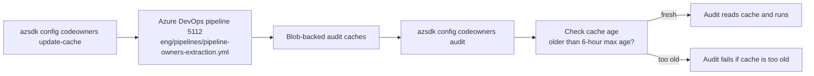

# Spec: 8-Operations - Codeowners Ownership Audit

## Table of Contents

- [Overview](#overview)
- [Definitions](#definitions)
- [Background / Problem Statement](#background--problem-statement)
- [Goals and Exceptions/Limitations](#goals-and-exceptionslimitations)
- [Design Proposal](#design-proposal)
- [Open Questions](#open-questions)
- [Success Criteria](#success-criteria)
- [Agent Prompts](#agent-prompts)
- [CLI Commands](#cli-commands)
- [Implementation Plan](#implementation-plan)
- [Testing Strategy](#testing-strategy)
- [Documentation Updates](#documentation-updates)
- [Metrics/Telemetry](#metricstelemetry)

---

## Overview

This document records the **current implemented ownership-audit model** for `azsdk-cli`.
It is a companion to
[`8-operations-codeowners-management.spec.md`](./8-operations-codeowners-management.spec.md),
which covers the broader CODEOWNERS management surface.

The legacy `CodeownersLinter` validates the **rendered CODEOWNERS file**. The
`azsdk config codeowners audit` flow validates the **Azure DevOps work items** that now serve as
the source of truth.

The current audit runtime is **cache-backed**:

- it validates Azure DevOps work items against blob-backed cache data,
- it does **not** call the GitHub API directly while audit is running,
- it fails fast when required caches are stale, unavailable, empty, inconsistent, or missing repo
  coverage.

Those caches are refreshed by `azsdk config codeowners update-cache`, which starts Azure DevOps
pipeline definition `5112` from `eng/pipelines/pipeline-owners-extraction.yml`.

Some legacy linter failures are now prevented structurally by the generator, while others are
replaced by explicit audit rules.

---

## Definitions

- **Legacy linter**: The CODEOWNERS validation logic in `tools/codeowners-utils/`, primarily in
  `Owners.cs`, `Labels.cs`, `CodeownersLinter.cs`, and `DirectoryUtils.cs`.
- **Ownership audit**: The `azsdk config codeowners audit` command implemented by
  `CodeownersTool`, `CodeownersAuditHelper`, and the audit rules under
  `Helpers/Codeowners/Rules/`.
- **Audit cache**: One of the blob-backed cache inputs used by audit:
  `repository-labels-blob`, `azure-sdk-write-teams-blob`, or `user-org-visibility-blob`.
- **Cache refresh pipeline**: The pipeline started by `azsdk config codeowners update-cache`
  (definition `5112`, file `eng/pipelines/pipeline-owners-extraction.yml`).
- **Rendered CODEOWNERS cache**: The exported section cache uploaded as
  `cache/<owner-lower>/<repo>/CODEOWNERS.cache` and consumed by `check-package`.
- **Generator**: `CodeownersGenerateHelper`, which projects Azure DevOps ownership data into a
  rendered `.github/CODEOWNERS` section.
- **Structurally prevented**: A legacy linter violation that the current generator does not emit
  as invalid rendered syntax, even if the underlying Azure DevOps data is incomplete.

---

## Background / Problem Statement

Ownership data has moved away from direct manual editing of CODEOWNERS and into Azure DevOps work
items. That changed the validation problem:

1. The legacy linter still validates the rendered CODEOWNERS artifact.
2. The new audit validates the work-item graph before or alongside generation.
3. The new audit also validates external ownership and label truth through **refreshed caches**
   instead of live GitHub calls.
4. The generator itself now suppresses some invalid rendered shapes instead of emitting malformed
   CODEOWNERS text.

As a result, the old linter rule set no longer maps 1:1 to the new implementation. This document
explains which linter rules are:

- replaced by implemented audit rules,
- prevented structurally by the generator, or
- still outside the implemented audit scope,
- dependent on fresh cache data before audit can run.

---

## Goals and Exceptions/Limitations

### Goals

- Document the implemented audit rule set.
- Document the implemented cache-backed audit architecture.
- Map each legacy linter rule to its current status under the Azure DevOps-backed workflow.
- Clarify where the generator now enforces structure implicitly.
- Document the cache freshness window, failure behavior, and refresh workflow.

### Exceptions and Limitations

- This document describes the **implemented** rule set only. It does not re-open deferred rule
  proposals from earlier planning artifacts.
- Cache-backed audit rules do **not** fall back to live GitHub API calls when cache validation
  fails.
- Cache-backed audit rules require caches that are fresh within the configured six-hour freshness
  window.
- `AUD-LBL-001` can only validate repos present in the repo label cache. Missing repo coverage is
  a command failure, not a skipped check.
- `AUD-LBL-002` remains **report only**. No automated fix is implemented for Service Attention
  misuse in this project.
- MSFT identity population and identity-resolution integration are **out of scope** for this
  project.
- Repo-file-system path validation rules remain outside the current audit implementation.
- `check-package` uses a **separate rendered CODEOWNERS cache** and should not be confused with
  the audit caches documented here.

---

## Design Proposal

### Design Overview

The current ownership validation model has four layers:

1. **update-cache** refreshes the caches that audit depends on and also regenerates rendered
   CODEOWNERS cache artifacts for configured repos.
2. **Audit** validates Azure DevOps work items against cached external truth and work-item
   relationships.
3. **Generate** renders Azure DevOps work items into CODEOWNERS.
4. **check-package** validates rendered CODEOWNERS cache content for package-level gate checks.

`CodeownersAuditHelper` fetches `Owner`, `Label`, `Package`, and `Label Owner` work items from
Azure DevOps. When `--repo` is supplied, Packages are filtered by derived language and Label Owners
are filtered by `Custom.Repository`, but Owners and Labels remain global because they are shared
across repos.

Within the audit path itself, GitHub is **not** queried directly. The GitHub dependency was moved
upstream into the cache-refresh pipeline.

### Cache-backed Audit Architecture



### Implemented Audit Rule Set

The implemented audit rule set is:

| Rule ID | Description | Cache / Data Dependency | Fix Behavior |
|---------|-------------|-------------------------|--------------|
| `AUD-OWN-001` | Individual owner fails cached owner validation | `azure-sdk-write-teams-blob` and `user-org-visibility-blob` | Set or clear `Custom.InvalidSince` |
| `AUD-OWN-002` | Team alias does not match `Azure/<team>` format | Azure DevOps work item data only | Report only |
| `AUD-OWN-003` | Team does not descend from `azure-sdk-write` | `azure-sdk-write-teams-blob` | Set or clear `Custom.InvalidSince` |
| `AUD-LBL-001` | Label work item does not exist in cached repo label data for the repos where it is referenced | `repository-labels-blob` | Report only |
| `AUD-LBL-002` | Service Attention misused as PR label or sole service label | Azure DevOps work item data only | Report only |
| `AUD-STR-001` | Label Owner has zero owner relations | Azure DevOps work item data only | Delete the Label Owner work item |
| `AUD-STR-002` | Label Owner has zero label relations | Azure DevOps work item data only | Report only |

### Rule Evaluation Order

Rules are evaluated in ascending priority order:

1. `AUD-OWN-001`
2. `AUD-OWN-002`
3. `AUD-OWN-003`
4. `AUD-LBL-001`
5. `AUD-LBL-002`
6. `AUD-STR-001`
7. `AUD-STR-002`

When a fixable rule applies changes, `CodeownersAuditHelper` rebuilds the work-item context before
continuing so later rules see the updated Azure DevOps state.

### Cache Sources

| Cache / Artifact | Used By | Produced By |
|------------------|---------|-------------|
| `repository-labels-blob` | `AUD-LBL-001` | `BuildTeamCache` via `github-team-user-store`, using the repo set from `tools/github/data/repositories.txt` |
| `azure-sdk-write-teams-blob` | `AUD-OWN-001`, `AUD-OWN-003` | `BuildTeamCache` via `github-team-user-store` |
| `user-org-visibility-blob` | `AUD-OWN-001` | `BuildTeamCache` via `github-team-user-store` |
| `cache/<owner-lower>/<repo>/CODEOWNERS.cache` | `check-package` only | `GenerateCodeowners` via `generate`, `export-section`, and blob upload |

### Cache Freshness and Failure Strategy

All cache-backed audit rules share the same freshness policy:

1. `AuditRuleCacheSettings.CacheMaxAge` is `6` hours.
2. Each cache-backed rule computes `DateTime.UtcNow - 6 hours`.
3. The rule calls `ICacheValidator.ThrowIfCacheOlderThan(...)`.
4. For blob URLs, `CacheValidator` issues an HTTP `HEAD` request and reads the `Last-Modified`
   header.
5. If the cache is older than the cutoff, audit throws an error that tells the user to run
   `azsdk config codeowners update-cache`, wait for the build to complete, and try again.

Important fail-fast behavior:

- `--fix` and `--force` do **not** bypass cache freshness validation.
- `AUD-OWN-001` refuses to validate from an empty `azure-sdk-write` user cache.
- `AUD-OWN-001` refuses to validate from an empty Azure-org visibility cache.
- `AUD-OWN-001` throws if an owner appears in only one of the two owner caches, because the cache
  set is internally inconsistent.
- `AUD-LBL-001` throws if a referenced repo is not present in `repository-labels-blob`.
- No audit rule falls back to a live GitHub API lookup when any of the above happens.

### Refreshing the Caches

Use the cache refresh command:

```bash
azsdk config codeowners update-cache
```

Current behavior:

1. The command starts Azure DevOps pipeline definition `5112`.
2. The pipeline file is `eng/pipelines/pipeline-owners-extraction.yml`.
3. The command returns immediately with the build id and pipeline URL.
4. Audit should be rerun **after** that pipeline completes successfully.

Pipeline responsibilities:

- `BuildTeamCache` refreshes the three audit caches (`repository-labels-blob`,
  `azure-sdk-write-teams-blob`, `user-org-visibility-blob`).
- `GenerateCodeowners` regenerates and uploads rendered CODEOWNERS cache artifacts for the repos
  configured in the pipeline parameters.

### Legacy Linter Rule Mapping

The legacy linter contains 17 rules. The table below records how each rule maps to the
implemented Azure DevOps-backed model.

| Legacy Rule | Legacy Meaning | New Generator Outcome | Implemented Auditor Mapping |
|-------------|----------------|------------------------|-----------------------------|
| `OWN-001` | Source path line must have owners | The generator does not emit a source line with zero owners; broken data disappears instead of rendering an empty owner line | No 1:1 implemented replacement. `AUD-STR-001` covers zero-owner Label Owners; package-level owner minimum work is separate |
| `OWN-002` | Team owner must descend from `azure-sdk-write` | Still renderable if bad data exists | `AUD-OWN-003` |
| `OWN-003` | Individual user must satisfy Azure org / write validation | Still renderable if bad data exists | `AUD-OWN-001` using the owner caches, not a live GitHub lookup |
| `OWN-004` | Team alias must match `Azure/<team>` | Still renderable if bad data exists | `AUD-OWN-002` |
| `OWN-005` | Individual user must be valid / resolvable | Still renderable if bad data exists | `AUD-OWN-001` using the owner caches, not a live GitHub lookup |
| `LBL-001` | `PRLabel` / `ServiceLabel` monikers must contain at least one label | The generator does not emit empty label comments | No 1:1 implemented replacement. `AUD-STR-002` covers zero-label Label Owners; package PR-label minimum checks remain separate |
| `LBL-002` | `PRLabel` must not include `Service Attention` | Still renderable if bad data exists | `AUD-LBL-002` |
| `LBL-003` | `ServiceLabel` cannot be only `Service Attention` | Still renderable if bad data exists | `AUD-LBL-002` |
| `LBL-004` | Referenced label must exist in the repo label set | Still renderable if bad data exists | `AUD-LBL-001` against cached repo label data |
| `PATH-001` | Path must exist in the repo | The generator does not validate repo contents | No implemented replacement; remains out of scope because it requires repo file access |
| `PATH-002` | Glob syntax must be valid | Stored `RepoPath` values flow through generation unchanged | No implemented replacement in the current audit; path validation is separate follow-up work |
| `PATH-003` | Glob must match repo files | The generator does not validate repo contents | No implemented replacement; remains out of scope because it requires repo file access |
| `BLK-001` | Duplicate moniker within a block | Structurally prevented by the ADO-backed data model and generator formatting | No auditor rule needed |
| `BLK-002` | `AzureSdkOwners` requires `ServiceLabel` | Can still arise from zero-label `Azure SDK Owner` data linked into generation | `AUD-STR-002` |
| `BLK-003` | `ServiceOwners` requires `ServiceLabel` | Standalone invalid `ServiceOwners` blocks are not emitted by the generator | `AUD-STR-002` is the underlying data-level check for zero-label `Service Owner` records |
| `BLK-004` | `PRLabel` block must end with a source path line | Structurally prevented; the generator only emits `PRLabel` as part of source-path entries | No auditor rule needed |
| `BLK-005` | `ServiceLabel` block must have exactly one valid owner source | Incomplete pathless blocks are suppressed; missing owner/label relations are represented in data instead | `AUD-STR-001` / `AUD-STR-002` |

### Generator Interaction

The current generator changes the failure model in a few important ways:

1. `generate` accepts `--invalid-owner-lookback-days` (default `90`).
2. Owners whose `InvalidSince` is older than the cutoff are excluded from generated output.
3. The refresh pipeline also exports generated sections into rendered CODEOWNERS cache artifacts
   used by `check-package`.
4. Some malformed rendered CODEOWNERS shapes are never emitted:
    - empty source-owner lines,
    - empty label comments,
    - orphaned pathless metadata blocks,
    - PR-label blocks without a terminating source path line.

That means some legacy linter rules are now better understood as **generator invariants** rather
than audit rules.

### Rule Family Summary

The rule families now break down as follows:

| Family | Current Owner of Responsibility |
|--------|---------------------------------|
| Owner validity | `AUD-OWN-*` against Azure DevOps data plus refreshed owner caches |
| Label validity | `AUD-LBL-*` against Azure DevOps data plus refreshed repo label cache |
| Structural work-item integrity | `AUD-STR-*` |
| Repo-path existence / glob matching | Still handled only by file-system-aware validation |
| Rendered package gate checks | `check-package` against rendered CODEOWNERS cache |

---

## Open Questions

No new open design questions are introduced by this document.

Known follow-up areas remain separate from this project:

- repo-path validation (`PATH-*` style checks),
- additional structural package rules,
- MSFT identity population / identity-resolution integration.

---

## Success Criteria

This document is successful when:

- every legacy linter rule is accounted for,
- every implemented audit rule is listed with its current fix behavior,
- the cache-backed audit architecture and refresh path are documented,
- the six-hour freshness policy and fail-fast behavior are documented,
- the document clearly distinguishes:
  - structural prevention by the generator,
  - implemented audit replacement, and
  - current out-of-scope gaps,
  - cache-backed runtime validation versus upstream GitHub-backed refresh.

---

## Agent Prompts

Example prompts this document is intended to support:

- “Explain how the old CODEOWNERS linter rules map to the new ownership audit.”
- “Which legacy linter checks are now enforced by the audit versus structurally prevented by generation?”
- “What does `azsdk config codeowners audit --fix` actually repair today?”
- “Why did audit fail telling me to update the cache?”
- “Which caches does the audit depend on, and how do I refresh them?”

---

## CLI Commands

Current ownership-audit command surface:

```bash
azsdk config codeowners audit [--fix] [--force] [--repo Azure/<repo>]
```

Cache refresh command:

```bash
azsdk config codeowners update-cache
```

Supporting generation behavior:

```bash
azsdk config codeowners generate --invalid-owner-lookback-days 90
```

Notes:

- `update-cache` starts pipeline definition `5112` and returns immediately; it does not wait for
  pipeline completion.
- `audit` validates Azure DevOps work items against caches and work-item relationships; it does not
  call GitHub directly at runtime.
- `audit` scopes Packages and Label Owners when `--repo` is supplied, but Owners and Labels remain
  global.
- `--fix` only applies to rules that currently support automated repair.
- `--force` only bypasses fix safety thresholds; it does not bypass stale-cache failures.
- `AUD-LBL-002` is intentionally report-only.
- `check-package` remains a separate rendered-output validation flow.

---

## Implementation Plan

This document reflects the **implemented** ownership-audit state rather than proposing a new
feature rollout.

Current implementation lives in:

- `Azure.Sdk.Tools.Cli/Tools/Config/CodeownersTool.cs`
- `Azure.Sdk.Tools.Cli/Helpers/Codeowners/CodeownersAuditHelper.cs`
- `Azure.Sdk.Tools.Cli/Helpers/Codeowners/CodeownersGenerateHelper.cs`
- `Azure.Sdk.Tools.Cli/Helpers/Codeowners/Rules/*.cs`
- `Azure.Sdk.Tools.Cli/Helpers/Codeowners/Rules/AuditRuleCacheSettings.cs`
- `tools/codeowners-utils/Azure.Sdk.Tools.CodeownersUtils/Caches/*.cs`
- `tools/codeowners-utils/Azure.Sdk.Tools.CodeownersUtils/Utils/CacheValidator.cs`
- `tools/github/data/repositories.txt`
- `eng/pipelines/pipeline-owners-extraction.yml`

No new implementation work is introduced by this documentation change.

---

## Testing Strategy

Current implementation coverage relevant to this document includes:

- audit rule coverage in `AuditRuleTests.cs`,
- audit harness coverage in `AuditRuleTests.cs`,
- command-surface coverage in `CodeownersToolsTests.cs`,
- cache freshness coverage in `CacheValidatorTests.cs`,
- generator lookback coverage in `CodeownersGenerateHelperTests.cs`.

Notably:

- cache validator tests cover the stale-cache error path and the `Last-Modified`-based freshness
  check,
- audit rule tests cover cache-backed rule behavior, including stale-cache and missing-repo-cache
  failures,
- the generator has test coverage for invalid-owner lookback filtering,
- CLI-level audit/generate integration coverage was not added in this phase by design,
- Service Attention misuse remains documented as report-only to match implementation.

---

## Documentation Updates

This document complements rather than replaces:

- [`8-operations-codeowners-management.spec.md`](./8-operations-codeowners-management.spec.md)

Recommended usage:

- Use the management spec for the broader CODEOWNERS management surface.
- Use this document when discussing the ownership-audit rule model, cache architecture,
  legacy-linter mapping, or refresh workflow.

---

## Metrics/Telemetry

No audit-specific telemetry changes are introduced by this document.

The current implementation relies on command output and logger diagnostics rather than dedicated
ownership-audit telemetry.

In practice, cache freshness failures and update-cache pipeline launches are surfaced through
command output and logs, not through separate audit telemetry.
