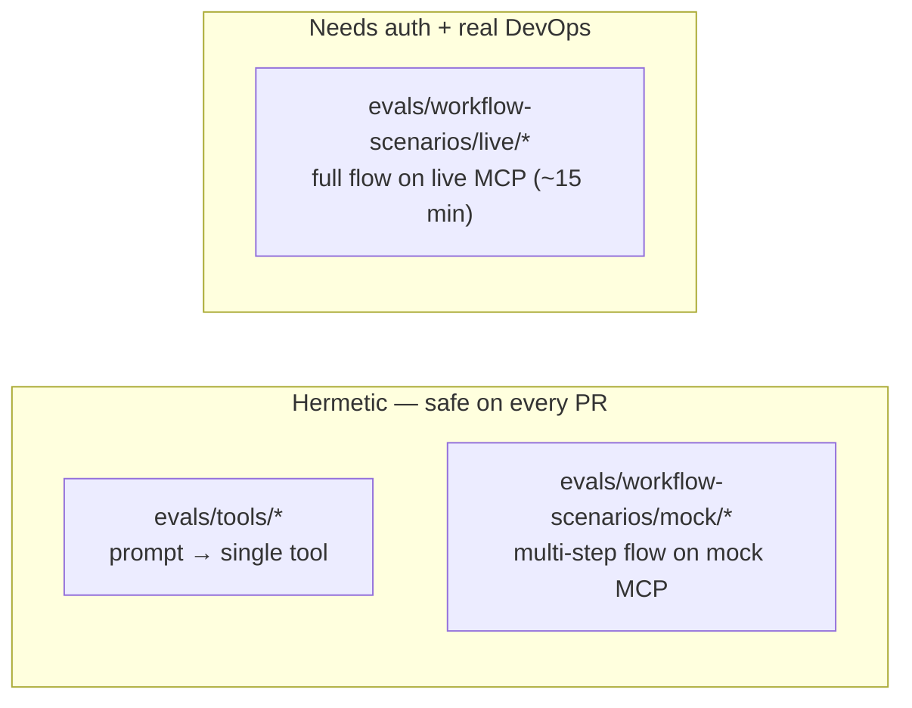
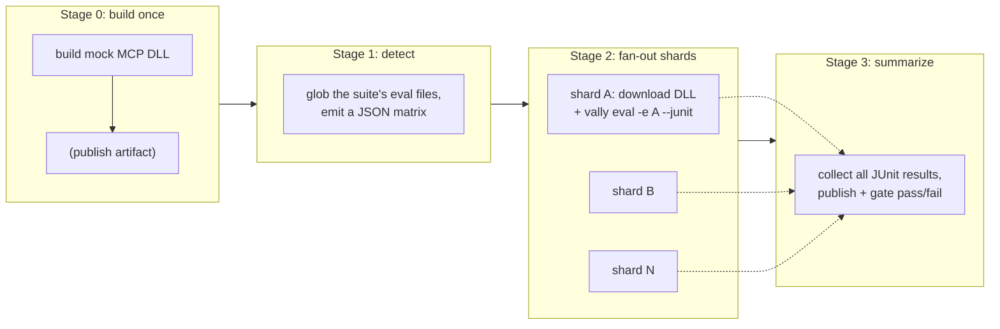
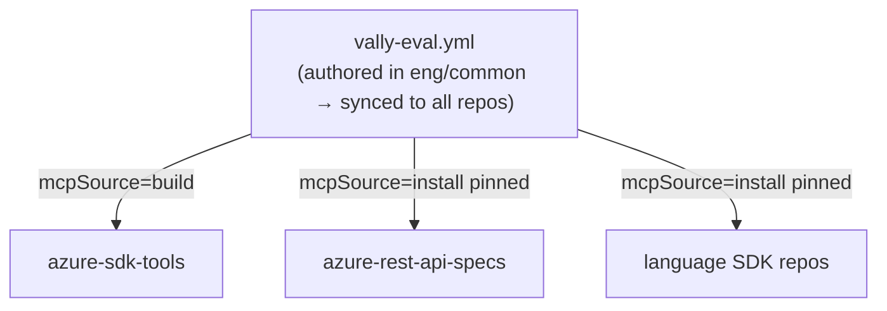
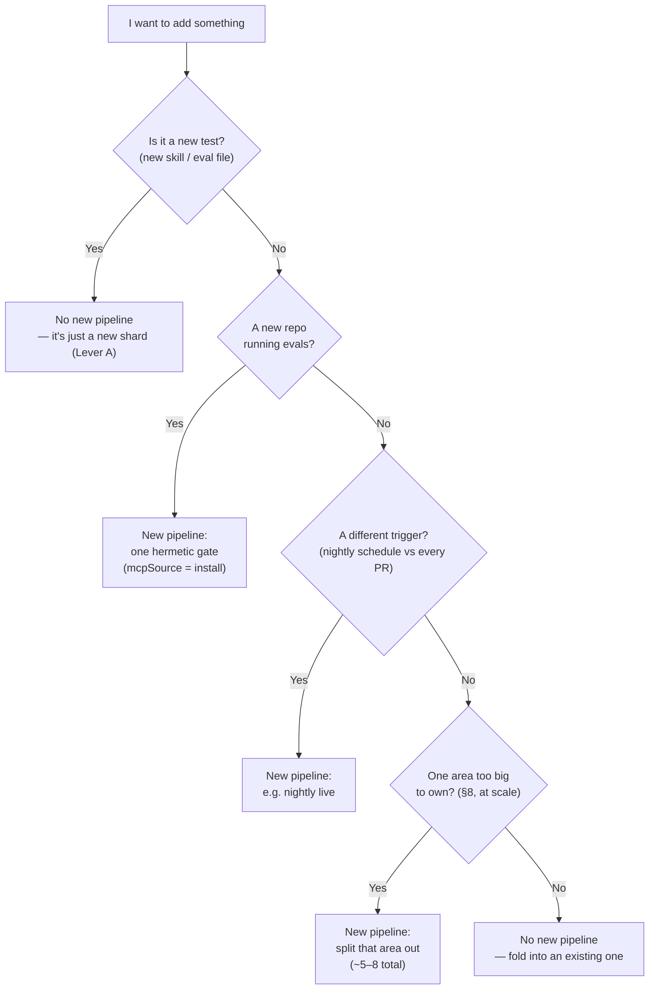
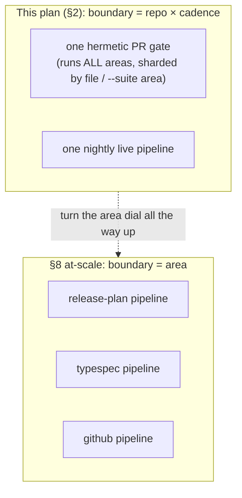
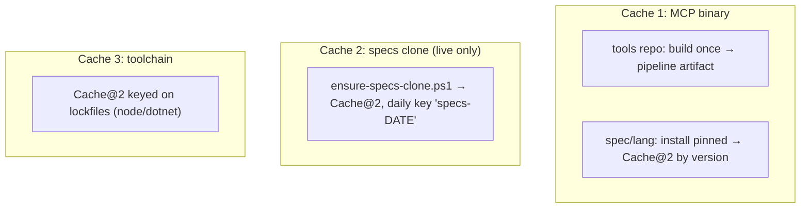
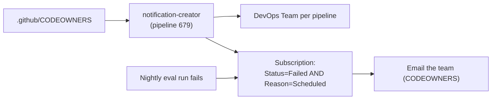
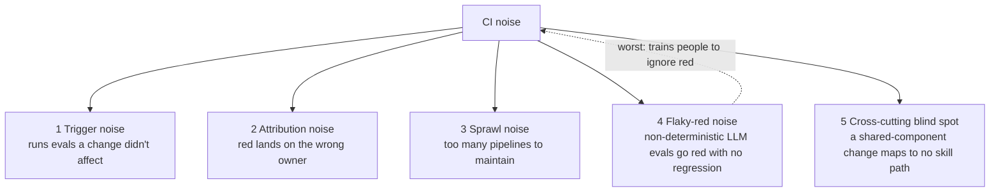
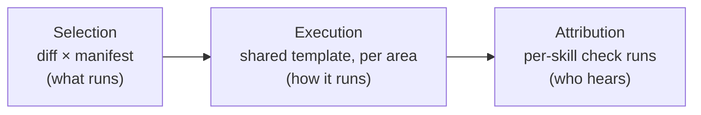

# Vally Eval CI — Design

> **Status:** Draft / design · 2026-06-16
> **Companion to:** `8-operations-agent-eval-strategy.spec.md` (PR #15918, not yet merged)

> ### Who this is for (targeted reader)
> **Primary:** an engineer with *basic* Vally context who will **implement or review** this CI.
> No prior knowledge of our pipeline internals is assumed — [§0](#0-background-read-this-first) defines every term.
>
> **Secondary:** reviewers/leads choosing the pipeline **topology**, and **partner-repo owners**
> (`azure-rest-api-specs`, the language SDK repos) who will consume the synced template.
>
> **How to read it:** **Part I–II is the plan** — read top to bottom and stop after the
> [phasing table](#6-phasing-summary). **Part III is the deeper analysis** (why it's shaped this
> way, the at-scale alternative, honest tradeoffs) — for reviewers deciding topology.

---

## Contents

**Part I — Orientation**
- [0. Background (read this first)](#0-background-read-this-first)
- [Building blocks we reuse (grounding)](#building-blocks-we-reuse-grounding)

**Part II — The plan**
- [1. Phase 1 — the mock vertical (3-stage skeleton)](#1-phase-1--the-mock-vertical-3-stage-skeleton)
- [2. Scalability — same skeleton, two levers](#2-scalability--same-skeleton-two-levers)
- [3. Clone & cache across repos](#3-clone--cache-across-repos)
- [4. Attribution & notifications](#4-attribution--notifications)
- [5. Known blocker — Vally has no path/variable interpolation](#5-known-blocker--vally-has-no-pathvariable-interpolation)
- [6. Phasing summary](#6-phasing-summary)

**Part III — Deeper analysis (optional)**
- [7. The noise we're actually preventing](#7-the-noise-were-actually-preventing)
- [8. The at-scale alternative — per-area + diff-selection](#8-the-at-scale-alternative--per-area--diff-selection)
- [9. Concerns & honest tradeoffs](#9-concerns--honest-tradeoffs)
- [10. References (real files)](#10-references-real-files)

---

# Part I — Orientation

## 0. Background (read this first)

We run **Vally**, an eval tool that checks whether an AI agent, given a user prompt, invokes the **correct Azure SDK MCP tool(s)**. These evals are our regression safety net for skills and tool routing.

Terms used throughout:

| Term | Meaning |
|------|---------|
| **Eval / scenario** | One `*.eval.yaml` file: a prompt + graders that assert which tools should fire. |
| **Suite** | A named group of evals defined in [`.vally.yaml`](../../Azure.Sdk.Tools.Vally/.vally.yaml) (`unit`, `scenarios-mock`, `scenarios-live`, …). |
| **MCP server** | The backend the agent calls. **Mock** = fake, hermetic, no network. **Live** = the real `azsdk` CLI hitting real DevOps/GitHub. |
| **Hermetic** | No external I/O — safe to run on every PR. |
| **Shard** | One slice of evals run as its own parallel CI job. |
| **Fixture** | Setup an eval needs, e.g. the live tier needs a clone of `azure-rest-api-specs`. |

Three **tiers** of evals exist today (under [`Azure.Sdk.Tools.Vally/evals/`](../../Azure.Sdk.Tools.Vally)):

The goal: turn these into CI that is **fast on PRs**, **scalable as we add scenarios**, and **reusable across repos** (`azure-sdk-tools`, `azure-rest-api-specs`, the language SDK repos).

## Building blocks we reuse (grounding)

Nothing below is invented — it already exists in `azure-sdk-tools`. The plan reuses it.

| Building block | Path | What it gives us |
| --- | --- | --- |
| **Cross-repo eval pipeline pattern** | [`eng/common/pipelines/ai-evals-tests.yml`](../../../../eng/common/pipelines/ai-evals-tests.yml) | A thin pipeline that `extends` an `eng/common` job template and derives the target repo from `Build.Repository.Name`. The exact "author once, sync everywhere" mechanism — already running for the *old* eval system. |
| **Eval job template** | [`eng/common/pipelines/templates/jobs/ai-eval-job.yml`](../../../../eng/common/pipelines/templates/jobs/ai-eval-job.yml) | Conventions to copy: `UseDotNet@2` (9.0.x + 8.0.x), `sparse-checkout.yml`, `AzureCLI@2` with `azureSubscription: opensource-api-connection`, `PublishTestResults@2`, pools via `globals.yml`/`image.yml`. |
| **Matrix / sharding primitive** | [`eng/common/pipelines/templates/jobs/generate-job-matrix.yml`](../../../../eng/common/pipelines/templates/jobs/generate-job-matrix.yml) | The mature Azure SDK matrix generator (`MatrixConfigs`, `MatrixFilters`, `JobTemplatePath`, **PR batching**). Our Stage 2 fan-out can reuse this instead of a hand-rolled matrix. |
| **Pipeline auto-generation** | [`tools/pipeline-generator`](../../../pipeline-generator) | Stamps a DevOps pipeline from a `ci.yml`. Same tool that auto-creates SDK pipelines. |
| **Specs clone helper** | [`scripts/ensure-specs-clone.ps1`](../../Azure.Sdk.Tools.Vally/scripts/ensure-specs-clone.ps1) | Primes a sparse `azure-rest-api-specs` cache (24h refresh) for the live tier. |
| **Failure notification by CODEOWNERS** | [`tools/notification-configuration`](../../../notification-configuration) (ADO pipeline `build-failure-notification-subscriptions`, id 679) | Auto-creates a DevOps **Team per pipeline** from CODEOWNERS and **emails it on scheduled build failure**. The native attribution path — see [§4](#4-attribution--notifications). |
| **Suites + area tags** | [`.vally.yaml`](../../Azure.Sdk.Tools.Vally/.vally.yaml) | Named suites (`unit`, `scenarios-mock`, `scenarios-live`, `pr-gate`, `nightly`) **and area suites** (`release-plan`, `typespec`, `pipeline`, `github`) that filter on the `area` tag. |
| **Existing skill-eval pipeline (ADO)** | [`eng/pipelines/skill-eval.yml`](../../../../eng/pipelines/skill-eval.yml) | **Already implements most of [§1–§2](#1-phase-1--the-mock-vertical-3-stage-skeleton).** Builds **both** MCP servers to `artifacts/mcp/{cli,mock}`, does **diff→area detection** (`git diff … \| grep skills → vally eval --tag area=<x>`), report-only (`continueOnError: true`), pinned Vally CLI, results as artifact. Triggers on **push to main** (`pr: none`). This design *extends* it — it is not greenfield. |
| **Existing skill-eval lint (GH Actions)** | [`.github/workflows/skill-eval.yml`](../../../../.github/workflows/skill-eval.yml) | The current **PR-time** gate: runs `vally lint .` on PR + push (structural compliance only — no MCP, no `eval`). |
| **Pinned Vally CLI** | [`eng/skill-eval/package.json`](../../../../eng/skill-eval/package.json) | `@microsoft/vally-cli@0.5.0` pinned via committed lockfile; CI runs `npm ci` for reproducibility. (This is the **npm** CLI — separate from the **.NET** MCP tool below.) |
| **Skill mirror** | [`eng/pipelines/sync-.github-skills.yml`](../../../../eng/pipelines/sync-.github-skills.yml) | Mirrors `.github/skills/azsdk-common-*` to an **explicit 8-repo list** (`azure-sdk-for-{net,java,js,python,c,cpp,ios}` + `azure-sdk`) via `archetype-sdk-tool-repo-sync.yml` — *not* the `eng/common` sync, and *not* `azure-rest-api-specs` by default. |
| **`azsdk` = .NET global tool** | [`Azure.Sdk.Tools.Cli.csproj`](../../Azure.Sdk.Tools.Cli/Azure.Sdk.Tools.Cli.csproj) | `<PackAsTool>true`, `ToolCommandName=azsdk` → downstream install is `dotnet tool install` (NuGet), distinct from the npm Vally CLI. Mock assembly = `azsdk-mock`. |

**Vally CLI facts** (from `vally eval --help`; the CLI is `@microsoft/vally-cli@0.5.0`, pinned in [`eng/skill-eval/package.json`](../../../../eng/skill-eval/package.json)): selection via `--suite <name>`, `--tag <key=values>`, `-e <path>` (repeatable); trials via `--runs <n>`, `--workers <n>`, `--threshold <0-1>`; output via `--junit`, `--output jsonl`, `--output-dir`. **No `list` command** (subcommands are `lint/eval/grade/compare/export/serve/ingest`) — so scenario discovery is a **filesystem glob**, not a Vally call.

---

# Part II — The plan

## 1. Phase 1 — the mock vertical (3-stage skeleton)

**Build the mock-scenario tier first**, as a reusable **detect → fan-out → summarize** pipeline.

Why mock first: it's **hermetic**. It has **none** of the blockers sinking the current live pipeline (variable-group/copilot-token auth, real DevOps writes). Phase 1 proves the *sharding pattern* without fighting auth or caches.

- **Stage 0 — build once.** Build the mock DLL one time (`dotnet build ../Azure.Sdk.Tools.Mock -c Debug -o ../../../artifacts/mcp/mock`) and publish it as a pipeline artifact. Shards **download** it instead of each rebuilding — the single biggest efficiency win. (Vally launches `dotnet <dll>`, never `dotnet run`, to avoid the MSBuild boot race under parallel workers — issue #15947.)
- **Stage 1 — detect.** A script lists the suite's `*.eval.yaml` files and emits a matrix. Vally has **no `list` command**, so discovery is a filesystem glob of the same paths the suite uses.
- **Stage 2 — fan-out.** A runtime matrix (optionally [`generate-job-matrix.yml`](../../../../eng/common/pipelines/templates/jobs/generate-job-matrix.yml)) runs one job per shard: download DLL → `vally eval -e <shard> --junit --output jsonl` → publish that shard's result.
- **Stage 3 — summarize.** Collect all JUnit results, publish via `PublishTestResults@2`, and gate on the **rollup** so one flaky shard is visible but the summary owns pass/fail.

Deferred out of Phase 1: the **live** tier (auth-blocked) and the **cross-repo** path generalization. Both plug into the *same* skeleton later.

## 2. Scalability — same skeleton, two levers

> **Reality check first — most of this already exists.** [`eng/pipelines/skill-eval.yml`](../../../../eng/pipelines/skill-eval.yml) already builds both MCP servers, **detects changed areas from the git diff**, and runs `vally eval --tag area=<x>` report-only; [`.github/workflows/skill-eval.yml`](../../../../.github/workflows/skill-eval.yml) already runs `vally lint` on PRs. So §1–§2 are an **extension of a working pipeline**, not a clean-sheet design. What this design genuinely *adds*:
>
> | Already built today | This design adds |
> | --- | --- |
> | Build both MCP DLLs to `artifacts/mcp/{cli,mock}` | **Build *once*, publish artifact, fan-out shards download it** (today it's a single job) |
> | Diff→area detection → `--tag area=` | The same selection, but feeding a **Stage-2 matrix** for parallel shards |
> | One eval job, parallelism via `--workers` only | **Inter-job sharding** on top of `--workers` |
> | Per-skill evals under `.github/skills/` | Wires the **scenario evals** (`Vally/evals/`, mock+live tiers) into the same skeleton |
> | Concrete pipeline in `eng/pipelines/` | Factors it into a **reusable `eng/common` template** for cross-repo reuse |
> | `vally lint` on PR; `vally eval` post-merge on main, report-only | A path toward a **hermetic PR eval gate** (needs the Copilot token on PRs — see [§5](#5-known-blocker--vally-has-no-pathvariable-interpolation) / live-auth blocker) |

### Lever A: the matrix grows itself

> **In plain terms:** the pipeline finds the tests by itself. Drop a new test file in the folder and the pipeline runs it next time — nobody edits the pipeline. More tests just means more of them run side-by-side. *Lever A = grow the number of tests inside one pipeline.*

Stage 1 globs the directory, so **adding a new `*.eval.yaml` automatically becomes a new shard — zero pipeline edits.** Two parallelism levels combine: the matrix gives *inter*-scenario parallelism; `vally eval --workers N` gives *intra*-scenario parallelism.

Shard at two granularities with the same machinery:
- **by file** (`-e <file>`) — finest
- **by area tag** (`--tag area=release-plan|typespec|…` — the mechanism [`skill-eval.yml`](../../../../eng/pipelines/skill-eval.yml) already uses; the named `--suite <area>` form in `.vally.yaml` is equivalent) — coarser, fewer jobs

Start by-file for mock; switch to by-area if job-startup overhead dominates. Make Stage 1 emit a `shardKey` (defaults to filename, can collapse to the `area` tag) so you tune granularity from **one place**. Cap concurrency (~10) to avoid exhausting the agent pool / Copilot-SDK session limit.

### Lever B: one template, distributed via eng/common

> **In plain terms:** write the pipeline once, and every repo gets the same copy automatically. Each repo flips just *one* switch — where to get the MCP program from (build it here, or download the published one). *Lever B = reuse the same pipeline across many repos.*

Factor the whole skeleton into a single template — `vally-eval.yml` — placed in **`eng/common/pipelines/templates`**. The `eng/common` tree is **already mirrored into the language SDK repos** by the existing eng-common sync, so authoring it once here distributes it everywhere for free — exactly how [`ai-evals-tests.yml`](../../../../eng/common/pipelines/ai-evals-tests.yml) already works.

> **Two distinct sync paths — don't conflate them.** The *eval template* (`eng/common/**`) rides the **eng-common** sync to the language repos. The *skills themselves* (`.github/skills/azsdk-common-*`) ride a **separate** pipeline, [`sync-.github-skills.yml`](../../../../eng/pipelines/sync-.github-skills.yml), to an **explicit 8-repo list** (and `azure-rest-api-specs` is **not** in that default list — it was synced manually). So "author once, runs everywhere" holds for the template; skill *content* reaches a repo only if that repo is a sync target.

The one thing that differs per repo is **where the MCP binary comes from** — make that a parameter:

| Repo | How MCP is acquired | Why |
|------|--------------------|-----|
| **azure-sdk-tools** | `dotnet build … -o artifacts/mcp/{cli,mock}` from source | the MCP source lives here |
| **azure-rest-api-specs** | `dotnet tool install` the **pinned published** `azsdk` | doesn't build the tool |
| **language repos** | `dotnet tool install` the **pinned published** `azsdk` | doesn't build the tool |

> **`azsdk` is a .NET global tool** (`<PackAsTool>`, `ToolCommandName=azsdk`), so `mcpSource=install` means `dotnet tool install` from a NuGet feed — **pin the version**. This is independent of the **npm** Vally CLI (`@microsoft/vally-cli`), which every repo pins via its own `eng/skill-eval` lockfile.

Template parameters become: `suite/evalGlob`, `mcpSource: build | install`, `mcpVersion`, `environment: mock | live`, `runs/model/workers`. The detect → shard → summarize stages are **identical everywhere**; only the "acquire MCP" step swaps.

### When do you add a new pipeline?

**Adding tests never adds a pipeline — that's Lever A.** You add a *new* pipeline from the template only when you cross a boundary one pipeline can't cover: a **new repo**, a **new trigger** (nightly vs PR), or — only at large scale — **one area grown too big to own** (§8).

### How many pipelines per repo? (Not 3.)

> **First, clear up a common mix-up: three *test tiers* ≠ three *pipelines*.** The three tiers (1 **unit** = single tools, 2 **mock workflow** = multi-step skills, 3 **live** = real end-to-end) are *kinds of tests*, not separate pipelines. Tiers 1 and 2 are both hermetic (fake backend), so they ride **one** PR pipeline together; tier 3 is the only one that needs its own pipeline, because it runs on a nightly **schedule**, not on every PR. So even the owner repo has **~2** pipelines, not 3 — and other repos have just **1**.

"Pipeline count" is a function of **trigger cadence** (PR vs scheduled) and **what the repo is responsible for testing** — not a fixed number.

| Repo | Pipelines it needs |
|------|--------------------|
| **azure-sdk-tools** | **~2**: a **PR-gate** (unit + mock, hermetic, every PR) and a **nightly** (live, scheduled). Live *must* be separate because its trigger is a schedule, not a PR. |
| **azure-rest-api-specs** | **1**: a hermetic skill-eval gate on PRs touching `.github/skills/**`, run against the pinned published MCP. No live tier; it uses its own checkout. |
| **language repos** | **1**: the same hermetic skill-eval gate. |

The live tier is the *only* reason the owner repo needs an extra pipeline; downstream repos need just the fast hermetic gate. Don't duplicate live (real DevOps writes) or the tool-port scenarios downstream — those are the tools-repo's job. (This per-repo, per-cadence shape also keeps **attribution free** — see [§4](#4-attribution--notifications).)

### Isn't this different from the "per-area pipeline" in §8? (Reconciling the two)

They are the **same skeleton** — they differ only in **what gets promoted to a separate pipeline definition**, and "area" appears in both but means different things:

- **Here (the plan):** area is a **shard key *inside* one pipeline** (Lever A) — one gate fans out across all areas by file or `--suite <area>`.
- **In [§8](#8-the-at-scale-alternative--per-area--diff-selection):** area is **promoted to its own pipeline definition** (several area pipelines per repo).

Why the plan picks **repo × cadence** now, not per-area:

1. **Cadence is the only *hard* split today** — a hermetic PR gate and a scheduled live run *must* be separate pipelines regardless of area.
2. **The notifier ([§4](#4-attribution--notifications)) attributes per *pipeline definition*.** Most tools-repo skills share one owner (`@azure/azsdk-cli`), so per-area pipelines would add registrations **without** buying finer failure routing.
3. **Per-area's real payoff** (setup dedup across many skills + per-skill check-runs) only matters at **high skill count**.

So: **area is a dial you turn up *inside* one pipeline now, and promote to its own pipeline only at the scale threshold in [§8](#8-the-at-scale-alternative--per-area--diff-selection).** Not a different design — a later setting of the same one.

## 3. Clone & cache across repos

There are **three independent caches** — treat them separately and the complexity drops.

1. **MCP binary — build-once, fan-out-many.** Tools repo: build in Stage 0 (`dotnet build … -o artifacts/mcp/{cli,mock}`), publish as a pipeline artifact; shards download it. Spec/language repos: don't build — `dotnet tool install` the **pinned published** `azsdk` (.NET global tool) and let the NuGet global-packages cache (`Cache@2` keyed on the version) make it instant. **Pinning the version** is what makes this cache deterministic. *(The npm `@microsoft/vally-cli` is pinned separately via the `eng/skill-eval` lockfile — see Cache 3.)*
2. **Specs clone — the expensive one (live tier only).** The mechanism already exists: [`ensure-specs-clone.ps1`](../../Azure.Sdk.Tools.Vally/scripts/ensure-specs-clone.ps1) primes `azure-rest-api-specs` (24h refresh); the live eval worktrees off it via `environment.git.source`. In CI, wrap that path in a `Cache@2` task with a **daily restore key** (`specs-<date>` + fallback `specs-`) so the multi-GB clone is *restored*, not re-cloned; content-addressed, so parallel shards safely share the restore. **Repo-dependent:** in **azure-rest-api-specs the repo *is* the specs** → use the PR checkout, no clone; in **tools + language repos** you need the cached clone. Gate this step on `Build.Repository.Name`.
3. **Toolchain (node/npm, dotnet).** Standard `Cache@2` keyed on lockfiles (`package-lock.json`, `packages.lock.json`). Cheap, repo-agnostic.

Two rules that keep caching clean:
- **Mock tier needs zero external cache** (hermetic) — only the MCP artifact. Another reason mock is the right Phase 1.
- **Prefer `Cache@2`-in-each-shard over publish/download for the clone** — avoids serializing a multi-GB artifact upload.

## 4. Attribution & notifications

**Don't invent attribution — Azure SDK already has it, and it's CODEOWNERS-based.** The [`notification-configuration`](../../../notification-configuration) tool (ADO pipeline **`build-failure-notification-subscriptions`**, `id 679`) does, for each pipeline definition:

1. **Auto-creates a DevOps Team** named `"{pipelineId} {pipelineName}"`, described *"Automatically generated team from CODEOWNERS to enable notifications."*
2. **Syncs that team's membership from the pipeline's CODEOWNERS** (GitHub identity → AAD).
3. **Creates a failure subscription** filtered `Status = Failed AND Definition name = <pipeline> AND Build reason = Scheduled` → the team is **emailed when the nightly run fails**. By default only **scheduled** pipelines get this, so **PR runs email no one**.

**Why this matters for the plan:** the notifier attributes at **pipeline granularity**. The per-repo / per-cadence shape in [§2](#how-many-pipelines-per-repo-not-3) means each pipeline already maps cleanly to an ownership boundary — so **failure routing is free**: just give the nightly (and the gate) a **schedule** and ensure CODEOWNERS covers the eval paths. No GitHub App, no custom code. *(If you ever consolidate many skills into one pipeline, you lose this per-skill routing — see [§8](#8-the-at-scale-alternative--per-area--diff-selection).)*

## 5. Known blocker — Vally has no path/variable interpolation

**Confirmed** in `@microsoft/vally@0.5.0`: config values are literal strings (no `${env:VAR}`, no `variables:` key). So `args: ["../../../artifacts/mcp/mock/azsdk-mock.dll"]` and the live `environment.git.source` path are hard-coded and **can't be shared across repos/runners as-is**.

Filed as a feature request: **[microsoft/vally#562](https://github.com/microsoft/vally/issues/562)** (interpolate `${env:VAR}` / `${repoRoot}` in paths, MCP args/env, and fixture source).

**Until that lands:** generate `.vally.yaml` at pipeline time from a per-repo template, **or** keep paths relative and standardize the artifact layout to `$(repoRoot)/artifacts/...` in every repo so the relative paths resolve identically. Either is a stopgap the interpolation feature later removes.

## 6. Phasing summary

| Phase | Scope | Unblocks |
|-------|-------|----------|
| **1 (now)** | Mock vertical in tools repo: build-once artifact + detect/shard/summarize + the `vally-eval.yml` template (with `mcpSource` param from day one) | The sharding + template pattern, with zero auth/cache risk |
| **2** | Tools-repo PR-gate adds the `unit` tier (same template, different suite) | Full hermetic PR gate |
| **3** | Roll `vally-eval.yml` to spec + language repos as their **1** hermetic skill-eval gate (`mcpSource=install pinned`) | Cross-repo coverage |
| **4** | Nightly **live** pipeline in tools repo: clone cache + variable-group/copilot-token auth + CODEOWNERS notification (tool 679) | Live e2e (after auth fixed) |

---

# Part III — Deeper analysis (optional)

> Everything above is the recommended near-term plan. This part explains *why* it's shaped
> this way, what a higher-scale future could look like, and the honest tradeoffs. Read it if
> you're deciding topology or reviewing the spec.

## 7. The noise we're actually preventing

"CI noise" is really **five** distinct failure modes. The plan targets the first four directly; the fifth is covered by the nightly run.

How the plan addresses each:

| Noise | Mitigation in the plan |
| --- | --- |
| **#1 Trigger** | Path-scoped PR gate (`.github/skills/**`); live is schedule-only. |
| **#2 Attribution** | One pipeline per ownership boundary → CODEOWNERS notifier (tool 679) emails the right team ([§4](#4-attribution--notifications)). |
| **#3 Sprawl** | Per-repo/per-cadence count (~2 / 1 / 1), **not** one pipeline per skill. |
| **#4 Flaky-red** | Summarize-stage gates on the **rollup**; use `--runs N` + `--threshold` for non-deterministic scenarios; keep new/flaky evals report-only until stable (quarantine → canary). |
| **#5 Cross-cutting** | The **nightly full run** is the real backstop for shared-component changes a path trigger can't see (and, at scale, the manifest's **canary escalation** in [§8](#8-the-at-scale-alternative--per-area--diff-selection) catches them at PR time). |

## 8. The at-scale alternative — per-area + diff-selection

**Key insight: noise is a function of *selection* and *attribution*, not pipeline *count*.** The near-term plan ties all three concerns below to one knob ("a pipeline"). Decouple them and you can scope signal just as tightly **without** one pipeline per skill — worth doing once a repo owns *many* skills and per-pipeline sprawl becomes the dominant cost. The trick is to **decouple three concerns** the word "pipeline" usually fuses:

- **Selection — diff-driven, from a manifest.** A checked-in manifest (`skill → paths → owners → area`) plus the PR diff decide which evals run — *in code*, not from trigger lists scattered across N `ci.yml`s. Same anti-noise property as path triggers (only affected evals run), plus two things path triggers can't do:
  - **No trigger-list drift.** The "union-of-paths" problem in per-workflow `ci.yml`s disappears. The manifest is **validated in CI**: every skill has an entry, every path exists, every eval has an owner.
  - **Cross-cutting changes become visible.** An MCP-server or shared-template change maps to *no* skill path, so path triggers would run **nothing**; the manifest's `shared`/`core` rule instead **escalates to the smoke/canary set**, closing blind-spot #5 ([§7](#7-the-noise-were-actually-preventing)) at PR time instead of waiting for nightly.
- **Execution — consolidated per area.** One pipeline per area (`release-plan`, `typespec`, `pipeline`, `github`, `core`) — **~5–8 total, mapping to the `area` tags already in [`.vally.yaml`](../../Azure.Sdk.Tools.Vally/.vally.yaml)** and to how teams own things — **not ~100 per-skill pipelines**. The *same* `vally-eval.yml` runs once per area, so MCP boot + clone restore are paid **once** for all changed skills in that area, then it runs the union of selected evals (emitted as the Stage-2 matrix).
- **Attribution — per-skill GitHub Check Runs.** One pipeline can post **many** independent statuses, each routed to its CODEOWNERS — recovering the per-skill routing that the per-pipeline notifier ([§4](#4-attribution--notifications)) gives *for free* under the near-term plan.

**This is explicitly a Phase-3+ option, not the near-term plan**, because it has real costs:

- The check-run fan-out needs a **GitHub App** (`checks:write`); ADO posts a single status per build by default; branch protection requires **static** check names, so per-skill checks can be *informational* but the **required gate must be one aggregate check** — per-skill *gating* isn't achievable via dynamic names. The per-pipeline notifier in [§4](#4-attribution--notifications) gives per-skill routing **for free**, so consolidation *removes* a working mechanism and replaces it with unproven plumbing.
- Diff-selection is a **heuristic**: it can't see semantic coupling (shared prompts, fixtures, tool-logic). The nightly full run remains the only correctness guarantee; **under-selection is invisible**, and a missed regression is worse than noise.
- A consolidated pipeline shares one clone cache across concurrent PRs → contention, and one infra flake reds out the whole area at once (must mark infra-error ≠ eval-failure).

**Verdict:** keep the per-repo/per-cadence plan for Phases 1–3. Adopt per-area + diff-selection **only** when skill count makes per-pipeline maintenance the dominant pain.

## 9. Concerns & honest tradeoffs

1. **Mock-first delays live coverage.** Real end-to-end behavior (auth, DevOps writes) isn't exercised until Phase 4. Accepted: live is auth-blocked today regardless, and the skeleton is identical.
2. **Glob-based detection can over- or under-select.** It's a filesystem heuristic; a renamed/moved eval changes shard identity. Low risk while suites map 1:1 to folders.
3. **Non-determinism erodes the cost win.** Trustworthy signal needs `--runs N`, which multiplies agent cost. Gate only stable/canary evals with a pass-rate `--threshold`; keep the rest report-only.
4. **`.vally.yaml` interpolation gap (#562).** Until it lands, config is template-generated per repo or relies on a standardized `artifacts/` layout — a stopgap to remove later.
5. **Per-skill CODEOWNERS granularity.** Today ownership is directory-level (`/tools/azsdk-cli/ @azure/azsdk-cli`). Finer skill ownership is needed before attribution can route below the area level (spec Phase 3 dependency).
6. **Flaky quarantine needs governance.** Without an owner, a graduation bar, and auto-demote, the quarantine lane becomes a disabled-test graveyard and can mask genuine skill-quality issues.

## 10. References (real files)

- Spec: `8-operations-agent-eval-strategy.spec.md` (PR #15918, not yet merged)
- Cross-repo eval pipeline precedent: [`eng/common/pipelines/ai-evals-tests.yml`](../../../../eng/common/pipelines/ai-evals-tests.yml)
- Eval job template: [`eng/common/pipelines/templates/jobs/ai-eval-job.yml`](../../../../eng/common/pipelines/templates/jobs/ai-eval-job.yml)
- Matrix / sharding: [`eng/common/pipelines/templates/jobs/generate-job-matrix.yml`](../../../../eng/common/pipelines/templates/jobs/generate-job-matrix.yml)
- Pipeline generator: [`tools/pipeline-generator`](../../../pipeline-generator)
- CODEOWNERS failure notifier: [`tools/notification-configuration`](../../../notification-configuration) (ADO pipeline `build-failure-notification-subscriptions`, id 679)
- Vally config + suites: [`.vally.yaml`](../../Azure.Sdk.Tools.Vally/.vally.yaml)
- Specs clone helper: [`scripts/ensure-specs-clone.ps1`](../../Azure.Sdk.Tools.Vally/scripts/ensure-specs-clone.ps1)
- CODEOWNERS: [`.github/CODEOWNERS`](../../../../.github/CODEOWNERS)
- Vally interpolation gap: [microsoft/vally#562](https://github.com/microsoft/vally/issues/562)
