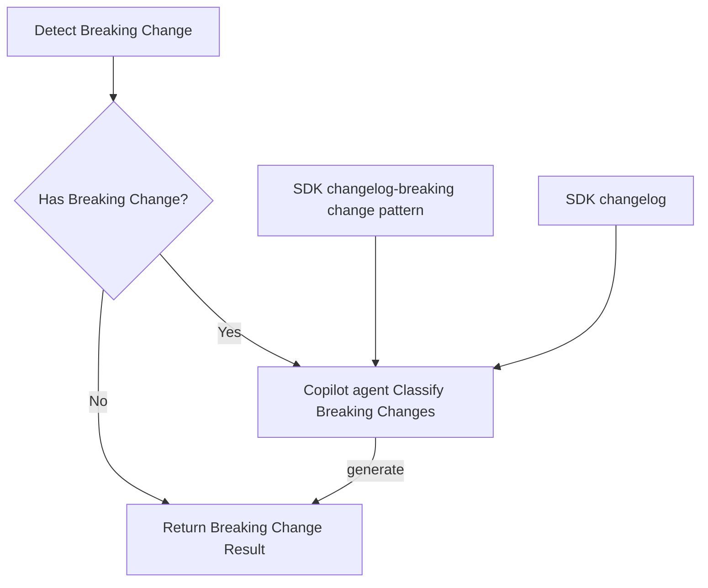
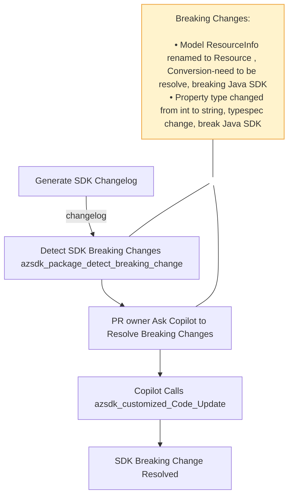

# Spec: [Stage Number and Name] - [Tool Name]

## Table of Contents

- [Spec: \[Stage Number and Name\] - \[Tool Name\]](#spec-stage-number-and-name---tool-name)
  - [Table of Contents](#table-of-contents)
  - [Definitions](#definitions)
  - [Background / Problem Statement](#background--problem-statement)
    - [Current State](#current-state)
    - [Why This Matters](#why-this-matters)
  - [Goals and Exceptions/Limitations](#goals-and-exceptionslimitations)
    - [Goals](#goals)
  - [Design Proposal](#design-proposal)
    - [Overview](#overview)
    - [Detailed Design](#detailed-design)
    - [Architecture Diagram](#architecture-diagram)
      - [Component 1: Breaking change detect](#component-1-breaking-change-detect)
      - [Component 2: Changelog-breaking change pattern](#component-2-changelog-breaking-change-pattern)
      - [Component 3: Breaking change classifier](#component-3-breaking-change-classifier)
    - [User Experience](#user-experience)
      - [Code Generation pipeline](#code-generation-pipeline)
      - [SDK breaking change resolve in Spec PR and Code PR](#sdk-breaking-change-resolve-in-spec-pr-and-code-pr)
  - [Agent Prompts](#agent-prompts)
    - [\[Detect breaking change for Go SDK\]](#detect-breaking-change-for-go-sdk)
  - [CLI Commands](#cli-commands)
    - [Package detect breaking change](#package-detect-breaking-change)

---

## Definitions

- **TypeSpec**: A language for describing cloud service APIs and generating other API description languages, client and service code, documentation, and other assets. TypeSpec provides highly extensible core language primitives that can describe API shapes common among REST, OpenAPI, GraphQL, gRPC, and other protocols. See [TypeSpec official documentation](https://typespec.io)

- **SDK Breaking change**: A change between SDK versions that modifies public API surface area or behavior in a way that can break existing customer code. In this spec, SDK breaking changes may be introduced by spec changes, emitter changes, or APIView conversion differences.
- **Breaking change category**: classify breaking changes to different category according to the root cause. Current categories: 
  - emitter change
  - conversion-by design
  - conversion-need resolve
  - spec change
  - unknown

---

## Background / Problem Statement

_Describe the problem you're solving and why it's important._

### Current State

Service teams and SDK teams spend significant manual effort detecting SDK breaking changes and mitigate them. It causes a lot time and also it is not be able to correctly detect all the breaking changes.

### Why This Matters

[Why should we invest time in solving this? What's the impact if we don't? Consider how users will have to switch between using the agent and the old way of doing things.]

---

## Goals and Exceptions/Limitations

### Goals

What are we trying to achieve with this design?

- [ ] detect and classify breaking changes according to the SDK breaking changes for each language, and identify which breaking change is resolvable.
- [ ] align with the breaking change policy for each language

## Design Proposal

_Provide a detailed explanation of your proposed solution._

### Overview

[High-level description of the approach]

### Detailed Design

A changelog-breakingchange pattern guide (e.g. https://github.com/Azure/azure-sdk-for-python/blob/main/doc/dev/mgmt/sdk-breaking-changes-guide.md) will service as the foundation for teach copilot agent to detect and classify breaking changes for a SDK. The existing TypeSpec code and the configuration will help agent to classify the breaking changes.

**Output Format**
```json
{
    "hasBreakingChange": true,
    "language": "java",
    "breakingchanges": [
        {
            "breakingchange": "model `ResourceInfo` is renamed to `Resource`",
            "category": "Conversion-need to be resolve"
        },
        {
            "breakingchange": "Type of property `Prop` has been changed from `string` to `int32`",
            "category": "typespec change"
        }
    ]
}
```

### Architecture Diagram



---
#### Component 1: Breaking change detect

detect package breaking changes and convert it as changelog.

**Summary of the detection mechanism**
| Language | Tool | Compares | Old Source | New Source |
|----------|------|----------|------------|-----------|
| **Go** | Custom Go AST diff (`exports`/`delta`/`report` packages) | Go exported symbols | GitHub release tag ZIP | Generated code |
| **Java (CI)** | `revapi-maven-plugin` | Java public API | Maven Central GA release | Locally built JAR |
| **Java (Sdk automation)** | `japicmp` (JarArchiveComparator) | JAR bytecode | Maven Central JAR | Locally built JAR |
| **.NET** | `Microsoft.DotNet.ApiCompat` MSBuild target | .NET assemblies | NuGet cached baseline DLL | Built DLL |
| **JS/TS** | API Extractor + `git diff` | `.api.md` review files | Git baseline | Generated review files |
| **Python** | `jsondiff` + AST/`inspect` introspection | JSON API reports | PyPI stable package | Current code |

#### Component 2: Changelog-breaking change pattern

This document describe which changelog pattern will cause breaking changes and also provide the root cause of the breaking changes.

e.g.
For python:
```
Paired removal and addition entries showing naming changes from words to numbers:

- Enum `Minute` deleted or renamed its member `ZERO`
- Enum `Minute` deleted or renamed its member `THIRTY`
- Enum `Minute` added member `ENUM_0`
- Enum `Minute` added member `ENUM_30`
Reason: Swagger automatically converts numeric names to words during code generation, while TypeSpec preserves the original naming. This affects all type names, including enums, models, and operations.

Spec Pattern:

Find the type definition by examining the names from the addition entries in the changelog (pattern: Enum '<type name>' added member xxx):

union Minute {
  int32,
  `0`: 0,
  `30`: 30,
}
Resolution:

Use client customization to restore the original names from the removal entries:

@@clientName(Minute.`0`, "ZERO", "python");
@@clientName(Minute.`30`, "THIRTY", "python");
```

#### Component 3: Breaking change classifier

Copilot Agent refer changelog-breakingchange pattern guide to classify the breaking changes.

Parse out the actually breaking changes and classify them into different category

**Breaking change category**
  - emitter change : e.g modeler4 build-in handle logic(e.g merge enum as one)
  - conversion-by design : e.g. the common model
  - conversion-need resolve
  - spec change
  - unknown

input: changelog
output:
```json
{
    "breakingchanges": [
        {
            "breakingchange": "model ResourceInfo is renamed to Resource",
            "category": "Conversion-need to be resolve",
        },
        {
            "breakingchange": "Property type changed from int to string",
            "category": "typespec change",
        }
    ]
}

```

---

### User Experience

```bash
# Example usage
azsdk package detect --changelog value --language go --tsp-config-path C:/dev/azure-rest-api-specs/specification/storage/Storage.Management/tspconfig.yaml
```

#### Code Generation pipeline
Flow:
1. Agent invoke `azsdk_package_generate_code` to generate sdk code
2. Agent invoke `azsdk_package_update_changelog_content` to update change log
3. Agent invoke `azsdk_package_detect_breaking_change` to detect and classify breaking changes
4. Label 'SDK-breakingchange' if breaking change detected for a language

#### SDK breaking change resolve in Spec PR and Code PR
prerequisite: Code Generation pipeline already run

prompt: @copilot resolve SDK breaking changes
Flow:


1. Agent invoke `azsdk_package_detect_breaking_change` to detect and classify breaking changes
2. User (PR owner) check the breaking changes, and choose breaking changes to resolve.
   Use prompt: @copilot resolve breaking changes: XXXXXXX
3. Agent invoke `azsdk_customized_code_update` to mitigate breaking changes.

## Agent Prompts

_Natural language prompts that users can provide to the AI agent (GitHub Copilot) to execute this tool or workflow. Include both simple and complex scenarios._

### [Detect breaking change for Go SDK]

**Prompt:**

```text
detect the breaking changes for Go SDK
```

**Expected Agent Activity:**

1. compare the changelog with `changelog-breakingchange` pattern for Go SDK
2. identify breaking changes and classify the breaking changes to different category

**Expect output**

---

## CLI Commands

_Direct command-line interface usage showing exact commands, options, and expected outputs._

### Package detect breaking change

**Command:**

```bash
azsdk package detect --changelog <sdk-change-log> --language <language> --tsp-config-path <path-to-tsp-config-file>

```

**Options:**

- `--changelog <value>`: (Required) The SDK changelog
- `--language <value>`: (Required) The SDK language
- `--tsp-config-path`: (Required) Path to the 'tspconfig.yaml' configuration file, it can be a local path or remote HTTPS URL

**Expected Output:**

```text
**breaking changes:**
- Model ResourceInfo renamed to Resource , Conversion-need to be resolve, breaking Java SDK
- Property type changed from int to string, typespec change, break Java SDK

```

**Error Cases:**

```text

✗ Error: Missing required option --changelog
  
Usage: azsdk package detect --changelog <sdk-change-log> --language <language> --tsp-config-path <path-to-tsp-config-file>
```

---
