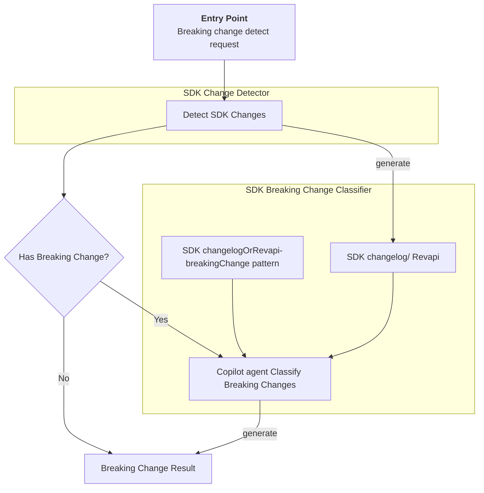
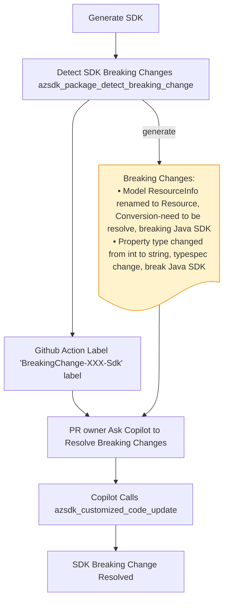

# Spec: [SDK Breaking Change Detecting] - [SDK Breaking Change Detector Tool]

## Table of Contents

- [Spec: \[SDK Breaking Change Detecting\] - \[SDK Breaking Change Detector Tool\]](#spec-sdk-breaking-change-detecting---sdk-breaking-change-detector-tool)
  - [Table of Contents](#table-of-contents)
  - [Definitions](#definitions)
  - [Background / Problem Statement](#background--problem-statement)
    - [Current State](#current-state)
    - [Why This Matters](#why-this-matters)
  - [Goals and Exceptions/Limitations](#goals-and-exceptionslimitations)
    - [Goals](#goals)
  - [Design Proposal](#design-proposal)
    - [Overview](#overview)
    - [Detailed Design](#detailed-design)
    - [Architecture Diagram](#architecture-diagram)
      - [Component 1: SDK change detector](#component-1-sdk-change-detector)
      - [Component 2: ChangelogOrRevapi-breakingChange pattern](#component-2-changelogorrevapi-breakingchange-pattern)
      - [Component 3: SDK Breaking change classifier](#component-3-sdk-breaking-change-classifier)
      - [Component 4: Breaking change Result](#component-4-breaking-change-result)
    - [User Experience](#user-experience)
    - [Scenarios for Using the Tool](#scenarios-for-using-the-tool)
      - [Scenario 1: Detect and resolve breaking change local](#scenario-1-detect-and-resolve-breaking-change-local)
      - [Scenario 2: SDK breaking change resolve in Spec PR and Code PR](#scenario-2-sdk-breaking-change-resolve-in-spec-pr-and-code-pr)
  - [Agent Prompts](#agent-prompts)
    - [\[Detect breaking change for Go SDK\]](#detect-breaking-change-for-go-sdk)
  - [CLI Commands](#cli-commands)
    - [Package detect breaking change](#package-detect-breaking-change)

---

## Definitions

- **TypeSpec**: A language for describing cloud service APIs and generating other API description languages, client and service code, documentation, and other assets. TypeSpec provides highly extensible core language primitives that can describe API shapes common among REST, OpenAPI, GraphQL, gRPC, and other protocols. See [TypeSpec official documentation](https://typespec.io)

- **SDK Breaking change**: A change between SDK versions that modifies public API surface area or behavior in a way that can break existing customer code. In this spec, SDK breaking changes may be introduced by spec changes, emitter changes, or APIView conversion differences.
- **Breaking change category**: classify breaking changes to different category according to the root cause. Current categories: 
  - emitter change
  - conversion-by design
  - conversion-need resolve
  - spec change
  - unknown

---

## Background / Problem Statement

### Current State

Service teams and SDK teams spend significant manual effort detecting SDK breaking changes and mitigate them. This process is time-consuming and still fails to reliably identify all breaking changes, leading to some being missed or incorrectly resolved. As a result, overall SDK quality is degraded.

### Why This Matters

**Impact on service API merge and SDK release experience**
- Identifying and mitigating SDK breaking changes is a significant challenge for service and Azure SDK teams. Manual analysis of SDK changes to detect breaking changes and develop consistent mitigations requires substantial effort and expertise.

**Cost of Not Solving This:**
- **Increased SDK or Spec Review Effort**: Service and Azure SDK teams spend significant time manually identifying breaking changes and developing mitigations.
- **Incorrect Breaking Change Detection**: Without automated detection, teams may miss breaking changes entirely or misclassify them, resulting in incomplete or incorrect mitigations.
- **Delayed API Spec Merge and SDK Release**: The time spent identifying and resolving breaking changes manually delays both API specification merges and SDK releases, impacting customer delivery timelines.

---

## Goals and Exceptions/Limitations

### Goals

What are we trying to achieve with this design?

- [ ] detect and classify breaking changes according to the SDK breaking changes policy for each language, and identify which breaking change is resolvable.
- [ ] align with the breaking change policy for each language

## Design Proposal

### Overview

This design covers the complete breaking change detection workflow and its core components:
- SDK change detector
- ChangelogOrRevapi-breakingChange pattern
- SDK breaking change classifier

### Detailed Design

**prerequist**:
The SDK has been generated and built successfully.

A changelog-breakingchange pattern guide (e.g. https://github.com/Azure/azure-sdk-for-python/blob/main/doc/dev/mgmt/sdk-breaking-changes-guide.md) will service as the foundation for teach copilot agent to detect and classify breaking changes for a SDK. The existing TypeSpec code and the configuration will help agent to classify the breaking changes.

**Output Format**

```json
{
    "hasBreakingChange": true,
    "language": "java",
    "breakingchanges": [
        {
            "breakingchange": "model `ResourceInfo` is renamed to `Resource`",
            "category": "Conversion-need to be resolve"
        },
        {
            "breakingchange": "Type of property `Prop` has been changed from `string` to `int32`",
            "category": "typespec change"
        }
    ]
}
```

### Architecture Diagram



---
#### Component 1: SDK change detector

Compare the package against the latest GA release to detect SDK changes. The output is a changelog (or Revapi report for Java) along with an overall assessment of whether the package introduces SDK breaking changes according to the language-specific breaking change policy.

**Summary of the detection mechanism**

| Language | Tool | Compares | Old Source | New Source |
|----------|------|----------|------------|-----------|
| **Go** | Custom Go AST diff (`exports`/`delta`/`report` packages) | Go exported symbols | GitHub release tag ZIP | Generated code |
| **Java (CI)** | `revapi-maven-plugin` | Java public API | Maven Central GA release | Locally built JAR |
| **Java (Sdk automation)** | `japicmp` (JarArchiveComparator) | JAR bytecode | Maven Central JAR | Locally built JAR |
| **.NET** | `Microsoft.DotNet.ApiCompat` MSBuild target | .NET assemblies | NuGet cached baseline DLL | Built DLL |
| **JS/TS** | API Extractor + `git diff` | `.api.md` review files | Git baseline | Generated review files |
| **Python** | `jsondiff` + AST/`inspect` introspection | JSON API reports | PyPI stable package | Current code |

**Input**:
SDK package

**Output**:

- change log or repapi
- 'hasBreakingChange': true/false

e.g.

```json
{
    "changes": "<change log or repapi markdown>",
    "hasBreakingChange": true
}
```

#### Component 2: ChangelogOrRevapi-breakingChange pattern

This document describe which changelog/revapi will cause breaking changes and also provide the root cause of the breaking changes.

Each pattern will contain four parts:

- changelog/revapi pattern
- Spec pattern (optional)
- Breaking
- Reason
- Resolution: if it cannot mitigate, just text "Cannot be resolved through client customizations."

e.g.
For python:

```md

## Naming Changes with Numbers

**changelog pattern**:

Paired removal and addition entries showing naming changes from words to numbers:

- Enum `Minute` deleted or renamed its member `ZERO`
- Enum `Minute` deleted or renamed its member `THIRTY`
- Enum `Minute` added member `ENUM_0`
- Enum `Minute` added member `ENUM_30`

Spec Pattern:

Find the type definition by examining the names from the addition entries in the changelog (pattern: Enum '<type name>' added member xxx):

union Minute {
  int32,
  `0`: 0,
  `30`: 30,
}

**Breaking**: The Enum member `ZERO` is renamed to `0`

**Reason**: Emitter change. Emitter from Swagger automatically converts numeric names to words during code generation, while Emitter from TypeSpec preserves the original naming. This affects all type names, including enums, models, and operations.

**Resolution**:

Use client customization to restore the original names from the removal entries:

@@clientName(Minute.`0`, "ZERO", "python");
@@clientName(Minute.`30`, "THIRTY", "python");
```

#### Component 3: SDK Breaking change classifier

Copilot Agent refer changelogOrRevapi-breakingchange pattern guide to analyze and classify the breaking changes.

Parse out the actually breaking changes and classify them into different category

**Breaking change category**
  - emitter change : e.g modeler4 build-in handle logic(e.g merge enum as one)
  - conversion-by design : e.g. the common model
  - conversion-need resolve
  - spec change
  - unknown

**input**:
changelog or Revapi

**output**:

```json
{
    "breakingchanges": [
        {
            "breakingchange": "model ResourceInfo is renamed to Resource",
            "category": "Conversion-need to be resolve",
        },
        {
            "breakingchange": "Property type changed from int to string",
            "category": "typespec change",
        }
    ]
}

```

#### Component 4: Breaking change Result

The result of the `azsdk_package_detect_breaking_change` tool. It provides an overall assessment of whether the package introduces breaking changes, along with details for each breaking change (breakingchange and category) if any are detected.
The result is JSON-formatted.

**No Breaking change**

```json
{
    "hasBreakingChange": false,
    "language": "java"
}
```

**Has Breaking changes**

```json
{
    "hasBreakingChange": true,
    "language": "java",
    "breakingchanges": [
        {
            "breakingchange": "model `ResourceInfo` is renamed to `Resource`",
            "category": "Conversion-need to be resolve"
        },
        {
            "breakingchange": "Type of property `Prop` has been changed from `string` to `int32`",
            "category": "typespec change"
        }
    ]
}
```

---

### User Experience

```bash
# Example usage
azsdk package detect-breaking-change --package-path <sdk-package-path> --language go --tsp-config-path C:/dev/azure-rest-api-specs/specification/storage/Storage.Management/tspconfig.yaml --generate-sdk false
```

### Scenarios for Using the Tool

**NOTE:** Following are two E2E scenario which 'azsdk_package_detect_breaking_change' tool will **take part in.**

#### Scenario 1: Detect and resolve breaking change local

Detect and resolve breaking changes in a local spec or SDK repository.

**Prerequisite:**
The local SDK repository and development environment are set up.

**Prompt:** Detect and resolve breaking changes for service webpubsub

Flow:

1. Agent invoke `azsdk_package_generate_code` to generate sdk code locally if the SDK is not generated.
2. Agent invoke `azsdk_package_detect_breaking_change` to detect and classify breaking changes
3. Agent list all the SDK breaking changes one-by-one:
    e.g. SDK breaking changes:
            1. model `ResourceInfo` is renamed to `Resource`, break Go and Java SDK
            2. Type of property `Prop` has been changed from `string` to `int32`, breaking Go SDK
4. Agent invoke `azsdk_customized_code_update` to mitigate breaking changes.

#### Scenario 2: SDK breaking change resolve in Spec PR and Code PR

prompt: @copilot resolve SDK breaking changes
Flow:



1. Agent invoke `azsdk_package_detect_breaking_change` to detect and classify breaking changes
2. Github Action will label 'BreakingChange-XXX-Sdk' to indicate which language SDK has breaking changes.
3. User (PR owner) check the breaking changes, and choose breaking changes to resolve.
   Use prompt: @copilot resolve breaking changes: XXXXXXX
4. Agent invoke `azsdk_customized_code_update` to mitigate breaking changes.

## Agent Prompts

### [Detect breaking change for Go SDK]

**Prompt:**

```text
detect the breaking changes for Go SDK of Webpubsub service
```

**Expected Agent Activity:**

1. detect SDK changes for the SDK package
2. compare the changelog with `changelog-breakingchange` pattern for Go SDK
3. identify breaking changes and classify the breaking changes to different category

**Expect output**
```json
{
    "hasBreakingChange": true,
    "language": "GO",
    "breakingchanges": [
        {
            "breakingchange": "model `ResourceInfo` is renamed to `Resource`",
            "category": "Conversion-need to be resolve"
        },
        {
            "breakingchange": "Type of property `Prop` has been changed from `string` to `int32`",
            "category": "typespec change"
        }
    ]
}
```

---

## CLI Commands

### Package detect breaking change

**Command:**

```bash
azsdk package detect-breaking-change --package-path <sdk-package-path> --language <language> --tsp-config-path <path-to-tsp-config-file> --generate-sdk <Ture/False>

```

**Options:**

- `--package-path <value>`: (Required) The SDK package path
- `--language <value>`: (optional) The SDK language
- `--tsp-config-path`: (Optional) Path to the 'tspconfig.yaml' configuration file, it can be a local path or remote HTTPS URL
- `--generate-sdk`: (Optional) indicate whether need to generate sdk. default is False

**Expected Output:**

```text
**breaking changes:**
- Model ResourceInfo renamed to Resource , Conversion-need to be resolve, breaking Java SDK
- Property type changed from int to string, typespec change, break Java SDK

```

**Error Cases:**

```text

✗ Error: Missing required option --package-path
  
Usage: azsdk package detect-breaking-change --package-path <sdk-package-path> --language <language> --tsp-config-path <path-to-tsp-config-file>
```

---
