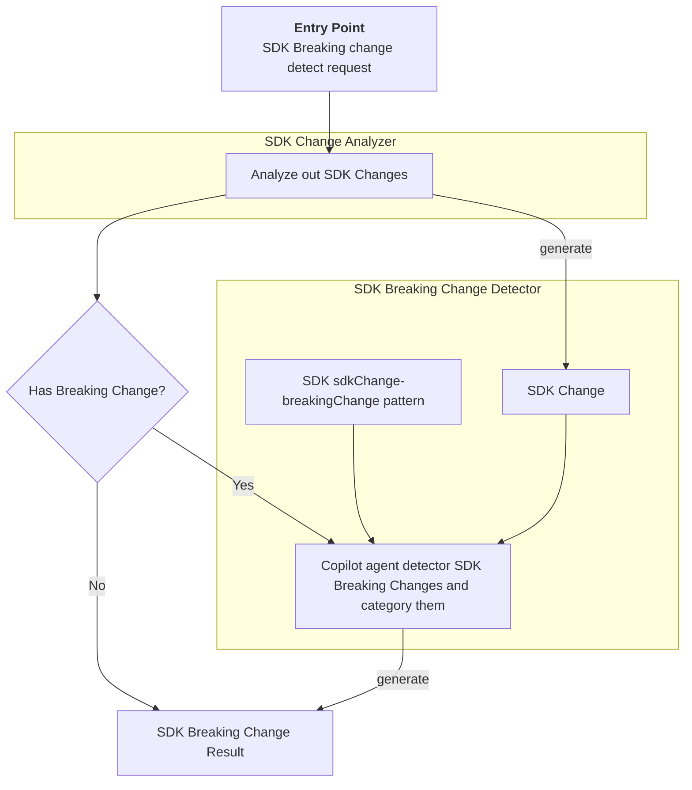
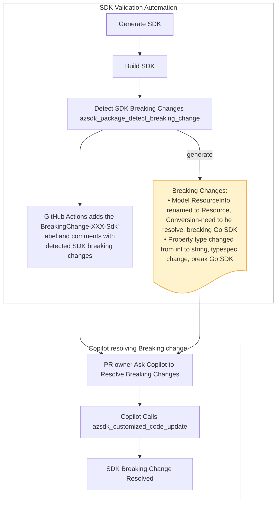

# Spec: [SDK Breaking Change Detecting] - [SDK Breaking Change Detector Tool]

## Table of Contents

- [Spec: \[SDK Breaking Change Detecting\] - \[SDK Breaking Change Detector Tool\]](#spec-sdk-breaking-change-detecting---sdk-breaking-change-detector-tool)
  - [Table of Contents](#table-of-contents)
  - [Definitions](#definitions)
  - [Background / Problem Statement](#background--problem-statement)
    - [Current State](#current-state)
      - [Current SDK breaking change Review Challenge](#current-sdk-breaking-change-review-challenge)
      - [Inefficient SDK breaking change mitigation workflow](#inefficient-sdk-breaking-change-mitigation-workflow)
      - [Delayed Spec PR merge and SDK release](#delayed-spec-pr-merge-and-sdk-release)
    - [Why This Matters](#why-this-matters)
  - [Goals and Exceptions/Limitations](#goals-and-exceptionslimitations)
    - [Goals](#goals)
      - [Language-Specific Limitations](#language-specific-limitations)
  - [Design Proposal](#design-proposal)
    - [Overview](#overview)
    - [Detailed Design](#detailed-design)
    - [Architecture Diagram](#architecture-diagram)
      - [Component 1: SDK change Analyzer](#component-1-sdk-change-analyzer)
      - [Component 2: SDK Breaking change detector](#component-2-sdk-breaking-change-detector)
    - [User Experience](#user-experience)
    - [Scenarios for Using the Tool](#scenarios-for-using-the-tool)
      - [Scenario 1: Detect and resolve SDK breaking change local](#scenario-1-detect-and-resolve-sdk-breaking-change-local)
      - [Scenario 2: Spec PR automation pipeline and SDK breaking change resolve](#scenario-2-spec-pr-automation-pipeline-and-sdk-breaking-change-resolve)
      - [Scenario 3: When release SDK, Resolve SDK breaking changes in SDK repo PR](#scenario-3-when-release-sdk-resolve-sdk-breaking-changes-in-sdk-repo-pr)
  - [Agent Prompts](#agent-prompts)
    - [\[Detect breaking change for Go SDK\]](#detect-breaking-change-for-go-sdk)
  - [CLI Commands](#cli-commands)
    - [Package detect breaking change](#package-detect-breaking-change)

---

## Definitions

- **TypeSpec**: A language for describing cloud service APIs and generating other API description languages, client and service code, documentation, and other assets. TypeSpec provides highly extensible core language primitives that can describe API shapes common among REST, OpenAPI, GraphQL, gRPC, and other protocols. See [TypeSpec official documentation](https://typespec.io)

- **SDK Breaking change**: A change between SDK versions that modifies public API surface area or behavior in a way that can break existing customer code. In this spec, SDK breaking changes may be introduced by spec changes, emitter changes, or APIView conversion differences.
- **SDK Breaking change category**: classify SDK breaking changes to different category according to the root cause. Current categories: 
  - emitter change
  - conversion-by design
  - conversion-need resolve
  - spec change
  - unknown

---

## Background / Problem Statement

### Current State

#### Current SDK breaking change Review Challenge

The current SDK breaking change review process places a heavy burden on SDK owners. For every Spec PR, SDK reviewers are required to manually go through all SDK changes to detect SDK breaking changes and determine their root causes. In practice, this is difficult and time-consuming because the sdk change output does not clearly explain what actual SDK breaking change is and why a breaking change happened.

- **Hard to detect SDK breaking change and its root cause**
    SDK owners must manually analyze individual sdk change entries and correlate multiple entries to identify SDK breaking changes and map them back to underlying TypeSpec changes, emitter behavior, or conversion differences. This requires deep cross-layer knowledge and often involves guesswork, making it difficult to quickly pinpoint both the actual SDK breaking change and its root cause.

    **Example 1:**
    if one entry shows `struct A` was removed and another shows `struct B` was added, additional entries — such as an operation's parameter type changing from `A` to `B` — must be examined together to correctly conclude that model `A` was renamed to `B`. Without this correlated analysis, an SDK owner may incorrectly conclude that the breaking change is simply "model A was removed."

    **Example 2:**
    this is sdk change entry of GO SDK: Function `*AccountsClient.BeginUpdate` parameter(s) have been changed from `(context.Context, string, AccountUpdateRequest, *AccountsClientBeginUpdateOptions)` to `(context.Context, string, AccountPatch, *AccountsClientBeginUpdateOptions)`
    From this entry alone, it is difficult to determine which interface and operation have the breaking change; accurate interpretation requires considering Go SDK language-specific convention rules to identify that this maps to the LRO `Update` operation under the `Account` interface. Without correctly detect the breaking target and root cause, SDK owner cannot conduct a mitigation to resolve the breaking change.

- **Time-consuming manual review process**
    The current process requires reviewing each sdk change item individually and correlating multiple entries to understand a single SDK breaking change. This significantly slows down PR review and increases the likelihood of missing or misinterpreting issues.

#### Inefficient SDK breaking change mitigation workflow

Today, SDK breaking change mitigation is not effectively integrated into the review process and is often deferred to later stages.

- **Approval without actionable mitigation guidance**
    In practice, SDK owners typically approve Spec PRs as long as the detected breaking changes are understood and considered “expected.” However, determining how to mitigate these breaking changes at review time requires significant additional effort. This makes it inefficient for reviewers to go beyond validation and proactively provide mitigation guidance during the review phase.

- **Mitigation happens too late (during SDK release)**
    Because mitigation is not addressed early, service teams often only tackle SDK breaking changes when they begin SDK generation and release workflows. At this point, resolving issues requires revisiting the TypeSpec definitions and reworking prior decisions.

- **Back-and-forth across repos and stages**
    This leads to repeated iteration between Spec/TypeSpec and SDK repos — updating TypeSpec, regenerating SDKs, and re-validating changes. The lack of early, guided mitigation results in a fragmented workflow and unnecessary back-and-forth across stages.

#### Delayed Spec PR merge and SDK release

Reviewing and resolving SDK breaking changes is a required step for Spec PR merges. Because detecting and resolving SDK breaking changes is complex and time-consuming, the Spec PR merge lifecycle is extended, which delays both Spec merges and follow-up SDK release processes.

### Why This Matters

**Impact on service API merge and SDK release experience:**

- Identifying and mitigating SDK breaking changes is a significant challenge for service and Azure SDK teams. Manual analysis of SDK changes to detect breaking changes and develop consistent mitigations requires substantial effort and expertise.
- Reducing the time required to review and resolve SDK breaking changes shortens the overall API merge and SDK release lifecycle.

**Impact on SDK breaking change mitigation workflow:**

- By using this tool to detect actual SDK breaking changes, identify their root causes, and provide actionable mitigation plans, teams can address breaking changes earlier and avoid back-and-forth across repos and stages.

---

## Goals and Exceptions/Limitations

### Goals

This tool detects SDK breaks from SDK package after SDK generation and build, and one major scenario is using it during the spec PR validation pipeline.

What are we trying to achieve with this design?

- [ ] Provide structured sdk change analysis that correlates entries to detect actual SDK breaking changes and explains the root cause of each SDK breaking change by mapping it back to TypeSpec, emitter behavior, or conversion differences.
- [ ] Generate actionable mitigation suggestions for each SDK breaking change, including concrete guidance on how to resolve it during the authoring phase and the Spec pr phase.
- [ ] Enable early mitigation by shifting SDK breaking change detection and resolution into the Spec authoring and PR review process instead of deferring to SDK release.
- [ ] Integrate SDK breaking change detection, analysis, and mitigation guidance into both Spec PR and SDK PR workflows to reduce manual effort and avoid late-stage rework.

#### Language-Specific Limitations

This tool will support Java, JavaScript, Python, Go and .NET SDK.

| Language   | supported |
|------------|------------|
| .NET       | Yes   |
| Java       | Yes   |
| JavaScript | Yes   |
| Python     | Yes   |
| Go         | Yes   |

---

## Design Proposal

### Overview

This design covers the complete SDK breaking change detection workflow for an SDK package and its core components:

- SDK change analyzer
- SDK breaking change detector

### Detailed Design

**Prerequisite**:
The SDK has been generated and built successfully.

A sdkChange-breakingchange pattern guide (e.g. https://github.com/Azure/azure-sdk-for-python/blob/main/doc/dev/mgmt/sdk-breaking-changes-guide.md) will service as the foundation for teach copilot agent to detect and classify SDK breaking changes for a SDK. The existing TypeSpec code and the configuration will help agent to classify the SDK breaking changes.

**Output Format:**

The result is JSON-formatted.

```json
{
    "hasBreakingChange": true,
    "language": "java",
    "breakingchanges": [
        {
            "breakingchange": "model `ResourceInfo` is renamed to `Resource`",
            "category": "Conversion-need to be resolve",
            "mitigation": "Use client customization to rename ```tsp\n@@clientName(Resource, \"ResourceInfo\", \"go\");```"
        },
        {
            "breakingchange": "Type of property `Prop` of model `ContainerRegistry` has been changed from `string` to `int32`",
            "category": "typespec change",
            "mitigation": "Use `@@alternateType` to change the property type back to the constant string. ```tsp\n@@alternateType(ContainerRegistry.Prop, string, \"go\");```"
        }
    ]
}
```

The result of the `azsdk_package_detect_breaking_change` tool. It provides an overall assessment of whether the package introduces SDK breaking changes, along with details for each breaking change (breaking-change and category) if any are detected.

**No Breaking change:**

```json
{
    "hasBreakingChange": false,
    "language": "java"
}
```

**Has Breaking changes:**

```json
{
    "hasBreakingChange": true,
    "language": "java",
    "breakingchanges": [
        {
            "breakingchange": "model `ResourceInfo` is renamed to `Resource`",
            "category": "Conversion-need to be resolve",
            "mitigation": "Use client customization to rename ```tsp\n@@clientName(Resource, \"ResourceInfo\", \"go\");```"
        },
        {
            "breakingchange": "Type of property `Prop` has been changed from `string` to `int32`",
            "category": "typespec change",
            "mitigation": "Locate the model property and use `@@alternateType` to change the property type back to the constant string. ```tsp\n@@alternateType(ContainerRegistry.Prop, string, \"go\");```"
        }
    ]
}
```

### Architecture Diagram



---

#### Component 1: SDK change Analyzer

Compare the package against the latest GA release to get SDK changes. The output are SDK changes along with an overall assessment of whether the package introduces SDK breaking changes according to the language-specific breaking change policy.

Each language SDK implements an SDK change comparator(command or script) that compares the current package against the latest GA release. The SDK breaking change detection MCP tool invokes these per-language comparator to retrieve the SDK changes for further analysis.

**🔔 Note:**
Each language SDK already has a tool or script that generates sdk changes. We only need to integrate these into our MCP tool as the SDK change analyzer and output SDK changes for downstream analysis.

**Summary of the detection mechanism:**

| Language | Tool | Compares | Old Source | New Source | management-plane or data-plane| limitation|
|----------|------|----------|------------|-----------|--------|-----------|
| **Go** | Custom Go AST diff (`exports`/`delta`/`report` packages) | Go exported symbols | GitHub release tag ZIP | Generated code | both | No |
| **Java (CI)** | `revapi-maven-plugin` | Java public API | Maven Central GA release | Locally built JAR | both | No |
| **Java (Sdk automation)** | `japicmp` (JarArchiveComparator) | JAR bytecode | Maven Central JAR | Locally built JAR | both | No |
| **.NET** | `Microsoft.DotNet.ApiCompat` MSBuild target | .NET assemblies | NuGet cached baseline DLL | Built DLL | both | only report breaking changes |
| **JS/TS** | API Extractor + `git diff` | `.api.md` review files | Git baseline | Generated review files | both | No |
| **Python** | `jsondiff` + AST/`inspect` introspection | JSON API reports | PyPI stable package | Current code | both | Need twick a litter for data-plane |

Each tool of language SDKs is suitable for both management-plane SDK and data-plane SDK.

Limitation:

- Net: Microsoft.DoNet.ApiCompat only report breaking changes, not all SDK changes.
- Python: the tool need to be twicked a litter for data-plane

**Input**:
SDK package

**Output**:

- SDK changes: the string of sdk changes markdown. (see following sdk change markdown schema)
- 'hasBreakingChange': true/false

e.g.

```json
{
    "changes": "<change log markdown>",
    "hasBreakingChange": true
}
```

**🔔 Note:**

**Sdk change markdown schema:**

```markdown
### Breaking Changes

<list of breaking changes with bullet>

### Features Added

<list of features added with bullet>
```

e.g.

```markdown
### Breaking Changes

- Struct `ResourceInfo` has been removed
- Struct `ResourceInfoList` has been removed
- Field `ResourceInfo` of struct `ClientCreateOrUpdateResponse` has been removed
- Field `ResourceInfo` of struct `ClientGetResponse` has been removed
- Field `ResourceInfoList` of struct `ClientListByResourceGroupResponse` has been removed
- Field `ResourceInfoList` of struct `ClientListBySubscriptionResponse` has been removed
- Field `ResourceInfo` of struct `ClientUpdateResponse` has been removed
- Function `*Client.BeginCreateOrUpdate` parameter(s) have been changed from `(ctx context.Context, resourceGroupName string, resourceName string, parameters ResourceInfo, options *ClientBeginCreateOrUpdateOptions)` to `(ctx context.Context, resourceGroupName string, resourceName string, parameters Resource, options *ClientBeginCreateOrUpdateOptions)`
- Function `*Client.BeginUpdate` parameter(s) have been changed from `(ctx context.Context, resourceGroupName string, resourceName string, parameters ResourceInfo, options *ClientBeginUpdateOptions)` to `(ctx context.Context, resourceGroupName string, resourceName string, parameters Resource, options *ClientBeginUpdateOptions)`
- Function `*HubsClient.BeginCreateOrUpdate` parameter(s) have been changed from `(ctx context.Context, hubName string, resourceGroupName string, resourceName string, parameters Hub, options *HubsClientBeginCreateOrUpdateOptions)` to `(ctx context.Context, resourceGroupName string, resourceName string, hubName string, parameters Hub, options *HubsClientBeginCreateOrUpdateOptions)`
- Function `*HubsClient.BeginDelete` parameter(s) have been changed from `(ctx context.Context, hubName string, resourceGroupName string, resourceName string, options *HubsClientBeginDeleteOptions)` to `(ctx context.Context, resourceGroupName string, resourceName string, hubName string, options *HubsClientBeginDeleteOptions)`
- Function `*HubsClient.Get` parameter(s) have been changed from `(ctx context.Context, hubName string, resourceGroupName string, resourceName string, options *HubsClientGetOptions)` to `(ctx context.Context, resourceGroupName string, resourceName string, hubName string, options *HubsClientGetOptions)`
... (additional breaking-change entries omitted)

### Features Added

- New struct `ApplicationFirewallSettings`
- New struct `GroupPresenceEventFilters`
- New struct `Resource`
- New struct `ResourceList`
- New struct `ThrottleByJwtCustomClaimRule`
- New struct `ThrottleByJwtSignatureRule`
- New struct `ThrottleByUserIDRule`
- New struct `TrafficThrottleByJwtCustomClaimRule`
- New struct `TrafficThrottleByJwtSignatureRule`
- New struct `TrafficThrottleByUserIDRule`
... (additional features-added entries omitted)

```

#### Component 2: SDK Breaking change detector

Copilot Agent refer `sdkChange-breakingchange pattern` document to detect the SDK breaking changes, category these SDK breaking changes and mitigation suggestion if it can be mitigated by TypeSpec customization.

Parse out the actually SDK breaking changes and category them into different categories according to the SDK breaking change root cause.

**SDK Breaking change category:**

- emitter change : e.g modeler4 build-in handle logic(e.g merge enum as one)
- conversion-by design : e.g. the common model
- conversion-need resolve
- spec change
- unknown

**input**:

SDK changes

**output**:

```json
{
    "breakingchanges": [
        {
            "breakingchange": "model ResourceInfo is renamed to Resource",
            "category": "Conversion-need to be resolve",
            "mitigation": "Use client customization to rename ```tsp\n@@clientName(Resource, \"ResourceInfo\", \"go\");```"
        },
        {
            "breakingchange": "Property type changed from int to string",
            "category": "typespec change",
            "mitigation": "Locate the model property and use `@@alternateType` to change the property type back to the constant string. ```tsp\n@@alternateType(ContainerRegistry.Prop, string, \"go\");```"
        }
    ]
}

```

**sdkChange-breakingChange pattern document:**

This document describe which sdk change will cause SDK breaking changes and also provide the root cause of the SDK breaking changes.
Each language SDK will develop their only sdkChange-breakingchange pattern document.

Each pattern will contain four parts:

- sdk change pattern
- Spec pattern (optional)
- Breaking
- Reason
- Resolution: if it cannot mitigate, just text "Cannot be resolved through client customizations."

e.g.
For python:

```md

## Naming Changes with Numbers

**sdk change pattern**:

Paired removal and addition entries showing naming changes from words to numbers:

- Enum `Minute` deleted or renamed its member `ZERO`
- Enum `Minute` deleted or renamed its member `THIRTY`
- Enum `Minute` added member `ENUM_0`
- Enum `Minute` added member `ENUM_30`

Spec Pattern:

Find the type definition by examining the names from the addition entries in the sdk change (pattern: Enum '<type name>' added member xxx):

union Minute {
  int32,
  `0`: 0,
  `30`: 30,
}

**Breaking**: The Enum member `ZERO` is renamed to `0`

**Reason**: Emitter change. Emitter from Swagger automatically converts numeric names to words during code generation, while Emitter from TypeSpec preserves the original naming. This affects all type names, including enums, models, and operations.

**Resolution**:

Use client customization to restore the original names from the removal entries:

@@clientName(Minute.`0`, "ZERO", "python");
@@clientName(Minute.`30`, "THIRTY", "python");
```

---

### User Experience

```bash
# Example usage
azsdk package detect-breaking-change --package-path <sdk-package-path> --tsp-config-path <tsp-config-yaml-file-path>
```

### Scenarios for Using the Tool

**🔔 NOTE:** Following are three E2E scenario which 'azsdk_package_detect_breaking_change' tool will **take part in.**

#### Scenario 1: Detect and resolve SDK breaking change local

Detect and resolve SDK breaking changes in a local spec repository.

**Prerequisite:**
The local SDK repository and development environment are set up.

**Prompt:** Detect and resolve SDK breaking changes for service webpubsub

Flow:

1. Agent invoke `azsdk_package_generate_code` to generate sdk code locally if the SDK is not generated.
2. Agent invoke `azsdk_package_build_code` to build sdk
3. Agent invoke `azsdk_package_detect_breaking_change` to detect and classify breaking changes
4. Agent list all the SDK breaking changes one-by-one:
    e.g. SDK breaking changes:
            1. model `ResourceInfo` is renamed to `Resource`, break Go and Java SDK
            2. Type of property `Prop` has been changed from `string` to `int32`, breaking Go SDK
5. Agent invoke `azsdk_customized_code_update` to mitigate breaking changes.

#### Scenario 2: Spec PR automation pipeline and SDK breaking change resolve

Shif-left: Integrate SDK breaking change detection, analysis, and mitigation guidance into Spec PR to reduce manual effort and avoid late-stage rework.

Flow:
The end-to-end flow contains two stages:

- SDK Validation Automation stage
- Copilot Breaking Change Resolution stage

SDK breaking change detection is one step in the SDK Validation Automation pipeline.



1. The SDK validation pipeline runs the SDK generation tool command 'azsdk package generate'.
2. The SDK validation pipeline runs the SDK build tool command 'azsdk package build'.
3. The SDK validation pipeline runs the SDK Breaking Change Detector tool command 'azsdk package detect-breaking-change' (defined in this document) to detect and classify breaking changes.
4. GitHub Actions adds the 'BreakingChange-XXX-Sdk' label to indicate which language SDK has breaking changes and displays the detected breaking changes.
5. The PR owner reviews the detected breaking changes and selects which ones to resolve.
    Use prompt: @copilot resolve breaking changes: XXXXXXX
6. Copilot invokes 'azsdk_customized_code_update' to mitigate the selected breaking changes.

    When resolving SDK breaking changes requires TypeSpec customization (updating client.tsp), a customization PR is filed against the source branch of the Spec PR. The PR owner reviews and merges the customization PR. After it is merged, the original Spec PR is refreshed to include the customization.

    **Open question:**

    Q: If resolving breaking changes requires SDK code customization (updating SDK source code), should we file an SDK PR to refresh the SDK now, or defer SDK code customization to a later SDK release?

    A: The main branch in the SDK repo must stay aligned with the released SDK, so we cannot refresh SDK code every time the Spec is updated. Therefore, in the Spec PR workflow, SDK code customization is deferred to a later SDK release. As a result, there is a **known limitation**: Spec PR workflows do not refresh SDK code, so if mitigation goes beyond the Spec PR (for example, SDK source changes), the current design cannot fully resolve it within the Spec PR flow. It resolves only breaking changes that can be handled through TypeSpec customization, and defers code-only mitigations and build failures caused by TypeSpec customization to the SDK PR workflow.

    **known limitation**
    
    The `azsdk_customized_code_update` tool only support local scenario. More broadly, azsdk-cli MCP tools (for example, `azsdk_package_generate_code` and `azsdk_customized_code_update`) currently support only local scenarios and do not support remote scenarios. Because of this limitation, Copilot cannot invoke these MCP tools directly in remote workflows.

    **Solution**: We will support remote experiences at the workflow/skill layer, not within MCP tools. MCP tools should validate prerequisites and return clear next steps. Skills can explicitly orchestrate repository cloning with user awareness, then invoke MCP tools using local paths.

The PR owner merge the `client.tsp` changes made in step 6. After the spec PR is updated, the SDK validation pipeline is triggered again. This flow is repeated until no SDK breaking changes are reported, either because the breaking changes have been resolved or explicitly suppressed. The PR owner then adds the `BreakingChange-XXX-sdk-approved` label, and the spec PR is ready to merge.

#### Scenario 3: When release SDK, Resolve SDK breaking changes in SDK repo PR

SDK owner comment: @copilot detect and resolve breaking changes

**Expected Agent Activity:**

1. Copilot Agent invoke `azsdk_package_detect_breaking_change` to detect and classify breaking changes
2. Copilot Agent list all the SDK breaking changes one-by-one:
    e.g. SDK breaking changes:
            1. model `ResourceInfo` is renamed to `Resource`, break Go and Java SDK
            2. Type of property `Prop` has been changed from `string` to `int32`, breaking Go SDK
3. Copilot Agent invoke `azsdk_customized_code_update` to mitigate breaking changes.

When resolving SDK breaking changes requires TypeSpec updates, a Spec PR is filed in the spec repository. The SDK PR is refreshed only after that Spec PR is merged, and the SDK breaking changes are then resolved.

After SDK breaking change detection and resolution are enabled in Spec PR workflows, overall TypeSpec quality improves, and cases that require TypeSpec updates to resolve breaking changes become rare.

## Agent Prompts

### [Detect breaking change for Go SDK]

**Prompt:**

```text
detect the breaking changes for Go SDK of Webpubsub service
```

**Expected Agent Activity:**

1. detect SDK changes for the SDK package
2. compare the sdk change with `sdkChange-breakingchange` pattern for Go SDK
3. identify breaking changes and classify the breaking changes to different category

**Expect output:**

```json
{
    "hasBreakingChange": true,
    "language": "GO",
    "breakingchanges": [
        {
            "breakingchange": "model `ResourceInfo` is renamed to `Resource`",
            "category": "Conversion-need to be resolve"
        },
        {
            "breakingchange": "Type of property `Prop` has been changed from `string` to `int32`",
            "category": "typespec change"
        }
    ]
}
```

---

## CLI Commands

### Package detect breaking change

**Command:**

```bash
azsdk package detect-breaking-change --package-path <sdk-package-path> --tsp-config-path <path-to-tsp-config-file>

```

**Options:**

- `--package-path <value>`: (Required) The SDK package path
- `--tsp-config-path`: (Optional) Path to the 'tspconfig.yaml' configuration file, it can be a local path or remote HTTPS URL

**Expected Output:**

```text
**breaking changes:**
- Model ResourceInfo renamed to Resource , Conversion-need to be resolve, breaking Java SDK
- Property type changed from int to string, typespec change, break Java SDK

```

**Error Cases:**

```text

✗ Error: Missing required option --package-path
  
Usage: azsdk package detect-breaking-change --package-path <sdk-package-path> --language <language> --tsp-config-path <path-to-tsp-config-file>
```

---
