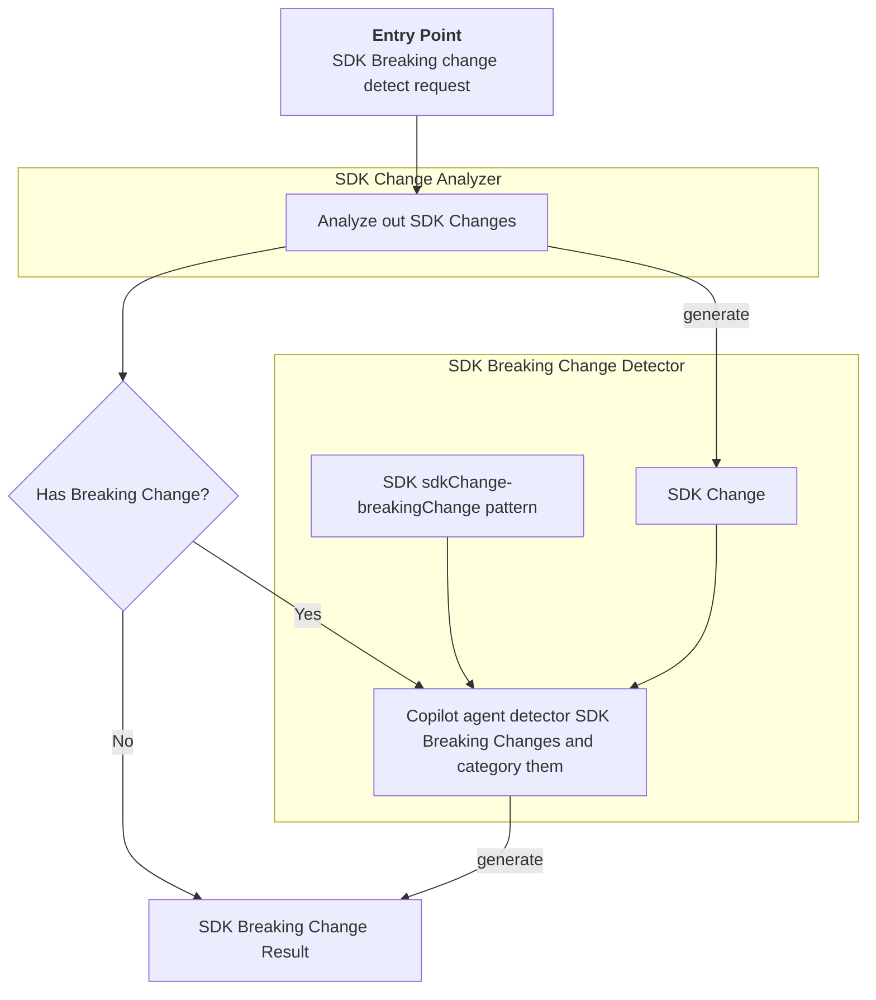
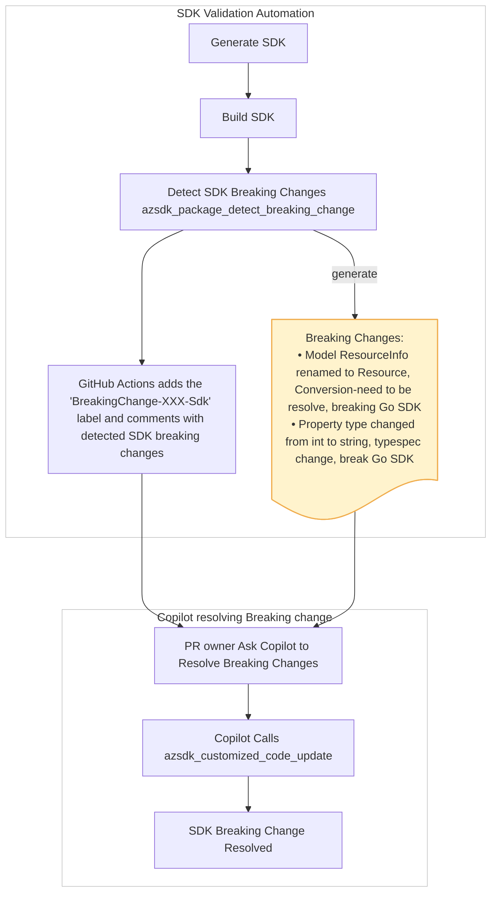

# Spec: [SDK Breaking Change Detecting] - [SDK Breaking Change Detector Tool]

## Table of Contents

- [Spec: \[SDK Breaking Change Detecting\] - \[SDK Breaking Change Detector Tool\]](#spec-sdk-breaking-change-detecting---sdk-breaking-change-detector-tool)
  - [Table of Contents](#table-of-contents)
  - [Definitions](#definitions)
  - [Background / Problem Statement](#background--problem-statement)
    - [Current State](#current-state)
      - [Current SDK breaking change Review Challenge](#current-sdk-breaking-change-review-challenge)
      - [Inefficient SDK breaking change mitigation workflow](#inefficient-sdk-breaking-change-mitigation-workflow)
      - [Delayed Spec PR merge and SDK release](#delayed-spec-pr-merge-and-sdk-release)
    - [Detect SDK breaking changes from TypeSpec is not 100% reliable](#detect-sdk-breaking-changes-from-typespec-is-not-100-reliable)
    - [Why This Matters](#why-this-matters)
  - [Goals and Exceptions/Limitations](#goals-and-exceptionslimitations)
    - [Goals](#goals)
  - [Design Proposal](#design-proposal)
    - [Overview](#overview)
    - [Detailed Design](#detailed-design)
    - [Architecture Diagram](#architecture-diagram)
      - [Component 1: SDK change Analyzer](#component-1-sdk-change-analyzer)
      - [Component 2: SDK Breaking change detector](#component-2-sdk-breaking-change-detector)
    - [User Experience](#user-experience)
    - [Scenarios for Using the Tool](#scenarios-for-using-the-tool)
      - [Scenario 1: Detect and resolve SDK breaking change local](#scenario-1-detect-and-resolve-sdk-breaking-change-local)
      - [Scenario 2: Spec PR automation pipeline and SDK breaking change resolve](#scenario-2-spec-pr-automation-pipeline-and-sdk-breaking-change-resolve)
      - [Scenario 3: When release SDK, Resolve SDK breaking changes in SDK repo PR](#scenario-3-when-release-sdk-resolve-sdk-breaking-changes-in-sdk-repo-pr)
  - [Agent Prompts](#agent-prompts)
    - [\[Detect breaking change for Go SDK\]](#detect-breaking-change-for-go-sdk)
  - [CLI Commands](#cli-commands)
    - [Package detect breaking change](#package-detect-breaking-change)
  - [Open Question](#open-question)

---

## Definitions

- **TypeSpec**: A language for describing cloud service APIs and generating other API description languages, client and service code, documentation, and other assets. TypeSpec provides highly extensible core language primitives that can describe API shapes common among REST, OpenAPI, GraphQL, gRPC, and other protocols. See [TypeSpec official documentation](https://typespec.io)

- **SDK Breaking change**: A change between SDK versions that modifies public API surface area or behavior in a way that can break existing customer code. In this spec, SDK breaking changes may be introduced by spec changes, emitter changes, or APIView conversion differences.
- **SDK Breaking change category**: classify SDK breaking changes to different category according to the root cause. Current categories: 
  - emitter change
  - conversion-by design
  - conversion-need resolve
  - spec change
  - unknown

---

## Background / Problem Statement

### Current State

#### Current SDK breaking change Review Challenge

The current SDK breaking change review process places a heavy burden on SDK owners. For every Spec PR, SDK reviewers are required to manually go through all SDK changes to detect SDK breaking changes and determine their root causes. In practice, this is difficult and time-consuming because the sdk change output does not clearly explain what actual SDK breaking change is and why a breaking change happened.

- **Hard to detect SDK breaking change and its root cause**
    SDK owners must manually analyze individual sdk change entries and correlate multiple entries to identify SDK breaking changes and map them back to underlying TypeSpec changes, emitter behavior, or conversion differences. This requires deep cross-layer knowledge and often involves guesswork, making it difficult to quickly pinpoint both the actual SDK breaking change and its root cause.

    **Example 1:**
    if one entry shows `struct A` was removed and another shows `struct B` was added, additional entries — such as an operation's parameter type changing from `A` to `B` — must be examined together to correctly conclude that model `A` was renamed to `B`. Without this correlated analysis, an SDK owner may incorrectly conclude that the breaking change is simply "model A was removed."

    **Example 2:**
    this is sdk change entry of GO SDK: Function `*AccountsClient.BeginUpdate` parameter(s) have been changed from `(context.Context, string, AccountUpdateRequest, *AccountsClientBeginUpdateOptions)` to `(context.Context, string, AccountPatch, *AccountsClientBeginUpdateOptions)`
    From this entry alone, it is difficult to determine which interface and operation have the breaking change; accurate interpretation requires considering Go SDK language-specific convention rules to identify that this maps to the LRO `Update` operation under the `Account` interface. Without correctly detect the breaking target and root cause, SDK owner cannot conduct a mitigation to resolve the breaking change.

- **Time-consuming manual review process**
    The current process requires reviewing each sdk change item individually and correlating multiple entries to understand a single SDK breaking change. This significantly slows down PR review and increases the likelihood of missing or misinterpreting issues.

#### Inefficient SDK breaking change mitigation workflow

Today, SDK breaking change mitigation is not effectively integrated into the review process and is often deferred to later stages.

- **Approval without actionable mitigation guidance**
    In practice, SDK owners typically approve Spec PRs as long as the detected breaking changes are understood and considered “expected.” However, determining how to mitigate these breaking changes at review time requires significant additional effort. This makes it inefficient for reviewers to go beyond validation and proactively provide mitigation guidance during the review phase.

- **Mitigation happens too late (during SDK release)**
    Because mitigation is not addressed early, service teams often only tackle SDK breaking changes when they begin SDK generation and release workflows. At this point, resolving issues requires revisiting the TypeSpec definitions and reworking prior decisions.

- **Back-and-forth across repos and stages**
    This leads to repeated iteration between Spec/TypeSpec and SDK repos — updating TypeSpec, regenerating SDKs, and re-validating changes. The lack of early, guided mitigation results in a fragmented workflow and unnecessary back-and-forth across stages.

#### Delayed Spec PR merge and SDK release

Reviewing and resolving SDK breaking changes is a required step for Spec PR merges. Because detecting and resolving SDK breaking changes is complex and time-consuming, the Spec PR merge lifecycle is extended, which delays both Spec merges and follow-up SDK release processes.

### Detect SDK breaking changes from TypeSpec is not 100% reliable

Detecting SDK breaking changes directly from TypeSpec is helpful, but it is not fully reliable because a TypeSpec change only becomes an SDK breaking change after the API is generated and released. If the changed API has not been released yet, it is not a breaking change in the SDK sense, even if the generated SDK surface would differ from a previous build. In addition, the released SDK version is not a 1:1 mapping to the API version, so we cannot always determine which TypeSpec commit the GA SDK was based on and compare against the exact TypeSpec revision that produced the latest release to get the real TypeSpec change.
In the spec authoring phase, we warn about potential SDK breaking changes, but we do not automatically force mitigation. It is the SDK owner's decision whether to mitigate the breaking change or accept it.

### Why This Matters

**Impact on service API merge and SDK release experience:**

- Identifying and mitigating SDK breaking changes is a significant challenge for service and Azure SDK teams. Manual analysis of SDK changes to detect breaking changes and develop consistent mitigations requires substantial effort and expertise.
- Reducing the time required to review and resolve SDK breaking changes shortens the overall API merge and SDK release lifecycle.

**Impact on SDK breaking change mitigation workflow:**

- By using this tool to detect actual SDK breaking changes, identify their root causes, and provide actionable mitigation plans, teams can address breaking changes earlier and avoid back-and-forth across repos and stages.

---

## Goals and Exceptions/Limitations

### Goals

**This tool detects SDK breaks from SDK package after SDK generation and build, and one major scenario is using it during the spec PR validation pipeline.**

What are we trying to achieve with this design?

- [ ] Provide structured sdk change analysis that correlates entries to detect actual SDK breaking changes and explains the root cause of each SDK breaking change by mapping it back to TypeSpec, emitter behavior, or conversion differences.
- [ ] Generate actionable mitigation suggestions for each SDK breaking change, including concrete guidance on how to resolve it during the authoring phase and the Spec pr phase.
- [ ] Enable early mitigation by shifting SDK breaking change detection and resolution into the Spec authoring and PR review process instead of deferring to SDK release.
- [ ] Integrate SDK breaking change detection, analysis, and mitigation guidance into both Spec PR and SDK PR workflows to reduce manual effort and avoid late-stage rework.

---

## Design Proposal

### Overview

This design covers the complete SDK breaking change detection workflow for an SDK package and its core components:

- SDK change analyzer
- SDK breaking change detector

### Detailed Design

**Prerequisite**:
The SDK has been generated and built successfully.

For .NET, compatibility detection consumes current, already-built assemblies
without invoking source compilation or analyzer validation. These are separate
results: a normal build/analyzer failure must not hide an available compatibility
result, and missing or stale assemblies must be reported as a detector error
rather than a clean comparison.

A sdkChange-breakingchange pattern guide (e.g. https://github.com/Azure/azure-sdk-for-go/blob/main/documentation/development/breaking-changes/sdk-breaking-changes-guide.md) will service as the foundation to teach copilot agent to detect and classify SDK breaking changes for a SDK. The existing TypeSpec code and the configuration will help agent to classify the SDK breaking changes.

**Output Format:**

The tool returns a package-operation response with a JSON-formatted `result`.
The examples below show that result payload, not the response envelope.
`changes` preserves the detector's Markdown and `hasBreakingChange` preserves
its verdict. Classification adds `breakingChanges` without replacing the
detector's evidence.

Each classified entry contains `breakingChange`, `category`, and `originBreaks`
(the exact original breaking entries). `resolution` is optional actionable
guidance consumed by `azsdk_customized_code_update`. It is distinct from
`mitigation`, an optional routing enum that is required for classified .NET
breaks: `generator`, `client customization`, or `manual`. Other languages can
continue returning entries without `mitigation`.

**Classified .NET result:**

```json
{
    "hasBreakingChange": true,
    "changes": "### Breaking Changes\n- CP0002: Member Azure.Example.Widget.Get(string) removed",
    "details": {
        "baselineVersion": "1.2.3"
    },
    "breakingChanges": [
        {
            "breakingChange": "Member Azure.Example.Widget.Get(string) was removed",
            "category": "unknown",
            "resolution": "Review the removed member against the released API and TypeSpec source before selecting a fix; no safe mapping has been verified.",
            "mitigation": "manual",
            "originBreaks": [
                "CP0002: Member Azure.Example.Widget.Get(string) removed"
            ]
        }
    ]
}
```

**No breaking changes after a completed comparison:**

```json
{
    "hasBreakingChange": false,
    "changes": "### Breaking Changes\nNone.\n\n### Features Added\nNone."
}
```

**Classified result for a language that does not require mitigation routing:**

```json
{
    "hasBreakingChange": true,
    "changes": "### Breaking Changes\n- Field Prop of struct ContainerRegistry changed from string to int32",
    "breakingChanges": [
        {
            "breakingChange": "ContainerRegistry.Prop changed from string to int32",
            "category": "spec change",
            "resolution": "Review the service contract change with the owner before choosing a compatible representation.",
            "originBreaks": [
                "Field Prop of struct ContainerRegistry changed from string to int32"
            ]
        }
    ]
}
```

The response envelope also includes `breaking_change_status`, separate from the
existing `operation_status`. Other package operations omit this field.

| `breaking_change_status` | Meaning |
| --- | --- |
| `clean` | A valid comparison found no breaking changes. .NET also requires baseline provenance. |
| `detected` | Raw breaking changes were detected; classification was skipped. |
| `classified` | Breaking changes were classified and passed language-specific validation. |
| `inconclusive` | A .NET report lacks `details` or a nonblank `details.baselineVersion`. Evidence is preserved, but classification is skipped. |
| `blocked` | The required .NET detector configuration property is absent; detection did not run. |
| `failed` | Configuration, execution, report validation, catalog loading, or classification failed. |

An inconclusive report retains `operation_status: Succeeded` and exit code 0
because report retrieval succeeded; this is not a compatibility pass.
Blocked/failed responses use the existing error fields and nonzero exit code.
Classification failures retain known raw `changes`, `details`, and
`hasBreakingChange`. Callers must inspect `breaking_change_status`, not infer
compatibility from command success or a false breaking flag alone.
Cancellation propagates instead of manufacturing an outcome.

### Architecture Diagram


```mermaid
flowchart TD
    Entry[<b>Entry Point</b><br/>SDK Breaking change detect request]
    A[Analyze out SDK Changes]
    B{Has Breaking Change?}
    C[Copilot agent detector SDK Breaking Changes and category them]
    D[SDK Breaking Change Result]
    E[SDK sdkChange-breakingChange pattern]
    F[SDK Change]
    subgraph SDK Change Analyzer
        A
    end
    subgraph SDK Breaking Change Detector
        E
        F
        C
    end

    Entry --> A
    A --> B
    A --> |generate| F
    B -- Yes --> C
    C --> |generate| D
    B -- No --> D
    E --> C
    F --> C
```

---

#### Component 1: SDK change Analyzer

Compare the package against the latest GA release to get SDK changes. The output are SDK changes along with an overall assessment of whether the package introduces SDK breaking changes according to the language-specific breaking change policy.

Each language SDK implements an SDK change comparator(command or script) that compares the current package against the latest GA release. The SDK breaking change detection MCP tool invokes these per-language comparator to retrieve the SDK changes for further analysis.

**🔔 Note:**
Each language SDK already has a tool or script that generates sdk changes. We only need to integrate these into our MCP tool as the SDK change analyzer and output SDK changes for downstream analysis.

**Summary of the detection mechanism:**

| Language | Tool | Compares | Old Source | New Source | management-plane or data-plane| limitation|
|----------|------|----------|------------|-----------|--------|-----------|
| **Go** | Custom Go AST diff (`exports`/`delta`/`report` packages) | Go exported symbols | GitHub release tag ZIP | Generated code | both | No |
| **Java (CI)** | `revapi-maven-plugin` | Java public API | Maven Central GA release | Locally built JAR | both | No |
| **Java (Sdk automation)** | `japicmp` (JarArchiveComparator) | JAR bytecode | Maven Central JAR | Locally built JAR | both | No |
| **.NET** | SDK-shipped `Microsoft.DotNet.ApiCompat.Task.ValidateAssembliesTask` | .NET assemblies | Latest GA NuGet package | Current built DLL | both | Forward violations plus reverse extraction of added types/members; behavioral changes and ambiguous mappings require review |
| **JS/TS** | API Extractor + `git diff` | `.api.md` review files | Git baseline | Generated review files | both | No |
| **Python** | `jsondiff` + AST/`inspect` introspection | JSON API reports | PyPI stable package | Current code | both | Need twick a litter for data-plane |

Each tool of language SDKs is suitable for both management-plane SDK and data-plane SDK.

Limitation:

- .NET: ApiCompat remains the compatibility authority. Reverse `CP0001`/`CP0002`
  diagnostics supplement additions because forward compatibility violations
  alone do not describe the full change. Reverse results do not set
  `hasBreakingChange`, and a removal/addition pair is not proof of a rename.
- Python: the tool need to be twicked a litter for data-plane

##### .NET integration

The .NET SDK repository supplies the native detector and pattern catalog in
`eng/swagger_to_sdk_config.json`:

```json
{
  "packageOptions": {
    "getSdkChangesScript": {
      "path": "./eng/scripts/compatibility/Get-SdkChanges.ps1"
    },
    "sdkBreakingChangePatternFile": "doc/dev/SDKBreakingChanges.md"
  }
}
```

The script accepts `PackagePath`, `SdkRepoPath`, and `OutputJsonFile`, resolves the
actual latest GA package (not merely the pinned `ApiCompatVersion`), and invokes
ApiCompat independently of the normal build target. Existing rule settings,
attribute exclusions, and approved centralized suppressions remain in effect.
The detector never generates suppressions. .NET uses the same
`RetrieveSdkChangeFromScriptAsync` path as other languages; `getSdkChangesScript`
must be configured when retrieving a fresh report. Missing configuration is a
blocker, not permission to fall back to a build or assume a clean comparison.
A captured report can instead be supplied through `--sdk-change-json-file-path`
when `--changes-only` is not set.

For .NET classification, an absent `sdkBreakingChangePatternFile` property
defaults to `doc/dev/SDKBreakingChanges.md` only after successfully reading and
parsing the repository configuration. A missing/unreadable configuration file,
malformed JSON, or a blank/null/nonstring configured catalog value fails without
falling back. A missing, unreadable, or empty selected catalog also fails.
`--changes-only` bypasses catalog loading and classification.

Native extraction requires current intermediate assemblies and matching
portable/embedded PDBs for each evaluated target framework. The PowerShell host
must support the selected SDK's MSBuild reader (.NET 10 SDK requires PowerShell
7.6 or newer). `Configuration` must match the artifacts; SDK PR packaging uses
`Release`. An inherited `TargetFramework` limits coverage and is disclosed in
the report. Baseline restore honors the SDK repository's `NuGet.Config`.

The existing `changes` and `hasBreakingChange` fields remain unchanged.
.NET also returns optional `details` containing the baseline version, structured
API changes, original diagnostics, and limitations. These are native detector
observations, not LLM classifications or instructions for applying a fix.
`DotnetSdkApiChange` models each .NET API observation; its JSON shape remains
language-neutral so existing report consumers do not need to change:

```json
{
  "changes": "### Breaking Changes\n- CP0002: Previous member signature removed\n\n### Features Added\n- New member signature",
  "hasBreakingChange": true,
  "details": {
    "baselineVersion": "1.2.3",
    "apiChanges": [
      {
        "kind": "removed",
        "symbol": "Azure.Example.Widget.Get(string)",
        "description": "Previous member signature removed",
        "isBreaking": true,
        "diagnosticId": "CP0002",
        "targetFramework": "netstandard2.0"
      }
    ],
    "diagnostics": ["Original ApiCompat diagnostic"],
    "limitations": ["Confirm a possible signature transformation or rename before mitigation."]
  }
}
```

This original evidence is preserved in the common result after classification
and on classification failure. .NET reports with absent `details` or a
null/blank `baselineVersion` are `inconclusive`, even if they contain a breaking
flag; the tool preserves the report and does not classify it. This distinguishes
missing baseline provenance from a compatibility pass. Invalid reports, missing
references, and failed native invocations remain errors.

Classified .NET changes include `mitigation`: `generator`, `client customization`,
or `manual`. Generator routing requires a verified deterministic pattern and
uses the .NET repository's existing `mitigate-breaking-changes` skill. Client
customizations use the current `azsdk_customized_code_update` tool (formerly
`azsdk_typespec_customized_code_update`) with the approved edit scope. This route
covers both TypeSpec client-layer customization (`SpecInputs`) and handwritten
SDK custom code (`CustomCode`), never direct edits to generated files. `All`
requires authorization for both surfaces; `SpecChangeRequired` is a handoff,
not permission to widen scope. The `resolution` describes the concrete work,
while `mitigation` selects who or what should perform it. Unknown
causes, ambiguous renames, and unsupported behavioral changes require manual
judgment. Management-specific patterns must not be applied to data-plane SDKs.

The shared `azsdk-common-sdk-breaking-change` skill and its workflow handoffs
are deferred to [PR #16634](https://github.com/Azure/azure-sdk-tools/pull/16634).
This change supplies the CLI contract that such a workflow can consume; it does
not add a competing shared skill.

Spec PR integration belongs in the specs repository's `spec-gen-sdk-runner`
or GitHub workflows, not the deprecated `tools/spec-gen-sdk` tool.
[Specs PR #46143](https://github.com/Azure/azure-rest-api-specs/pull/46143)
tracks that integration. The native detector, catalog, SDK configuration, and
SDK PR reporting are companion work in
[.NET SDK PR #62729](https://github.com/Azure/azure-sdk-for-net/pull/62729).
Successful extraction alone is not a compatibility pass. Collected reports can
be replayed through this tool for classification and mitigation guidance.

##### Common input and output

**Input**:
SDK package

**Output**:

- SDK changes: the string of sdk changes markdown. (see following sdk change markdown schema)
- 'hasBreakingChange': true/false

Both fields are required. `changes` must contain non-whitespace Markdown even
when `hasBreakingChange` is false; an empty or malformed report is not a clean
comparison. Optional `details` does not substitute for `changes`.

e.g.

```json
{
    "changes": "<change log markdown>",
    "hasBreakingChange": true
}
```

**🔔 Note:**

**Sdk change markdown schema:**

```markdown
### Breaking Changes

<list of breaking changes with bullet>

### Features Added

<list of features added with bullet>
```

e.g.

```markdown
### Breaking Changes

- Struct `ResourceInfo` has been removed
- Struct `ResourceInfoList` has been removed
- Field `ResourceInfo` of struct `ClientCreateOrUpdateResponse` has been removed
- Field `ResourceInfo` of struct `ClientGetResponse` has been removed
- Field `ResourceInfoList` of struct `ClientListByResourceGroupResponse` has been removed
- Field `ResourceInfoList` of struct `ClientListBySubscriptionResponse` has been removed
- Field `ResourceInfo` of struct `ClientUpdateResponse` has been removed
- Function `*Client.BeginCreateOrUpdate` parameter(s) have been changed from `(ctx context.Context, resourceGroupName string, resourceName string, parameters ResourceInfo, options *ClientBeginCreateOrUpdateOptions)` to `(ctx context.Context, resourceGroupName string, resourceName string, parameters Resource, options *ClientBeginCreateOrUpdateOptions)`
- Function `*Client.BeginUpdate` parameter(s) have been changed from `(ctx context.Context, resourceGroupName string, resourceName string, parameters ResourceInfo, options *ClientBeginUpdateOptions)` to `(ctx context.Context, resourceGroupName string, resourceName string, parameters Resource, options *ClientBeginUpdateOptions)`
- Function `*HubsClient.BeginCreateOrUpdate` parameter(s) have been changed from `(ctx context.Context, hubName string, resourceGroupName string, resourceName string, parameters Hub, options *HubsClientBeginCreateOrUpdateOptions)` to `(ctx context.Context, resourceGroupName string, resourceName string, hubName string, parameters Hub, options *HubsClientBeginCreateOrUpdateOptions)`
- Function `*HubsClient.BeginDelete` parameter(s) have been changed from `(ctx context.Context, hubName string, resourceGroupName string, resourceName string, options *HubsClientBeginDeleteOptions)` to `(ctx context.Context, resourceGroupName string, resourceName string, hubName string, options *HubsClientBeginDeleteOptions)`
- Function `*HubsClient.Get` parameter(s) have been changed from `(ctx context.Context, hubName string, resourceGroupName string, resourceName string, options *HubsClientGetOptions)` to `(ctx context.Context, resourceGroupName string, resourceName string, hubName string, options *HubsClientGetOptions)`
... (additional breaking-change entries omitted)

### Features Added

- New struct `ApplicationFirewallSettings`
- New struct `GroupPresenceEventFilters`
- New struct `Resource`
- New struct `ResourceList`
- New struct `ThrottleByJwtCustomClaimRule`
- New struct `ThrottleByJwtSignatureRule`
- New struct `ThrottleByUserIDRule`
- New struct `TrafficThrottleByJwtCustomClaimRule`
- New struct `TrafficThrottleByJwtSignatureRule`
- New struct `TrafficThrottleByUserIDRule`
... (additional features-added entries omitted)

```

#### Component 2: SDK Breaking change detector

Copilot Agent refer `sdkChange-breakingchange pattern` document to detect the SDK breaking changes, category these SDK breaking changes and mitigation suggestion if it can be mitigated by TypeSpec customization.

Parse out the actually SDK breaking changes and category them into different categories according to the SDK breaking change root cause.

**SDK Breaking change category:**

- emitter change : e.g modeler4 build-in handle logic(e.g merge enum as one)
- conversion-by design : e.g. the common model
- conversion-need resolve
- spec change
- unknown

**input**:

SDK changes

**output**:

```json
{
    "hasBreakingChange": true,
    "breakingChanges": [
        {
            "breakingChange": "Member Azure.Example.Widget.Get(string) was removed",
            "category": "unknown",
            "resolution": "Obtain the source mapping and owner decision before applying a mitigation.",
            "mitigation": "manual",
            "originBreaks": [
                "CP0002: Member Azure.Example.Widget.Get(string) removed"
            ]
        }
    ]
}

```

**sdkChange-breakingChange pattern document:**

This document describe which sdk change will cause SDK breaking changes and also provide the root cause of the SDK breaking changes.
Each language SDK will develop their only sdkChange-breakingchange pattern document.

Each pattern will contain four parts:

- sdk change pattern
- Spec pattern (optional)
- Breaking
- Reason
- Resolution: if it cannot mitigate, just text "Cannot be resolved through client customizations."

e.g.
For python:

```md

## Naming Changes with Numbers

**sdk change pattern**:

Paired removal and addition entries showing naming changes from words to numbers:

- Enum `Minute` deleted or renamed its member `ZERO`
- Enum `Minute` deleted or renamed its member `THIRTY`
- Enum `Minute` added member `ENUM_0`
- Enum `Minute` added member `ENUM_30`

Spec Pattern:

Find the type definition by examining the names from the addition entries in the sdk change (pattern: Enum '<type name>' added member xxx):

union Minute {
  int32,
  `0`: 0,
  `30`: 30,
}

**Breaking**: The Enum member `ZERO` is renamed to `0`

**Reason**: Emitter change. Emitter from Swagger automatically converts numeric names to words during code generation, while Emitter from TypeSpec preserves the original naming. This affects all type names, including enums, models, and operations.

**Resolution**:

Use client customization to restore the original names from the removal entries:

@@clientName(Minute.`0`, "ZERO", "python");
@@clientName(Minute.`30`, "THIRTY", "python");
```

---

### User Experience

```bash
# Example usage
azsdk package detect-breaking-change --package-path <sdk-package-path> --tsp-config-path <tsp-config-yaml-file-path>
```

### Scenarios for Using the Tool

**🔔 NOTE:** Following are three E2E scenario which 'azsdk_package_detect_breaking_change' tool will **take part in.**

#### Scenario 1: Detect and resolve SDK breaking change local

Detect and resolve SDK breaking changes in a local spec repository.

**Prerequisite:**
The local SDK repository and development environment are set up.

**Prompt:** Detect and resolve SDK breaking changes for service webpubsub

Flow:

1. Agent invoke `azsdk_package_generate_code` to generate sdk code locally if the SDK is not generated.
2. Agent invoke `azsdk_package_build_code` to build sdk
3. Agent invoke `azsdk_package_detect_breaking_change` to detect and classify breaking changes
4. Agent list all the SDK breaking changes one-by-one:
    e.g. SDK breaking changes:
            1. model `ResourceInfo` is renamed to `Resource`, break Go and Java SDK
            2. Type of property `Prop` has been changed from `string` to `int32`, breaking Go SDK
5. Agent invoke `azsdk_customized_code_update` to mitigate breaking changes.

#### Scenario 2: Spec PR automation pipeline and SDK breaking change resolve

Shif-left: Integrate SDK breaking change detection, analysis, and mitigation guidance into Spec PR to reduce manual effort and avoid late-stage rework.

Flow:
The end-to-end flow contains two stages:

- SDK Validation Automation stage
- Copilot Breaking Change Resolution stage

SDK breaking change detection is one step in the SDK Validation Automation pipeline.


```mermaid
flowchart TD
    A[Generate SDK]
    H[Build SDK]
    B[Detect SDK Breaking Changes azsdk_package_detect_breaking_change]
    C[GitHub Actions adds the 'BreakingChange-XXX-Sdk' label and comments with detected SDK breaking changes]
    D[PR owner Ask Copilot to Resolve Breaking Changes]
    E[Copilot Calls azsdk_customized_code_update]
    F[SDK Breaking Change Resolved]
    subgraph Automation["SDK Validation Automation"]
      A
      H
      B
      C
      G
    end

    subgraph Copilot["Copilot resolving Breaking change"]
      D
      E
      F
    end

    A --> H
    H --> B
    B --> C
    C --> D
    D --> E
    E --> F

    G@{ shape: doc, label: "Breaking Changes:<br/>• Model ResourceInfo renamed to Resource, Conversion-need to be resolve, breaking Go SDK<br/>• Property type changed from int to string, typespec change, break Go SDK" }

    B ---> |generate|G
    G ---> D

    %% styling
    class G breaking;
    classDef breaking fill:#fff3cd,stroke:#f0ad4e,stroke-width:1.5px;
    
    %% 1. Copilot: remove rectangle
    style Copilot fill:transparent,stroke:#999,stroke-width:0.5px

    
    %% 2. Automation: simulate bottom border
    style Automation fill:transparent,stroke:#999,stroke-width:0.5px


```

1. The SDK validation pipeline runs the SDK generation tool command 'azsdk package generate'.
2. The SDK validation pipeline runs the SDK build tool command 'azsdk package build'. 
3. The SDK validation pipeline runs the SDK Breaking Change Detector tool command 'azsdk package detect-breaking-change' (defined in this document) to detect and classify breaking changes.
4. GitHub Actions adds the 'BreakingChange-XXX-Sdk' label to indicate which language SDK has breaking changes and displays the detected breaking changes in the PR comment.
5. The PR owner reviews the detected breaking changes in the PR comment and selects which ones to resolve.
    Use prompt: @copilot resolve breaking changes: XXXXXXX
6. Copilot invokes 'azsdk_customized_code_update' to mitigate the selected breaking changes.

    When resolving SDK breaking changes requires TypeSpec customization (updating client.tsp), a customization PR is filed against the source branch of the Spec PR. The PR owner reviews and merges the customization PR. After it is merged, the original Spec PR is refreshed to include the customization.

The PR owner merges the `client.tsp` changes from step 6. After the spec PR is updated, the SDK validation pipeline is triggered again. This loop repeats until no SDK breaking changes remain, either because they have been resolved or explicitly suppressed. And the spec PR is ready to merge.

**Known limitation**

- If resolving SDK breaking changes requires SDK code customization, those breaking changes cannot be resolved in the first stage of the Spec PR workflow. Support for this scenario will be added in a future stage.
    - Proposal solution (TBD): In a future stage, we will introduce a workflow with a dedicated SDK branch. Each language will use a branch named `Auto-XXXX-<PRNumber>` for the PR, and all iterative SDK validation pipeline runs for that PR will use that same branch. When a breaking change requires SDK code customization, `azsdk_customized_code_update` can fall back to code customization to address the change or any build failure that appears after TypeSpec customization. Because the same SDK branch is reused, updated code is carried into the next iteration. As a result, the CI SDK validation pipeline will not fail at the build step due to mitigation-related SDK code changes. This approach still has open questions, such as when and how to refresh the SDK repo with updated code and how to integrate that process. We will design and support this in the next stage.

**🔔 NOTE:**

1. If step 1 (generation) or step 2 (build) fails, the SDK validation pipeline exits early and follow-up detection does not run.
2. In the Spec PR, the goal is to resolve all SDK breaking changes and apply all TypeSpec customizations. SDK breaking changes can be handled in three ways:
    1. Accepted SDK breaking changes: add a suppression entry in `suppression.yaml` to suppress.
    2. SDK breaking changes that cannot be resolved in this workflow, or that require SDK code customization: add a suppression entry in `suppression.yaml` to suppress.
    3. SDK breaking changes mitigated through TypeSpec customization: apply the TypeSpec customization after the changes from step 6 are merged.
   
#### Scenario 3: When release SDK, Resolve SDK breaking changes in SDK repo PR

Detailed SDK PR flow: TBD

**Expected activity:**

1. Invoke `azsdk_package_detect_breaking_change` to detect and classify breaking changes
2. List all SDK breaking changes one by one:
    Example SDK breaking changes:
            1. Model `ResourceInfo` is renamed to `Resource`, breaking Go and Java SDKs
            2. The type of property `Prop` has changed from `string` to `int32`, breaking the Go SDK
3. Invoke `azsdk_customized_code_update` to mitigate breaking changes.

If resolving SDK breaking changes requires TypeSpec updates, a Spec PR is filed in the spec repository. The SDK PR is refreshed only after that Spec PR is merged, and the SDK breaking changes are then resolved.

After SDK breaking change detection and resolution are enabled in Spec PR workflows, overall TypeSpec quality improves, and cases that require TypeSpec updates to resolve breaking changes become rare.

## Agent Prompts

### [Detect breaking change for Go SDK]

**Prompt:**

```text
detect the breaking changes for Go SDK of Webpubsub service
```

**Expected Agent Activity:**

1. detect SDK changes for the SDK package
2. compare the sdk change with `sdkChange-breakingchange` pattern for Go SDK
3. identify breaking changes and classify the breaking changes to different category

**Expected result payload:**

```json
{
    "hasBreakingChange": true,
    "changes": "### Breaking Changes\n- Field Prop of struct ContainerRegistry changed from string to int32",
    "breakingChanges": [
        {
            "breakingChange": "ContainerRegistry.Prop changed from string to int32",
            "category": "spec change",
            "originBreaks": [
                "Field Prop of struct ContainerRegistry changed from string to int32"
            ]
        }
    ]
}
```

---

## CLI Commands

### Package detect breaking change

**Command:**

```bash
azsdk package detect-breaking-change --package-path <sdk-package-path> --tsp-config-path <path-to-tsp-config-file> --changes-only <True/False>

```

**Options:**

- `--package-path <value>`: (Required) The SDK package path
- `--tsp-config-path`: (Optional) Path to the 'tspconfig.yaml' configuration file, it can be a local path or remote HTTPS URL
- `--changes-only`: (Optional) Detect SDK changes only, without analyzing or classifying them. Default is `false`.

**Expected Output:**

```text
**breaking changes:**
- Model ResourceInfo renamed to Resource , Conversion-need to be resolve, breaking Java SDK
- Property type changed from int to string, typespec change, break Java SDK

```

**Error Cases:**

```text

✗ Error: Missing required option --package-path
  
Usage: azsdk package detect-breaking-change --package-path <sdk-package-path> --tsp-config-path <path-to-tsp-config-file> --changes-only <True/False>
```

---

## Open Question

1. Should we implement the SDK breaking change detector as a separate MCP tool, or combine it with the resolve tool (`azsdk_typespec_customized_code_update`) into a single tool?
