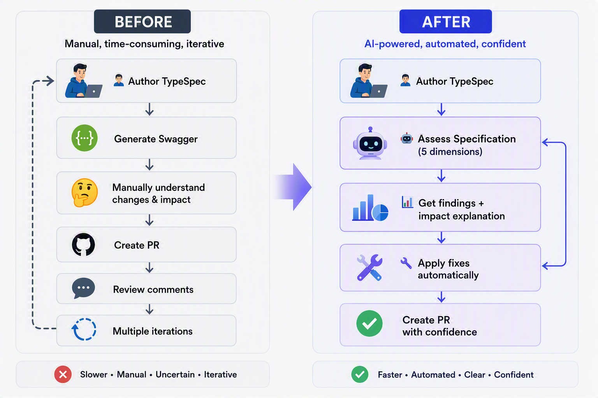
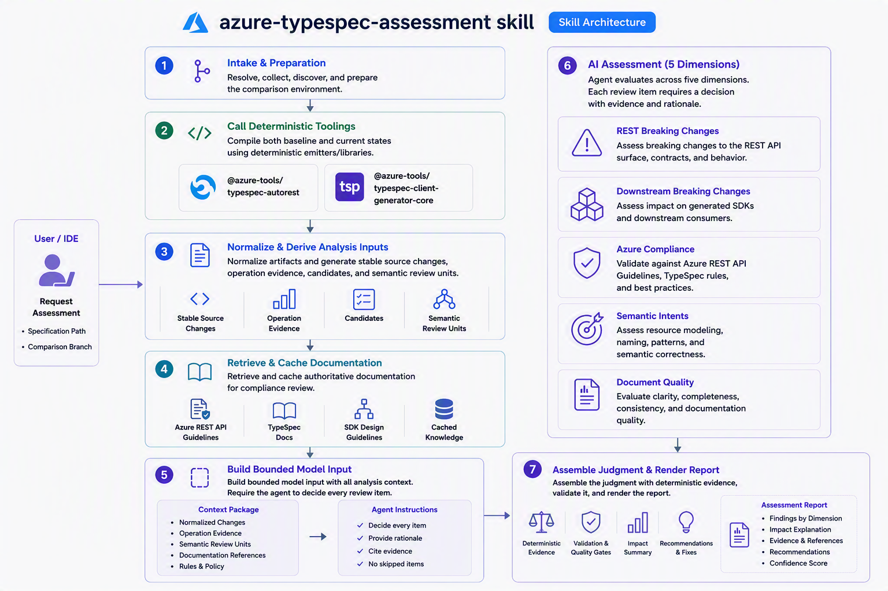

<!-- cspell:words autorest tspconfig typespec worktree -->

# Spec: TypeSpec Assessment

## Table of Contents

- [Background / Problem Statement](#background--problem-statement)
- [Goals](#goals)
- [Non-Goals](#non-goals)
- [User Scenario](#user-scenario)
- [Solution](#solution)
    - [Five Assessment Dimensions](#five-assessment-dimensions)
    - [Remediation Integration](#remediation-integration)
- [Architecture](#architecture)

---

## Background / Problem Statement

TypeSpec authors lack a fast, integrated way to understand the intent, compatibility, compliance, and documentation impact of their local changes before creating a pull request.

Although CI provides many automated validations, TypeSpec reviewers still need to understand the author's change intent and the underlying impact on the API and generated SDKs before deciding whether to accept or reject the breaking changes.

The purpose of `azure-typespec-assessment` skill is to:

- Integrate existing validation and compatibility tools into the inner-loop experience so users can identify issues during local development.
- Use AI where deterministic tools cannot infer the intent behind changes, especially TypeSpec versioning. For example, `@added`, `@renamedFrom`, and `@removed` may collectively add a default property value, as shown in this [TypeSpec versioning example](https://github.com/Azure/azure-sdk-tools/blob/main/.github/skills/azure-typespec-author/evaluate/fixtures/001005-version-add-preview-after-preview/employee.tsp#L23-L29).
- Generate human-readable summaries of API behavior and impact so users can better understand their TypeSpec changes.

---

## Goals

- Assess only TypeSpec changes in the user-selected specification.
- Assess five dimensions: REST breaking changes, downstream breaking changes, TypeSpec Azure guideline conformance, semantic intents, and document quality and agent friendliness.
- Include committed, staged, unstaged, and relevant untracked changes.
- Ground every conclusion in changed TypeSpec source and reproducible evidence.
- Support remediation through the TypeSpec authoring skill and a future breaking-change mitigation skill.

## Non-Goals

- Reporting pre-existing issues in unchanged specifications.
- Generating every language SDK during the core assessment.
- Treating successful compilation as proof of compatibility or compliance.
- Editing TypeSpec without explicit user approval.
- Replacing official API, SDK, or breaking-change review.

---

## User Scenario

**User:** Assess the current TypeSpec changes in the `Microsoft.ServiceNetworking/ServiceNetworking` specification.

**Agent:** Which commit should I compare the current TypeSpec changes against? The default is the latest commit id from `origin/main`.

**User:** Use `origin/main`.

**Agent:** I assessed the specification against the merge base with `origin/main`. The report covers REST breaking changes, downstream breaking changes, TypeSpec Azure guidelines, semantic intents, and document quality and agent friendliness. It includes source-linked findings and impact explanations.

**User:** Fix the breaking changes and TypeSpec Azure guideline issues.

**Agent:** I will apply the approved fixes through the breaking-change mitigation and TypeSpec authoring skills, validate the updated TypeSpec, and reassess it against the same baseline.

The reviewer's scenario workflow will be added in a future iteration after the reviewer experience is finalized.

---

## Solution

The solution compares the selected specification at two states:

- **Baseline:** the merge base between `HEAD` and the user-selected branch.
- **Current state:** `HEAD` plus staged, unstaged, and relevant untracked files.

Baseline and current projects are compiled independently. Scripts produce deterministic evidence from source changes and generated artifacts. The agent uses that evidence to make bounded judgments, and validators reject incomplete or unsupported results.

### Five Assessment Dimensions

#### 1. REST Breaking Changes

**Tooling:** `@azure-tools/typespec-autorest`, later switch to`@azure-tools/typespec-breaking-change`.

**Deterministic analysis:** Compare normalized baseline and current wire contracts for route, parameter, request, response, serialization, requiredness, enum, and API-version changes.

**AI judgment:** Approve or reject each candidate and explain the caller-visible incompatibility.

#### 2. Downstream Breaking Changes

**Tooling:** `@azure-tools/typespec-client-generator-core`.

**Deterministic analysis:** Compare generic client metadata and customization decorators for hierarchy, method location, signatures, naming, flattening, access, usage, reachability, paging, and LRO changes.

**AI judgment:** Decide whether each candidate causes public or runtime SDK impact, including REST-compatible breaks, and explain the cross-language risk.

#### 3. Azure Guidelines

**Tooling**: `web_fetch`, later integrate with [TypeSpec suppression reporting tool](https://github.com/Azure/azure-rest-api-specs/tree/main/eng/tools/typespec-suppressions).

**Deterministic analysis:** Capture changed declarations and retain fetched guidance from TypeSpec Azure website with its URL, section, excerpt, example, and content identity. The suppression reporting tool detects new or changed inline `#suppress` directives and `tspconfig.yaml` linter disables relative to the baseline so they can be included in the assessment.

**AI judgment:** Select applicable authoritative guidance and classify each declaration as passed, failed, not applicable, or not assessed.

> **Note:** If broader guideline assessment is needed in the future, we can explore a separate skill whose guidance is maintained by the appropriate owners. It could cover TypeSpec Azure guidance, API Review Board REST guidelines, ARM guidelines, and SDK guidelines.

#### 4. Semantic Intents

**Tooling:** Git diff, `@azure-tools/typespec-autorest`, later try to reuse the http diff detected in `@azure-tools/typespec-breaking-change`.

**Deterministic analysis:** Collect source hunks, changed declarations, versioned members, affected operations, REST signatures, paging/LRO metadata, and bounded review units.

**AI judgment:** Correlate related edits into the author's higher-level intent and summarize the resulting API behavior without inventing unsupported effects.

#### 5. Document Quality and Agent Friendliness

**Planned tooling:** Git diff, repository examples.

**Deterministic analysis:** Collect changed comments, descriptions, examples, documentation diagnostics, and their associated API surface.

**AI judgment:** Assess whether the documentation is accurate, complete, understandable, consistent with emitted behavior, and useful to both human consumers and coding agents.

### Remediation Integration

Assessment is read-only by default. Fixing findings is an explicit, user-approved follow-up:

1. The user selects findings to fix.
2. Compliance and documentation fixes are passed with their source evidence and cited guidance to the existing `azure-typespec-author` skill.
3. REST and downstream breaks are passed to a future breaking-change mitigation skill to select a compatibility strategy.
4. Any resulting TypeSpec edit is performed through `azure-typespec-author`, including its required TypeSpec validation.
5. The assessment reruns against the same baseline and reports findings as resolved, remaining, or newly introduced.

The breaking-change mitigation skill does not exist on the current branch. The integration is part of the proposed end-to-end solution.

---

## Architecture

