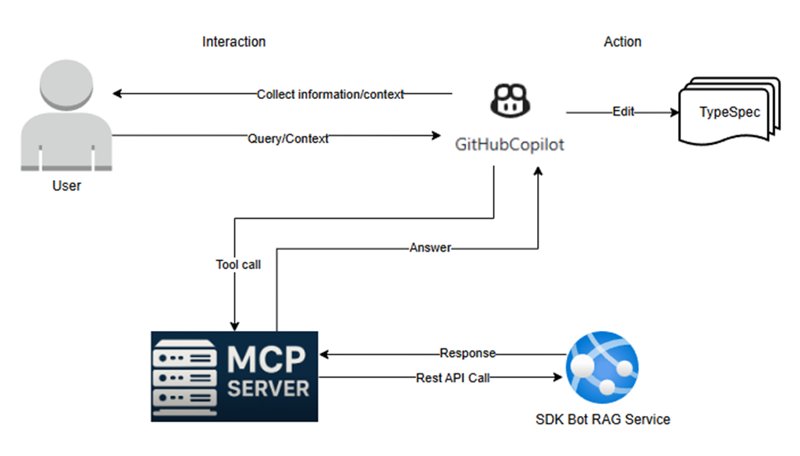

# Spec: [Stage Number and Name] - [Tool Name]

## Table of Contents

- [Definitions](#definitions)
- [Background / Problem Statement](#background--problem-statement)
- [Goals and Exceptions/Limitations](#goals-and-exceptionslimitations)
- [Design Proposal](#design-proposal)
- [Alternatives Considered](#alternatives-considered-optional) _(optional)_
- [Open Questions](#open-questions)
- [Success Criteria](#success-criteria)
- [Agent Prompts](#agent-prompts)
- [CLI Commands](#cli-commands)
- [Implementation Plan](#implementation-plan)
- [Testing Strategy](#testing-strategy)
- [Documentation Updates](#documentation-updates)
- [Metrics/Telemetry](#metricstelemetry)

---

## Definitions

_Define any terms that might be ambiguous or interpreted differently across teams. Establish shared understanding before diving into the design._

- **TypeSpec**: A language for describing cloud service APIs and generating other API description languages, client and service code, documentation, and other assets. TypeSpec provides highly extensible core language primitives that can describe API shapes common among REST, OpenAPI, GraphQL, gRPC, and other protocols. See [TypeSpec official documentation](https://typespec.io)

- **Azure SDK Design Principles**: The foundational design principles that guide the development of Azure SDKs across all languages, ensuring consistency, usability, and adherence to Azure standards. See [Azure SDK design principles](https://azure.github.io/azure-sdk/general_introduction.html)

- **Azure REST API Guidelines**: Standards and best practices for designing REST APIs in Azure, covering naming conventions, error handling, versioning, and resource modeling. See [Azure REST API guidelines](https://github.com/microsoft/api-guidelines/tree/vNext/azure)

- **ARM (Azure Resource Manager) Guidelines**: Specifications that define how Azure Resource Manager resource providers should be designed and implemented, including resource lifecycle, operations, and compliance requirements. See [ARM guidelines](https://github.com/cloud-and-ai-microsoft/resource-provider-contract/tree/master/v1.0)

- **ARM API Best Practices**: Design patterns and recommendations for creating consistent, high-quality ARM APIs, including guidance on resource modeling, operation patterns, and API versioning. See [ARM API Best Practices](https://armwiki.azurewebsites.net/api_contracts/best_practices.html)

- **Azure TypeSpec Style Guide**: Style conventions and coding standards specific to writing TypeSpec for Azure services, ensuring consistency across Azure service definitions. See [Azure TypeSpec Style Guide](https://azure.github.io/typespec-azure/docs/style-guide)

- **ARM TypeSpec Best Practices**: Recommended patterns for using TypeSpec operation templates and interface templates when defining ARM resource types and operations. See [ARM Resource Operations](https://azure.github.io/typespec-azure/docs/howtos/arm/resource-type)

- **RAG (Retrieval-Augmented Generation)**: An AI pattern that enhances language model responses by retrieving relevant context from a knowledge base before generating output, improving accuracy and grounding responses in authoritative sources

- **AI Hallucination**: When an AI model generates plausible-sounding but incorrect or fabricated information, such as inventing non-existent decorators or APIs


---

## Background / Problem Statement

TypeSpec is the foundation of the Azure SDK ecosystem, and well-crafted TypeSpec contributes to producing high-quality SDKs. However, Azure API developers face significant challenges when authoring TypeSpec

### Current State

**Problem 1: Writing TypeSpec that follows Azure guidelines and fixing non-compliant code**
- Azure API developers want to add new resources, operations, or other components to Azure services following ARM/DP/SDK/TypeSpec guidelines
- Generic AI (like standard GitHub Copilot) cannot provide effective help because it lacks domain-specific knowledge about Azure TypeSpec patterns and standards

**Example**: When a user asks to create an ARM resource named 'Asset' with CRUD operations, generic AI generates incorrect code that doesn't follow Azure Resource Manager patterns.

**Prompt:** Add an ARM resource named 'Asset' with CRUD operations.

Currently, GitHub Copilot generates code like the following, which invents non-existent decorators and produces incorrect code due to AI hallucination: 
```typespec
/**
 * The Asset ARM resource.
 */
@armResource("assets", "asset")
model AssetResource extends ResourceBase<AssetProperties> {}

/**
 * Create or update an Asset resource.
 */
@armResourceOperation("createOrUpdate", AssetResource)
op createOrUpdateAsset(
  resource: AssetResource
): AssetResource;

// other operations
```

According to the ARM resource [guideline](https://azure.github.io/typespec-azure/docs/howtos/arm/resource-type/#child-resource), the expected code should use pre-defined templates like `TrackedResource` ,`ArmResourceRead` and decorators like `@armResourceOperations`:
```typespec
model Asset is TrackedResource<AssetProperties> {
  ...ResourceNameParameter<Asset>;
}

@armResourceOperations
interface Assets {
  get is ArmResourceRead<Asset>;
  createOrUpdate is ArmResourceCreateOrReplaceAsync<Asset>;
  update is ArmResourcePatchAsync<Asset, AssetProperties>;
  delete is ArmResourceDeleteWithoutOkAsync<Asset>;
  listByResourceGroup is ArmResourceListByParent<Asset>;
  listBySubscription is ArmListBySubscription<Asset>;
}
```
 
**Problem 2: Updating TypeSpec for expected compilation outputs**
- Azure API developers need to update TypeSpec to achieve expected outputs after compilation (e.g., correct API paths in generated OpenAPI)
- Generic AI cannot provide effective help for these domain-specific challenges

**Example**: After compiling TypeSpec, developers notice that the generated paths in `openapi.json` are incorrect. For instance, the TypeSpec below outputs the path `/subscriptions/{subscriptionId}/resourceGroups/{resourceGroupName}/providers/Microsoft.Widget/assets/{assetName}`. However, since "assets" belong to an "employee," the expected path should include `employees/{employeeName}` before `assets/{assetName}`. Generic AI cannot guide developers on how to properly fix this.

```typespec assets.tsp
model Asset is TrackedResource<AssetProperties> {
  ...ResourceNameParameter<Asset>;
}

@armResourceOperations
interface Assets {
  get is ArmResourceRead<Asset>;
  createOrUpdate is ArmResourceCreateOrReplaceAsync<Asset>;
  update is ArmResourcePatchAsync<Asset, AssetProperties>;
  delete is ArmResourceDeleteWithoutOkAsync<Asset>;
  listByResourceGroup is ArmResourceListByParent<Asset>;
  listBySubscription is ArmListBySubscription<Asset>;
}
```


**Prompt:** Change the route for interface Assets from `/subscriptions/{subscriptionId}/resourceGroups/{resourceGroupName}/providers/Microsoft.Widget/assets/{assetName}` to `/subscriptions/{subscriptionId}/resourceGroups/{resourceGroupName}/providers/Microsoft.Widget/employees/{employeeName}/assets/{assetName}`

Currently, GitHub Copilot simply adds `@route('/subscriptions/{subscriptionId}/resourceGroups/{resourceGroupName}/providers/Microsoft.Widget/employees/{employeeName}/assets/{assetName}')`, which does not follow our guidelines:
```typespec assets.tsp
model Asset is TrackedResource<AssetProperties> {
  ...ResourceNameParameter<Asset>;
}

@route('/subscriptions/{subscriptionId}/resourceGroups/{resourceGroupName}/providers/Microsoft.Widget/employees/{employeeName}/assets/{assetName}')
@armResourceOperations
interface Assets {
  get is ArmResourceRead<Asset>;
  createOrUpdate is ArmResourceCreateOrReplaceAsync<Asset>;
  update is ArmResourcePatchAsync<Asset, AssetProperties>;
  delete is ArmResourceDeleteWithoutOkAsync<Asset>;
  listByParent is ArmResourceListByParent<Asset>;
}
```

According to the ARM resource [guideline](https://azure.github.io/typespec-azure/docs/howtos/arm/resource-type/#child-resource), the expected code is:
```typespec assets.tsp
// Use @parentResource to modify the path
@parentResource(Employee)
@route('/employees/{employeeName}/assets/{assetName}')
model Asset is TrackedResource<AssetProperties> {
  @path
  employeeName: string;
  
  @path
  assetName: string;
}

// Output Swagger path:
// /subscriptions/{subscriptionId}/resourceGroups/{resourceGroupName}/providers/Microsoft.Widget/employees/{employeeName}/assets/{assetName}
```
 
**Problem 3: Adding a New version following Azure versioning guidelines**
- TypeSpec versioning is intricate, involving decorators such as @added, @removed, and @useDependency to manage preview vs stable versions. These rules are nuanced and tied to Azure’s breaking-change policies, making them hard for generic AI to infer without domain-specific context.
- Generic AI currently cannot reliably provide effective guidance for scenarios requiring integrated knowledge of TypeSpec versioning decorators and Azure-specific conversion and breaking-change policies.

**Example**: When a user asks to "add a new preview version", generic AI may add a new version without replacing the older one.

**Prompt:** add a new preview version 2025-10-01-preview for service widget

Current AI only simply adds a new api version enum option in versions enum

```typespec main.tsp
/** The available API versions. */
enum Versions {
  /** 2021-10-01-preview version */
  @armCommonTypesVersion(Azure.ResourceManager.CommonTypes.Versions.v5)
  v2021_10_01_preview: "2021-10-01-preview",

  /** 2021-11-01 version */
  @armCommonTypesVersion(Azure.ResourceManager.CommonTypes.Versions.v5)
  v2021_11_01: "2021-11-01",

  /** 2025-10-01-preview version */
  @armCommonTypesVersion(Azure.ResourceManager.CommonTypes.Versions.v5)
  v2025_10_01_preview: "2025-10-01-preview",
}
```

According to the ARM versioning guideline and best practices, the expected code should:
1. add a new api version enum option and decorated with @previewVersion

```typespec main.tsp
/** The available API versions. */
enum Versions {
  /** 2021-10-01-preview version */
  @armCommonTypesVersion(Azure.ResourceManager.CommonTypes.Versions.v5)
  v2021_10_01_preview: "2021-10-01-preview",

  /** 2021-11-01 version */
  @armCommonTypesVersion(Azure.ResourceManager.CommonTypes.Versions.v5)
  v2021_11_01: "2021-11-01",

  /** 2025-10-01-preview version */
  @armCommonTypesVersion(Azure.ResourceManager.CommonTypes.Versions.v5)
  @previewVersion
  v2025_10_01_preview: "2025-10-01-preview",
}
```
2. Add a new example folder for the new version `2025-10-01-preview` and copy any still-relevant examples
  

### Why This Matters

**Impact on Service Development Experience:**
- TypeSpec authoring is critical to the inner loop experience for service teams
- Poor TypeSpec quality leads to incorrect SDK generation, requiring multiple iterations and delays
- The current workflow requires deep expertise in TypeSpec syntax and Azure-specific patterns, creating a steep learning curve

**Cost of Not Solving This:**
- **Increased Review Efforts**: Reviewers spend significant time identifying and correcting TypeSpec issues that don't follow Azure standards
- **Development Delays**: Service teams struggle with trial-and-error approaches to get TypeSpec right, slowing down the entire SDK generation pipeline (Author TypeSpec → Generate SDK → Validate SDK → Create PR → Release SDK)
- **Quality Issues**: Incorrect TypeSpec leads to malformed SDKs that need to be regenerated, wasting engineering resources
- **Knowledge Barrier**: Teams must constantly reference documentation and guidelines without intelligent assistance, reducing productivity

**User Experience Friction:**
- Developers currently have to switch between generic AI assistance and manual documentation lookup
- The lack of context-aware guidance means even experienced developers make mistakes
- New team members face an especially steep learning curve without AI assistance that understands Azure patterns

---

## Goals and Exceptions/Limitations

### Goals

What are we trying to achieve with this design?

- [ ] **AI Pair Programming for TypeSpec**: Enable GitHub Copilot to provide intelligent, context-aware assistance for TypeSpec authoring by integrating Azure SDK RAG (Retrieval-Augmented Generation) knowledge base
- [ ] **Guide Users Through Intent-Driven Development**: Allow users to describe their intent in natural language (e.g., "I need to add a new API version to my Widget service" or "I want to add an ARM resource named 'Asset' with CRUD operations"), and have the AI guide them through the correct TypeSpec implementation
- [ ] **Generate Code Following ARM/DP/SDK/TypeSpec Guidelines**: Ensure that generated TypeSpec code adheres to Azure Resource Manager (ARM) patterns, Data Plane (DP) standards, SDK guidelines, and TypeSpec best practices
- [ ] **Provide Contextual References**: When generating or suggesting code, include references to relevant documentation (e.g., links to TypeSpec Azure guidelines for versioning, ARM resource types, routing patterns)
- [ ] **Save Review Efforts**: Reduce the time reviewers spend identifying standards violations by ensuring code follows standards from the start
- [ ] **Improve Developer Learning**: Help service teams learn TypeSpec syntax and Azure patterns through interactive guidance, increasing their confidence in making code changes
- [ ] **Accelerate Inner Loop Development**: Speed up the iterative process of authoring TypeSpec, compiling, validating, and adjusting to achieve expected SDK outputs

### Exceptions and Limitations

_Known cases where this approach doesn't work or has limitations._

#### Language-Specific Limitations

| Language   | Limitation | Impact | Workaround |
|------------|------------|--------|------------|
| .NET       | None (TypeSpec is language-agnostic at authoring time) | N/A | N/A |
| Java       | None (TypeSpec is language-agnostic at authoring time) | N/A | N/A |
| JavaScript | None (TypeSpec is language-agnostic at authoring time) | N/A | N/A |
| Python     | None (TypeSpec is language-agnostic at authoring time) | N/A | N/A |
| Go         | None (TypeSpec is language-agnostic at authoring time) | N/A | N/A |

**Note:** TypeSpec authoring is language-agnostic. The generated SDKs target specific languages, but the TypeSpec authoring experience with AI assistance applies uniformly across all target SDK languages. Language-specific considerations come into play during SDK generation validation, not during TypeSpec authoring.

---

## Design Proposal

Leverage the existing APIs for Azure SDK knowledge base to deliver solutions aligned with Azure guidelines and best practices. Implement a TypeSpec authoring MCP tool that consults the Azure SDK RAG service to generate these solutions.

### Overview



### Detailed Design

When a user prompts GitHub Copilot with a TypeSpec task, Copilot interacts with the user to gather the required details, then invokes the TypeSpec authoring tool using the task and collected information as context. The authoring tool consults the backend Azure SDK knowledge base to generate a solution, which Copilot finally applies to update the TypeSpec files.

#### 1. TypeSpec authoring tool

Name (CLI): `azsdk typespec authoring`

Name (MCP): `azsdk_typespec_authoring`

Purpose: Help the user to define or edit TypeSpec API specifications and resolve **TypeSpec** related tasks.

Inputs:
- `--request <typespec-related-request>` (required)
- `--additional-information <additional-context>` (optional)
- `--category <request-categrory>` (optional)
- `--mode <reqeust-model>` (optional, it should be one of agent-model or file-model, default is agent-model)
- `--typespec-source-path <path-to-tsp-source-file-or-folder` (optional, the path to typespec source file or folder)

Outputs:

```json
{"is_successful":true,"solution": "<solution-for-the-typespec-task>", "references":[{"title":"How to define a preview version","source":"typespec_azure_docs","link":"https://azure.github.io/typespec-azure/docs/howtos/versioning/preview-version"}]}
```

#### 2. Azure SDK Knowledge base

Backend Azure SDK Knowledge base to provide the solution for the task. It exports completion api https://<knowledge-base-service-endpoint>/completion

---

### Cross-Language Considerations

_How does this design work across different SDK languages?_

| Language   | Approach | Notes |
|------------|----------|-------|
| .NET       | [How it works in .NET] | [Any specific considerations] |
| Java       | [How it works in Java] | [Any specific considerations] |
| JavaScript | [How it works in JS] | [Any specific considerations] |
| Python     | [How it works in Python] | [Any specific considerations] |
| Go         | [How it works in Go] | [Any specific considerations] |

### User Experience

[How will developers interact with this? Show examples of commands, outputs, or workflows]

```bash
# Example usage
azsdk typespec authoring --request typespec-related-request
```

### Architecture Diagram

```text
[Add diagram here - can be ASCII art, mermaid, or link to image]

┌─────────────┐
│  Component  │
└──────┬──────┘
       │
       ▼
┌─────────────┐
│  Component  │
└─────────────┘
```

---

## Open Questions

_Unresolved items that need discussion and input from reviewers._

- [ ] **Question 1**: [Description of what needs to be decided]
  - Context: [Why is this uncertain?]
  - Options: [What are the choices?]
  
- [ ] **Question 2**: [Description]
  - Context: [Why is this uncertain?]
  - Options: [What are the choices?]

---

## Success Criteria

_Measurable criteria that define when this feature/tool is complete and working as intended._

This feature/tool is complete when:

- [ ] **Benchmark Test Suite**: A curated set of 50+ real-world TypeSpec authoring scenarios is established, covering the most commonly encountered cases:
  - ARM resource creation with CRUD operations (15+ variants)
  - Parent-child resource hierarchy and routing (10+ variants)
  - API versioning scenarios (preview, stable, deprecated) (10+ variants)
  - Complex decorator usage (@armResourceOperations, @parentResource, @route, @added, @removed) (10+ variants)
  - Common anti-patterns and their corrections (5+ variants)

- [ ] **Agent Output Accuracy**: When tested against the benchmark suite:
  - Generated TypeSpec code passes compilation without errors
  - Generated code follows Azure ARM/DP/SDK guidelines (validated by automated linter/validator)
  - Generated code matches expected patterns for resource hierarchy and routing
  - Generated code includes proper decorators (no hallucinated decorators like `@armResource` or `@armResourceOperation`)

- [ ] **Documentation Reference Quality**: For each agent response:
  - Responses include relevant documentation links (e.g., TypeSpec Azure guidelines)
  - Documentation links are accurate and point to the correct section
  - References are contextually appropriate to the user's question

- [ ] **User Intent Recognition**: Agent correctly interprets and responds to:
  - Natural language requests for adding ARM resources
  - Path correction requests based on compiled OpenAPI output
  - Versioning change requests (adding preview/stable versions)
  - Request to fix non-compliant code patterns

- [ ] **Comparative Improvement**: Compared to generic GitHub Copilot baseline:
  - Reduction in decorator hallucinations
  - Improvement in correct usage of @parentResource and @route for hierarchical resources
  - Improvement in adherence to Azure versioning guidelines

- [ ] **Review Effort Reduction**: Measurable impact on TypeSpec PR reviews:
  - Reduction in reviewer comments related to TypeSpec standards violations
  - Reduction in PR iterations required to achieve compliant TypeSpec
  - Track via telemetry over 3-month period post-deployment

---

## Agent Prompts

### Scenario 1: Add a new preview API version

**Prompt:**

```text
add a new preview API version 2025-10-01-preview for service widget
```

**Expected Agent Activity:**

1. Add a enum option v2025_10_01_preview in version enum for this new api version and decorate with @previewVersion
2. Add a new example folder for the new version `2025-10-01-preview` and copy any still-relevant examples
3. summarize all the actions taken and display the reference docs

### Scenario 2: Update TypeSpec to follow Azure guidelines

**Prompt:**

```text
add an azure resource asset for the api version 2025-10-01-preview
```

**Expected Agent Activity:**

1. generate azure trackedResource model Asset and resource interface Assets using azure mgmt templates. Decorated @added(Versions.v2025_10_01_preview) 
2. summarize all the actions taken and display the reference docs

---

## CLI Commands

### typespec authoring

**Command:**

```bash
azsdk typespec authoring --request <typespec-request> --additional-information <additional context>
```

**Options:**

- `--request`: the TypeSpec request to authoring
- `--additional-information <value>`: Set the additional information, such as the context (optional)

**Expected Output:**

```text
**Solution:** To add a new API version '2025-10-10' for your service 'widget' in TypeSpec, you need to update your version enum and ensure all changes are tracked with versioning decorators.\n **Step-by-step guidance:**\n 1. Update the Versions enum in your versioned namespace to include the new version. Each version string should follow the YYYY-MM-DD format, and if it's a preview, use a '-preview' suffix. and decorate @previewVersion on the enum. 2. add an example folder for this version and copy the relative examples
```

**Error Cases:**

```text

✗ Error: Required argument missing for command: 'authoring'
  
Usage: azsdk typespec authoring
```

---

## Implementation Plan

_If this is a large effort, break down the implementation into phases._

### Phase 1: [Name]

- Milestone: [What will be delivered?]
- Timeline: [Estimated timeframe]
- Dependencies: [What must be done first?]

### Phase 2: [Name]

[Same structure]

### Phase 3: [Name]

[Same structure]

---

## Testing Strategy

_How will this design be validated?_

### Unit Tests

[What unit tests are needed?]

### Integration Tests

[What integration tests are needed?]

### Manual Testing

[What manual testing is needed?]

### Cross-Language Validation

[How will we ensure this works across all SDK languages?]

---

## Metrics/Telemetry

_What data should we collect to measure success or diagnose issues?_

### Metrics to Track

| Metric Name | Description | Purpose |
|-------------|-------------|---------|
| [Metric 1]  | [What it measures] | [Why we need it] |
| [Metric 2]  | [What it measures] | [Why we need it] |

### Privacy Considerations

[How will we ensure no sensitive data is collected?]

---

## Documentation Updates

_What documentation needs to be created or updated?_

- [ ] README updates
- [ ] Developer guides
- [ ] API documentation
- [ ] Examples/samples |
