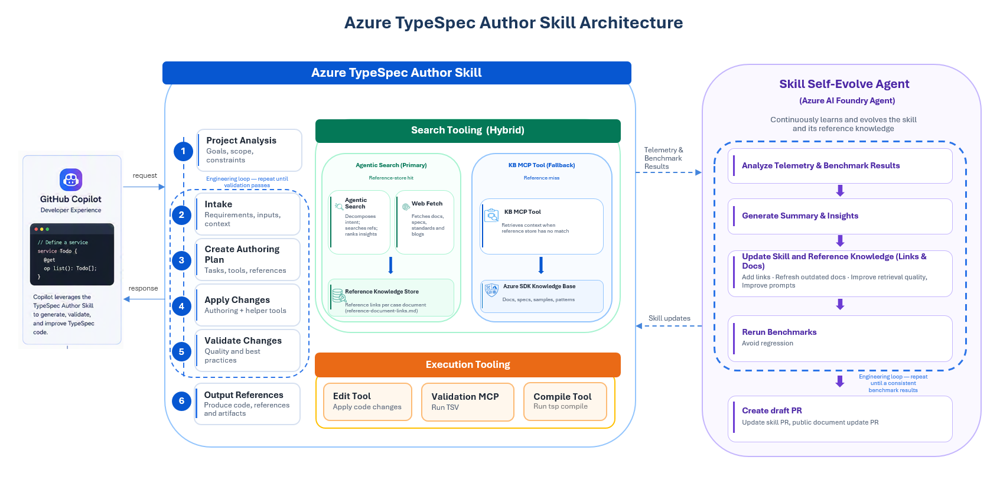

# Spec: TypeSpec Authoring - AI-Powered TypeSpec Authoring Assistance Tool

## Table of Contents

- [Definitions](#definitions)
- [Background / Problem Statement](#background--problem-statement)
- [Goals](#goals)
- [Design Proposal](#design-proposal)
  - [Skill: azure-typespec-author](#skill-azure-typespec-author)
  - [Skill Self-Evolve Agent](#skill-self-evolve-agent)
  - [MCP Tools and Knowledge Base](#mcp-tools-and-knowledge-base)
- [Success Criteria](#success-criteria)
- [Agent Prompts](#agent-prompts)
- [CLI Commands](#cli-commands)

---

## Definitions

- **TypeSpec**: A language for describing cloud service APIs and generating other API description languages, client and service code, documentation, and other assets. TypeSpec provides highly extensible core language primitives that can describe API shapes common among REST, OpenAPI, GraphQL, gRPC, and other protocols. See [TypeSpec official documentation](https://typespec.io)

- **Azure SDK Design Principles**: The foundational design principles that guide the development of Azure SDKs across all languages, ensuring consistency, usability, and adherence to Azure standards. See [Azure SDK design principles](https://azure.github.io/azure-sdk/general_introduction.html)

- **Azure REST API Guidelines**: Standards and best practices for designing REST APIs in Azure, covering naming conventions, error handling, versioning, and resource modeling. See [Azure REST API guidelines](https://github.com/microsoft/api-guidelines/tree/vNext/azure)

- **ARM (Azure Resource Manager) Guidelines**: Specifications that define how Azure Resource Manager resource providers should be designed and implemented, including resource lifecycle, operations, and compliance requirements. See [ARM guidelines](https://github.com/cloud-and-ai-microsoft/resource-provider-contract/tree/master/v1.0)

- **ARM API Best Practices**: Design patterns and recommendations for creating consistent, high-quality ARM APIs, including guidance on resource modeling, operation patterns, and API versioning. See [ARM API Best Practices](https://armwiki.azurewebsites.net/api_contracts/best_practices.html)

- **Azure TypeSpec Style Guide**: Style conventions and coding standards specific to writing TypeSpec for Azure services, ensuring consistency across Azure service definitions. See [Azure TypeSpec Style Guide](https://azure.github.io/typespec-azure/docs/reference/azure-style-guide)

- **ARM TypeSpec Best Practices**: Recommended patterns for using TypeSpec operation templates and interface templates when defining ARM resource types and operations. See [ARM Resource Operations](https://azure.github.io/typespec-azure/docs/howtos/arm/resource-type)

- **RAG (Retrieval-Augmented Generation)**: An AI pattern that enhances language model responses by retrieving relevant context from a knowledge base before generating output, improving accuracy and grounding responses in authoritative sources

- **Azure SDK Knowledge Base**: A backend service that provides RAG-powered solutions for Azure SDK and TypeSpec authoring tasks. It indexes and retrieves relevant information from Azure SDK documentation, guidelines, and best practices to generate context-aware recommendations

- **AI Hallucination**: When an AI model generates plausible-sounding but incorrect or fabricated information, such as inventing non-existent decorators or APIs

- **Reference Knowledge Store**: A curated catalog of authoritative Azure and TypeSpec documentation URLs maintained in `references/reference-document-links.md`. It is the primary index for Agentic Search and is continuously updated by the Skill Self-Evolve Agent.

- **Skill Self-Evolve Agent**: An Azure AI Foundry Agent that continuously analyzes telemetry and benchmark results to improve the `azure-typespec-author` skill — updating prompts, reference links, and tooling — and submits changes as pull requests.


---

## Background / Problem Statement

TypeSpec is the foundation of the Azure SDK ecosystem, and well-crafted TypeSpec contributes to producing high-quality SDKs. However, Azure API developers face significant challenges when authoring TypeSpec.

### Current State

Users are facing various problems during TypeSpec authoring, where agent like GitHub Copilot with frontier models cannot provide effective help. We categorize these problems into three main types. For more cases, please refer to this [project](https://github.com/haolingdong-msft/innerloop-typespec-authoring-benchmark) to understand more cases that agent cannot provide effective help.

> **Note**: The AI-generated outputs shown in the examples below represent the current state of generic AI assistance (as of the time of writing). AI models continuously evolve, and the specific outputs demonstrated here are for illustrative purposes to highlight the gap between generic AI and domain-specific, Azure-aware AI assistance.

**Problem 1: Writing TypeSpec that follows Azure guidelines and fixing non-compliant code**
- Azure API developers want to add new resources, operations, or other components to Azure services following ARM/DP/SDK/TypeSpec guidelines
- Generic AI (like standard GitHub Copilot) cannot provide effective help because it lacks domain-specific knowledge about Azure TypeSpec patterns and standards

**Example**: When a user asks to create an ARM resource named 'Asset' with CRUD operations, generic AI generates incorrect code that doesn't follow Azure Resource Manager patterns.

**Prompt:** Add an ARM resource named 'Asset' with CRUD operations.

Currently, GitHub Copilot generates code like the following, which invents non-existent decorators and produces incorrect code due to AI hallucination: 
```typespec
/**
 * The Asset ARM resource.
 */
@armResource("assets", "asset")
model AssetResource extends ResourceBase<AssetProperties> {}

/**
 * Create or update an Asset resource.
 */
@armResourceOperation("createOrUpdate", AssetResource)
op createOrUpdateAsset(
  resource: AssetResource
): AssetResource;

// other operations
```

According to the ARM resource [guideline](https://azure.github.io/typespec-azure/docs/howtos/arm/resource-type/#child-resource), the expected code should use pre-defined templates like `TrackedResource` ,`ArmResourceRead` and decorators like `@armResourceOperations`:
```typespec
model Asset is TrackedResource<AssetProperties> {
  ...ResourceNameParameter<Asset>;
}

@armResourceOperations
interface Assets {
  get is ArmResourceRead<Asset>;
  createOrUpdate is ArmResourceCreateOrReplaceAsync<Asset>;
  update is ArmResourcePatchAsync<Asset, AssetProperties>;
  delete is ArmResourceDeleteWithoutOkAsync<Asset>;
  listByResourceGroup is ArmResourceListByParent<Asset>;
  listBySubscription is ArmListBySubscription<Asset>;
}
```
 
**Problem 2: Updating TypeSpec for expected compilation outputs**
- Azure API developers need to update TypeSpec to achieve expected outputs after compilation (e.g., correct API paths in generated OpenAPI)
- Generic AI cannot provide effective help for these domain-specific challenges

**Example**: After compiling TypeSpec, developers notice that the generated paths in `openapi.json` are incorrect. For instance, the TypeSpec below outputs the path `/subscriptions/{subscriptionId}/resourceGroups/{resourceGroupName}/providers/Microsoft.Widget/assets/{assetName}`. However, since "assets" belong to an "employee," the expected path should include `employees/{employeeName}` before `assets/{assetName}`. Generic AI cannot guide developers on how to properly fix this.

```typespec assets.tsp
model Asset is TrackedResource<AssetProperties> {
  ...ResourceNameParameter<Asset>;
}

@armResourceOperations
interface Assets {
  get is ArmResourceRead<Asset>;
  createOrUpdate is ArmResourceCreateOrReplaceAsync<Asset>;
  update is ArmResourcePatchAsync<Asset, AssetProperties>;
  delete is ArmResourceDeleteWithoutOkAsync<Asset>;
  listByResourceGroup is ArmResourceListByParent<Asset>;
  listBySubscription is ArmListBySubscription<Asset>;
}
```


**Prompt:** Change the route for interface Assets from `/subscriptions/{subscriptionId}/resourceGroups/{resourceGroupName}/providers/Microsoft.Widget/assets/{assetName}` to `/subscriptions/{subscriptionId}/resourceGroups/{resourceGroupName}/providers/Microsoft.Widget/employees/{employeeName}/assets/{assetName}`

Currently, GitHub Copilot simply adds `@route('/subscriptions/{subscriptionId}/resourceGroups/{resourceGroupName}/providers/Microsoft.Widget/employees/{employeeName}/assets/{assetName}')`, which does not follow our guidelines:
```typespec assets.tsp
model Asset is TrackedResource<AssetProperties> {
  ...ResourceNameParameter<Asset>;
}

@route('/subscriptions/{subscriptionId}/resourceGroups/{resourceGroupName}/providers/Microsoft.Widget/employees/{employeeName}/assets/{assetName}')
@armResourceOperations
interface Assets {
  get is ArmResourceRead<Asset>;
  createOrUpdate is ArmResourceCreateOrReplaceAsync<Asset>;
  update is ArmResourcePatchAsync<Asset, AssetProperties>;
  delete is ArmResourceDeleteWithoutOkAsync<Asset>;
  listByParent is ArmResourceListByParent<Asset>;
}
```

According to the ARM resource [guideline](https://azure.github.io/typespec-azure/docs/howtos/arm/resource-type/#child-resource), the expected code is:
```typespec assets.tsp
// Use @parentResource to modify the path
@parentResource(Employee)
@route('/employees/{employeeName}/assets/{assetName}')
model Asset is TrackedResource<AssetProperties> {
  @path
  employeeName: string;
  
  @path
  assetName: string;
}

// Output Swagger path:
// /subscriptions/{subscriptionId}/resourceGroups/{resourceGroupName}/providers/Microsoft.Widget/employees/{employeeName}/assets/{assetName}
```
 
**Problem 3: Adding a New version following Azure versioning guidelines**
- TypeSpec versioning is intricate, involving decorators such as `@added`, `@removed`, `@useDependency` to manage preview vs stable versions. These rules are nuanced and tied to Azure’s breaking-change policies, making them hard for generic AI to infer without domain-specific context.
- Generic AI currently cannot reliably provide effective guidance for scenarios requiring integrated knowledge of TypeSpec versioning decorators and Azure-specific conversion and breaking-change policies.

**Example**: When a user asks to "add a new preview version", generic AI may add a new version without replacing the older one.

**Prompt:** add a new preview version 2025-10-01-preview for service widget

Current AI only simply adds a new api version enum option in versions enum

```typespec main.tsp
/** The available API versions. */
enum Versions {
  /** 2021-11-01 version */
  @armCommonTypesVersion(Azure.ResourceManager.CommonTypes.Versions.v5)
  v2021_11_01: "2021-11-01",

  /** 2022-10-01-preview version */
  @armCommonTypesVersion(Azure.ResourceManager.CommonTypes.Versions.v5)
  v2022_10_01_preview: "2022-10-01-preview",

  /** 2025-10-01-preview version */
  @armCommonTypesVersion(Azure.ResourceManager.CommonTypes.Versions.v5)
  v2025_10_01_preview: "2025-10-01-preview",
}
```

According to the ARM versioning guideline and best practices, the expected behavior should:
1. Rename the latest preview version to match the new preview version, in all instances in the spec. e.g. change the `Versions` enum.
    ```typespec main.tsp
    /** The available API versions. */
    enum Versions {
      /** 2021-11-01 version */
      @armCommonTypesVersion(Azure.ResourceManager.CommonTypes.Versions.v5)
      v2021_11_01: "2021-11-01",

      /** 2025-10-01-preview version */
      @armCommonTypesVersion(Azure.ResourceManager.CommonTypes.Versions.v5)
      @previewVersion
      v2025_10_01_preview: "2025-10-01-preview",
    }
    ```
1. Change the name of the `examples` version folder for the latest preview to match the new preview version
1. Make changes to the API description based on how the API has changed
  - If any type that was introduced in the latest preview is _not_ in the new preview, simply remove the type
  - If any other types are removed in this preview (unlikely) mark these with an `@removed` decorator referencing the new version
  - If any types are added, renamed, or otherwise modified in the new version, mark them with the appropriate versioning decorator
1. Add and modify examples to match the API changes
  

### Why This Matters

**Impact on Service Development Experience:**
- TypeSpec authoring is critical to the inner loop experience for service teams
- Poor TypeSpec quality leads to incorrect SDK generation, requiring multiple iterations and delays
- The current workflow requires deep expertise in TypeSpec syntax and Azure-specific patterns, creating a steep learning curve

**Cost of Not Solving This:**
- **Increased Review Efforts**: Reviewers spend significant time identifying and correcting TypeSpec issues that don't follow Azure standards
- **Development Delays**: Service teams struggle with trial-and-error approaches to get TypeSpec right, slowing down the entire SDK generation pipeline (Author TypeSpec → Generate SDK → Validate SDK → Create PR → Release SDK)
- **Quality Issues**: Incorrect TypeSpec leads to malformed SDKs that need to be regenerated, wasting engineering resources
- **Knowledge Barrier**: Teams must constantly reference documentation and guidelines without intelligent assistance, reducing productivity

**User Experience Friction:**
- Developers currently have to switch between generic AI assistance and manual documentation lookup
- The lack of context-aware guidance means even experienced developers make mistakes
- New team members face an especially steep learning curve without AI assistance that understands Azure patterns

---

## Goals

- **AI Pair Programming for TypeSpec**: Enable GitHub Copilot to provide intelligent, context-aware assistance for TypeSpec authoring by integrating Azure SDK RAG (Retrieval-Augmented Generation) knowledge base
- **Guide Users Through Intent-Driven Development**: Allow users to describe their intent in natural language (e.g., "I need to add a new API version to my Widget service" or "I want to add an ARM resource named 'Asset' with CRUD operations"), and have the AI guide them through the correct TypeSpec implementation
- **Generate TypeSpec Following ARM/DP/SDK/TypeSpec Guidelines**: Ensure that generated TypeSpec code adheres to Azure Resource Manager (ARM) patterns, Data Plane (DP) standards, SDK guidelines, and TypeSpec best practices
- **Provide Contextual References**: When generating or suggesting TypeSpec, include references to relevant documentation (e.g., links to TypeSpec Azure guidelines for versioning, ARM resource types, routing patterns)
- **Save Review Efforts**: Reduce the time reviewers spend identifying standards violations by ensuring TypeSpec code follows standards from the start
- **Improve Developer Learning**: Help service teams learn TypeSpec syntax and Azure patterns through interactive guidance, increasing their confidence in making code changes
- **Accelerate Inner Loop Development**: Speed up the iterative process of authoring TypeSpec, compiling, validating, and adjusting to achieve expected SDK outputs

---

## Design Proposal

This spec delivers AI-powered TypeSpec authoring assistance through two tightly integrated components:

1. **Skill `azure-typespec-author`** — a Markdown-defined, deterministic skill loaded by GitHub Copilot that encodes a six-step authoring workflow grounded in a **hybrid search strategy** (Agentic Search as primary; KB MCP Tool as fallback). Copilot leverages the skill to generate, validate, and improve TypeSpec code in response to natural language requests.
2. **Skill Self-Evolve Agent** — an Azure AI Foundry Agent that runs on a continuous schedule, analyzing production telemetry and benchmark results to improve the skill's prompts, reference knowledge, and tooling. It submits all improvements as pull requests, ensuring the skill adapts to new Azure guidelines and real-world usage patterns without manual intervention.

The two components form a **closed-loop system**: users interact with Copilot + Skill, generating telemetry that feeds the Self-Evolve Agent, which iteratively improves the skill's effectiveness.

### Skill: `azure-typespec-author`

The skill lives under `.github/skills/azure-typespec-author/` and is loaded by GitHub Copilot whenever a user invokes a TypeSpec authoring task. It encodes a deterministic, repeatable workflow that grounds every change in authoritative Azure guidance via the hybrid search tooling (see [Search Tooling (Hybrid)](#search-tooling-hybrid) below).

**Prerequisites**:
- The `azure-sdk-mcp` server (provided by `azsdk-cli`) must be running to serve the skill's MCP tools.
- GitHub Copilot must have access to the skill under `.github/skills/azure-typespec-author/SKILL.md`.

#### Architecture Overview


The architecture shows the full system:
- **Azure TypeSpec Author Skill**: GitHub Copilot invokes the skill with a user request; the skill executes a six-step workflow grounded in hybrid search and execution tooling.
- **Search Tooling**: Two-tier search strategy — Agentic Search (primary) searches the Reference Knowledge Store; KB MCP Tool (fallback) queries the Knowledge Base.
- **Execution Tooling**: Edit Tool, Validation MCP, and Compile Tool apply changes and verify correctness.
- **Self-Evolve Agent**: Continuously analyzes telemetry and benchmarks, updates the skill and reference knowledge, and submits PRs.

#### Skill Workflow

The skill enforces a **fixed six-step workflow** defined in `SKILL.md`. Every `.tsp` edit runs the full workflow — even a seemingly trivial change (for example, making a property optional with `?`) can be breaking — and steps are never skipped. All edits are minimal and scoped to the request, and the plan produced in Step 3 is the single source of truth for Step 4.


| Step | Name | Reference | Tooling & Details |
|------|------|-----------|-------------------|
| 1 | Analyze Project | `references/analyze-project.md` | Collect project root, `tspconfig.yaml`, service type (ARM / data-plane), existing and latest API versions, intent, target resource/interface, and constraints. **No external tools used.** |
| 2 | Intake | `references/intake.md` | Identify the case (Add Resource Type, Add Resource Operations, API Version Evolution), gather case-specific inputs using **Agentic Search** over the Reference Knowledge Store, and confirm with the user before proceeding. |
| 3 | Build Authoring Plan | `references/authoring-plan.md` | Produce a grounded plan using **Hybrid Search Tooling**: (1) Try Agentic Search first; (2) if no match, fall back to **KB MCP Tool** (`azsdk_typespec_generate_authoring_plan`). Plan is the single source of truth for Step 4. |
| 4 | Apply Changes | — | Use **Edit Tool** to make minimal `.tsp` edits exactly as directed by the Step 3 plan. Confirm any uncertainties with the user before applying. |
| 5 | Validate Changes | `references/validation.md` | Run **Validation MCP** (`azsdk_run_typespec_validation`) for static checks, and **Compile Tool** (`tsp compile .`) to verify OpenAPI output. For API-version evolution, also verify examples. If validation fails, **loop back to Step 4** (or Step 2 if major rework needed). Limit retries to 3 attempts. |
| 6 | Output References | — | Emit all documentation URLs from Step 3 plan so users can review the authoritative guidance behind each change. |

#### Search Tooling (Hybrid)

Step 3 grounds the authoring plan in authoritative Azure guidance through a **two-tier hybrid search strategy**. Agentic Search is the **primary** path; the KB MCP Tool is the **fallback** path invoked only on a reference miss.

**Tier 1 — Agentic Search (Primary, Reference-Store Hit)**

Agentic Search runs first, using the curated **Reference Knowledge Store** (`references/reference-document-links.md`) as its index:

- **Agentic Search** (via host agent): Decomposes the user request and Step 1–2 context, searches the Reference Knowledge Store catalog, and ranks the most relevant Azure / TypeSpec documentation URLs for the authoring task.
- **Web Fetch**: For each matched reference URL, fetches the live documentation (Azure TypeSpec docs, ARM guidelines, style guides, etc.) and extracts relevant guidance snippets.
- **Reference Knowledge Store** (`references/reference-document-links.md`): A curated catalog of authoritative Azure / TypeSpec documentation URLs maintained in the skill and continuously updated by the Skill Self-Evolve Agent. This is the **single source of truth** for what Agentic Search can reach.

**When Tier 1 Succeeds**: If Agentic Search returns sufficient, high-confidence guidance (typically > 80% coverage of the user request), the authoring plan is built directly from the fetched documentation and the KB MCP Tool is **not** called. This path is fast, traceable, and avoids RAG hallucinations.

**Tier 2 — KB MCP Tool (Fallback, Reference-Store Miss)**

> **TODO (future update):** The precise criteria for when the skill falls back from Agentic Search to the KB MCP Tool are not yet finalized. Since Agentic Search is expected to cover ~80% of scenarios, we need to clearly define the fallback trigger (e.g., what constitutes an insufficient/low-confidence Agentic Search result, coverage thresholds, and edge cases not in the Reference Knowledge Store). This placeholder will be replaced with the concrete fallback logic in a future update.

If Agentic Search cannot locate matching references in the store, or if the user request involves edge cases not yet in the catalog, the skill falls back to:

- **KB MCP Tool** (`azsdk_typespec_generate_authoring_plan`): Calls the Azure SDK Knowledge Base backend via MCP, which retrieves context indexed from docs, specs, samples, and patterns beyond the local reference catalog.
- **Azure SDK Knowledge Base**: Backend RAG service that covers the full breadth of Azure SDK and TypeSpec authoring documentation, returning a grounded plan with references and reasoning.

#### Why Agentic Search Takes Precedence

When both Tier 1 (Agentic Search) and Tier 2 (KB MCP Tool) return guidance, **Tier 1 guidance takes precedence** for six key reasons:

**Summary**: Agentic Search provides superior execution efficiency, token economy, solution quality, traceability, local context access, and security compared to KB MCP Tool. It enables iterative refinement locally without costly tool calls, directly accesses workspace context without serialization overhead, controls context by selecting only relevant snippets, empirically achieves higher code pass rates, provides auditable reference URLs, and respects user permission boundaries by only accessing authorized reference links.

**Detailed Comparison**:

| Aspect | Agentic Search (Tier 1) | KB MCP Tool (Tier 2) |
|--------|------------------------|---------------------|
| **Execution Model** | Iterative local refinement: if initial search misses, agent refines query and re-searches Reference Store locally without tool calls | Single remote call: each iteration requires a new MCP tool invocation to the Knowledge Base backend, incurring latency and coordination overhead |
| **Token Efficiency** | Agent explicitly selects 2–3 most relevant docs and extracts only the guidance snippets needed; tight context window | Full knowledge base response (often 500–2000 tokens) flows into LLM context, bloating prompt even if only a fraction is useful |
| **Solution Quality** | Sourced from canonical, human-curated reference URLs in the Reference Knowledge Store. URLs are vetted before addition. | RAG hallucinations remain possible: during KB migration, we observed cases where KB returned incorrect solutions despite having the correct doc link in references. Experimental pass rates show Agentic Search consistently outperforms KB. (See [PR #16264](https://github.com/Azure/azure-sdk-tools/pull/16264#issuecomment-5044129741) and ongoing [PR #16460](https://github.com/Azure/azure-sdk-tools/pull/16460).) |
| **Traceability** | Each reference URL is visible and user-reviewable; supports direct links to live documentation | Full reasoning opaque to end user; harder to audit why a solution was generated |
| **Access Control & Security** | Agent can only access links in the Reference Knowledge Store that the user has permission to view; no exposure to restricted content. | KB backend has global visibility of all indexed docs; risk of exposing materials the user should not have access to, even if user lacks permissions. |
| **Local Context Access** | Agent directly accesses local workspace files, `.tsp` files, `tspconfig.yaml`, existing patterns, and project structure without serialization overhead; immediate, contextual decisions based on live project state | KB MCP Tool requires serializing and transmitting workspace context over the network to the remote backend; slower context propagation and potential loss of detail in serialization; latency and bandwidth overhead |

**Conflict Resolution Rule**: If both tiers return conflicting guidance, **apply Tier 1 guidance** because it is faster, cheaper, has better context access, and is empirically more reliable.

#### Execution Tooling

After the authoring plan is established in Step 3, the skill uses the following execution tools to apply and verify changes:

| Tool | Component | Purpose |
|------|-----------|---------|
| **Edit Tool** | Authoring | Apply minimal, scoped `.tsp` code changes as directed by the Step 3 plan exactly; no deviations. |
| **Validation MCP** | Validation | `azsdk_run_typespec_validation`: Static analysis, style, and best-practice checks; surfaces errors and warnings that drive the engineering loop (Step 5). |
| **Compile Tool** | Validation | `tsp compile .`: Compiles the TypeSpec project and verifies the OpenAPI output under the path specified in `tspconfig.yaml`. For API-version evolution, also verifies example folders match the target version. |

#### Reference Files

`SKILL.md` delegates step detail to the following reference files, keeping the entry point small and each concern independently maintainable:

| File | Purpose |
|------|---------|
| `references/analyze-project.md` | Step 1: Collect project context, TypeSpec version info, service type, intent, and constraints. |
| `references/intake.md` | Step 2: Use Agentic Search to identify the authoring case and gather case-specific inputs; confirm intent with user. |
| `references/authoring-plan.md` | Step 3: Execute hybrid search (Agentic Search primary, KB MCP Tool fallback), synthesize guidance, and produce the authoring plan. |
| `references/agentic-search.md` | Procedure: Execute Tier 1 of hybrid search — query Reference Knowledge Store, fetch URLs, extract guidance. |
| `references/reference-document-links.md` | **Reference Knowledge Store**: Curated catalog of authoritative Azure / TypeSpec documentation URLs. Continuously updated by Skill Self-Evolve Agent. This is the single source of truth for Agentic Search. |
| `references/validation.md` | Step 5: Validate changes using Validation MCP and Compile Tool; define retry/escalation logic for the engineering loop. |

#### Why a Skill (Design Rationale)

- **Transparent activation via Copilot** — GitHub Copilot automatically selects the skill based on declarative triggers when users request TypeSpec authoring help. Users do not need to know when to switch to a specialized agent.
- **Deterministic, reproducible workflow** — the fixed six-step procedure and the "plan-as-single-source-of-truth" rule reduce model-to-model variance and prevent hallucinated decorators or incorrect Azure patterns across sessions.
- **Hybrid grounding with clear priority** — Agentic Search over the curated Reference Knowledge Store is fast, traceable, and conflict-free because it retrieves live documentation directly. The KB MCP Tool fallback ensures coverage for edge cases not yet in the catalog, providing graceful degradation.
- **Closed-loop continuous improvement** — the Skill Self-Evolve Agent (decoupled from the authoring workflow) analyzes production telemetry and benchmark results to automatically improve the skill's prompts, reference knowledge, and tooling. No manual intervention required.
- **Maintainability and transparency** — a Markdown `SKILL.md` plus `references/` files require no compiled agent host and can be reviewed, audited, and evolved like documentation. All changes go through PR review, ensuring quality and traceability.

---

### Skill Self-Evolve Agent

The **Skill Self-Evolve Agent** is an **Azure AI Foundry Agent** that runs on a scheduled cadence (e.g., weekly or after reaching a threshold of telemetry events) to continuously learn from production signals and evolve both the skill and its reference knowledge. It is **decoupled from the authoring workflow** and operates asynchronously, submitting all improvements as pull requests for review and merging.

#### Inputs & Feedback Loop

The Self-Evolve Agent consumes two types of signals:

1. **Telemetry & Benchmark Results**: Collect invocation logs, user satisfaction signals, error rates, and benchmark scores from the skill in production.
2. **Production Patterns**: Analyze which TypeSpec authoring cases are most common, which guidance causes rework, which reference links are stale or outdated.

These signals feed the closed-loop improvement cycle described below.

#### Purpose

- Automatically keep `references/reference-document-links.md` (the Reference Knowledge Store) current with new and updated Azure / TypeSpec documentation, and remove outdated or incorrect links.
- Improve skill prompts in `SKILL.md` and `references/*.md` files to reduce hallucinations, clarify ambiguous guidance, and handle edge cases.
- Refine the authoring workflow (e.g., adjust retry logic, add new case patterns, enhance validation criteria) based on real-world usage.
- Ensure benchmark scores remain high and avoid regressions as the TypeSpec ecosystem and Azure guidelines evolve.
- Monitor the reference store's Agentic Search coverage; if fallback to KB MCP Tool exceeds a threshold, trigger a reference expansion initiative.

#### Self-Evolve Workflow

The agent executes a continuous cycle with the following steps:

| Step | Name | Inputs | Outputs |
|------|------|--------|---------|
| 1 | **Analyze Telemetry & Benchmarks** | Skill invocation logs, user feedback, benchmark suite results | Failure patterns, reference misses, prompt regressions |
| 2 | **Generate Summary & Insights** | Analyzed patterns from Step 1 | Actionable recommendations: which reference links are stale, which prompt patterns cause rework, which case patterns are underserved |
| 3 | **Update Skill Artifacts** | Insights from Step 2 | Improved `SKILL.md`, updated `references/*.md` prompts, refined validation logic, new case documentation |
| 4 | **Expand Reference Knowledge** | Insights about gaps; new Azure / TypeSpec docs | Updated `references/reference-document-links.md`, new reference URLs, improved URL annotations for better Agentic Search ranking |
| 5 | **Validate & Test** | Updated skill files, updated reference store | Run full benchmark suite against updated skill; verify no regressions, all tests pass |
| 6 | **Create Draft PR** | All changes from Steps 3–4 | GitHub PR with updated skill files and reference catalog; link to benchmark results in PR description |
| 7 | **Review & Merge** | PR feedback from maintainers | Merged changes; automatically deployed to production on next scheduled agent run |

#### Integration with the Skill

The Self-Evolve Agent's outputs directly improve the skill's performance:

- **Updated Reference Knowledge Store** (`references/reference-document-links.md`): When new reference URLs are added, Agentic Search coverage increases immediately, reducing fallback to KB MCP Tool. When stale URLs are removed, search quality improves.
- **Improved Prompts** (`SKILL.md` and `references/*.md`): Prompt refinements flow directly into the next skill invocation after the PR is merged; no restart required.
- **Enhanced Validation Logic** (`references/validation.md`): Tighter validation criteria catch more issues earlier in the engineering loop.

**Non-Scope**: The Self-Evolve Agent does **not** modify TypeSpec files in user projects. It only modifies files under `.github/skills/azure-typespec-author/` and creates PRs for human review. User project TypeSpec remains under full user control.

---

### MCP Tools and Knowledge Base

The skill relies on MCP tools exposed by the `azure-sdk-mcp` server (`azsdk-cli`): the KB MCP Tool for fallback plan generation, and the Validation MCP for static analysis.

##### Component 1: TypeSpec Solution Tool (KB MCP Tool)

**Role in hybrid search**: Fallback — invoked by the skill only when Agentic Search fails to find a matching reference in the Reference Knowledge Store.

**Name (CLI)**: `azsdk typespec generate-authoring-plan`

**Name (MCP)**: `azsdk_typespec_generate_authoring_plan`

**Purpose**: Provide a solution to define or edit TypeSpec API specifications for TypeSpec-related tasks.

**Input Parameters**:

| Parameter | Type | Required | Default | Description |
|-----------|------|----------|---------|-------------|
| `--request` | string | Yes | N/A | The TypeSpec-related task or user request sent to an AI agent to produce a proposed solution or execution plan with references |
| `--additional-information` | string | No | "" | Additional information to consider for the TypeSpec project |
| `--typespec-project` | string | No | Current directory | The root path of the TypeSpec project |

**Output Format**:

```json
{
  "operation_status": "Succeeded",
  "typespec_project": "./tsp",
  "solution": "<solution-for-the-typespec-task>",
  "references": [
    {
      "title": "How to define a preview version",
      "source": "typespec_azure_docs",
      "link": "https://azure.github.io/typespec-azure/docs/howtos/versioning/preview-version",
      "snippet": "To define a preview version..."
    }
  ],
  "full_context": "<full-context-used-to-generate-solution>",
  "reasoning": "<llm-reasoning-process>",
  "query_intention": {
    "question": "<analyzed-question>",
    "category": "versioning",
    "question_scope": "branded",
    "service_type": "management-plane"
  }
}
```

**Workflow**:

1. **Validate Input**: Check that request parameter is not empty
1. **Build Completion Request**: Create structured request with:
   - Tenant ID set to `azure_typespec_authoring`
   - User message containing the request
   - Optional additional information as text attachment
1. **Authenticate**: Retrieve access token using MSAL public client authentication with device code flow
1. **Query Knowledge Base**: Send POST request to Azure SDK Knowledge Base `/completion` endpoint
1. **Process Response**: Extract solution, references, reasoning, and query intention from response
1. **Format Output**: Present solution with references and metadata to the user

##### Component 2: Azure SDK Knowledge Base

**Purpose**: Backend service that provides RAG-powered solutions for Azure SDK and TypeSpec authoring tasks.

**API Endpoint**: `https://<knowledge-base-service-endpoint>/completion`

**Request Structure**:

```json
{
  "tenant_id": "azure_typespec_authoring",
  "message": {
    "role": "user",
    "content": "<user-request>"
  },
  "additional_infos": [
    {
      "type": "text",
      "content": "<additional-context>"
    }
  ]
}
```

**Response Structure**:

```json
{
  "id": "<completion-id>",
  "answer": "<generated-solution>",
  "has_result": true,
  "references": [
    {
      "title": "<document-title>",
      "source": "<document-source>",
      "link": "<document-url>",
      "content": "<relevant-content>"
    }
  ],
  "full_context": "<context-used>",
  "reasoning": "<llm-reasoning>",
  "intention": {
    "question": "<analyzed-question>",
    "category": "<detected-category>",
    "question_scope": "<branded|unbranded|unknown>",
    "service_type": "<management-plane|data-plane|unknown>"
  }
}
```

**Capabilities**:
- Indexes Azure SDK documentation, guidelines, and best practices
- Retrieves relevant context based on user request
- Generates solutions aligned with Azure standards
- Provides authoritative documentation references

**Authentication**:
- The TypeSpec authoring tool authenticates with the Knowledge Base using Microsoft Authentication Library (MSAL) public client authentication
- Uses interactive browser flow for authentication (MSAL `AcquireTokenInteractive`)
- Access tokens are cached in memory for the lifetime of the process and are not persisted to disk by default
- The tool uses the Azure Knowledge Base service and is configured with a default service by default. If you want to use a different Azure Knowledge Base service instead of the default one, set following environment variables to override:
  - `AZURE_SDK_KB_ENDPOINT`: Service endpoint
  - `AZURE_SDK_KB_CLIENT_ID`: Application (client) ID of the service
  - `AZURE_SDK_KB_SCOPE`: Authentication scope

**Integration**:
- TypeSpec authoring tool sends structured queries to the knowledge base
- Knowledge base returns contextual solutions with references
- Tool formats and presents results to the user

##### Component 3: TypeSpec Validation Tool

**Name (MCP)**: `azsdk_run_typespec_validation`

**Purpose**: Validate a TypeSpec project and surface errors and warnings so the skill can fix issues before completing a task.

**Usage in the skill (Step 5)**:

1. Invoke `azsdk_run_typespec_validation` with the project root. On failure, fix the reported issues and re-run; limit to 3 retry attempts, then stop and report the remaining errors to the user.
1. Run `tsp compile .` from the project root and verify the OpenAPI `.json` output under the path configured by the `@azure-tools/typespec-autorest` entry in `tspconfig.yaml`.
1. For API-version evolution only, verify that `examples/` exists for the target version with the correct `api-version`, and that example folders for removed versions are deleted.

---
## Cross-Language Considerations

TypeSpec authoring is language-agnostic. The generated SDKs target specific languages, but the TypeSpec authoring experience with AI assistance applies uniformly across all target SDK languages. Language-specific considerations come into play during SDK generation validation, not during TypeSpec authoring.
  
---

## Success Criteria

This feature/tool is complete when:

- **Benchmark Test Suite**: A curated set of 50+ real-world TypeSpec authoring scenarios is established, covering the most commonly encountered cases:
  - ARM resource creation with CRUD operations (15+ variants)
  - Parent-child resource hierarchy and routing (10+ variants)
  - API versioning scenarios (preview, stable, deprecated) (10+ variants)
  - Complex decorator usage (`@armResourceOperations`, `@parentResource`, `@route`, `@added`, `@removed`) (10+ variants)
  - Common anti-patterns and their corrections (5+ variants)

- **Agent Output Accuracy**: When tested against the benchmark suite:
  - Generated TypeSpec code passes compilation without errors
  - Generated code follows Azure ARM/DP/SDK guidelines (validated by automated linter/validator)
  - Generated code matches expected patterns for resource hierarchy and routing
  - Generated code includes proper syntax, e.g. decorators, templates (no hallucinated decorators like `@armResource` or `@armResourceOperation`; the correct decorator is `@armResourceOperations`)

- **Documentation Reference Quality**: For each agent response:
  - Responses include relevant documentation links (e.g., TypeSpec Azure guidelines)
  - Documentation links are accurate and point to the correct section
  - References are contextually appropriate to the user's question

- **User Intent Recognition**: Agent correctly interprets and responds to:
  - Natural language requests for adding ARM resources
  - Path correction requests based on compiled OpenAPI output
  - Versioning change requests (adding preview/stable versions)
  - Request to fix non-compliant code patterns

- **Comparative Improvement**: Compared to generic GitHub Copilot baseline:
  - Reduction in decorator hallucinations
  - Improvement in correct usage of `@parentResource` and `@route` for hierarchical resources
  - Improvement in adherence to Azure versioning guidelines

- **Review Effort Reduction**: Measurable impact on TypeSpec PR reviews:
  - Reduction in reviewer comments related to TypeSpec standards violations
  - Reduction in PR iterations required to achieve compliant TypeSpec
  - Track via telemetry over 3-month period post-deployment

---

## Agent Prompts


### Scenario 1: Add a new resource type (a simple case)

**Prompt:**

```text
add a new ARM resource type named 'Asset' with CRUD operations
```

**Expected Agent Activity:**

1. Analyzes current TypeSpec project structure and namespace
1. Clarifies resource characteristics with user:
   - Is this a top-level resource or a child resource?
   - If child resource, identify the parent resource
   - What properties should the resource have?
   - Should operations be synchronous or asynchronous/LRO?
1. Calls `azsdk_typespec_generate_authoring_plan` tool with the request and collected information
1. Apply changes according to the retrieved solution:
   - Create resource model extending appropriate base (`TrackedResource`/`ProxyResource`)
   - Add resource name parameter
   - Define resource properties model
   - Create interface with `@armResourceOperations` decorator
   - Implement CRUD operations using appropriate templates (`ArmResourceRead`, `ArmResourceCreateOrReplaceAsync`, etc.)
   - For child resources, apply `@parentResource` decorator
1. Compile the TypeSpec to validate generated OpenAPI paths
1. Summarize all actions taken and display reference documentation

### Scenario 2: Add a new preview API version (an e2e user story that contains multiple cases)

**Prompt:**

```text
add a new preview API version 2025-10-01-preview for service widget resource management
```

**Expected Agent Activity:**

1. Analyzes current TypeSpec project to identify namespace and version
1. Calls `azsdk_typespec_generate_authoring_plan` tool with the request and collected information
1. Apply version related changes according to the retrieved solution
   - Replace an existing preview with the new preview version if latest version is preview, otherwise, just add the new preview version.
   - Update examples according to API changes
1. Ask for features to add or update to this version. e.g.
   - Add new resources
   - Add new operations to an existing resource
   - Add new models, unions, or enums
   - Update existing resources
   - Update existing operations
   - Update existing models, unions, or enums
   - Remove resources, operations, or models
1. For each feature, the agent actions are similar to Scenario 1.

### Scenario 3: Add a new stable API version  (an e2e user story that contains multiple cases)

**Prompt:**

```text
add a new stable API version 2025-10-01 for service widget resource management
```

**Expected Agent Activity:**

1. Analyzes current TypeSpec project to identify namespace and version
1. Calls `azsdk_typespec_generate_authoring_plan` tool with the request and collected information
1. Apply changes according to the retrieved solution:
   - Remove preview resources, operations, models, unions, or enums that are not carried over to the stable version
   - Update examples according to API changes
1. Ask for features to add or update to this version. e.g.
   - Add new resources
   - Add new operations to an existing resource
   - Add new models, unions, or enums
   - Update existing resources
   - Update existing operations
   - Update existing models, unions, or enums
   - Remove resources, operations, or models
1. For each feature, the agent actions are similar to Scenario 1.

### Scenario 4: Update TypeSpec to follow Azure guidelines

**Prompt:**

```text
update the TypeSpec code to follow Azure guidelines for service widget resource management
```

**Expected Agent Activity:**

1. Validate the TypeSpec code and display a list of code snippets that violates Azure guidelines, and the suggested fix
1. Let user confirm which one to fix
1. Apply the code fix
1. Compile the fixed TypeSpec code and let user validate the output

---

## CLI Commands

### typespec generate authoring plan

**Command:**

```bash
azsdk typespec generate-authoring-plan --request <typespec-request> [--additional-information <additional context>] [--typespec-project <project-path>]
```

**Options:**

- `--request <value>`: (Required) The TypeSpec-related task or request to generate a solution for
- `--additional-information <value>`: Additional information, such as context about the TypeSpec project (optional)
- `--typespec-project <value>`: The root path of the TypeSpec project (optional, defaults to current directory)

**Expected Output:**

```text
TypeSpec project: ./tsp
**Solution:** To add a new API version '2025-10-10' for your service 'widget' in TypeSpec, you need to update your version enum and ensure all changes are tracked with versioning decorators.

**Step-by-step guidance:**
1. Update the Versions enum in your versioned namespace to include the new version. Each version string should follow the YYYY-MM-DD format, and if it's a preview, use a '-preview' suffix and decorate @previewVersion on the enum.
2. Add an example folder for this version and copy the relative examples.

**References:**
- **How to define a preview version** (typespec_azure_docs)
  https://azure.github.io/typespec-azure/docs/howtos/versioning/preview-version
  Snippet: To define a preview version...

**Query Analysis:**
- Category: versioning
- Scope: branded
- Service Type: management-plane
```

**Error Cases:**

```text
Option '--request' is required.

Description:
  Generate a solution or execution plan for defining and updating a TypeSpec-based API specification for an Azure 
  service.

Usage:
  azsdk tsp generate-authoring-plan [options]

Options:
  --request (REQUIRED)      The TypeSpec‑related task or user request sent to an AI agent to produce a proposed 
                            solution or execution plan with references.
  --additional-information  The additional information to consider for the TypeSpec project.
  --typespec-project        The root path of the TypeSpec project
  -h, --help                Show help and usage information
```

---

