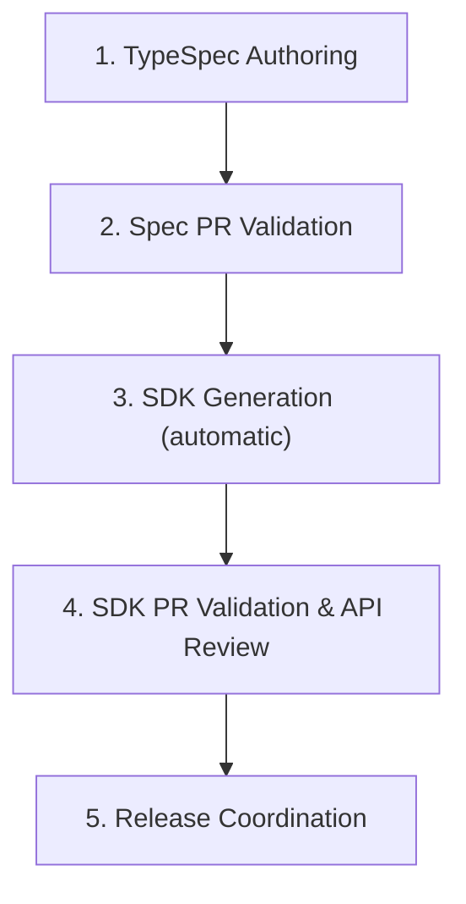

# TypeSpec-to-SDK Release Workflow Spec

> [!IMPORTANT]
> **Review goal**: Validate the end-to-end workflow contract, stage ownership, gates, and unresolved decisions.

**Status:** In review
**Document owner:** Sameeksha
**Primary audience:** SDK tooling owners, EngSys, language teams, API review stakeholders
**Last meaningful update:** 2026-07-07
**PR focus:** Workflow structure + gaps + decision log

---

## Navigation

| Need | Jump |
|------|------|
| Quick walkthrough | [Start here](#start-here-10-minute-walkthrough) |
| Workflow map | [Workflow map](#workflow-map) |
| Stage details | [Stage modules](#stage-modules) |
| Labels & gates | [Cross-cutting contracts](#cross-cutting-contracts) |
| Open decisions | [Decision log](#decision-log) |
| Known gaps | [Gap tracker](#gap-tracker) |

---

## Start here: 10-minute walkthrough

### What this spec defines

The end-to-end process from TypeSpec change → spec PR → API review → SDK generation → SDK PR validation → release. One document covering all stages, owners, gates, and gaps.

### The five-stage workflow



### How a service team uses this (6 steps)

1. **Author TypeSpec** — Write `.tsp` files and `tspconfig.yaml` locally (or use `azure-typespec-author` agent skill)
2. **Open a spec PR** — Push to `azure-rest-api-specs`. CI validates automatically.
3. 🧑‍💻 **Wait for approvals** — Namespace approval (first preview), ARM review (ARM specs), breaking change review (ARM specs). **There is no spec-level API review** — API review happens only at the SDK level (Stage 4).
4. **Spec PR merges → SDK generation is automatic** — Release plan created, SDKs generated, SDK PRs opened per language ⚠️ *Generation failures currently fail silently — [Gap #4](#gap-tracker)*
5. 🧑‍💻 **SDK PR review & approval** — SDK CI runs. **SDK API review** of generated SDK surface via APIView (current) or API Review Hub review PRs (future). ARH assigns `<lang>-api-approved` labels as **informational** signals — source of truth is ADO Package Work Items (API hash). Auto-repair handles custom code drift. For mgmt plane, Shanghai team reviews SDK PRs with release plans.
6. 🧑‍💻 **Release** — Trigger release pipeline (manual approval gate required for security). Packages publish, release plan completes.

### Decisions needed in this review

| # | Decision | Why it matters | Owner | Status |
|---|----------|---------------|-------|--------|
| D1 | How does ARH review PR creation get triggered on SDK PRs? | No automation today — open design gap | @tjprescott | Open |
| D2 | Are `api-approved` / `<lang>-api-approved` labels authoritative or informational? | ARH tracks approval in ADO Package Work Items (API hash), not via labels. Labels are **informational**. | @tjprescott | Resolved — labels are informational |
| D3 | Should service teams approve SDK PRs? | Current flow doesn't require it | Laurent | Open |
| D4 | Where does breaking-change enforcement live? | Defines responsibility and UX | TBD | Open |
| D5 | What triggers auto-release after SDK PR merge? | Last missing piece for full E2E automation | @raych1 | Open |

---

## Workflow map

### Stage summary

| Stage | Entry signal | Exit signal | Primary owner | Main risk |
|-------|-------------|------------|---------------|-----------|
| 1. TypeSpec Authoring | Local TypeSpec change | PR-ready `.tsp` files | Authoring/tooling | Late discovery of issues |
| 2. Spec PR Validation | PR opened in `azure-rest-api-specs` | CI pass + labels + approved | Ray / Crystal / EngSys | Unclear label/gate semantics |
| 3. SDK Generation | Spec PR merged | SDK PRs created per language | spec-gen-sdk / EngSys | Failures not actionable |
| 4. SDK PR Validation | SDK PR opened in language repo | PR approved & merged | Language teams / architects | Validation failures hard to interpret |
| 5. Release Coordination | SDK PR merged | Packages published + KPI updated | Release tooling / EngSys | Source of truth unclear |

### Sequence diagram

```
┌──────────┐     ┌──────────┐     ┌──────────┐     ┌──────────┐     ┌──────────┐     ┌──────────┐
│ Service  │     │ Spec Repo│     │   CI     │     │Reviewers │     │SDK Repos │     │ Release  │
│  Team    │     │  (GH)    │     │Pipeline  │     │(ARM/API) │     │(per lang)│     │ Pipeline │
└────┬─────┘     └────┬─────┘     └────┬─────┘     └────┬─────┘     └────┬─────┘     └────┬─────┘
     │                 │                │                │                │                │
     │  Open spec PR   │                │                │                │                │
     │────────────────>│  CI triggers   │                │                │                │
     │                 │───────────────>│                │                │                │
     │                 │                │── Compile      │                │                │
     │                 │                │── LintDiff     │                │                │
     │                 │                │── Breaking chg │                │                │
     │                 │                │── APIView gen  │                │                │
     │                 │                │── SDK dry-run  │                │                │
     │                 │                │── Labels apply │                │                │
     │                 │                │                │                │                │
     │  [If PASS]      │  Request reviews               │                │                │
     │                 │───────────────────────────────->│                │                │
     │                 │                │                │  Reviews       │                │
     │                 │  Approved → MERGE               │                │                │
     │                 │                │                │                │                │
     │                 │  ─ ─ ─ ─ AUTOMATED FROM HERE ─ ─ ─ ─ ─ ─ ─ ─ ─ ─ ─ ─ ─ ─ ─ ─ │
     │                 │                │                │                │                │
     │                 │  Merge event   │                │                │                │
     │                 │───────────────>│── Release plan │                │                │
     │                 │                │── Generate SDK │                │                │
     │                 │                │───────────────────────────────────────>│         │
     │                 │                │                │                │  SDK PRs       │
     │                 │                │                │                │── SDK CI runs  │
     │                 │                │                │                │── API review   │
     │                 │                │                │                │                │
     │  [If build fail on custom code] auto-repair via Copilot          │                │
     │  [If API review feedback] → resolve via TypeSpec changes         │                │
     │                 │                │                │                │  SDK PR merged │
     │                 │                │                │                │                │
     │  Trigger release│                │                │                │       ┌───────>│
     │──────────────────────────────────────────────────────────────────────────┘        │
     │                 │                │                │                │   Publish pkgs │
     │  ✅ Done!       │                │                │                │   Update KPI   │
     │<────────────────────────────────────────────────────────────────────────────────────│
```

**Key insight**: After spec PR merge, the flow is largely **automated**. Service team re-engages only if SDK CI fails, API review has feedback, or release needs manual approval.

> **ARM vs Data Plane divergence** — Same high-level flow but diverge at review gates. ARM requires ARM review sign-off + stricter resource model constraints. Data plane skips ARM review. See: [ARM review](https://eng.ms/docs/products/azure-developer-experience/design/api-specs-pr/arm-review) | [Data plane review](https://eng.ms/docs/products/azure-developer-experience/design/api-specs-pr/data-plane-review)

---

## Stage modules

<a name="stage-1-typespec-authoring"></a>
### Stage 1 — TypeSpec Authoring

#### Quick card

| Field | Value |
|-------|-------|
| **Purpose** | Author/update TypeSpec locally, validate, prepare for spec PR |
| **Entry signal** | Service team has API requirements |
| **Exit signal** | `.tsp` files compile, lint passes, ready for PR |
| **Owners** | TypeSpec team (compiler/linter), Haoling (authoring agent), Mark (breaking change) |
| **Reviewer ask** | Confirm tool list and breaking change workflow |

#### Happy path

1. Write/update `.tsp` files and `tspconfig.yaml`
2. Compile locally with TypeSpec compiler
3. Run linter checks
4. Run breaking change detection (Phase A + B)
5. Ready to open spec PR

#### Failure paths

| Failure | Signal | Owner | Next action |
|---------|--------|-------|-------------|
| Compile error | TypeSpec compiler error | Author | Fix `.tsp` syntax/types |
| Linter violation | Linter warning/error | Author | Fix or suppress with decorator |
| Breaking change detected | Tool report with DiffKind + source location | Author | Apply suppression decorator or redesign |

<details>
<summary>Deep spec: tools, contracts, and unresolved questions</summary>

#### Tool contract

| Tool | Role | Owner |
|------|------|-------|
| TypeSpec compiler | Compile `.tsp` files, catch syntax/type errors | TypeSpec team |
| TypeSpec linter | Static guideline compliance (distinct from LintDiff) | TypeSpec team |
| TypeSpec authoring agent (`azure-typespec-author` skill) | Assist with ARM/data-plane patterns, Azure REST API guidelines | Haoling |
| `@azure-tools/typespec-breaking-change` | Phase A: same-version regression. Phase B: cross-version evolution. Inline suppression via decorators. | Mark Cowlishaw |

#### Gap

Breaking change tool reports findings with DiffKind, source location, and suggested suppression decorator — but resolution is manual. No agent auto-resolves.

#### Next step

Build author-validation loop where agent auto-applies suppression decorators based on structured breaking change output.

#### Open questions

- [ ] Does `@azure-tools/typespec-breaking-change` output provide enough structured context for agent auto-resolution? Need confirmation from Mark.

</details>

---

<a name="stage-2-spec-pr-validation"></a>
### Stage 2 — Spec PR Validation

#### Quick card

| Field | Value |
|-------|-------|
| **Purpose** | Validate spec PR: compile, lint, breaking changes, APIView tokens, SDK dry-run |
| **Entry signal** | PR opened/updated in `azure-rest-api-specs` |
| **Exit signal** | CI passes + review labels applied + approved & merged |
| **Owners** | EngSys (pipeline), Ray/Crystal (breaking change), TypeSpec team (lintdiff) |
| **Reviewer ask** | Confirm CI ordering, label semantics, and blocking vs informational |

#### Happy path

1. PR opens → CI triggers automatically
2. TypeSpec compiles → LintDiff runs → breaking change detection → APIView tokens generated → SDK dry-run
3. Labels applied based on results
4. ARM review (if ARM spec) + namespace approval (if new package) + API review
5. All approvals → PR merges

#### Failure paths

| Failure | Signal | Owner | Next action |
|---------|--------|-------|-------------|
| TypeSpec compile failure | CI red + compile error | Author | Fix TypeSpec |
| LintDiff violation | CI warning/error | Author | Fix or request suppression |
| Breaking change detected | `BreakingChangeReviewRequired` label | Breaking change review team | Approve, suppress, or redesign |
| SDK dry-run failure | CI failure in spec-gen-sdk | Author / EngSys | Fix TypeSpec or escalate |
| Namespace needs approval | `namespace-<lang>-pending` label | Namespace approvers | Apply `namespace-<lang>-approved` |

<details>
<summary>Deep spec: tools, contracts, and unresolved questions</summary>

#### Tool contract

| Tool | Role | Owner |
|------|------|-------|
| Spec PR validation pipeline | Orchestrates full validation suite | EngSys |
| TypeSpec compiler | CI compilation | TypeSpec team |
| TypeSpec Lintdiff | TypeSpec-native linting on PR diffs. Replacing Swagger-based Spectral LintDiff. Includes suppression process (@catalinaperalta). | EngSys / TypeSpec team |
| `@azure-tools/typespec-breaking-change` | Phase A + B detection. Auto-adds `BreakingChangeReviewRequired` / `VersioningReviewRequired` labels. | Mark |
| APIView emitter (`typespec-apiview`) | Generates API surface tokens for SDK-level architect review (tokens used at Stage 4). **Will be retired with ARH.** | APIView team |
| spec-gen-sdk | SDK generation validation (dry-run) | EngSys (Renhe) |
| Avocado / OAV | Legacy Swagger validation — **being deprecated** as TypeSpec-native tooling replaces them. | EngSys |

#### Gaps

1. Validation steps run independently — no designed chain for failure ordering or unified PR comment.
2. No endpoint liveness verification before spec PR merge — SDK may be generated for an undeployed API.
3. Avocado/OAV deprecation still in progress.

#### Open questions

- [ ] How should `BreakingChangeReviewRequired` label route to the correct review team? CODEOWNERS, custom Action, or DevOps?
- [ ] Should spec-gen-sdk failures be PR comments, structured JSON, or both?

</details>

---

<a name="stage-3-sdk-generation"></a>
### Stage 3 — SDK Generation (Automatic)

#### Quick card

| Field | Value |
|-------|-------|
| **Purpose** | Auto-generate SDK PRs per language when spec PR merges |
| **Entry signal** | Spec PR merged in `azure-rest-api-specs` |
| **Exit signal** | SDK PRs created and linked to release plan in each language repo |
| **Owners** | EngSys (spec-gen-sdk), language teams (emitters), azsdk-cli team |
| **Reviewer ask** | Confirm two-stage pipeline and error reporting gaps |

#### Happy path

1. Spec PR merges → pipeline triggers automatically
2. **Stage A**: Create or find release plan work item
3. **Stage B**: For each language: tsp-client syncs → emitter generates → customizations applied → build → test → metadata updated → SDK PR created and linked to release plan

#### Failure paths

| Failure | Signal | Owner | Next action |
|---------|--------|-------|-------------|
| Generation failure (any language) | Failed pipeline check (buried in logs) | EngSys / language owner | Investigate logs manually |
| Customization drift | Build failure in SDK PR | azsdk-cli team | `auto-sdk-build-fix` label → auto-repair |
| Release plan creation failure | Pipeline failure | azsdk-cli team | Investigate DevOps connectivity |

<details>
<summary>Deep spec: tools, contracts, and unresolved questions</summary>

#### Tool contract

| Tool | Role | Owner |
|------|------|-------|
| tsp-client | Syncs TypeSpec project into SDK repo | EngSys |
| Language emitters | Generate client library code (one per language) | Language teams |
| spec-gen-sdk | Pipeline automation — runs full workflow, creates SDK PRs | EngSys (Renhe) |
| azsdk-cli (`azsdk_package_generate_code`) | Local orchestration (available for dev iteration) | azsdk-cli team |
| `azsdk_customized_code_update` | Apply TypeSpec and code-level customizations | azsdk-cli team |

#### Gap

Generation errors silently fail. Error is buried in build logs — not surfaced as structured report (which language, which step, what error). No agent helps troubleshoot.

#### Next step

Structured error reporting from generation pipeline + agent-assisted troubleshooting.

#### Open questions

- [ ] Should generation failures be reported as PR comments on the spec PR or SDK PR?
- [ ] Can the auto-repair pattern from Stage 4 be extended to diagnose generation failures?

</details>

---

<a name="stage-4-sdk-pr-validation"></a>
### Stage 4 — SDK PR Validation & API Review

#### Quick card

| Field | Value |
|-------|-------|
| **Purpose** | Validate generated SDK PRs: build, test, lint, API review, auto-repair |
| **Entry signal** | SDK PR opened/updated in language repo |
| **Exit signal** | SDK PR approved and merged |
| **Owners** | Language teams (CI), architects (API review), azsdk-cli team (auto-repair) |
| **Reviewer ask** | Confirm auto-repair scope, API review transition (APIView → ARH), and approval mechanism |

#### Happy path

1. SDK PR opens → language CI triggers (build → test → lint → package validation → breaking change detection)
2. APIView generates SDK public API surface review (future: ARH creates review PR)
3. Architects review and approve
4. SDK PR approved and merged

#### Failure paths

| Failure | Signal | Owner | Next action |
|---------|--------|-------|-------------|
| Custom code drift | Build failure | azsdk-cli team | `auto-sdk-build-fix` label → Copilot agent auto-repairs |
| Other CI failure | Build/test/lint red | Language owner | Pipeline troubleshooting agent diagnoses |
| API review feedback | Architect comments | Author | Resolve via TypeSpec changes → re-generate → new commit → CI re-runs |
| SDK breaking change | Detection report | Ray / Crystal | Review and approve or fix |

<details>
<summary>Deep spec: tools, contracts, and unresolved questions</summary>

#### Tool contract

| Tool | Role | Owner |
|------|------|-------|
| Language CI pipelines | Build, test, lint, package validation | Language teams |
| SDK breaking change detector | Detects breaking changes in generated SDK API surface. Being combined into validation check. | Ray & Crystal |
| APIView (current) | SDK public API surface review via web UI | APIView team |
| **API Review Hub** (replacing APIView) | Creates synthetic review PRs with `API.md` diffs. PRs never merged — exist only for review. Architects auto-assigned. Approval recorded in ADO Package Work Items (API hash). CI gates release by checking hash. | @tjprescott |
| API review feedback resolution agent | Helps resolve API review comments via TypeSpec changes | azsdk-cli team |
| Pipeline troubleshooting agent | Diagnoses CI failures | azsdk-cli team |
| Auto SDK PR repair | `auto-sdk-build-fix` label → Copilot cloud agent fixes custom code drift → regenerate → rebuild. Shared orchestration in `eng/common/`, per-language opt-in. | azsdk-cli team |

#### Gaps

1. SDK breaking change detection integration in progress (being combined into validation check).
2. Auto-repair only handles custom-code drift — not all CI failure types.
3. ARH review PR creation on SDK PRs is not automated — mechanism TBD (open design gap).
4. API review feedback resolution agent needs evaluation for ARH compatibility.
5. Release gates transitioning from APIView → both → ARH only.

#### Open questions

- [ ] What triggers ARH review PR creation? SDK PR creation? Manual? Label?
- [ ] Are `<lang>-api-approved` labels authoritative, or is ADO the source of truth?
- [ ] Can auto-repair be extended beyond custom-code drift?

</details>

---

<a name="stage-5-release-coordination"></a>
### Stage 5 — Release Coordination

#### Quick card

| Field | Value |
|-------|-------|
| **Purpose** | Prepare for release, trigger pipeline, publish packages |
| **Entry signal** | SDK PR merged |
| **Exit signal** | Packages published, release plan completed, KPI updated |
| **Owners** | azsdk-cli team (tooling), EngSys (pipelines), language teams (publish) |
| **Reviewer ask** | Confirm two-phase gap and release type approval differences |

#### Happy path

1. Release plan work item updated
2. Changelog prepared (mgmt: auto-generated; data-plane: manual review needed)
3. Readiness checked per language
4. SDK PR approved and merged (changelog, metadata, tests all done *before* merge)
5. Release pipeline triggered — **becoming automatic** (@raych1 working on auto-trigger on SDK PR merge)
6. **Release gate check** — API Review Hub verifies approved API hash
7. Packages published → release plan auto-completes → Service Tree KPI updated

#### The two release processes

| Process | What | Owner | Status |
|---------|------|-------|--------|
| **SDK PR readiness** (before merge) | Make SDK PR release-ready: fix linter failures, test failures, merge conflicts, breaking changes, update changelog/metadata. Tracked in [#15705](https://github.com/Azure/azure-sdk-tools/issues/15705). | Praveen / Language teams / EngSys | Multiple items open — see issue |
| **Release trigger** (after merge) | Auto-trigger release pipeline when SDK PR merges. Once PR is merged, changelog and metadata are already done — just need to release. | @raych1 | In progress — becoming automatic |

> **Key clarification**: Changelog, metadata, and version updates happen *inside the SDK PR before merge* — they are part of SDK PR readiness. After merge, the only step is triggering the release pipeline (which Ray is automating). The manual approval gate on the release pipeline itself cannot be removed for security reasons.

#### Failure paths

| Failure | Signal | Owner | Next action |
|---------|--------|-------|-------------|
| Changelog not ready | Readiness check fails | Author | Update changelog |
| Pipeline provisioning delay | No pipeline for new RP | EngSys | Wait for overnight batch (or CI-trigger `prepare-pipelines`) |
| Release gate fails | API hash not approved | Architect | Complete API review |
| ESRP publish failure | Pipeline failure | ESRP team | Escalate |

#### Release type approval differences

| Release Type | Approval Gates | Notes |
|-------------|----------------|-------|
| Preview (first) | Namespace approval required | Fastest path; namespace needed for new packages |
| Preview (update) | No architect board review (can be requested) | Fastest path |
| GA (first release) | Architect board review required | Namespace approval if new package |
| GA (update) | Standard review | Breaking changes need separate approval |
| Patch | Standard review | Must maintain backward compatibility |

<details>
<summary>Deep spec: tools, contracts, and unresolved questions</summary>

#### Tool contract

| Tool | Role | Owner |
|------|------|-------|
| Release plan tooling (`azsdk_create_release_plan`, etc.) | Create/update/link Azure DevOps work items | azsdk-cli team |
| Changelog/versioning tool | Automates changelog updates. **Mgmt plane**: auto-generated reliably (compare with latest GA). **Data-plane**: not reliable, may need manual curation ([discussion](https://github.com/Azure/azure-sdk-tools/pull/15248#discussion_r3353097483)). | @jsquire |
| Release pipeline (`azsdk_release_sdk`) | Check readiness, trigger release | azsdk-cli team |
| **API Review Hub release gate** | `GET /api/releases/check-gate` verifies API hash. `POST /api/releases/mark-released` records release and closes review PRs. | @tjprescott |
| Language release pipelines | Publish to PyPI, Maven, npm, NuGet, Go module proxy | Language teams |
| Service Tree integration | Mark service KPIs as completed | EngSys |

#### Gap

Two processes, different maturity:
1. **SDK PR readiness** (before merge) — Multiple gaps tracked in [#15705](https://github.com/Azure/azure-sdk-tools/issues/15705): linter failures (especially samples), recorded test failures, merge conflicts, .NET-specific gaps, pipeline provisioning delay. Changelog: mgmt auto-generated reliably, data-plane not reliable.
2. **Release trigger** (after merge) — Auto-trigger on SDK PR merge being built by @raych1. Once merged, changelog/metadata are already done — just need to trigger release.

Manual approval gate on release pipeline cannot be removed for security (ARM approval = Shanghai team).

#### Open questions

- [ ] What triggers auto-release after SDK PR merge?
- [ ] For patch releases — what triggers the workflow differently?

</details>

---

## Cross-cutting contracts

### Label contract

#### Spec PR Labels (`azure-rest-api-specs`)

| Label | Applied by | Meaning | Blocking? | Automation |
|-------|-----------|---------|-----------|------------|
| `BreakingChangeReviewRequired` | CI | Breaking change detected | Yes | ⚠️ Label auto, routing manual |
| `VersioningReviewRequired` | CI | Versioning review needed | Yes | ⚠️ Label auto, assignment manual |
| `ARM-Review-Required` | CI | ARM spec — routes to ARM team | Yes | ✅ Fully automated |
| `ARMSignedOff` | ARM team | ARM review approved | Unblocks | ✅ Manual label, gate automated |
| `APIStewardshipBoard-SignedOff` | Stewardship board | Data-plane API approved | No (transitioning) | ⚠️ Process in transition |
| `namespace-<lang>-pending` | CI | New namespace detected | Yes | ✅ Fully automated |
| `namespace-<lang>-approved` | Architect | Namespace approved | Unblocks | ✅ Manual label, gate automated |
| `namespace-approved-all` | Architect | Approves all languages (mgmt) | Unblocks | ✅ Manual label, gate automated |
| `Approved-BreakingChange` | Review team | Breaking change approved | Unblocks | ⚠️ Manual label, gate works |
| `Suppression-Approved` | Review team | Linter suppression approved | Unblocks | ⚠️ Manual label, validation automated |

#### SDK PR Labels (language repos)

| Label | Applied by | Meaning | Blocking? | Automation |
|-------|-----------|---------|-----------|------------|
| `auto-sdk-build-fix` | CI / human | Triggers Copilot auto-repair | No | ✅ Triggers cloud agent |
| `<lang>-api-approved` | ARH / Architect | SDK API approved — **informational only**. Source of truth is ADO (API hash). | Informational | ⚠️ ARH will assign automatically |
| `release-plan-linked` | Automation | Marks PR for Shanghai team review | No | ✅ Auto-applied |
| `ready-for-review` | GitHub Form | Triggers architect review process | No | ✅ Applied via workflow |
| `needs-info` | Reviewer | Needs more info from service team | No | ⚠️ Manual, no automation |
| `review-out-of-date` | ARH | Review PR stale | No | 🔜 Part of ARH |
| `architecture-review-needed` | ARH | Flags for architect review | No | 🔜 Part of ARH |

### Approval gates (3 workstreams converging)

| Workstream | Status | Scope | Long-term fate |
|-----------|--------|-------|----------------|
| **GitHub Forms + Actions** (PR #10037, shipped) | ✅ Live | Review intake via `azure-sdk` repo. `arch-board-review.yml` = bridge. `namespace-review.yml` = long-term. | `arch-board-review.yml` retires when ARH ships |
| **API Review Hub** (@tjprescott, in progress) | 🔜 Prototype | SDK-level review via synthetic GitHub PRs. Does NOT operate at spec level. | Replaces APIView for SDK review |
| **Spec PR-based namespace approval** ([PR #44085](https://github.com/Azure/azure-rest-api-specs/pull/44085), in progress) | 🔜 In progress | Namespace approval on spec PR merge. | Retires `namespace-review.yml` |

### Orchestration architecture: skill chaining

The system uses **prompt chaining**: independent sub-skills invoked sequentially, each returning `NextSteps` that guide the LLM agent to the next action. `CommandResponse.NextSteps` is used across 20+ tool and service files.

<details>
<summary>Deep spec: orchestration gaps</summary>

| Gap | Current State | Improvement |
|-----|---------------|-------------|
| NextSteps are natural language | LLM must interpret free-text — works but fragile | Structured NextSteps with explicit tool name + parameters |
| Chaining is partial (Stages 3–5 only) | No NextSteps connecting Stage 1 → 2 | Add cross-tool NextSteps for early stages |
| Skills don't reference each other | SKILL.md files fully independent | Document expected skill sequences |
| No state detection | Agent can't determine "where am I?" | Add workflow status tool (query release plan + PR status) |
| Errors not structured for agents | Some errors buried in logs | Every tool returns parseable errors with suggested next action |
| Label-driven automation gaps | Routing not fully connected | Connect label events to automation |

</details>

### Related process documentation

| Process | Link | Scope |
|---------|------|-------|
| Namespace approval | [Namespace approval (PR #44085)](https://github.com/Azure/azure-rest-api-specs/pull/44085) | Permissions, flow, labels — in progress |
| ARM review | [ARM review](https://eng.ms/docs/products/azure-developer-experience/design/api-specs-pr/arm-review) | ARM-specific gates |
| Data plane review | [Data plane review](https://eng.ms/docs/products/azure-developer-experience/design/api-specs-pr/data-plane-review) | Data plane gates |
| REST API spec review | [Review process](https://eng.ms/docs/products/azure-developer-experience/design/api-review) | Architect board flow |
| SDK API review (bridge) | [Arch board review process](https://github.com/Azure/azure-sdk/blob/main/.github/workflows/src/arch-board-review/ARCH-BOARD-REVIEW-PROCESS.md) | GitHub Form — **bridge** until ARH |
| API Review Hub | TBD | Synthetic review PRs replacing APIView |
| Mgmt plane release | [Release process](https://eng.ms/docs/products/azure-developer-experience/plan/mgmt-sdk-release-process) | Service + SDK team responsibilities |
| SDK PR readiness gaps | [Tracking issue #15705](https://github.com/Azure/azure-sdk-tools/issues/15705) | Consolidated gaps |
| Release plan dashboard | [Dashboard](https://aka.ms/azsdk/releaseplan-dashboard) | Track release progress |

---

## Decision log

- [ ] **D1**: How does ARH review PR creation get triggered on SDK PRs? (No automation today)
- [x] **D2**: ~~Are `api-approved` / `<lang>-api-approved` labels authoritative or informational?~~ **Resolved: Labels are informational.** ARH tracks approval in ADO Package Work Items (API hash).
- [ ] **D3**: Should service teams approve SDK PRs? (Not required today)
- [ ] **D4**: Where does breaking-change enforcement live? (Spec level vs SDK level)
- [ ] **D5**: What triggers auto-release after SDK PR merge? (Last E2E automation piece)
- [ ] **D6**: How should `BreakingChangeReviewRequired` route to review team? (CODEOWNERS, Action, or DevOps)
- [ ] **D7**: Should spec-gen-sdk failures be PR comments, structured JSON, or both?
- [ ] **D8**: For patch releases — what triggers the workflow differently?
- [ ] **D9**: What is the .NET team's tooling stack and integration points with azsdk-cli?

---

## Gap tracker

| # | Gap | Stage | Owner | Blocking? | Status |
|---|-----|-------|-------|-----------|--------|
| 1 | Breaking change findings require manual resolution | 1, 2 | Mark / Crystal | No | Open |
| 2 | End-to-end CI chain not designed (no unified PR comment) | 2 | Ray & Crystal | Yes | Open |
| 3 | Label routing for breaking change review undefined | 2 | Ray | No | Open |
| 4 | Generation errors silently fail | 3 | Praveen / spec-gen-sdk | Yes | Open |
| 5 | No troubleshooting for generation failures | 3 | azsdk-cli team | No | Open |
| 6 | SDK breaking change detection integration in progress | 4 | Ray & Crystal | No | In progress |
| 7 | .NET team alignment needed | All | Sameeksha + Laurent | No | Open |
| 8 | Scattered documentation | All | Sameeksha + Praveen | No | In progress (this doc!) |
| 9 | Release is two-phase manual process | 5 | @raych1 | Yes | Open |
| 10 | ARM vs data plane divergence undocumented | 2, 4 | Sameeksha + Praveen | No | Open |
| 11 | No endpoint liveness verification | 2 | TBD | No | Aspirational |
| 12 | No auto-release after SDK PR merge | 5 | TBD | Yes | Open |
| 13 | Late spec validation (caught at SDK PR stage) | 2, 4 | Praveen / spec-gen-sdk | Yes | Open |
| 14 | SDK PR not fully ready after generation | 4 | Praveen / Language teams | Yes | Open |
| 15 | Release pipeline provisioning delay | 5 | EngSys | No | In progress |
| 16 | ARH review PR creation not automated | 4 | @tjprescott | Yes | Open |
| 17 | API review feedback agent needs ARH compatibility | 4 | azsdk-cli team | No | Open |
| 18 | Release gate transition (APIView → ARH) | 5 | @tjprescott / EngSys | No | Open |

> **See also**: [SDK PR Release Readiness tracking issue (#15705)](https://github.com/Azure/azure-sdk-tools/issues/15705)

---

## Success criteria

- [ ] Users can complete full TypeSpec → SDK release workflow with agent guidance
- [ ] Agent detects existing state and resumes from appropriate step
- [ ] Release plan is automatically updated at each step
- [ ] All sub-skills integrate seamlessly without context loss between stages
- [ ] Local and pipeline SDK generation paths both work
- [ ] Breaking change findings from CI are surfaced clearly
- [ ] API review feedback can be resolved within the workflow
- [ ] Works for all tier-1 SDK languages
- [ ] Errors at every stage produce structured, actionable guidance
- [ ] Service Tree KPI is updated on release completion

---

## Exceptions and limitations

<details>
<summary>Exception 1: Architect Board Review</summary>

**Description**: First GA releases require architect board review. First preview requires namespace approval for new packages.

**Impact**: Cannot fully automate GA approval or first preview namespace approval.

**Status**: Three workstreams converging:
1. **GitHub Forms + Actions (shipped)** — `arch-board-review.yml` is bridge until ARH. `namespace-review.yml` stays long-term.
2. **API Review Hub (in progress)** — Replaces APIView for SDK review. Namespace out of scope.
3. **Spec PR-based namespace approval ([PR #44085](https://github.com/Azure/azure-rest-api-specs/pull/44085), in progress)** — Namespace approval on spec PR merge.

</details>

<details>
<summary>Exception 2: Breaking Change Reviews</summary>

**Description**: Breaking changes require review team approval. Separate process with own team and labels.

**Impact**: Breaking change releases blocked until approved.

**Workaround**: Agent helps prepare suppression decorators with clear reasons.

</details>

<details>
<summary>Exception 3: Package Naming Approval</summary>

**Description**: New packages require namespace/naming approval before release.

**Impact**: New package releases blocked until approved.

**Status**: Being automated as merge gate on spec PRs. CI extracts namespaces, applies `namespace-<lang>-pending` labels, blocks merge until approved. Longer-term: namespace approval may move entirely to spec PR flow.

</details>

<details>
<summary>Exception 4: .NET Team Tooling</summary>

**Description**: .NET team has tooling sharing infrastructure with azsdk-cli via `azsdk_customized_code_update` and TypeSpec linter/fixer patterns.

**Impact**: .NET ahead on auto-repair and linter integration. Other languages can adopt same patterns.

**Next step**: Alignment meeting to document remaining .NET-specific tools.

</details>

---

## Definitions

<details>
<summary>Expand all definitions</summary>

- **TypeSpec**: Language for describing cloud service APIs. See [typespec.io](https://typespec.io).
- **SDK**: Client libraries generated from TypeSpec for .NET, Java, JavaScript, Python, Go.
- **Release Plan**: Azure DevOps work item tracking end-to-end SDK release across languages.
- **API Spec PR**: Pull request in `azure-rest-api-specs` containing TypeSpec changes.
- **SDK PR**: Pull request in a language SDK repo with generated and customized SDK code.
- **APIView**: Current web tool for reviewing SDK public API surface. Being replaced by API Review Hub. Operates at **SDK level only** — there is no spec-level API review.
- **API Review Hub (ARH)**: New service replacing APIView for **SDK-level API review only** — there is no spec-level API review. Creates synthetic "review PRs" in language repos with `API.md` diffs — never merged, exist only for review. Approval recorded in ADO Package Work Items. `<lang>-api-approved` labels are **informational**. ⚠️ ARH review PR creation on SDK PRs is an open design gap.
- **tspconfig.yaml**: Configuration specifying emitter settings per language.
- **tsp-location.yaml**: Configuration in SDK repos pointing to source TypeSpec project.
- **`@azure-tools/typespec-breaking-change`**: TypeSpec-native breaking change detector. Phase A: same-version regression. Phase B: cross-version evolution.
- **Suppression Decorators**: `@approvedBreakingChange` (Phase B) and `@approvedUnversionedChange` (Phase A).
- **TypeSpec Customizations**: SDK-specific customizations in `client.tsp`.
- **Code Customizations**: Hand-written SDK code preserved across regeneration.
- **TypeSpec Lintdiff**: Linting pipeline on spec PR diffs. Replacing Swagger-based Spectral LintDiff.
- **spec-gen-sdk**: Pipeline tool automating SDK generation from specs.

</details>

---

## Appendix: Detailed Flowchart

<details>
<summary>Expand full detailed flowchart</summary>

```
                         ┌─────────────────────────────────┐
                         │  ENTRY POINT A                  │
                         │  User provides initial prompt   │
                         │  (starts at Stage 1)            │
                         └──────────────┬──────────────────┘
                                        │
                                        ▼
╔═══════════════════════════════════════════════════════════════════╗
║  STAGE 1: TypeSpec Authoring (local)                             ║
╚═══════════════════════════════════════════════════════════════════╝
                                    │
              ┌───────────────────────────────────────────────────┐
              │  STEP 1: Author TypeSpec                          │
              └───────────────────────┬───────────────────────────┘
                                      │
           ┌──────────────────────────┴──────────────────────────┐
           │                                                     │
           ▼                                                     ▼
┌─────────────────────────┐                     ┌─────────────────────────┐
│ Create new TypeSpec     │                     │ Update existing         │
│ project                 │                     │ TypeSpec project        │
└───────────┬─────────────┘                     └───────────┬─────────────┘
            │                                               │
            └───────────────────────┬───────────────────────┘
                                    │
                                    ▼
              ┌───────────────────────────────────────────────────┐
              │  STEP 2: Validate & Compile TypeSpec              │
              │  • TypeSpec compiler                              │
              │  • Linter checks                                 │
              │  • Breaking change detection (Phase A + B)       │
              └───────────────────────┬───────────────────────────┘
                                      │
           ┌──────────────────────────┴──────────────────────────┐
           │ FAIL                                                │ PASS
           ▼                                                     ▼
┌─────────────────────────┐                     ┌─────────────────────────┐
│ Report errors,          │                     │ TypeSpec Ready!         │
│ iterate on TypeSpec     │◀────────────────────│ Extract API version &   │
│ (loop until passing)    │                     │ package names           │
└─────────────────────────┘                     └───────────┬─────────────┘
                                                            │
                                                            ▼
              ┌───────────────────────────────────────────────────┐
              │  STEP 3: Open API Spec PR                        │
              └───────────────────────┬───────────────────────────┘
                                      │
                                      ▼
╔═══════════════════════════════════════════════════════════════════╗
║  STAGE 2: Spec PR Validation (CI)                                ║
╚═══════════════════════════════════════════════════════════════════╝
                                    │
              ┌───────────────────────────────────────────────────┐
              │  STEP 4: CI Validation Pipeline                  │
              │  • TypeSpec compilation                          │
              │  • LintDiff                                      │
              │  • Breaking change detection                     │
              │  • APIView token generation                      │
              │  • SDK generation dry-run                        │
              │  • Labels applied                                │
              └───────────────────────┬───────────────────────────┘
                                      │
           ┌──────────────────────────┴──────────────────────────┐
           │ FAIL                                                │ PASS
           ▼                                                     ▼
┌─────────────────────────┐                     ┌─────────────────────────┐
│ Fix issues, push to PR  │                     │ STEP 4b: Reviews       │
│ (re-triggers pipeline)  │                     │ • ARM review           │
└─────────────────────────┘                     │ • API review (spec PR  │
                                                │   = review surface)    │
                                                │ • Namespace approval   │
                                                └───────────┬─────────────┘
                                                            │
                                                            ▼
              ┌───────────────────────────────────────────────────┐
              │  PR approved & merged                             │
              └───────────────────────┬───────────────────────────┘
                                      │
                                      ▼
╔═══════════════════════════════════════════════════════════════════╗
║  STAGE 3: Automated SDK Generation                               ║
╚═══════════════════════════════════════════════════════════════════╝
                                    │
              ┌───────────────────────────────────────────────────┐
              │  Pipeline runs automatically:                     │
              │  1) Create/find release plan                     │
              │  2) Generate SDK per language                    │
              │  3) Apply customizations                         │
              │  4) Create SDK PRs & link to release plan        │
              └───────────────────────┬───────────────────────────┘
                                      │
                                      ▼
╔═══════════════════════════════════════════════════════════════════╗
║  STAGE 4: SDK PR Validation & API Review                         ║
╚═══════════════════════════════════════════════════════════════════╝
                                    │
              ┌───────────────────────────────────────────────────┐
              │  STEP 5: SDK PR CI                               │
              │  • Build → Test → Lint → Package validation      │
              │  • SDK breaking change detection                 │
              │  • API review (APIView / ARH review PR)          │
              └───────────────────────┬───────────────────────────┘
                                      │
           ┌──────────────────────────┴──────────────────────────┐
           │ FAIL                                                │ PASS
           ▼                                                     ▼
┌─────────────────────────┐                     ┌─────────────────────────┐
│ Custom code drift?      │                     │ STEP 6: API Review     │
│ YES: auto-repair        │                     │ Architects review      │
│ NO: troubleshoot agent  │                     │ SDK public API surface │
└───────────┬─────────────┘                     └───────────┬─────────────┘
            │                                               │
            └───────────────────────┬───────────────────────┘
                                    │
              ┌───────────────────────────────────────────────────┐
              │  SDK PR approved & merged                         │
              └───────────────────────┬───────────────────────────┘
                                      │
                                      ▼
╔═══════════════════════════════════════════════════════════════════╗
║  STAGE 5: Release Coordination                                   ║
╚═══════════════════════════════════════════════════════════════════╝
                                    │
              ┌───────────────────────────────────────────────────┐
              │  STEP 7: Release                                 │
              │  7a. Update changelog (mgmt: auto; dp: manual)  │
              │  7b. Check release readiness                     │
              │  7c. Trigger release pipeline (manual gate)      │
              │  7d. Packages published → KPI updated            │
              └─────────────────────────────────────────────────┘
```

</details>
