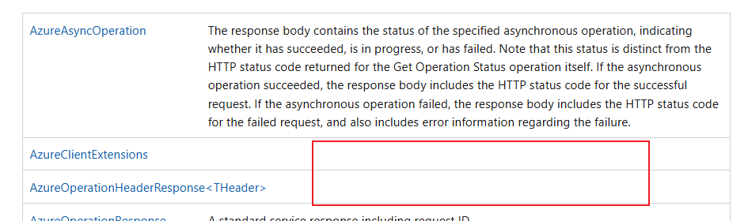
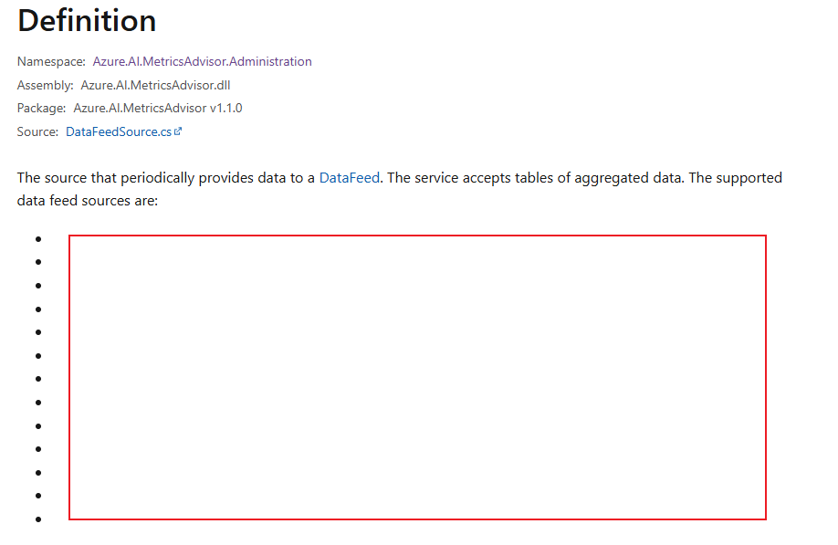
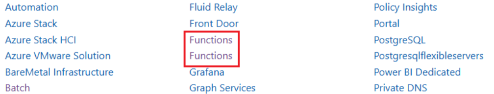

# Tool Rules Introduction For DotNet

## Overview

This document introduces 6 rules designed for DotNet Data SDK on [Microsoft Learn website](https://learn.microsoft.com/en-us/dotnet/api/overview/azure/?view=azure-dotnet) to complete automated content validation.

## Validation Rules

- [MissingContentValidation](#1-missingcontentvalidation)
- [EmptyTagsValidation](#2-emptytagsvalidation)
  > Note: Compared to Python rules, `EmptyTagsValidation` exists only in DotNet rules.
- [DuplicateServiceValidation](#3-duplicateservicevalidation)

### 1. MissingContentValidation

- **Goal:**
  This rule checks if there is the blank table.

- **Example:**

  - Link:
    https://learn.microsoft.com/en-us/dotnet/api/microsoft.rest.azure?view=azure-dotnet
  - Image:

    &nbsp;

- **Code Snippet:**

  ```csharp

    public bool isIgnore = false;
    private async Task ProcessCellAsync(
      IElementHandle cell,
      IPage page,
      string testLink,
      List<string> errorList,
      List<IgnoreItem> ignoreList,
      List<IgnoreItem> ignoreListOfErrorClass,
      bool isColspan2 = false
      )
    {
      var rawText = await cell.EvaluateAsync<string>("el => el.textContent");
      var cellText = rawText?.Trim() ?? "";
  
      // Skip ignored text
      if (ignoreList.Any(item => cellText.Equals(item.IgnoreText, StringComparison.OrdinalIgnoreCase)))
      {
          isIgnore = true;
          return;
      }
  
      if (testLink.Contains("javascript", StringComparison.OrdinalIgnoreCase) && testLink.Contains("errors", StringComparison.OrdinalIgnoreCase))
      {
          if (ignoreListOfErrorClass.Any(item => cellText.Equals(item.IgnoreText, StringComparison.OrdinalIgnoreCase)))
          {
              isIgnore = true;
              return;
          }
      }
  
      if (!isColspan2)
      {
          if (!string.IsNullOrEmpty(cellText))
          {
              isIgnore = false;
              return;
          }
          else
          {
              if (isIgnore)
              {
                  isIgnore = false;
                  return; // Skip if the cell is ignored
              }
          }
      }
  
      var anchorLink = await GetAnchorLinkForCellAsync(cell, page, testLink);
  
      if (anchorLink == "This is an ignore cell, please ignore it.")
      {
          return; // Skip if the anchor link is the ignore text
      }
  
      if (!anchorLink.Contains("#packages", StringComparison.OrdinalIgnoreCase) &&
          !anchorLink.Contains("#modules", StringComparison.OrdinalIgnoreCase))
      {
          errorList.Add(anchorLink);
      }
    }


  ```


### 2. EmptyTagsValidation

- **Goal:**
  This rule checks whether there is Empty tags `<li></li>`.

- **Example:**
  - Link:
    https://learn.microsoft.com/en-us/dotnet/api/azure.ai.metricsadvisor.administration.datafeedsource?view=azure-dotnet
  - Image:

    &nbsp;

- **Code Snippet:**

  ```csharp

    // Get all <li> elements
    var liElements = page.Locator("main#main li").AllAsync();
    // int count = await liElements.CountAsync();
    
    foreach (var li in await liElements)
    {
        // Get and trim inner text
        var text = (await li.InnerTextAsync())?.Trim();
    
        if (text == "")
        {
            // Add to error list
            errorList.Add("<li></li>");
        }
    }
    
    
    if (errorList.Any())
    {
        var formattedList = errorList
            .GroupBy(item => item)
            .Select((group, index) => $"{index + 1}. Appears {group.Count()} times, {group.Key}")
            .ToList();
    
        res.Result = false;
        res.ErrorLink = testLink;
        res.NumberOfOccurrences = errorList.Count;
        res.ErrorInfo = "There are empty <li> tags on the page.";
        res.LocationsOfErrors = formattedList;
    }

  ```

### 3. DuplicateServiceValidation

- **Goal:**
  This rule checks whether there is duplicate service.

  > Note: In [DotNet doc](https://learn.microsoft.com/en-us/dotnet/api/overview/azure/?view=azure-dotnet), currently there is no such issue. The example from [Python doc](https://learn.microsoft.com/en-us/python/api/overview/azure/?view=azure-python), currently this issue have been fixed.

- **Example:**

  - Link:
    https://learn.microsoft.com/en-us/python/api/overview/azure/?view=azure-python
  - Image:

    &nbsp;

- **Code Snippet:**

  ```csharp

    //Get all service tags in the test page.
    var aElements = await page.Locator("li.has-three-text-columns-list-items.is-unstyled a[data-linktype='relative-path']").AllAsync();
  
    //Check if there are duplicate services.
    foreach (var element in aElements)
    {
        var text = await element.InnerTextAsync();
  
        //Store the names in the `HashSet`.
        //When `HashSet` returns false, duplicate service names are stored in another array.
        if (!set.Add(text))
        {
            errorList.Add(text);
  
            res.Result = false;
            res.ErrorLink = testLink;
            res.NumberOfOccurrences += 1;
        }
  
    }


  ```

