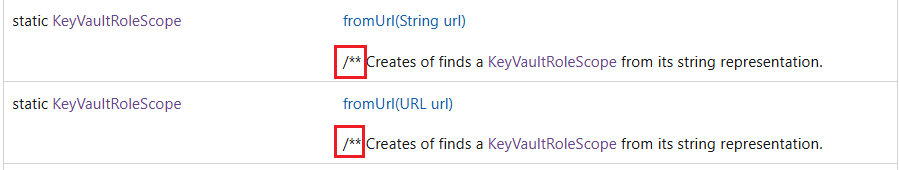
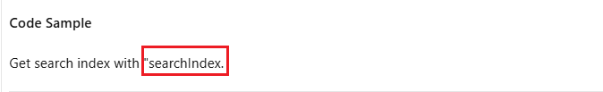
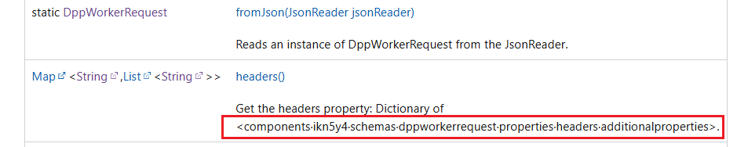
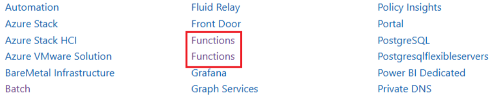

# Tool Rules Introduction For Java

## Overview

This document introduces 6 rules designed for Java Data SDK on [Microsoft Learn website](https://learn.microsoft.com/en-us/java/api/overview/azure/?view=azure-java-stable) to complete automated content validation.

## Validation Rules

- [ExtraLabelValidation](#1-extralabelvalidation)
- [UnnecessarySymbolsValidation](#2-unnecessarysymbolsvalidation)
- [MissingContentValidation](#3-missingcontentvalidation)
- [GarbledTextValidation](#4-garbledtextvalidation)
- [DuplicateServiceValidation](#5-duplicateservicevalidation)
- [InconsistentTextFormatValidation](#6-inconsistenttextformatvalidation)
- [CodeFormatValidation](#7-codeformatvalidation)
- [InvalidTagsValidation](#8-invalidtagsvalidation)
  > Note: Compared to Python rules, `InconsistentTextFormatValidation` and `CodeFormatValidation` exist only in Java rules, while `TypeAnnotationValidation` does not exist in Java rules.

### 1. ExtraLabelValidation

- **Goal:**
  This rule detects whether there are front-end tags in the page that are not parsed correctly.

- **Extra Labels:**

  - `<br` , `<span` , `<div` , `<table` , ``.
    > Note: The Extra labels currently detected is `/p>`.

- **Example:**

  - Extra Label: `/p>`
  - Text Content:
    `The Azure AI Search service provides:/p>`
  - Link:
    <https://learn.microsoft.com/en-us/java/api/com.azure.search.documents?view=azure-java-stable>
  - Image:  
    &nbsp;

- **Code Snippet:**

  ```csharp

    // Define a list (labelList) containing various HTML tags and entities.
    var labelList = new List<string> {
        "/p>",
        "<br",
        "<span",
        "<div",
        "<table",
        "` , `~` , `[` , `]` , `///`.
    > Note: Tes unnecessary symbol currently detected is `>` , `/**` , `-`

- **Example1:**

  - Unnecessary Symbols: `>`
  - Text Content:

    `public void addActions(Collection> actions)`

    `public Mono> createBlobContainerIfNotExistsWithResponse(String containerName, BlobContainerCreateOptions options)`

  - Link:  
    <https://learn.microsoft.com/en-us/java/api/com.azure.search.documents.searchindexingbufferedsender?view=azure-java-stable>

    <https://learn.microsoft.com/en-us/java/api/com.azure.storage.blob.blobserviceasyncclient?view=azure-java-stable>

  - Image:  
    &nbsp;  
    &nbsp;

- **Example2:**

  - Unnecessary Symbols: `/**` , `-`

  - Text Content:

    `/** Creates of finds a KeyVaultRoleScope from its string representation.`

    `- If the deserialized XML object was missing any required properties.`

  - Link:  
    <https://learn.microsoft.com/en-us/java/api/com.azure.security.keyvault.administration.models.keyvaultrolescope?view=azure-java-stable#method-summary>

    <https://learn.microsoft.com/en-us/java/api/com.azure.storage.blob.models.blobcontaineritem?view=azure-java-stable#method-details>

  - Image:

    &nbsp;  
    &nbsp;

- **Example3:**

  - Unnecessary Symbols: `"` , `-`

  - Text Content:

    `Get search index with "searchIndex.`

    `other -`

  - Link:  
    <https://learn.microsoft.com/en-us/java/api/com.azure.search.documents.indexes.searchindexasyncclient?view=azure-java-stable#method-details>

    <https://learn.microsoft.com/en-us/java/api/com.azure.messaging.servicebus.administration.models.sqlrulefilter?view=azure-java-stable#method-details>

  - Image:

    &nbsp;
    &nbsp;

- **Code Snippet:**

  ```csharp

    private void ValidateHtmlContent(string htmlContent)
    {
        // Usage: Find the text that include [ , ], < , >, &, ~, and /// symbols.
        string includePattern = @"[\[\]<>&~]|/{3}";

        // Usage: When the text contains symbols  < or >, exclude cases where they are used in a comparative context (e.g., a > b).
        string excludePattern1 = @"(?<=\w\s)[<>](?=\s\w)";

        // New pattern to match the specified conditions.(e.g., /** hello , **note:** , "word.)
        string newPatternForJava = @"\s\""[a-zA-Z]+\.|^\s*/?\*\*.*$";

        string[] lines = htmlContent.Split(["\r\n", "\n"], StringSplitOptions.RemoveEmptyEntries);

        for (int index = 0; index < lines.Length; index++)
        {
            string line = lines[index];

            var matchCollections = Regex.Matches(line, includePattern);

            foreach (Match match in matchCollections)
            {
                if (match.Value.Equals("<") || match.Value.Equals(">"))
                {
                    if (Regex.IsMatch(line, excludePattern1))
                    {
                        continue;
                    }
                    // Usage: When the text contains <xref, this case will be categorized as an error of ExtraLabelValidation.
                    if (line.Contains("<xref"))
                    {
                        continue;
                    }
                    // Usage: When the text contains symbols => , -< , ->, exclude cases where they are used in a comparative context (e.g., a > b).
                    // Example: HTMLText - A list of stemming rules in the following format: "word => stem", for example: "ran => run".
                    // Link: https://learn.microsoft.com/en-us/python/api/azure-search-documents/azure.search.documents.indexes.models.stemmeroverridetokenfilter?view=azure-python#keyword-only-parameters
                    int i = match.Index - 1;
                    if (i >= 0 && (line[i] == '=' || line[i] == '-'))
                    {
                        continue;
                    }
                }

                if (match.Value.Equals("[") || match.Value.Equals("]"))
                {
                    if (line.Contains("<xref"))
                    {
                        continue;
                    }
                    if (IsBracketCorrect(line, match.Index))
                    {
                        continue;
                    }
                }

                string unnecessarySymbol = $"\"{match.Value}\""; ;
                valueSet.Add(unnecessarySymbol);
                errorList.Add($"Unnecessary symbol: {unnecessarySymbol} in text: {line}");
            }

            // Check the new patternForJava
            Match matchData = Regex.Match(line, newPatternForJava);
            if (matchData.Success)
            {
                string matchedContent = matchData.Value;
                string unnecessarySymbol = $"\"{matchedContent}\"";
                valueSet.Add(unnecessarySymbol);
                errorList.Add($"Unnecessary symbol: {unnecessarySymbol} in text: {line}");
            }
        }
    }


  ```

### 3. MissingContentValidation

- **Goal:**
  This rule checks if there is the blank table.

- **Example:**

  - Link:
    <https://learn.microsoft.com/en-us/java/api/com.microsoft.azure.elasticdb.shard.schema.referencetableinfo?view=azure-java-stable#constructor-summary>
  - Image:

    &nbsp;

- **Code Snippet:**

  ```csharp

    public bool isIgnore = false;
    private async Task ProcessCellAsync(
      IElementHandle cell,
      IPage page,
      string testLink,
      List<string> errorList,
      List<IgnoreItem> ignoreList,
      List<IgnoreItem> ignoreListOfErrorClass,
      bool isColspan2 = false
      )
    {
      var rawText = await cell.EvaluateAsync<string>("el => el.textContent");
      var cellText = rawText?.Trim() ?? "";
  
      // Skip ignored text
      if (ignoreList.Any(item => cellText.Equals(item.IgnoreText, StringComparison.OrdinalIgnoreCase)))
      {
          isIgnore = true;
          return;
      }
  
      if (testLink.Contains("javascript", StringComparison.OrdinalIgnoreCase) && testLink.Contains("errors", StringComparison.OrdinalIgnoreCase))
      {
          if (ignoreListOfErrorClass.Any(item => cellText.Equals(item.IgnoreText, StringComparison.OrdinalIgnoreCase)))
          {
              isIgnore = true;
              return;
          }
      }
  
      if (!isColspan2)
      {
          if (!string.IsNullOrEmpty(cellText))
          {
              isIgnore = false;
              return;
          }
          else
          {
              if (isIgnore)
              {
                  isIgnore = false;
                  return; // Skip if the cell is ignored
              }
          }
      }
  
      var anchorLink = await GetAnchorLinkForCellAsync(cell, page, testLink);
  
      if (anchorLink == "This is an ignore cell, please ignore it.")
      {
          return; // Skip if the anchor link is the ignore text
      }
  
      if (!anchorLink.Contains("#packages", StringComparison.OrdinalIgnoreCase) &&
          !anchorLink.Contains("#modules", StringComparison.OrdinalIgnoreCase))
      {
          errorList.Add(anchorLink);
      }
    }


  ```

### 4. GarbledTextValidation

- **Goal:**
  This rule checks whether there is garbled text.

- **Garbled Text:**

  - `:xxxx:`
  - `:xxxx xxxx:`
  - `:xxxx xxxx xxxx:`
  - `<components·ikn5y4·schemas·dppworkerrequest·properties·headers·additionalproperties>`
  - `<components ikn5y4·schemas dppworkerrequest properties headers additionalproperties>`

- **Example:**

  - Garbled Text: `<components·ikn5y4·schemas·dppworkerrequest·properties·headers·additionalproperties>`
  - Text Content:
    `Dictionary of <components·ikn5y4·schemas·dppworkerrequest·properties·headers·additionalproperties>`
  - Link:
    <https://learn.microsoft.com/en-us/java/api/com.azure.resourcemanager.dataprotection.models.dppworkerrequest?view=azure-java-stable#method-summary>
  - Image:

    &nbsp;

- **Code Snippet:**

  ```csharp

    // Get all text content of the current html.
    var htmlText = await page.Locator("html").InnerTextAsync();
  
    // Usage: This regular expression is used to extract the garbled characters in the format of ":ivar:request_id:/:param cert_file:/:param str proxy_addr:" from the text.
    // Example: Initializer for X509 Certificate :param cert_file: The file path to contents of the certificate (or certificate chain)used to authenticate the device.
    // Link: https://learn.microsoft.com/en-us/python/api/azure-iot-device/azure.iot.device?view=azure-python
    string pattern = @":[\w]+(?:\s+[\w]+){0,2}:|Dictionary of <[^>]*·[^>]*>|Dictionary of <[^>]*\uFFFD[^>]*>";
    MatchCollection matches = Regex.Matches(htmlText, pattern);
  
    // Add the results of regular matching to errorList in a loop.
    foreach (Match match in matches)
    {
        //Judge if an element is in the ignoreList.
        bool shouldIgnore = ignoreList.Any(item => string.Equals(item.IgnoreText, match.Value, StringComparison.OrdinalIgnoreCase));
  
        //If it is not an ignore element, it means that it is garbled text.
        if (!shouldIgnore)
        {
            errorList.Add(match.Value);
        }
    }


  ```

### 5. DuplicateServiceValidation

- **Goal:**
  This rule checks whether there is duplicate service.

  > Note: In [Java doc](https://learn.microsoft.com/en-us/java/api/overview/azure/?view=azure-java-stable), currently there is no such issue. The example from [Python doc](https://learn.microsoft.com/en-us/python/api/overview/azure/?view=azure-python) .

- **Example:**

  - Link:
    <https://learn.microsoft.com/en-us/python/api/overview/azure/?view=azure-python>
  - Image:

    &nbsp;

- **Code Snippet:**

  ```csharp

    //Get all service tags in the test page.
    var aElements = await page.Locator("li.has-three-text-columns-list-items.is-unstyled a[data-linktype='relative-path']").AllAsync();
  
    //Check if there are duplicate services.
    foreach (var element in aElements)
    {
        var text = await element.InnerTextAsync();
  
        //Store the names in the `HashSet`.
        //When `HashSet` returns false, duplicate service names are stored in another array.
        if (!set.Add(text))
        {
            errorList.Add(text);
  
            res.Result = false;
            res.ErrorLink = testLink;
            res.NumberOfOccurrences += 1;
        }
  
    }


  ```

### 6. InconsistentTextFormatValidation

- **Goal:**
  Check that the inconsistent text is formatted correctly

- **Example:**

  - Link:
    <https://learn.microsoft.com/en-us/java/api/com.azure.data.tables.models?view=azure-java-stable#classes>
  - Image:

    &nbsp;

- **Code Snippet:**

  ```csharp

    var hTagsInTd = await page.QuerySelectorAllAsync("td h1, td h2, td h3, td h4, td h5, td h6");

    if (hTagsInTd.Count > 0)
    {
        foreach (var element in hTagsInTd)
        {
            var text = await element.InnerTextAsync();
            errorList.Add(text);
        }

        res.Result = false;
        res.ErrorLink = testLink;
        res.NumberOfOccurrences = hTagsInTd.Count;
        res.ErrorInfo = "Inconsistent Text Format: " + string.Join(",", errorList);
    }

  ```

### 7. CodeFormatValidation

- **Goal:**
  Check if the code format is right.

- **Example:**

  - Link: <https://learn.microsoft.com/en-us/java/api/com.azure.resourcemanager.appservice.models.webappbase.definitionstages.withwebcontainer?view=azure-java-stable#method-details>

  - Image:

    &nbsp;

- **Code Snippet:**

  ```csharp

    //Get all code content in the test page.
    var codeElements = await page.Locator("code").AllAsync();
  
    //Check if there are wrong code format.
    foreach (var element in codeElements)
    {
        var codeText = await element.InnerTextAsync();
  
        // Check the number of spaces at the beginning of the code line by line, and add errorList if it is an odd number. 
        // This method is not the best solution. Currently, there is no library in C# that can check the format of Java code. 
        // We can consider adding optimization in the future.
        string[] lines = codeText.Split(new[] { '\r', '\n' }, StringSplitOptions.RemoveEmptyEntries);
        foreach (var line in lines)
        {
            if(line.Trim().Length == 0)
            {
                continue; // Skip empty lines
            }
            var match = Regex.Match(line, @"^(\s*)");
            if (match.Success)
            {
                int spaceCount = match.Groups[1].Value.Length;
  
                if (spaceCount % 2 != 0)
                {
                    errorList.Add($"Improper whitespace formatting detected in code snippet: `{line}`");
                    break;
                }
            }
        }
    }

  ```

### 8. InvalidTagsValidation

- **Goal:**
  Check for the presence of invalid html tags in web pages.

- **Example:**

  - Link: <https://learn.microsoft.com/en-us/java/api/com.azure.search.documents.searchclientbuilder?view=azure-java-stable>

  - Image:

    &nbsp;

- **Code Snippet:**

  ```csharp

    HashSet<string> validHtmlTags = new HashSet<string>
    {
        // List of valid HTML tags
        "a", "abbr", "acronym", "address", "applet", "area", "article", "aside", "audio", "b", "base", "basefont", "bdi", "bdo", "big", "blockquote", "body", "br", "button", "canvas", "caption", "center", "cite", "code", "col", "colgroup", "data", "datalist", "dd", "del", "details", "dfn", "dialog", "dir", "div", "dl", "dt", "em", "embed", "fieldset", "figcaption", "figure", "font", "footer", "form", "frame", "frameset", "h1", "h2", "h3", "h4", "h5", "h6", "head", "header", "hgroup", "hr", "html", "i", "iframe", "img", "input", "ins", "kbd", "keygen", "label", "legend", "li", "link", "main", "map", "mark", "menu", "menuitem", "meta", "meter", "nav", "noframes", "noscript", "object", "ol", "optgroup", "option", "output", "p", "param", "picture", "pre", "progress", "q", "rp", "rt", "ruby", "s", "samp", "script", "section", "select", "small", "source", "span", "strike", "strong", "style", "sub", "summary", "sup", "table", "tbody", "td", "textarea", "tfoot", "th", "thead", "time", "title", "tr", "track", "tt", "u", "ul", "var", "video", "wbr", "rect", "svg", "path", "panel-controller", "search-expander", "overflow-menu", "panel-controller", "bread-crumbs"
    };

    var tagNames = await page.EvaluateAsync<string[]>("() => Array.from(document.querySelectorAll('body *'), el => el.tagName.toLowerCase())");

    foreach (var tagName in tagNames)
    {
        allTagNames.Add(tagName);
        if (!validHtmlTags.Contains(tagName))
        {
            invalidTags.Add(tagName);
        }

        res.Result = false;
        res.ErrorLink = testLink;
        res.NumberOfOccurrences = invalidTags.Count;
        res.ErrorInfo = "Invalid tags found: " + string.Join(",", invalidTags);
    }

  ```
