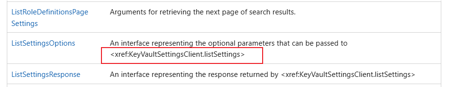
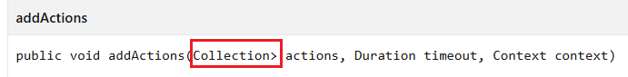
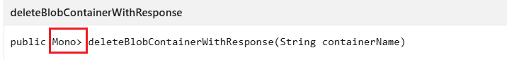
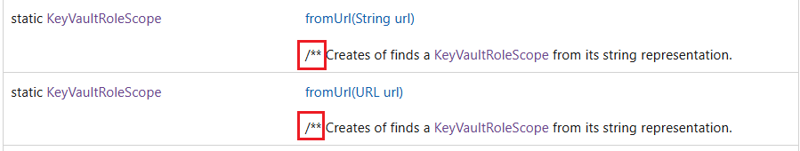
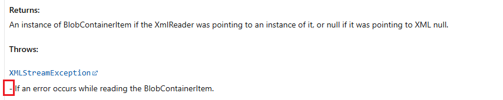
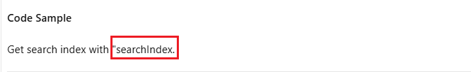
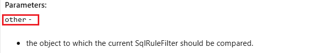
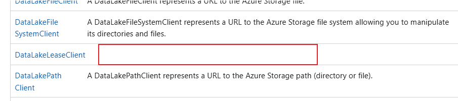
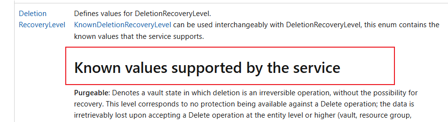
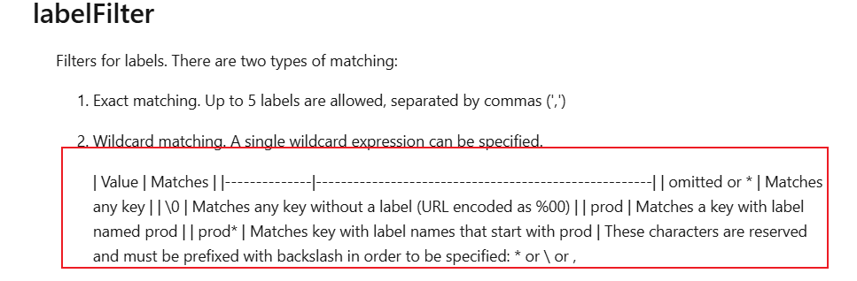

# Tool Rules Introduction For Javascript

## Overview

This document introduces 7 rules designed for Javascript Data SDK on [Microsoft Learn website](https://learn.microsoft.com/en-us/javascript/api/overview/azure/?view=azure-node-latest) to complete automated content validation.

## Validation Rules

- [ExtraLabelValidation](#1-extralabelvalidation)
- [UnnecessarySymbolsValidation](#2-unnecessarysymbolsvalidation)
- [MissingContentValidation](#3-missingcontentvalidation)
- [GarbledTextValidation](#4-garbledtextvalidation)
- [DuplicateServiceValidation](#5-duplicateservicevalidation)
- [InconsistentTextFormatValidation](#6-inconsistenttextformatvalidation)
- [ErrorDisplayValidation](#7-errordisplayvalidation)

  > Note: Compared to Python rules, `ErrorDisplayValidation` and `InconsistentTextFormatValidation` exist in Javascript rules, while `TypeAnnotationValidation` does not exist in Javascript rules.

### 1. ExtraLabelValidation

- **Goal:**
  This rule detects whether there are front-end tags in the page that are not parsed correctly.

- **Extra Labels:**

  - `<br` , `<span` , `<div` , `<table` , ``.
    > Note: The Extra labels currently detected is `/p>`.

- **Example:**

  - Extra Label: `<xref:`
  - Text Content:
    `<xref:KeyVaultSettingsClient.listSettings>`
  - Link:
    https://learn.microsoft.com/en-us/javascript/api/%40azure/keyvault-admin/?view=azure-node-latest
  - Image:  
    &nbsp;

- **Code Snippet:**

  ```csharp

        // Define a list (labelList) containing various HTML tags and entities.
        var labelList = new List<string> {
            "/p>",
            "<br",
            "<span",
            "<div",
            "<table",
            " Note: In [Javascript doc](https://learn.microsoft.com/en-us/javascript/api/overview/azure/?view=azure-node-latest), currently there is no such issue. The example from [Java doc](https://learn.microsoft.com/en-us/java/api/overview/azure/?view=azure-java-stable) .

- **Unnecessary Symbols:**

  - `<` , `>` , `~` , `[` , `]` , `///`.
    > Note: Tes unnecessary symbol currently detected is `>` , `/**` , `-`

- **Example1:**

  - Unnecessary Symbols: `>`
  - Text Content:

    `public void addActions(Collection> actions)`

    `public Mono> createBlobContainerIfNotExistsWithResponse(String containerName, BlobContainerCreateOptions options)`

  - Link:  
    https://learn.microsoft.com/en-us/java/api/com.azure.search.documents.searchindexingbufferedsender?view=azure-java-stable

    https://learn.microsoft.com/en-us/java/api/com.azure.storage.blob.blobserviceasyncclient?view=azure-java-stable

  - Image:  
    &nbsp;  
    &nbsp;

- **Example2:**

  - Unnecessary Symbols: `/**` , `-`

  - Text Content:

    `/** Creates of finds a KeyVaultRoleScope from its string representation.`

    `- If the deserialized XML object was missing any required properties.`

  - Link:  
    https://learn.microsoft.com/en-us/java/api/com.azure.security.keyvault.administration.models.keyvaultrolescope?view=azure-java-stable#method-summary

    https://learn.microsoft.com/en-us/java/api/com.azure.storage.blob.models.blobcontaineritem?view=azure-java-stable#method-details

  - Image:

    &nbsp;  
    &nbsp;

- **Example3:**

  - Unnecessary Symbols: `"` , `-`

  - Text Content:

    `Get search index with "searchIndex.`

    `other -`

  - Link:  
    https://learn.microsoft.com/en-us/java/api/com.azure.search.documents.indexes.searchindexasyncclient?view=azure-java-stable#method-details

    https://learn.microsoft.com/en-us/java/api/com.azure.messaging.servicebus.administration.models.sqlrulefilter?view=azure-java-stable#method-details

  - Image:

    &nbsp;
    &nbsp;

- **Code Snippet:**

  ```csharp

    private void ValidateHtmlContent(string htmlContent)
    {
        // Usage: Find the text that include [ , ], < , >, &, ~, and /// symbols.
        string includePattern = @"[\[\]<>&~]|/{3}";

        // Usage: When the text contains symbols  < or >, exclude cases where they are used in a comparative context (e.g., a > b).
        string excludePattern1 = @"(?<=\w\s)[<>](?=\s\w)";

        // New pattern to match the specified conditions.(e.g., /** hello , **note:** , "word.)
        string newPatternForJava = @"\s\""[a-zA-Z]+\.|^\s*/?\*\*.*$";

        string[] lines = htmlContent.Split(["\r\n", "\n"], StringSplitOptions.RemoveEmptyEntries);

        for (int index = 0; index < lines.Length; index++)
        {
            string line = lines[index];

            var matchCollections = Regex.Matches(line, includePattern);

            foreach (Match match in matchCollections)
            {
                if (match.Value.Equals("<") || match.Value.Equals(">"))
                {
                    if (Regex.IsMatch(line, excludePattern1))
                    {
                        continue;
                    }
                    // Usage: When the text contains <xref, this case will be categorized as an error of ExtraLabelValidation.
                    if (line.Contains("<xref"))
                    {
                        continue;
                    }
                    // Usage: When the text contains symbols => , -< , ->, exclude cases where they are used in a comparative context (e.g., a > b).
                    // Example: HTMLText - A list of stemming rules in the following format: "word => stem", for example: "ran => run".
                    // Link: https://learn.microsoft.com/en-us/python/api/azure-search-documents/azure.search.documents.indexes.models.stemmeroverridetokenfilter?view=azure-python#keyword-only-parameters
                    int i = match.Index - 1;
                    if (i >= 0 && (line[i] == '=' || line[i] == '-'))
                    {
                        continue;
                    }
                }

                if (match.Value.Equals("[") || match.Value.Equals("]"))
                {
                    if (line.Contains("<xref"))
                    {
                        continue;
                    }
                    if (IsBracketCorrect(line, match.Index))
                    {
                        continue;
                    }
                }

                string unnecessarySymbol = $"\"{match.Value}\""; ;
                valueSet.Add(unnecessarySymbol);
                errorList.Add($"Unnecessary symbol: {unnecessarySymbol} in text: {line}");
            }

            // Check the new patternForJava
            Match matchData = Regex.Match(line, newPatternForJava);
            if (matchData.Success)
            {
                string matchedContent = matchData.Value;
                string unnecessarySymbol = $"\"{matchedContent}\"";
                valueSet.Add(unnecessarySymbol);
                errorList.Add($"Unnecessary symbol: {unnecessarySymbol} in text: {line}");
            }
        }
    }


  ```

### 3. MissingContentValidation

- **Goal:**
  This rule checks if there is the blank table.

- **Example:**

  - Link:
    https://learn.microsoft.com/en-us/javascript/api/%40azure/storage-blob/?view=azure-node-latest
  - Image:

    &nbsp;

- **Code Snippet:**

  ```csharp

  // Fetch all th and td tags in the test page.
  var cellElements = await page.Locator("td,th").AllAsync();

  // Check if the cell is empty. If it is, retrieve the href attribute of the anchor tag above it for positioning.
  foreach (var cell in cellElements)
  {
      var cellText = (await cell.InnerTextAsync()).Trim();

      // Usage: Check if it is an empty cell and get the href attribute of the nearest <a> tag with a specific class name before it. Finally, group and format these errors by position and number of occurrences.
      // Example: The Description column of the Parameter table is Empty.
      // Link: https://learn.microsoft.com/en-us/python/api/azure-ai-textanalytics/azure.ai.textanalytics.aio.asyncanalyzeactionslropoller?view=azure-python
      if (string.IsNullOrEmpty(cellText))
      {
          string anchorLink = "No anchor link found, need to manually search for empty cells on the page.";
          var nearestHTagText = await cell.EvaluateAsync<string?>(@"element => {
              function findNearestHeading(startNode) {
                  let currentNode = startNode;

                  while (currentNode && currentNode.tagName !== 'BODY' && currentNode.tagName !== 'HTML') {
                      // Check the sibling nodes and child nodes of the current node
                      let sibling = currentNode.previousElementSibling;
                      while (sibling) {
                          // Check if the sibling node itself is an <h2> or <h3>
                          if (['H2', 'H3'].includes(sibling.tagName)) {
                              return sibling.textContent || '';
                          }

                          // Recursively check the children of sibling nodes
                          let childHeading = findNearestHeadingInChildren(sibling);
                          if (childHeading) {
                              return childHeading;
                          }

                          sibling = sibling.previousElementSibling;
                      }

                      // If not found in the sibling node, continue traversing upwards
                      currentNode = currentNode.parentElement;
                  }

                  return null; // If no matching <h> tags are found
              }

              function findNearestHeadingInChildren(node) {
                  // Traverse the child nodes and recursively search for <h2> or <h3>
                  for (let child of node.children) {
                      if (['H2', 'H3'].includes(child.tagName)) {
                          return child.textContent || '';
                      }
                      let grandChildHeading = findNearestHeadingInChildren(child);
                      if (grandChildHeading) {
                          return grandChildHeading;
                      }
                  }
                  return null;
              }

              return findNearestHeading(element);
          }");

          if (nearestHTagText != null) {
              nearestHTagText = nearestHTagText.Replace("\n", "").Replace("\t", "");
              var aLocators = page.Locator("#side-doc-outline a");
              var aElements = await aLocators.ElementHandlesAsync();

              foreach (var elementHandle in aElements)
              {
                  if(await elementHandle.InnerTextAsync() == nearestHTagText)
                  {
                      var href = await elementHandle.GetAttributeAsync("href");
                      if (href != null) {
                          anchorLink = testLink + href;
                      }
                  }
              }
          }
          errorList.Add(anchorLink);
      }
  }


  ```

### 4. GarbledTextValidation

- **Goal:**
  This rule checks whether there is garbled text.

  > Note: In [Javascript doc](https://learn.microsoft.com/en-us/javascript/api/overview/azure/?view=azure-node-latest), currently there is no such issue. The example from [Python doc](https://learn.microsoft.com/en-us/python/api/overview/azure/?view=azure-python) .

- **Garbled Text:**

  - `:xxxx:`
  - `:xxxx xxxx:`
  - `:xxxx xxxx xxxx:`
  - `<components·ikn5y4·schemas·dppworkerrequest·properties·headers·additionalproperties>`
  - `<components ikn5y4·schemas dppworkerrequest properties headers additionalproperties>`

- **Example:**

  - Garbled Text: `<components·ikn5y4·schemas·dppworkerrequest·properties·headers·additionalproperties>`
  - Text Content:
    `Dictionary of <components·ikn5y4·schemas·dppworkerrequest·properties·headers·additionalproperties>`
  - Link:
    https://learn.microsoft.com/en-us/java/api/com.azure.resourcemanager.dataprotection.models.dppworkerrequest?view=azure-java-stable#method-summary
  - Image:

    &nbsp;

- **Code Snippet:**

  ```csharp

  // Get all text content of the current html.
  var htmlText = await page.Locator("html").InnerTextAsync();

  // Usage: This regular expression is used to extract the garbled characters in the format of ":ivar:request_id:/:param cert_file:/:param str proxy_addr:" from the text.
  // Example: Initializer for X509 Certificate :param cert_file: The file path to contents of the certificate (or certificate chain)used to authenticate the device.
  // Link: https://learn.microsoft.com/en-us/python/api/azure-iot-device/azure.iot.device?view=azure-python
  string pattern = @":[\w]+(?:\s+[\w]+){0,2}:|Dictionary of <[^>]*·[^>]*>|Dictionary of <[^>]*\uFFFD[^>]*>";
  MatchCollection matches = Regex.Matches(htmlText, pattern);

  // Add the results of regular matching to errorList in a loop.
  foreach (Match match in matches)
  {
      //Judge if an element is in the ignoreList.
      bool shouldIgnore = ignoreList.Any(item => string.Equals(item.IgnoreText, match.Value, StringComparison.OrdinalIgnoreCase));

      //If it is not an ignore element, it means that it is garbled text.
      if (!shouldIgnore)
      {
          errorList.Add(match.Value);
      }
  }


  ```

### 5. DuplicateServiceValidation

- **Goal:**
  This rule checks whether there is duplicate service.

  > Note: In [Javascript doc](https://learn.microsoft.com/en-us/javascript/api/overview/azure/?view=azure-node-latest), currently there is no such issue. The example from [Python doc](https://learn.microsoft.com/en-us/python/api/overview/azure/?view=azure-python) .

- **Example:**

  - Link:
    https://learn.microsoft.com/en-us/python/api/overview/azure/?view=azure-python
  - Image:

    &nbsp;

- **Code Snippet:**

  ```csharp

  //Get all service tags in the test page.
  var aElements = await page.Locator("li.has-three-text-columns-list-items.is-unstyled a[data-linktype='relative-path']").AllAsync();

  //Check if there are duplicate services.
  foreach (var element in aElements)
  {
      var text = await element.InnerTextAsync();

      //Store the names in the `HashSet`.
      //When `HashSet` returns false, duplicate service names are stored in another array.
      if (!set.Add(text))
      {
          errorList.Add(text);

          res.Result = false;
          res.ErrorLink = testLink;
          res.NumberOfOccurrences += 1;
      }

  }


  ```

### 6. InconsistentTextFormatValidation

- **Goal:**
  Check that the inconsistent text is formatted correctly

- **Example:**

  - Link:
    https://learn.microsoft.com/en-us/javascript/api/%40azure/keyvault-keys/?view=azure-node-latest
  - Image:

    &nbsp;

- **Code Snippet:**

  ```csharp

    var hTagsInTd = await page.QuerySelectorAllAsync("td h1, td h2, td h3, td h4, td h5, td h6");

    if (hTagsInTd.Count > 0)
    {
        foreach (var element in hTagsInTd)
        {
            var text = await element.InnerTextAsync();
            errorList.Add(text);
        }

        res.Result = false;
        res.ErrorLink = testLink;
        res.NumberOfOccurrences = hTagsInTd.Count;
        res.ErrorInfo = "Inconsistent Text Format: " + string.Join(",", errorList);
    }

  ```

### 7. ErrorDisplayValidation

- **Goal:**
  Check if the code format is right.

- **Example:**

  - Link: https://learn.microsoft.com/en-us/javascript/api/@azure/app-configuration/listrevisionsoptions?view=azure-node-latest

  - Image:

    &nbsp;

- **Code Snippet:**

  ```csharp

    string pattern = @"^\|[- ]+\|[- ]+\|$";

    // Use Regex.Matches to find all matches in the HTML content
    var matches = Regex.Matches(htmlContent, pattern, RegexOptions.Multiline);

    if (matches.Count > 0)
    {
        foreach (Match match in matches)
        {
            if (match.Success)
            {
                errorList.Add(match.Value);
            }
        }

        var formattedList = errorList
            .GroupBy(item => item)
            .Select((group, Index) => $"{Index + 1}. Appears {group.Count()} times ,  {group.Key}")
            .ToList();

        res.Result = false;
        res.ErrorLink = testLink;
        res.NumberOfOccurrences = errorList.Count;
        res.ErrorInfo = "There are errors displayed here: markdown table format found";
        res.LocationsOfErrors = formattedList;
    }

  ```
