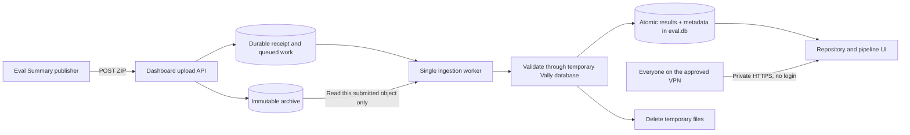

# Multi-repo Vally eval dashboard

This service hosts the `@microsoft/vally-server` dashboard and adds a landing
page for browsing evaluation history by repository and pipeline.

The tool lives in `tools/eval-pipeline-dashboard` in `Azure/azure-sdk-tools`.
See the [HTML development plan](development-plan.html) for the architecture,
technical decisions, and production action items. Open it in a browser to view
the diagrams. The [original hosting notes](plan.md) are retained as background.

The service accepts pipeline bundles over HTTP and returns `202 Accepted` only
after the archive, receipt, and pending work are durable. Local mode uses a
filesystem archive and separate SQLite work journal. Azure mode uses Blob Storage
for archives/receipts and Azure Storage Queue for work delivery, authenticated by
managed identity. Neither mode routinely enumerates ADO builds or artifact blobs.

Both modes are implemented; Azure SDK behavior is tested against a local Azurite
emulator. Real Azure endpoints, identity grants, private networking, deployment,
and onboarding actual eval pipelines are not configured yet.

## Status

Implemented and locally tested:

- Vally server and core `0.15.0`.
- Repository and pipeline landing page.
- Pipeline-scoped Vally dashboards at `/p/:repository/:pipeline`.
- Immutable `dashboard-bundle.zip` creation.
- `POST /api/ingestions` and publisher-scoped `GET /api/ingestions/:id`.
- Stable organization/project/definition/build/attempt identities.
- Immutable local archive objects with SHA-256 content hashes.
- Durable acceptance receipts and queued work in `ingestions.db`.
- Restart recovery, bounded retries, and targeted processing without Blob scans.
- Entra v2 application-token verification and an explicit loopback-only POC mode.
- Vally SQLite ingestion plus repository/pipeline metadata.
- Isolated Vally validation followed by atomic live result/metadata publication.
- Temporary ZIP and extraction cleanup after ingestion.
- Detection of duplicate paths and modified immutable bundles.
- Desktop and mobile layouts matching the Vally dashboard.
- Repository/pipeline search with shareable filter URLs and ingestion-status summary.
- Azure Blob archive/receipt adapter and Storage Queue delivery with Blob leases.
- Explicit cache replay, dry-run-first retention, and pending-work reconciliation.
- Highest-attempt shard consolidation and a retrying pipeline upload command.
- Opt-in 1ES staging/production deployment, runtime-only packaging, and private
  no-login target preflight.

Pending resource configuration or follow-up:

- Connect the shared eval shard/Summary jobs to raw-result collection and the
  supplied publishing template; no existing eval pipeline has been onboarded.
- Real workload-identity role assignments and App Service managed identity.
- VPN-only private ingress/DNS, actual staging/production deployment, scheduled
  maintenance, and Azure alerts/load testing. Viewer login is not required or planned.
- Experiment/multi-variant bundle support (plain-eval streams are supported now).

Historical ADO backfill is out of scope. History intentionally starts when
continuous publishing goes live for each pipeline.

## Access model: VPN-only, no dashboard login

Everyone with access through the approved Azure VPN can view all repositories,
pipelines, and results. There is no application sign-in, viewer account list,
or per-user role assignment. The existing dashboard pages and read APIs already
work without login; Azure networking must enforce the production access boundary.

Target: **VPN-connected client → connected VNet/private DNS → App Service private
endpoint → dashboard**, with public network access explicitly disabled. Private
network deployment is still pending; the local POC is loopback-only.

Pipeline submission remains separate: approved publishing applications use
non-interactive workload-identity tokens for the upload and receipt endpoints.
VPN viewing access does not grant permission to publish or replace result data.
No user sign-in is involved in this machine-to-machine flow.

## Architecture



The local POC substitutes a normal directory for Blob Storage:

```text
poc-blob/                 Immutable local accepted bundles
poc-data/ingestions.db    Durable receipts and queued work (new dashboard code)
poc-data/eval.db          Vally query cache + run_metadata
poc-data/staging/         Temporary upload/validation files; cleaned after work
```

The production ownership boundary is the same:

- Azure Blob Storage is the durable source of truth.
- The query cache is derived; it is not the only record of accepted work.
- Azure mode stores JSON receipts under `_receipts/v1/<id>.json` and non-expiring
  receipt-ID messages in a separate Storage Queue. A SQLite database never runs in Blob.
- Browsers query the dashboard API and never download pipeline artifacts.
- SQLite does not run inside Blob Storage.

## Design reference: Release Plan Dashboard

Use the existing [Azure SDK Release Plan Dashboard](https://aka.ms/azsdk/releaseplan-dashboard)
as the hosting and delivery precedent, not as a replacement for Vally. The source
comparison below was checked on 14 September 2026; links pin the inspected
reference to revision `cb004413af29302fb4c45f3506e0ee8015fbc253`.

| Area | Verified reference design | Application to this dashboard |
| --- | --- | --- |
| Application | A single Node/Express service serves APIs and the browser application ([server](https://github.com/Azure/azure-sdk-tools/blob/cb004413af29302fb4c45f3506e0ee8015fbc253/tools/release-plan-dashboard/server.js)). | Retain the single Node service, using Hono and Vally rather than rewriting it in Express. |
| Delivery | A 1ES pipeline tests/lints/formats, packages a ZIP, and deploys to pre-production then production; release stages are internal/main-only and production uses an environment ([pipeline](https://github.com/Azure/azure-sdk-tools/blob/cb004413af29302fb4c45f3506e0ee8015fbc253/tools/release-plan-dashboard/ci.yml)). | The tool now has opt-in staging/production stages and a target preflight. Separate app resources/identities and target-platform validation are still required; nothing is deployed by default. |
| Backend identity | `DefaultAzureCredential` accesses ADO; Key Vault signs a GitHub App token ([ADO access](https://github.com/Azure/azure-sdk-tools/blob/cb004413af29302fb4c45f3506e0ee8015fbc253/tools/release-plan-dashboard/lib/devops-api.js#L98), [signing](https://github.com/Azure/azure-sdk-tools/blob/cb004413af29302fb4c45f3506e0ee8015fbc253/tools/release-plan-dashboard/lib/auth.js#L23)). | Reuse managed-identity access for Blob and queued work. GitHub App signing and ADO-query permissions are unnecessary for receiving pipeline uploads. |
| Navigation | Grouped cards, search/filtering, shareable links, and a last-refreshed indicator ([features](https://github.com/Azure/azure-sdk-tools/blob/cb004413af29302fb4c45f3506e0ee8015fbc253/tools/release-plan-dashboard/README.md#L7)). | Keep repository/pipeline cards, tools first, and existing Vally charts. Search/freshness improvements can follow without adopting release-plan-specific views or a second chart UI. |
| Viewer authentication | Easy Auth supplies the user principal; `requireAuth()` returns 401 when it is absent ([middleware](https://github.com/Azure/azure-sdk-tools/blob/cb004413af29302fb4c45f3506e0ee8015fbc253/tools/release-plan-dashboard/server.js#L69-L80)). | Intentionally different: no viewer login or per-user roles. VPN/private ingress is the viewer boundary; machine authentication remains on ingestion endpoints. |
| Data lifetime | ADO remains the source of truth; release plans use a one-hour in-memory cache and PR details a 15-minute cache ([cache](https://github.com/Azure/azure-sdk-tools/blob/cb004413af29302fb4c45f3506e0ee8015fbc253/tools/release-plan-dashboard/lib/cache.js#L1)). | Do not copy hourly polling or use memory as the submission queue. Retain push ingestion, durable receipts/archive, and Vally's query cache. |

**Network evidence boundary:** the reference pipeline deploys to existing App
Services but does not declare their public access, private endpoints, VPN routes,
or DNS. This source inspection establishes neither public nor VPN-only access
for the running release dashboard. Confirm its actual Azure configuration with
the owners before reusing any network setup. Existing SSO may avoid a visible
login prompt, but that is not the same as unauthenticated viewing.

## Requirements

- Node.js `>=22.12 <23`.
- npm access to the configured Azure package feed containing Vally `0.15.0`.
- For the supplied sample seed, an `azure-sdk-tools` checkout containing the
  sample Vally result files listed in [poc-pipelines.json](poc-pipelines.json).
  These ignored local results are not included in a fresh clone. The integration
  test creates its own fixtures and does not require them.

The default expected layout is:

```text
azure-sdk-tools/
  artifacts/vally-local/...
  artifacts/vally-results/...
  tools/eval-pipeline-dashboard/
    package.json
    development-plan.html
    lib/
    scripts/
    test/
```

Both `poc:seed` and `poc:publish` default to this repository's root for their
sample input. When working in a separate worktree, set `POC_VALLY_SOURCE_ROOT`
to the checkout that holds those local results, in each terminal running either
command. Neither command reads results from Azure DevOps.

## Run the local POC

From the `azure-sdk-tools` root, enter the tool folder and install dependencies:

```powershell
cd tools/eval-pipeline-dashboard
npm ci --ignore-scripts --include=optional
npm run postinstall
```

`--ignore-scripts` avoids an unnecessary local native rebuild on Windows. The
installed `better-sqlite3` package includes the required platform binary. The
explicit postinstall command applies the dashboard's Vally query optimization.

Start the dashboard in explicit loopback POC mode:

```powershell
npm run poc
```

`poc` and `poc:start` both start the server without resetting history. In another
terminal, submit the configured demo bundles to the running receiver:

```powershell
# If the sample results live in another checkout:
# $env:POC_VALLY_SOURCE_ROOT = 'C:\path\to\azure-sdk-tools'
npm run poc:seed
```

Open <http://127.0.0.1:3201>.

`poc:seed` uses the current catalog (not a fixed pipeline count), creates fresh
demo build IDs, and POSTs bundles through the API. It does not clear the archive,
receipt journal, or query cache. The copied Vally results and example pipeline
metadata are test data, not proof that corresponding production pipelines exist.

### Configure the POC pipeline catalog

The sample repositories and pipelines live in `poc-pipelines.json`, not in the
dashboard source. Add a pipeline entry there to include it in the next
`npm run poc:seed`, for example:

```json
{
  "repository": "azure-sdk-for-go",
  "pipeline": "language-eval",
  "pipelineDefinitionId": "9321",
  "resultSources": ["authoring", "markdown"]
}
```

Each `resultSources` value references a key in the file's top-level `sources`
object. A pipeline may override the top-level `adoProject` value. To use a
catalog outside this checkout, set `POC_PIPELINE_CONFIG` to its JSON path before
running `npm run poc:seed`.

This catalog is only demo input. The running dashboard has no repository or
pipeline allowlist: in production, the first valid bundle whose manifest
contains a new `repo`, `pipeline`, and `pipelineDefinitionId` automatically adds
that pipeline to the landing page. Onboarding a language pipeline therefore
changes its shared publishing-template configuration, not dashboard code.

### Publish a new run while the service is running

In another terminal:

```powershell
npm run poc:publish -- azure-sdk-tools skill-eval 8178
```

Arguments are:

```text
npm run poc:publish -- <repository> <pipeline-name> <pipeline-definition-id>
```

The command simulates a Summary publisher and returns the dashboard's receipt.
Processing starts after acceptance without a discovery interval or server restart.
Refresh the browser after the receipt succeeds to see the updated pipeline card.

To submit an existing bundle without repackaging it:

```powershell
npm run poc:submit -- C:\path\to\dashboard-bundle.zip
```

Set `POC_DASHBOARD_URL` for a different endpoint; the client requires HTTPS except
for loopback. `DASHBOARD_ACCESS_TOKEN` supplies an optional short-lived publisher
token. In production this must come from the pipeline's identity flow, not a
checked-in secret. A separate pipeline command/template is described below.

## Upload and receipt API

| Request or condition | Result |
| --- | --- |
| `POST /api/ingestions`, `Content-Type: application/zip` | `202` after archive and receipt persistence. |
| Identical identity/content/owner retry | Same receipt; `202` pending or `200` terminal. |
| Same identity, different ZIP bytes or publisher | `409 submission_conflict`. |
| Retry of a tombstoned expired identity | `410 submission_expired`; never reintroduces expired data. |
| `GET /api/ingestions/:id` | Publisher-owned receipt: queued, processing, succeeded, failed, or expired. |
| Malformed archive or manifest | `422`; no accepted receipt. |
| Upload over 32 MiB / wrong media type | `413` / `415`. |
| Missing/invalid application credentials | `401` / `403`. |
| Concurrent-upload limit or persistence failure | `429` / `503`, with `Retry-After`. |

The POST response contains `id`, `status`, `statusUrl`, `acceptedAt`, `updatedAt`,
`attempts`, and `duplicate`; its `Location` header points to the status resource.
`202` means durable receipt, **not** successful evals or completed chart ingestion.
An optional `X-Content-SHA256` header is checked against the received bytes.
Semantically invalid JSONL can be accepted and then become a failed receipt;
it never creates partially visible results.

Retry the exact saved ZIP after a timeout or transient failure. Recreating a ZIP
can change its timestamp metadata and checksum. Corrected data uses a new
`summaryAttempt`, not an overwrite of an accepted identity.

## Bundle contract

Every completed pipeline build publishes one build-level artifact:

```text
dashboard-bundle.zip
  manifest.json
  results.jsonl
  eval-summary.md
  junit/
    *.xml
```

The validator requires all four components. Limits are 32 MiB compressed,
128 MiB declared expanded content, and 10,000 entries. It validates directory
metadata before decompression and rejects absolute/parent paths, Windows path
aliases, duplicate/case-colliding names, and unexpected files.

Only merged plain-eval JSONL streams are currently supported. Experiment records
are rejected during processing until the multi-variant contract is implemented.

### Manifest

```json
{
  "schemaVersion": 1,
  "adoOrganization": "azure-sdk",
  "adoProject": "internal",
  "repo": "azure-sdk-tools",
  "pipeline": "skill-eval",
  "pipelineDefinitionId": "8178",
  "buildId": "10001",
  "summaryAttempt": 1,
  "branch": "refs/heads/main",
  "sourceVersion": "0000000000000000000000000000000000010001",
  "runTimestamp": "2026-09-01T01:00:00.000Z"
}
```

The stable identity is `adoOrganization + adoProject + pipelineDefinitionId +
buildId + summaryAttempt`; display names are not deduplication keys. The server
derives the source ADO URL from validated metadata. A higher successfully ingested
attempt supersedes an older one in pipeline views while preserving its archive
and receipt. `/all` remains an unfiltered view including earlier attempts.

### Blob path

```text
v1/
  <ado-organization>/
    <ado-project>/
      <pipeline-definition-id>/
        <build-id>/
          <summary-attempt>/
            dashboard-bundle.zip
```

Example:

```text
v1/azure-sdk/internal/8178/10001/1/dashboard-bundle.zip
```

Publishing is immutable: an existing path cannot be overwritten. A rerun uses a
new Summary attempt path.

## Continuous ingestion

1. Authenticate the upload before reading its body. Stream with a size bound.
2. Validate the archive/manifest and calculate a stable submission ID and hash.
3. Save bytes immutably, then persist a queued receipt before returning 202.
4. Wake a single worker; do not list Blob or ADO artifacts.
5. Read the specific accepted object, check its hash, and extract into staging.
6. Ingest into an isolated temporary Vally database and verify every trial was accepted.
7. Commit the validated run/outcomes/graders/tools and `run_metadata` together.
8. Mark the receipt succeeded. A failure between steps 7 and 8 is idempotent on retry.
9. Always clean the temporary ZIP, extraction, and validation DB.

Transient worker errors retry after 1, 5, and 30 seconds (four total attempts).
Permanent validation errors become failed receipts without blocking later work.
Startup requeues interrupted processing and resumes pending receipts. Timers
schedule only known retries in local mode. Azure mode additionally receives Queue
messages on startup, after acceptance, and every five seconds when idle. This is
work-queue delivery, not ADO/Blob artifact discovery.

`run_metadata` records successfully ingested results. A separate `ingestions`
table in `ingestions.db` records accepted/pending/failed/succeeded submissions.
That local journal is new dashboard code, not part of Vally. In Azure mode the
receipt state is JSON in Blob and messages are in Storage Queue; no local journal
is used. Never delete receipt state as part of ordinary query-cache maintenance.

### Cloud acceptance and worker recovery

1. Save an archive object with `If-None-Match: *`; compare stored SHA-256/size on retry.
2. Conditionally create the JSON receipt, then enqueue its ID with no message expiry.
3. Return 202 only after all three operations succeed. If queue send fails, return
  503; an identical retry reuses the receipt and enqueues it again.
4. Receive one message, acquire a 60-second Blob receipt lease, and mark processing.
  Renew the lease and 120-second queue visibility while processing; verify ownership
  again before committing the live results.
5. Write terminal receipt status before deleting the queue message. If acknowledgement
  is lost, redelivery observes the terminal state and does not duplicate results.

SHA-256 is stored separately from opaque Azure ETags. The archive adapter performs
targeted conditional downloads and verifies the downloaded content hash.
Receipt enumeration is available only to explicit maintenance commands.

Use **one dashboard instance/cache writer per environment**. Queue leasing does
not make separate Vally SQLite caches coherent across multiple web instances.
Staging and production must use **separate containers and queues**, or their
workers would compete for work and each would show incomplete history.

Important fields include:

```text
run_id
repository
pipeline
pipeline_definition_id
build_id
build_url
blob_name
blob_etag
blob_size
blob_last_modified
ingested_at
```

The new archive interface exposes immutable `put` and targeted `download`.
The previous folder-scanning helpers remain for legacy tests only and are not
started by `server.js`. A cloud adapter must preserve the durable-acceptance and
idempotency boundaries; Azure ETags are not cryptographic SHA-256 checksums.

## Routes

| Route | Purpose |
| --- | --- |
| `/` | Repositories and pipeline cards, generated from `run_metadata`. |
| `/p/:repository/:pipeline` | Existing Vally charts filtered to one pipeline. |
| `/all` | Existing Vally dashboard across every ingested run. |
| `/api/dashboard/pipelines/:repository/:pipeline/runs` | Pipeline-scoped run list. |
| `POST /api/ingestions` | Authenticated ZIP acceptance and durable receipt. |
| `GET /api/ingestions/:id` | Publisher-authorized receipt status. |
| `/api/readiness` | Storage-readiness check; 503 when a backend check fails, not a durability guarantee. |
| `/api/dashboard/status` | Process counters, last completion/error code, and pending queue size. |
| `/api/*` | Existing `@microsoft/vally-server` API routes. |

The service does not fork Vally's charts or analytics. It wraps the Vally Hono
application and redirects pipeline-page run-list requests to the scoped API
instead of filtering the first global results page. Host validation covers the
wrapper as well as Vally. Submitted names are escaped rather than injected as HTML.

## Configuration

| Variable | Default | Purpose |
| --- | --- | --- |
| `PORT` | `3200` | HTTP port. The POC sets `3201`. |
| `HOST` | `127.0.0.1` | Non-loopback hosting requires private ingress and publisher auth. A bind address does not enforce VPN access. |
| `VALLY_STORAGE_PROVIDER` | `local` | `local` or `azure`; invalid/missing Azure URLs fail configuration instead of silently using local storage. |
| `VALLY_AZURE_CONTAINER_URL` | required in Azure mode | Full HTTPS container URL without SAS/query credentials. Holds `v1/` archives and `_receipts/v1/` state. |
| `VALLY_AZURE_QUEUE_URL` | required in Azure mode | Full HTTPS Storage Queue URL, provisioned in advance with appropriate network isolation. |
| `VALLY_DB` | `./eval.db` | SQLite cache path. |
| `VALLY_LOCAL_BLOB_ROOT` | `./.ingestion-archive` | Filesystem-backed accepted-object archive; POC uses `poc-blob`. |
| `VALLY_INGESTION_DB` | `./ingestions.db` | Separate durable receipt/work journal; POC uses `poc-data/ingestions.db`. |
| `VALLY_STAGING_ROOT` | `./.blob-staging` | Temporary download/extraction directory. |
| `VALLY_LOCAL_POC` | unset | `true` explicitly permits anonymous server-to-server uploads only on loopback. Set by the POC launcher. |
| `VALLY_INGEST_TENANT_ID` | required outside POC | Entra tenant GUID; v2 issuer and JWKS are derived from it. |
| `VALLY_INGEST_AUDIENCE` | required outside POC | Expected dashboard API token audience. |
| `VALLY_INGEST_CLIENT_IDS` | required outside POC | Comma-separated approved application IDs, each requiring `Dashboard.Ingest`. |
| `VALLY_ALLOWED_HOSTS` | loopback plus `WEBSITE_HOSTNAME` | Extra allowed request hosts, comma-separated. |
| `POC_DASHBOARD_URL` | `http://127.0.0.1:3201` | Target of local submission commands. |
| `DASHBOARD_ACCESS_TOKEN` | unset | Short-lived token for submission commands when not using loopback POC. |
| `POC_VALLY_SOURCE_ROOT` | this repository's root | Source of sample Vally results for both seed and publish commands. |
| `POC_PIPELINE_CONFIG` | `./poc-pipelines.json` | Optional external POC repository/pipeline catalog. |

See [.env.example](.env.example) for the hosted configuration shape. It is a
reference, not an automatically loaded file. Set the values in App Service
configuration; never commit connection strings, SAS URLs, tokens, or private keys.
Azure adapters use `DefaultAzureCredential`; assign narrowly scoped Storage Blob
Data Contributor (archive plus receipt writes) and Storage Queue Data Contributor
to the service identity. Containers/queues are not auto-created by the application.

`VALLY_BLOB_POLL_MS` and `VALLY_RESULTS` are no longer used by server startup.
An authorized publisher application is trusted to supply pipeline metadata;
the service has no hardcoded pipeline allowlist. Production role assignments
must therefore match the desired publishing trust boundaries.

## Tests

Run:

```powershell
npm test
```

Tests create isolated fixtures, archives, and databases without cloud access or
LLM calls. The current push-path tests cover:

- HTTP acceptance/status, duplicates/conflicts, archive and body validation.
- Durable receipt recovery and retry after the result transaction commits.
- Authentication claims/signatures, publisher ownership, local/Host restrictions.
- Dashboard pages/read APIs work without viewer credentials even when publisher
  token authentication is enabled. VPN isolation itself requires Azure deployment tests.
- Failure isolation and automatic pipeline discovery/rerun supersession.
- A real loopback HTTP client upload and exact-byte retry.
- Temporary staging cleanup and expanded ZIP size limits.
- Real Blob/Queue SDK requests against an isolated Azurite child process, including
  queue-send repair, restarted workers, opaque ETags, lost acknowledgements, replay,
  and retention. Tests disable emulator telemetry and use generated local-only keys.
- Exact-byte upload retries, highest-attempt shard selection, deployment packaging,
  YAML syntax, and private/no-login target validation.

The retained legacy helper tests cover catalog loading, folder publication,
scan-based deduplication, and immutable-object conflicts. Those scanning helpers
are not used by the current server.

[ci.yml](ci.yml) uses the tools repository's 1ES template. It tests and builds a
runtime-only Linux deployment ZIP. Staging/production stages are excluded unless
`deployDashboard=true` and all app/resource-group/service-connection parameters
are supplied in the internal project; release stages run only from main, not PRs.
The production stage uses an environment for centrally configured release checks.
YAML syntax and conditions are locally tested; Azure DevOps template expansion,
environment approvals, and actual deployment remain unverified until configured.

## Source map

| File | Responsibility |
| --- | --- |
| [development-plan.html](development-plan.html) | Reviewable architecture, technical decisions, and production development plan. |
| [ci.yml](ci.yml) | Tests/package plus explicitly opt-in staging/production deployment. |
| `server.js` | Opens cache/journal, mounts push APIs and Vally pages, starts the targeted worker. |
| `pipelines.js` | Repository index and pipeline-scoped Vally pages. |
| `lib/dashboard-bundle.js` | ZIP contract, creation, validation, and safe extraction. |
| `lib/local-blob-store.js` | Legacy folder adapter, retained for old helper tests only. |
| `lib/local-pipeline-publisher.js` | Legacy direct-to-folder publisher; not the POC HTTP client. |
| `lib/artifact-sync.js` | Legacy scan-based ingestion helper; not started by the service. |
| `lib/run-metadata.js` | Manifest normalization and `run_metadata` SQLite schema/queries. |
| `lib/ingestion-routes.js` | Bounded upload and receipt-status endpoints. |
| `lib/ingestion-service.js` | Serialized acceptance and event-driven/retry worker. |
| `lib/ingestion-journal.js` | Durable receipt/work state, separate from Vally cache. |
| `lib/ingest-submission.js` | Temporary Vally validation and atomic live result publication. |
| `lib/submission-store.js` | Immutable accepted-byte storage and targeted downloads. |
| `lib/submission-manifest.js` | Validated stable identity and canonical build URL. |
| `lib/publisher-auth.js` | Entra v2 app-token verification and loopback POC guard. |
| `lib/dashboard-client.js` | HTTP submission helper used by local demo commands. |
| [lib/azure-blob-store.js](lib/azure-blob-store.js) | Immutable Azure archives and hash-verified targeted reads. |
| [lib/azure-ingestion-journal.js](lib/azure-ingestion-journal.js) | Blob receipts, leases, and Storage Queue delivery/recovery. |
| [lib/storage-config.js](lib/storage-config.js) | Explicit local/Azure selection and managed-identity SDK clients. |
| [lib/maintenance.js](lib/maintenance.js) | Replay, retention tombstones, and pending-work reconciliation. |
| [lib/pipeline-bundle.js](lib/pipeline-bundle.js) | Strict shard-index validation and highest-attempt consolidation. |
| [lib/operational-routes.js](lib/operational-routes.js) | Readiness and queue/process status APIs. |
| [pipelines/deploy-stage.yml](pipelines/deploy-stage.yml) | Opt-in private target validation and ZIP deployment stage. |
| [pipelines/publish-results.yml](pipelines/publish-results.yml) | Opt-in workload-identity submission step. |
| `poc-pipelines.json` | Configurable repositories, pipelines, and fixture sources for POC seeding. |
| `scripts/seed-poc.mjs` | Seeds future-run history through the publisher. |
| `scripts/publish-poc-run.mjs` | Publishes one new fake pipeline run. |
| `scripts/submit-bundle.mjs` | Submits an existing ZIP without repackaging it. |
| `scripts/start-poc.mjs` | Starts the service with loopback POC auth and persistent local paths. |
| `test/artifact-sync.test.mjs` | Legacy helper integration tests, not current runtime behavior. |
| `test/ingestion.test.mjs` | Push API, security, durability, recovery and pipeline tests. |

## Pipeline publishing and hosted rollout

The adapters and operational helpers are implemented. Resource-specific wiring,
private-network validation, and real pipeline onboarding remain.

### Shared pipeline producer

The tool provides bundle preparation and upload commands; wire them into the
shared Summary flow once the publishing endpoint/identity/pool is configured:

1. Make every shard publish `results.jsonl` and JUnit under `always()`.
2. Download every shard result in Summary.
3. Select the highest job attempt for each shard.
4. Merge exactly one canonical build-level `results.jsonl`.
5. Create `manifest.json` from standard Azure DevOps variables.
6. Validate and create `dashboard-bundle.zip`.
7. Publish the ZIP as an ADO artifact for build debugging.
8. POST the saved ZIP to the dashboard API and record its receipt/status URL.

Use workload identity to obtain a v2 application token for the dashboard audience,
with the `Dashboard.Ingest` app role. Pipelines do not need direct storage access.
Keep publication failure separate from eval failures; retry transient upload
failures using the saved bytes. The opt-in [publishing template](pipelines/publish-results.yml)
is available but is not referenced by existing eval pipelines yet.

The bundle preparation command accepts an explicit shard index so it cannot
silently guess completeness from whichever artifacts happen to exist:

```json
{
  "schemaVersion": 1,
  "expectedShards": ["authoring", "release"],
  "attempts": [
    { "shard": "authoring", "attempt": 1, "directory": "authoring-1" },
    { "shard": "authoring", "attempt": 2, "directory": "authoring-2" },
    { "shard": "release", "attempt": 1, "directory": "release-1" }
  ]
}
```

Each directory is relative to the index and contains a merged plain-eval
`results.jsonl` plus a `junit` directory. Preparation chooses each shard's highest
attempt, rejects missing/duplicate shards and experiments, derives the manifest
from standard ADO build variables, and writes one bounded bundle. The shared
shard jobs still need to retain these raw results and emit the index.

```powershell
npm.cmd run bundle:prepare -- --input C:\artifacts\shard-index.json --output C:\artifacts\dashboard-bundle.zip
npm.cmd run bundle:publish -- --bundle C:\artifacts\dashboard-bundle.zip --url https://dashboard.example --audience $env:VALLY_INGEST_AUDIENCE --receipt C:\artifacts\receipt.json --wait
```

The Windows PowerShell examples use `npm.cmd` so named arguments are forwarded
unchanged by the npm shim. Use `npm` in Bash or invoke the corresponding Node
script directly on any platform.

Run publication in an `AzureCLI@2` workload-identity session. `AzureCliCredential`
obtains the token without printing it. The client retries the **same ZIP** on
transport errors and transient HTTP failures (up to four attempts), honors
`Retry-After`, and saves a durable receipt locally before optionally waiting for
ingestion. Keep the ZIP and receipt as ADO artifacts even if waiting fails.

The publishing job also needs private DNS and a route to the dashboard's private
endpoint. Use an approved network-connected agent pool, or a dedicated publishing
job on that pool. Standard Microsoft-hosted agents cannot reach the private
network through VPN; do not enable a public dashboard endpoint to accommodate them.

### Azure Blob adapter

Set `VALLY_STORAGE_PROVIDER=azure`, `VALLY_AZURE_CONTAINER_URL`, and
`VALLY_AZURE_QUEUE_URL` once the resources are supplied. The adapter uses
`@azure/storage-blob`, `@azure/storage-queue`, and `DefaultAzureCredential`.
The same storage account can host the container and queue, but both endpoints and
identity permissions are explicit. No Service Bus namespace or external SQL
database is required by this implementation.

### Hosting behind the Azure VPN

The opt-in deployment uses the release dashboard's staged ZIP pattern. First
verify the reference service's actual network settings
with its owners; do not assume those settings are supplied by its application
deployment pipeline. Provision this dashboard's own resources and identities,
and preserve the intentionally different no-viewer-login policy.

Network/platform deployment action items:

1. Select the approved VPN-connected VNet/subnet and create an App Service private
  endpoint. VNet integration alone controls outbound traffic and does not make
  the website private.
2. Configure private DNS and VPN client DNS forwarding/routing. Keep the normal
  HTTPS application hostname resolving to the private endpoint from the approved
  network; add the private SCM DNS record for deployment access.
3. Set App Service `publicNetworkAccess=Disabled`. Apply the same isolation to
  any deployment slots and keep SCM off the public path. Do not configure App
  Service Authentication/Easy Auth or application login for viewers.
4. Verify that publishing and deployment agents have private DNS and network
  connectivity. Keep publisher token verification enabled; `VALLY_LOCAL_POC`
  is not a production VPN setting.
5. Test that VPN users can open pages and read result APIs without a login
  redirect, off-network clients cannot access them through any public hostname,
  and authorized agents can submit successfully.

The deployment preflight reads the target's Azure configuration and refuses to
deploy unless public access is explicitly disabled, HTTPS-only is enabled,
viewer Easy Auth is explicitly disabled, an approved private endpoint and managed
identity exist, and Azure storage/publisher settings are present. It does not
provision or repair those settings and cannot prove VPN DNS/routes or RBAC work;
those require real smoke tests. Default deployment is off while URLs are pending.

References: [App Service private endpoints](https://learn.microsoft.com/en-us/azure/app-service/overview-private-endpoint)
and [Microsoft-hosted agent networking](https://learn.microsoft.com/en-us/azure/devops/pipelines/agents/hosted?view=azure-devops#networking).

Continue using one Linux Node App Service instance for the initial release:

- Set `VALLY_DB` to a validated instance-local cache location; do not assume the
  shared `/home` mount supports SQLite WAL just because the service is single-instance.
- Temporary staging on supported local storage, cleaned after every ingestion attempt.
- Azure Blob Storage holds all durable bundles.
- VPN/private-endpoint reachability protects the site; all approved VPN users can
  view it without an application account or login.
- Configure application identities only for pipeline publishing and service storage access.
- Validate SQLite locking/WAL support on the actual filesystem before deployment.
- Monitor queue backlog, oldest queued receipt, failed ingestions, HTTP/storage
  failures, latency, disk use, and query/journal database sizes.

The existing `deploy.ps1` and `add-result.ps1` represent the original manual
Kudu-upload deployment. They remain useful for the old flow but are not yet the
production deployment for the Blob-backed architecture and do not establish the
required VPN-only network boundary. Do not use them unchanged to publish this service.

## Storage and recovery

Vally stores full trajectory JSON in SQLite, so database size grows roughly with
the uncompressed result size. Raw ZIPs should remain only in Blob Storage; the
App Service should not persist a second expanded copy.

Ordinary process restart resumes pending/interrupted work automatically. Completed
receipts are not reprocessed on every start. If the Vally cache is lost, preserve
the archive and receipt store and explicitly replay into a replacement cache.
Use the same storage environment settings as the server; POC paths must be set
explicitly when running maintenance outside the POC launcher.

```powershell
npm.cmd run maintenance -- replay --output C:\recovery\eval.db
npm.cmd run maintenance -- prune --retention-days 731
npm.cmd run maintenance -- prune --retention-days 731 --apply
npm.cmd run maintenance -- reconcile
npm.cmd run maintenance -- reconcile --apply
```

- **Replay:** restores succeeded, unexpired receipts (within the selected retention
  window) using the same hash-verified ingestion path. Repeating it does not
  duplicate outcomes. Stop the service before changing `VALLY_DB` to the rebuilt file.
- **Prune:** dry-run by default. `--apply` tombstones terminal receipts first,
  deletes related cache rows, then removes matching archive bytes. Pending work
  is never expired. Tombstones stay indefinitely to prevent delayed re-upload.
  Stop the service first; the cache lock prevents a second process from modifying
  the active cache. Interrupted pruning can be safely re-run.
- **Reconcile:** explicit repair for receipt-saved/queue-send-failed gaps. Lists
  pending receipt records and re-enqueues them only with `--apply`; normal startup
  does not enumerate the receipt container.

Loss/corruption of the receipt store itself still requires restoring its backup;
the tool does not reconstruct publisher ownership from arbitrary orphan ZIPs.
Azure lifecycle policies must not independently delete pending archives or the
`_receipts/` prefix. Coordinate archive deletion through terminal-receipt pruning;
cool-tier rules may apply to `v1/` bundles. Scheduling and tombstone-compaction
policy remain operator decisions, not automatic background deletion.

Use an approved retention window (731 days is the proposed CLI default). There is no
historical ADO backfill in this design; each pipeline's dashboard history begins
with its first continuously published bundle.

## Troubleshooting

### Legacy Vally warnings

The supplied seed files are older Vally output. Vally `0.15.0` ingests them but
prints `VALLY_LEGACY_JSONL` deprecation warnings. Production pipelines should
emit current `trial-result` records.

### Port 3201 is already in use

Stop only your previous POC process, or set `PORT` to a free port and start an
isolated instance with separate cache/journal/archive paths. Set
`POC_DASHBOARD_URL` to that endpoint in the publishing terminal. Do not run two
writers against the same local data paths.

### Reset the POC

Start and seed no longer erase data. Use disposable alternate paths or make an
explicit backup before manually clearing local state with the service stopped.
The demo catalog and its source files are not modified by submission.

### Database schema changed

Vally does not migrate incompatible SQLite schemas. For disposable POC data,
do not point the new runtime at an incompatible old DB. Preserve the archive and
receipts; use a fresh isolated cache for testing. Production replay/migration is
performed with the explicit replay command; validate rebuilt counts before
changing the live cache path.
