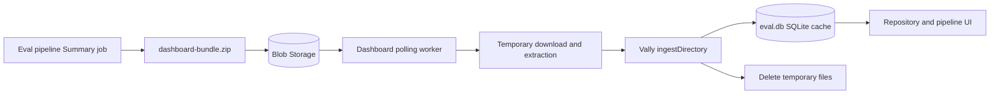

# Multi-repo Vally eval dashboard

This service hosts the `@microsoft/vally-server` dashboard and adds a landing
page for browsing evaluation history by repository and pipeline.

The tool lives in `tools/eval-pipeline-dashboard` in `Azure/azure-sdk-tools`.
See the [HTML development plan](development-plan.html) for the architecture,
technical decisions, and production action items. Open it in a browser to view
the diagrams. The [original hosting notes](plan.md) are retained as background.

The current branch contains a local proof of concept (POC) for the complete
continuous publishing flow. A filesystem directory acts as Azure Blob Storage,
so the producer, immutable bundle format, polling, deduplication, temporary
extraction, SQLite ingestion, cleanup, and UI can all be tested without Azure
credentials.

## Status

Implemented locally:

- Vally server and core `0.15.0`.
- Repository and pipeline landing page.
- Pipeline-scoped Vally dashboards at `/p/:repository/:pipeline`.
- Immutable `dashboard-bundle.zip` creation.
- Production-shaped fake Blob paths.
- SHA-256 content hashes acting as local Blob ETags.
- Polling and download of only unseen bundles.
- Vally SQLite ingestion plus repository/pipeline metadata.
- Temporary ZIP and extraction cleanup after ingestion.
- Detection of duplicate paths and modified immutable bundles.
- Desktop and mobile layouts matching the Vally dashboard.

Not implemented yet:

- Uploading from real Azure DevOps pipelines.
- An Azure Blob Storage adapter.
- Workload identity and App Service managed identity.
- Production App Service configuration for Blob ingestion.

Historical ADO backfill is out of scope. History intentionally starts when
continuous publishing goes live for each pipeline.

## Architecture



The local POC substitutes a normal directory for Blob Storage:

```text
poc-blob/                 Fake durable Blob container
poc-data/eval.db          Disposable Vally query cache
poc-data/staging/         Temporary downloads; empty after ingestion
```

The production ownership boundary is the same:

- Azure Blob Storage is the durable source of truth.
- `/home/data/eval.db` on App Service is a derived query cache.
- Browsers query the dashboard API and never download pipeline artifacts.
- SQLite does not run inside Blob Storage.

## Requirements

- Node.js `>=22.12 <23`.
- npm access to the configured Azure package feed containing Vally `0.15.0`.
- For the supplied sample seed, an `azure-sdk-tools` checkout containing the
  sample Vally result files listed in [scripts/seed-poc.mjs](scripts/seed-poc.mjs).
  These ignored local results are not included in a fresh clone. The integration
  test creates its own fixtures and does not require them.

The default expected layout is:

```text
azure-sdk-tools/
  artifacts/vally-local/...
  artifacts/vally-results/...
  tools/eval-pipeline-dashboard/
    package.json
    development-plan.html
    lib/
    scripts/
    test/
```

Both `poc:seed` and `poc:publish` default to this repository's root for their
sample input. When working in a separate worktree, set `POC_VALLY_SOURCE_ROOT`
to the checkout that holds those local results, in each terminal running either
command. Neither command reads results from Azure DevOps.

## Run the local POC

From the `azure-sdk-tools` root, enter the tool folder and install dependencies:

```powershell
cd tools/eval-pipeline-dashboard
npm ci --ignore-scripts
npm run postinstall
```

`--ignore-scripts` avoids an unnecessary local native rebuild on Windows. The
installed `better-sqlite3` package includes the required platform binary. The
explicit postinstall command applies the dashboard's Vally query optimization.

Seed the fake Blob container and start the dashboard:

```powershell
# If the sample results live in another checkout:
# $env:POC_VALLY_SOURCE_ROOT = 'C:\path\to\azure-sdk-tools'
npm run poc
```

Stop the POC server before seeding: `poc` and `poc:seed` reset only this tool's
generated `poc-blob` and `poc-data` folders. To preserve the existing local history,
use `npm run poc:start` instead.

Or run the two operations separately:

```powershell
npm run poc:seed
npm run poc:start
```

Open <http://127.0.0.1:3201>.

`poc:seed` clears the disposable POC data, simulates 18 completed Summary jobs,
and publishes 18 immutable ZIP objects into `poc-blob`. The seed uses copied
Vally results to exercise multi-repository routing; repository and pipeline
labels are test metadata rather than proof that those production pipelines
already exist.

### Configure the POC pipeline catalog

The sample repositories and pipelines live in `poc-pipelines.json`, not in the
dashboard source. Add a pipeline entry there to include it in the next
`npm run poc:seed`, for example:

```json
{
  "repository": "azure-sdk-for-go",
  "pipeline": "language-eval",
  "pipelineDefinitionId": "9321",
  "resultSources": ["authoring", "markdown"]
}
```

Each `resultSources` value references a key in the file's top-level `sources`
object. A pipeline may override the top-level `adoProject` value. To use a
catalog outside this checkout, set `POC_PIPELINE_CONFIG` to its JSON path before
running `npm run poc:seed`.

This catalog is only demo input. The running dashboard has no repository or
pipeline allowlist: in production, the first valid bundle whose manifest
contains a new `repo`, `pipeline`, and `pipelineDefinitionId` automatically adds
that pipeline to the landing page. Onboarding a language pipeline therefore
changes its shared publishing-template configuration, not dashboard code.

### Publish a new run while the service is running

In another terminal:

```powershell
npm run poc:publish -- azure-sdk-tools skill-eval 8178
```

Arguments are:

```text
npm run poc:publish -- <repository> <pipeline-name> <pipeline-definition-id>
```

The command simulates a completed pipeline Summary job. It creates a new ZIP at
an immutable fake Blob path. The running service polls every two seconds, ingests
the new run without restarting, and removes its temporary files. Refresh the
browser to see the updated pipeline card and charts.

## Bundle contract

Every completed pipeline build publishes one build-level artifact:

```text
dashboard-bundle.zip
  manifest.json
  results.jsonl
  eval-summary.md
  junit/
    *.xml
```

The bundle validator requires all four components. Extraction rejects absolute
paths, parent traversal, duplicate entries, too many files, and oversized
expanded content.

### Manifest

```json
{
  "schemaVersion": 1,
  "adoProject": "internal",
  "repo": "azure-sdk-tools",
  "pipeline": "skill-eval",
  "pipelineDefinitionId": "8178",
  "buildId": "10001",
  "summaryAttempt": 1,
  "runId": "azure-sdk-tools-skill-eval-10001",
  "branch": "refs/heads/main",
  "sourceVersion": "0000000000000000000000000000000000010001",
  "buildUrl": "https://dev.azure.com/azure-sdk/internal/_build/results?buildId=10001",
  "runTimestamp": "2026-09-01T01:00:00.000Z"
}
```

`pipelineDefinitionId` is the stable pipeline identity. The friendly pipeline
name may change without changing the Blob hierarchy.

### Blob path

```text
<ado-project>/
  <repository>/
    <pipeline-definition-id>/
      <build-id>/
        <summary-attempt>/
          dashboard-bundle.zip
```

Example:

```text
internal/azure-sdk-tools/8178/10001/1/dashboard-bundle.zip
```

Publishing is immutable: an existing path cannot be overwritten. A rerun uses a
new Summary attempt path.

## Continuous ingestion

The local worker implements the intended production algorithm:

1. List `dashboard-bundle.zip` objects in the fake Blob root.
2. Compute a SHA-256 hash for each object as its local ETag.
3. Look up `blob_name` and `blob_etag` in `run_metadata`.
4. Skip a known object when its ETag matches.
5. Reject a known immutable path when its ETag changed.
6. Download a new object into a unique temporary staging directory.
7. Validate its manifest and ensure the Blob path matches manifest identity.
8. Extract and validate the bundle.
9. Call Vally's `ingestDirectory()` inside its database transaction.
10. Record pipeline and Blob metadata only after successful ingestion.
11. Delete the downloaded ZIP and extracted files in `finally`.

No separate `ingested_blobs` table is used. The dashboard-owned `run_metadata`
table is both the repository/pipeline metadata store and the ingestion ledger.

Important fields include:

```text
run_id
repository
pipeline
pipeline_definition_id
build_id
build_url
blob_name
blob_etag
blob_size
blob_last_modified
ingested_at
```

The fake Blob adapter and a future Azure Blob adapter should expose the same
logical operations: list, download, and object metadata.

## Routes

| Route | Purpose |
| --- | --- |
| `/` | Repositories and pipeline cards, generated from `run_metadata`. |
| `/p/:repository/:pipeline` | Existing Vally charts filtered to one pipeline. |
| `/all` | Existing Vally dashboard across every ingested run. |
| `/api/dashboard/pipelines/:repository/:pipeline/runs` | Pipeline-scoped run list. |
| `/api/*` | Existing `@microsoft/vally-server` API routes. |

The service does not fork Vally's charts or analytics. It wraps the Vally Hono
application, injects the allowed run IDs for a pipeline page, and keeps Vally's
host-header protection enabled.

## Configuration

| Variable | Default | Purpose |
| --- | --- | --- |
| `PORT` | `3200` | HTTP port. The POC sets `3201`. |
| `HOST` | `0.0.0.0` | Bind host. The POC sets `127.0.0.1`. |
| `VALLY_DB` | `./eval.db` | SQLite cache path. |
| `VALLY_RESULTS` | `./results` | Legacy expanded-folder ingestion mode. |
| `VALLY_LOCAL_BLOB_ROOT` | unset | Enables the filesystem-backed fake Blob adapter. |
| `VALLY_STAGING_ROOT` | `./.blob-staging` | Temporary download/extraction directory. |
| `VALLY_BLOB_POLL_MS` | `30000` | Fake Blob polling interval. The POC uses 2000 ms. |
| `POC_VALLY_SOURCE_ROOT` | this repository's root | Source of sample Vally results for both seed and publish commands. |
| `POC_PIPELINE_CONFIG` | `./poc-pipelines.json` | Optional external POC repository/pipeline catalog. |

When `VALLY_LOCAL_BLOB_ROOT` is set, fake Blob polling takes precedence over
legacy `VALLY_RESULTS` folder watching.

## Tests

Run:

```powershell
npm test
```

The integration test covers:

- ZIP creation and extraction.
- Fake Blob publication.
- First download and ingestion.
- Second-poll deduplication without a download.
- Blob name and SHA-256 ETag persistence.
- Temporary staging cleanup.
- Rejection of an ETag change at an immutable path.

[ci.yml](ci.yml) provides a test-only Azure Pipelines definition using the tools
repository's 1ES template. It restores the locked packages, applies the Vally
patch, and runs `npm test` without requiring sample results or deploying the
service. Creating/authorizing an Azure DevOps build definition is a separate
operation; adding this file does not create one.

## Source map

| File | Responsibility |
| --- | --- |
| [development-plan.html](development-plan.html) | Reviewable architecture, technical decisions, and production development plan. |
| [ci.yml](ci.yml) | Test-only CI definition; no publishing or deployment. |
| `server.js` | Opens SQLite, selects fake Blob or legacy folder mode, and hosts the Hono apps. |
| `pipelines.js` | Repository index and pipeline-scoped Vally pages. |
| `lib/dashboard-bundle.js` | ZIP contract, creation, validation, and safe extraction. |
| `lib/local-blob-store.js` | Filesystem-backed Blob list, upload, download, and ETag operations. |
| `lib/local-pipeline-publisher.js` | Simulated pipeline Summary publisher. |
| `lib/artifact-sync.js` | Poll, deduplicate, download, ingest, record metadata, and clean up. |
| `lib/run-metadata.js` | Manifest normalization and `run_metadata` SQLite schema/queries. |
| `poc-pipelines.json` | Configurable repositories, pipelines, and fixture sources for POC seeding. |
| `scripts/seed-poc.mjs` | Seeds future-run history through the publisher. |
| `scripts/publish-poc-run.mjs` | Publishes one new fake pipeline run. |
| `scripts/start-poc.mjs` | Starts the service with POC paths and polling settings. |
| `test/artifact-sync.test.mjs` | Continuous ingestion integration test. |

## Production implementation

The POC validates the data and service behavior, but the following production
work remains.

### Shared pipeline producer

Implement bundle creation once in the shared eval Summary template used by all
repositories:

1. Make every shard publish `results.jsonl` and JUnit under `always()`.
2. Download every shard result in Summary.
3. Select the highest job attempt for each shard.
4. Merge exactly one canonical build-level `results.jsonl`.
5. Create `manifest.json` from standard Azure DevOps variables.
6. Validate and create `dashboard-bundle.zip`.
7. Publish the ZIP as an ADO artifact for build debugging.
8. Upload the same immutable ZIP to Azure Blob Storage.

Use workload identity federation and grant the pipeline identity only
`Storage Blob Data Contributor` on the result container. Do not use account keys
or long-lived SAS tokens.

### Azure Blob adapter

Replace `lib/local-blob-store.js` at the adapter boundary with an implementation
using `@azure/storage-blob` and `DefaultAzureCredential`:

- `listBlobsFlat()` supplies name, ETag, size, and modification time.
- Download only objects absent from `run_metadata`.
- Use bounded download concurrency.
- Keep the same manifest/path validation and temporary cleanup.
- Grant the App Service managed identity `Storage Blob Data Reader`.

### Hosting

Continue using one Linux Node App Service instance for the initial release:

- `VALLY_DB=/home/data/eval.db`
- Temporary staging under `/home`, cleaned after every ingestion attempt.
- Azure Blob Storage holds all durable bundles.
- Entra authentication protects the site.
- Monitor disk use, newest ingested build age, listing failures, and corrupt
  bundles.

The existing `deploy.ps1` and `add-result.ps1` represent the original manual
Kudu-upload deployment. They remain useful for the old flow but are not yet the
production deployment for the Blob-backed architecture.

## Storage and recovery

Vally stores full trajectory JSON in SQLite, so database size grows roughly with
the uncompressed result size. Raw ZIPs should remain only in Blob Storage; the
App Service should not persist a second expanded copy.

Recovery is deterministic:

1. Stop the service.
2. Delete or move `eval.db`, `eval.db-wal`, and `eval.db-shm`.
3. Start with an empty database.
4. Replay every retained Blob bundle through the ingestion worker.
5. Compare bundle, run, metadata, and outcome counts.

Use a Blob lifecycle policy for the approved history window. There is no
historical ADO backfill in this design; each pipeline's dashboard history begins
with its first continuously published bundle.

## Troubleshooting

### Legacy Vally warnings

The supplied seed files are older Vally output. Vally `0.15.0` ingests them but
prints `VALLY_LEGACY_JSONL` deprecation warnings. Production pipelines should
emit current `trial-result` records.

### Port 3201 is already in use

Stop the existing POC process before running `npm run poc:start` again.

### Reset the POC

`npm run poc:seed` deletes and recreates `poc-blob` and `poc-data`. Do not run it
when you want to preserve locally published demo runs.

### Database schema changed

Vally does not migrate incompatible SQLite schemas. For disposable POC data,
run `npm run poc:seed`. In production, rebuild SQLite from retained Blob
bundles.
