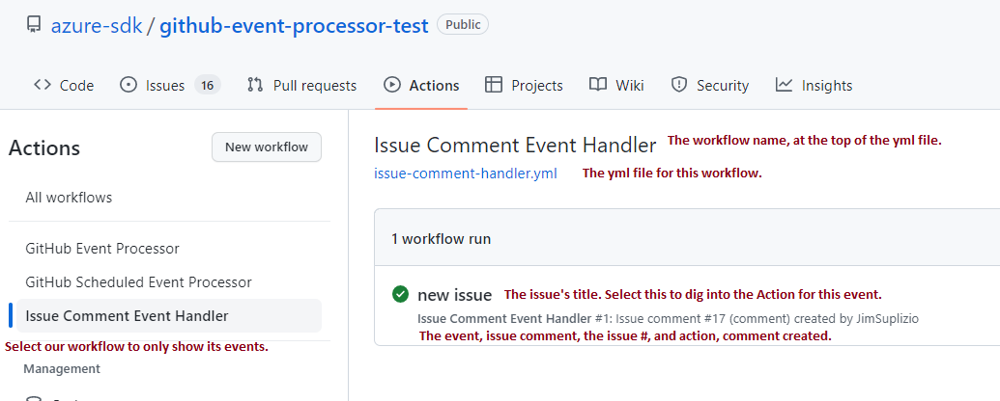
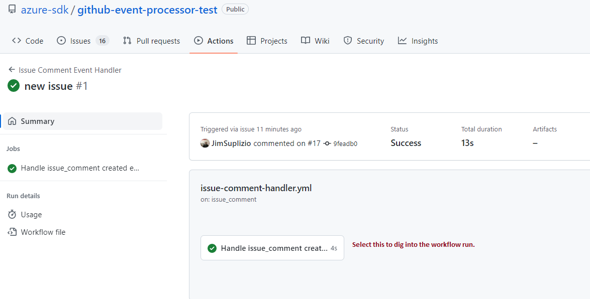
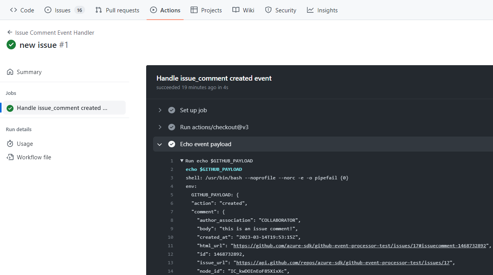

# GitHub Event Processor Tests

NUnit test project for GitHubEventProcessor. It contains a suite of static tests used to test the individual rules that can be run within Visual Studio.

## Why are there only automated Static tests and no automated Live tests?

1. Actions requires something happening with an Issue, Pull_Request, Pull_Request_Review or Comment that's done through through the UI. Creating or modifying things authenticated using a token is not going to cause other events to fire. For example, adding a label to an issue, will not cause an **Issues Labeled** event to fire off.
2. Actions are repository specific. Even if we could do automated live testing, it would only able to be done a repository setup specifically for it which would not be the same repository that's building, packaging and releasing the tools package.
3. Rule specific reasons. There are rule specific reasons that would also make this challenging. For example, we have a rules that look for issues or pull_requests that haven't had activity for 7/14/60/90 days and those can't be created on the fly and as soon as one is modified by rules process, that activity counter resets.
4. Live testing really only ends up testing the GitHub API. Calling to get permissions for a user, checking a user's org, updating an Issue or Pull_Request, or adding a comment, none of these are really going to test anything related to the rules themselves that couldn't be tested with a static payload and mocked calls.

## Static Testing and NUnit

The individual action and scheduled event functions are tested using NUnit and static payloads. The tests are all located in the [Static](./Static/) subdirectory and their GitHub Event Payloads are located in the [Tests.JsonEventPayloads](./Tests.JsonEventPayloads/) subdirectory. Like the event processing code, the tests are divided up by the events that trigger particular workflows and each rule has its own test function. For example, all of the Pull Request processing tests are located in [PullRequestProcessingTests.cs](./Static/PullRequestCommentProcessingTests.cs).

Each rule has at least two tests. The first test should ensure nothing happens if the rule is turned off. The second, and any subsequent tests, run with the rule turned on. These verify that things process as expected given a payload that contains the correct action and criteria for the event. For example, **Pull Request Triage** is rule that processes on a *pull request* event's *opened* action if there the pull request is created with no labels. The processing in the rule will add labels based upon file paths in the PR and will create a comment if the user who opened the PR does not have write or admin collaborator permissions. The permission check, along with anything else that requires a call to GitHub, are mocked for static tests. There are three tests for this particular rule, with the last two scenarios checking behavior with and without admin permissions. While this rule does not, some rules can require multiple payloads to test.

### Generating the static payloads

In order to run actions the following need to be setup:

1. The repository settings need to enable actions. *This can be done on a fork.*
2. A workflow yml file needs to be in the .github/workflows directory with the appropriate event and action to test. The following example just sets up to output the event payload **issue_comment** event's **created** action and just echos out the event payload.
3. After the yml file has been checked in, whatever setup required for the payload being generated needs to be done. In this example an issue comment needs to be created. The issue, itself, could be one that already exists but, if not, it would need to be created first. Other events might require more involved setup depending on the event, action and criteria of the rule.

The yml below was put into a file named issue-comment-handler.yml and checked into the .github/workflows directory of the [azure-sdk/github-event-processor-test](https://github.com/azure-sdk/github-event-processor-test) repository.

```yml
name: Issue Comment Event Handler
on:
  issue_comment:
    types: [created]
jobs:
  event-handler:
    name: Handle ${{ github.event_name }} ${{ github.event.action }} event
    runs-on: ubuntu-latest
    steps:
      - uses: actions/checkout@v3
      - name: Echo event payload
        run: |
          echo $GITHUB_PAYLOAD
        shell: bash
        env:
          GITHUB_PAYLOAD: ${{ toJson(github.event) }}
```

Once the workflow yml file has been checked into the repository or branch a comment created on an Issue or Pull Request will cause the event to fire. Select Actions in the repository which bring up all the Actions for a given repository. Over on the left, is the list of Workflows and the name, in the yml, should be one of them. Selecting that workflow will only show actions for that particular workflow.



Select action event to look at the details for its workflow run.



The workflow run will show all of the steps from setup, execution and cleanup. The one that matters is the **Echo event payload** which is the name of step that is outputting the payload.



The payload in between the begin/end tags and is usually several hundred lines long. Copy this and save it a file. At this point it's almost ready to be used for static testing, it just needs to be sanitized.

#### Sanitizing the static payloads

User and repository names should not be in the static payload files and sanitizing them requires a few, easy, global replacements.

- replace: azure-sdk/github-event-processor-test
- with: Azure/azure-sdk-fake

- replace: Actual user name(s)
- with: FakeUser1 ..FakeUserN

- replace: github-event-processor-test (there's always one "name" field in the repository section that has "github-event-processor-test" and not full name "azure-sdk/github-event-processor-test")
- with: azure-sdk-fake

#### Scheduled event tests only require a single static payload

Scheduled events differ from Action events in that the payload is vastly simpler. They really only contains the repository information necessary to search issues in GitHub and this information isn't required for the Scheduled event static tests.

### Static tests use a mock GitHubEventClient

The GitHubEventClient is a singleton used by workflow processing and any/all external calls are made through this class as well as calls to load rules configuration and CODEOWNERS files. The [MockGitHubEventClient](./MockGitHubEventClient.cs) overrides all of these calls, setting return values used for testing, or loading files crafted to help test certain scenarios in the case of CODEOWNERS. It's also used to expose things, for testing purposes, that aren't exposed in the GitHubEventClient. For example, the lists of items created by Scheduled events aren't exposed in GitHubEventClient because they don't to be.

## Live Testing

[azure-sdk/github-event-processor-test](https://github.com/azure-sdk/github-event-processor-test) is a repository which was specifically setup for testing purposes and can be used to generate static payloads. The .github\workflow contains  the [config and workflow yml files](../YmlAndConfigFiles/) which, aside from different config files, the final version of the workflow files. Every Action rule can be setup through creation and modification of issues and pull requests within the repository and every action has been tested this way. Scheduled events are a little different to test live because constraints dealing with time. Every scheduled event has "last modified X days ago" as part of its criteria ranging from 7 to 90 days which isn't something that can be created on the fly.

### Other requirements of the test repository

- Actions are turned on
- Every Azure SDK repository has a set of common labels that are used in rules automation. Those have already been created in this repository. The full list can be found in [LabelConstants.cs](../Azure.Sdk.Tools.GitHubEventProcessor/Constants/LabelConstants.cs) in the main project.
- Several testing SDK/ServiceDirectories with simplistic contents for creating PRs
- CODEOWNERS file that's been simplified for testing and tailored to the testing SDK/ServiceDirectories in the repository.

### Live testing using the installed package vs live testing building from source

The default in the workflow yml files is to install the github-event-processor from the [feed](https://dev.azure.com/azure-sdk/public/_artifacts/feed/azure-sdk-for-net/NuGet/Azure.Sdk.Tools.GitHubEventProcessor) which is produced from the Azure/azure-sdk-tools repository, where the source code lives. When doing active development, it's beneficial to be able to test changes live in the repository. Both workflow yml files have been setup to flip between running the installed package from the feed or building and installing the github-event-processor from Azure/azure-sdk-tools at a specific PR or SHA. This is trivial to do and instructions on how to do it are in both workflow yml files. Outside of the test repository, only the installed package should be ever be used. The reason for this is that the test repository does not have the same traffic as other repositories and building downloads several additional package from nuget.