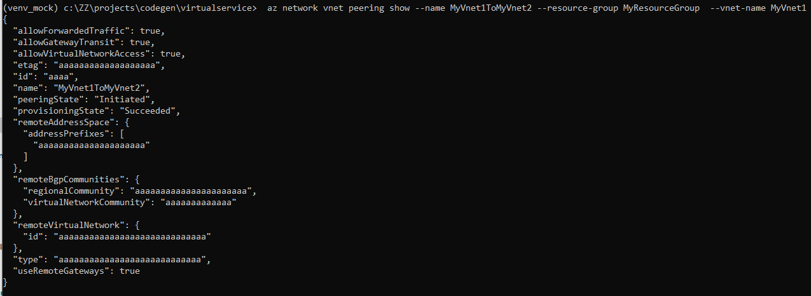

# What's the Mock Service Host

The Mock Service Host works as a mock server for ARM FrontDoor Service. It supports all management plane APIs that are defined in the azure-rest-api-specs repo (or any subset of it). It could be invoked from different types of clients including AzureCLI/Terraform/SDKs/Postman, etc. and it has the below capabilities:

1. Verify whether the incoming request meets the Swagger definition.
2. Generate a response based on Swagger and return it to the client.
3. Generate Swagger examples based on the request and response.


## Azure CLI under the Mock Service Host

All CLI commands for Azure Management plane work with the Mock Service Host, below is a sample:


# The Behaviour of Mock Service Host

The mock service could be run in your local environment. After started, it will listen to the following endpoints by default:

-   https://0.0.0.0:8441, stateful.
-   http://0.0.0.0:8442, stateless http.
-   https://0.0.0.0:8443, stateless https.
-   https://0.0.0.0:8445, always return 500 to simulate service internal error (except resourcegroup operations).

Since currently the HTTPS certificate is created with domain localhost, so the HTTPS endpoints can only be visited though "localhost".

> **_NOTE:_** If these listening ports are already been used by other apps in your local environment, change the default ports according to [the Configuration](#configuration).

## What's stateful/stateless

Stateful:

-   Client could only call GET/DELETE after CREATE succeeded, otherwise it will get the response code of 404.
-   If cascadeEnabled is true:
    -   The sub resource could only be created if parent resource already exists. For instance: the following resources should be created one after another: resourceGroup-->virtual network-->subnet.
    -   Deleting a parent resource will also delete it's all descendants.
-   If cascadeEnabled is false:
    -   Can create sub resource even if parent does not exist.
    -   Deleting a parent resource will not delete it's children.

Stateless:

-   Mock Service Host will return a valid mocked response for each valid call of GET/List.

# Getting Started (with Azure CLI)

## Prerequisites

-   The [Azure CLI](https://docs.microsoft.com/en-us/cli/azure/install-azure-cli) is well installed.
-   The [Nodejs](https://nodejs.org/en/download/) is well installed.

## Step 1: Start a Mock Service Host

### 1.1 Clone this project

Use git to clone this repo to your local workspace.

```shell
# cd MY_WORKSPACE
# git clone git@github.com:Azure/azure-sdk-tools.git
# cd tools/mock-service-host
```

### 1.2 Configure mock-service-host running environment to use your local swagger

The Azrue Rest Api Spec repo is a companion repo of mock-service-host. By default, the mock-service-host download [the public azure swagger repo](https://github.com/Azure/azure-rest-api-specs) to cache folder and load the target Resource provider based on configuration. You can ask it to load all RPs by updating configs in file '.env'.

```
+-- mock-service-host/
|   +-- cache/                   // swagger repos will be downloaded here in the first start-up of mock-service-host
|   +-- .env                     // you can create this file, and add configs in it.
```

Set target swagger files as bellow in .env:

```
specRetrievalGitUrl=https://github.com/Azure/azure-rest-api-specs
specRetrievalGitBranch=main
specRetrievalGitCommitID=xxx
validationPathsPattern=specification/*/resource-manager/*/**/*.json
```

Change specRetrievalGitUrl and specRetrievalGitBranch if you are not using the public swagger main branch. Change specRetrievalGitCommitID if you are not using the branch head. And you can specify a narrow rule to enable only your own RP's json files to accelerate the loading speed of mock-service-host. For instance:

```
validationPathsPattern=specification/mediaservices/resource-manager/Microsoft.Media/**/*.json
```

### 1.3 [Optional] download \*.pem files for self-signed certificate.
The SSL certificates are required when launching the mock-service-host. This step download the default *.pem certificate files from Azure KeyVault.

```shell
# az login ...      // login azure cli with your credential
# . initiate.sh   // for LINUX or mac
```

or

```bat
> initiate.ps1    // for Windows, need to run in powershell
```

If failed for permission reasons, please contact [CodeGen Core team vsccodegen@microsoft.com](vsccodegen@microsoft.com) for authentication on keyvault used in the scripts. Or you may create self-signed key&cert by your self, the required files can be found in [src/webserver/httpServerConstructor.ts](./src/webserver/httpServerConstructor.ts)

> **_NOTE:_** If you don't do this step, the mock-service-host will try to create new certificates when lauching. This will require [OpenSSL Toolkit](https://www.openssl.org/) must be available in your computer.

### 1.4 start Mock Service Host

```
# npm install && npm run start
```

Common trouble shootings for starting the web server:

-   Make sure all ports used in Mock Service Host haven't been used by other processes.
-   Try to used sudo/"start as administrator" if failed to start listening.

It takes up to two minutes to load all swagger files in the azure-rest-api-specs repo after the mock server started.
So please use it (for instance by Postman) after "validator initialized" is shown in the console.

## Step 2: Azure CLI Configuration

After the virtual server is started in local computer, below section describe how to consumes the mock server in client side.

### 2.1 Activate the Python Environment

Run `'az --version'` to get which python environment is used in your computer, for instance:


According to above output, you know the CLI is using Python virtual environment c:\ZZ\projects\codegen\venv_mock, saying it's YOUR_VENV.
Then you need to activate this venv:

```
# . <YOUR_VENV>/bin/activate       // for LINUX/mac
or
> <YOUR_VENV>\Scripts\activate    // for Windows
```

> **_NOTE:_** If your Azure CLI is installed with no python virtual environment (a system Python or a CLI embeded Python), don't need to activate any VENV, but make sure the step 2.2 will be executed with that Python folder.

### 2.2 Trust the certificate of Mock Service Host in Python environment

The Mock Service Host is using a self-signed certificate which will be appended into the file **cacert.pem** in your Python environment.

```shell
 cat .ssh/localhost-ca.crt >> <YOUR_VENV>/lib/python3.8/site-packages/certifi/cacert.pem       // for LINUX/mac
```

or

```bat
type .ssh\localhost-ca.crt >> <YOUR_VENV>\Lib\site-packages\certifi\cacert.pem                // for Windows
```

### 2.3 Configure Azure CLI to use Mock Service Host

```shell
# az login --server-principal --username <USERNAME> --password <PASSWORD> --tenant <TENANT> // login with any realworld credential
# az cloud register -n virtualCloud
                    --endpoint-resource-manager "https://localhost:8443"                    // connect to stateless endpoint
                    --endpoint-active-directory https://login.microsoftonline.com
                    --endpoint-active-directory-graph-resource-id https://graph.windows.net/
                    --endpoint-active-directory-resource-id https://management.core.windows.net/
# az cloud set -n virtualCloud
```

### 2.4 Verification

Now you can try any Azure CLI command, the setup is done if mocked response is received for the below command.
Feel free to try other commands.

```shell
# az network vnet peering create --allow-vnet-access --name MyVnet1ToMyVnet2 --remote-vnet MyVnet2Id --resource-group MyResourceGroup --vnet-name MyVnet1

{
  "allowForwardedTraffic": true,
  "allowGatewayTransit": true,
  "allowVirtualNetworkAccess": true,
  "etag": "aaaaaaaaaaaaaaaaaaa",
  "id": "aaaa",
  "name": "MyVnet1ToMyVnet2",
  "peeringState": "Initiated",
  "provisioningState": "Succeeded",
  "remoteAddressSpace": {
    "addressPrefixes": [
      "aaaaaaaaaaaaaaaaaaaaa"
    ]
  },
  "remoteBgpCommunities": {
    "regionalCommunity": "aaaaaaaaaaaaaaaaaaaaaa",
    "virtualNetworkCommunity": "aaaaaaaaaaaaa"
  },
  "remoteVirtualNetwork": {
    "id": "aaaaaaaaaaaaaaaaaaaaaaaaaaaaa"
  },
  "type": "aaaaaaaaaaaaaaaaaaaaaaaaaaaa",
  "useRemoteGateways": true
}
```

## Step 3: Generate your extension with autorest.az

> **_NOTE:_** The [autorest](https://www.npmjs.com/package/autorest) is required for this step.

Following the [Autorest.az Guide](https://github.com/Azure/autorest.az#how-to-use-azure-cli-code-generator) you can generate CLI extension with your own swagger files. Key steps are:

```diff
# autorest  --az
            --use=https://trenton.blob.core.windows.net/trenton/autorest-az-1.7.3.tgz
            <path-to-the-swagger-readme.md>
            --azure-cli-extension-folder=<output-folder>
+           --gen-cmdlet-test               // remember to add this option if want to run cmdlet tests (in Step 4)
# cd <output-folder>/<extension-folder>
# python setup.py sdist bdist_wheel         // generate wheel-file (*.whl) in "dist" folder
# az extension add --source=<path-to-the-wheel-file>
```

Now you can try to look through and run your extended Azure CLI command.

```shell
# az <extension-name>  --help               // check generated comand groups
# az <extension-name> <group-name> --help  // check commands in the group
# az <extension-name> <group-name> <create|list|show|delete...> --help  // check detail command information
# az <extension-name> <group-name> <create|list|show|delete...> <--params...>  // run your command with Virtual Server
```

Below is sample steps for generate CLI extension for RP [guestconfiguration](https://github.com/Azure/azure-rest-api-specs/tree/main/specification/guestconfiguration/resource-manager):

```bat
> autorest  --az
            --use=https://trenton.blob.core.windows.net/trenton/autorest-az-1.7.3.tgz
            ..\azure-rest-api-specs\specification\guestconfiguration\resource-manager\readme.md
            --azure-cli-extension-folder=..\generated
            --gen-cmdlet-test
# cd ..\generated                     // go to the output folder
# cd src\guestconfig                  // go to the generated extension folder
# python setup.py sdist bdist_wheel
# az extension remove guestconfig     // remove it first since it's an existing extension
# az extension add --source=.\dist\guestconfig-0.1.0-py3-none-any.whl

# az guestconfig --help               // check information for the guestconfig extension.
...
```

> **_NOTE:_** The variable <extension-name> can be found in readme.az.md. For guestconfiguration, it's ["extensions: guestconfig"](https://github.com/Azure/azure-rest-api-specs/blob/main/specification/guestconfiguration/resource-manager/readme.az.md#az)

## Step 4: Test generated cmdlets in one command

Testcases are also generated for the CLI extension, you can run the end-to-end test case with Mock server in one command.
The test file is located at `<output-folder>\src\<extension-name>\azext_<extension-name>\tests\cmdlet\test_positive.py`
Taking RP guestconfiguration as example, the test can be run with below command:

```bat
> pip install pytest        // make sure pytest is installed
> pytest -rA <output-folder>\src\guestconfig\azext_guestconfig\tests\cmdlet\test_positive.py
...
========================= short test summary info ==========================
PASSED ..\azure-cli-extensions\src\guestconfig\...::test_guest_configuration_assignment_list
PASSED ..\azure-cli-extensions\src\guestconfig\...::test_guest_configuration_assignment_report_list
PASSED ..\azure-cli-extensions\src\guestconfig\...::test_guest_configuration_assignment_report_show
PASSED ..\azure-cli-extensions\src\guestconfig\...::test_guest_configuration_assignment_show
PASSED ..\azure-cli-extensions\src\guestconfig\...::test_guest_configuration_hcrp
PASSED ..\azure-cli-extensions\src\guestconfig\...::test_guest_configuration_hcrp2
PASSED ..\azure-cli-extensions\src\guestconfig\...::test_guest_configuration_hcrp_assignment_list
PASSED ..\azure-cli-extensions\src\guestconfig\...::test_guest_configuration_hcrp_assignment_show
========================= 8 passed, 3 warnings in 36.24s =========================
```

# Configuration

You can create a file .env to customize the configurations used at runtime. The file .env should be located at current working directory, for instance:

```
+-- mock-service-host
|   +-- .env                 // configuration files
```

## Customize mock-service-host listen ports

Bellow options in .env are available to configure the server to listen specific local TCP ports.

```
httpsPortStateful=5001
httpPortStateless=5002
httpsPortStateless=5003
internalErrorPort=5004
```

## Consume a remote swagger repo

You can use below configures to configure the server to load and run against a remote swagger repo:

```
specRetrievalMethod=git
specRetrievalLocalRelativePath=./cache
specRetrievalGitUrl=https://github.com/Azure/azure-rest-api-specs-pr
specRetrievalGitBranch=main
```

## Consume a local swagger repo

Instead of download swagger repo from git remotely, you can configure the mock server to load your local swagger files:

```
specRetrievalMethod=filesystem
specRetrievalLocalRelativePath=../azure-rest-api-specs
validationPathsPattern=specification/*/resource-manager/*/**/*.json
```

## Configure example generation folder

With below configuration, the REST calling request and mocked response can be preserved in local swagger repo.

```
enableExampleGeneration=true
```

The example files are generated in the **mock** sub-folder relative to the swagger directory, for example:

-   [specRetrievalLocalRelativePath]\specification\apimanagement\resource-manager\Microsoft.ApiManagement\preview\2018-01-01\mock
    You can update exampleGenerationFolder in file .env to use another folder, for instance:

```
exampleGenerationFolder=examples
```

## Configure cascadeEnabled

The stateful endpoint has different behaviour on Create/Delete operations depending on value of **cascadeEnabled**.
The cascadeEnabled is false by default, you can enable it in file .env like below:

```
cascadeEnabled=true
```

