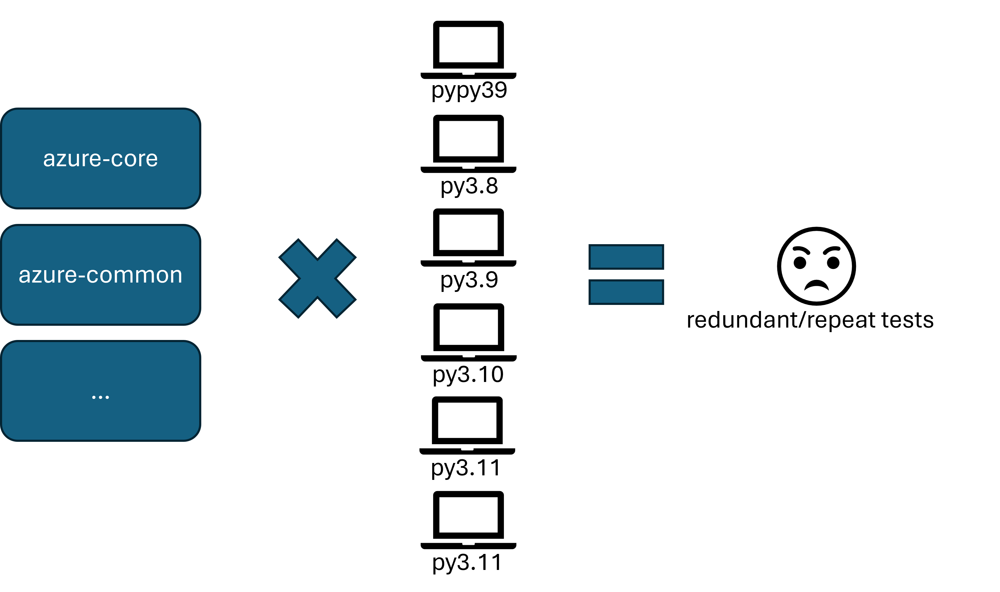

# Azure SDK Pipelines - v3

## State of the world

The azure-sdk maintains a common build definition pattern for all our repositories.

```text
<language repo root>
  eng/
    <devops yml>
  sdk/
    keyvault/
      ci.yml <-- recorded tests
      tests.yml <-- livetests
```

A devops build definition exists for each `ci.yml` and `tests.yml` that is present in a given language repo. For the `ci.yml`, there exists an `internal` and `public` version of the build. The former of which is used to **release the package**.

The important detail here is that in most cases, an `internal` and `public` run are **mostly the same** when it comes to the _amount_ of testing that happens.

Let's draw that out using `python core` as an example.



As you can see, given there is no intelligence on _what_ to run, we end up running the **full** test suites for all packages for _all_ platforms. This is a ton of redundant testing that _probably_ doesn't catch that many issues.

> Note: The azure-sdk-for-net core PR builds break up the invoked tests across multiple agents into what are called "dependency groups". That strategy is the general thrust of `pipelinev3`, just generalized!

## Goals

With the above context set, the goal of the `pipelinev3` effort are the following:

- When we are finished, there will be a single build definition triggered on PullRequests.
- The single build definition should dynamically expand and contract _which tests are invoked_ based upon the _context of that PR_.
  - We will need to work with _each language team_ to spec out what is and is not possible based on the language of the package under test. 
- The single build definition should run in _reduced time_ in comparison to the world as-is.
- The single build definition attempts to make test-cases sparse across platforms, so we aren't running the same test case across multiple platforms
- We will be able to track the success or failure of a specific test over time.
  - This data will be utilized to further reduce the tests run during PRs or CI.

## The Language Matrix - How will work be parceled out?

Notice that we are going from very abstract to very granular with the order of questions. These should form a funnel.

| Criteria                                                           | .NET | Java | JS | Python | Go | c | cpp | iOS | Android |
|--------------------------------------------------------------------|------|------|----|--------|----|---|-----|-----|---------|
| Can calculate affected packages based on git diff                  |  y   |  y   | y  |   y    | y  | y | y   |  y  |   y     |
| Can calculate affected test files based on git diff                |      |      |    |        |    |   |     |     |         |
| Can calculate affected individual tests based on git diff          |      |      |    |        |    |   |     |     |         |
| Can individually run target test files in a PR build               |      |      |    |        |    |   |     |     |         |
| Can individually run target tests within a test file in a PR build |      |      |    |        |    |   |     |     |         |

To support full support a single build for all PRs, we need a strategy to distribute individual tests to a specific platform. Only if all are possible will we be able to distribute tests.

Depending on how tests must be individually targeted (on a per-language basis), we may need to drop artifacts on disk that can be picked up from each test run. This data will have to be passed on to the relevant test phase. It will entirely depend on the package.

### .NET

The .NET `core` version is already applying a _version_ of this logic to find all packages that are dependent on `core`. It spreads these tests out.

### Java

### JS

### Python

### Go

### c

### cpp

### iOS

### Android

## The actual work

What follows is a long bullet point list that `scbedd` is using to rationalize forward progress for the project. Duplicate this entire bullet point list for each language.

- [ ] Add `<language> - pullrequest` definition for each language
- [ ] `<language> - pullrequest` expands and contracts, building the correct files per the changed files
- [ ] `<language> - pullrequest` expands and contracts, _analyzing_ the correct projects per the changed files
- [ ] `<language> - pullrequest` expands and contracts, _testing_ the correct projects per the changed files
- [ ] `<language> - pullrequest` distributes _individual tests_ sparsely across the test platforms
- [ ] `<language> - pullrequest` only invokes _individual tests_ sparsely across the test plaforms AND only invokes tests that have been updated per the changed files
