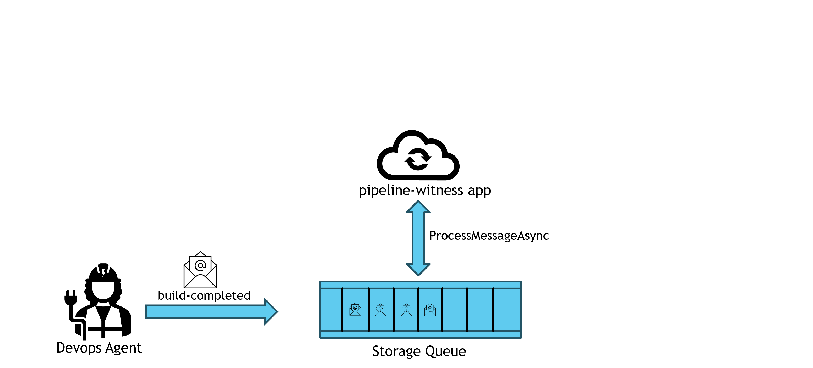

# `pipeline-witness`

This project functions as the agent by which `build logs`, `aggregate test results`, `error metrics by custom buckets` and other resultant data from Azure Devops pipeline runs are aggregated into our kusto data catalog.

You can explore the available data from this project at [https://dataexplorer.azure.com/clusters/azsdkengsys.westus2/](https://dataexplorer.azure.com/clusters/azsdkengsys.westus2/).

## Deployment - App

The `infrastructure/bicep` folder contains the bicep template needed to deploy a working version of this application.

This is the general layout of the project:

## Deployment - Kusto Backend

The contents of `infrastructure/kusto` are used to create the necessary tables, and to add the necessary mappings to automatically ingest blobs to said tables.
