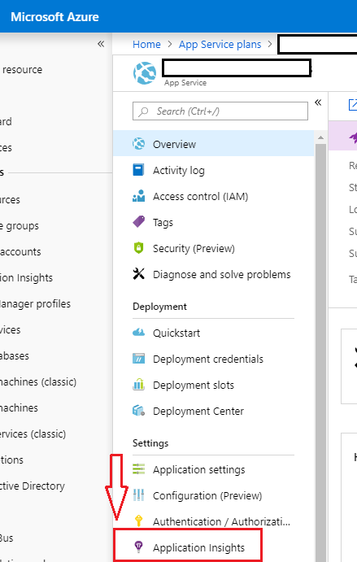

# Pixel Server

This site is intended as a backing server to serve pixels being loaded on a web page. Note that the limit of data retrieved here is merely:

> a pixel with query string `x` was requested 

No PII data is recorded. 

## Prerequisites
* This project was built, tested, and peformance checked using `.NET Core 2.1`.
* It is intended (and has been tested) for deployment to an `Azure AppService`
* The backing data store is `Application Insights`, so you will need to create one prior to deployment.

## Usage
To add a tracking pixel, simply embed an image of the following form.

```
Markdown:


RST:
.. image::  https://<yourappservicename>.azurewebsites.net/api/impressions/<URI-path>

Img URL:
.azurewebsites.net/api/impressions/<URI-path>">
```

## Deployment and Setup

This site is currently configured to leverage `Application Insights` as a connected service. With the code that is currently checked in, the order to deploy your own version of this site is as follows:

* Deploy site in `release` configuration to your AppService
* Enable Application Insights on your AppService

## Enabling Application Insights on your AppService

First, install the [Azure CLI](https://docs.microsoft.com/en-us/cli/azure/install-azure-cli?view=azure-cli-latest). Use the `az login` command to sign in with the appropriate email to access your azure subscriptions. After that, ensure you've created an `Application Insights` where it is visible to your target AppService.

Then, leverage the following az commands:

```
#retrieve the InstrumentationKey for your previously created appinsights 
$key = az resource show -g <resource group name> -n <appinsight name> --resource-type "Microsoft.Insights/components" --query properties.InstrumentationKey

#set the application insight for web app
az webapp config appsettings set -g <resource group name> -n <web app name> --settings "APPINSIGHTS_INSTRUMENTATIONKEY = $key"
```

Or, if you the above is too much trouble. Go through the UI.



## Querying App Insight's logs

The customEvents table can be filtered by name `PixelImpression`. The table will contain a column `visitor_path` for the URI-PATH that's passed in with the request. 

Example query:
```kusto
customEvents
| project name, operation_Name, timestamp, customDimensions.visitor_path
| where name == "PixelImpression" and timestamp >= ago(90d)
| sort by timestamp
```
