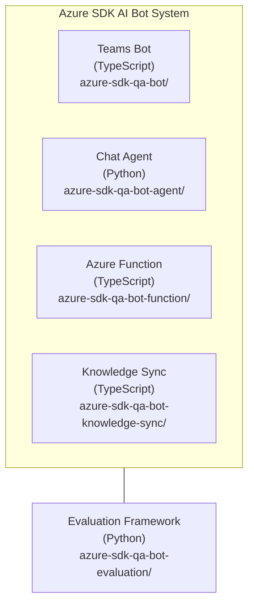

# Azure SDK AI Bot

This folder contains AI-powered components that work together to provide intelligent assistance for Azure SDK, including TypeSpec authoring guidance, Azure SDK generation support, and service team onboarding.

## Architecture Overview

The system consists of five main components that work together to provide support for Azure SDK domain knowledge. Each component operates independently with well-defined interfaces:



## Components

### 1. Azure SDK QA Bot (`azure-sdk-qa-bot/`)

An intelligent assistant that operates within Microsoft Teams to help developers with Azure SDK related questions. It provides real-time guidance on TypeSpec authoring, Azure SDK onboarding, and best practices by leveraging AI-powered responses.

### 2. Chat Agent (`azure-sdk-qa-bot-agent/`)

A next-generation AI chat agent built on the Microsoft Agent Framework with Azure AI Foundry. It generates AI-powered responses for the bot — receiving user questions, processing them through AI models, and managing user feedback — with rich retrieval, Foundry Memory for conversation context, and a two-component architecture (agent + FastAPI server).

### 3. Azure Function (`azure-sdk-qa-bot-function/`)

A serverless component that handles bot analytics and activity conversion. It processes Teams bot interactions and provides monitoring capabilities for the system.

### 4. Evaluation Framework (`azure-sdk-qa-bot-evaluation/`)

A quality assurance system that continuously monitors and evaluates the performance of the AI bot's responses. It runs automated tests to measure response accuracy, relevance, and quality to ensure the bot maintains high standards of assistance.

### 5. Knowledge Sync Service (`azure-sdk-qa-bot-knowledge-sync/`)

A standalone TypeScript application that processes documentation from various repositories and maintains the knowledge base. It clones repositories, processes markdown files and TypeSpec Spector test files, uploads processed content to Azure Blob Storage, and updates the Azure AI Search index. This service maintains change detection for efficient processing and serves as the primary knowledge management component for the system.

## Knowledge Sources

The bot provides intelligent responses by searching through comprehensive knowledge bases including:

- **TypeSpec Documentation**: Official TypeSpec language documentation
- **TypeSpec Azure Documentation**: Azure-specific TypeSpec patterns and practices
- **Azure SDK Engineering Hub**: Internal development guidelines and best practices
- **Custom Documentation**: Configurable additional sources via JSON configuration

## Getting Started

### Prerequisites

- **Node.js**: Version 20+
- **Python**: Version 3.10+ (for chat agent and evaluation framework)
- **Azure Subscription**: For deploying cloud resources
- **Teams Toolkit**: For Teams app development and deployment

### Local Development

#### Teams Bot

```bash
cd azure-sdk-qa-bot
npm install
npm run dev
```

#### Chat Agent

```bash
cd azure-sdk-qa-bot-agent
python -m venv .venv
source .venv/bin/activate  # Windows: .venv\Scripts\Activate.ps1
pip install -r requirements-dev.txt
```

See [azure-sdk-qa-bot-agent/README.md](https://github.com/Azure/azure-sdk-tools/blob/main/tools/sdk-ai-bots/azure-sdk-qa-bot-agent/README.md) for full setup instructions, including VS Code debugging with AI Toolkit.

#### Azure Function

```bash
cd azure-sdk-qa-bot-function
npm install
npm start
```

#### Knowledge Sync Service

```bash
cd azure-sdk-qa-bot-knowledge-sync
npm install
npm start
```

#### Evaluation Framework

```bash
cd azure-sdk-qa-bot-evaluation
pip install -r requirements.txt
python evals_run.py --help
```

**NOTE**: Running Evaluations

To run evaluations, see: [azure-sdk-qa-bot-evaluation/README.md](https://github.com/Azure/azure-sdk-tools/blob/main/tools/sdk-ai-bots/azure-sdk-qa-bot-evaluation/README.md)

## Configuration

### Documentation Sources

Add new documentation sources by updating the knowledge configuration. The Knowledge Sync Service uses `azure-sdk-qa-bot-knowledge-sync/config/knowledge-config.json`. See [Self-Serve Knowledge Sources Guide](https://github.com/Azure/azure-sdk-tools/blob/main/tools/sdk-ai-bots/docs/SELF_SERVE_ADD_KNOWLEDGE_SOURCES.md) for detailed instructions.

### Environment Variables

Each component requires specific environment variables for Azure service connections, API keys, and configuration settings. Refer to individual component READMEs for detailed configuration requirements.

## Support

For questions and support related to Azure SDK AI tools:

- Review component-specific READMEs for detailed documentation
- Check the [Chat Agent troubleshooting guide](https://github.com/Azure/azure-sdk-tools/blob/main/tools/sdk-ai-bots/azure-sdk-qa-bot-agent/TROUBLESHOOTING.md)
- Refer to the [self-serve knowledge sources guide](https://github.com/Azure/azure-sdk-tools/blob/main/tools/sdk-ai-bots/docs/SELF_SERVE_ADD_KNOWLEDGE_SOURCES.md)
