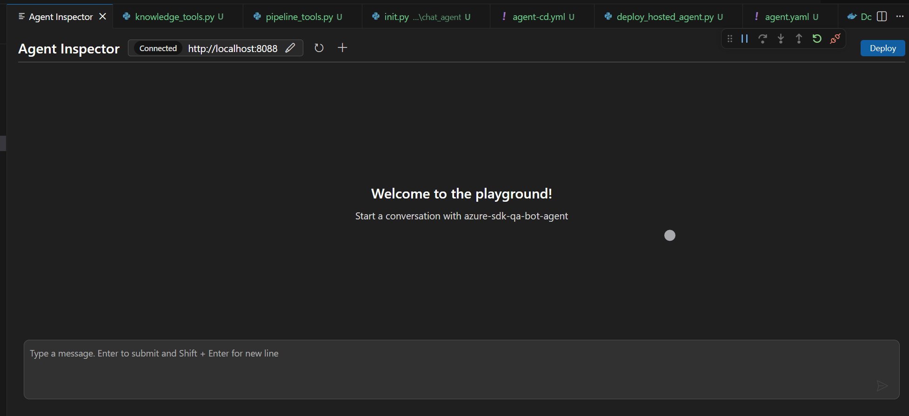
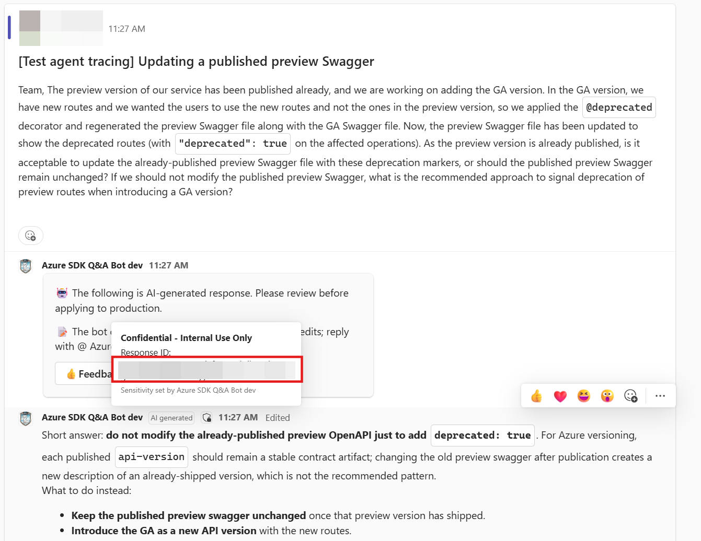
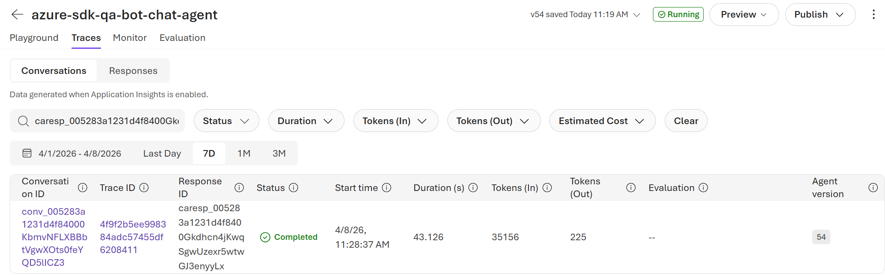
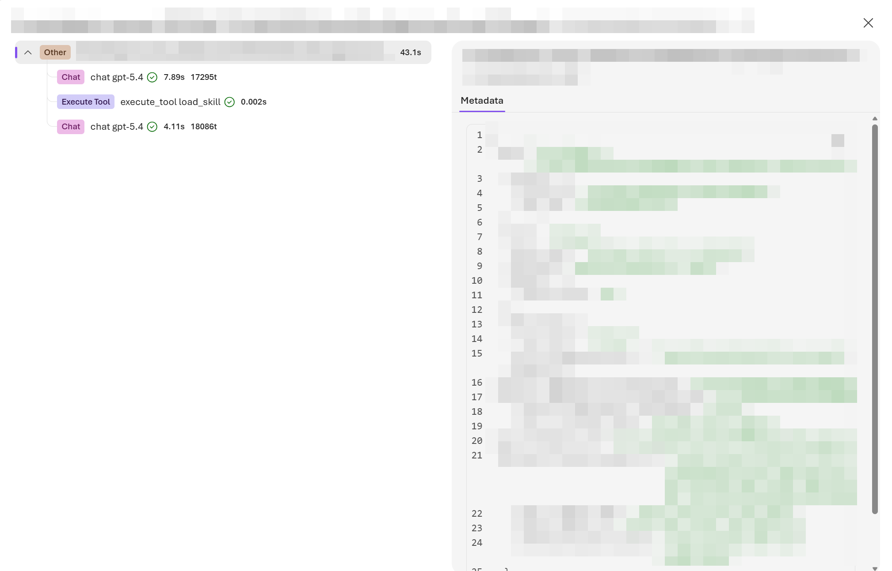
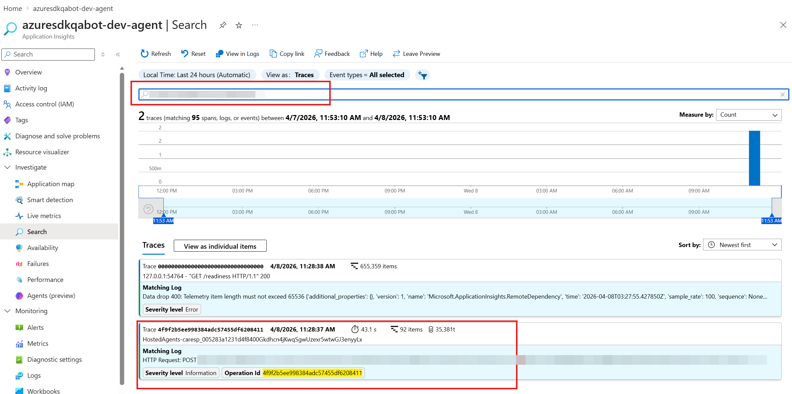
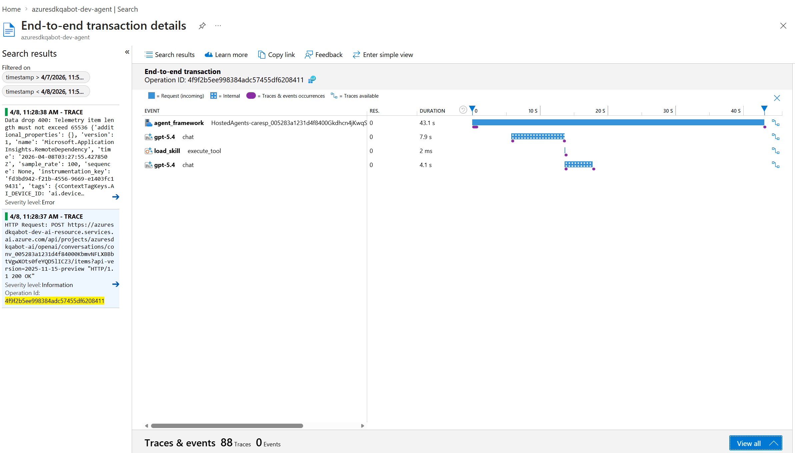

# Azure SDK QA Bot Agent

The Azure SDK QA Bot Agent helps developers with Azure SDK questions. This project is a migration of the [azure-sdk-qa-bot-backend](../azure-sdk-qa-bot-backend/) from Go to Python, built on the [Microsoft Agent Framework](https://learn.microsoft.com/en-us/agent-framework/overview/agent-framework-overview) with Azure AI Foundry. It leverages Azure AI Search for knowledge retrieval and Foundry Memory for conversation context.

> **Note:** This project is currently in draft / active development.

## Prerequisites

- Python 3.10 or higher
- Azure CLI installed and authenticated (`az login`)
- Azure subscription with access to the following services:
  - Azure App Configuration
  - Azure AI Search
  - Azure Storage
  - Azure OpenAI / Azure AI Foundry
  - Microsoft Foundry Project (with a chat model deployed, e.g. `gpt-5.4`)

## Installation and Setup

### Grant Resource Permissions

Ensure your Azure identity has the following roles:

- App Configuration Data Reader
- Storage Blob Data Contributor
- Azure AI User (on the Foundry Project)
- Cosmos DB Built-in Data Contributor

### Project Setup

1. Navigate to the project:

   ```bash
   cd tools/sdk-ai-bots/azure-sdk-qa-bot-agent
   ```

2. Create and activate a virtual environment:

   **Windows (PowerShell):**

   ```powershell
   python -m venv .venv
   .\.venv\Scripts\Activate.ps1
   ```

   **macOS/Linux:**

   ```bash
   python -m venv .venv
   source .venv/bin/activate
   ```

3. Install dependencies:

   ```bash
   pip install -r requirements-dev.txt
   ```

   This installs all production dependencies plus development tools (`debugpy`, `agent-dev-cli`). CI/CD pipelines and Docker images use `requirements.txt` (production only).

4. Create a `.env` file in the project root with the App Configuration endpoint:

   ```dotenv
   AZURE_APPCONFIG_ENDPOINT=https://azuresdkqabot-dev-config.azconfig.io
   ```

   To test the GitHub MCP tool locally, add a [GitHub personal access token](https://github.com/settings/tokens):

   ```dotenv
   GITHUB_TOKEN=ghp_your_token_here
   ```

   Without this, the agent uses GitHub App JWT authentication via Key Vault, which is only available in production.

   Optionally, set `MEMORY_UPDATE_DELAY=0` to process memory updates immediately during local development (default is 300 seconds).

5. Log in to Azure:

   ```bash
   az login  # select the Azure SDK Engineering System subscription
   ```

## Running Locally

This project has two separate components that are run and debugged differently:

| Component | Description | Entrypoint | Port | Debug Method |
|-----------|-------------|------------|------|--------------|
| **Agent** | The AI chat agent (Microsoft Agent Framework, Responses protocol) | `agents/chat_agent/init.py` | 8088 | F5 with AI Toolkit Agent Inspector |
| **Server** | The backend API that the Teams App communicates with (FastAPI) | `server.py` | 8089 | Standard Python debugging |

### Debugging the Agent (F5 with AI Toolkit)

Use this to develop and test the AI agent itself (prompt tuning, tool integration, etc.).

1. Install the [AI Toolkit](https://marketplace.visualstudio.com/items?itemName=ms-windows-ai-studio.windows-ai-studio) extension for VS Code.
2. Use this instruction to let your copilot set up local debugging with the AI Toolkit: `Help me configure the azure-sdk-qa-bot-agent/agents to work with AI Toolkit Agent Inspector. 1) Ensure the agent is serverized as an HTTP server. 2) Install 'agent-dev-cli' and use 'agentdev' to launch the agent. 3) Add VS Code configuration (tasks.json and launch.json) for debugging.`
3. Copilot will automatically generate the debug configuration (`.vscode/launch.json` and `.vscode/tasks.json`) for the project.
4. Press **F5** to start debugging.

This launches the agent via `agentdev run` on `http://localhost:8088/` with `debugpy` attached, and opens the AI Toolkit Agent Inspector for interactive testing.



### Debugging the Server

1. Use this instruction to let your copilot set up local debugging with the AI Toolkit: `Help me configure the azure-sdk-qa-bot-agent/server.py to work with VS Code Python debugging. 1) Add a debug configuration in launch.json to launch the FastAPI server with uvicorn and debugpy. 2) The server should be launched on http://localhost:8089/`
```json
{
    "name": "Debug Backend Server",
    "type": "debugpy",
    "request": "launch",
    "module": "uvicorn",
    "args": ["server:app", "--host", "0.0.0.0", "--port", "8089"],
    "cwd": "${workspaceFolder}"
}
```
2. Press **F5** to start debugging the server.
3. Install REST Client extension
4. Run tests under `tests/api_test.rest` to verify the server is working.

## Deployment

The project has three independently deployable components, each with its own CD pipeline. All pipelines are manually triggered and parameterized by environment (`dev` / `prod`).

### Agent Deploy

Builds the agent container image, pushes to ACR, and deploys a new hosted agent version to Azure AI Foundry.

- **Pipeline**: [agent-cd.yml](pipelines/agent-cd.yml) | [Run in ADO](https://dev.azure.com/azure-sdk/internal/_build?definitionId=8159)
- **Deploy script**: [scripts/deploy_hosted_agent.py](scripts/deploy_hosted_agent.py)
- **Parameters**: `environment` (dev/prod), `agentName` (chat_agent)
- **What it does**:
  1. Builds the Docker image from `agents/chat_agent/Dockerfile`
  2. Pushes to `azuresdkqabotcontainer.azurecr.io`
  3. Runs `deploy_hosted_agent.py` to create a new agent version via Foundry API

**Manual deploy** (from project root):

```bash
python scripts/deploy_hosted_agent.py chat_agent --tag <image-tag>
```

### Server Deploy

Builds the backend API (FastAPI) container image and deploys to Azure App Service.

- **Pipeline**: [server-cd.yml](pipelines/server-cd.yml) | [Run in ADO](https://dev.azure.com/azure-sdk/internal/_build?definitionId=8128)
- **Parameters**: `environment` (dev/preview/prod), `slot` (default/agent)
- **What it does**:
  1. Resolves image tag from `_version.py` (prod) or git short SHA (dev)
  2. Builds and pushes image to ACR via `az acr build`
  3. Deploys to App Service using container image reference

### Logic App Deploy

Deploys the Logic App ARM template for Teams channel message mirroring.

- **Pipeline**: [logicapp-cd.yml](pipelines/logicapp-cd.yml) | [Run in ADO](https://dev.azure.com/azure-sdk/internal/_build?definitionId=8177)
- **Parameters**: `environment` (dev/test/prod)
- **What it does**:
  1. Runs `az deployment group create` with environment-specific ARM template parameters
  2. Idempotent — safe to re-run

### CI Pipeline

Runs linting (pyright) and unit tests on PRs that touch the bot agent code.

- **Pipeline**: [server-ci.yml](pipelines/server-ci.yml) | [View in ADO](https://dev.azure.com/azure-sdk/internal/_build?definitionId=8156)
- **Triggers**: PRs to `main` touching `tools/sdk-ai-bots/azure-sdk-qa-bot-agent`

## Tracing & Debugging a Response

When the bot replies in Teams, you can trace the full request lifecycle from response ID down to detailed logs according to the environment.

**Deployed Environments**

| Environment | Agent Playground | Application Insights |
|-------------|-----------------|---------------------|
| **Dev** | [Foundry Agent Playground](https://ai.azure.com/nextgen/r/oYiXpn5ERX2SYPKFTArKQg,azure-sdk-qa-bot-dev,,azuresdkqabot-dev-ai-resource,azuresdkqabot-ai/build/agents/azure-sdk-chat-agent/build) | [azuresdkqabot-dev-agent](https://ms.portal.azure.com/#@microsoft.onmicrosoft.com/resource/subscriptions/a18897a6-7e44-457d-9260-f2854c0aca42/resourceGroups/azure-sdk-qa-bot-dev/providers/Microsoft.Insights/components/azuresdkqabot-dev-agent/overview) |
| **Test & Prod** | [Foundry Agent Playground](https://ai.azure.com/nextgen/r/oYiXpn5ERX2SYPKFTArKQg,azure-sdk-qa-bot,,azuresdkqabot-ai-resource,azuresdkqabot-ai/build/agents/azure-sdk-chat-agent/build) | [azuresdkqabot-agent](https://ms.portal.azure.com/#@microsoft.onmicrosoft.com/resource/subscriptions/a18897a6-7e44-457d-9260-f2854c0aca42/resourceGroups/azure-sdk-qa-bot/providers/Microsoft.Insights/components/azuresdkqabot-agent/overview) |

### 1. Find the Response ID

Hover over the **sensitivity label** ("Confidential - Internal Use Only") on the bot's reply in Teams. The tooltip shows the **Response ID** (e.g. `caresp_005283a1231d4f8400Gkdhcn4jKwqSgwUzexr5wtwGJ3enyyLx`).



### 2. Filter by Response ID in Foundry Traces

Open the agent's **Traces** tab in Foundry portal. Paste the Response ID into the search box. This shows the matching conversation with Trace ID, duration, token usage, and status.

> **Note:** The Foundry Traces tab only shows traces for the currently selected agent version. If you don't know which version handled the request, skip to **Step 4** and search directly in Application Insights — it contains traces across all versions.



### 3. View Agent Processing Steps

Click the **Trace ID** link to open the trace detail view. This shows the full span tree for the request — the top-level `HostedAgents-*` span and its children (Chat, Execute Tool, etc.) with timing and token counts.



### 4. Investigate Detailed Logs in Application Insights

To see the complete Python-level logs, copy the **Trace ID** from step 2 and query the Application Insights **Investigate/** blade:



Click the trace, it returns all log records for that request — credential acquisition, agent session loading, conversation retrieval, tool calls, and any custom log messages — in chronological order.

You can also click **View timeline** to see the span timeline view, which shows the same `HostedAgents-*` → Chat → Execute Tool hierarchy as the Foundry Traces detail (Step 3).


## Project Structure

- `agents/` - Agent definition, instructions, and tool implementations
- `config/` - Configuration (Azure App Configuration integration)
- `services/` - Core business logic (chat, conversation, feedback)
- `utils/` - Azure service clients (AI Foundry, AI Search, Cosmos DB, Storage, Memory)
- `models/` - Data models
- `pipelines/` - Pipeline definitions
- `tests/` - Test files
- `server.py` - Backend entrypoint

## Contributing

1. Fork the repository
2. Create your feature branch (`git checkout -b feature/amazing-feature`)
3. Commit your changes (`git commit -m 'Add some amazing feature'`)
4. Push to the branch (`git push origin feature/amazing-feature`)
5. Open a Pull Request
