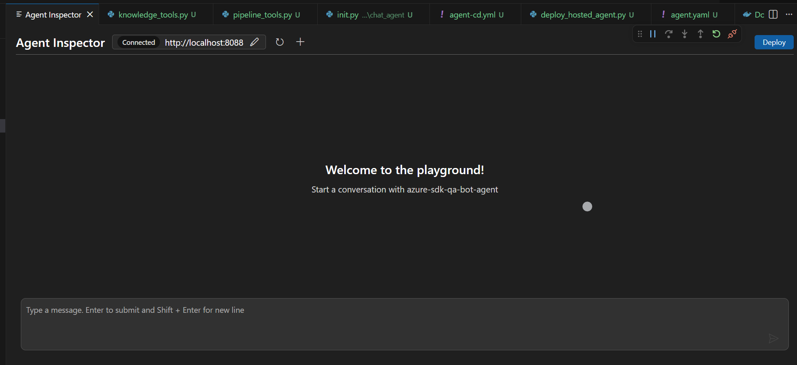

# Azure SDK Chat Agent

The Azure SDK Chat Agent helps developers with Azure SDK questions. It is built on the [Microsoft Agent Framework](https://learn.microsoft.com/agent-framework/overview/agent-framework-overview) with Azure AI Foundry. It leverages Azure AI Search for knowledge retrieval and Foundry Memory for conversation context.

> **Note:** This project is currently in draft / active development.

## Project Structure

```
azure-sdk-qa-bot-agent/
├── agents/          # Agent definition, instructions, and tool implementations
├── config/          # Configuration (Azure App Configuration integration)
├── services/        # Core business logic (chat, conversation, feedback)
├── utils/           # Azure service clients (AI Foundry, AI Search, Cosmos DB, Storage, Memory)
├── models/          # Data models
├── pipelines/       # CI/CD pipeline definitions
├── tests/           # Test files
├── server.py        # Backend API entrypoint (FastAPI)
└── TROUBLESHOOTING.md
```

The project has the following components:

| Component | Description | Entrypoint | Port |
|-----------|-------------|------------|------|
| **Chat Agent** | AI chat agent (Microsoft Agent Framework, Responses protocol) | `agents/chat_agent/init.py` | 8088 |
| **Chatbot Evolution Agent** | KB-quality analyst that diagnoses negative-feedback turns and files KB-gap GitHub issues | `agents/chatbot_evolution_agent/init.py` | 8088 |
| **Teams Collection Agent** | Scheduled channel-post and reply archive, deployed with a Foundry Routine and dedicated Logic App | `agents/teams_collection_agent/init.py` | 8088 |
| **Server** | Backend API that the Teams App communicates with (FastAPI) | `server.py` | 8089 |

> Hosted agents bind port `8088`. Run only one chat or evolution agent at a time locally. Teams collection uses the deployed workflow described below; it has no standalone local collection command.

## Getting Started

### Prerequisites

- Python 3.10 or higher
- Azure CLI installed and authenticated (`az login`)
- Azure subscription with access to:
  - Azure App Configuration
  - Azure AI Search
  - Azure Storage
  - Azure OpenAI / Azure AI Foundry
  - Microsoft Foundry Project

### Required Azure Roles

Ensure your Azure identity has:

- App Configuration Data Reader
- Storage Blob Data Contributor
- Azure AI User (on the Foundry Project)
- Cosmos DB Built-in Data Contributor

### Setup

1. Navigate to the project:

   ```bash
   cd tools/sdk-ai-bots/azure-sdk-qa-bot-agent
   ```

2. Create and activate a virtual environment:

   **Windows (PowerShell):**

   ```powershell
   python -m venv .venv
   .\.venv\Scripts\Activate.ps1
   ```

   **macOS/Linux:**

   ```bash
   python -m venv .venv
   source .venv/bin/activate
   ```

3. Install dependencies:

   ```bash
   pip install -r requirements-dev.txt
   ```

   This installs all production dependencies plus development tools (`debugpy`, `agent-dev-cli`). CI/CD pipelines and Docker images use `requirements.txt` (production only).

4. Create a `.env` file in the project root:

   ```dotenv
   AZURE_APPCONFIG_ENDPOINT=https://azuresdkqabot-dev-config.azconfig.io
   ```

   Optional variables:

   | Variable | Purpose | Default |
   |----------|---------|---------|
   | `GITHUB_TOKEN` | [GitHub PAT](https://github.com/settings/tokens) for local GitHub MCP tool testing. Without it, the agent uses GitHub App JWT via Key Vault (production only). | — |
   | `MEMORY_UPDATE_DELAY` | Seconds before processing memory updates. Set to `0` for immediate updates during development. | `300` |

5. Log in to Azure:

   ```bash
   az login  # select the Azure SDK Engineering System subscription
   ```

## Running and Debugging Locally

### Debugging the Chat Agent

Use this to develop and test the AI agent itself (prompt tuning, tool integration, etc.).

1. Install the [AI Toolkit](https://marketplace.visualstudio.com/items?itemName=ms-windows-ai-studio.windows-ai-studio) extension for VS Code.
2. Use this instruction to let your copilot set up local debugging with the AI Toolkit: `Help me configure the azure-sdk-qa-bot-agent/agents to work with AI Toolkit Agent Inspector. 1) Ensure the agent is serverized as an HTTP server. 2) Install 'agent-dev-cli' and use 'agentdev' to launch the agent. 3) Add VS Code configuration (tasks.json and launch.json) for debugging.`
3. Copilot will automatically generate the debug configuration (`.vscode/launch.json` and `.vscode/tasks.json`) for the project.
4. Press **F5** and select the agent to debug:
   - **Debug Chat Agent HTTP Server** launches `agents/chat_agent/init.py`.
   - **Debug Azure MCP Server Agent HTTP Server** launches `agents/azure_mcp_server_agent/init.py`.

This launches the agent via `agentdev run` on `http://localhost:8088/` with `debugpy` attached, and opens the AI Toolkit Agent Inspector for interactive testing.



### Debugging the Chatbot Evolution Agent

The Chatbot Evolution Agent is a hosted Foundry agent like the chat agent, but driven by the daily feedback-job scan (`scripts/run_feedback_jobs.py`), which runs it in-process via `services/chatbot_evolution_agent_service.py`, instead of by Teams. There are two things you may want to debug — the agent's reasoning, or the end-to-end scan→feedback flow.

**1. Iterate on the agent itself (Agent Inspector).**

Same AI Toolkit workflow as the chat agent, just pointed at the chatbot evolution agent entrypoint.

1. Install the [AI Toolkit](https://marketplace.visualstudio.com/items?itemName=ms-windows-ai-studio.windows-ai-studio) extension for VS Code.
2. Use this instruction to let your copilot set up local debugging with the AI Toolkit: `Help me configure the azure-sdk-qa-bot-agent/agents/chatbot_evolution_agent to work with AI Toolkit Agent Inspector. 1) Ensure the agent is serverized as an HTTP server. 2) Install 'agent-dev-cli' and use 'agentdev' to launch the agent. 3) Add VS Code configuration (tasks.json and launch.json) for debugging.`
3. Copilot will generate the debug configuration (`.vscode/launch.json` and `.vscode/tasks.json`) pointing at `agents/chatbot_evolution_agent/init.py`. If you already have the chat agent config, just swap the task command to:

   ```text
   ${command:python.interpreterPath} -m debugpy --listen 127.0.0.1:5679 -m agentdev run agents/chatbot_evolution_agent/init.py --verbose --port 8088
   ```

4. Press **F5** to start debugging, then use the Agent Inspector to send a JSON payload shaped like a `ChatbotEvolutionAgentInput`:

```json
{
  "mode": "analysis",
  "conversation_id": "<a real conversation id from Cosmos>",
  "conversation_type": "teams_channel",
  "evaluation_time": "2026-01-01T00:00:00+00:00",
}
```

The agent derives `tenant_id` from `fetch_conversation`, then calls
`fetch_chat_trace` / `search_knowledge_base` and may file a real GitHub issue — use a throwaway conversation when iterating.

**2. Debug the feedback loop end-to-end.**

`ChatbotEvolutionAgentService` runs the hosted chatbot evolution agent synchronously against the *deployed* Foundry agent. Its settings (`AI_FOUNDRY_CHATBOT_EVOLUTION_AGENT_NAME`, `AI_FOUNDRY_CHATBOT_EVOLUTION_AGENT_VERSION`, `CHATBOT_EVOLUTION_AGENT_ENABLED`, `AGENT_APPLICATIONINSIGHTS_RESOURCE_ID`) are read from Azure App Configuration and are already provisioned per environment — you do not need to set them locally.

To exercise the loop locally:

1. Run the daily scan against a small window: `python scripts/run_feedback_jobs.py --days 2` (ingests active threads and runs the hosted chatbot evolution agent in-process to analyze `ongoing` records and validate remediated failures). Use `--dry-run` to ingest records without invoking the agent. Set breakpoints in `services/chatbot_evolution_agent_service.py` to step through a run.
2. Inspect outcomes in:
   - **Script logs** — the service logs a bounded preview of the Agent's structured result.
   - **Cosmos `qa-records` container** — partitioned by `/tenant_id`; each thread row carries `qa_status` (`ongoing → finished | failed`) and an embedded `feedback.status` for Agent work (`created → running → pending_validation → done | failed`).
   - **Foundry tracing** — the hosted agent's tool calls are visible in the Foundry portal under the agent's run history.

### Debugging the Server

1. Add a launch configuration for the FastAPI server:

   ```json
   {
       "name": "Debug Backend Server",
       "type": "debugpy",
       "request": "launch",
       "module": "uvicorn",
       "args": ["server:app", "--host", "0.0.0.0", "--port", "8089"],
       "cwd": "${workspaceFolder}"
   }
   ```

2. Press **F5** to start debugging the server.
3. Install the [REST Client](https://marketplace.visualstudio.com/items?itemName=humao.rest-client) extension.
4. Run tests under `tests/api_test.rest` to verify the server is working.
5. Open `http://localhost:8089/dashboard/qa-records` to inspect QA and
   feedback lifecycle records. The dashboard supports tenant, status,
   updated-time, and conversation ID filters.

## Testing Remote Endpoints

The main endpoint for querying the bot is `/agent/chat`. See [tests/api_test.rest](https://github.com/Azure/azure-sdk-tools/blob/main/tools/sdk-ai-bots/azure-sdk-qa-bot-agent/tests/api_test.rest) for example requests.

### Remote Endpoints

| Environment | Resource Group | App Service Name |
|---|---|---|
| **Dev** | `azure-sdk-qa-bot-dev` | `azuresdkqabot-dev-server` |
| **Preview** | `azure-sdk-qa-bot-test` | `azuresdkqabot-test-server` |
| **Prod** | `azure-sdk-qa-bot` | `azuresdkqabot-server` |

To find the App Service in the Azure Portal:

1. Go to the [Azure Portal](https://portal.azure.com) and sign in with your Microsoft account.
2. Navigate to the **Azure SDK Engineering System** subscription.
3. Open the resource group for the target environment (see table above).
4. Select the App Service resource.
5. The endpoint URL is the **Default domain** field in the App Service overview.

### Access Tokens

```bash
# Dev
az account get-access-token --resource api://azure-sdk-qa-bot-dev

# Preview
az account get-access-token --resource api://azure-sdk-qa-bot-test

# Prod
az account get-access-token --resource api://azure-sdk-qa-bot
```

## Deployment

Hosted agents, the server, and Logic Apps are deployed separately. All CD pipelines are manually triggered and parameterized by environment. Teams collection requires the additional provisioning and activation steps below.

### Agent Deploy

Builds the agent container image, pushes to ACR, and deploys a new hosted agent version to Azure AI Foundry.

- **Pipeline**: [agent-cd.yml](https://github.com/Azure/azure-sdk-tools/blob/main/tools/sdk-ai-bots/azure-sdk-qa-bot-agent/pipelines/agent-cd.yml) | [Run in ADO](https://dev.azure.com/azure-sdk/internal/_build?definitionId=8159)
- **Deploy script**: [scripts/deploy_hosted_agent.py](https://github.com/Azure/azure-sdk-tools/blob/main/tools/sdk-ai-bots/azure-sdk-qa-bot-agent/scripts/deploy_hosted_agent.py)
- **Parameters**: `environment` (dev/prod), `agentName` (`chat_agent`, `azure_mcp_server_agent`, or `chatbot_evolution_agent`)
- **What it does**:
  1. Builds the Docker image from `agents/<agentName>/Dockerfile`
  2. Pushes to `azuresdkqabotcontainer.azurecr.io`
  3. Runs `deploy_hosted_agent.py` to create a new agent version via Foundry API

**Manual deploy** (from project root):

```bash
python scripts/deploy_hosted_agent.py chat_agent --tag <image-tag>
python scripts/deploy_hosted_agent.py chatbot_evolution_agent --tag <image-tag>
```

### Teams Collection Deployment

- **Pipeline**: [teams-collection-cd.yml](pipelines/teams-collection-cd.yml)
- **Parameters**: `environment` (dev/prod)
- **Safety**: deploys the complete collection stack and leaves its Routine disabled

The deployed flow is:

```text
Foundry Routine -> Teams Collection Hosted Agent -> dedicated Logic App
                        -> existing Teams connector -> Hosted Agent -> Cosmos DB
```

The collector uses the configured Foundry completion model to create the versioned Q&A processing result after it has assembled a complete thread. It does not use the bot's conversation-save endpoint or memory extraction. There is no local collection command or direct connector transport. `routine-dispatch` invokes the deployed flow, not collection on the operator's machine.

#### Prerequisites and Identity

- Use an existing Foundry project supporting hosted agents and Routines, ACR, App Configuration, and Cosmos account with database `azure-sdk-qa-bot`.
- Configure `AI_FOUNDRY_AGENT_COMPLETION_MODEL` for Q&A processing. The collector uses read-only public Web Search and URL fetching when a thread depends on linked context.
- Reuse a connected Teams API connection in the workflow's region. Its delegated Teams identity must be able to read every configured channel.
- The deployment service connection needs workflow/container deployment permissions, Cosmos `sqlRoleDefinitions/write` and `sqlRoleAssignments/write`, App Configuration data write permission, `Microsoft.Authorization/roleAssignments/write` on the configuration store, and Routine management access to the Foundry project.
- `collectorPrincipalId` is the object ID of the identity used by the **deployed collector** to acquire Azure tokens. Do not use the deployer's user ID, a client/application ID, or the Teams connector's delegated identity. The same runtime identity is allowed by the Logic App and granted Cosmos permissions.
- The dedicated CD pipeline grants the runtime identity **App Configuration Data Reader** on the selected configuration store. Retain the standard Foundry/ACR permissions required for hosted-agent deployment.

The [collection template](pipelines/teams-collection/template.json) provisions:

| Resource | Scope and behavior |
|----------|--------------------|
| Archive container | `azure-sdk-qa-bot/teams-channel-posts`, partition key `/channel_key` |
| Dedicated Logic App | OAuth-only HTTP trigger, exact collector identity and channel allowlist; no recurrence trigger |
| Metadata reader role and assignment | Only `Microsoft.DocumentDB/databaseAccounts/readMetadata` at Cosmos account scope, required for SDK initialization |
| Data contributor assignment | Cosmos DB Built-in Data Contributor on the archive container only |

Role names/assignment IDs in the template are deterministic. Deploying it grants permissions to the supplied collector identity; it does not remove previous user grants or create/reauthorize the Teams connection. Metadata access does not grant access to other containers' documents. See [Cosmos metadata permissions](https://learn.microsoft.com/azure/cosmos-db/reference-data-plane-security#required-metadata).

#### Deploy and Configure

1. Review [config/teams_collection_config.json](config/teams_collection_config.json) for the target environment before building. It contains the Entra tenant, allowed team/channel IDs, per-channel `processingScope`, processing rules version, optional `startTime`, the incremental `lookbackDays`, and Routine schedule. `startTime` must include a timezone; `null` makes the first successful scan collect all available roots. Later scans process activity since at least the configured lookback window, stopping when Graph's reply-chain activity ordering reaches older threads. The previous successful scan start extends the window after delays or failures so changes are not skipped.
2. Run [pipelines/teams-collection-cd.yml](pipelines/teams-collection-cd.yml) with the target `dev` or `prod` environment. It follows the same variable-group and service-connection conventions as the Agent and Logic App pipelines, and performs the complete deployment in order:
   1. Builds and deploys `azure-sdk-teams-collection-agent`.
   2. Reads the hosted agent's instance principal ID.
   3. Deploys the dedicated Logic App, archive container, and Cosmos roles from [pipelines/teams-collection/template.json](pipelines/teams-collection/template.json).
   4. Grants the agent App Configuration Data Reader.
   5. Writes the SAS-free `TEAMS_COLLECTION_LOGIC_APP_URL` to the environment's `AZURE_APPCONFIG_ENDPOINT`.
   6. Creates or updates the Foundry Routine in the disabled state.

   The Teams API connection is an existing delegated connection and is not created or reauthorized by this pipeline. The pipeline does not use or modify [pipelines/logicapp/template.json](pipelines/logicapp/template.json), which belongs to the message-mirroring Logic Apps.

3. For a manual equivalent after deploying the hosted agent, run:

    ```powershell
    python scripts/deploy_teams_collection.py deploy `
      --environment dev `
      --resource-group azure-sdk-qa-bot-dev `
      --appconfig-endpoint https://azuresdkqabot-dev-config.azconfig.io
    ```

4. Manually dispatch the disabled Routine for verification:

    ```powershell
    python scripts/deploy_teams_collection.py routine-dispatch `
      --project-endpoint $projectEndpoint
    ```

#### Verify and Enable

In Cosmos Data Explorer, select `azure-sdk-qa-bot/teams-channel-posts` and check the latest run:

```sql
SELECT TOP 5 c.id, c.status, c.summary, c.error_type, c.started_at
FROM c WHERE c.type = "collection-run"
ORDER BY c.started_at DESC
```

A successful dispatch only means the background request was accepted. Verify `status = "succeeded"` and `summary.channelsCompleted` matches the configured channel count, then inspect thread documents with `IS_DEFINED(c.post_id)`. Each document retains the raw `post` and complete `replies`, plus a versioned `processing` field containing the source hash, inclusion decision, Q&A summary, and any resource-enrichment status. Processing finishes before the thread is created or replaced. A processing failure therefore leaves that thread unwritten and does not advance the channel checkpoint. If no run record exists, check Hosted Agent startup/initialization and its App Configuration/Cosmos permissions; initialization can fail before a run record is written. For a failed run, also inspect the dedicated Logic App's run history. Request/response content is secured there.

To regenerate summaries after changing the processing instructions or version, invoke the hosted agent with the exact input `Reprocess stored Teams threads.`. This operation reads raw `post` and `replies` fields from Cosmos and replaces only the versioned processing result; it does not call the Teams Logic App. Run records identify the operation as `reprocess`. Linked public resources can be retrieved for self-contained answers. Authentication-protected resources are recorded as unavailable rather than guessed.

Only after cloud verification succeeds, enable the schedule:

```powershell
python scripts/deploy_teams_collection.py routine-enable `
  --project-endpoint $projectEndpoint
```

The default schedule is weekly at 00:00 UTC on Sunday. The first successful run is full; later runs use a seven-day activity window. Use `routine-disable` to pause future dispatches; it does not cancel an active collection. Channel and processing configuration are baked into the image: changing them requires redeploying the Hosted Agent, while channel ID changes also require updating the Logic App allowlist. Keep the Routine disabled until both changes are ready. Failed scans do not advance the channel checkpoint; complete processed thread writes made before a failure may remain and will be skipped if their raw content and processing version are unchanged on retry.

### Server Deploy

Builds the backend API (FastAPI) container image and deploys to Azure App Service.

- **Pipeline**: [server-cd.yml](https://github.com/Azure/azure-sdk-tools/blob/main/tools/sdk-ai-bots/azure-sdk-qa-bot-agent/pipelines/server-cd.yml) | [Run in ADO](https://dev.azure.com/azure-sdk/internal/_build?definitionId=8128)
- **Parameters**: `environment` (dev/preview/prod), `slot` (default/agent)
- **What it does**:
  1. Resolves image tag from `_version.py` (prod) or git short SHA (dev)
  2. Builds and pushes image to ACR via `az acr build`
  3. Deploys to App Service using container image reference

### Logic App Deploy

Deploys the Logic App ARM template for Teams channel message mirroring.

- **Pipeline**: [logicapp-cd.yml](https://github.com/Azure/azure-sdk-tools/blob/main/tools/sdk-ai-bots/azure-sdk-qa-bot-agent/pipelines/logicapp-cd.yml) | [Run in ADO](https://dev.azure.com/azure-sdk/internal/_build?definitionId=8177)
- **Parameters**: `team` (azure_sdk/azure_mcp_server), `environment` (dev/test/prod)
- **What it does**:
   1. Runs `az deployment group create` with environment-specific ARM template parameters
   2. Idempotent — safe to re-run

### CI Pipeline

Runs linting (pyright) and unit tests on PRs that touch the bot agent code.

- **Pipeline**: [server-ci.yml](https://github.com/Azure/azure-sdk-tools/blob/main/tools/sdk-ai-bots/azure-sdk-qa-bot-agent/pipelines/server-ci.yml) | [View in ADO](https://dev.azure.com/azure-sdk/internal/_build?definitionId=8156)
- **Triggers**: PRs to `main` touching `tools/sdk-ai-bots/azure-sdk-qa-bot-agent`

## Troubleshooting

For incident response, agent tracing, and server log analysis, see [TROUBLESHOOTING.md](https://github.com/Azure/azure-sdk-tools/blob/main/tools/sdk-ai-bots/azure-sdk-qa-bot-agent/TROUBLESHOOTING.md).

## Contributing

1. Fork the repository
2. Create your feature branch (`git checkout -b feature/amazing-feature`)
3. Commit your changes (`git commit -m 'Add some amazing feature'`)
4. Push to the branch (`git push origin feature/amazing-feature`)
5. Open a Pull Request
