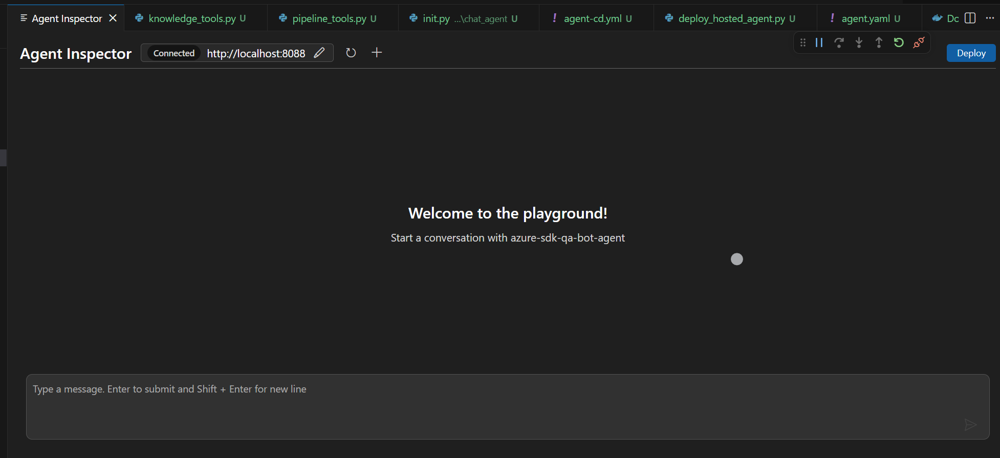

# Azure SDK Chat Agent

The Azure SDK Chat Agent helps developers with Azure SDK questions. It is built on the [Microsoft Agent Framework](https://learn.microsoft.com/agent-framework/overview/agent-framework-overview) with Azure AI Foundry. It leverages Azure AI Search for knowledge retrieval and Foundry Memory for conversation context.

> **Note:** This project is currently in draft / active development.

## Project Structure

```
azure-sdk-qa-bot-agent/
├── agents/          # Agent definition, instructions, and tool implementations
├── config/          # Configuration (Azure App Configuration integration)
├── services/        # Core business logic (chat, conversation, feedback)
├── utils/           # Azure service clients (AI Foundry, AI Search, Cosmos DB, Storage, Memory)
├── models/          # Data models
├── pipelines/       # CI/CD pipeline definitions
├── tests/           # Test files
├── server.py        # Backend API entrypoint (FastAPI)
└── TROUBLESHOOTING.md
```

The project has the following components:

| Component | Description | Entrypoint | Port |
|-----------|-------------|------------|------|
| **Chat Agent** | AI chat agent (Microsoft Agent Framework, Responses protocol) | `agents/chat_agent/init.py` | 8088 |
| **Chatbot Evolution Agent** | KB-quality analyst that diagnoses negative-feedback turns and files KB-gap GitHub issues | `agents/chatbot_evolution_agent/init.py` | 8088 |
| **Teams Collection Agent** | Channel-post and reply archive with scheduled Q&A summarization, deployed with a Foundry Routine and dedicated Logic App | `agents/teams_collection_agent/init.py` | 8088 |
| **Server** | Backend API that the Teams App communicates with (FastAPI) | `server.py` | 8089 |

> Hosted agents bind port `8088`. Run only one chat or evolution agent at a time locally. Teams collection uses the deployed workflow described below; it has no standalone local collection command.

## Getting Started

### Prerequisites

- Python 3.10 or higher
- Azure CLI installed and authenticated (`az login`)
- Azure subscription with access to:
  - Azure App Configuration
  - Azure AI Search
  - Azure Storage
  - Azure OpenAI / Azure AI Foundry
  - Microsoft Foundry Project

### Required Azure Roles

Ensure your Azure identity has:

- App Configuration Data Reader
- Storage Blob Data Contributor
- Azure AI User (on the Foundry Project)
- Cosmos DB Built-in Data Contributor

### Setup

1. Navigate to the project:

   ```bash
   cd tools/sdk-ai-bots/azure-sdk-qa-bot-agent
   ```

2. Create and activate a virtual environment:

   **Windows (PowerShell):**

   ```powershell
   python -m venv .venv
   .\.venv\Scripts\Activate.ps1
   ```

   **macOS/Linux:**

   ```bash
   python -m venv .venv
   source .venv/bin/activate
   ```

3. Install dependencies:

   ```bash
   pip install -r requirements-dev.txt
   ```

   This installs all production dependencies plus development tools (`debugpy`, `agent-dev-cli`). CI/CD pipelines and Docker images use `requirements.txt` (production only).

4. Create a `.env` file in the project root:

   ```dotenv
   AZURE_APPCONFIG_ENDPOINT=https://azuresdkqabot-dev-config.azconfig.io
   ```

   Optional variables:

   | Variable | Purpose | Default |
   |----------|---------|---------|
   | `GITHUB_TOKEN` | [GitHub PAT](https://github.com/settings/tokens) for local GitHub MCP tool testing. Without it, the agent uses GitHub App JWT via Key Vault (production only). | — |
   | `MEMORY_UPDATE_DELAY` | Seconds before processing memory updates. Set to `0` for immediate updates during development. | `300` |

5. Log in to Azure:

   ```bash
   az login  # select the Azure SDK Engineering System subscription
   ```

## Running and Debugging Locally

### Debugging the Chat Agent

Use this to develop and test the AI agent itself (prompt tuning, tool integration, etc.).

1. Install the [AI Toolkit](https://marketplace.visualstudio.com/items?itemName=ms-windows-ai-studio.windows-ai-studio) extension for VS Code.
2. Use this instruction to let your copilot set up local debugging with the AI Toolkit: `Help me configure the azure-sdk-qa-bot-agent/agents to work with AI Toolkit Agent Inspector. 1) Ensure the agent is serverized as an HTTP server. 2) Install 'agent-dev-cli' and use 'agentdev' to launch the agent. 3) Add VS Code configuration (tasks.json and launch.json) for debugging.`
3. Copilot will automatically generate the debug configuration (`.vscode/launch.json` and `.vscode/tasks.json`) for the project.
4. Press **F5** and select the agent to debug:
   - **Debug Chat Agent HTTP Server** launches `agents/chat_agent/init.py`.
   - **Debug Azure MCP Server Agent HTTP Server** launches `agents/azure_mcp_server_agent/init.py`.

This launches the agent via `agentdev run` on `http://localhost:8088/` with `debugpy` attached, and opens the AI Toolkit Agent Inspector for interactive testing.



### Debugging the Chatbot Evolution Agent

The Chatbot Evolution Agent is a hosted Foundry agent like the chat agent, but driven by the daily feedback-job scan (`scripts/run_feedback_jobs.py`), which runs it in-process via `services/chatbot_evolution_agent_service.py`, instead of by Teams. There are two things you may want to debug — the agent's reasoning, or the end-to-end scan→feedback flow.

**1. Iterate on the agent itself (Agent Inspector).**

Same AI Toolkit workflow as the chat agent, just pointed at the chatbot evolution agent entrypoint.

1. Install the [AI Toolkit](https://marketplace.visualstudio.com/items?itemName=ms-windows-ai-studio.windows-ai-studio) extension for VS Code.
2. Use this instruction to let your copilot set up local debugging with the AI Toolkit: `Help me configure the azure-sdk-qa-bot-agent/agents/chatbot_evolution_agent to work with AI Toolkit Agent Inspector. 1) Ensure the agent is serverized as an HTTP server. 2) Install 'agent-dev-cli' and use 'agentdev' to launch the agent. 3) Add VS Code configuration (tasks.json and launch.json) for debugging.`
3. Copilot will generate the debug configuration (`.vscode/launch.json` and `.vscode/tasks.json`) pointing at `agents/chatbot_evolution_agent/init.py`. If you already have the chat agent config, just swap the task command to:

   ```text
   ${command:python.interpreterPath} -m debugpy --listen 127.0.0.1:5679 -m agentdev run agents/chatbot_evolution_agent/init.py --verbose --port 8088
   ```

4. Press **F5** to start debugging, then use the Agent Inspector to send a JSON payload shaped like a `ChatbotEvolutionAgentInput`:

```json
{
  "mode": "analysis",
  "conversation_id": "<a real conversation id from Cosmos>",
  "conversation_type": "teams_channel",
  "evaluation_time": "2026-01-01T00:00:00+00:00",
}
```

The agent derives `tenant_id` from `fetch_conversation`, then calls
`fetch_chat_trace` / `search_knowledge_base` and may file a real GitHub issue — use a throwaway conversation when iterating.

**2. Debug the feedback loop end-to-end.**

`ChatbotEvolutionAgentService` runs the hosted chatbot evolution agent synchronously against the *deployed* Foundry agent. Its settings (`AI_FOUNDRY_CHATBOT_EVOLUTION_AGENT_NAME`, `AI_FOUNDRY_CHATBOT_EVOLUTION_AGENT_VERSION`, `CHATBOT_EVOLUTION_AGENT_ENABLED`, `AGENT_APPLICATIONINSIGHTS_RESOURCE_ID`) are read from Azure App Configuration and are already provisioned per environment — you do not need to set them locally.

To exercise the loop locally:

1. Run the daily scan against a small window: `python scripts/run_feedback_jobs.py --days 2` (ingests active threads and runs the hosted chatbot evolution agent in-process to analyze `ongoing` records and validate remediated failures). Use `--dry-run` to ingest records without invoking the agent. Set breakpoints in `services/chatbot_evolution_agent_service.py` to step through a run.
2. Inspect outcomes in:
   - **Script logs** — the service logs a bounded preview of the Agent's structured result.
   - **Cosmos `qa-records` container** — partitioned by `/tenant_id`; each thread row carries `qa_status` (`ongoing → finished | failed`) and an embedded `feedback.status` for Agent work (`created → running → pending_validation → done | failed`).
   - **Foundry tracing** — the hosted agent's tool calls are visible in the Foundry portal under the agent's run history.

### Debugging the Server

1. Add a launch configuration for the FastAPI server:

   ```json
   {
       "name": "Debug Backend Server",
       "type": "debugpy",
       "request": "launch",
       "module": "uvicorn",
       "args": ["server:app", "--host", "0.0.0.0", "--port", "8089"],
       "cwd": "${workspaceFolder}"
   }
   ```

2. Press **F5** to start debugging the server.
3. Install the [REST Client](https://marketplace.visualstudio.com/items?itemName=humao.rest-client) extension.
4. Run tests under `tests/api_test.rest` to verify the server is working.
5. Open `http://localhost:8089/dashboard/qa-records` to inspect QA and
   feedback lifecycle records. The dashboard supports tenant, status,
   updated-time, and conversation ID filters.

## Testing Remote Endpoints

The main endpoint for querying the bot is `/agent/chat`. See [tests/api_test.rest](https://github.com/Azure/azure-sdk-tools/blob/main/tools/sdk-ai-bots/azure-sdk-qa-bot-agent/tests/api_test.rest) for example requests.

### Remote Endpoints

| Environment | Resource Group | App Service Name |
|---|---|---|
| **Dev** | `azure-sdk-qa-bot-dev` | `azuresdkqabot-dev-server` |
| **Preview** | `azure-sdk-qa-bot-test` | `azuresdkqabot-test-server` |
| **Prod** | `azure-sdk-qa-bot` | `azuresdkqabot-server` |

To find the App Service in the Azure Portal:

1. Go to the [Azure Portal](https://portal.azure.com) and sign in with your Microsoft account.
2. Navigate to the **Azure SDK Engineering System** subscription.
3. Open the resource group for the target environment (see table above).
4. Select the App Service resource.
5. The endpoint URL is the **Default domain** field in the App Service overview.

### Access Tokens

```bash
# Dev
az account get-access-token --resource api://azure-sdk-qa-bot-dev

# Preview
az account get-access-token --resource api://azure-sdk-qa-bot-test

# Prod
az account get-access-token --resource api://azure-sdk-qa-bot
```

## Deployment

Hosted agents, the server, and Logic Apps are deployed separately. All CD pipelines are manually triggered and parameterized by environment. Teams collection requires the additional provisioning and activation steps below.

### Agent Deploy

Builds the agent container image, pushes to ACR, and deploys a new hosted agent version to Azure AI Foundry.

- **Pipeline**: [agent-cd.yml](https://github.com/Azure/azure-sdk-tools/blob/main/tools/sdk-ai-bots/azure-sdk-qa-bot-agent/pipelines/agent-cd.yml) | [Run in ADO](https://dev.azure.com/azure-sdk/internal/_build?definitionId=8159)
- **Deploy script**: [scripts/deploy_hosted_agent.py](https://github.com/Azure/azure-sdk-tools/blob/main/tools/sdk-ai-bots/azure-sdk-qa-bot-agent/scripts/deploy_hosted_agent.py)
- **Parameters**: `environment` (dev/prod), `agentName` (`chat_agent`, `azure_mcp_server_agent`, or `chatbot_evolution_agent`)
- **What it does**:
  1. Builds the Docker image from `agents/<agentName>/Dockerfile`
  2. Pushes to `azuresdkqabotcontainer.azurecr.io`
  3. Runs `deploy_hosted_agent.py` to create a new agent version via Foundry API

**Manual deploy** (from project root):

```bash
python scripts/deploy_hosted_agent.py chat_agent --tag <image-tag>
python scripts/deploy_hosted_agent.py chatbot_evolution_agent --tag <image-tag>
```

### Teams Collection Deployment

- **Pipelines**: [agent-cd.yml](pipelines/agent-cd.yml) with `agentName: teams_collection_agent`, then [logicapp-cd.yml](pipelines/logicapp-cd.yml) with `workflow: teams-collection`
- **Parameters**: `environment` (dev/test/prod)
- **Safety**: deploys the complete collection stack and leaves the summary Routine disabled

The stack exposes two independent operations, selected by a JSON request:

| Operation | Request | Writes | Trigger |
|-----------|---------|--------|---------|
| `backfill` | `{"operation":"backfill","channelId":"...","startTime":"..."}` | `conversation-messages`, one document per Teams message | Operator runs the `backfill` command, which calls the agent directly |
| `summarize` | `{"operation":"summarize"}` | `teams-qa-summaries`, one document per thread | Weekly Routine |

```text
backfill   operator -> agent Responses API -----> Teams Collection Hosted Agent
                                                     -> dedicated Logic App
                                                     -> existing Teams connector
                                                     -> conversation-messages
summarize  Foundry Routine ---------------------> Teams Collection Hosted Agent
                                                     -> conversation-messages
                                                     -> completion model
                                                     -> teams-qa-summaries
```

Only summarization is scheduled, because it is the recurring job. Backfill is a per-run import whose channel and cut-off change every time, so it has no Routine: the operator supplies them on the command line and the script posts the request to the hosted agent's Responses API. Both paths converge on the same agent, and either way the work runs in the cloud under the agent's own identity — there is no local collection command and no direct connector transport.

`backfill` imports history in exactly the shape the bot writes in real time, so imported posts and live posts are indistinguishable downstream. It never calls the completion model. `summarize` never calls the Teams Logic App; it reads the stored messages and produces the versioned Q&A result.

#### Prerequisites and Identity

- Use an existing Foundry project supporting hosted agents and Routines, ACR, App Configuration, and Cosmos account with database `azure-sdk-qa-bot`.
- Configure `AI_FOUNDRY_AGENT_COMPLETION_MODEL` for Q&A processing. The collector uses read-only public Web Search and URL fetching when a thread depends on linked context.
- Reuse a connected Teams API connection in the workflow's region. Its delegated Teams identity must be able to read every configured channel.
- The deployment service connection needs workflow/container deployment permissions, Cosmos `sqlRoleDefinitions/write` and `sqlRoleAssignments/write`, App Configuration data write permission, `Microsoft.Authorization/roleAssignments/write` on the configuration store, and Routine management access to the Foundry project. Running a backfill additionally requires permission to invoke the hosted agent's Responses API on that project; it is a separate, operator-run step and is not part of the pipeline.
- `collectorPrincipalId` is the object ID of the identity used by the **deployed collector** to acquire Azure tokens. Do not use the deployer's user ID, a client/application ID, or the Teams connector's delegated identity. The same runtime identity is allowed by the Logic App and granted Cosmos permissions.
- The `teams-collection` workflow of the Logic App pipeline grants the runtime identity **App Configuration Data Reader** on the selected configuration store. Retain the standard Foundry/ACR permissions required for hosted-agent deployment.

The [collection template](pipelines/teams-collection/template.json) provisions:

| Resource | Scope and behavior |
|----------|--------------------|
| Summary container | `azure-sdk-qa-bot/teams-qa-summaries`, partition key `/channel_id` |
| Dedicated Logic App | OAuth-only HTTP trigger, exact collector identity and channel allowlist; no recurrence trigger |
| Metadata reader role and assignment | Only `Microsoft.DocumentDB/databaseAccounts/readMetadata` at Cosmos account scope, required for SDK initialization |
| Data contributor assignments | Cosmos DB Built-in Data Contributor on `teams-qa-summaries` and on the existing `conversation-messages` container |

The `conversation-messages` container already exists and is owned by the bot; the template only grants access to it and never creates or reconfigures it. Role names/assignment IDs in the template are deterministic. Deploying it grants permissions to the supplied collector identity; it does not remove previous user grants or create/reauthorize the Teams connection. Metadata access does not grant access to other containers' documents. See [Cosmos metadata permissions](https://learn.microsoft.com/azure/cosmos-db/reference-data-plane-security#required-metadata).

#### Deploy and Configure

1. Review [config/teams_collection_config.json](config/teams_collection_config.json) for the target environment before building. It contains the Entra tenant, allowed team/channel IDs, per-channel `tenantKey` and `processingScope`, the processing rules version, an optional default `startTime`, and the summary Routine schedule. `startTime` must include a timezone; `null` backfills all available roots. `tenantKey` is the bot tenant the imported messages belong to and **must match the channel's entry in `bot-configs/channel.yaml`** (mirrored at [azure-sdk-qa-bot/config/channel.yaml](../azure-sdk-qa-bot/config/channel.yaml)) — a mismatch silently files history under the wrong tenant. Deployment fails fast if any channel omits it.
2. Collection has no pipeline of its own; it reuses the two shared ones, and the order matters because step 3 reads the principal ID that step 2 creates.

   1. Run [pipelines/agent-cd.yml](pipelines/agent-cd.yml) with `agentName: teams_collection_agent` to build and deploy `azure-sdk-teams-collection-agent`.
   2. Run [pipelines/logicapp-cd.yml](pipelines/logicapp-cd.yml) with `workflow: teams-collection`. It reads the hosted agent's instance principal ID, then:
      1. Deploys the dedicated Logic App, summary container, and Cosmos roles from [pipelines/teams-collection/template.json](pipelines/teams-collection/template.json).
      2. Grants the agent App Configuration Data Reader.
      3. Writes the SAS-free `TEAMS_COLLECTION_LOGIC_APP_URL` to the environment's `AZURE_APPCONFIG_ENDPOINT`.
      4. Creates or updates the Foundry summary Routine in the disabled state.

   Running step 2 before the agent exists fails fast rather than deploying a workflow no identity can call. The `team` parameter applies to the `chat` workflow only; `teams-collection` is defined for `azure_sdk` and rejects any other value. The Teams API connection is an existing delegated connection and is not created or reauthorized by these pipelines. The `teams-collection` workflow does not use or modify [pipelines/logicapp/template.json](pipelines/logicapp/template.json), which belongs to the message-mirroring Logic Apps deployed by the same pipeline's `chat` workflow.

3. For a manual equivalent after deploying the hosted agent, run:

    ```powershell
    python scripts/deploy_teams_collection.py deploy `
      --environment dev `
      --resource-group azure-sdk-qa-bot-dev `
      --appconfig-endpoint https://azuresdkqabot-dev-config.azconfig.io
    ```

4. Manually dispatch the disabled summary Routine for verification:

    ```powershell
    python scripts/deploy_teams_collection.py routine-dispatch `
      --project-endpoint $projectEndpoint
    ```

#### Backfill a Channel

Backfill is a deliberate, operator-driven import with no schedule behind it. One command sends the request straight to the hosted agent:

```powershell
python scripts/deploy_teams_collection.py backfill `
  --project-endpoint $projectEndpoint `
  --channel "19:f6d52ac6465c40ea80dc86b8be3825aa@thread.skype" `
  --start-time "2026-01-01T00:00:00Z"
```

`--channel` must be in the configured allowlist. Omit `--channel` to backfill every configured channel and `--start-time` to use each channel's configured `startTime`. Both flags are rejected on any other command.

The agent accepts the request and runs the import in the background, so the command returns a `responseId` and `status` immediately rather than the import counters. Poll it with:

```powershell
python scripts/deploy_teams_collection.py backfill-status `
  --project-endpoint $projectEndpoint `
  --response-id "resp_..."
```

Once `status` reaches `completed`, the same output carries the `result` counters. The agent rejects two concurrent runs, so wait for one import to finish before starting the next.

Backfill is safe to repeat. For every Teams message it either creates the document, leaves it untouched when the content already matches, or updates only `content` when the message was edited in Teams. It never deletes, never rewrites bot replies, and never clears bot-owned fields such as `should_reply`. A message changed by another writer mid-run is skipped and picked up on the next run.

#### Verify and Enable

Acceptance only means the background request was queued. The operations write no run records, so verify the data itself. The counters (`messagesCreated`/`messagesUpdated`/`messagesUnchanged`/`messagesSkipped` for backfill, `threadsSummarized`/`threadsUnchanged`/`threadsRefreshed`/`threadsExcluded`/`threadsSkipped` for summarize) are reported by `backfill-status` for an import and by the Routine dispatch record for summarization, and `channelsCompleted` must match the number of channels targeted.

In Cosmos Data Explorer, confirm backfilled messages landed in `azure-sdk-qa-bot/conversation-messages` alongside live traffic:

```sql
SELECT TOP 5 c.id, c.sender_role, c.created_at, c.conversation_partition
FROM c WHERE c.conversation_type = "teams_channel"
  AND STARTSWITH(c.conversation_partition, "teams_channel:<channelId>;")
ORDER BY c.created_at DESC
```

A thread is one partition: `teams_channel:<channelId>;messageid=<rootId>`, holding the root post and every reply as separate documents. Forwarded attachments are expanded and the post title is prefixed as `title: ...` exactly as the real-time workflow does, so re-running backfill on unchanged content reports `messagesUnchanged` rather than rewriting documents.

Then check summaries in `azure-sdk-qa-bot/teams-qa-summaries`:

```sql
SELECT TOP 5 c.id, c.qa.title, c.message_count, c.processor_version
FROM c WHERE c.channel_id = "<channelId>"
```

Expect far fewer summaries than threads. Only a thread that yields reusable Q&A is stored, so one rejected as out of scope, unresolved, or answered by nobody but the bot leaves no document behind, and a thread that later stops qualifying has its earlier answer removed. Every document here is an answer, which is why none of them carry a status field or a null `qa`. The tradeoff is that the freshness gate lives in the stored summary: a rejected thread has no record to compare against and is offered to the model again on every run.

`/channel_id` is the partition key, so adding a date window to that filter stays a single-partition query. Use `thread_started_at` for when the question was asked and `last_message_at` for when the thread last moved:

```sql
SELECT c.id, c.qa.title, c.thread_started_at, c.last_message_at
FROM c WHERE c.channel_id = "<channelId>"
  AND c.thread_started_at >= "2026-09-01T00:00:00.000000Z"
  AND c.thread_started_at <  "2026-10-01T00:00:00.000000Z"
ORDER BY c.thread_started_at DESC
```

Cosmos compares these as strings, so every timestamp written to this container is normalized to `YYYY-MM-DDTHH:MM:SS.ffffffZ` and boundaries should be written the same way. That normalization matters because `conversation-messages` stores whatever the bot serialized, where a message landing exactly on a whole second has no fractional part at all; `Z` sorts after `.`, so inheriting that spelling would drop those threads out of a range filter. `last_write_ts` is an integer epoch and can be compared numerically instead.

Each summary holds the inclusion decision, the Q&A result, any resource-enrichment status, and the gate fields (`message_count`, `last_write_ts`, `source_content_hash`) used to decide whether re-running the model is necessary. Summaries only rerun the model when a thread's content actually changed or the processor version moved; unrelated writes such as the bot backfilling `should_reply` refresh the gate without spending a model call. Linked public resources can be retrieved for self-contained answers; authentication-protected resources are recorded as unavailable rather than guessed. Threads with no root post are skipped.

If nothing is written at all, check Hosted Agent startup/initialization and its App Configuration/Cosmos permissions; initialization can fail before any work begins. For a failed backfill, also inspect the dedicated Logic App's run history. Request/response content is secured there.

Only after cloud verification succeeds, enable the weekly summary schedule:

```powershell
python scripts/deploy_teams_collection.py routine-enable `
  --project-endpoint $projectEndpoint
```

The default schedule is weekly at 00:00 UTC on Sunday. Use `routine-disable` to pause future dispatches; it does not cancel an active run. Channel and processing configuration are baked into the image: changing them requires redeploying the Hosted Agent, while channel ID changes also require updating the Logic App allowlist. Keep the Routine disabled until both changes are ready. Both operations are safe to re-run after a failure: completed writes are recognized and skipped instead of duplicated.

### Server Deploy

Builds the backend API (FastAPI) container image and deploys to Azure App Service.

- **Pipeline**: [server-cd.yml](https://github.com/Azure/azure-sdk-tools/blob/main/tools/sdk-ai-bots/azure-sdk-qa-bot-agent/pipelines/server-cd.yml) | [Run in ADO](https://dev.azure.com/azure-sdk/internal/_build?definitionId=8128)
- **Parameters**: `environment` (dev/preview/prod), `slot` (default/agent)
- **What it does**:
  1. Resolves image tag from `_version.py` (prod) or git short SHA (dev)
  2. Builds and pushes image to ACR via `az acr build`
  3. Deploys to App Service using container image reference

### Logic App Deploy

Deploys the Logic App ARM template for Teams channel message mirroring.

- **Pipeline**: [logicapp-cd.yml](https://github.com/Azure/azure-sdk-tools/blob/main/tools/sdk-ai-bots/azure-sdk-qa-bot-agent/pipelines/logicapp-cd.yml) | [Run in ADO](https://dev.azure.com/azure-sdk/internal/_build?definitionId=8177)
- **Parameters**: `team` (azure_sdk/azure_mcp_server), `environment` (dev/test/prod)
- **What it does**:
   1. Runs `az deployment group create` with environment-specific ARM template parameters
   2. Idempotent — safe to re-run

### CI Pipeline

Runs linting (pyright) and unit tests on PRs that touch the bot agent code.

- **Pipeline**: [server-ci.yml](https://github.com/Azure/azure-sdk-tools/blob/main/tools/sdk-ai-bots/azure-sdk-qa-bot-agent/pipelines/server-ci.yml) | [View in ADO](https://dev.azure.com/azure-sdk/internal/_build?definitionId=8156)
- **Triggers**: PRs to `main` touching `tools/sdk-ai-bots/azure-sdk-qa-bot-agent`

## Troubleshooting

For incident response, agent tracing, and server log analysis, see [TROUBLESHOOTING.md](https://github.com/Azure/azure-sdk-tools/blob/main/tools/sdk-ai-bots/azure-sdk-qa-bot-agent/TROUBLESHOOTING.md).

## Contributing

1. Fork the repository
2. Create your feature branch (`git checkout -b feature/amazing-feature`)
3. Commit your changes (`git commit -m 'Add some amazing feature'`)
4. Push to the branch (`git push origin feature/amazing-feature`)
5. Open a Pull Request
