# Troubleshooting Guide

This guide consolidates troubleshooting for the **backend server** and **chat agent**.

## Table of Contents

- [1. Quick Triage](#1-quick-triage)
- [2. Environments and Resources](#2-environments-and-resources)
- [3. Common Incidents](#3-common-incidents)
	- [3.1 Bot Not Responding in Teams](#31-bot-not-responding-in-teams)
	- [3.2 Bot Responds "Unable to establish a connection to the AI service"](#32-bot-responds-unable-to-establish-a-connection-to-the-ai-service)
	- [3.3 Bot Response Quality Is Poor](#33-bot-response-quality-is-poor)
- [4. How to Trace Server Requests](#4-how-to-trace-server-requests)

## 1. Quick Triage

When an incident happens, use this order:

1. Check whether Logic App is triggering from Teams.
2. If triggered, confirm frontend request reached server.
3. If server responds with failure, trace by request ID in logs.
4. If answer quality or reasoning is wrong, trace in Foundry using Trace ID.
5. If there is broad instability, disable Logic App auto-reply temporarily.

## 2. Environments and Resources

### Teams and App Services

| Environment | Server App Service | Frontend App Service | Logic App (Auto Reply) | Teams Channel |
|---|---|---|---|---|
| **Dev** | [azuresdkqabot-dev-server](https://ms.portal.azure.com/#@microsoft.onmicrosoft.com/resource/subscriptions/a18897a6-7e44-457d-9260-f2854c0aca42/resourceGroups/azure-sdk-qa-bot-dev/providers/Microsoft.Web/sites/azuresdkqabot-dev-server/appServices) | [azsdkqabotdev](https://ms.portal.azure.com/#@microsoft.onmicrosoft.com/resource/subscriptions/a18897a6-7e44-457d-9260-f2854c0aca42/resourceGroups/azure-sdk-qa-bot-dev/providers/Microsoft.Web/sites/azsdkqabotdev/appServices) | [azuresdkqabot-dev-logicapp](https://ms.portal.azure.com/#@microsoft.onmicrosoft.com/resource/subscriptions/a18897a6-7e44-457d-9260-f2854c0aca42/resourceGroups/azure-sdk-qa-bot-dev/providers/Microsoft.Logic/workflows/azuresdkqabot-dev-logicapp/logicApp) | [Azure SDK QA Bot](https://teams.microsoft.com/l/team/19%3A3iefzURPmxhDZJJTtwePbdO1EdI5T0hfK9UFK_59Sbk1%40thread.tacv2/conversations?groupId=7ccc31f0-b371-450b-a73c-48f5a31a9b96&tenantId=72f988bf-86f1-41af-91ab-2d7cd011db47) |
| **Preview** | [azuresdkqabot-test-server](https://ms.portal.azure.com/#@microsoft.onmicrosoft.com/resource/subscriptions/a18897a6-7e44-457d-9260-f2854c0aca42/resourceGroups/azure-sdk-qa-bot-test/providers/Microsoft.Web/sites/azuresdkqabot-test-server/appServices) | [azsdkqabottest](https://ms.portal.azure.com/#@microsoft.onmicrosoft.com/resource/subscriptions/a18897a6-7e44-457d-9260-f2854c0aca42/resourceGroups/azure-sdk-qa-bot-test/providers/Microsoft.Web/sites/azsdkqabottest/appServices) | [azuresdkqabot-test-logicapp](https://ms.portal.azure.com/#@microsoft.onmicrosoft.com/resource/subscriptions/a18897a6-7e44-457d-9260-f2854c0aca42/resourceGroups/azure-sdk-qa-bot-test/providers/Microsoft.Logic/workflows/azuresdkqabot-test-logicapp/logicApp) | [Azure SDK Q&A Bot Testing](https://teams.microsoft.com/l/team/19%3ArMhMrxg7UjfwZmVoSeVvWvNQIfT_G6ds8napsytWqzw1%40thread.tacv2/conversations?groupId=39910aef-85da-4e30-b5e3-35f04ef38648&tenantId=72f988bf-86f1-41af-91ab-2d7cd011db47) |
| **Production** | [azuresdkqabot-server](https://ms.portal.azure.com/#@microsoft.onmicrosoft.com/resource/subscriptions/a18897a6-7e44-457d-9260-f2854c0aca42/resourceGroups/azure-sdk-qa-bot/providers/Microsoft.Web/sites/azuresdkqabot-server/appServices) | [azsdkqabot](https://ms.portal.azure.com/#@microsoft.onmicrosoft.com/resource/subscriptions/a18897a6-7e44-457d-9260-f2854c0aca42/resourceGroups/azure-sdk-qa-bot/providers/Microsoft.Web/sites/azsdkqabot/appServices) | [azuresdkqabot-logicapp](https://ms.portal.azure.com/#@microsoft.onmicrosoft.com/resource/subscriptions/a18897a6-7e44-457d-9260-f2854c0aca42/resourceGroups/azure-sdk-qa-bot/providers/Microsoft.Logic/workflows/azuresdkqabot-logicapp/logicApp) | [Azure SDK](https://teams.microsoft.com/l/team/19%3Af6d52ac6465c40ea80dc86b8be3825aa%40thread.skype/conversations?groupId=3e17dcb0-4257-4a30-b843-77f47f1d4121&tenantId=72f988bf-86f1-41af-91ab-2d7cd011db47) |

### Agent Tracing Resources

| Environment | Foundry Agent Playground | Application Insights |
|---|---|---|
| **Dev** | [Foundry Agent Playground](https://ai.azure.com/nextgen/r/oYiXpn5ERX2SYPKFTArKQg,azure-sdk-qa-bot-dev,,azuresdkqabot-dev-ai-resource,azuresdkqabot-ai/build/agents/azure-sdk-chat-agent/build) | [azuresdkqabot-dev-agent](https://ms.portal.azure.com/#@microsoft.onmicrosoft.com/resource/subscriptions/a18897a6-7e44-457d-9260-f2854c0aca42/resourceGroups/azure-sdk-qa-bot-dev/providers/Microsoft.Insights/components/azuresdkqabot-dev-agent/overview) |
| **Test and Prod** | [Foundry Agent Playground](https://ai.azure.com/nextgen/r/oYiXpn5ERX2SYPKFTArKQg,azure-sdk-qa-bot,,azuresdkqabot-ai-resource,azuresdkqabot-ai/build/agents/azure-sdk-chat-agent/build) | [azuresdkqabot-agent](https://ms.portal.azure.com/#@microsoft.onmicrosoft.com/resource/subscriptions/a18897a6-7e44-457d-9260-f2854c0aca42/resourceGroups/azure-sdk-qa-bot/providers/Microsoft.Insights/components/azuresdkqabot-agent/overview) |

## 3. Common Incidents

### 3.1 Bot Not Responding in Teams

#### Step 1: Check Logic App Run History

1. Open the Logic App for the affected environment.
2. Go to **Development Tools** > **Run history**.
3. Find the run matching the message timestamp in Teams.

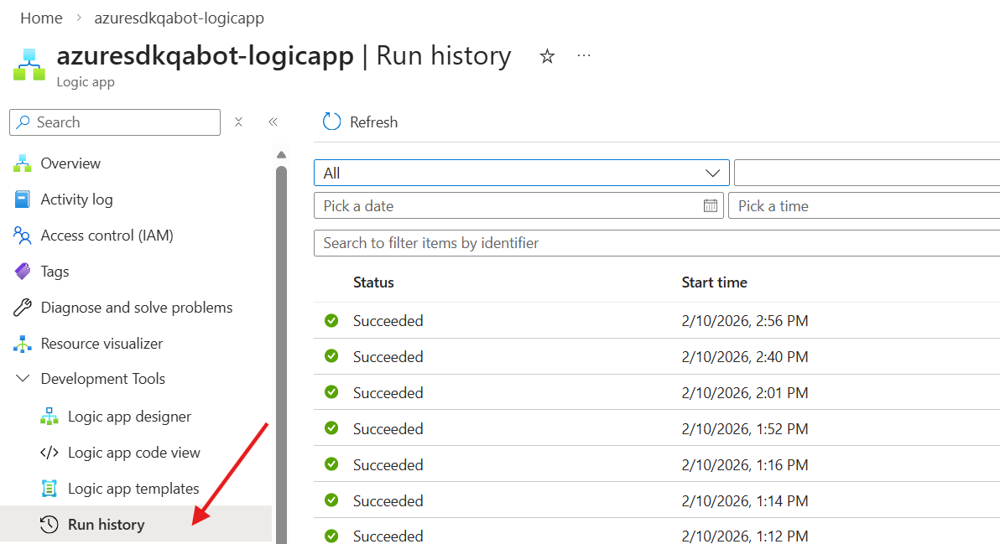

#### Step 2: If No Run Exists, Fix Teams Connection

If no run is created, Logic App is not receiving Teams events. Most common cause: expired/invalid Teams connector identity.

1. Open **Development Tools** > **Logic App Designer**.
2. Select **When a new message is added to a chat or channel**.
3. If configuration fails to load, go to **Connections** > **Reassign** > **Add new**.
4. Re-authenticate with your account and confirm configuration loads.
5. Wait for the next Teams message and verify trigger fires.

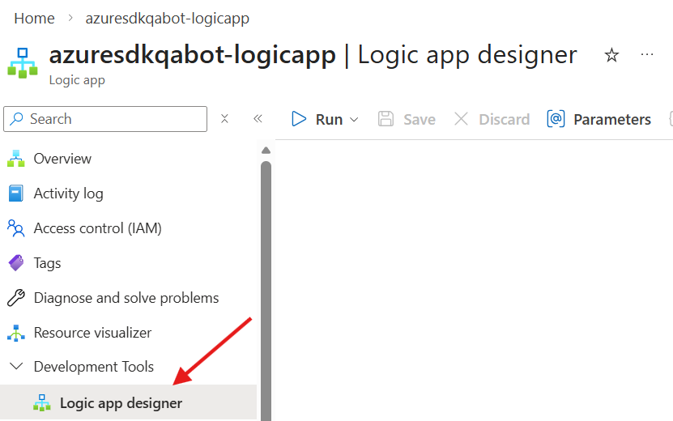
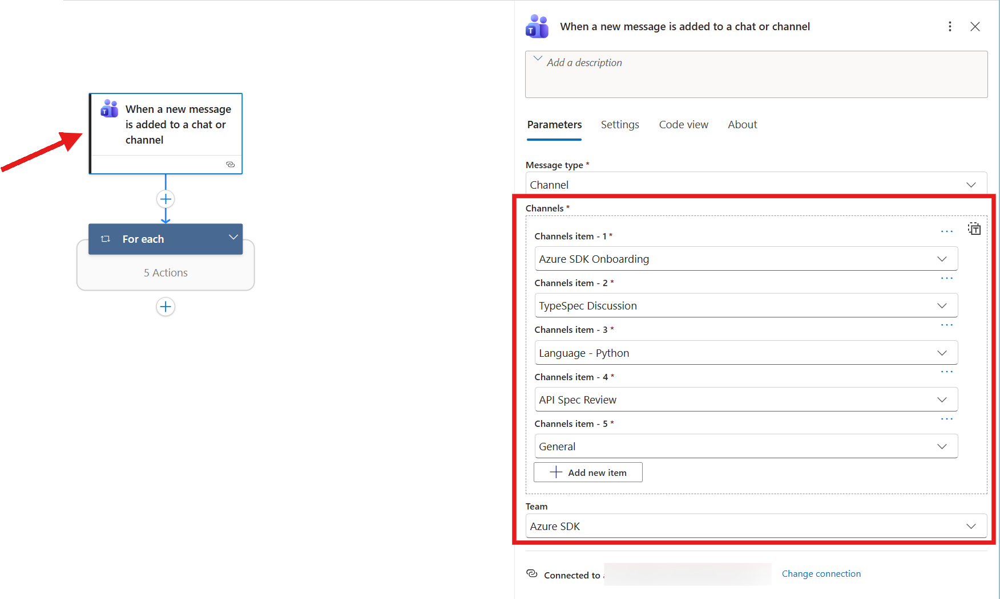
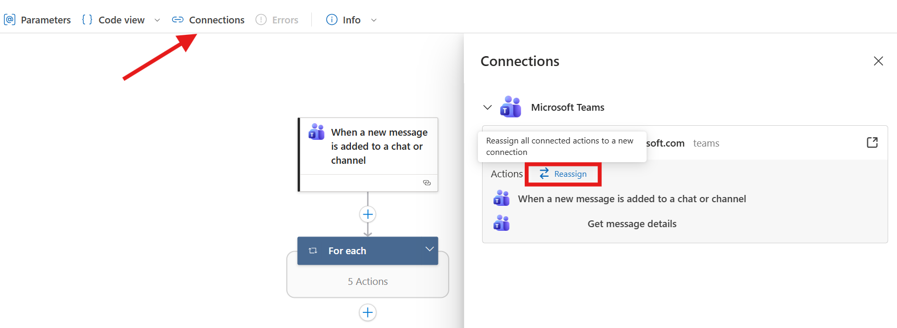
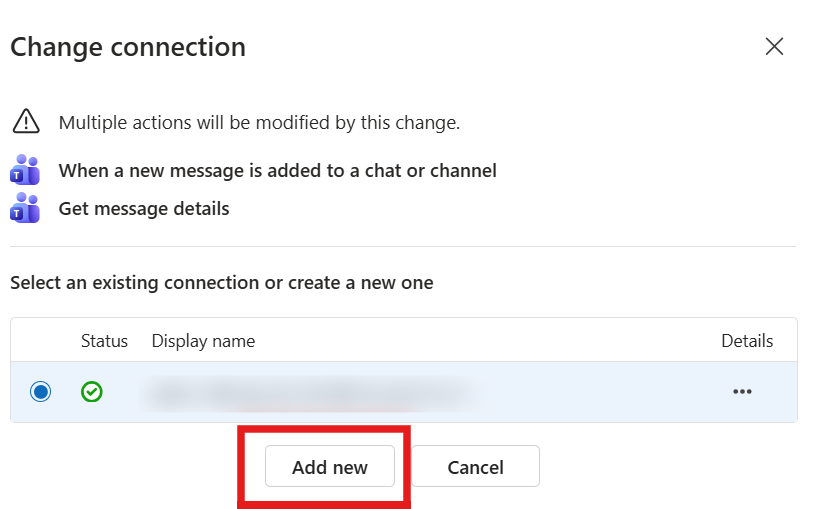

#### Step 3: If Run Failed, Inspect Failure Node

Open the failed run and expand each action.

- If failure is timeout at **Invoke QA Bot**:

```text
BadRequest
HTTP request failed: the server did not respond within the timeout limit.
Please see logic app limits at https://aka.ms/logic-apps-limits-and-config#http-limits.
```

This often means response is slow; the bot may still reply in channel.

- For other failures:
1. Check frontend logs for the specific request. Refer to [Frontend troubleshooting](https://github.com/Azure/azure-sdk-tools/blob/main/tools/sdk-ai-bots/azure-sdk-qa-bot/README.md#troubleshooting-through-app-service-logs).
2. If frontend shows `Failed to fetch data from RAG backend`, continue with server logs in [Section 4](#4-how-to-trace-server-requests).

### 3.2 Bot Responds "Unable to establish a connection to the AI service"

Symptoms:

- Bot reply contains: `Unable to establish a connection to the AI service at this time`
- Azure alert on server availability

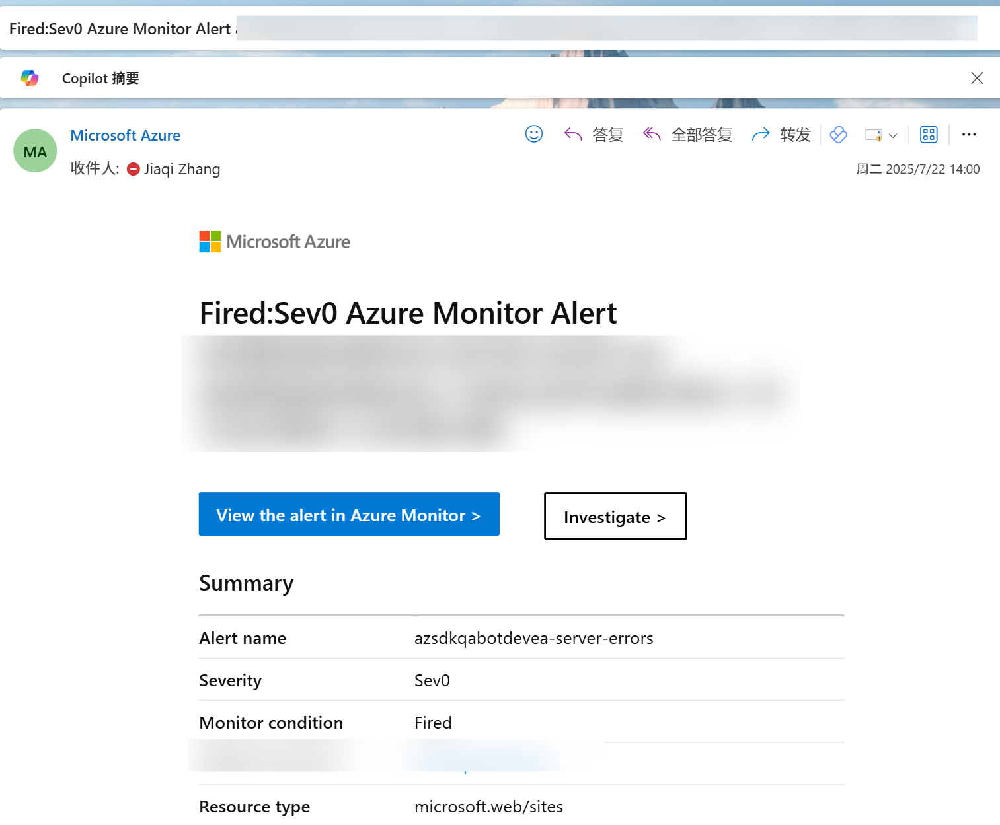

#### Step 1: Disable Auto Reply Temporarily

1. Open the environment Logic App.
2. Click **Disable** to stop noisy failures while triaging.

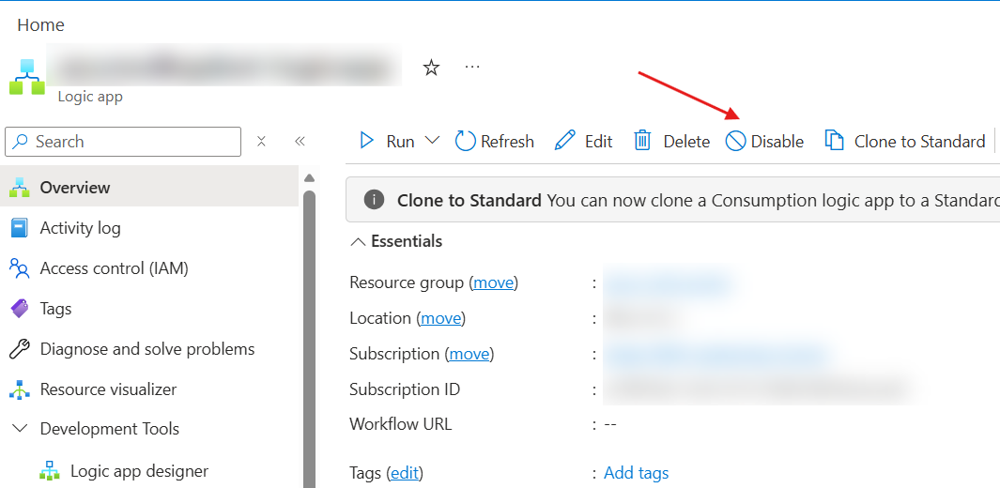

#### Step 2: Validate Failed Runs

1. Open **Run history**.
2. Inspect failed entries and error payloads.

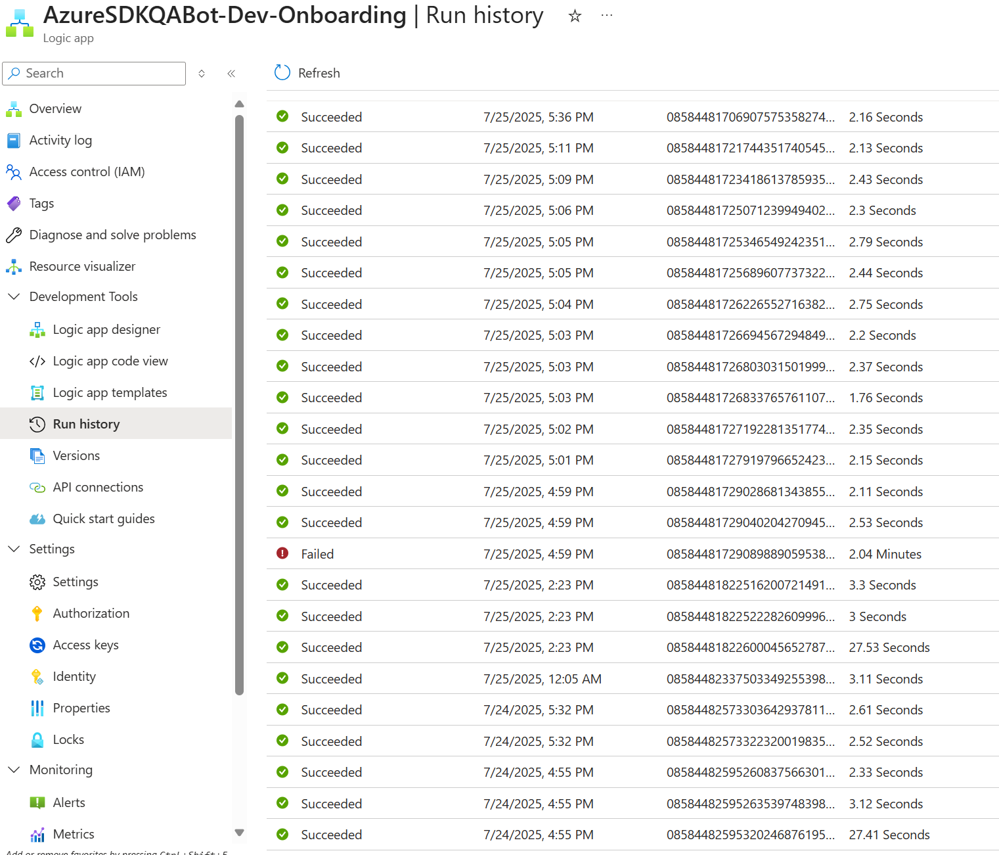
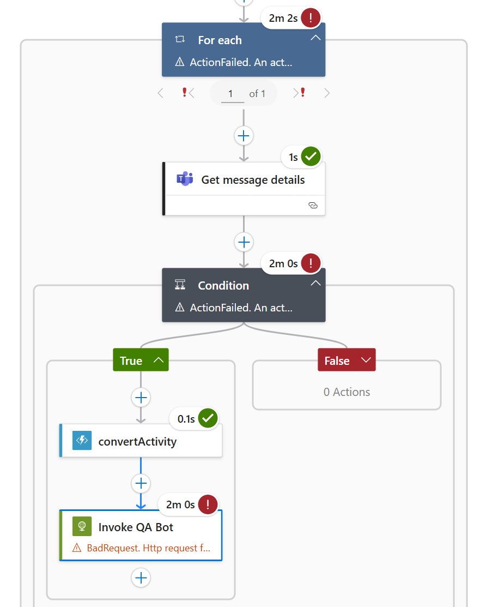

#### Step 3: Frontend to Server Correlation

Query frontend logs to identify the conversation/request:

```kql
AppServiceConsoleLogs
| where ResultDescription contains "Our service was recently assigned"
```

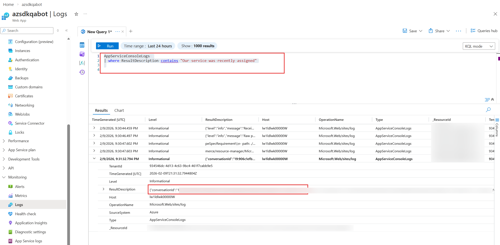

Then filter by conversation id:

```kql
AppServiceConsoleLogs
| where ResultDescription contains "conversation id"
```

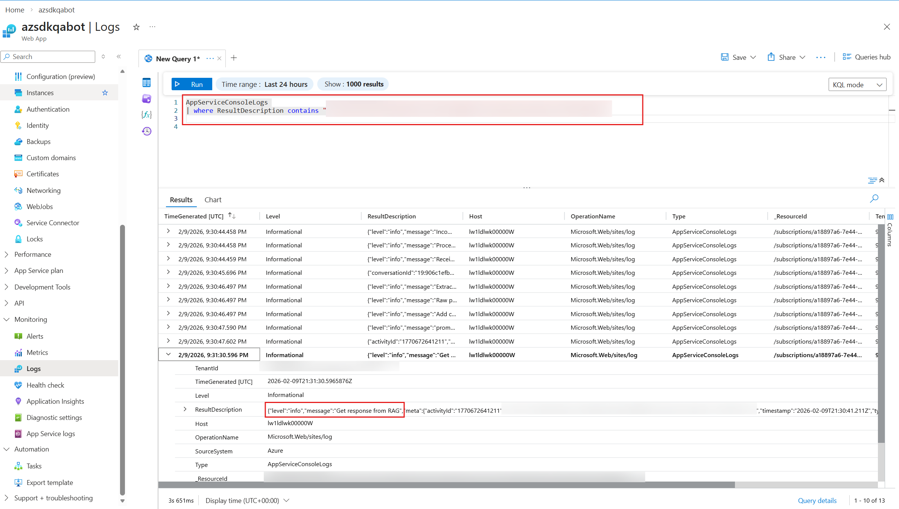

If frontend indicates backend fetch failure, continue with [Section 4](#4-how-to-trace-server-requests).

#### Step 4: Check Server App Service Health

1. Open server App Service **Log stream**.
2. If no logs at all (including health probes), service may be down.
3. Redeploy server pipeline and test endpoint.
4. If logs exist but request fails, proceed with request-level tracing in [Section 4](#4-how-to-trace-server-requests).

#### Step 5: Re-enable Auto Reply

After confirming healthy responses, enable the Logic App again.

### 3.3 Bot Response Quality Is Poor

When the bot replies but the answer is irrelevant, incomplete, or incorrect, trace the agent's reasoning to find the root cause.

#### Step 1: Get the Trace ID

Hover over the **Internal Tracking** on the bot's reply in Teams. The tooltip shows the **Trace ID**.

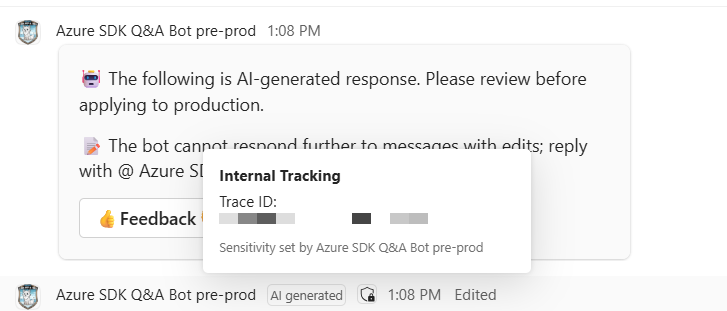

#### Step 2: Open the Trace in Foundry

1. Open the **Foundry Agent Playground** for the environment (see [Agent Tracing Resources](#agent-tracing-resources)).
2. Go to the **Traces** tab.
3. Paste the Trace ID into the search box. This shows the matching conversation with duration, token usage, and status.


#### Step 3: Review the Span Tree

Click the Trace ID link to open the trace detail view. The span tree shows:

- Which **tools** the agent called (search, GitHub MCP, etc.) and in what order
- Whether any tool **failed or returned empty**
- The **retrieved context** passed to the model
- The model's **completion** and token counts


**What to look for:**

| Symptom | Likely Cause |
|---|---|
| Search tool returned irrelevant or empty results | Knowledge base gap, vague query, or index issue |
| Search tool returned good context but answer is wrong | Prompt issue or model hallucination |
| Tool call failed or timed out | Downstream service outage |
| Wrong tool selected or tool not called at all | Agent routing / intent issue |

#### Step 4: Check Detailed Logs in Application Insights

For full logs, copy the Trace ID and query in Application Insights **Search** tab (see [Agent Tracing Resources](#agent-tracing-resources)).


Click the trace to see all log records — credential acquisition, session loading, conversation retrieval, tool calls, and custom messages — in chronological order.

Use **View timeline** to see the span timeline, which mirrors the Foundry span tree and highlights latency by component.


#### Step 5: Determine Next Action

- **Knowledge gap**: Add or update documents in the knowledge base.
- **Prompt issue**: Adjust agent instructions in `agents/chat_agent/`.
- **Model behavior**: Check model version and consider testing with a different deployment.
- **Tool failure**: Investigate the specific tool's service health.

---

## 4. How to Trace Server Requests

Use this workflow for server endpoint failures and backend data retrieval issues.

### Step 1: Access Logs

1. Open server App Service in Azure Portal.
2. Use **Log stream** (live). 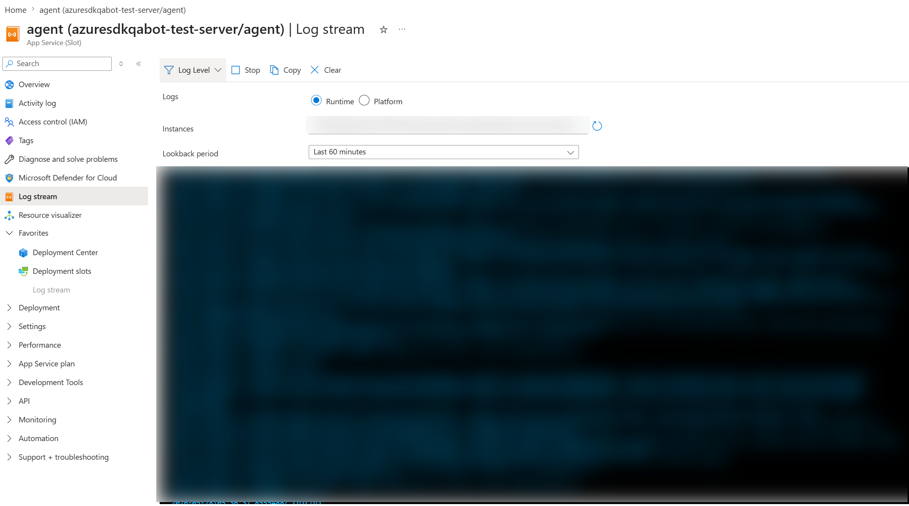 or **Monitoring** > **Logs** (historical) 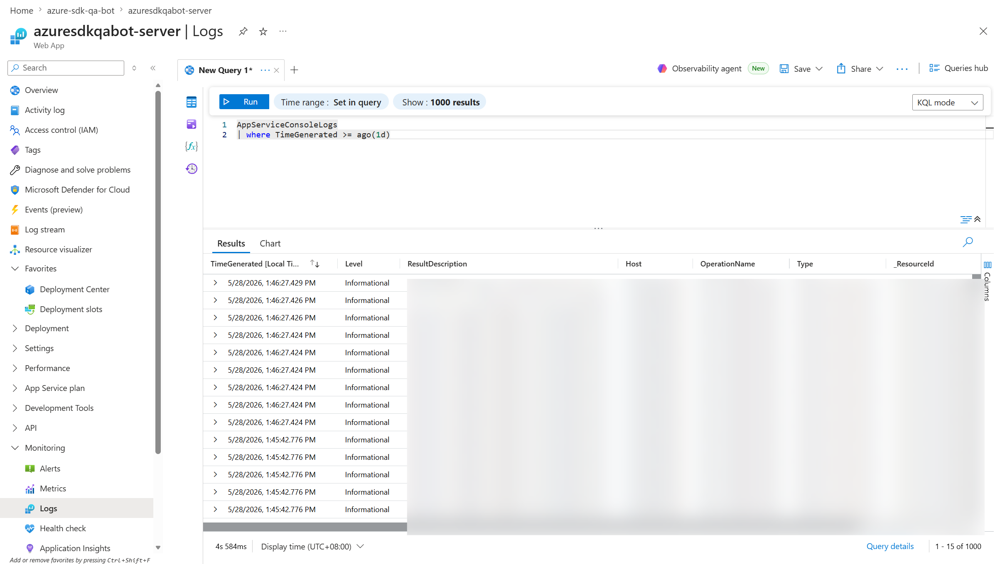

### Step 2: Trace a Request End-to-End

#### 2.1 Set Time Window

Start with 15-30 minutes around incident time (consider timezone offset).

#### 2.2 Locate Initial Request

```kql
AppServiceConsoleLogs
| where ResultDescription contains "your question"
```

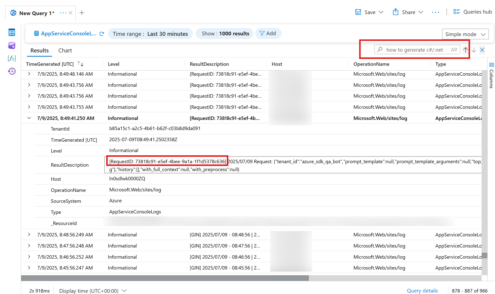

#### 2.3 Extract Request ID

Find:

```text
[RequestID: xxxxxxxx-xxxx-xxxx-xxxx-xxxxxxxxxxxx]
```

#### 2.4 Query Full Request Flow

```kql
AppServiceConsoleLogs
| where ResultDescription contains "RequestID: xxx"
```

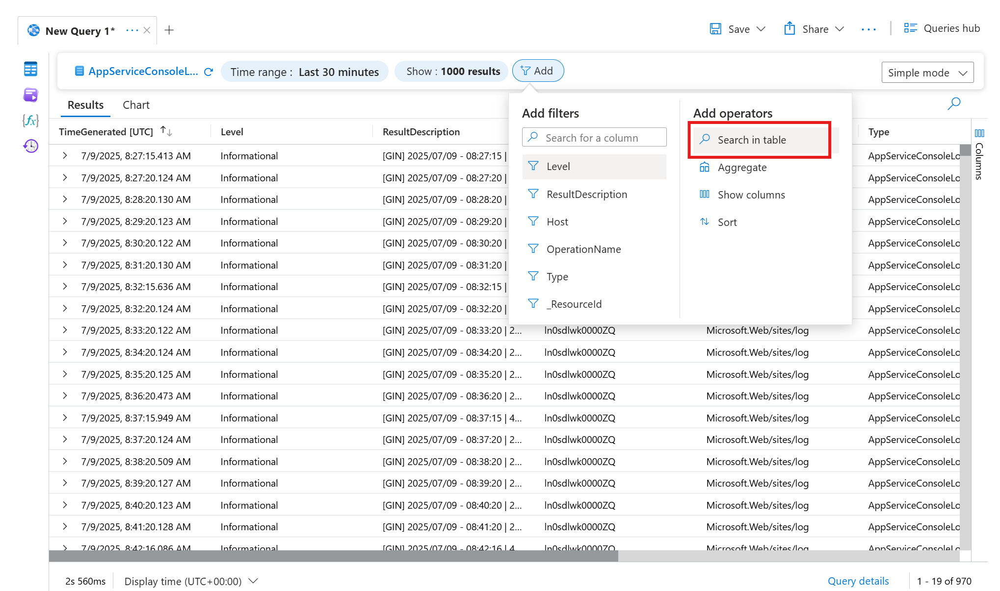
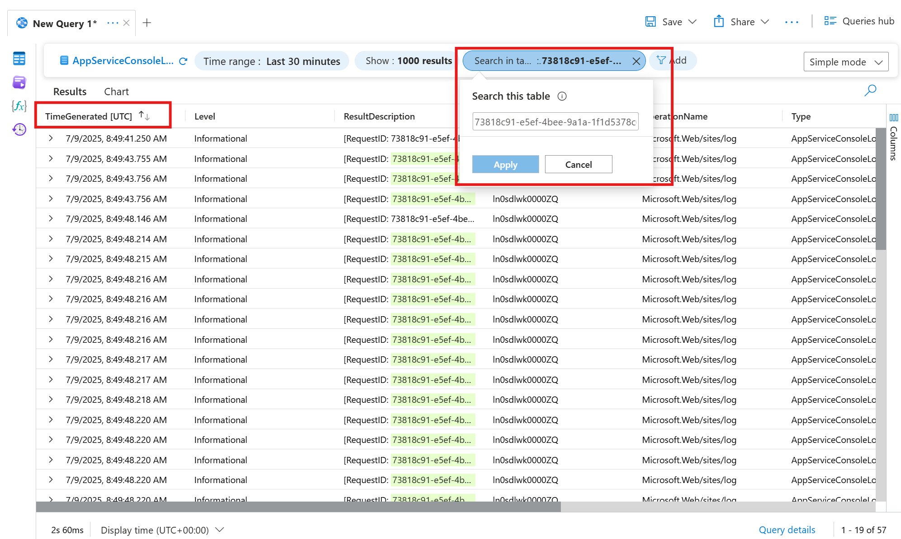
