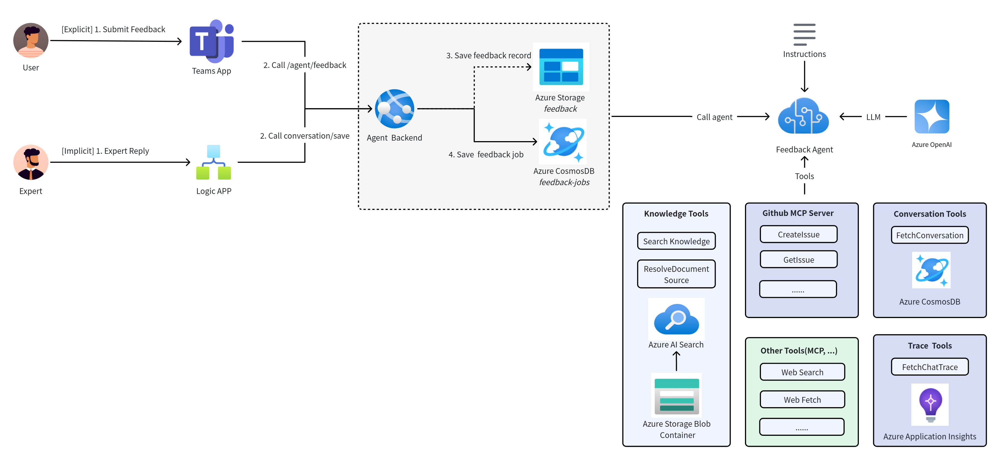
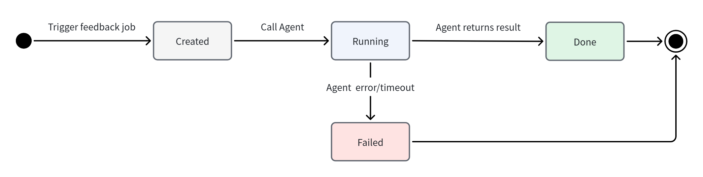

# Chatbot Evolution Agent Design

## 1 Background

When the chatbot's answer is wrong, today there is no systematic way to understand what the correct answer is, identify whether the underlying knowledge base (KB) is missing or stale, or close the gap so future similar queries are answered correctly. All follow-up is done manually by vendors investigating explicit thumbs-down feedback. The much more common implicit failure mode: an expert had to step in and answer — is never captured.

We are introducing a **Chatbot Evolution Agent** — a new hosted agent in the Foundry project. It automatically analyzes wrong answers, classifies the root cause, and files KB-gap issues against the source-of-truth docs repo. Rather than firing in real time off an endpoint, the agent is driven by a **daily batch scan** (see §2.3): the Bot Answer Evaluator judges each concluded QA thread, and any thread whose bot answer was wrong or unconfirmed is handed to the agent. Two human signals in the thread inform that judgement and the agent's analysis:

| Signal | Source | Description |
| --- | --- | --- |
| **Explicit** | User feedback card (`reaction == bad`) | User clicked thumbs-down on a bot answer; captured in the thread and surfaced by `fetch_conversation`. |
| **Implicit** | Expert reply in the thread | A human expert (non-author, non-bot) replies in a thread the bot has already answered — a strong implicit "the bot didn't fully solve it." |

## 2 Design

### 2.1 Architecture



### 2.2 Agent Design

The Chatbot Evolution Agent is built on the `agent_framework` library and deployed as a Foundry hosted agent alongside the Chat Agent.

| Component | Purpose |
| --- | --- |
| **Instruction** | System prompt that tells the agent how to act as a feedback analyst: what the root-cause categories are, to back up its findings with evidence, and how to file KB-gap issues. |
| **Tools** | `fetch_chat_trace`, `fetch_conversation`, `search_knowledge_base` (reused), `web_fetch` (reused), `resolve_kb_source`, GitHub MCP. |

#### 2.2.1 Tools

| Tool | File | Type | Description |
| --- | --- | --- | --- |
| `fetch_chat_trace` | `tools/monitor_tools.py` (new) | `FunctionTool` | Fetches the Chat Agent's App Insights trace by `trace_id` and returns the trace details: ordered tool calls (name, args summary, results summary, duration), retrieved chunks, final answer, prompt. |
| `fetch_conversation` | `tools/conversation_tools.py` (new) | `FunctionTool` | Returns the full thread transcript for the conversation under analysis (Cosmos `conversation-messages`); each bot message includes its `trace_id`. |
| `search_knowledge_base` | `tools/knowledge_tools.py` | `FunctionTool` | Re-runs targeted KB searches to confirm what is/isn't indexed today. Reused unchanged from the Chat Agent. |
| `web_fetch` | `tools/web_tools.py` | `FunctionTool` | Fetches the source-of-truth doc URL to detect drift between KB content and upstream docs. Reused unchanged from the Chat Agent. |
| `resolve_kb_source` | `tools/knowledge_tools.py` (extend) | `FunctionTool` | Maps the chunk's `source` folder to `{owner, repo, branch, path, labels}` by looking up `knowledge-config.json` from the `azure-sdk-qa-bot-knowledge-sync` project. |
| `create_issue` | `tools/github_mcp_tools.py` | MCP Server | The existing GitHub MCP tool|

#### 2.2.2 Issue Classification

The agent classifies each case into exactly one root cause and acts accordingly:

| Classification | Description | Category | Issue Repo |
| --- | --- | --- | --- |
| `missing_content` | No KB chunk covers the user's intent. | KB issue | `Azure/azure-sdk-pr` (cite KB source) |
| `outdated_content` | KB has stale information vs. the source URL. | KB issue | `Azure/azure-sdk-pr` (cite KB source) |
| `retrieval_mismatch` | Relevant chunks exist but were not retrieved. | System issue | `Azure/azure-sdk-pr` |
| `reasoning_gap` | Chunks were retrieved but the bot reasoned poorly. | System issue | `Azure/azure-sdk-pr` |
| `out_of_scope` | The intent is outside the tenant's scope. | System issue | `Azure/azure-sdk-pr` |

#### 2.2.3 Agent Instruction

The hosted agent runs once per feedback session. Its input is a small JSON payload identifying the failed turn (serialized as a single user message); its output is a structured result the caller persists. Draft instruction:

```md
# Feedback Analyst Instructions

You are an Azure SDK QA feedback analyst. The Bot Answer Evaluator judged a
past bot answer wrong (a human contradicted it, or it was left unconfirmed).
Your job is to
find the root cause of the bad answer and file a precise issue against the
right repository.

## Input

A JSON payload with: `tenant_id`, `conversation_id`, and
`conversation_type` — the coordinates of the whole QA thread.

## Workflow

1. **Gather evidence first — in parallel:**
   - `fetch_conversation(conversation_id, conversation_type)` — the full
     thread, including any expert reply (the ground-truth correct answer
     when an expert corrected the bot). Each bot message carries its
     `trace_id`.
   - `fetch_chat_trace(trace_id)` — using the `trace_id` of the bot turn
     under analysis (read from the transcript) — the bot's original tool
     calls, retrieved chunks, prompt, and final answer.
2. **Reproduce the retrieval.** Call `search_knowledge_base` with the user's
   intent to confirm what is indexed today. If a chunk looks stale, call
   `web_fetch` on its source URL to check for drift.
3. **Classify** the case into exactly one root cause (see taxonomy below).
4. **File the issue.** Every case gets one issue in `Azure/azure-sdk-pr`
   via `create_issue` (structured body in §2.5). For KB issues
   (`missing_content` / `outdated_content`), first call `resolve_kb_source`
   on the relevant chunk source and cite it in the body.
5. **Return** the structured result.

## Classification

- `missing_content` — no KB chunk covers the intent (KB issue, cite source).
- `outdated_content` — KB contradicts the source URL (KB issue, cite source).
- `retrieval_mismatch` — relevant chunks exist but weren't retrieved.
- `reasoning_gap` — chunks were retrieved but the bot reasoned poorly.
- `out_of_scope` — the intent is outside the tenant's scope.

## Output

Return **only** a single fixed-schema JSON object (no prose, no fences):
`status` (`completed` | `aborted`), `classification` (one taxonomy label
or `null`), `user_question` (one sentence summarizing what the user
asked), `root_cause` (one sentence with a file/URL citation),
`suggested_fix` (one sentence), `ground_truth` (grounded in the trace,
conversation, and search results — cite source URLs, or `null`), and
`issue_url` (or `null`). Use real `null` for missing values; on abort set
`status:"aborted"` with the reason in `root_cause`.

## Rules

- Ground every claim in tool results — never invent KB state or URLs.
- When an expert corrected the bot, treat the expert's message as the
  correct answer and work backward to why the bot missed it.
- Redact PII (names, emails, tokens) from anything you write into an issue.
- Be concise; this output feeds a dataset and an issue, not a chat reply.
```

### 2.3 QA Status Table & Job Lifecycle

The feedback loop is driven by a **daily batch job** over a durable status
table rather than by real-time endpoint triggers. Every QA thread the bot
answered is recorded once in the `qa-records` Cosmos container (partition
key `/tenant_id`, `id = {conversation_type}:{conversation_id}`), and each
record carries **two status layers**:

| Layer | Field | States | Meaning |
| --- | --- | --- | --- |
| **1 — QA lifecycle** | `qa_status` | `ongoing` → `finished` \| `failed` | `ongoing` while the thread is still open; `finished` once it concluded with a **correct** bot answer (archived); `failed` once it concluded with an **incorrect/unknown** bot answer (worth a feedback analysis). |
| **2 — Feedback lifecycle** | `feedback.status` | `created` → `running` → `done` \| `failed` | Present only once `qa_status == failed`. `created` when a session is requested, `running` once the hosted agent accepted and is processing, `done` when it finished, `failed` on error/timeout. |



#### Daily scan (`scripts/run_feedback_jobs.py`, `pipelines/feedback-job.yml`)

1. **Ingest** — read conversation messages active in the window, aggregate
   them by `conversation_id` into threads, and upsert one QA record per
   thread (new threads start `ongoing`). Threads in **testing channels**
   (channel display name ends in `testing`, per `channel.yaml`) are excluded
   so the loop never files issues for test traffic.
2. **Evaluate** — for every `ongoing` record, ask the LLM judge (see §2.4)
   whether the thread has **finished** and whether the bot answered
   **correctly**:
   - still ongoing → stay `ongoing` (re-check next run);
   - finished + correct → `finished` (archived);
   - finished + incorrect/unknown → `failed`.
3. **Feedback** — for records that just turned `failed`, run the hosted
   chatbot evolution agent in-process via
   `ChatbotEvolutionAgentService.run_job` (§2.3.1).

The whole feature is gated by `CHATBOT_EVOLUTION_AGENT_ENABLED` so it can be
disabled without a code rollback.

#### 2.3.1 Feedback-session invocation

The daily batch job (`scripts/run_feedback_jobs.py`) owns the Layer-2
lifecycle and drives the Foundry interaction **in-process** via
:class:`ChatbotEvolutionAgentService` — there is no backend HTTP API. For each
thread that just turned `failed`, the job calls `run_job(record_id, tenant_id)`,
which marks `feedback.status = running`, runs the hosted chatbot evolution
agent **synchronously**, and writes back a terminal `done` / `failed` status.

The agent is invoked through the Responses API (`store=True`); the call
**blocks** until the run finishes (bounded by a wall-clock timeout), so the
job gets the terminal status back before moving to the next thread. There is
no background poller or reconciler.

The hosted agent owns the entire analysis and `create_issue`; the service
**does not parse** the reply (there is no structured output contract). It
only advances `feedback.status` and logs the raw reply for triage.

#### QA record

Each row is a `QARecord` in the `qa-records` Cosmos container.

```typespec
@doc("Layer-1 lifecycle state of a QA thread")
union QAStatus {
  @doc("Thread still open / not yet conclusively judged")
  Ongoing: "ongoing",

  @doc("Thread concluded with a correct bot answer (archived)")
  Finished: "finished",

  @doc("Thread concluded with a wrong/unconfirmed answer (needs feedback)")
  Failed: "failed",
}

@doc("Layer-2 lifecycle state of the chatbot-evolution-agent analysis")
union FeedbackStatus {
  @doc("A feedback session has been requested/persisted")
  Created: "created",

  @doc("The hosted agent accepted and is processing")
  Running: "running",

  @doc("The agent finished and the result was persisted")
  Done: "done",

  @doc("The agent errored, timed out, or was cancelled")
  Failed: "failed",
}

@doc("Embedded Layer-2 feedback lifecycle")
model FeedbackState {
  status: FeedbackStatus;

  @doc("Failure context; absent while healthy")
  error?: string;

  created_at?: utcDateTime;
  updated_at?: utcDateTime;
}

@doc("Two-layer status row for one QA thread, in the `qa-records` Cosmos container")
model QARecord {
  @doc("Deterministic thread key `{conversation_type}:{conversation_id}`")
  id: string;

  @doc("Tenant the thread belongs to (partition key)")
  tenant_id: string;

  conversation_id: string;
  conversation_type: ConversationType;

  @doc("Teams channel the thread belongs to (used to exclude testing channels)")
  channel_id?: string;

  @doc("Deep link back to the conversation thread")
  message_link?: string;

  // -- Layer 1 --
  qa_status: QAStatus;

  @doc("The evaluator's verdict on the bot's answer")
  verdict?: string;
  reasoning?: string;
  confidence?: float32;
  has_expert_reply: boolean;
  message_count: int32;

  // -- Layer 2 (present once qa_status == failed) --
  feedback?: FeedbackState;

  last_activity_at?: utcDateTime;
  first_seen_at: utcDateTime;
  evaluated_at?: utcDateTime;
  created_at: utcDateTime;
  updated_at: utcDateTime;
}
```

### 2.4 Conversation Evaluation

The daily scan judges each `ongoing` thread with an LLM
(`prompts/conversation_evaluation.md`,
`ConversationService.evaluate_conversation`). The prompt decides **two things,
in order**: first whether the conversation is **finished** (vs. still
ongoing), then the **verdict** (`correct` / `incorrect` / `unknown`) driven by
whether a human confirmed or corrected the bot. The `finished` gate is what
lets a thread stay `ongoing` across runs until it actually concludes.


### 2.5 Create Issue

All issues — KB or system — are filed in **`Azure/azure-sdk-pr`** using the
existing **GitHub MCP tool** ([`tools/github_mcp_tools.py`](../tools/github_mcp_tools.py)); the chatbot evolution agent enables the `create_issue` tool in its allowlist (`readonly=False`).

For KB issues (`missing_content` / `outdated_content`), the agent calls `resolve_kb_source` to resolve where the KB content originates and cites that source in the body. Example:

> **Title:** [Doc] No guidance on the TypeSpec `@added` versioning decorator
>
> **Labels:** `feedback-agent`, `classification:missing_content`
>
> **KB source:** `Azure/azure-rest-api-specs-pr` — `documentation/typespec/versioning.md`
>
> **Gap:** There is no documentation covering the `@added` decorator; the bot answered with a generic versioning explanation that did not address the question.
>
> **Suggested change:** Add a section to `versioning.md` documenting `@added`/`@removed`, with an example. Source: https://typespec.io/docs/libraries/versioning/reference/decorators
>
> **Evidence:** Trace ID: `abc123def456`, Message Link: `https://xxxx`

When the KB source folder is unmapped or points to a non-GitHub source (internal ADO, wikis), `resolve_kb_source` returns `resolved=false` and the agent records the raw folder name instead.