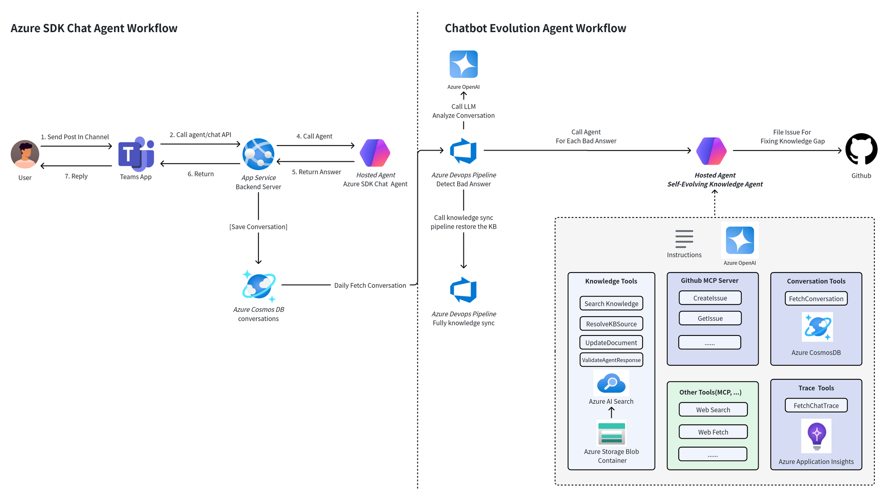

# Chatbot Evolution Agent Design

## 1 Background

When the chatbot's answer is wrong, today there is no systematic way to understand what the correct answer is, identify whether the underlying knowledge base (KB) is missing or stale, or close the gap so future similar queries are answered correctly. All follow-up is done manually by vendors investigating explicit thumbs-down feedback. The much more common implicit failure mode: an expert had to step in and answer — is never captured.

We are introducing a **Chatbot Evolution Agent** — a new hosted agent in the Foundry project. It automatically analyzes wrong answers, classifies the root cause, and proposes a concrete fix. For knowledge-base (KB) issues, the agent loops through candidate generation and validation until the original bad case passes, then files an issue. For chatbot self-issues, the agent files an issue with its diagnosis and suggested fix without entering the validation loop. The daily job also revisits agent-created issues after they are closed and reruns the original bad case to verify that the implemented fix works in the deployed dev Chat Agent. Rather than firing in real time off an endpoint, the flow is driven by a **daily batch scan** (see §2.3): the Bot Answer Evaluator judges each concluded QA thread, and any thread whose bot answer was wrong or unconfirmed is handed to the agent. Two human signals in the thread inform that judgement and the agent's analysis:

| Signal | Source | Description |
| --- | --- | --- |
| **Explicit** | User feedback card (`reaction == bad`) | User clicked thumbs-down on a bot answer; captured in the thread and surfaced by `fetch_conversation`. |
| **Implicit** | Expert reply in the thread | A human expert (non-author, non-bot) replies in a thread the bot has already answered — a strong implicit "the bot didn't fully solve it." |

## 2 Design

### 2.1 Architecture



The architecture has five execution planes:

- **Detection:** the daily feedback job identifies concluded conversations with an incorrect or unconfirmed bot answer.
- **Evolution loop:** the Evolution agent diagnoses the failure. For a KB issue, it writes a candidate to the existing dev knowledge source, validates the original bad case against the deployed dev Chat Agent, and revises until the case passes or the attempt limit is reached.
- **Issue creation:** after KB validation passes, the same Evolution agent creates the GitHub issue with the diagnosis, proposed source change, answer, trace ID, and validation evidence. For chatbot self-issues, it creates the issue immediately after diagnosis without validation.
- **Restoration:** the feedback orchestrator queues the knowledge-sync pipeline at most once per run when an Evolution-agent session mutated the KB or a closed KB issue is ready for validation, then waits for it to restore dev storage and search from authoritative upstream sources.
- **Closed-issue validation:** for an agent-created issue that has been closed but not yet checked, the Evolution agent reruns the original bad case, comments the result and trace ID on the issue, and labels the fix as passed or failed.

```text
failed QA record
    │
    ▼
Evolution agent diagnosis
    │
    ├── KB issue
    │     └── update_knowledge
    │           └── validate_agent_response(original bad case)
    │                 ├── fail → revise candidate and retry
    │                 └── pass → create_issue
    │
    └── chatbot self-issue → create_issue

after feedback sessions → if KB was mutated or a closed KB issue is pending → sync dev knowledge
closed agent-created issue → validate original bad case → comment evidence → label passed or failed
```

### 2.2 Agent Design

The Chatbot Evolution Agent is built on the `agent_framework` library and deployed as a Foundry hosted agent alongside the Chat Agent.

| Component | Purpose |
| --- | --- |
| **Instruction** | System prompt that tells the agent how to act as a feedback analyst: what the root-cause categories are, how to back up findings with evidence, and how to propose a safely testable fix. |
| **Tools** | Analysis: `fetch_chat_trace`, `fetch_conversation`, `search_knowledge_base` (reused), `web_fetch` (reused), and `resolve_kb_source`. Validation: guarded `update_knowledge` and `validate_agent_response`. Issue creation and closed-issue updates: existing GitHub MCP. |

#### 2.2.1 Tools

| Tool | File | Type | Description |
| --- | --- | --- | --- |
| `fetch_chat_trace` | `tools/monitor_tools.py` (new) | `FunctionTool` | Fetches the Chat Agent's App Insights trace by `trace_id` and returns the trace details: ordered tool calls (name, args summary, results summary, duration), retrieved chunks, final answer, prompt. |
| `fetch_conversation` | `tools/conversation_tools.py` (new) | `FunctionTool` | Returns the full thread transcript for the conversation under analysis (Cosmos `conversation-messages`); each bot message includes its `trace_id`. |
| `search_knowledge_base` | `tools/knowledge_tools.py` | `FunctionTool` | Re-runs targeted KB searches to confirm what is/isn't indexed today. Reused unchanged from the Chat Agent. |
| `web_fetch` | `tools/web_tools.py` | `FunctionTool` | Fetches the source-of-truth doc URL to detect drift between KB content and upstream docs. Reused unchanged from the Chat Agent. |
| `resolve_kb_source` | `tools/knowledge_tools.py` (extend) | `FunctionTool` | Maps the chunk's `source` folder to `{owner, repo, branch, path, labels}` by looking up `knowledge-config.json` from the `azure-sdk-qa-bot-knowledge-sync` project. |
| `create_issue` | `tools/github_mcp_tools.py` | MCP Server | The existing GitHub MCP tool. Creates a chatbot self-issue after diagnosis or a KB issue after validation passes. |
| `get_issue`, `add_issue_comment`, `update_issue` | `tools/github_mcp_tools.py` | MCP Server | Existing GitHub MCP tools used to read closed agent-created issues, record validation evidence, and replace the pending label with a passed or failed label. |
| `update_knowledge` | `tools/knowledge_tools.py` | `FunctionTool` | Writes candidate markdown to an existing tenant-configured folder in the dev knowledge container and refreshes the existing dev AI Search index. |
| `validate_agent_response` | `tools/chatagent_tools.py` | `FunctionTool` | Sends the original bad case to the deployed dev Chat Agent and returns its answer, trace ID, citations, retrieved documents, and pass/fail evidence. |

#### 2.2.2 Issue classification

The agent classifies each case into exactly one root cause and acts accordingly:

| Classification | Description | Category | Issue Repo |
| --- | --- | --- | --- |
| `missing_content` | No KB chunk covers the user's intent. | KB issue | `Azure/azure-sdk-pr` (cite KB source) |
| `outdated_content` | KB guidance contradicts or has drifted from the current source of truth. | KB issue | `Azure/azure-sdk-pr` (cite KB source) |
| `insufficient_content` | Related KB guidance exists but omits the rule, applicability, decision criteria, or cross-document connection needed for reasonable use. | KB issue | `Azure/azure-sdk-pr` (cite KB source) |
| `retrieval_mismatch` | Relevant chunks exist but were not retrieved. | System issue | `Azure/azure-sdk-pr` |
| `reasoning_gap` | Retrieved chunks explicitly state the correct rule and its applicability, but the bot reasoned poorly or ignored them. | System issue | `Azure/azure-sdk-pr` |
| `out_of_scope` | The intent is outside the tenant's scope. | System issue | `Azure/azure-sdk-pr` |

#### 2.2.3 Agent instruction

The analysis agent receives a small JSON payload identifying the failed turn (serialized as a single user message) and runs a bounded validation loop for KB fixes. For a KB classification it must include a bounded candidate markdown document. Chatbot self-issues skip validation and are created directly. The agent cannot perform arbitrary repository writes or write directly to production storage. Draft instruction:

```md
# Feedback Analyst Instructions

You are an Azure SDK QA feedback analyst. The Bot Answer Evaluator judged a
past bot answer wrong (a human contradicted it, or it was left unconfirmed).
Your job is to find the root cause of the bad answer and prepare a precise
issue. For a knowledge gap, validate the KB fix before creating the issue.

## Input

A JSON payload with: `tenant_id`, `conversation_id`, and
`conversation_type` — the coordinates of the whole QA thread.

## Workflow

1. **Gather evidence first — in parallel:**
   - `fetch_conversation(conversation_id, conversation_type)` — the full
     thread, including any expert reply (the ground-truth correct answer
     when an expert corrected the bot). Each bot message carries its
     `trace_id`.
   - `fetch_chat_trace(trace_id)` — using the `trace_id` of the bot turn
     under analysis (read from the transcript) — the bot's original tool
     calls, retrieved chunks, prompt, and final answer.
2. **Reproduce the retrieval.** Call `search_knowledge_base` with the user's
   intent to confirm what is indexed today. If a chunk looks stale, call
   `web_fetch` on its source URL to check for drift.
3. **Classify** the case into exactly one root cause (see taxonomy below).
4. **Propose a fix.** For `missing_content`, `outdated_content`, and `insufficient_content`, provide candidate markdown plus source/path and tenant metadata. For system issues, describe the suggested bot change.
5. **Validate KB remediation.** For `missing_content`, `outdated_content`, and `insufficient_content`,
   call `update_knowledge` to write the candidate into the matching existing
   dev knowledge folder, then call `validate_agent_response` with the original bad
   case. If it fails, revise the candidate and repeat within the attempt limit.
6. **Create the KB issue after validation.** When the original bad case passes,
   call `resolve_kb_source`, build the issue with the validation evidence, and
   call `create_issue`. Never create a KB issue before validation passes.
7. **Handle chatbot self-issues.** Record the diagnosis and suggested fix, then
   call `create_issue` without entering the validation loop.
8. **Return** the completed result.

## Classification

- `missing_content` — no KB chunk covers the intent (KB issue, cite source).
- `outdated_content` — KB contradicts the source URL (KB issue, cite source).
- `insufficient_content` — related KB content exists but is not reasonably usable without missing context or an undisclosed cross-document inference (KB issue, cite source).
- `retrieval_mismatch` — relevant chunks exist but weren't retrieved.
- `reasoning_gap` — chunks were retrieved but the bot reasoned poorly.
- `out_of_scope` — the intent is outside the tenant's scope.

## Output

Return **only** a single fixed-schema JSON object (no prose, no fences):
`status` (`completed` | `aborted`), `classification` (one taxonomy label
or `null`), `user_question` (one sentence summarizing what the user
asked), `root_cause` (one sentence with a file/URL citation),
`suggested_fix` (one sentence), `ground_truth` (grounded in the trace,
conversation, and search results — cite source URLs, or `null`),
`candidate_document` (or `null`), `validation_result` (or `null`),
`issue_url` (or `null`), and
`validation_interpretation` (or `null`).
Use real `null` for missing values; on abort set `status:"aborted"` with
the reason in `root_cause`.

## Rules

- Ground every claim in tool results — never invent KB state or URLs.
- When an expert corrected the bot, treat the expert's message as the
  correct answer and work backward to why the bot missed it.
- Redact PII (names, emails, tokens) from anything you write into an issue.
- Be concise; this output feeds a dataset and an issue, not a chat reply.
```

### 2.3 QA Status Table & Job Lifecycle

The feedback loop is driven by a **daily batch job** over a durable status table rather than by real-time endpoint triggers. Every QA thread the bot answered is recorded once in the `qa-records` Cosmos container (partition key `/tenant_id`, `id = {conversation_type}:{conversation_id}`), and each record carries **two status layers**:

| Layer | Field | States | Meaning |
| --- | --- | --- | --- |
| **1 — QA lifecycle** | `qa_status` | `ongoing` → `finished` \| `failed` | `ongoing` while the thread is still open; `finished` once it concluded with a **correct** bot answer (archived); `failed` once it concluded with an **incorrect/unknown** bot answer (worth a feedback analysis). |
| **2 — Feedback lifecycle** | `feedback.status` | `created` → `running` → `done` \| `failed` | Present only once `qa_status == failed`. Tracks the Evolution-agent loop and issue result. |

#### Daily scan (`scripts/run_feedback_jobs.py`, `pipelines/feedback-job.yml`)

1. **Ingest** — read conversation messages active in the window, aggregate them by `conversation_id` into threads, and upsert one QA record per thread (new threads start `ongoing`). Threads in **testing channels** (channel display name ends in `testing`, per `channel.yaml`) are excluded so the loop never files issues for test traffic.
2. **Evaluate** — for every `ongoing` record, ask the LLM judge (see §2.4) whether the thread has **finished** and whether the bot answered **correctly**:
    - still ongoing → stay `ongoing` (re-check next run);
    - finished + correct → `finished` (archived);
    - finished + incorrect/unknown → `failed`.
3. **Feedback** — for records that just turned `failed`, run the hosted chatbot evolution agent in-process via `ChatbotEvolutionAgentService.run_job` (§2.3.1).
4. **Closed-issue scan** — find closed agent-created issues labeled `fix-validation:pending`.
5. **Restore** — if any session mutated the KB or a closed KB issue needs validation, queue the knowledge-sync pipeline once and wait for successful restoration.
6. **Validate fixes** — rerun each closed issue's original bad case, comment the evidence, and replace `fix-validation:pending` with `fix-validation:passed` or `fix-validation:failed`.

The whole feature is gated by `CHATBOT_EVOLUTION_AGENT_ENABLED` so it can be disabled without a code rollback.

#### 2.3.1 Feedback-session invocation

The daily batch job (`scripts/run_feedback_jobs.py`) starts the Layer-2 analysis via `ChatbotEvolutionAgentService`. The hosted agent performs a bounded loop for KB issues: it gathers evidence, proposes a candidate, writes it to the existing dev knowledge source, calls the deployed dev Chat Agent, interprets the result, and revises the candidate when needed. The agent calls `create_issue` only after the original bad case passes. Chatbot self-issues skip validation and are created after diagnosis. In its second task, the job invokes the same agent to validate closed agent-created issues without proposing another fix.

The agent is invoked through the Responses API (`store=True`) with bounded analysis and iteration limits. The guarded tools own dev-storage writes, indexing, chatbot invocation, and evidence collection. No public issue is created for an unvalidated KB candidate.

The feedback orchestrator runs mutating sessions serially and validates each case immediately after its candidate update. Before `update_knowledge` writes anything, its wrapper sets a run-scoped `restore_required` Azure Pipelines output variable to `true`, ensuring that partial writes or later failures still trigger cleanup without adding fields to `QARecord`. After those sessions finish, the orchestrator queues `sync_knowledge.yml` once through the Azure DevOps Build REST API using `$(System.AccessToken)` when `restore_required` is `true` or a closed KB issue needs validation, waits for completion, and then validates the closed issues. The feedback job is not complete until required restoration and closed-issue validation finish.

#### QA record

Each row is a `QARecord` in the `qa-records` Cosmos container.

```typespec
@doc("Layer-1 lifecycle state of a QA thread")
union QAStatus {
  @doc("Thread still open / not yet conclusively judged")
  Ongoing: "ongoing",

  @doc("Thread concluded with a correct bot answer (archived)")
  Finished: "finished",

  @doc("Thread concluded with a wrong/unconfirmed answer (needs feedback)")
  Failed: "failed",
}

@doc("Layer-2 lifecycle state of the chatbot-evolution-agent analysis")
union FeedbackStatus {
  @doc("A feedback session has been requested/persisted")
  Created: "created",

  @doc("The hosted agent accepted and is processing")
  Running: "running",

  @doc("The agent finished and the result was persisted")
  Done: "done",

  @doc("The agent errored, timed out, or was cancelled")
  Failed: "failed",
}

@doc("Embedded Layer-2 feedback lifecycle")
model FeedbackState {
  status: FeedbackStatus;

  @doc("Failure context; absent while healthy")
  error?: string;

  created_at?: utcDateTime;
  updated_at?: utcDateTime;
}

@doc("Two-layer status row for one QA thread, in the `qa-records` Cosmos container")
model QARecord {
  @doc("Deterministic thread key `{conversation_type}:{conversation_id}`")
  id: string;

  @doc("Tenant the thread belongs to (partition key)")
  tenant_id: string;

  conversation_id: string;
  conversation_type: ConversationType;

  @doc("Teams channel the thread belongs to (used to exclude testing channels)")
  channel_id?: string;

  @doc("Deep link back to the conversation thread")
  message_link?: string;

  // -- Layer 1 --
  qa_status: QAStatus;

  @doc("The evaluator's verdict on the bot's answer")
  verdict?: string;
  reasoning?: string;
  confidence?: float32;
  has_expert_reply: boolean;
  message_count: int32;

  // -- Layer 2 (present once qa_status == failed) --
  feedback?: FeedbackState;

  last_activity_at?: utcDateTime;
  first_seen_at: utcDateTime;
  evaluated_at?: utcDateTime;
  created_at: utcDateTime;
  updated_at: utcDateTime;
}
```

### 2.4 Conversation Evaluation

The daily scan judges each `ongoing` thread with an LLM (`prompts/conversation_evaluation.md`, `ConversationService.evaluate_conversation`). The prompt decides **two things, in order**: first whether the conversation is **finished** (vs. still ongoing), then the **verdict** (`correct` / `incorrect` / `unknown`) driven by whether a human confirmed or corrected the bot. The `finished` gate is what lets a thread stay `ongoing` across runs until it actually concludes.


### 2.5 KB validation loop

Only KB classifications enter the automated validation loop. A knowledge-gap issue cannot be validated by rerunning the current production bot because the missing content is still absent. In the dev environment, the agent therefore writes candidate markdown into the existing tenant-configured knowledge folder, refreshes the existing dev index, and calls the deployed dev Chat Agent.

The Evolution agent owns the loop through two guarded tools:

1. Call `update_knowledge` to write the candidate to the existing dev knowledge source and refresh the index.
2. Call `validate_agent_response` with the original bad case.
3. If validation fails, revise the candidate and repeat within the attempt limit. If it passes, create the issue with the answer and trace ID as evidence.

After all agent sessions finish, fail, or time out, the feedback pipeline triggers the knowledge-sync pipeline once if any session mutated the KB. The feedback job waits for restoration from the authoritative sources and is marked failed if restoration does not succeed.

### 2.6 Issue creation

The Evolution agent may prepare the issue content during analysis, but it must complete the KB validation loop before creating the issue. Only after `validate_agent_response` shows that the original bad case passes may the agent call `create_issue` in **`Azure/azure-sdk-pr`** through the existing GitHub MCP tool ([`tools/github_mcp_tools.py`](../tools/github_mcp_tools.py)).

Every agent-created issue includes the sanitized original bad case and the `fix-validation:pending` label so the daily job can validate it after closure without adding fields to `QARecord`. For KB issues (`missing_content` / `outdated_content` / `insufficient_content`), the agent calls `resolve_kb_source` and cites the upstream source in the issue:

> **Title:** [Doc] No guidance on the TypeSpec `@added` versioning decorator
>
> **Labels:** `feedback-agent`, `classification:missing_content`
>
> **KB source:** `Azure/azure-rest-api-specs-pr` — `documentation/typespec/versioning.md`
>
> **Gap:** There is no documentation covering the `@added` decorator; the bot answered with a generic versioning explanation that did not address the question.
>
> **Suggested change:** Add a section to `versioning.md` documenting `@added`/`@removed`, with an example. Source: https://typespec.io/docs/libraries/versioning/reference/decorators
>
> **Validation:** The deployed dev Chat Agent passed the original bad case. Trace ID: `abc123def456`.

When the KB source is unmapped or non-GitHub, `resolve_kb_source` returns `resolved=false` and the agent records the raw folder name. Chatbot self-issues include the diagnosis and suggested fix but no validation evidence.

### 2.7 Closed-issue validation

The daily feedback job reads closed agent-created issues labeled `fix-validation:pending`. For a KB issue, it first waits for the knowledge-sync pipeline so the deployed dev Chat Agent uses the authoritative fixed content rather than the temporary candidate. The Evolution agent then calls `validate_agent_response` with the sanitized original bad case stored in the issue.

The agent comments the returned answer, trace ID, and pass/fail evidence on the closed issue. It replaces the pending label with `fix-validation:passed` when the original case now succeeds or `fix-validation:failed` when it does not; a failed validation does not automatically reopen the issue. The terminal label prevents the same closed issue from being validated again on later daily runs.
