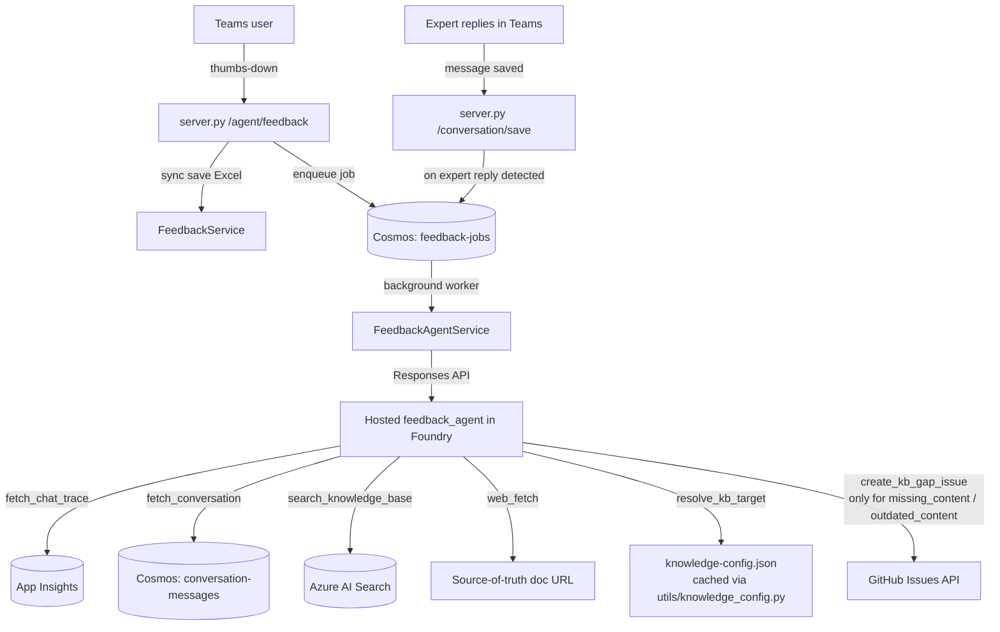

# Feedback Agent — Design Doc

**Status:** Draft
**Owner:** TBD
**Last updated:** 2026-06-03

---

## 1. Problem

Today, when the chat bot's answer does not meet a user's needs, there is no
systematic way to:

- Recognize the failure
- Understand what the user actually expected
- Identify whether the underlying knowledge base (KB) is missing content, has
  outdated content, or whether the retrieval/reasoning logic failed
- Close the gap so future similar queries are answered correctly

All of this is currently done manually by a small team scanning explicit
thumbs-down feedback (saved as Excel rows in blob storage) and following up
ad-hoc. There is no signal capture for the much more common implicit failure
modes (an expert had to step in and answer).

---

## 2. Goals & Non-Goals

### Goals (MVP)

- Detect two failure signals automatically:
  1. **Explicit** — user clicks thumbs-down (`reaction == bad`)
  2. **Implicit** — a human expert replies in a thread the bot has already
     answered, indicating the bot's answer was insufficient
- For each detected signal, asynchronously run a hosted LLM agent that:
  - Pulls the chat agent's full trace (tool calls, retrieved chunks, final
    answer) from App Insights using the `response_id`
  - Pulls the full conversation transcript from Cosmos
  - Infers the user's actual intent
  - Re-runs targeted KB searches and (when needed) fetches the source-of-truth
    doc from the web to detect drift
  - Classifies the root cause:
    `{ missing_content | outdated_content | retrieval_mismatch | reasoning_gap | out_of_scope }`
  - Drafts a corrected answer grounded in retrieved/fetched evidence
  - **Files a GitHub issue only for KB-content gaps** (`missing_content`,
    `outdated_content`) in the source-of-truth **docs/KB repo** for the
    affected tenant. Owned by the doc/KB curation team. Body emphasizes:
    what's missing or stale, suggested doc change, source URL, evidence of
    drift.
  - For `retrieval_mismatch`, `reasoning_gap`, and `out_of_scope`: **no
    issue is filed**. The classification, user-intent summary, suggested-fix
    summary, and corrected answer are still persisted to the `feedback-jobs`
    Cosmos record. These rows form a curated, labeled dataset that downstream
    tooling — notably **Foundry Agent Optimizer** — consumes to systematically
    improve `chat_agent` instructions, tool descriptions, and retrieval
    config. Optimizer is a better fit for bot-quality fixes than per-incident
    GitHub issues.
  - GitHub Issues (KB-side only) are the system of record for detected
    content gaps.

### Non-Goals (MVP — deferred to v2)

- **Filing bot-defect GitHub issues** to a bot-tracking repo for
  `retrieval_mismatch` / `reasoning_gap`. Foundry Agent Optimizer is the
  intended path for bot-quality fixes. We revisit issue filing only if the
  Optimizer loop proves too slow for prod regressions.
- Implicit signals other than expert reply (rephrasing, abandonment, follow-up
  timing)
- Automated draft **PR** generation against docs repos (requires GitHub App
  `contents:write` + human-out-of-loop policy review)
- Dedup of GitHub issues (filter via Issues Search API; v2)
- Automated KB re-indexing
- Learning-loop closure metrics (issue-merged → re-run query → "fixed?" score)
- Multi-turn conversational elicitation from the user (the agent works from
  the data it has; it does not chat with the end user)

---

## 3. Architecture

### 3.1 High-level flow



### 3.2 Components

| Component | New / Changed | Responsibility |
|---|---|---|
| `agents/feedback_agent/{agent.yaml, init.py, instruction.md, Dockerfile}` | New | Hosted LLM agent runtime |
| `tools/feedback_tools.py` | New | Agent's tool surface (see §4) |
| `utils/azure_monitor_query.py` | New | App Insights KQL wrapper |
| `utils/knowledge_config.py` | New | Fetch + cache `knowledge-config.json` from the `azure-sdk-qa-bot-knowledge-sync` repo; expose `{folder → owner, repo, branch, path, scope}` lookup |
| `services/feedback_agent_service.py` | New | Foundry Responses API client + job lifecycle |
| `services/conversation_service.py` | Changed | New `has_unprocessed_expert_reply()` helper |
| `services/feedback_service.py` | Unchanged | Continues Excel save as system-of-record |
| `server.py` | Changed | `/agent/feedback` and `/conversation/save` enqueue jobs |
| `utils/background_tasks.py` | Changed | `enqueue_feedback_analysis()` |
| `utils/azure_cosmosdb.py` | Changed | Container `feedback-jobs` |
| `models/feedback.py` | Changed | Add `conversation_id`, `conversation_type` |
| `pipelines/agent-cd.yml` | Changed | Add `feedback_agent` to deploy values |
| `requirements.txt` | Changed | Add `azure-monitor-query` |

---

## 4. Agent tool surface (`tools/feedback_tools.py`)

| Tool | Signature | Purpose |
|---|---|---|
| `fetch_chat_trace` | `(response_id: str) -> ChatTraceView` | Normalized view of chat_agent spans (resolved via `response_id` attribute on App Insights spans): ordered tool calls (name, args summary, results summary, duration), final answer, prompt. Token-budgeted. |
| `fetch_conversation` | `(conversation_id: str, conversation_type: str) -> list[Message]` | Wraps `ConversationService.get_messages_by_conversation`. |
| `search_knowledge_base` | reused unchanged from `tools/knowledge_tools.py` | Re-run targeted KB searches to confirm what is/isn't indexed today. |
| `web_fetch` | reused unchanged from `tools/web_tools.py` | Fetch the source-of-truth doc URL to detect drift. ≤1 call per turn. |
| `resolve_kb_target` | `(folder: str) -> KbTarget` | Returns `{owner, repo, branch, path, labels}` for the affected KB by looking up the chunk's `source` folder in the cached `knowledge-config.json`. Falls back to `FEEDBACK_DEFAULT_KB_GITHUB_REPO` if the folder maps to a non-issue-fileable source (e.g., internal ADO repo, wiki). Only called for `missing_content` / `outdated_content`. |
| `create_kb_gap_issue` | `(target: KbTarget, title: str, body: str) -> issue_url` | Direct GitHub REST `POST /repos/{owner}/{repo}/issues`. Auth: existing GitHub App JWT (requires `issues:write` on KB repos only). |

**Constraints (in instructions):**

- Max 8 tool calls per turn
- Max 1 `web_fetch` per turn
- Never invent doc content
- Always cite the source URL when claiming a fix
- Redact PII (emails, UPNs, user IDs) before issue creation

---

## 5. Triggering

### 5.1 Trigger A — Explicit `bad` reaction

1. Teams bot posts `POST /agent/feedback` with the existing payload **plus**
   new fields `conversation_id`, `conversation_type` (captured from the chat
   round-trip). The feedback API is conversation-scoped — it does **not**
   carry a `response_id`.
2. `server.py` synchronously calls `FeedbackService.process()` (Excel save) —
   unchanged behavior.
3. If `conversation_id` is present AND `FEEDBACK_AGENT_ENABLED == true`,
   resolve `response_id` from the **most recent assistant message** in that
   conversation (parse `bot-{response_id}` from `ConversationMessage.id`,
   same logic as §5.2), then append a fire-and-forget
   `enqueue_feedback_analysis(job)` call before returning. If no assistant
   message is found yet, skip enqueue (nothing to analyze).
4. Endpoint returns `FeedbackResponse(saved=true)` immediately — the user's
   feedback round-trip is not blocked on agent work.

### 5.2 Trigger B — Implicit expert-reply signal

1. Teams bot posts each new message to `POST /conversation/save` (existing).
2. `ConversationService.save_conversation()` persists the message.
3. **New**: if the saved message is `sender_role=user` and is **not** the
   original thread author, call a new helper
   `should_enqueue_expert_review(conversation_id, conversation_type)` which:
   - Locates the **most recent assistant message** preceding this expert
     reply and parses its `response_id` from `ConversationMessage.id`
     (format: `bot-{response_id}`). This is the specific bot response the
     expert is implicitly correcting. No schema change on
     `ConversationMessage`.
   - Confirms no `feedback-jobs` row already exists with
     the same `response_id`.
4. If yes, enqueue `feedback-jobs` row with `trigger=expert_reply,
   response_id=<parsed>`. Same downstream pipeline. Resolving the span at
   job-run time also tolerates App Insights ingestion lag (§8.1).

**Why this signal is high-signal:** in this product an expert manually
replying to a bot-answered thread is a strong implicit "the bot didn't fully
solve it" — it costs the expert time, so it's rarely a false positive.

### 5.3 Why async fire-and-forget

- The agent makes multiple LLM + tool calls (≥5s, often more); blocking the
  Teams round-trip is unacceptable
- Durable via `feedback-jobs` Cosmos row → retry / observe / cap budget
- Trivially extensible to v2 batch / scheduled triggers
- Process-bound worker (asyncio task on the backend) is acceptable for MVP
  volume; the `feedback-jobs` row is the durable state, the worker is
  stateless. v2 can move to a durable queue without changing the contract.

---

## 6. Data model changes

### 6.1 `FeedbackRequest` (extend `models/feedback.py`)

```python
class FeedbackRequest(BaseModel):
    channel_id: str
    tenant_id: str
    reaction: Reaction
    comment: str | None = None
    reasons: list[str] = []
    link: str | None = None
    user_name: str | None = None
    # NEW (required when reaction=bad)
    conversation_id: str | None = None
    conversation_type: ConversationType | None = None
```

`FeedbackResponse` is unchanged (`saved: bool`, `issue_url: str | None`).
`issue_url` stays `None` in the sync response — the issue is created
asynchronously.

### 6.2 `ConversationMessage` (no schema change)

The assistant message id is already persisted as `bot-{response_id}`
(see `ChatService._save_bot_answer_to_conversation`). `response_id` is
attributed on the hosted-agent's App Insights spans, so the expert-reply
trigger recovers the trace by parsing `response_id` from the assistant
message id and querying App Insights for the matching span — no new field
on `ConversationMessage` is required.

`fetch_chat_trace` takes `response_id` and resolves the matching App
Insights span.

### 6.3 `feedback-jobs` Cosmos container (new)

| Field | Type | Notes |
|---|---|---|
| `id` | str | `{conversation_id}:{trigger}:{timestamp}` |
| `tenant_id` | str | partition key |
| `trigger` | `"bad_reaction" \| "expert_reply"` | |
| `response_id` | str | from `bot-{response_id}` assistant message id; used by `fetch_chat_trace` to resolve the App Insights span |
| `conversation_id` | str | |
| `conversation_type` | str | |
| `comment`, `reasons` | str / list | for `bad_reaction` only |
| `status` | `"queued" \| "running" \| "done" \| "skipped"` | `skipped` covers `out_of_scope` and budget-cap cases |
| `created_at` / `updated_at` | iso8601 | |
| `classification` | enum \| null | set by agent on completion: `missing_content / outdated_content / retrieval_mismatch / reasoning_gap / out_of_scope` |
| `user_intent_summary` | str \| null | LLM-generated, populated on completion |
| `suggested_fix_summary` | str \| null | LLM-generated, populated on completion (curated dataset signal for Foundry Agent Optimizer in non-KB cases) |
| `corrected_answer` | str \| null | LLM-generated grounded answer; feeds Agent Optimizer eval dataset |
| `issue_url` | str \| null | populated only for `missing_content` / `outdated_content` |

### 6.4 Knowledge-source lookup (`utils/knowledge_config.py`)

The source-of-truth for KB → repo mapping is the existing
[`knowledge-config.json`](https://github.com/Azure/azure-sdk-tools/blob/main/tools/sdk-ai-bots/azure-sdk-qa-bot-knowledge-sync/config/knowledge-config.json)
in the `azure-sdk-qa-bot-knowledge-sync` repo. **No change to
`config/tenant_config.py` or per-tenant config is required.**

A new `utils/knowledge_config.py` helper:

- Fetches the raw JSON from
  `https://raw.githubusercontent.com/Azure/azure-sdk-tools/main/tools/sdk-ai-bots/azure-sdk-qa-bot-knowledge-sync/config/knowledge-config.json`
  on first access and caches in-process with a TTL (e.g., 1h).
- Parses `sources[].repository.url` + `sources[].paths[]` into a dict
  keyed by `paths[].folder` — the same value Azure AI Search returns as
  `chunk.source`, giving the agent a natural join key with zero new
  metadata.
- For each folder, derives `{owner, repo, branch, path, scope}`.
- Folders whose repository is not GitHub-issue-fileable (internal ADO
  repos, wikis without a public issues surface) map to `None`; the agent
  falls back to `FEEDBACK_DEFAULT_KB_GITHUB_REPO` (new app_config key)
  or skips issue creation.

The agent's `resolve_kb_target(folder)` is a pure lookup over this cache.

---

## 7. Agent instructions (sketch — `agents/feedback_agent/instruction.md`)

```
You are a KB-quality analyst for the Azure SDK QA bot.

Input payload (JSON):
  { trigger, tenant_id, conversation_id, conversation_type, response_id,
    user_feedback: { comment, reasons } | null }

Workflow:
  1. In parallel: fetch_chat_trace(response_id) and
                  fetch_conversation(conversation_id, conversation_type).
  2. Infer the user's actual intent from the full transcript — not only the
     final question. Consider follow-ups, rephrasings, expert correction.
  3. Re-run the searches the chat agent should have run via
     search_knowledge_base. Compare what came back to what the bot used.
  4. Classify exactly one root cause:
       missing_content     — no KB chunk covers the intent              (→ file KB issue)
       outdated_content    — KB has stale information vs. source URL    (→ file KB issue)
       retrieval_mismatch  — relevant chunks exist but were not retrieved (→ no issue; persist only)
       reasoning_gap       — chunks were retrieved but bot reasoned poorly (→ no issue; persist only)
       out_of_scope        — intent is outside this tenant's scope      (→ no issue; persist only)
  5. For missing_content / outdated_content only: use web_fetch (≤1) on the
     source URL to confirm drift.
  6. Draft the corrected answer, grounded strictly in retrieved or fetched
     evidence. Cite the source URL. (Always emitted — even for non-KB
     classifications — so it can be persisted to `feedback-jobs` as Agent
     Optimizer dataset signal.)
  7. **Issue filing is conditional**:
     - If classification ∈ {missing_content, outdated_content}:
         resolve_kb_target(folder)  # folder = `source` field of the
                                    # most relevant retrieved chunk
         → create_kb_gap_issue with body sections:
           ## User intent
           ## What the KB is missing or stale
           ## Suggested doc change (with source URL citation)
           ## Evidence of drift (if outdated_content)
           ## Conversation excerpt
           ## Response ID
         Labels: ["kb-gap", "tenant:{tenant_id}", "classification:{class}"]
     - Otherwise (retrieval_mismatch, reasoning_gap, out_of_scope): skip
       issue creation. Return classification + user_intent_summary +
       suggested_fix_summary + corrected_answer so the worker can persist
       them for downstream Agent Optimizer dataset curation.

Constraints:
  - Max 8 tool calls per turn.
  - Max 1 web_fetch per turn.
  - Never invent doc content. If unsure, classify as reasoning_gap and say so.
  - Redact emails, UPNs, and user IDs from the issue body.
  - If trace fetch returns empty (ingestion lag), respond with a structured
    error so the worker can retry.
```

---

## 8. Operational concerns

### 8.1 App Insights ingestion lag

Spans typically appear 1–3 minutes after emission. `fetch_chat_trace` retries
internally with short backoff; if still unavailable, the agent returns a
structured "trace_unavailable" outcome and the worker marks the job
`skipped`. Failures surface in Foundry agent traces (§9); no per-job error
column is maintained in v1.

### 8.2 GitHub App permission

Today's GitHub App is used in read-only MCP mode. Filing issues needs
`issues:write` on the same App, scoped to the **KB / docs repos** referenced
by `knowledge-config.json` (cross-org in some cases — e.g.
`Azure/azure-rest-api-specs`, `microsoft/typespec`, etc.).

**Action item:** confirm scope with App owner. Default is to upgrade the
existing App's scope since it already has org/repo visibility. No bot-side
repo permission is required for v1 (bot-quality classifications do not file
issues — see §2).

### 8.3 Cost / rate limiting

Per-event cost is non-trivial (reasoning model + several searches + optional
web fetch). MVP includes a daily cap via `FEEDBACK_AGENT_DAILY_BUDGET`
(integer count); when exceeded, jobs are enqueued with `status=skipped` and a
log warning. Defaults to a conservative value, tunable per environment.

### 8.4 Idempotency

- Explicit `bad_reaction`: `(response_id, "bad_reaction")` is the dedup key
  — same thumbs-down click cannot enqueue twice
- Expert-reply: `(response_id, "expert_reply")` enqueues at most once per
  **bot response** (a thread with N bot answers can produce up to N
  expert-review jobs). Later: collapse repeated expert replies against the
  same `response_id` within a short window.
- GitHub issue dedup is deferred to v2; MVP relies on the `feedback-jobs`
  dedup key to prevent re-running the agent on the same trigger

### 8.5 PII

Conversation transcripts contain user names, emails, UPNs. The agent's
instructions enforce redaction before issue body composition. As defense in
depth, `create_gap_issue` runs a regex pass for common PII patterns and
strips matches before POST.

### 8.6 Feature flag & rollback

`FEEDBACK_AGENT_ENABLED` (app_config) gates **both** triggers. When false:

- `/agent/feedback` behaves identically to today (no enqueue)
- `/conversation/save` skips the expert-reply check

This lets us ship and disable in production while we tune. No code rollback
required to disable.

---

## 9. Observability

- Every agent run produces a Foundry trace with `gen_ai.agent.name =
  azure-sdk-feedback-agent`, queryable alongside chat traces
- `FoundryAgentSpanEnricher` adds `microsoft.foundry.project.id` (same as
  chat_agent)
- Backend logs (App Insights) for: enqueue events, worker pickup, status
  transitions, retries, budget caps
- `feedback-jobs` container provides durable history with statuses and
  classifications → simple KQL / dashboard queries
- GitHub Issues (filtered by label `kb-gap` and `tenant:{tenant_id}`) are
  the canonical "what KB gaps did the agent find" surface — feeds future
  dedup, learning-loop metrics, and a v2 review dashboard
- `feedback-jobs` rows with `issue_url=null` (retrieval_mismatch /
  reasoning_gap / out_of_scope) are the canonical "bot-quality signal"
  surface, queryable by classification and tenant. These feed the v2
  Foundry Agent Optimizer dataset (see §12).

---

## 10. Verification plan

| # | Test | Method |
|---|---|---|
| 1 | Trace fetch returns normalized spans | `pytest tests/azure_monitor_query_test.py` (mocked KQL) |
| 2 | Agent boots locally | `agentdev run agents/feedback_agent/init.py --port 8088` |
| 3 | Each tool unit-tests pass | `pytest tests/feedback_tools_test.py` |
| 4 | Service job lifecycle (queued → running → done/failed) | `pytest tests/feedback_agent_service_test.py` |
| 5 | E2E (sandbox repo): `POST /agent/feedback` with `bad + real response_id` returns immediately; within ~30s, Foundry trace shows expected tool sequence; GitHub issue appears in sandbox; `feedback-jobs` row reaches `status=done` with `issue_url` populated | manual |
| 6 | E2E (sandbox): expert message saved → expert-reply job enqueued exactly once → issue filed | manual |
| 7 | Feature flag off → no regressions in `tests/api_test.rest` | manual |
| 8 | PII redaction spot-check | synthetic transcript with email/UPN; assert absent from issue body |
| 9 | Deployment | `python scripts/deploy_hosted_agent.py feedback_agent --tag <buildId>` reaches `active`; `agent-cd.yml` dropdown lists `feedback_agent` |

---

## 11. Open questions

1. **GitHub App `issues:write` scope** — reuse existing or provision new?
   Need to cover both the diverse KB/docs repos *and* the bot repo. May
   require two Apps if a single App cannot span all targets. Owner: App
   admin.
2. **Expert detection nuance** — is "non-author user reply" a good enough
   proxy? In Teams channels, multiple users routinely chat in a thread without
   any of them being a domain expert. Should we restrict to a configurable
   "expert allow-list" per tenant for MVP to avoid noise? Recommendation: add
   `EXPERT_USER_ALLOWLIST` per tenant in v1; relax in v2 once we have ground
   truth.

---

## 12. v2 roadmap (out of scope, planned)

- **Feed `feedback-jobs` into Foundry Agent Optimizer**: export rows where
  `classification ∈ {retrieval_mismatch, reasoning_gap}` as `eval.yaml`
  task entries (input = user query, criteria = corrected_answer). Run
  `azd ai agent optimize` monthly against `chat_agent` to systematically
  tune instructions, skills, and tool descriptions. This is the long-term
  fix for bot-quality issues — replaces filing per-incident bot-defect
  issues.
- Bot-defect issue filing to a tracking repo (e.g. `Azure/azure-sdk-pr`)
  for prod regressions Optimizer is too slow to catch — only if monitoring
  shows the monthly Optimizer cadence is insufficient.
- Additional implicit signals: rephrasing, abandonment, follow-up timing
- GitHub Issues dedup via Issues Search API + embedding similarity on issue
  body before creation
- Draft-PR generation (requires `contents:write`, branch policy, human
  approval gate)
- Closing-the-loop metrics: monitor issue merge events → re-run failing
  query → emit `kb_gap_closed` metric
- Review dashboard over GitHub Issues (filtered by label) for the curation team
- Move worker from in-process asyncio to a durable queue (Service Bus /
  Storage Queue) for horizontal scale
