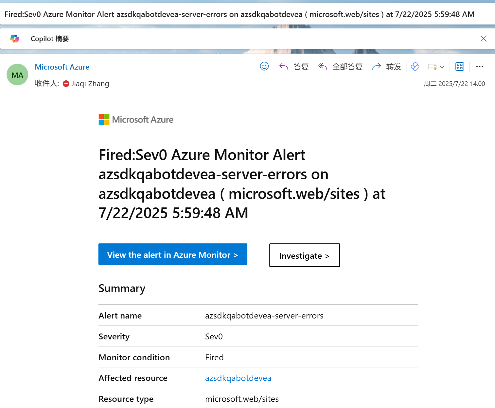

# Azure SDK Q&A Bot Troubleshooting Guide

This guide provides step-by-step instructions for troubleshooting issues with the Azure SDK Q&A Bot.

## Table of Contents

- [Deployments Overview](#deployments-overview)
- [Common Issues](#common-issues)
  - [1. Bot Not Responding](#1-bot-not-responding)
  - [2. AI Service Unavailable / Backend Alert](#2-ai-service-unavailable--backend-alert)
- [Log Analysis Workflow](#log-analysis-workflow)

## Deployments Overview

The bot operates in three environments. Use the links below to access the corresponding Azure resources.

| Environment | Backend Service | Frontend Service | Logic App (Auto Reply) | Teams Channel |
|---|---|---|---|---|
| **Dev** | [azuresdkqabot-dev-server](https://ms.portal.azure.com/#@microsoft.onmicrosoft.com/resource/subscriptions/a18897a6-7e44-457d-9260-f2854c0aca42/resourceGroups/azure-sdk-qa-bot-dev/providers/Microsoft.Web/sites/azuresdkqabot-dev-server/appServices) | [azsdkqabotdev](https://ms.portal.azure.com/#@microsoft.onmicrosoft.com/resource/subscriptions/a18897a6-7e44-457d-9260-f2854c0aca42/resourceGroups/azure-sdk-qa-bot-dev/providers/Microsoft.Web/sites/azsdkqabotdev/appServices) | [azuresdkqabot-dev-logicapp](https://ms.portal.azure.com/#@microsoft.onmicrosoft.com/resource/subscriptions/a18897a6-7e44-457d-9260-f2854c0aca42/resourceGroups/azure-sdk-qa-bot-dev/providers/Microsoft.Logic/workflows/azuresdkqabot-dev-logicapp/logicApp) | [Azure SDK QA Bot](https://teams.microsoft.com/l/team/19%3A3iefzURPmxhDZJJTtwePbdO1EdI5T0hfK9UFK_59Sbk1%40thread.tacv2/conversations?groupId=7ccc31f0-b371-450b-a73c-48f5a31a9b96&tenantId=72f988bf-86f1-41af-91ab-2d7cd011db47) |
| **Preview** | [azuresdkqabot-test-server](https://ms.portal.azure.com/#@microsoft.onmicrosoft.com/resource/subscriptions/a18897a6-7e44-457d-9260-f2854c0aca42/resourceGroups/azure-sdk-qa-bot-test/providers/Microsoft.Web/sites/azuresdkqabot-test-server/appServices) | [azsdkqabottest](https://ms.portal.azure.com/#@microsoft.onmicrosoft.com/resource/subscriptions/a18897a6-7e44-457d-9260-f2854c0aca42/resourceGroups/azure-sdk-qa-bot-test/providers/Microsoft.Web/sites/azsdkqabottest/appServices) | [azuresdkqabot-test-logicapp](https://ms.portal.azure.com/#@microsoft.onmicrosoft.com/resource/subscriptions/a18897a6-7e44-457d-9260-f2854c0aca42/resourceGroups/azure-sdk-qa-bot-test/providers/Microsoft.Logic/workflows/azuresdkqabot-test-logicapp/logicApp) | [Azure SDK Q&A Bot Testing](https://teams.microsoft.com/l/team/19%3ArMhMrxg7UjfwZmVoSeVvWvNQIfT_G6ds8napsytWqzw1%40thread.tacv2/conversations?groupId=39910aef-85da-4e30-b5e3-35f04ef38648&tenantId=72f988bf-86f1-41af-91ab-2d7cd011db47) |
| **Production** | [azuresdkqabot-server](https://ms.portal.azure.com/#@microsoft.onmicrosoft.com/resource/subscriptions/a18897a6-7e44-457d-9260-f2854c0aca42/resourceGroups/azure-sdk-qa-bot/providers/Microsoft.Web/sites/azuresdkqabot-server/appServices) | [azsdkqabot](https://ms.portal.azure.com/#@microsoft.onmicrosoft.com/resource/subscriptions/a18897a6-7e44-457d-9260-f2854c0aca42/resourceGroups/azure-sdk-qa-bot/providers/Microsoft.Web/sites/azsdkqabot/appServices) | [azuresdkqabot-logicapp](https://ms.portal.azure.com/#@microsoft.onmicrosoft.com/resource/subscriptions/a18897a6-7e44-457d-9260-f2854c0aca42/resourceGroups/azure-sdk-qa-bot/providers/Microsoft.Logic/workflows/azuresdkqabot-logicapp/logicApp) | [Azure SDK](https://teams.microsoft.com/l/team/19%3Af6d52ac6465c40ea80dc86b8be3825aa%40thread.skype/conversations?groupId=3e17dcb0-4257-4a30-b843-77f47f1d4121&tenantId=72f988bf-86f1-41af-91ab-2d7cd011db47) |

## Common Issues

### 1. Bot Not Responding

When the bot is not responding to messages in Teams, follow these steps.

#### Step 1: Check Logic App Run History

1. Open the appropriate environment's Logic App in Azure Portal.
2. Click **Development Tools** > **Run history**.
3. Find the run history entry that matches the exact time the message was posted.


#### Step 2: No Run History Found — Teams Connection Issue

If no matching entry is found, the Logic App has failed to detect new messages. This is most likely due to the **non-people account Teams connection** being expired or unavailable.

**Solution:** Reassign the Teams connection to your personal account. (As long as this account is present in the channel where the bot requires automated replies, message monitoring will work.)

1. Open **Development Tools** > **Logic App Designer**.

2. Click the first node: **"When a new message is added to a chat or channel"**, and check if the configuration can be loaded.

3. If the configuration fails to load, click **Connections** at the top, then click **Reassign** > **Add new**, and follow the sign-in steps.


4. Confirm that the connection has changed to your own account and the configuration loads successfully.
5. Wait for a new post in Teams to verify the bot responds.

#### Step 3: Run History Found but Failed

This is uncommon — once the Logic App triggers, it normally reaches the frontend bot. Click into the failed entry and expand the nodes to find the error.

##### 3.1 Timeout Error in "Invoke QA Bot" Node

If the error message is:
```
BadRequest
HTTP request failed: the server did not respond within the timeout limit.
Please see logic app limits at https://aka.ms/logic-apps-limits-and-config#http-limits.
```
This means the bot response took too long. The bot should still have replied — verify in the Teams channel.

##### 3.2 Other Errors — Check Frontend / Backend Logs

1. Navigate to the **Frontend Service** and search the logs using keywords from the failed request.
2. If no related logs are found, or the logs mention **"Failed to fetch data from RAG backend"**, check the **Backend Service** logs instead. (See [Log Analysis Workflow](#log-analysis-workflow).)

---

### 2. AI Service Unavailable / Backend Alert

When you receive an Azure alert for the backend, or the bot answers with *"Unable to establish a connection to the AI service at this time"*.



#### Step 1: Disable Auto Reply

Temporarily stop the Logic App to prevent further failures.

1. Navigate to the appropriate environment's Logic App in Azure Portal.
2. Click **Disable**.


#### Step 2: Check Logic App Run History

1. In the Logic App, click **Development Tools** > **Run history**.
2. Find the failed records.

3. Click into the failed record to view the error log.


#### Step 3: Analyze Error Logs

##### 3.1 Timeout Error in "Invoke QA Bot" Node

If the error is:
```
BadRequest
HTTP request failed: the server did not respond within the timeout limit.
Please see logic app limits at https://aka.ms/logic-apps-limits-and-config#http-limits.
```
The bot response was too slow but the bot should still have replied. Verify in the Teams channel.

##### 3.2 Other Errors — Check Frontend Service

1. Navigate to the **Frontend Service** in Azure Portal.
2. Search the logs using keywords from the failed request to find the conversation ID:
```kql
AppServiceConsoleLogs 
| where ResultDescription contains "Our service was recently assigned"
```


3. Use the conversation ID to filter related logs and analyze the error:
```kql
AppServiceConsoleLogs 
| where ResultDescription contains "19:906c1efbbec54dc8949ac736633e6bdf@thread.skype;messageid=1770672641211"
```


4. If the logs mention **"Failed to fetch data from RAG backend"**, check the **Backend Service** logs. (See [Log Analysis Workflow](#log-analysis-workflow).)

#### Step 4: Check Backend App Service

1. Navigate to the **Backend Service** in Azure Portal.
2. Click **Log stream** to check for real-time logs (e.g., `/ping` requests).
3. If there are no logs, the backend service is down. Use the deploy pipeline to redeploy, then test the endpoint (see README.md) or send a test message in Teams.
4. If the service is running, investigate using the [Log Analysis Workflow](#log-analysis-workflow) or disable the Logic App and wait for the developer to investigate.

#### Step 5: Enable Auto Reply

Once you have verified the bot is working again:

1. Navigate to the appropriate environment's Logic App in Azure Portal.
2. Click **Enable**.

---

## Log Analysis Workflow

### Step 1: Access App Service Logs

1. Navigate to the appropriate environment's App Service in Azure Portal.
2. Go to **Log stream** (real-time) or **Monitoring** > **Logs** (historical).
   - 
   - 
3. In **Logs**, select the **AppServiceConsoleLogs** table.
   - 

### Step 2: Trace a Request

#### 2.1 Set Time Range
Set a 15–30 minute window around the incident. Account for timezone differences.

#### 2.2 Search for the Initial Request
Search using the user's original query:
```kql
AppServiceConsoleLogs 
| where ResultDescription contains "your question"
```


#### 2.3 Extract Request ID
From the matching log entry, extract the UUID:
```
[RequestID: xxxxxxxx-xxxx-xxxx-xxxx-xxxxxxxxxxxx]
```

#### 2.4 Trace the Complete Request Flow
Filter all logs by Request ID:
```kql
AppServiceConsoleLogs 
| where ResultDescription contains "RequestID: xxx"
```


### Step 3: Analyze Log Components

#### 3.1 Query Processing

Look for these entries in order:

| Log Entry | What to Check |
|---|---|
| `[RequestID: xxx] Request: {"message":{"content":"user query"},...}` | Original request parsed correctly |
| `[RequestID: xxx] Searching query: processed_query_text` | Processed query makes sense |
| `[RequestID: xxx] Intent Result: category: Branded/Unbranded, intension: refined_question` | Intent recognition is accurate |

#### 3.2 Search Results

**Vector Search** — look for:
```
[RequestID: xxx] Vector searched chunk(high score): {document details}
[RequestID: xxx] Vector searched chunk: {document details}
[RequestID: xxx] Vector searched chunk(Q&A): {document details}
```

**Agentic Search** — look for:
```
[RequestID: xxx] Agentic search sub queries: [list of generated queries]
[RequestID: xxx] Agentic searched chunk: {document details}
```

**Key indicators:**
- **RerankScore ≥ 3**: High relevance
- **RerankScore 1.5–3**: Acceptable
- **RerankScore < 1.5**: Poor — may indicate a vague query or knowledge base gap
- `No results found with high relevance score, supply with normal results` — bot is using fallback results
- `Complete chunk: source/document` — high-relevance match triggered full document retrieval

#### 3.3 Performance Metrics

| Metric | Log Pattern |
|---|---|
| Intent recognition | `Intent recognition took: XXXms` |
| Vector search | `Vector Search took: XXXms` |
| Chunk processing | `Chunk processing took: XXXms` |
| Agentic search | `Agentic search took: XXXms` |
| OpenAI completion | `OpenAI completion took: XXXms` |
| **Total time** | `Total ChatCompletion time: XXXms` |

If total response time exceeds 10 seconds, identify which component is the bottleneck (typically OpenAI API latency or search index performance).

---

For additional assistance, refer to the main README.md or contact the development team.
