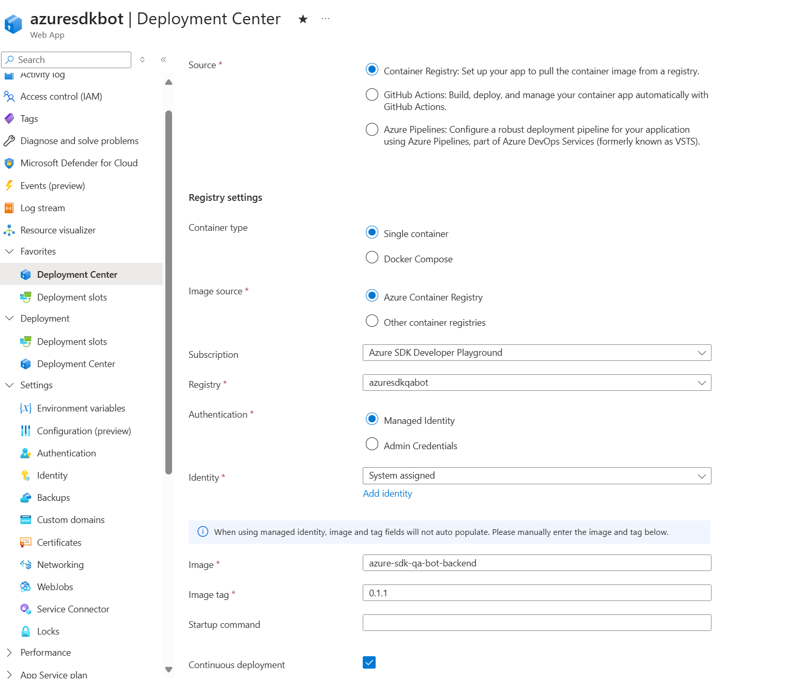
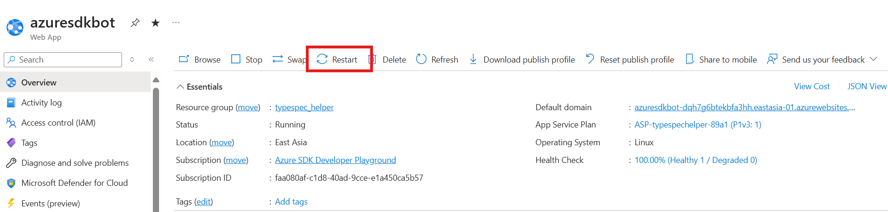

# Azure SDK Q&A Bot Backend Troubleshooting Guide

This guide provides step-by-step instructions for troubleshooting issues with the Azure SDK Q&A Bot across different environments.

## Table of Contents
- [Environment Overview](#environment-overview)
- [Log Analysis Workflow](#log-analysis-workflow)
- [Common Issues and Solutions](#common-issues-and-solutions)

## Environment Overview

The Azure SDK Q&A Bot operates in three environments, each with dedicated resources:

### Development Environment
- **Backend Service**: [azuresdkbot-dev](https://ms.portal.azure.com/#@microsoft.onmicrosoft.com/resource/subscriptions/faa080af-c1d8-40ad-9cce-e1a450ca5b57/resourceGroups/typespec_helper/providers/Microsoft.Web/sites/azuresdkbot/slots/azuresdkbot-dev/appServices)
- **Frontend Bot**: Azure SDK Q&A Bot dev-internal
- **Logic APP(For Auto Reply)**: [AzureSDKQABot-Dev-Internal](https://ms.portal.azure.com/#@microsoft.onmicrosoft.com/resource/subscriptions/faa080af-c1d8-40ad-9cce-e1a450ca5b57/resourceGroups/typespec_helper/providers/Microsoft.Logic/workflows/AzureSDKQABot-Dev-Internal/logicApp)
- **Channel**: [Azure SDK QA Bot - Demo](https://teams.microsoft.com/l/channel/19%3A3iefzURPmxhDZJJTtwePbdO1EdI5T0hfK9UFK_59Sbk1%40thread.tacv2/Azure%20SDK%20QA%20Bot%20-%20Demo?groupId=7ccc31f0-b371-450b-a73c-48f5a31a9b96&tenantId=72f988bf-86f1-41af-91ab-2d7cd011db47)

### Preview Environment
- **Backend Service**: [azuresdkbot-preview](https://ms.portal.azure.com/#resource/subscriptions/faa080af-c1d8-40ad-9cce-e1a450ca5b57/resourceGroups/typespec_helper/providers/Microsoft.Web/sites/azuresdkbot/slots/preview)
- **Frontend Bot**: Azure SDK Q&A Bot Dev
- **Logic APP(For Auto Reply)**: [AzureSDKQABot-Dev](https://ms.portal.azure.com/#@microsoft.onmicrosoft.com/resource/subscriptions/faa080af-c1d8-40ad-9cce-e1a450ca5b57/resourceGroups/typespec_helper/providers/Microsoft.Logic/workflows/AzureSDKQABot-Dev/logicApp)
- **Channel**: [Azure SDK QA bot for TypeSpec Testing](https://teams.microsoft.com/l/channel/19%3ArMhMrxg7UjfwZmVoSeVvWvNQIfT_G6ds8napsytWqzw1%40thread.tacv2/Azure%20SDK%20QA%20bot%20for%20TypeSpec%20Testing?groupId=39910aef-85da-4e30-b5e3-35f04ef38648&tenantId=72f988bf-86f1-41af-91ab-2d7cd011db47)

### Preview Environment(Onboarding Channel)
- **Backend Service**: [azuresdkbot-preview](https://ms.portal.azure.com/#resource/subscriptions/faa080af-c1d8-40ad-9cce-e1a450ca5b57/resourceGroups/typespec_helper/providers/Microsoft.Web/sites/azuresdkbot/slots/preview)
- **Frontend Bot**: Azure SDK Q&A Bot Dev
- **Logic APP(For Auto Reply)**: [AzureSDKQABot-Dev-Onboarding](https://ms.portal.azure.com/#@microsoft.onmicrosoft.com/resource/subscriptions/faa080af-c1d8-40ad-9cce-e1a450ca5b57/resourceGroups/typespec_helper/providers/Microsoft.Logic/workflows/AzureSDKQABot-Dev-Onboarding/logicApp)
- **Channel**: [Azure SDK QA bot for SDK Onboarding](https://teams.microsoft.com/l/channel/19%3A603d15bc0fd248ff82a8326da7322a4d%40thread.tacv2/Azure%20SDK%20QA%20bot%20for%20SDK%20Onboarding?groupId=39910aef-85da-4e30-b5e3-35f04ef38648&tenantId=72f988bf-86f1-41af-91ab-2d7cd011db47)

### Production Environment
- **Backend Service**: [azuresdkbot-prod](https://ms.portal.azure.com/#@microsoft.onmicrosoft.com/resource/subscriptions/faa080af-c1d8-40ad-9cce-e1a450ca5b57/resourceGroups/typespec_helper/providers/Microsoft.Web/sites/azuresdkbot/appServices)
- **Frontend Bot**: Azure SDK Q&A Bot
- **Logic App(For Auto Reply)**: [AzureSDKQABot-Prod](https://ms.portal.azure.com/#@microsoft.onmicrosoft.com/resource/subscriptions/faa080af-c1d8-40ad-9cce-e1a450ca5b57/resourceGroups/typespec_helper/providers/Microsoft.Logic/workflows/AzureSDKQABot-Prod/logicApp)
- **Channel**: [TypeSpec Disussion](https://teams.microsoft.com/l/channel/19%3A906c1efbbec54dc8949ac736633e6bdf%40thread.skype/TypeSpec%20Discussion?groupId=3e17dcb0-4257-4a30-b843-77f47f1d4121&tenantId=72f988bf-86f1-41af-91ab-2d7cd011db47)

## Service Recovery Workflow

When you received an alert from Azure related to production app service like this:


Or you found bot's answer contains 'AI service is not available', you need to follow this guide to recover the bot's service.

### Step 1: Disable Auto Reply

1. Navigate to the appropriate environment's Logic App in Azure Portal.
2. Click `Disable` button to avoid more failures. 


### Step 2: Check Logic App Run History

1. Navigate to the appropriate environment's Logic App in Azure Portal.
2. Click Development Tools/Run history
3. Find if there has any failed record

4. Click into failed record, find the error log

5. If the error log related to timeout, move to Step3 to check if app service is available, else it may caused by authentication issue or frondend issue, just disable the Logic App and wait for the developer to solve this issue.

### Step 3: Check App Service

1. Navigate to the appropriate environment's backend Service in Azure Portal.
2. Click `Log stream` to check if there has realtime logs(eg. /ping)
3. If there has no logs, which means backend service is breaking down. You need to navigate to `Deployment/Deployment Center`, and make sure the container config is correct.(Image and Image tag)

   - Restart app, and check log stream to make sure backend service is running.
   - Retry bad case by mentioning the bot to ask same question.

4. If service is working well. It may caused by some internal issue, you could investigate error by following in this document or just disable the Logic App and wait for the developer to solve this issue.

### Step 4: Enable Auto Reply

If you have retryed the bad case and the bot is available, you could enable the auto reply feature.

1. Navigate to the appropriate environment's Logic App in Azure Portal.
2. Click `Enable` button to avoid more failures. 


## Log Analysis Workflow

### Step 1: Access Azure App Service Logs

1. Navigate to the appropriate environment's App Service in Azure Portal
2. Go to **Log stream** or **Monitoring** > **Logs**
   - Log stream is the realtime logs 
   - Logs is the offline logs 
3. In **Logs**, click 'Select a Table' and select 'AppServiceConsoleLogs' 

### Step 2: Specify Request Timeline

Use this workflow to trace a specific user interaction:

#### 2.1 Set Time Range
- Determine when the issue occurred
- Set an appropriate time window (typically 15-30 minutes around the incident)
- Consider timezone differences if reported by users

#### 2.2 Search for Initial Request
Search using the user's original query to locate the request.

Look for log entries containing:
- `Request: {json_request}`
- The user's original question or query

1. KQL:
```kql
AppServiceConsoleLogs 
| where ResultDescription contains "your question"
```

2. UI:


#### 2.3 Extract Request ID
From the initial request log, extract the Request ID:
- Look for pattern: `[RequestID: xxxxxxxx-xxxx-xxxx-xxxx-xxxxxxxxxxxx]`
- Copy the complete UUID for the next step

#### 2.4 Trace Complete Request Flow
Search using the Request ID to get all related logs, order by time ascending

1. KQL:
```kql
AppServiceConsoleLogs 
| where ResultDescription contains "RequestID: xxx"
```

2. UI:


### Step 3: Analyze Key Log Components

#### 3.1 Query Processing Analysis
Look for these key log entries in this order:

**Original Request Parsing:**
```
[RequestID: xxx] Request: {"message":{"content":"user query"},...}
```

**Search Query Generation:**
```
[RequestID: xxx] Searching query: processed_query_text
```
- Verify the processed query makes sense
- Check if intent recognition modified the original query
- Look for `Intent Result: category: X, intension: Y`

**Intent Recognition Results:**
```
[RequestID: xxx] Intent Result: category: Branded/Unbranded, intension: refined_question
[RequestID: xxx] Intent recognition took: XXXms
```

#### 3.2 Search Results Analysis

**Vector Search Results:**
Look for entries like:
```
[RequestID: xxx] Vector searched chunk(high score): {document details}
[RequestID: xxx] Vector searched chunk: {document details}
[RequestID: xxx] Vector searched chunk(Q&A): {document details}
```

**Agentic Search Results:**
```
[RequestID: xxx] Agentic search sub queries: [list of generated queries]
[RequestID: xxx] Agentic search took: XXXms
[RequestID: xxx] Agentic searched chunk: 
```
**Key metrics to analyze:**
- **RerankScore**: Should be >=3 for high relevance, >=1.5 for acceptable
- **Chunk**: Check if appropriate sources are being found
- **Search timing**: `XXX Search took: XXXms`

#### 3.3 Performance Metrics
Track these timing metrics:
- Intent recognition: `Intent recognition took: XXXms`
- Search operation: `Vector Search took: XXXms`
- Chunk processing: `Chunk processing took: XXXms`
- Agentic search: `Agentic search took: XXXms`
- OpenAI completion: `OpenAI completion took: XXXms`
- Total time: `Total ChatCompletion time: XXXms`

### Step 4: Quality Assessment

#### 4.1 Search Quality Indicators

**Good Search Results:**
- Multiple chunks with RerankScore >= 2
- Relevant document categories for the query type
- Appropriate mix of documentation sources

**Poor Search Results:**
- All chunks have RerankScore <= 1.5
- No high-relevance chunks found
- Documents from irrelevant categories

#### 4.2 Common Search Issues

**Low Relevance Scores:**
```
[RequestID: xxx] Skipping result with low score: source/document, score: 0.1
```
- Indicates query might be too vague or out of scope
- Consider query preprocessing improvements

**No High-Score Results:**
```
[RequestID: xxx] No results found with high relevance score, supply with normal results
```
- Bot is using fallback results
- May indicate knowledge base gaps

**Complete Documents vs Chunks:**
```
[RequestID: xxx] Complete chunk: source/document
```
- High-relevance results trigger complete document retrieval
- Good indicator of confident matches

## Common Issues and Solutions

### Issue 1: Poor Search Results

**Symptoms:**
- Bot provides generic or irrelevant answers
- Low rerank scores across all results
- User feedback indicates missing information

**Troubleshooting Steps:**
1. Check the "Searching query" vs original user input
2. Verify intent recognition results
3. Examine rerank scores of returned documents
4. Validate search sources are appropriate for query type

**Solutions:**
- Update query preprocessing logic
- Improve intent recognition prompts
- Add missing documentation to knowledge base
- Adjust rerank score thresholds

### Issue 2: Slow Response Times

**Symptoms:**
- Total response time > 10 seconds
- User timeouts or complaints about performance

**Troubleshooting Steps:**
1. Check individual component timings
2. Identify the slowest operation
3. Verify external service health (OpenAI, Search)

**Common Bottlenecks:**
- OpenAI API latency
- Large document processing
- Search index performance
- Network connectivity issues

### Issue 3: Authentication Errors

**Symptoms:**
- 401/403 errors in logs
- "Failed to get token" messages
- Service unavailable responses

**Troubleshooting Steps:**
1. Verify Managed Identity configuration
2. Check token acquisition logs
3. Validate service permissions

### Issue 4: Image Processing Issues

**Symptoms:**
- Images not processed correctly
- "Failed to download attachment" errors

**Troubleshooting Steps:**
1. Check image URL format and accessibility
2. Verify Bot Framework authentication
3. Validate image encoding process

---

For additional assistance, refer to the main README.md or contact the development team.
