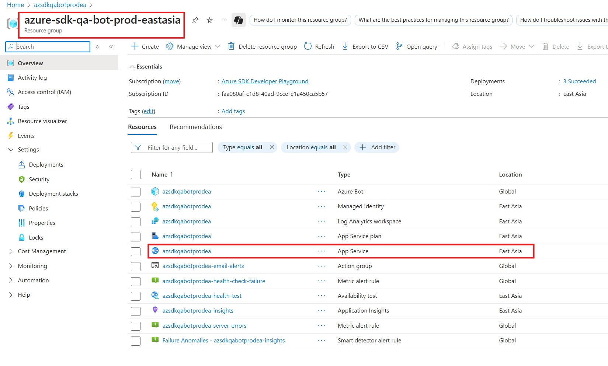
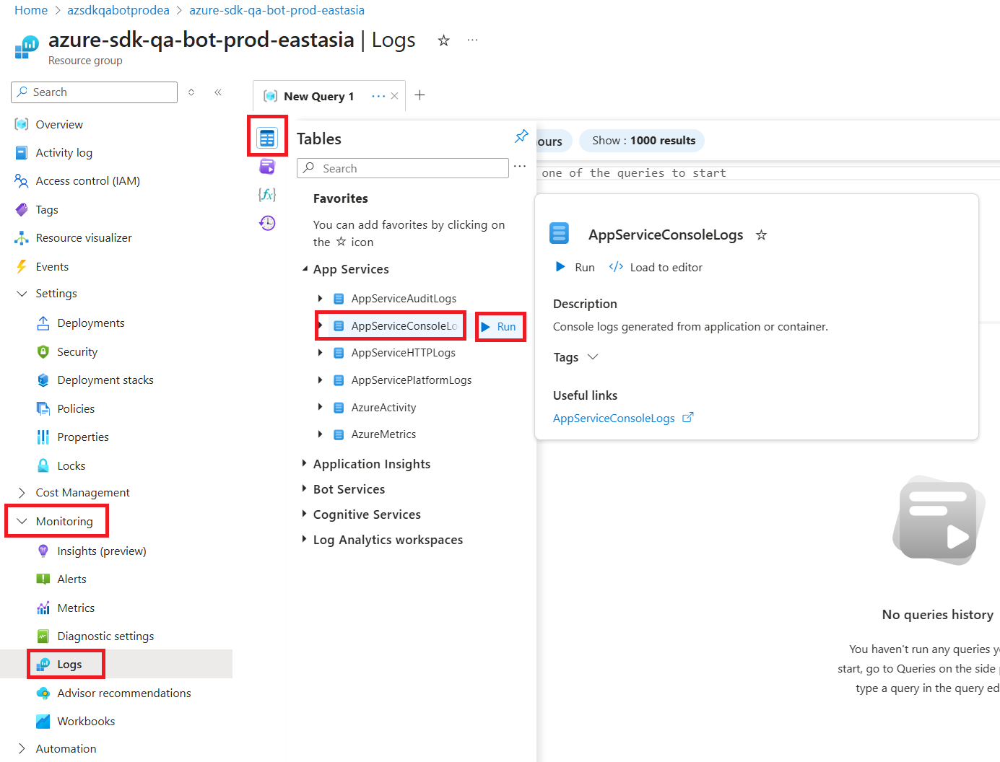
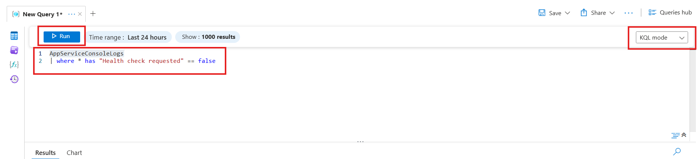
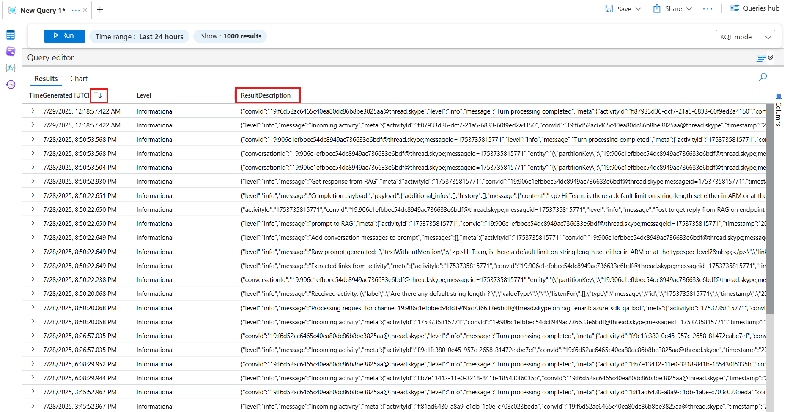
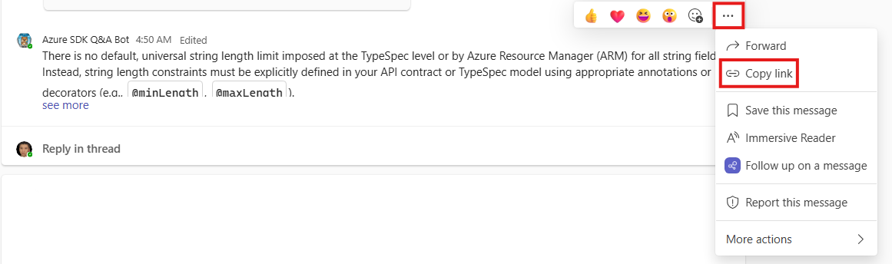
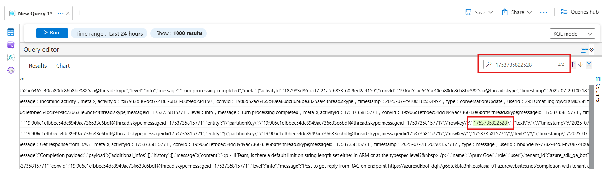

# Overview of the Azure SDK QA Bot

## Get started with the template

> **Prerequisites**
>
> To run the template in your local dev machine, you will need:
>
> - [Node.js](https://nodejs.org/), supported versions: 18, 20, 22.
> - [Teams Toolkit Visual Studio Code Extension](https://aka.ms/teams-toolkit) latest version or [Teams Toolkit CLI](https://aka.ms/teamsfx-toolkit-cli).

1. Press F5 to start debugging which launches your app in Teams App Test Tool using a web browser. Select `Debug in Test Tool`.
1. You can send any message to get a response from the bot.

**Congratulations**! You are running an application that can now interact with users in Teams App Test Tool:


## What's included in the template

| Folder       | Contents                                     |
| ------------ | -------------------------------------------- |
| `.vscode`    | VSCode files for debugging                   |
| `appPackage` | Templates for the Teams application manifest |
| `env`        | Environment files                            |
| `infra`      | Templates for provisioning Azure resources   |
| `src`        | The source code for the application          |

The following are Teams Toolkit specific project files. You can [visit a complete guide on Github](https://github.com/OfficeDev/TeamsFx/wiki/Teams-Toolkit-Visual-Studio-Code-v5-Guide#overview) to understand how Teams Toolkit works.

| File                    | Contents                                                                                                                                  |
| ----------------------- | ----------------------------------------------------------------------------------------------------------------------------------------- |
| `teamsapp.yml`          | This is the main Teams Toolkit project file. The project file defines two primary things: Properties and configuration Stage definitions. |
| `teamsapp.testtool.yml` | This overrides `teamsapp.yml` with actions that enable local execution and debugging in Teams App Test Tool.                              |

## Azure Resources

The Azure resources for this bot follow a consistent naming pattern:

### Resource Group Naming

Resource groups are named using the pattern: `azure-sdk-qa-bot-<environment>-<region>`

For example: `azure-sdk-qa-bot-prod-eastasia` - Production environment in East Asia region

### Resource Naming

Individual Azure resources within the resource groups are prefixed with: `azsdkqabot<environment><region>`.

For example, resources in the production East Asia environment would be prefixed with:

- `azsdkqabotprodea` (where "prod" is the environment and "ea" represents East Asia)

This naming convention ensures consistency and makes it easy to identify which environment and region each resource belongs to.

## Debug in local

we can debug/test bot frontend and backend service locally.
> **Prerequisites**
>
> - Install [Teams Toolkit VS Code Extension](https://marketplace.visualstudio.com/items?itemName=TeamsDevApp.ms-teams-vscode-extension)

### Start Backend Service

```bash
cd ../azure-sdk-qa-bot-backend
go mod download
go run main.go
```

### Start Bot app

1. Click 'Debug in Microsoft 365 Agents Playground' button in ENVIRONMENT 'testtool'
   
2. choose 'Node.js' -> Run Script: dev:teamsfx:testtool

### Start Microsoft 365 Agents Playground - Simulate Teams Channel

1. Click 'Debug in Microsoft 365 Agents Playground' button in ENVIRONMENT 'testtool'
2. choose 'Node.js' -> Run Script: dev:teamsfx:launch-teams-testtool

### Test

Type question in Microsoft 365 Agents Playground

## Deploy to Azure

## Environments

`<env>` mentioned below sections can be found in `env/.env.*` as the last part, which indicate the environments for the bot.

- prod: Production environment for Azure SDK team
- preprod: Pre-production environment for Azure SDK Q&A Bot Testing team
- dev: Dev environment for Azure SDK QA Bot team

## Deployment

This section describes how to update bot service logic in Azure web app

> **Prerequisites**
>
> - Install [Teams Toolkit VS Code Extension](https://marketplace.visualstudio.com/items?itemName=TeamsDevApp.ms-teams-vscode-extension)
>   - Make sure accounts are logged in in `ACCOUNTS` tab
>
> - acr-name-for-env: use the name of the ACR in the same resource group
> - make sure the required azure resources are deployed:
>   - resource group
>   - storage account: store the conversation and feedback
>   - ACR: Azure container register for docker image
>   - azure sdk backend service

1. Run `az login`
2. Run `./scripts/setup-docker-image.ps1 -Tag <env>-<version> -Push -AcrName <acr-name-for-env>` to build and push docker image
3. Update `DOCKER_IMAGE_TAG` in `.env.<env>`
4. Click `Provision` button in the extension to update the docker tag.

## Troubleshooting

The troubleshooting process involves identifying the root cause through logs, fixing issues when necessary by submitting Pull Requests, and using the Teams Toolkit Visual Studio Code Extension for provisioning or deployment. In rare cases, you may need to uninstall and reinstall the bot in Teams.

### Troubleshooting Through App Service Logs

#### Step 1: Locate the App Service in Azure Portal

1. Navigate to the Azure Portal and find the appropriate resource group based on the naming pattern described in the Azure Resources section above.
2. Look for the App Service resource within the resource group (it will have the prefix `azsdkqabot<environment><region>`). For more details, refer to [Azure Resources](#azure-resources) section.



_Example: The `azure-sdk-qa-bot-prod-eastasia` resource group showing the App Service `azsdkqabotprodea` and other related resources._

#### Step 2: Access App Service Logs

1. In the App Service resource, expand the **Monitoring** section in the left-side menu.
2. Click on **Logs**.
3. Click on **Tables** tab.
4. Expand the **AppServices** category.
5. Find **AppServiceConsoleLogs** and click the **Run** button on the right side to query the logs.



#### Step 3: [Optional] Write Custom Query to Filter Logs

1. Switch to **KQL** mode.
2. Add the following query condition to filter out health check logs:
   ```kql
   AppServiceConsoleLogs
   | where * has "Health check requested" == false
   ```
3. Click the **Run** button to update the query results with the filtered logs.



> **Note:** For more information about working with logs and KQL queries, please refer to the [Log Analytics workspace documentation](https://learn.microsoft.com/en-us/azure/azure-monitor/logs/log-analytics-workspace-overview). For KQL syntax reference, see [Keyword Query Language (KQL) syntax reference](https://learn.microsoft.com/en-us/sharepoint/dev/general-development/keyword-query-language-kql-syntax-reference).

#### Step 4: Analyze the Logs

1. Query the logs you are interested in. The console logs are located in the **ResultDescription** column.
2. Use the magnifying glass icon (🔍) in the top-right corner for quick search functionality.
3. Sort by **TimeGenerated** column to get logs in chronological order for easier reading and analysis.

> **Important:** Log ingestion may have delays. Based on experience, the maximum delay can be several minutes. It is recommended to wait patiently for some time after sending messages before querying the logs.



4. **Search logs by message content**: You can usually search logs directly using the message content.
5. **Search by Teams Activity ID** (for duplicate messages): If messages are duplicated, you can get a unique identifier by:
   1. Right-clicking the message in Teams and selecting the three dots in the upper right corner
   1. Click **Copy link**
   1. The link follows this pattern: `https://teams.microsoft.com/l/message/<channel-id>/<activity-id>?<queries>`
   1. For example, in the link `https://teams.microsoft.com/l/message/19:rMhMrxg7UjfwZmVoSeVvWvNQIfT_G6ds8napsytWqzw1@thread.tacv2/1753756500464`, the activity ID is `1753756500464`
   1. Use this activity ID to search in the logs for precise message identification




> **Note:** For more information about working with logs and KQL queries, please refer to the [Log Analytics workspace documentation](https://learn.microsoft.com/en-us/azure/azure-monitor/logs/log-analytics-workspace-overview). For KQL syntax reference, see [Keyword Query Language (KQL) syntax reference](https://learn.microsoft.com/en-us/sharepoint/dev/general-development/keyword-query-language-kql-syntax-reference).

## Additional information and references

- [Teams Toolkit Documentations](https://docs.microsoft.com/microsoftteams/platform/toolkit/teams-toolkit-fundamentals)
- [Teams Toolkit CLI](https://aka.ms/teamsfx-toolkit-cli)
- [Teams Toolkit Samples](https://github.com/OfficeDev/TeamsFx-Samples)
